<!-- [KFM_META_BLOCK_V2]
doc_id: kfm://doc/docs/connectors/genealogy/readme
title: docs/connectors/genealogy
type: standard
version: v1
status: draft
owners: @bartytime4life
created: 2026-03-29
updated: 2026-04-16
policy_label: restricted
related: [
  ../../README.md,
  ../README.md,
  ../../schemas/genealogy/README.md,
  ../../tests/policy/genealogy/README.md,
  ../../tests/e2e/runtime_proof/genealogy/README.md,
  ../../policy/README.md,
  ../../contracts/README.md,
  ../../.github/workflows/README.md
]
tags: [kfm, genealogy, connectors, intake, consent, dna, publication-safety]
notes: [
  Connector and intake guidance for genealogy source families.
  This README stays implementation-adjacent but does not claim mounted connector code, workflow YAML, or deployment state unless branch-visible.
]
[/KFM_META_BLOCK_V2] -->

<a id="top"></a>

# `docs/connectors/genealogy/`

Governed intake guidance for genealogy source families inside KFM’s truth path: FamilySearch API retrieval, user-supplied GEDCOM/GEDZip, and restricted DNA-related uploads.

> [!NOTE]
> **Status:** `draft`  
> **Owners:** `@bartytime4life`  
> **Path:** `docs/connectors/genealogy/README.md`  
> **Posture:** intake guidance · restricted sensitivity · truth-path aligned · implementation-adjacent  
> 
> 
> 
> 
> 
> 
>
> **Quick jumps:** [Scope](#scope) · [Evidence posture](#evidence-posture) · [Repo fit](#repo-fit) · [Accepted inputs](#accepted-inputs) · [Exclusions](#exclusions) · [Connector modes](#connector-modes) · [Truth path](#truth-path-and-trust-posture) · [Policy gates](#policy-gates) · [Normalization boundaries](#normalization-boundaries) · [Validation](#validation-and-test-requirements) · [Status matrix](#status-matrix) · [Task list](#task-list--definition-of-done) · [Appendix](#appendix)

> [!IMPORTANT]
> This leaf defines **connector and intake posture**, not final policy law, canonical schema authority, release proof, or runtime-proof behavior. It should complement those surfaces without quietly taking over their jobs.

> [!WARNING]
> Genealogy connectors are high-burden surfaces. Living-person records, raw genotype files, DNA matches, exact private-family locations, and user-contributed assertions must not slide into outward-safe publication by default.

---

## Scope

This directory documents a KFM-governed intake surface for genealogy material centered on a small set of source families:

| Source family | Intake mode | Current posture |
|---|---|---|
| **FamilySearch** | authenticated API retrieval and GEDCOM-X-adjacent structured data handling | **PROPOSED / INFERRED** |
| **GEDCOM / GEDZip** | user-supplied tree export upload | **PROPOSED / INFERRED** |
| **Raw DNA / genotype export** | user-supplied restricted upload only | **PROPOSED** |
| **DNA match / segment export** | user-supplied CSV/tool export where officially obtainable | **PROPOSED / NEEDS VERIFICATION** |

This is **not** a generic “family tree importer.”  
It is an intake lane that keeps genealogy material subordinate to:

- the canonical truth path
- the trust membrane
- rights and sensitivity review
- public-safe publication rules
- visible correction and revocation lineage

### Why this belongs in KFM

Genealogy overlaps multiple already-legible KFM burdens rather than introducing a separate unconstrained domain:

| KFM pressure | Why it matters here |
|---|---|
| historical boundaries and settlement geography | birth, death, residence, migration, and nativity are time-aware and support-sensitive |
| land tenure and cadastral history | family records often intersect title chains, plats, deeds, and homestead context |
| archives, newspapers, and public memory | family narratives and cited records are documentary evidence, not automatic truth |
| governed publication | not every processed family-history artifact is suitable for outward release |

[Back to top](#top)

---

## Evidence posture

| Surface or claim | Status | Why it matters |
|---|---|---|
| This README path is a real genealogy connector doc target | **CONFIRMED** | the leaf is real and worth filling in |
| Genealogy intake should remain subordinate to the truth path and trust membrane | **CONFIRMED doctrine** | connector behavior must not bypass governed KFM flows |
| FamilySearch is the strongest candidate for an authenticated connector path | **INFERRED / PROPOSED** | structured API retrieval is more governable than scraping or UI-driven sync |
| GEDCOM / GEDZip should be treated as governed user-export intake | **INFERRED / PROPOSED** | export upload is a plausible intake shape without implying live sync |
| Raw DNA and match exports are restricted by default | **CONFIRMED doctrinal fit / PROPOSED localization** | highly sensitive material should not be treated as public-safe input |
| Exact mounted connector code, workflow YAML, and deployment state | **NEEDS VERIFICATION** | do not imply implementation exists unless branch-visible |
| Vendor-specific automation breadth beyond official or user-export paths | **NEEDS VERIFICATION** | do not normalize scraping, unofficial APIs, or unsupported exports as repo fact |

[Back to top](#top)

---

## Repo fit

**Path:** `docs/connectors/genealogy/README.md`  
**Role in repo:** connector and intake guidance for genealogy source families, source roles, and disclosure-aware handling.

### Path and neighboring surfaces

| Direction | Surface | Why it matters |
|---|---|---|
| Upstream | [`../README.md`](../README.md) | keeps this leaf subordinate to the broader connectors/docs lane |
| Upstream | [`../../README.md`](../../README.md) | broader repo context and documentation posture |
| Lateral | [`../../schemas/genealogy/README.md`](../../schemas/genealogy/README.md) | schema-side object-family and field-semantics guidance |
| Lateral | [`../../tests/policy/genealogy/README.md`](../../tests/policy/genealogy/README.md) | policy-behavior proof for consent, living-person, DNA, and publication-control burdens |
| Lateral | [`../../tests/e2e/runtime_proof/genealogy/README.md`](../../tests/e2e/runtime_proof/genealogy/README.md) | request-time proof for finite genealogy outcomes |
| Authority | [`../../policy/README.md`](../../policy/README.md) | deny-by-default law and obligations remain authoritative there |
| Authority | [`../../contracts/README.md`](../../contracts/README.md) | trust-bearing object families and canonical machine contracts stay there |
| Workflow boundary | [`../../.github/workflows/README.md`](../../.github/workflows/README.md) | workflow enforcement should be proven there or in actual YAML |

### Working placement rule

Put a change here when it primarily defines:

- source-family distinctions
- allowed connector modes
- intake posture and rights boundaries
- normalization boundaries at the source edge
- truth-path placement for raw vs work vs processed flows

Move it elsewhere when it primarily defines:

- **policy law**
- **schema authority**
- **runtime or release proof**
- **workflow enforcement**
- **canonical contract ownership**

> [!TIP]
> This README should behave like a **connector-intake lane with governance pressure**, not like a mini master manual for genealogy.

[Back to top](#top)

---

## Accepted inputs

| Input family | Typical format | Status | Notes |
|---|---|---:|---|
| Tree export | GEDCOM 5.5.1 / GEDCOM 7 | **PROPOSED** | primary portable tree-interchange path |
| Tree bundle | GEDZip / GEDCOM 7 bundle | **PROPOSED** | especially relevant for FamilySearch-adjacent workflows |
| Programmatic tree/person/place data | FamilySearch API payloads | **PROPOSED** | requires official auth flow and approved app posture |
| Raw DNA / genotype export | vendor TXT / ZIP | **PROPOSED** | restricted by default; not public-safe |
| Match / segment export | vendor CSV / tool export | **PROPOSED / NEEDS VERIFICATION** | availability varies sharply by vendor |
| Place strings for normalization | free text + event date | **PROPOSED** | must remain date-aware and source-linked |
| Consent and rights artifacts | consent token, rights notes, upload scope | **PROPOSED** | required for sensitive handling decisions |

### Input rules

1. Keep **source family explicit**.
2. Keep **source role explicit**: documentary, user-contributed, statutory, or discovery/mirror.
3. Keep **living-person and DNA sensitivity** visible at intake time.
4. Preserve **original source expressions** such as place strings and file hashes.
5. Keep **restricted uploads** separate from any public-safe derivative.
6. Treat **match summaries**, **tree assertions**, and **documentary evidence** as distinct object families.

[Back to top](#top)

---

## Exclusions

This surface does **not** authorize or normalize the following:

| Excluded behavior | Why excluded | Where it belongs instead |
|---|---|---|
| UI scraping of vendor sites | brittle, terms-sensitive, and difficult to govern | nowhere here unless explicitly approved and documented elsewhere |
| unofficial API use that violates vendor terms | rights and compliance burden too high | nowhere here |
| unsupported DNA match-list downloaders | not a stable or governable intake basis | nowhere here |
| direct publication of living persons | not public-safe by default | policy, review, and release gates |
| direct publication of raw genotype data | too sensitive | restricted/private handling only |
| outward exposure of exact private-family or sensitive exact locations | disclosure risk too high | generalized or withheld downstream handling |
| treating inferred kinship graphs or embeddings as authoritative truth | derived projections are not sovereign evidence | derived/rebuildable surfaces with explicit provenance |
| connector docs becoming runtime or release proof | wrong lane ownership | runtime-proof or release-assembly lanes |

> [!WARNING]
> Derived genealogical graphs are **not authoritative by default**. They are rebuildable projections unless explicitly promoted through KFM review and release paths.

[Back to top](#top)

---

## Connector modes

### FamilySearch connector

**Recommended posture (`PROPOSED / INFERRED`)**

FamilySearch is the strongest candidate for an authenticated connector path because it offers a structured, governable retrieval surface compared with scraping-oriented alternatives.

**KFM handling rules**

- use official auth and approved app flow
- keep retrieval scoped and auditable
- prefer structured API retrieval over manual scraping
- treat place-resolution assistance as a derived aid, not proof of event truth
- keep webhook, push, or change-history integration marked **PROPOSED** until branch-visible

### GEDCOM / GEDZip intake

**Recommended posture (`PROPOSED / INFERRED`)**

GEDCOM-family artifacts should be treated as **user-supplied export intake**, not sovereign truth.

**KFM handling rules**

- preserve original export artifacts in governed intake zones
- normalize into smaller reviewable object families
- retain vendor/custom tag visibility where required
- keep original place strings alongside normalized forms
- do not flatten all GEDCOM-family imports into a single assumed truth class

### Raw DNA / genotype intake

**Recommended posture (`PROPOSED`)**

Raw genotype upload is a **restricted-only** intake path and should require explicit consent and strong handling boundaries.

**KFM handling rules**

- restricted by default
- not outward-safe by default
- no public release unless separately governed and explicitly authorized
- no silent conversion into broader analytics surfaces
- keep consent scope and revocation burden visible

### Match / segment intake

**Recommended posture (`PROPOSED / NEEDS VERIFICATION`)**

Where vendors officially permit download, segment or match exports may be accepted as **restricted evidence overlays**, not as direct pedigree truth.

**KFM handling rules**

- preserve originals
- normalize into restricted summary or evidence objects
- keep match-derived hints visibly derived
- do not let segment evidence silently rewrite family-tree assertions

[Back to top](#top)

---

## Truth path and trust posture

```mermaid
flowchart LR
    A["FamilySearch API / User Export / DNA Upload"] --> B["SourceDescriptor + intake metadata"]
    B --> C["RAW"]
    C --> D["WORK / QUARANTINE"]
    D --> E["Validation + rights / sensitivity gates"]
    E --> F["PROCESSED"]
    F --> G["Catalog / policy / review plane"]
    G --> H["PUBLISHED"]
    G --> I["Derived projections"]
    I --> J["Map / Dossier / Story / Focus"]

    style A fill:#f6f8fa,stroke:#8b949e
    style B fill:#fff8c5,stroke:#8b949e
    style C fill:#fde68a,stroke:#8b949e
    style D fill:#ffd8b5,stroke:#8b949e
    style E fill:#ffebe9,stroke:#8b949e
    style F fill:#ddf4ff,stroke:#8b949e
    style G fill:#eaeef2,stroke:#8b949e
    style H fill:#dafbe1,stroke:#8b949e
    style I fill:#fce7f3,stroke:#8b949e
    style J fill:#f6f8fa,stroke:#8b949e
```



### Operating rule

This connector surface must preserve the canonical KFM path:

`Source edge -> RAW -> WORK / QUARANTINE -> PROCESSED -> CATALOG -> PUBLISHED`

It must also preserve the trust membrane:

- no direct public-client path to raw exports
- no direct client path to canonical stores
- no connector bypass of policy or review planes
- no derived projection silently replacing authoritative records

[Back to top](#top)

---

## Trust posture and handling model

### Source-role stance

Genealogy material can arrive through multiple source roles, each with different burden:

| Source role | Typical examples | Main caution |
|---|---|---|
| Documentary / archival | certificates, scans, newspapers, oral histories, cited records | preserve context; do not flatten interpretation into fact |
| Community-contributed | user trees, family notes, local submissions | governed input, not automatic truth |
| Statutory / administrative | vital records, deeds, censuses | legal record class does not erase support/time complexity |
| Discovery / mirror | search indexes, discovery portals | provenance anchors, not replacements for origin authorities |

### Object separation

Connector implementations should keep these object families distinct:

| Object family | Why separation matters |
|---|---|
| Person / relationship records | pedigree assertions and identities are not the same thing as evidence |
| Event records | birth, death, marriage, migration, and service events need explicit time and place semantics |
| Place normalization outputs | resolved IDs and geocodes are derived assists, not proof of event truth |
| DNA match records | shared-cM and segment evidence must stay distinct from tree assertions |
| Governance objects | receipts, decisions, reviews, releases, and corrections are first-class trust objects |

[Back to top](#top)

---

## Consent, rights, and sensitivity

### Mandatory fail-closed rules

| Condition | Default result | Typical obligation |
|---|---|---|
| Rights unknown | **DENY / QUARANTINE** | `review_required` |
| Living person detected | **WITHHOLD** | `withhold` |
| Exact private-location risk | **GENERALIZE or WITHHOLD** | `generalize` / `withhold` |
| Consent revoked | **DEACTIVATE outward overlays** | `log_audit`, `correction_notice` |
| Schema or semantic failure | **QUARANTINE** | `review_required` |
| Missing evidence path for outward claim | **ABSTAIN / DENY** | `cite` |

### Genealogy-specific public-safe defaults

**Recommended default posture (`PROPOSED`)**

- living-person data is **not public-safe** by default
- raw DNA / genotype files are **restricted** by default
- relationship hints from DNA tools are **derived** and must stay visibly derived
- exact-home, grave, and family-sensitive coordinates should default to generalized or withheld treatment
- revocation should emit an auditable correction or revocation artifact

### Illustrative consent token (`PROPOSED`)

```json
{
  "consent_id": "uuid",
  "source_family": "genealogy",
  "vendor": "ancestry",
  "subject_scope": ["tree_export", "raw_dna_upload"],
  "permissions": {
    "public_release": false,
    "research_only": true,
    "living_person_exposure": false
  },
  "issued_at": "timestamp",
  "revocable": true
}
```

[Back to top](#top)

---

## Policy gates

| Gate | Why it exists | Default behavior |
|---|---|---|
| Consent / rights gate | export permission and redistribution posture vary by source | fail closed |
| Living-person gate | outward exposure of living persons is high-risk | withhold / review |
| Exact-location gate | genealogy can expose private-family or culturally sensitive locations | generalize / withhold |
| Schema / semantic gate | GEDCOM and DNA exports vary and drift | quarantine on failure |
| Provenance completeness gate | KFM requires reconstructible lineage | block promotion |
| Public-safe release gate | not every processed object is publishable | review or deny |
| Correction / revocation gate | post-release narrowing must remain visible | correction workflow |

### Example reason codes

| Reason code | Typical meaning |
|---|---|
| `rights.unknown` | rights or redistribution posture unresolved |
| `sensitivity.exact_location` | exact location too sensitive for requested audience |
| `validation.schema_failed` | required schema or semantic validation failed |
| `runtime.evidence_missing` | no reconstructible evidence path exists |
| `policy.denied` | policy blocks requested surface or action |

### Example obligation codes

| Obligation | Typical consequence |
|---|---|
| `generalize` | serve only generalized representation |
| `withhold` | do not render or publish on requested surface |
| `review_required` | escalate to steward or reviewer lane |
| `cite` | attach inspectable evidence or fail closed |
| `log_audit` | emit audit linkage and decision trace |
| `correction_notice` | publish visible correction state |

[Back to top](#top)

---

## Contracts and trust objects

This surface should consume the same contract families already visible in KFM doctrine.

| Contract family | Connector use in genealogy intake |
|---|---|
| `SourceDescriptor` | declare vendor/source, access mode, rights posture, support, cadence, and validation plan |
| `IngestReceipt` | prove upload or API fetch occurred |
| `ValidationReport` | record parser checks, living-person detection, location sensitivity, and rights checks |
| `DatasetVersion` | carry canonical candidate or promoted genealogy subject sets |
| `DecisionEnvelope` | machine-readable release / deny / withhold / generalize decision |
| `ReviewRecord` | human approval, denial, escalation, or note |
| `CatalogClosure` | outward closure where publishable |
| `ReleaseManifest` | assemble public-safe release scope and linked proof |
| `EvidenceBundle` | support outward claims, story excerpts, exports, or Focus responses |
| `CorrectionNotice` | preserve visible lineage when records are narrowed, withdrawn, or generalized |

### Minimum `SourceDescriptor` concerns for genealogy

- source-family identity and steward
- access mode and auth model
- support and grain
- time semantics
- modeled vs observed vs documentary status
- rights and sensitivity posture
- validation checks
- raw landing and lineage expectations

[Back to top](#top)

---

## Normalization boundaries

### Recommended normalized object split (`PROPOSED`)

| Object | Examples | Notes |
|---|---|---|
| `person` | names, sex, identifiers, status flags | identity is not proof |
| `event` | birth, death, marriage, residence, migration | date + place + source link required |
| `relationship` | parent-child, spouse, household | preserve provenance to tree or source |
| `place_resolution` | FamilySearch place ID, fallback gazetteer match | derived aid; must carry confidence |
| `dna_match` | shared cM, segment count, longest segment | keep separate from pedigree claims |
| `evidence_ref` | source citation hash, file hash, record pointer | required for outward use |

### Place handling rule

Place resolution should remain **date-aware** and **source-aware**.

**Recommended order (`PROPOSED`):**

1. FamilySearch Places where available
2. fallback gazetteer or recognized place service
3. unresolved-but-preserved original place string

Do not overwrite the original place expression with only a normalized form.

[Back to top](#top)

---

## Sync and change handling

### Preferred sync shape

| Source | Sync style | Status |
|---|---|---:|
| FamilySearch | authenticated API retrieval; possible push/change-history only where officially available | **PROPOSED** |
| GEDCOM / GEDZip | user upload | **PROPOSED** |
| Raw DNA / genotype | user upload only | **PROPOSED** |
| DNA match / segment exports | user upload only unless official API permission exists | **PROPOSED** |

### Revocation and correction

If consent is revoked or a source must be narrowed after publication:

1. mark affected outward overlays inactive
2. remove or generalize public PII-bearing projections
3. emit correction or revocation artifact
4. preserve audit linkage
5. rebuild affected projections from corrected release scope

[Back to top](#top)

---

## Validation and test requirements

This connector surface should not be considered credible without negative-path tests.

| Test family | Example genealogy case |
|---|---|
| Schema validation | malformed GEDCOM quarantines cleanly |
| Rights / consent gate | upload without valid consent token is denied |
| Living-person gate | outward rendering of living person is blocked |
| Exact-location gate | precise private-family location becomes generalized or withheld |
| Provenance completeness | every outward object resolves to inspectable support |
| Deterministic identity | same input yields same canonical candidate identifiers where appropriate |
| Revocation / correction drill | revoked consent triggers overlay removal plus visible correction state |
| Runtime citation-negative test | Focus/guided response cannot emit unsupported family claim |
| Public-safe export test | restricted DNA or living-person content cannot leak via export |

### Definition of done for an initial thin slice

- [ ] one `SourceDescriptor` for FamilySearch
- [ ] one `SourceDescriptor` for GEDCOM-family export intake
- [ ] one valid redacted GEDCOM fixture
- [ ] one invalid GEDCOM fixture
- [ ] one consent / revocation example flow
- [ ] one living-person deny or generalize test
- [ ] one `EvidenceBundle` example for a non-living historical record
- [ ] one correction / revocation example with visible surface-state change

[Back to top](#top)

---

## Operational notes

| Concern | Implication |
|---|---|
| GEDCOM structure varies | parser needs robust validation and clear normalization boundaries |
| Vendor rights differ sharply | source-by-source `SourceDescriptor` is mandatory |
| DNA exports are especially sensitive | restricted by default; no public-safe assumption |
| Place strings are historically unstable | preserve original expression plus normalized result and confidence |
| Genealogy blends archival and user-contributed material | documentary context must survive normalization |

[Back to top](#top)

---

## Status matrix

| Area | Status | Notes |
|---|---|---|
| KFM truth path requirement | **CONFIRMED doctrine** | strongly aligned with visible KFM architecture posture |
| Trust membrane requirement | **CONFIRMED doctrine** | no connector bypass of governed interfaces |
| Contract-family expectations | **CONFIRMED doctrine** | trust-bearing object families are established upstream |
| Genealogy connector implementation | **NEEDS VERIFICATION** | no mounted connector code is proven here |
| FamilySearch API use as connector basis | **PROPOSED / INFERRED** | strongest structured-source candidate |
| GEDCOM-family upload intake | **PROPOSED / INFERRED** | plausible and conservative source-edge shape |
| Rights / sensitivity workflow | **PROPOSED** | doctrine exists; genealogy-specific operational proof remains to be mounted |
| DNA match normalization | **PROPOSED** | direction is useful, but not claimed as implemented |
| Public-safe publication for genealogy | **PROPOSED** | must remain restricted and review-bearing |
| Branch-local paths beyond this doc and its adjacent lane docs | **NEEDS VERIFICATION** | verify against active checkout |

[Back to top](#top)

---

## Task list / Definition of done

Use this checklist before treating this README as settled for a branch:

- [ ] Active checkout was inspected and this file still matches real connector/intake surfaces.
- [ ] Relative links resolve from `docs/connectors/genealogy/README.md`.
- [ ] This README does not imply mounted connector code, workflow YAML, or deployment state that the branch does not prove.
- [ ] Source families remain distinct: FamilySearch, GEDCOM-family export, raw genotype, and match export.
- [ ] Raw DNA, exact private-family locations, and living-person public release remain explicitly excluded from public-safe handling.
- [ ] Connector guidance remains separate from policy law, schema authority, runtime proof, and release proof.
- [ ] At least one meaningful diagram remains current.
- [ ] At least one narrow thin slice is identified for real implementation work.
- [ ] Any example payloads remain clearly marked illustrative.
- [ ] This README is revisited when adjacent schema or policy-test genealogy docs change materially.

[Back to top](#top)

---

## Appendix

<details>
<summary><strong>Appendix A — proposed starter topology (not branch-verified)</strong></summary>

```text
docs/
  connectors/
    genealogy/
      README.md

contracts/
  source/
    source_descriptor.schema.json
  core/
    dataset_version.schema.json
  policy/
    decision_envelope.schema.json
  runtime/
    evidence_bundle.schema.json
    runtime_response_envelope.schema.json
  correction/
    correction_notice.schema.json

fixtures/
  genealogy/
    valid/
      redacted_historical_tree.ged
    invalid/
      malformed_tree.ged
```

</details>

<details>
<summary><strong>Appendix B — illustrative normalized record shape (`PROPOSED`)</strong></summary>

```json
{
  "person": {
    "urn": "kfm:person:familysearch:123",
    "names": ["Jane Marie Doe"]
  },
  "events": [
    {
      "type": "BIRT",
      "date": "1889-03-14",
      "place_string": "Springfield, Clark, Ohio",
      "place_resolver_id": "fs:12345",
      "geocode_confidence": 0.94
    }
  ],
  "evidence_refs": [
    {
      "kind": "SOUR",
      "hash": "sha256:abc...",
      "spec_hash": "sha256:gedcomfile..."
    }
  ]
}
```

</details>

<details>
<summary><strong>Appendix C — review questions</strong></summary>

- Does this connector distinguish documentary evidence, user-contributed tree assertions, and DNA-derived hints?
- Can every outward historical claim resolve to an inspectable support path?
- Are living persons and exact-location risks fail-closed?
- Does revocation remove outward exposure without erasing audit lineage?
- Are vendor-specific access and rights constraints modeled separately rather than flattened into a generic “genealogy source” abstraction?

</details>

[Back to top](#top)
