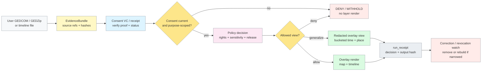

<!-- [KFM_META_BLOCK_V2]
doc_id: kfm://doc/TODO-consent-gated-ancestry-overlays
title: Consent-Gated Ancestry Overlays
type: standard
version: v1
status: draft
owners: @bartytime4life
created: 2026-05-06
updated: 2026-05-06
policy_label: restricted
related: [docs/connectors/genealogy/README.md, tests/policy/genealogy/README.md, tests/e2e/runtime_proof/genealogy/README.md, policy/README.md, contracts/README.md]
tags: [kfm, genealogy, consent, evidence-bundle, privacy, overlays]
notes: [PROPOSED companion document; target path is not yet verified as checked in, doc_id requires final UUID assignment]
[/KFM_META_BLOCK_V2] -->

# Consent-Gated Ancestry Overlays

Privacy-first guidance for rendering genealogy map and timeline overlays only after consent, policy, and evidence gates pass.

> [!NOTE]
> **Status:** `experimental / draft`  
> **Owners:** `@bartytime4life`  
> **PROPOSED path:** `docs/connectors/genealogy/CONSENT_GATED_ANCESTRY_OVERLAYS.md`  
> **Repo fit:** companion to [`docs/connectors/genealogy/README.md`](./README.md), downstream of connector intake, upstream of policy/runtime proof.  
> **Posture:** restricted sensitivity · fail-closed consent · no raw DNA in this overlay surface · truth-path aligned


**Quick jumps:** [Scope](#scope) · [Repo fit](#repo-fit) · [Accepted inputs](#accepted-inputs) · [Exclusions](#exclusions) · [Consent gate](#consent-gate) · [Overlay flow](#overlay-flow) · [Redaction rules](#redaction-and-generalization-rules) · [Contract hooks](#contract-hooks) · [Validation](#validation-and-test-requirements) · [Definition of done](#definition-of-done) · [FAQ](#faq) · [Appendix](#appendix)

> [!IMPORTANT]
> This document does **not** authorize publication of genealogy material. It defines the minimum overlay posture for one narrow surface: maps and timelines derived from user-provided genealogy data after consent, evidence, policy, redaction, and release checks succeed.

> [!WARNING]
> This overlay surface intentionally excludes raw genotype, VCF, BAM, segment, kit, and match payloads. The broader genealogy connector lane may discuss restricted DNA intake, but ancestry overlays should only use opaque linkage tokens or policy-approved summaries.

---

## Scope

This document narrows the broader genealogy connector posture into a **single governed visualization surface**:

> render ancestry **map** and **timeline** overlays from user-provided genealogy material only when the requested view is supported by a valid consent credential, an inspectable evidence path, and policy-safe redaction.

The goal is not a family-tree viewer, a DNA analysis surface, or a general-purpose genealogy import pipeline. The goal is a KFM-style overlay path where every outward feature remains tied to:

| KFM burden | Overlay consequence |
|---|---|
| Truth path | overlays derive from governed intake objects, not direct public access to raw uploads |
| Trust membrane | clients never read raw genealogy payloads, direct identifiers, or genotype material |
| Evidence visibility | outward claims point back to `EvidenceBundle` refs or abstain |
| Policy discipline | deny, withhold, or generalize before rendering |
| Correction / revocation lineage | revoked or narrowed consent changes visible surface state |

### Reading rule

Use this document when the question is:

> “Can a map or timeline layer render this ancestry-derived feature for this viewer, at this scope, with this consent state?”

Move the work elsewhere when the question is primarily policy authorship, canonical schema design, release proof, runtime answer behavior, correction lineage, or raw restricted intake.

[Back to top](#consent-gated-ancestry-overlays)

---

## Repo fit

| Item | Status | Notes |
|---|---:|---|
| Target file | **PROPOSED** | `docs/connectors/genealogy/CONSENT_GATED_ANCESTRY_OVERLAYS.md` until committed |
| Parent connector doc | **CONFIRMED** | [`./README.md`](./README.md) owns broader genealogy source-family and intake posture |
| Policy proof | **CONFIRMED** | [`../../../tests/policy/genealogy/README.md`](../../../tests/policy/genealogy/README.md) owns consent/living-person/DNA/provenance negative behavior |
| Runtime proof | **CONFIRMED** | [`../../../tests/e2e/runtime_proof/genealogy/README.md`](../../../tests/e2e/runtime_proof/genealogy/README.md) owns finite request-time outcomes |
| Policy authority | **CONFIRMED** | [`../../../policy/README.md`](../../../policy/README.md) owns deny-by-default posture, reasons, and obligations |
| Contract authority | **CONFIRMED** | [`../../../contracts/README.md`](../../../contracts/README.md) owns object meaning and compatibility language |
| Schema home | **NEEDS VERIFICATION** | [`../../../schemas/genealogy/README.md`](../../../schemas/genealogy/README.md) is not relied on here as a populated authority surface |

### Placement rule

Put guidance here when it defines:

- consent-gated map/timeline overlay behavior;
- accepted overlay inputs and exclusions;
- redaction/generalization defaults for visual surfaces;
- evidence and consent payloads consumed by rendering;
- overlay-specific `run_receipt` expectations.

Move it elsewhere when it defines:

- source connector breadth or vendor-specific sync policy → [`./README.md`](./README.md);
- policy law or reason/obligation vocabulary → [`../../../policy/README.md`](../../../policy/README.md);
- object-family semantics → [`../../../contracts/README.md`](../../../contracts/README.md);
- executable policy tests → [`../../../tests/policy/genealogy/README.md`](../../../tests/policy/genealogy/README.md);
- request-time Focus/runtime behavior → [`../../../tests/e2e/runtime_proof/genealogy/README.md`](../../../tests/e2e/runtime_proof/genealogy/README.md).

[Back to top](#consent-gated-ancestry-overlays)

---

## Accepted inputs

Only accept inputs that can pass consent, evidence, and policy gates without exposing restricted records to public surfaces.

| Input | Overlay posture | Admission rule |
|---|---:|---|
| GEDCOM / GEDZip tree export | **PROPOSED** | accept only inside an `EvidenceBundle` with source metadata and valid consent |
| Timeline CSV / JSON | **PROPOSED** | accept only if each event has source refs, time semantics, and consent scope |
| Place strings / place IDs | **PROPOSED** | preserve original expression and normalized result; keep date-aware context |
| Consent credential / consent receipt | **REQUIRED** | must verify before any overlay layer toggles on |
| Opaque linkage token | **PROPOSED** | allowed for restricted joins; must not disclose original vendor, kit, person, or genotype identifiers |
| Redaction policy decision | **REQUIRED** | renderer consumes policy output; it does not decide publishability itself |

### Intake rule

Every accepted payload must be wrapped or joined into a governed object before rendering:

```text
source material
  -> EvidenceBundle
  -> consent verification
  -> policy decision
  -> redacted overlay view
  -> run_receipt
```

[Back to top](#consent-gated-ancestry-overlays)

---

## Exclusions

This surface does **not** accept or render the following:

| Excluded behavior | Why excluded | Where it belongs instead |
|---|---|---|
| Raw DNA / genotype files | too sensitive for overlay intake; easy to overexpose | restricted intake discussion only, outside this overlay surface |
| VCF, BAM, segment, kit, or match payloads | direct genetic evidence is not public-safe overlay material | restricted proof lane, if ever separately authorized |
| Vendor scraping | unstable rights and trust posture | nowhere here unless explicitly approved elsewhere |
| Consentless preview layers | violates fail-closed consent posture | no rendering |
| Direct identifiers in map/timeline features | public disclosure risk | redacted derivative view only |
| Exact living-person DOB or exact private-family location | high disclosure risk | generalize, withhold, or deny |
| Derived kinship graph as truth | graph inference is not sovereign evidence | derived projection with evidence refs and visible caveats |
| Model-generated ancestry claims without support | violates cite-or-abstain posture | runtime proof / Focus lane, not overlay rendering |

> [!CAUTION]
> A successful parse is not a publication decision. A valid schema shape, valid credential, and valid map tile can still be denied by policy.

[Back to top](#consent-gated-ancestry-overlays)

---

## Consent gate

The overlay layer must be **disabled until consent verifies**.

### Minimum consent claims

| Claim | Required? | Purpose |
|---|---:|---|
| `subject_hash` | yes | binds the credential to a pseudonymous subject without exposing direct ID |
| `purpose` | yes | must include `ancestry-map` and/or `ancestry-timeline` |
| `source_scope` | yes | names the source families or upload classes covered |
| `time_scope` | yes | limits historical range, if applicable |
| `geo_scope` | yes | limits geographic disclosure, if applicable |
| `data_categories` | yes | distinguishes tree events, places, living-person material, DNA-derived hints, etc. |
| `expires_at` | yes | blocks stale consent |
| `revocation_status_ref` | yes | supports current status checks |
| `receipt_ref` | yes | links to consent receipt / consent record artifact |
| `issuer` and proof | yes | verifies who issued the consent credential and whether it was tampered with |

### Verification sequence

1. Verify `EvidenceBundle` integrity and source metadata.
2. Verify the consent credential signature.
3. Verify selective disclosures are sufficient for the requested overlay.
4. Check status, expiry, revocation, and purpose.
5. Evaluate policy for rights, living-person status, exact-location sensitivity, release state, and requested audience.
6. Render only the redacted/generalized view authorized by the policy decision.
7. Emit a `run_receipt` for every render, denial, or withhold outcome.

### Fail-closed outcomes

| Condition | Outcome |
|---|---|
| Missing consent credential | `DENY_RENDER` |
| Expired consent | `DENY_RENDER` + `consent.expired` |
| Revoked consent | `WITHHOLD` or `REMOVE_LAYER` + correction/revocation artifact |
| Purpose mismatch | `DENY_RENDER` + `consent.scope_mismatch` |
| Living-person exposure unresolved | `GENERALIZE` or `WITHHOLD` |
| Evidence path missing | `DENY_RENDER` + `runtime.evidence_missing` |

[Back to top](#consent-gated-ancestry-overlays)

---

## Overlay flow



### Runtime display rule

The UI may show the overlay shell, legend, and disabled toggle before consent. It must not fetch or render redacted features until the consent and policy path has completed.

[Back to top](#consent-gated-ancestry-overlays)

---

## Redaction and generalization rules

Apply these rules server-side before any map tile, feature collection, timeline row, export, or popup payload reaches a client.

| Data element | Default outward behavior | Notes |
|---|---|---|
| Living-person name | withhold or pseudonymize | direct exposure requires explicit reviewed permission |
| Living / unknown DOB | decade or year bucket | exact DOB should not appear in public overlay payloads |
| Deceased DOB / death date | policy-scoped | exact values may still be restricted by source rights or family sensitivity |
| Exact residence | county, tract, HUC, grid, or withheld | choose bucket from sensitivity and purpose |
| Cemetery / burial place | review-sensitive | can disclose family/private location patterns |
| Migration route | generalized line or event sequence | avoid exposing living-person current locations |
| Source citation | preserve evidence ref | public text can summarize, but refs must remain inspectable |
| Vendor person ID | never public | map to pseudonymous local ID |
| DNA-derived hint | opaque linkage token only | no raw genotype, kit, segment, or match payload |
| Revoked consent | remove or generalize | preserve audit lineage and visible correction state |

### Overlay feature payload

A public-safe overlay feature should be small and intentionally boring:

```json
{
  "feature_id": "kfm:gly:feature:sha256-example",
  "event_type": "residence",
  "time_bucket": "1880s",
  "place_bucket": {
    "kind": "county",
    "label": "Douglas County, Kansas",
    "confidence": 0.83
  },
  "visibility": "generalized",
  "evidence_refs": ["evidence:bundle:example#event-003"],
  "decision_ref": "decision:genealogy-overlay:example",
  "correction_state": "current"
}
```

Do not include names, live vendor IDs, direct addresses, exact coordinates, genotype-derived values, or unreviewed relationship assertions in overlay features.

[Back to top](#consent-gated-ancestry-overlays)

---

## Contract hooks

This document consumes KFM object families; it does not create schema authority.

| Object | Overlay use | Authority note |
|---|---|---|
| `SourceDescriptor` | states source family, access mode, rights, sensitivity, cadence, and source role | defined by source/contract lanes |
| `EvidenceBundle` | wraps uploaded content, source refs, hashes, consent proof refs, and evidence support | contract meaning belongs outside this doc |
| `DecisionEnvelope` | records allow / deny / withhold / generalize decision and obligations | policy lane owns reasons and obligations |
| `ReleaseManifest` | identifies what overlay artifacts are approved for outward exposure | release assembly owns final proof |
| `CorrectionNotice` | records withdrawal, narrowing, revocation, or supersession | correction lane owns propagation rules |
| `RuntimeResponseEnvelope` | used only when overlay data feeds Focus or other runtime answers | runtime proof owns finite outcomes |
| `run_receipt` | overlay-local process memory for render attempts | **PROPOSED** shape until contract authority adopts it |

### Minimal `run_receipt` expectation

Every render attempt should leave a durable receipt with:

- request hash;
- `EvidenceBundle` ID;
- consent credential ID or disclosed consent proof hash;
- policy decision ref;
- redaction profile;
- output artifact hash, if rendered;
- finite result: `rendered`, `generalized`, `withheld`, `denied`, or `error`.

[Back to top](#consent-gated-ancestry-overlays)

---

## Validation and test requirements

This surface is not credible without negative tests.

| Test family | Must prove |
|---|---|
| Consent missing | overlay toggle remains disabled and no feature payload is returned |
| Consent expired | render denied with stable reason |
| Consent revoked | layer is removed or generalized and correction/revocation state is emitted |
| Purpose mismatch | `ancestry-map` consent cannot silently authorize unrelated use |
| Evidence missing | feature cannot render without `EvidenceBundle` support |
| Living-person exposure | exact DOB/name/location does not leak |
| Exact-location sensitivity | sensitive places generalize or withhold |
| Raw DNA rejection | genotype/segment/kit/match payload rejected at this overlay boundary |
| Token opacity | linkage token cannot be reversed from public output |
| Export parity | exported map/timeline data preserves redaction and decision refs |
| Revocation drill | previously rendered artifacts rebuild or become inactive after consent narrowing |

### Suggested fixture set

| Fixture | Expected outcome |
|---|---|
| `valid_historical_gedcom_with_consent.ged` | generalized overlay renders |
| `missing_consent_gedcom.ged` | deny render |
| `expired_consent_gedcom.ged` | deny render |
| `living_person_exact_dob.ged` | generalize or withhold |
| `exact_private_location.ged` | generalize or withhold |
| `raw_dna_upload.vcf` | reject from overlay intake |
| `revoked_consent_manifest.json` | remove / rebuild affected overlay |

> [!TIP]
> Prefer negative-path fixtures before happy-path expansion. Genealogy overlays are a trust boundary, not a demo layer.

[Back to top](#consent-gated-ancestry-overlays)

---

## Definition of done

An initial ancestry-overlay thin slice is done only when all of the following are true:

- [ ] Target path and neighboring links are verified on the active branch.
- [ ] One valid `EvidenceBundle` example wraps a redacted historical GEDCOM fixture.
- [ ] One consent credential / receipt example is signed or clearly marked demo-only.
- [ ] Missing, expired, revoked, and purpose-mismatched consent fail closed.
- [ ] Living-person and exact-location examples generalize or withhold.
- [ ] Raw DNA / genotype payloads are rejected by this overlay path.
- [ ] Public overlay payloads contain no direct person IDs, vendor IDs, addresses, exact living-person DOBs, or genotype values.
- [ ] Every rendered feature carries `evidence_refs` and a policy `decision_ref`.
- [ ] Every render attempt emits a `run_receipt`.
- [ ] Revocation changes visible overlay state and preserves audit lineage.
- [ ] Companion tests are linked from the policy and runtime-proof lanes.
- [ ] Any schema or contract additions are reviewed in the correct authority lane rather than asserted here.

[Back to top](#consent-gated-ancestry-overlays)

---

## FAQ

### Does this replace the genealogy connector README?

No. The connector README owns broader source-family intake posture. This document owns only the map/timeline overlay behavior after intake.

### Does valid consent mean public release is allowed?

No. Consent is necessary for this surface, but not sufficient. Policy, evidence, review, sensitivity, and release state still decide what can render.

### Why exclude raw DNA here if the broader genealogy lane mentions restricted DNA intake?

Because this is an overlay surface. It should not become a second raw restricted-intake system. It may consume opaque linkage tokens or policy-approved summaries, but it must not parse or render genotype material.

### Can the client verify consent directly?

The client may display consent status, but enforcement belongs server-side. Client-only consent checks are not a trust boundary.

### What happens after revocation?

The affected overlay should become inactive, be rebuilt at a narrower scope, or be withheld. The system should preserve audit lineage and emit a correction/revocation artifact instead of silently disappearing history.

[Back to top](#consent-gated-ancestry-overlays)

---

## Appendix

<details>
<summary><strong>Appendix A — illustrative consent VC payload</strong></summary>

This is a **PROPOSED / illustrative** payload. It is not a canonical KFM schema.

```json
{
  "@context": [
    "https://www.w3.org/ns/credentials/v2",
    "https://kfm.example.invalid/contexts/consent-v1"
  ],
  "type": ["VerifiableCredential", "ConsentReceiptCredential"],
  "issuer": "did:web:consent.example.invalid",
  "validFrom": "2026-05-06T00:00:00Z",
  "validUntil": "2026-11-06T00:00:00Z",
  "credentialSubject": {
    "subject_hash": "sha256:subject-hash-placeholder",
    "purposes": ["ancestry-map", "ancestry-timeline"],
    "source_scope": ["gedcom-upload", "timeline-upload"],
    "data_categories": ["tree_events", "place_events"],
    "excluded_categories": ["raw_dna", "genotype", "dna_segments"],
    "geo_scope": {
      "kind": "administrative-region",
      "value": "Kansas"
    },
    "time_scope": {
      "not_before": "1800-01-01",
      "not_after": "1950-12-31"
    },
    "revocable": true,
    "revocation_status_ref": "status:consent:example",
    "receipt_ref": "consent-receipt:example"
  }
}
```

Selective disclosure should reveal only the claims needed by the verifier: purpose, expiry, revocation status, and scope. It should not expose direct identity material to the overlay renderer.

</details>

<details>
<summary><strong>Appendix B — illustrative EvidenceBundle stub</strong></summary>

This is a **PROPOSED / illustrative** bundle stub for overlay review.

```json
{
  "bundle_id": "evidence:bundle:genealogy-overlay-example",
  "domain": "people/genealogy",
  "source_family": "gedcom-upload",
  "policy_label": "restricted",
  "sensitivity": ["living-person-risk", "family-location-risk"],
  "content": {
    "content_ref": "raw:genealogy:sha256-placeholder",
    "content_sha256": "sha256:content-placeholder",
    "format": "gedcom",
    "format_version": "7.x-or-5.5.1"
  },
  "consent": {
    "consent_vc_id": "vc:consent:example",
    "presentation_hash": "sha256:vp-placeholder",
    "verified_at": "2026-05-06T00:00:00Z",
    "status": "current"
  },
  "evidence_refs": [
    {
      "ref": "evidence:bundle:genealogy-overlay-example#event-003",
      "kind": "tree_event",
      "support_level": "user_supplied_with_source_ref"
    }
  ],
  "overlay_constraints": {
    "raw_dna_allowed": false,
    "living_person_public_allowed": false,
    "default_place_generalization": "county",
    "default_time_generalization": "decade"
  }
}
```

</details>

<details>
<summary><strong>Appendix C — illustrative redaction policy pseudocode</strong></summary>

This is **Rego-shaped pseudocode** for review. Do not treat it as executable policy until the active policy engine, bundle home, and reason vocabulary are verified.

```rego
package kfm.genealogy.overlay_redaction

default render := false

render {
  input.consent.status == "current"
  input.consent.purposes[_] == input.request.purpose
  not input.contains_raw_dna
  not input.exposes_direct_identifier
  not denied_reason[_]
}

denied_reason["consent.missing"] {
  not input.consent
}

denied_reason["consent.expired"] {
  input.consent.status == "expired"
}

denied_reason["consent.revoked"] {
  input.consent.status == "revoked"
}

denied_reason["sensitivity.raw_dna_excluded"] {
  input.contains_raw_dna
}

denied_reason["runtime.evidence_missing"] {
  count(input.evidence_refs) == 0
}

obligation["generalize.date_to_decade"] {
  input.subject.living_status != "deceased"
}

obligation["generalize.place_to_county"] {
  input.place.precision in ["address", "parcel", "exact_point"]
}

obligation["withhold"] {
  denied_reason["consent.revoked"]
}
```

</details>

<details>
<summary><strong>Appendix D — illustrative run receipt</strong></summary>

```json
{
  "run_receipt_id": "run:genealogy-overlay:example",
  "request_hash": "sha256:request-placeholder",
  "evidence_bundle_id": "evidence:bundle:genealogy-overlay-example",
  "consent_vc_id": "vc:consent:example",
  "policy_decision_ref": "decision:genealogy-overlay:example",
  "redaction_profile": {
    "date": "decade",
    "place": "county",
    "direct_identifiers": "removed",
    "raw_dna": "excluded"
  },
  "result": "generalized",
  "output_artifact_hash": "sha256:overlay-placeholder",
  "created_at": "2026-05-06T00:00:00Z"
}
```

</details>

<details>
<summary><strong>Appendix E — standards references</strong></summary>

- [GEDCOM — The Genealogy Data Standard][gedcom]
- [FamilySearch GEDCOM 7 / GEDZip overview][familysearch-gedcom]
- [W3C Verifiable Credentials Data Model 2.0][vc-data-model-2]
- [W3C Securing Verifiable Credentials using JOSE and COSE][vc-jose-cose]
- [IETF RFC 9901 — Selective Disclosure for JWTs][sd-jwt-rfc]
- [ISO/IEC TS 27560:2023 — Consent record information structure][iso-27560]
- [Kantara Consent Receipt Specification v1.1.0][kantara-cr]

</details>

[Back to top](#consent-gated-ancestry-overlays)

[gedcom]: https://www.gedcom.org/
[familysearch-gedcom]: https://www.familysearch.org/en/gedcom/
[vc-data-model-2]: https://www.w3.org/TR/vc-data-model-2.0/
[vc-jose-cose]: https://www.w3.org/TR/vc-jose-cose/
[sd-jwt-rfc]: https://datatracker.ietf.org/doc/rfc9901/
[iso-27560]: https://www.iso.org/standard/80392.html
[kantara-cr]: https://kantarainitiative.org/download/consent-receipt-specification/
