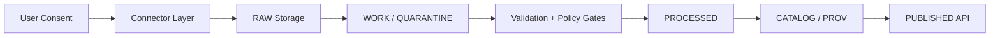

<!-- [KFM_META_BLOCK_V2]
doc_id: kfm://doc/PLACEHOLDER-GENEALOGY-CONNECTORS
title: Genealogy Connectors (FamilySearch + Ancestry Intake)
type: standard
version: v1
status: draft
owners: NEEDS VERIFICATION
created: 2026-03-29
updated: 2026-03-29
policy_label: restricted
related:
  - docs/architecture/TRUTH_PATH_LIFECYCLE.md
  - docs/governance/README.md
  - docs/security/README.md
tags: [kfm, genealogy, connectors]
notes: Source-bounded; no mounted repo verification in this session.
[/KFM_META_BLOCK_V2] -->

# Genealogy Connectors

**Purpose:** Governed ingestion of genealogy trees + DNA artifacts into KFM.

---

## 🔎 Scope

This surface defines **controlled ingestion pathways** for:

| Source       | Mode                       | Status   |
| ------------ | -------------------------- | -------- |
| FamilySearch | OAuth2 API + GEDCOM export | PROPOSED |
| Ancestry     | User upload (GEDCOM + DNA) | PROPOSED |

---

## 🧭 Repo Fit

```
connectors/
  genealogy/
    familysearch/
    ancestry/
contracts/
  genealogy/
policy/
  genealogy/
```

**Upstream:**

* User consent + credentials
* GEDCOM / GEDZIP / DNA zip

**Downstream:**

* `data/raw/genealogy/`
* `data/work/genealogy/`
* `contracts/genealogy/normalized.schema.json`

---

## 📥 Accepted Inputs

| Type         | Format               | Notes                |
| ------------ | -------------------- | -------------------- |
| Tree export  | GEDCOM 7             | authoritative ingest |
| Tree + media | GEDZIP               | large payload        |
| DNA raw      | vendor zip (txt/csv) | sensitive            |

---

## 🚫 Exclusions

* Scraping vendor UIs
* Unauthorized API use
* Living-person unredacted publication
* Derived graphs treated as authoritative

---

## 🧱 Architecture (Trust Membrane Compliant)



---

## 🔐 Consent & Identity Binding

**MANDATORY (fail-closed):**

* Signed consent token (JWT)
* Vendor kit/tree hashed identifier
* Rights flags:

  * `redistribution`
  * `living_persons`
  * `dna_sensitive`

### Example (PROPOSED)

```json
{
  "consent_id": "uuid",
  "vendor": "ancestry",
  "kit_hash": "HMAC_SHA256(...)",
  "permissions": {
    "redistribution": false,
    "research_only": true
  },
  "issued_at": "timestamp"
}
```

---

## ⚖️ Policy Gates

| Gate                    | Behavior    |
| ----------------------- | ----------- |
| Missing consent         | ❌ BLOCK     |
| Living persons detected | 🔒 REDACT   |
| DNA sensitivity         | 🔒 RESTRICT |
| Provenance incomplete   | ❌ BLOCK     |
| Vendor TOS mismatch     | ❌ BLOCK     |

---

## 🔁 Truth Path Lifecycle

```
Source edge
→ RAW (immutable ingest)
→ WORK / QUARANTINE (validation + parsing)
→ PROCESSED (normalized schema)
→ CATALOG / TRIPLET (prov graph)
→ PUBLISHED (governed API only)
```

---

## 🔗 Connector Modes

### FamilySearch Connector

* OAuth2 authentication
* Token reuse + throttling compliance
* API ingestion OR GEDCOM export fallback

### Ancestry Intake

* User-driven export:

  * GEDCOM (tree)
  * DNA zip (raw)
* Upload → validation → ingest

---

## ⚙️ Throttling / Backoff

| Condition          | Action              |
| ------------------ | ------------------- |
| 429                | exponential backoff |
| Retry-After header | obey strictly       |
| sustained throttle | pause ingestion     |

---

## 🧬 Data Normalization

Canonical contract:

```
contracts/genealogy/person.schema.json
contracts/genealogy/relationship.schema.json
contracts/genealogy/dna.schema.json
```

Derived outputs (non-authoritative):

* graph projections
* embeddings
* summaries

---

## 🧪 Testing Requirements

| Test                    | Requirement        |
| ----------------------- | ------------------ |
| Consent missing         | fail-closed        |
| GEDCOM malformed        | quarantine         |
| DNA upload w/o consent  | reject             |
| Living person detection | redaction enforced |
| Provenance chain        | complete           |

---

## 📊 Operational Considerations

* GEDZIP can exceed 100MB
* DNA zips typically 10–30MB
* Stream processing required (no full memory load)

---

## 🧠 Governance Notes

* Authoritative truth remains RAW + PROCESSED layers
* Derived layers must be rebuildable
* No client bypass of policy gates

---

## 📌 Status

| Component        | State        |
| ---------------- | ------------ |
| Schema contracts | PROPOSED     |
| Connector code   | NOT VERIFIED |
| Policy rules     | PARTIAL      |
| Tests            | REQUIRED     |

---

# 🔧 Example Connector Skeleton (CI-safe)

## `connectors/genealogy/ancestry/upload_handler.py`

```python
def handle_upload(file, consent_token):
    assert verify_consent(consent_token), "FAIL_CLOSED: consent missing"

    parsed = parse_file(file)

    if contains_living_persons(parsed):
        parsed = redact_living(parsed)

    validate_schema(parsed)

    write_raw(file)
    write_processed(parsed)
```

---

## `connectors/genealogy/familysearch/client.py`

```python
def fetch_tree(access_token):
    headers = {"Authorization": f"Bearer {access_token}"}

    resp = request("/tree", headers=headers)

    if resp.status_code == 429:
        backoff(resp.headers.get("Retry-After"))

    return resp.json()
```

---

# 🚦 Next Build Steps (Recommended)

1. Define **GEDCOM → canonical schema mapper**
2. Implement **living-person detection rules**
3. Add **consent verification service (KMS-backed)**
4. Build **policy gate CLI (Conftest / OPA)**
5. Add **negative tests (fail-closed enforcement)**

---

