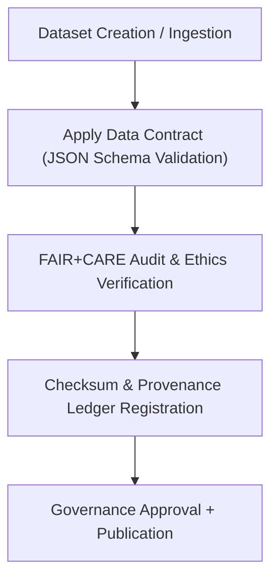

<div align="center">

# 📜 Kansas Frontier Matrix — **Data Contracts & Schema Governance**
`docs/contracts/README.md`

**Purpose:**  
Defines the **FAIR+CARE, ISO, and MCP-DL v6.3-compliant data contract framework** used to manage schemas, interoperability, and ethical data standards across the Kansas Frontier Matrix (KFM).  
Data contracts act as the binding agreements between datasets, governance systems, and validation pipelines — ensuring traceable, ethical, and sustainable data flow from ingestion to publication.

[](../../docs/standards/faircare-validation.md)
[]()
[]()
[](../../LICENSE)

</div>

---

## 📚 Overview

The **Data Contract Framework** governs the structure, validation, and FAIR+CARE certification of every dataset within the Kansas Frontier Matrix.  
It bridges **technical schema enforcement** and **ethical governance**, ensuring all data is usable, explainable, and culturally responsible.

Data contracts are version-controlled JSON documents that define:
- Field definitions, types, and constraints.  
- FAIR+CARE metadata requirements.  
- Validation and audit workflows.  
- Provenance and checksum references.  

---

## 🗂️ Directory Layout

```plaintext
docs/contracts/
├── README.md                             # This file — overview of schema governance and contracts
│
├── data-contract-v3.json                 # Active data contract defining v9.6.0 schema rules
├── data-contract-v2.json                 # Legacy schema reference (v9.5.0)
├── governance-contract.json              # FAIR+CARE and ISO governance alignment template
├── ai-contract.json                      # AI ethics and model validation schema
└── metadata-contract.json                # Standard metadata and provenance requirements
```

---

## ⚙️ Data Contract Workflow



### Process Description
1. **Dataset Creation:** Ingestion or transformation triggers data contract application.  
2. **Schema Validation:** JSON Schema verifies all structural and semantic integrity.  
3. **Ethical Review:** FAIR+CARE audits check for inclusivity and equitable use.  
4. **Ledger Entry:** Provenance metadata registered via `data_provenance_ledger.json`.  
5. **Publication:** Approved datasets released under certified governance metadata.  

---

## 🧩 Data Contract Schema Overview

| Field | Type | Description |
|--------|------|-------------|
| `contract_id` | String | Unique identifier for the schema contract. |
| `version` | String | Version number of the data contract (e.g., v3.0). |
| `dataset_type` | String | Defines domain context (e.g., hazards, climate, metadata). |
| `required_fields` | Array | List of mandatory fields with validation logic. |
| `optional_fields` | Array | Optional metadata or extended context fields. |
| `faircare_requirements` | Object | FAIR+CARE principles mapping for ethical governance. |
| `validation_workflow` | Object | Associated pipeline(s) for validation and governance sync. |
| `checksum_registry` | String | Reference to global checksum manifest for reproducibility. |

---

## 🧠 FAIR+CARE Compliance Mapping

| Principle | Contract Enforcement | Validation Reference |
|------------|----------------------|----------------------|
| **Findable** | Contract defines mandatory dataset identifiers and lineage metadata. | `schema/id` |
| **Accessible** | All data must be open or publicly documented. | `metadata/access` |
| **Interoperable** | Schema aligns with DCAT 3.0 and STAC 1.0. | `schema/interoperability` |
| **Reusable** | Data includes version, license, and provenance. | `metadata/reuse` |
| **Collective Benefit** | Contract includes equity and social utility checks. | `faircare/collective_benefit` |
| **Authority to Control** | FAIR+CARE Council approval required for data lifecycle changes. | `governance/control` |
| **Responsibility** | Contract logs author, validator, and checksum lineage. | `governance/audit` |
| **Ethics** | Requires cultural and environmental review metadata. | `faircare/ethics` |

---

## 🧮 Example Data Contract Snippet

```json
{
  "contract_id": "data-contract-v3.0",
  "dataset_type": "hazards",
  "version": "v9.6.0",
  "required_fields": ["id", "geometry", "timestamp", "hazard_type", "intensity"],
  "optional_fields": ["description", "source_agency", "model_reference"],
  "faircare_requirements": {
    "findable": true,
    "accessible": true,
    "interoperable": true,
    "reusable": true,
    "collective_benefit": true,
    "authority_to_control": "FAIR+CARE Council",
    "responsibility": "Maintainers and Validators",
    "ethics_review_required": true
  },
  "checksum_registry": "releases/v9.6.0/manifest.zip"
}
```

---

## ⚖️ Governance & Validation Integration

| Workflow | Description | Responsible System |
|-----------|--------------|--------------------|
| `schema_validation.yml` | Validates data contracts and dataset conformity. | CI/CD Validation |
| `faircare_audit.yml` | Runs FAIR+CARE pre-publication ethical audits. | FAIR+CARE Council |
| `checksum_verify.yml` | Confirms dataset integrity via SHA-256 registry. | Governance Ledger |
| `ledger_sync.yml` | Records validation and certification into provenance logs. | Governance Pipeline |

---

## 🌱 Sustainability & Ethical Data Design

KFM’s data contract governance ensures **sustainable and culturally aware data practices** by:
- Minimizing redundant processing and storage costs.  
- Enforcing FAIR+CARE ethics before release.  
- Utilizing lightweight JSON schema formats for energy efficiency.  
- Maintaining open, versioned, and reusable governance structures.  

Sustainability metrics tracked via:  
`releases/v9.6.0/focus-telemetry.json`

---

## 🧩 Example Governance Contract Snippet

```json
{
  "contract_id": "governance-contract-v3.0",
  "review_body": "FAIR+CARE Council",
  "review_cycle": "Quarterly",
  "responsible_roles": ["@kfm-governance", "@kfm-ethics", "@faircare-council"],
  "requirements": {
    "audit_trail": true,
    "checksum_verified": true,
    "public_transparency": true
  },
  "compliance_standards": ["ISO 37000", "FAIR+CARE", "MCP-DL v6.3"]
}
```

---

## 🧾 Internal Use Citation

```text
Kansas Frontier Matrix (2025). Data Contracts & Schema Governance (v9.6.0).
Defines the FAIR+CARE, ISO, and MCP-DL-compliant framework for data contract validation and schema governance.
Ensures reproducibility, ethical alignment, and technical interoperability across the entire data lifecycle.
```

---

## 🧾 Version Notes

| Version | Date | Notes |
|----------|------|--------|
| v9.6.0 | 2025-11-03 | Added ISO 37000 and DCAT alignment in governance contracts. |
| v9.5.0 | 2025-11-02 | Introduced FAIR+CARE ethical metadata enforcement. |
| v9.3.2 | 2025-10-28 | Established baseline schema governance structure under MCP-DL v6.3. |

---

<div align="center">

**Kansas Frontier Matrix** · *Schema Integrity × FAIR+CARE Ethics × Governance by Design*  
[🔗 Repository](https://github.com/bartytime4life/Kansas-Frontier-Matrix) • [⚖️ Governance Docs](../governance/README.md) • [🧭 Data Standards](../standards/governance/DATA-GOVERNANCE.md)

</div>

