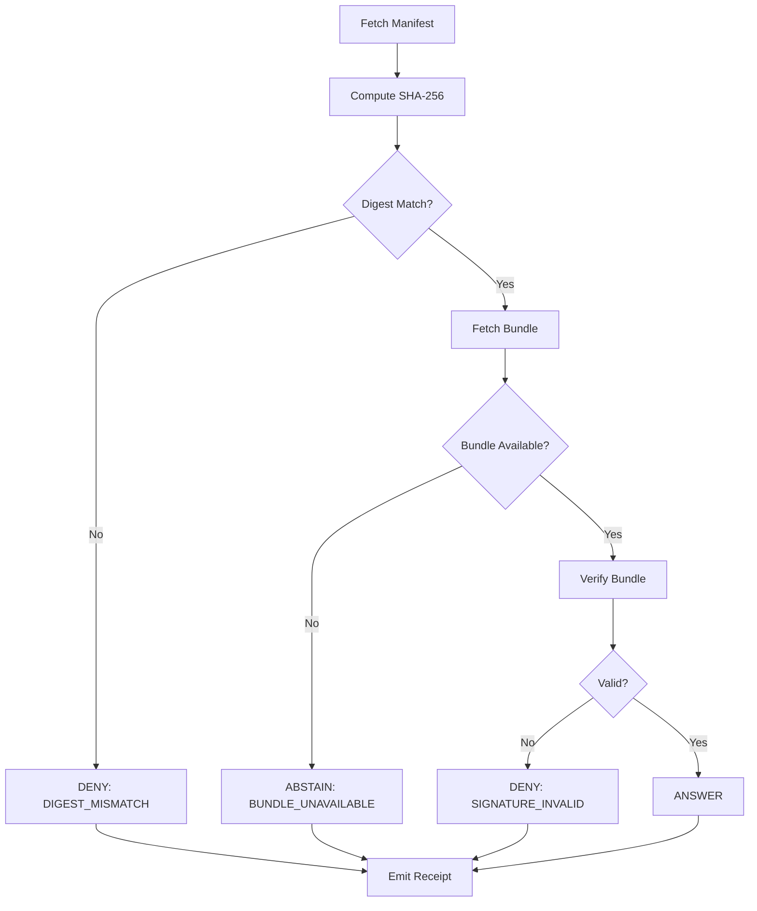

<!-- [KFM_META_BLOCK_V2]
doc_id: kfm://doc/contracts/runtime_verification/tile_verification
title: Runtime Tile Verification Contract
type: standard
version: v1
status: draft
owners: @bartytime4life
created: 2026-04-15
updated: 2026-04-15
policy_label: public
related: [
  ../../README.md,
  ../../../schemas/runtime_verification/tile_verification_receipt.schema.json,
  ../../../tools/attest/tile_proof_verifier.ts,
  ../../../data/proofs/README.md,
  ../../../data/receipts/README.md,
  ../../../policy/README.md,
  ../../../tests/e2e/runtime_proof/README.md
]
tags: [kfm, contracts, runtime, verification, tiles, manifest, sigstore]
notes: [Normative contract for browser/runtime tile verification. Execution wiring and specific verifier implementation remain bounded to tools/attest/.]
[/KFM_META_BLOCK_V2] -->

# Runtime Tile Verification Contract

Deterministic contract for **request-time verification of tile manifests and proof bundles**, producing a **finite outcome** and a **runtime receipt**.

> Doctrine:  
> The system does not trust tiles.  
> It trusts a **verified manifest + proof bundle**.

---

## 🔎 Scope

This contract governs:

- Manifest integrity verification (SHA-256)
- Proof bundle validation (Sigstore/Cosign bundle)
- Runtime gating decisions
- Receipt emission

---

## 🧭 Contract Position

| Layer | Role |
|------|------|
| `contracts/runtime_verification/` | Defines outcomes + shape |
| `tools/attest/` | Performs verification |
| `data/proofs/` | Stores bundles + manifests |
| `data/receipts/` | Stores runtime receipts |
| `policy/` | Applies gating semantics |

---

## 📥 Inputs

### Required Inputs

| Field | Type | Description |
|------|------|------------|
| `manifest_url` | string | URL to mini-manifest |
| `expected_root_hash` | byte[] | SHA-256 digest |
| `bundle_url` | string | URL to Sigstore bundle |

---

### Optional Inputs

| Field | Type | Description |
|------|------|------------|
| `certificate_identity` | string | Expected signer identity |
| `certificate_oidc_issuer` | string | Expected issuer |
| `release_ref` | string | KFM release reference |
| `policy_label` | string | Policy classification |

---

## 🧱 Processing Model



---

## ⚖️ Finite Outcomes

| Outcome | Meaning | Gate Behavior |
|--------|--------|--------------|
| `ANSWER` | Fully verified | Allow tiles |
| `DENY` | Integrity or proof failure | Block tiles |
| `ABSTAIN` | Missing required proof | Policy decides |
| `ERROR` | Runtime/system failure | Fail closed |

---

## 🚦 Enforcement Rules

- **Default:** deny-by-default
- `ANSWER` → enable full resolution tiles
- `DENY` → block all tiles
- `ABSTAIN` → defer to policy
- `ERROR` → treat as `DENY` unless policy overrides

---

## 🧾 Runtime Receipt

### Required Fields

```json
{
  "type": "TileVerificationReceipt",
  "outcome": "ANSWER",
  "verified": true,
  "timestamp": "2026-04-15T00:00:00Z"
}
```

---

### Extended Fields

```json
{
  "reason": "DIGEST_MISMATCH",
  "policy_label": "public",
  "release_ref": "kfm://release/tiles/kansas/v1",
  "signer_identity": "string",
  "oidc_issuer": "string",
  "bundle_version": "string"
}
```

---

## 🔐 Verification Requirements

### Digest Verification

- Algorithm: SHA-256
- Input: full manifest bytes
- Comparison: byte-exact match

---

### Bundle Verification

Must validate:

- Signature correctness
- Certificate chain
- Identity constraints (if provided)
- Transparency log inclusion (if present)

---

## 🧠 Policy Hooks

Policy layer may define:

| Case | Behavior |
|-----|--------|
| `ABSTAIN` | Allow low-res fallback |
| `ERROR` | Retry or block |
| stale bundle | allow / deny |
| identity mismatch | strict deny |

---

## 🧪 Test Requirements

### Required Scenarios

| Case | Expected Outcome |
|-----|----------------|
| valid manifest + valid bundle | `ANSWER` |
| digest mismatch | `DENY` |
| invalid signature | `DENY` |
| missing bundle | `ABSTAIN` |
| identity mismatch | `DENY` |
| worker failure | `ERROR` |

---

## 🔁 Determinism Requirements

- No nondeterministic verification paths
- No network dependency during verification (bundle must suffice)
- Same inputs → same outcome

---

## 🚫 Prohibited Behavior

- Rendering tiles before verification completes
- Partial trust (must be binary or policy-defined)
- Silent fallback without receipt
- Implicit trust of CDN or origin

---

## 🧩 Integration Points

| System | Integration |
|-------|------------|
| MapLibre | render gate |
| Cesium | resource fetch override |
| CI | promotion validation |
| Viewer UI | trust chip + evidence drawer |

---

## 📎 Relationship to Other Contracts

| Contract | Relationship |
|---------|-------------|
| RuntimeResponseEnvelope | wraps receipt |
| DecisionEnvelope | derives outcome |
| Promotion Gate | upstream enforcement |
| EvidenceBundle | proof carrier |

---

## ❓ FAQ

### Why allow ABSTAIN?

Because runtime may lack proof data, and policy may permit degraded experience.

---

### Why separate receipt from proof?

- Proof = release artifact  
- Receipt = runtime evidence  

---

### Why fail closed?

Because absence of proof must not be interpreted as safety.

---

## 📌 Status

- Contract: defined  
- Schema: required  
- Implementation: in progress  

---

**End of Contract**