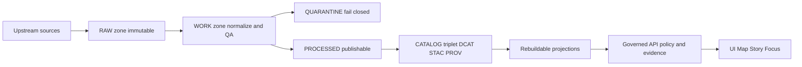

<!-- [KFM_META_BLOCK_V2]
doc_id: kfm://doc/1f5b7d7f-4b46-4b2c-8c2b-69a0bb77c0ad
title: Contributing
type: guide
version: v1
status: draft
owners: KFM Maintainers
created: 2026-02-24
updated: 2026-02-24
policy_label: public
related:
  - ../../README.md
  - ../README.md
  - TODO: ../governance/README.md
tags: [kfm, contributing]
notes:
  - Draft contributor guide focused on governance, evidence, and promotion gates.
  - Some repo-specific commands/paths are intentionally marked TODO until verified in-repo.
[/KFM_META_BLOCK_V2] -->

# Contributing to Kansas Frontier Matrix (KFM)
Build and maintain a governed, evidence-first system where **every user-facing claim is traceable** to versioned sources and policy decisions.

> **NOTE:** This guide is designed to be **fail-closed**. If licensing/sensitivity/citations are unclear, contributions should **reduce scope** or land in **quarantine** rather than shipping risky outputs.

---

## Quick navigation
- [Where this document fits](#where-this-document-fits)
- [Non-negotiable invariants](#non-negotiable-invariants)
- [How to contribute](#how-to-contribute)
- [PR checklist](#pr-checklist)
- [Data and pipeline contributions](#data-and-pipeline-contributions)
- [Docs and Story Node contributions](#docs-and-story-node-contributions)
- [Policy and security](#policy-and-safety)
- [Repo reality check](#repo-reality-check)
- [Support](#support)

---

## Where this document fits
This file lives at `docs/contributing/README.md` and is intended to be the **single source of truth** for contribution behavior across:
- data + pipelines
- catalogs + provenance
- governed APIs
- map/story UI
- Focus Mode AI behavior

If you’re looking for project overview, start at `../../README.md`.

---

## Directory documentation standard
### Acceptable inputs
This directory is for **developer-facing collaboration artifacts**, such as:
- contributor workflow docs
- checklists and templates
- governance-friendly PR guidance (evidence, policy, receipts)
- links to repo-local policies and contracts

### Exclusions
Do **not** put here:
- raw datasets or derived artifacts
- secrets / credentials
- private or sensitive site coordinates
- “tribal knowledge” that should be enforced by CI instead of prose

---

## Non-negotiable invariants
KFM contributions must preserve these invariants:

1) **Truth path lifecycle**  
Data moves through lifecycle zones and only promoted versions can reach runtime surfaces.

2) **Trust membrane**  
Clients do not access storage/DB directly. Everything goes through governed APIs that enforce policy and resolve evidence.

3) **Evidence-first UX**  
Every map layer and narrative claim should be explainable via evidence: dataset version, license/rights, policy label, provenance, checksums.

4) **Cite-or-abstain Focus Mode**  
AI answers must cite resolvable evidence bundles or abstain. Citation verification is a hard gate.

5) **Deterministic identity**  
Stable dataset + version identities; prefer canonical hashing and reproducible outputs.

> **WARNING:** Implementation details (exact frameworks, exact module layout) are allowed to change. The invariants above are the “do not break” contract.

### Concept map

---

## How to contribute
### 1) Pick a contribution type
| Type | What you change | Typical review focus | “Must have” artifacts |
|---|---|---|---|
| Docs | Guides, ADRs, ops docs | Accuracy + clarity + traceability | MetaBlock, links to policies/contracts |
| Story Nodes | Narrative tied to map state | Citation resolvability + policy label | Markdown + sidecar JSON + resolvable citations |
| Data | New dataset, update, fix | License + sensitivity + reproducibility | Spec, checksums, run receipts, catalogs |
| Pipelines | Ingest/transform/index | Determinism + auditability | Run receipts, schema/QA reports |
| Catalog/Provenance | DCAT/STAC/PROV | Validation + cross-links | Schema validation + link checks |
| Policy | OPA/Rego (or equivalent) | Default-deny + tests | Policy tests + fixtures |
| API | Governed endpoints | Policy safety + stable error model | Contract tests + audit_ref |
| UI | Map/Story/Focus UX | Evidence drawer + accessibility | Evidence resolver UX + a11y smoke |

### 2) Open an Issue (or draft PR)
If your change affects behavior, governance posture, or public narratives, start with an Issue describing:
- **Goal**
- **Scope** (what’s in/out)
- **Evidence plan** (what sources you’ll cite/validate)
- **Policy impact** (public/restricted, redactions, obligations)
- **Rollback plan** (how we revert safely)

### 3) Work in thin, reversible slices
Prefer multiple small PRs over one large PR:
- Each PR should be buildable
- Each PR should be reviewable
- Each PR should be reversible

### 4) Submit a PR using the template below

  
<strong>PR description template (copy/paste)</strong>

- **Summary**
  - What changed and why?

- **Scope**
  - In-scope:
  - Out-of-scope:

- **Evidence**
  - What evidence bundles / dataset versions / citations support the change?

- **Policy & safety**
  - policy_label:
  - sensitive-location considerations:
  - redaction/generalization changes:

- **Tests / gates**
  - Which checks did you run?
  - What CI gates should fail if this regresses?

- **Roll-forward / rollback**
  - Roll-forward steps:
  - Rollback steps:

- **Verification steps**
  - Minimum steps for reviewer to confirm behavior:

---

## PR checklist
### Always required
- [ ] PR is **small** and **reversible**
- [ ] Change is **evidence-aware** (links to datasets/specs/receipts where applicable)
- [ ] No secrets; no credential strings; no tokens
- [ ] No sensitive coordinates in docs, story nodes, or examples unless policy explicitly allows
- [ ] Tests and CI gates pass (see [Repo reality check](#repo-reality-check))
- [ ] Docs updated if behavior changed

### Required for data/pipeline/catalog changes
- [ ] Raw inputs are **append-only** (no mutation of RAW)
- [ ] Quarantine used when license/sensitivity is unclear
- [ ] Processed artifacts have checksums
- [ ] DCAT/STAC/PROV cross-links validate
- [ ] Run receipt exists for producing runs

---

## Data and pipeline contributions
### Zones: how data is allowed to move
- **RAW**: immutable acquisition (manifest, raw artifacts, checksums, license snapshot)
- **WORK**: normalization + QA + candidate redactions/generalizations
- **QUARANTINE**: failed validation, unclear licensing, sensitivity concerns, upstream instability
- **PROCESSED**: publishable artifacts + checksums + derived runtime metadata
- **CATALOG triplet**: DCAT (dataset metadata), STAC (asset metadata), PROV (lineage)
- **PUBLISHED**: runtime surfaces serve only promoted dataset versions

### Promotion Contract (minimum gates)
A dataset version promotion must be blocked unless all required artifacts exist and validate.

- **Gate A: Identity and versioning**
  - Stable dataset identity and immutable version derived from a stable spec hash

- **Gate B: Licensing and rights metadata**
  - Explicit license + rights holder + attribution requirements captured
  - If unclear: **stay in QUARANTINE**

- **Gate C: Sensitivity classification and redaction plan**
  - policy_label assigned
  - Redactions/generalizations recorded in provenance

- **Gate D: Catalog validation**
  - DCAT/STAC/PROV exist, validate, and cross-link deterministically

- **Gate E: Run receipts and checksums**
  - Receipts enumerate inputs/outputs by digest and record environment

- **Gate F: Policy and contract tests**
  - Policy tests pass; evidence resolver can resolve at least one reference in CI
  - API contracts and schemas validate

- **Gate G: Optional but recommended**
  - SBOM/build provenance, performance smoke checks, accessibility smoke checks

### Spec hygiene
- URLs in specs should be real in implementation; placeholders must not ship
- Avoid embedding credentials in any spec or receipt

---

## Docs and Story Node contributions
### MetaBlock v2 is required for governed docs
Use the MetaBlock header in an HTML comment:
- `doc_id` must be stable (do not regenerate on edits)
- update `updated` on meaningful edits
- `policy_label` governs who can see the doc when served through governed surfaces

### Story Nodes
Story Nodes bind narrative to map state and citations.
- A Story Node has:
  - a Markdown file (human readable)
  - a sidecar JSON (map state, citations, policy, review)

**Publishing gate:** citations must resolve via the evidence resolver endpoint (do not rely on “best-effort” links).

> **TIP:** Treat Story Nodes like code: reviewable diffs, explicit citations, and policy labels.

### Claim labeling: cite-or-abstain discipline
When writing narratives or docs that drive product behavior, label claims:

| Label | Use when | What it means | Minimum requirement |
|---|---|---|---|
| **Confirmed** | You can point to evidence | Backed by resolvable artifacts | Link to dataset/version/receipt/citation |
| **Proposed** | You are suggesting a change | A recommendation, not yet reality | Rationale + tradeoffs + verification steps |
| **Unknown** | Needs verification | Do not ship as fact | List exactly what to check and where |

---

## Policy and safety
### Policy-as-code principles
- CI and runtime must share the same policy semantics (or at minimum the same fixtures and outcomes)
- UI should display policy badges/notices but **never makes policy decisions**

### Sensitivity defaults
- Default deny for sensitive-location and restricted datasets
- If a public representation is allowed, publish a separate generalized dataset version
- Never leak restricted metadata in error responses

### License, attribution, and rights
- “Online availability does not equal permission to reuse.”
- Promotion requires license + rights holder recorded for every distribution
- “Metadata-only reference” is allowed when rights do not allow mirroring
- Exports must include attribution/license text automatically
- Story publishing blocks if rights are unclear for included media

---

## Repo reality check
This contributing guide is intentionally repo-agnostic where the current implementation is unknown.

Before your first PR, verify in-repo:
1) What the default branch is (`main`, `master`, etc.)
2) Which CI checks are required status checks
3) How to run:
   - formatting
   - unit/integration tests
   - catalog validators
   - policy tests
   - docs build

> **TODO:** Add the exact commands once confirmed (e.g., `make test`, `npm test`, `pnpm lint`, `uv run pytest`, etc.).

---

## Support
- If you are unsure whether something is sensitive: **assume it is** and reduce scope.
- If you are unsure about licensing: **quarantine** and ask for governance review.
- If you’re blocked, open an Issue with:
  - the missing artifact
  - why it’s required
  - the smallest acceptable substitute (if any)

---

Back to top: <a href="#contributing-to-kansas-frontier-matrix-kfm">↑</a>
