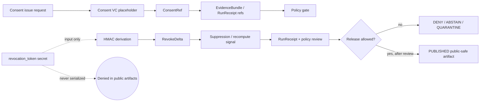

<!-- [KFM_META_BLOCK_V2]
doc_id: kfm://doc/TODO-consent-revocation
title: Consent and Revocation Control Plane
type: standard
version: v1
status: draft
owners: TODO
created: TODO
updated: 2026-05-06
policy_label: public
related: [docs/control-plane/README.md, docs/control-plane/obligation-execution.md, docs/adr/ADR-0427-consent-vc-and-revocation-delta.md, apps/api/openapi/consent.yaml, tools/consent/issue_consent.py, tools/consent/revoke_consent.py, policy/governance/obligation_execution.rego]
tags: [kfm, consent, revocation, governance, privacy]
notes: [Owners/doc_id/created date remain TODO; revision aligns with local-only Consent VC placeholder, deterministic Revocation Delta, EvidenceBundle references, policy gate doctrine, and confirmed adjacent repo surfaces.]
[/KFM_META_BLOCK_V2] -->

<a id="top"></a>

# Consent and Revocation Control Plane

Consent references, obligation hashes, and deterministic revocation deltas for evidence-bound KFM publication flows.

<p align="left">
  
  
  
  
  
</p>

> [!IMPORTANT]
> This document is a **control-plane standard** for consent and revocation behavior. It does not claim that every named schema, validator, fixture, workflow, release gate, UI component, or runtime route is fully enforced unless the file map below marks that surface **CONFIRMED** from repo evidence.

---

## Impact block

| Field | Value |
|---|---|
| **Status** | `draft` |
| **Owners** | `TODO` / **NEEDS_VERIFICATION** |
| **Path** | `docs/control-plane/CONSENT_AND_REVOCATION.md` |
| **Authority role** | Consent and revocation control-plane standard for KFM governed evidence flows |
| **Primary upstream** | [`./README.md`](./README.md), [`../adr/ADR-0427-consent-vc-and-revocation-delta.md`](../adr/ADR-0427-consent-vc-and-revocation-delta.md), [`./obligation-execution.md`](./obligation-execution.md) |
| **Primary downstream** | EvidenceBundle references, run receipts, policy gates, publication review, Evidence Drawer payloads, Focus Mode outcomes, correction/rollback flows |
| **Confirmed adjacent implementation surfaces** | [`../../apps/api/openapi/consent.yaml`](../../apps/api/openapi/consent.yaml), [`../../tools/consent/issue_consent.py`](../../tools/consent/issue_consent.py), [`../../tools/consent/revoke_consent.py`](../../tools/consent/revoke_consent.py), [`../../policy/governance/obligation_execution.rego`](../../policy/governance/obligation_execution.rego) |
| **Do not use for** | External VC compliance claims, live DID/OIDC/status-list behavior, CI enforcement claims, route maturity claims, or public release readiness without direct verification |

**Quick jumps:** [Purpose](#purpose) · [Scope](#scope) · [Repo fit](#repo-fit) · [Operating law](#operating-law) · [Consent model](#consent-model) · [Revocation model](#revocation-model) · [Policy gates](#policy-gates) · [Run receipts](#run-receipts) · [Evidence Drawer](#evidence-drawer-requirements) · [File map](#file-map) · [Validation](#validation-and-fixtures) · [Open questions](#open-questions) · [Definition of done](#definition-of-done)

---

## Purpose

The Consent and Revocation Control Plane defines how KFM records consent, carries consent obligations into evidence and receipts, derives revocation deltas, and prevents revoked or obligation-conflicted material from being published as current truth.

It exists to keep four KFM promises visible:

| Promise | Control-plane meaning |
|---|---|
| **Consent is inspectable** | Consent-dependent evidence carries a consent reference and an obligation snapshot hash. |
| **Revocation is deterministic** | Revocation deltas are derived in a replayable, local-only way for v1. |
| **Secrets stay private** | `revocation_token` is an input secret, never a public artifact field. |
| **Publication fails closed** | Revoked, expired, unresolved, or obligation-conflicted evidence blocks publication until suppression, recompute, review, or correction is complete. |

KFM’s durable public unit remains the inspectable claim, not the map layer, tile, model output, graph edge, summary, or dashboard value.

[Back to top](#top)

---

## Scope

### Included

- Consent references for consent-dependent EvidenceBundles and related receipts.
- Local-only Consent VC placeholder posture.
- Obligations snapshot hashing.
- Deterministic Revocation Delta derivation.
- Suppression and recompute signaling.
- Revocation impact on publication gates.
- Evidence Drawer and Focus Mode behavior when consent state changes.
- Policy and validator expectations.
- File placement guidance for existing and proposed repo surfaces.

### Excluded

| Exclusion | Reason | Route |
|---|---|---|
| Live W3C VC, DID, OIDC, Sigstore, transparency-log, or VC status-list integration | Not admitted by v1 local-only posture | Future ADR |
| External consent capture UX | Outside this control-plane standard | Product/UX design after governance approval |
| Identity proofing and credential issuance | Separate identity/rights surface | Identity governance ADR |
| Public serialization of secret tokens | Security and replay/correlation risk | Deny and quarantine |
| Silent deletion on revocation | Violates correction lineage and auditability | Revocation Delta + receipt + correction/rollback |
| Direct model or public UI access to consent secrets | Bypasses trust membrane | Governed API and public-safe payloads only |

[Back to top](#top)

---

## Repo fit

This file belongs under `docs/control-plane/` because consent and revocation are cross-domain governance controls, not a single domain lane.

| Relationship | Path | Status | Role |
|---|---|---:|---|
| Control-plane index | [`./README.md`](./README.md) | CONFIRMED path | Explains control-plane purpose and routing. |
| This standard | `docs/control-plane/CONSENT_AND_REVOCATION.md` | CONFIRMED path | Defines consent/revocation behavior and review burden. |
| Obligation execution doc | [`./obligation-execution.md`](./obligation-execution.md) | CONFIRMED path | Defines publish-time obligation and recompute behavior. |
| ADR-0427 | [`../adr/ADR-0427-consent-vc-and-revocation-delta.md`](../adr/ADR-0427-consent-vc-and-revocation-delta.md) | CONFIRMED path | Defines local-only Consent VC + Revocation Delta posture. |
| Consent API contract | [`../../apps/api/openapi/consent.yaml`](../../apps/api/openapi/consent.yaml) | CONFIRMED path | Stub API surface for issue/revoke requests. |
| Consent issue helper | [`../../tools/consent/issue_consent.py`](../../tools/consent/issue_consent.py) | CONFIRMED path | Local helper for consent placeholder issuance. |
| Revocation helper | [`../../tools/consent/revoke_consent.py`](../../tools/consent/revoke_consent.py) | CONFIRMED path | Local helper for deterministic revocation delta derivation. |
| Obligation policy | [`../../policy/governance/obligation_execution.rego`](../../policy/governance/obligation_execution.rego) | CONFIRMED path | Deny rules for obligation, revocation, queue, receipt, and public-field issues. |
| Machine schemas | `schemas/governance/*.json`, `schemas/evidence/*.json`, `schemas/receipts/*.json` | NEEDS_VERIFICATION | Proposed/ADR-mentioned schema homes; verify before creating parallel authority. |
| Fixtures and tests | `tests/fixtures/governance/**`, `policy/governance/*_test.rego` | PARTIAL / NEEDS_VERIFICATION | Policy test file confirmed; broader fixtures need verification. |

> [!WARNING]
> Do not create parallel consent definitions under `policy/core/`, `schemas/contracts/v1/core/`, `schemas/governance/`, or `contracts/` without confirming the active schema-home and policy-home conventions. If homes conflict, record an ADR or migration note first.

[Back to top](#top)

---

## Evidence boundary

This document separates current repo evidence from control-plane requirements.

| Claim area | Truth posture | Boundary |
|---|---|---|
| Target file exists at `docs/control-plane/CONSENT_AND_REVOCATION.md` | CONFIRMED | File path and prior content were inspected. |
| ADR-0427 exists and defines local-only Consent VC + Revocation Delta posture | CONFIRMED | ADR is `draft`; schema homes and broader enforcement remain pending. |
| Consent issue/revoke helper files exist | CONFIRMED | File presence and helper logic inspected; runtime execution not claimed here. |
| OpenAPI consent stub exists | CONFIRMED | API contract file inspected; deployed route behavior not claimed here. |
| Obligation execution Rego policy exists | CONFIRMED | Policy file inspected; CI/OPA enforcement not claimed without run evidence. |
| Every KFM EvidenceBundle currently has a consent block | UNKNOWN | This document requires consent refs for consent-dependent evidence; global schema requirement needs verification. |
| External verifiable credential network is active | DENY for v1 | Future live integration requires a separate ADR. |
| CI blocks all unsafe consent/revocation cases | NEEDS_VERIFICATION | Policy/test files exist, but active CI enforcement must be verified. |

[Back to top](#top)

---

## Operating law

Consent and revocation must preserve KFM’s trust membrane:

```text
SOURCE EDGE
  -> RAW
  -> WORK / QUARANTINE
  -> PROCESSED
  -> CATALOG / TRIPLET
  -> PUBLISHED
  -> GOVERNED API
  -> TRUST-VISIBLE UI / FOCUS MODE
```

Consent and revocation objects are governance controls inside that lifecycle. They do not replace evidence, source descriptors, policy decisions, review state, release manifests, correction notices, or rollback cards.



### Control rules

1. Consent-dependent evidence must carry a consent reference and an obligation snapshot hash.
2. `revocation_token` must never be serialized into public or semi-public artifacts.
3. Revocation is represented by a deterministic delta and downstream action receipts.
4. Publication with revoked consent, unresolved recompute queue, missing receipts, or forbidden public fields must fail closed.
5. UI, API, map, and AI surfaces may show public-safe consent state; they must not receive secret-bearing consent material.
6. Generated language never becomes consent authority.

[Back to top](#top)

---

## Consent model

KFM v1 treats the Consent VC as a **local-only placeholder**, not an externally verified credential.

### ConsentRef

Consent-dependent evidence should carry a compact reference rather than embedding secret-bearing consent material.

```json
{
  "consent_ref": {
    "consent_vc_id": "consent_vc_<hex>",
    "obligations_snapshot_hash": "<64 hex chars>",
    "obligations_url": "policy/consent/ecology.v1.md",
    "status": "active"
  }
}
```

| Field | Required | Public-safe? | Notes |
|---|---:|---:|---|
| `consent_vc_id` | yes | yes | Local placeholder identifier. |
| `obligations_snapshot_hash` | yes | yes | SHA-256 over canonical obligations snapshot. |
| `obligations_url` | optional | conditional | Must not expose secret or restricted material. |
| `status` | recommended | yes | Suggested values: `active`, `superseded`, `revoked`, `unknown`. |
| `revocation_token` | no | never | Secret input only; public serialization is an error. |

### Obligations snapshot hash

```text
obligations_snapshot_hash = sha256(canonical_json(obligations_snapshot)).hex()
```

> [!NOTE]
> Canonical JSON implementation and schema-home authority remain **NEEDS_VERIFICATION**. Use the repo-approved canonicalization helper if one exists; otherwise do not treat illustrative hashing code as production law.

### Consent issue posture

The confirmed helper surface for local issuance is [`../../tools/consent/issue_consent.py`](../../tools/consent/issue_consent.py). The confirmed API contract surface is [`../../apps/api/openapi/consent.yaml`](../../apps/api/openapi/consent.yaml).

The current control-plane expectation is:

1. accept a subject reference and obligations snapshot;
2. compute `obligations_snapshot_hash`;
3. mint a local `consent_vc_id`;
4. return a signed local placeholder response;
5. carry only public-safe refs/hashes into evidence, receipts, layers, and UI payloads.

[Back to top](#top)

---

## Revocation model

Revocation is modeled as a deterministic **Revocation Delta**, not as silent deletion.

### Revocation Delta

```json
{
  "revoke_delta": {
    "object_type": "RevokeDelta",
    "schema_version": "v1",
    "revoke_delta_id": "rvk_<64 lowercase hex chars>",
    "consent_vc_id": "consent_vc_<hex>",
    "prior_spec_hash": "<64 lowercase hex chars>",
    "delta_timestamp": "YYYY-MM-DDThh:mm:ssZ",
    "obligations_action": "suppress_or_recompute",
    "signature": "<local-signature-stub-or-repo-approved-signature>"
  }
}
```

### Deterministic ID derivation

The revocation helper and ADR posture use HMAC-based derivation.

```text
prk = HMAC(key="kfm:revoke:v1", message=revocation_token)
k = HMAC(key=prk, message="kfm:revoke:v1:id")
message = prior_spec_hash + "|" + delta_timestamp
revoke_delta_id = "rvk_" + HMAC(key=k, message=message).hex()
```

### Required privacy posture

| Surface | May carry `revoke_delta_id` | May carry `revocation_token` |
|---|---:|---:|
| EvidenceBundle | yes | no |
| RunReceipt | yes | no |
| AIReceipt | yes, if public-safe | no |
| RevokeDelta | yes | no |
| RevokeManifest | yes | no |
| Catalog / PROV / release manifest | yes, if public-safe | no |
| Map layer / Evidence Drawer / Focus Mode | yes, if public-safe | no |
| Logs and public fixtures | no secret-bearing material | no |

> [!CAUTION]
> Redacting a token is not the same as excluding it. Public and semi-public artifacts should carry `revoke_delta_id`, reason/state, and receipt references, not token material or token-derived intermediate values.

[Back to top](#top)

---

## Revocation behavior

Revocation opens a governed downstream action path.

### Suppress mode

Use suppress mode when public output can be made safe by hiding or withholding affected claims, features, fields, layers, or exports.

Required behavior:

- mark affected public output as `suppressed`, `revoked`, or `stale_pending_review`;
- block publication if the publish decision would otherwise allow revoked evidence;
- emit or reference a receipt that includes the applicable `revoke_delta_id`;
- update Evidence Drawer and Focus Mode so stale revoked evidence cannot be presented as current.

### Recompute mode

Use recompute mode when aggregates, derived layers, graph projections, summaries, or released artifacts must be rebuilt without the revoked contribution.

Required behavior:

- create recompute queue items;
- block publication while the recompute queue is unresolved;
- emit a new run receipt for recomputed output;
- supersede prior released derivatives through release/correction lineage;
- keep the revoked prior state auditable rather than deleting history.

### Minimum affected surfaces

| Surface | Required response |
|---|---|
| EvidenceBundle | Carry consent/revocation refs and obligation hash when applicable. |
| RunReceipt | Reference consent/revocation state and downstream action. |
| Catalog / release candidate | Block or mark stale until suppress/recompute/review completes. |
| Derived tiles / layers | Suppress, invalidate, or rebuild public-safe derivatives. |
| Graph/triplet projection | Rebuild if revoked evidence participates in public graph. |
| Evidence Drawer | Show public-safe consent/revocation status and receipts. |
| Focus Mode | Return `ABSTAIN`, `DENY`, suppress, or stale/recompute state when consent invalidates context. |
| Public export | Prevent stale revoked outputs unless a reviewed correction notice allows a public-safe statement. |

[Back to top](#top)

---

## Policy gates

Publication and public-facing runtime behavior must fail closed when consent state is unsafe or unresolved.

| Condition | Default outcome | Evidence / implementation status |
|---|---|---|
| Consent required but `consent_vc_id` missing | DENY / ABSTAIN | Requirement; schema placement NEEDS_VERIFICATION |
| Obligations missing | DENY | Confirmed policy pattern under governance obligation execution |
| Obligation execution receipt missing | DENY | Confirmed policy pattern |
| Retention expired while publish decision is `ALLOW` | DENY | Confirmed policy pattern |
| Revoked consent while publish decision is `ALLOW` | DENY | Confirmed policy pattern |
| Recompute queue unresolved while publish decision is `ALLOW` | DENY | Confirmed policy pattern |
| Run receipt unsigned or unverified | DENY | Confirmed policy pattern |
| Public artifact contains forbidden raw/sensitive fields | DENY | Confirmed policy pattern |
| `revocation_token` appears outside the secret input channel | ERROR + quarantine + security review | Requirement; validator coverage NEEDS_VERIFICATION |
| Live VC/status-list dependency attempted in v1 | DENY / ERROR | ADR-0427 posture |

### Policy relationship

The confirmed policy surface is [`../../policy/governance/obligation_execution.rego`](../../policy/governance/obligation_execution.rego). This document does not claim that Rego is currently enforced in CI, only that the policy file exists and should remain aligned with this control-plane standard.

[Back to top](#top)

---

## Run receipts

Every suppression, recompute, withdrawal, or release decision affected by consent must be receipt-backed.

```json
{
  "run_receipt": {
    "id": "kfm://run/<uuid-or-repo-approved-id>",
    "artifact_ids": ["kfm://artifact/<id>"],
    "consent_vc_id": "consent_vc_<hex>",
    "obligations_snapshot_hash": "<64 hex chars>",
    "revoke_delta_id": "rvk_<64 hex chars>",
    "suppression_or_recompute_action": "suppress_public_output",
    "policy_eval_ref": "kfm://policy_eval/<id>",
    "timestamp": "YYYY-MM-DDThh:mm:ssZ",
    "signed": true,
    "verified": true,
    "audit_ref": "kfm://audit/<id>"
  }
}
```

### Receipt rules

- Receipts are process memory and audit support; they do not replace evidence.
- Consent hashes must remain stable for the same canonical obligations snapshot.
- Revocation action receipts must reference the relevant `revoke_delta_id`.
- Public-facing receipts must not expose `revocation_token`, private signing material, raw payloads, genomics markers, or restricted identifiers.
- Exact receipt schema home remains **NEEDS_VERIFICATION**.

[Back to top](#top)

---

## CI / Conftest enforcement

> [!WARNING]
> Policy and test files can exist without proving active CI enforcement. Do not claim merge-blocking behavior until workflow files, required checks, and recent run evidence are inspected.

### Confirmed policy test surface

The confirmed test surface is:

```text
policy/governance/obligation_execution_test.rego
```

### Proposed consent/revocation validation gates

| Gate | Expected check | Failure |
|---|---|---|
| `consent.id.shape` | `consent_vc_id` matches `^consent_vc_[0-9a-f]+$` or repo-approved equivalent | FAIL |
| `obligations.hash.match` | Hash equals canonical obligations snapshot hash | FAIL |
| `revoke.id.shape` | `revoke_delta_id` matches `^rvk_[0-9a-f]{64}$` | FAIL |
| `revoke.id.deterministic` | Same token + prior spec + timestamp yields same delta ID | FAIL |
| `secret.no_serialize` | `revocation_token` absent from public artifacts, manifests, receipts, logs, fixtures | ERROR |
| `network.local_only` | No DID/OIDC/status-list/Sigstore/transparency-log call in v1 | ERROR |
| `publication.fail_closed` | Revoked or unresolved outputs cannot publish as `ALLOW` | DENY |
| `drawer.public_safe` | Evidence Drawer receives only public-safe consent/revocation state | DENY |
| `focus.safe_context` | Focus Mode receives no token or secret-bearing context | DENY / ABSTAIN |

<details>
<summary>Illustrative Rego sketch</summary>

```rego
package kfm.consent_revocation

default allow := false

deny[msg] if {
  input.requires_consent
  not input.consent_ref.consent_vc_id
  msg := "missing consent_vc_id"
}

deny[msg] if {
  input.requires_consent
  not input.consent_ref.obligations_snapshot_hash
  msg := "missing obligations_snapshot_hash"
}

deny[msg] if {
  input.consent_state == "revoked"
  input.publish_decision == "ALLOW"
  msg := "revoked consent with publish allow"
}

deny[msg] if {
  input.recompute_queue.unresolved_count > 0
  input.publish_decision == "ALLOW"
  msg := "unresolved recompute queue"
}

deny[msg] if {
  some f
  f := input.public_artifact_fields[_]
  f == "revocation_token"
  msg := "revocation token serialized"
}

allow if {
  count(deny) == 0
}
```

</details>

[Back to top](#top)

---

## Evidence Drawer requirements

The Evidence Drawer is the public trust surface for consent state. It should show enough to explain whether a claim can be trusted, but not enough to leak secrets.

| Drawer field | Required? | Public posture |
|---|---:|---|
| Consent state | yes | `active`, `revoked`, `superseded`, `unknown`, or repo-approved finite value |
| `consent_vc_id` | conditional | Show when public-safe and useful |
| `obligations_snapshot_hash` | yes, when consent-dependent | Public-safe hash |
| Issue timestamp | conditional | Show if public-safe and schema-supported |
| Expiry / retention state | conditional | Show as finite state rather than private detail when needed |
| `revoke_delta_id` | conditional | Show when revoked/suppressed/recomputed and public-safe |
| Suppression/recompute state | yes, when applicable | Use clear state labels |
| Receipt references | yes, when available | Public-safe receipt IDs or audit refs |
| `revocation_token` | never | Deny and quarantine if present |
| Raw subject identifiers | never by default | Use governed subject refs only when policy permits |

### Focus Mode behavior

When consent state affects an answer, Focus Mode should return a finite result rather than fluent uncertainty.

| Consent condition | Focus Mode outcome |
|---|---|
| Consent active and evidence resolved | `ANSWER` may be allowed after citation/policy checks |
| Consent missing where required | `DENY` or `ABSTAIN` |
| Consent revoked | `DENY`, `ABSTAIN`, or suppress/recompute state |
| Recompute unresolved | `ABSTAIN` or `DENY` |
| EvidenceRef cannot resolve | `ABSTAIN` |
| Policy engine unavailable | `ERROR` or fail-closed outcome |

[Back to top](#top)

---

## File map

### Confirmed adjacent surfaces

| Path | Status | Role |
|---|---:|---|
| `docs/control-plane/CONSENT_AND_REVOCATION.md` | CONFIRMED | This standard. |
| `docs/control-plane/README.md` | CONFIRMED | Control-plane directory landing page. |
| `docs/control-plane/obligation-execution.md` | CONFIRMED | Obligation execution, recompute queue, publish enforcement summary. |
| `docs/adr/ADR-0427-consent-vc-and-revocation-delta.md` | CONFIRMED | Draft ADR for local-only consent placeholder and revocation delta. |
| `apps/api/openapi/consent.yaml` | CONFIRMED | Stub consent issue/revoke API contract. |
| `tools/consent/issue_consent.py` | CONFIRMED | Local consent placeholder issue helper. |
| `tools/consent/revoke_consent.py` | CONFIRMED | Local revoke delta derivation helper. |
| `policy/governance/obligation_execution.rego` | CONFIRMED | Governance deny/allow policy rules. |
| `policy/governance/obligation_execution_test.rego` | CONFIRMED | Rego test surface for obligation execution. |

### Proposed or needs-verification surfaces

| Path | Status | Why it remains unresolved |
|---|---:|---|
| `schemas/governance/consent_vc.v1.json` | PROPOSED / NEEDS_VERIFICATION | ADR-mentioned schema home; active schema authority must be confirmed. |
| `schemas/governance/revoke_delta.v1.json` | PROPOSED / NEEDS_VERIFICATION | ADR-mentioned schema home; active schema authority must be confirmed. |
| `schemas/evidence/EvidenceBundle.v1.json` | NEEDS_VERIFICATION | Generic EvidenceBundle schema authority not confirmed by this document. |
| `schemas/receipts/run_receipt.v1.json` | NEEDS_VERIFICATION | Generic receipt schema authority not confirmed by this document. |
| `tools/validators/governance/validate_consent_revocation.py` | PROPOSED | Validator home and language should follow repo convention. |
| `tests/fixtures/governance/consent_vc/**` | PROPOSED | Fixture layout needs confirmation. |
| `tests/fixtures/governance/revocation/**` | PROPOSED | Fixture layout needs confirmation. |
| `.github/workflows/consent-*.yml` | PROPOSED / NEEDS_VERIFICATION | Do not claim workflow enforcement until actual workflow and required checks exist. |
| `data/receipts/**` consent/revocation receipts | NEEDS_VERIFICATION | Emitted artifact storage and current release state require inspection. |
| `release/**` correction/rollback surfaces | NEEDS_VERIFICATION | Release/rollback object home requires repo evidence. |

[Back to top](#top)

---

## Validation and fixtures

### Required fixture classes

| Fixture | Expected result |
|---|---|
| Valid consent issue request | PASS |
| Consent issue request missing obligations | FAIL |
| Valid revoke request with `revocation_token` secret input | PASS |
| Revoke request missing token and JWT | FAIL |
| Revocation delta deterministic replay | PASS |
| Revocation token serialized into public artifact | ERROR / DENY |
| Revoked consent with publish `ALLOW` | DENY |
| Unresolved recompute queue with publish `ALLOW` | DENY |
| Evidence Drawer payload containing token | DENY |
| Focus Mode context containing token | DENY |
| Missing consent for DNA/living-person consent-dependent output | DENY |
| Non-consent-dependent public hydrology fixture | PASS only if source/policy/release checks pass |

### Suggested local commands

Use repo-native commands when available. These are review targets, not proof that enforcement exists.

```bash
# Inspect relevant surfaces.
git status --short
find docs/control-plane docs/adr apps/api/openapi tools/consent policy/governance -maxdepth 2 -type f | sort
```

```bash
# Run policy tests only when OPA is installed.
opa test policy/governance/obligation_execution.rego policy/governance/obligation_execution_test.rego
```

```bash
# Proposed future validator command.
python3 tools/validators/governance/validate_consent_revocation.py \
  --fixture tests/fixtures/governance/revocation/valid_revoke_delta.json
```

[Back to top](#top)

---

## Open questions

| Question | Status | Resolution path |
|---|---:|---|
| What is the canonical schema home for `consent_vc.v1` and `revoke_delta.v1`? | NEEDS_VERIFICATION | Confirm existing schema-home ADR and current repo conventions. |
| Should all EvidenceBundles carry consent, or only consent-dependent EvidenceBundles? | NEEDS_VERIFICATION | Resolve in EvidenceBundle schema and policy. This document uses the safer consent-dependent rule. |
| Is `policy_label: public` correct for this standard? | NEEDS_VERIFICATION | Confirm policy label conventions and owner decision. |
| Who owns consent/revocation governance? | NEEDS_VERIFICATION | Confirm CODEOWNERS or stewardship records. |
| Are OPA/Conftest checks active in CI? | NEEDS_VERIFICATION | Inspect workflow YAML, required checks, and run evidence. |
| Are consent API routes deployed? | UNKNOWN | Inspect app runtime, route wiring, and deployment logs. |
| Is a live VC/status-list integration planned? | DENY for v1 / FUTURE ADR | Requires separate ADR, threat model, tests, and migration plan. |
| What exact public Evidence Drawer fields are approved? | NEEDS_VERIFICATION | UI contract and policy review. |
| How are correction notices and rollback cards stored for revocation events? | NEEDS_VERIFICATION | Confirm release/correction object family homes. |
| Are DP/minimum-count rules part of this standard or a domain-specific privacy policy? | NEEDS_VERIFICATION | Resolve through privacy policy and domain sensitivity rules. |

[Back to top](#top)

---

## Definition of done

This document can move from `draft` to `review` only when the following are true:

- [ ] Owners are verified and the metadata block is updated.
- [ ] `doc_id`, `created`, `updated`, and `policy_label` are verified.
- [ ] ADR-0427 remains linked and its status is reflected accurately.
- [ ] Schema-home authority for consent/revocation objects is resolved or explicitly deferred.
- [ ] Consent issue and revoke helper behavior is covered by no-network tests.
- [ ] `revocation_token` non-serialization is covered by negative tests.
- [ ] Policy denies revoked consent with publish `ALLOW`.
- [ ] Recompute queue unresolved state blocks publication.
- [ ] Run receipts carry consent and revocation references without secrets.
- [ ] Evidence Drawer and Focus Mode payloads expose public-safe state only.
- [ ] Correction/rollback path is documented with target object families.
- [ ] CI enforcement claims are backed by workflow/run evidence or remain **NEEDS_VERIFICATION**.
- [ ] Relative links are checked from `docs/control-plane/`.

---

## Summary

KFM consent and revocation v1 is a local-only, evidence-bound governance slice. Consent-dependent evidence carries public-safe consent references and obligation hashes. Revocation is represented by deterministic deltas and receipt-backed suppression or recompute actions. Secrets remain private. Public outputs fail closed when consent is missing, revoked, expired, unresolved, or unsafe. UI and AI surfaces remain downstream of evidence, policy, review, release, and correction state.

[Back to top](#top)
