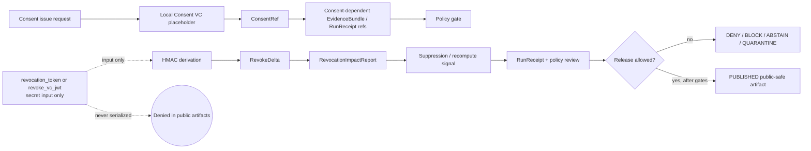
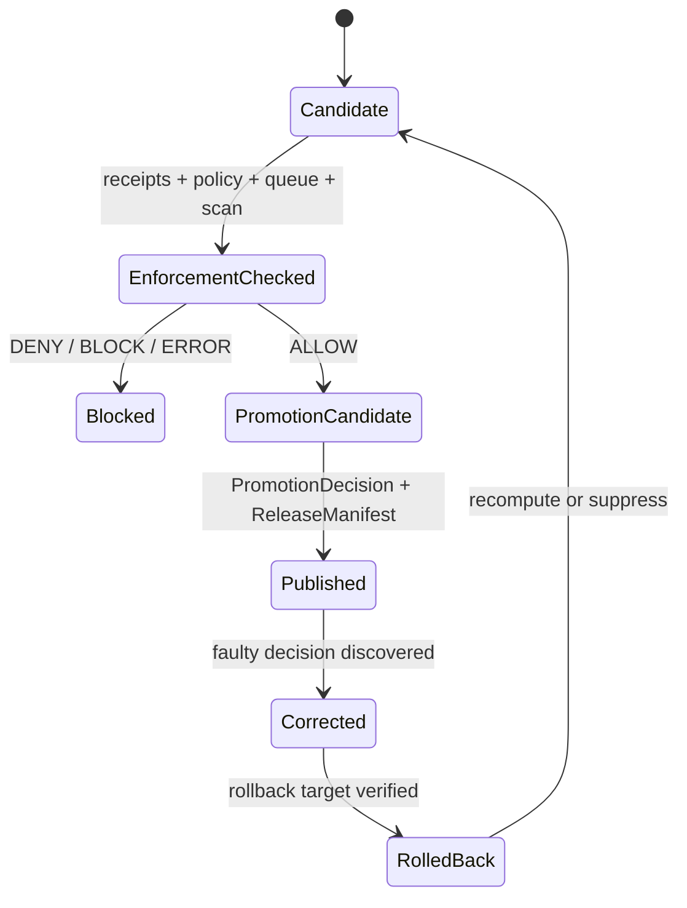

<!-- [KFM_META_BLOCK_V2]
doc_id: kfm://doc/TODO-consent-revocation
title: Consent and Revocation Control Plane
type: standard
version: v1
status: draft
owners: TODO-NEEDS-CODEOWNERS-VERIFICATION
created: TODO-NEEDS-GIT-HISTORY-VERIFICATION
updated: 2026-05-06
policy_label: public
related: [docs/control-plane/README.md, docs/control-plane/obligation-execution.md, docs/adr/ADR-0427-consent-vc-and-revocation-delta.md, apps/api/openapi/consent.yaml, tools/consent/issue_consent.py, tools/consent/revoke_consent.py, tools/consent/canonical_json.py, tools/consent/signing_stub.py, policy/governance/obligation_execution.rego, policy/governance/obligation_execution_test.rego]
tags: [kfm, consent, revocation, governance, privacy, obligation-execution, evidence]
notes: [doc_id, owners, and created date remain unresolved placeholders. policy_label is carried forward from the existing checked-in draft and still needs policy-label convention review. This revision is grounded in the inspected GitHub target file, adjacent control-plane docs, ADR-0427, the consent OpenAPI stub, local consent helpers, and governance Rego surfaces.]
[/KFM_META_BLOCK_V2] -->

<a id="top"></a>

# Consent and Revocation Control Plane

Consent references, obligation hashes, and deterministic revocation deltas for evidence-bound KFM publication flows.

<p align="left">
  
  
  
  
  
  
</p>

> [!IMPORTANT]
> This document is a **control-plane standard**. It defines how consent and revocation must behave in KFM evidence, policy, publication, runtime, and UI flows. It does **not** claim deployed API behavior, CI enforcement, workflow blocking, branch protection, emitted proof packs, or release maturity unless those are verified from current repo/runtime evidence.

---

## Impact block

| Field | Value |
|---|---|
| **Status** | `draft` |
| **Owners** | `TODO-NEEDS-CODEOWNERS-VERIFICATION` |
| **Path** | `docs/control-plane/CONSENT_AND_REVOCATION.md` |
| **Owning root** | `docs/` — human-facing control-plane documentation |
| **Authority role** | Cross-domain consent and revocation standard for governed evidence flows |
| **Primary upstream** | [`./README.md`](./README.md), [`../adr/ADR-0427-consent-vc-and-revocation-delta.md`](../adr/ADR-0427-consent-vc-and-revocation-delta.md), [`./obligation-execution.md`](./obligation-execution.md) |
| **Primary downstream** | EvidenceBundle references, run receipts, policy gates, publication review, Evidence Drawer payloads, Focus Mode outcomes, correction/rollback flows |
| **Confirmed adjacent implementation surfaces** | [`../../apps/api/openapi/consent.yaml`](../../apps/api/openapi/consent.yaml), [`../../tools/consent/issue_consent.py`](../../tools/consent/issue_consent.py), [`../../tools/consent/revoke_consent.py`](../../tools/consent/revoke_consent.py), [`../../tools/consent/canonical_json.py`](../../tools/consent/canonical_json.py), [`../../tools/consent/signing_stub.py`](../../tools/consent/signing_stub.py), [`../../policy/governance/obligation_execution.rego`](../../policy/governance/obligation_execution.rego), [`../../policy/governance/obligation_execution_test.rego`](../../policy/governance/obligation_execution_test.rego) |
| **Do not use for** | External VC compliance claims, live DID/OIDC/status-list behavior, CI enforcement claims, route maturity claims, or public release readiness without direct verification |

**Quick jumps:** [Purpose](#purpose) · [Repo fit](#repo-fit) · [Accepted inputs](#accepted-inputs) · [Exclusions](#exclusions) · [Operating law](#operating-law) · [Consent model](#consent-model) · [Revocation model](#revocation-model) · [Publication gates](#publication-gates) · [Receipts](#receipts) · [Public runtime behavior](#public-runtime-behavior) · [File map](#file-map) · [Validation](#validation-and-fixtures) · [Security posture](#security-and-sensitivity-posture) · [Rollback](#rollback-and-correction) · [Open questions](#open-questions) · [Definition of done](#definition-of-done)

---

## Purpose

The Consent and Revocation Control Plane defines how KFM records consent, carries consent obligations into evidence and receipts, derives revocation deltas, and prevents revoked or obligation-conflicted material from being published as current truth.

It exists to keep four KFM promises visible:

| Promise | Control-plane meaning |
|---|---|
| **Consent is inspectable** | Consent-dependent evidence carries a consent reference and an obligation snapshot hash. |
| **Revocation is deterministic** | Revocation deltas are derived in a replayable, local-only way for v1. |
| **Secrets stay private** | `revocation_token`, `revoke_vc_jwt`, signing keys, bearer tokens, and token-derived intermediate values are never public artifact fields. |
| **Publication fails closed** | Revoked, expired, unresolved, unsafe, or obligation-conflicted evidence blocks publication until suppression, recompute, review, correction, or withdrawal is complete. |

KFM’s durable public unit remains the **inspectable claim**, not the map layer, tile, model output, graph edge, summary, dashboard value, or generated answer.

[Back to top](#top)

---

## Repo fit

This file belongs under `docs/control-plane/` because consent and revocation are cross-domain governance controls, not a single domain lane.

| Relationship | Path | Status | Role |
|---|---|---:|---|
| Control-plane index | [`./README.md`](./README.md) | CONFIRMED path | Explains control-plane purpose, accepted inputs, exclusions, and routing. |
| This standard | `docs/control-plane/CONSENT_AND_REVOCATION.md` | CONFIRMED path | Defines consent/revocation behavior and review burden. |
| Obligation execution standard | [`./obligation-execution.md`](./obligation-execution.md) | CONFIRMED path | Defines obligation receipts, recompute queue, publish enforcement, and fail-closed behavior. |
| ADR-0427 | [`../adr/ADR-0427-consent-vc-and-revocation-delta.md`](../adr/ADR-0427-consent-vc-and-revocation-delta.md) | CONFIRMED path / draft ADR | Defines local-only Consent VC placeholder and deterministic Revocation Delta posture. |
| Consent API contract | [`../../apps/api/openapi/consent.yaml`](../../apps/api/openapi/consent.yaml) | CONFIRMED path | Stub OpenAPI issue/revoke contract. |
| Consent issue helper | [`../../tools/consent/issue_consent.py`](../../tools/consent/issue_consent.py) | CONFIRMED path | Local consent placeholder issuance helper. |
| Revocation helper | [`../../tools/consent/revoke_consent.py`](../../tools/consent/revoke_consent.py) | CONFIRMED path | Local deterministic revocation delta helper. |
| Canonical JSON helper | [`../../tools/consent/canonical_json.py`](../../tools/consent/canonical_json.py) | CONFIRMED path | Current helper for stable JSON bytes and SHA-256 hashes. |
| Signing stub | [`../../tools/consent/signing_stub.py`](../../tools/consent/signing_stub.py) | CONFIRMED path | Local HMAC signing stub; not external proof. |
| Obligation policy | [`../../policy/governance/obligation_execution.rego`](../../policy/governance/obligation_execution.rego) | CONFIRMED path | Deny rules for obligations, revocation, queue, receipts, and public-field issues. |
| Policy tests | [`../../policy/governance/obligation_execution_test.rego`](../../policy/governance/obligation_execution_test.rego) | CONFIRMED path | Rego test surface; CI enforcement remains NEEDS VERIFICATION. |
| Machine schemas | `schemas/governance/*`, `schemas/evidence/*`, `schemas/receipts/*` | NEEDS VERIFICATION | Do not create or claim canonical consent schemas until schema-home authority is confirmed. |
| Fixtures and tests | `tests/fixtures/governance/**`, `tests/governance/**` | NEEDS VERIFICATION | Fixture/test layout should follow repo convention and active ADRs. |

> [!WARNING]
> Do not create parallel consent definitions under `contracts/`, `schemas/`, `policy/`, `tests/`, `data/`, or `release/` without confirming the active authority home. If homes conflict, record an ADR, migration note, or register update before adding files.

[Back to top](#top)

---

## Accepted inputs

Use this standard to govern cross-domain consent and revocation behavior.

| Accepted input | Belongs here when it… | Typical downstream surface |
|---|---|---|
| Consent reference rule | Defines what consent-dependent evidence must carry | EvidenceBundle, RunReceipt, AIReceipt, release manifests |
| Revocation delta rule | Defines deterministic local revocation shape and derivation | RevokeDelta, RevocationImpactReport, recompute queue |
| Secret-handling rule | Blocks token, JWT, signing secret, and bearer-token leakage | Validators, policy, public artifact scans |
| Obligation snapshot rule | Defines how consent obligations are hashed and inspected | ConsentRef, RunReceipt, policy gates |
| Publication-denial rule | Explains why consent/revocation state blocks release | PolicyDecision, PublishEnforcementReport, PromotionDecision |
| Public runtime rule | Defines what Evidence Drawer and Focus Mode may show | Governed API, UI payloads, finite runtime outcomes |
| Rollback/correction rule | Defines how revoked or wrongly published material is withdrawn or recomputed | CorrectionNotice, RollbackReference, ReleaseManifest |

---

## Exclusions

| Does not belong here | Why not | Put it instead |
|---|---|---|
| Live external VC, DID, OIDC, status-list, or transparency-log integration design | v1 is local-only and no-network | Future ADR and threat model |
| Identity proofing or credential issuance authority | Separate identity and rights-control surface | Identity governance ADR/runbook |
| Public consent-capture UX | Product and privacy review are required | Product/UX docs after governance approval |
| Machine-readable schemas | This file defines behavior, not executable shape | `schemas/` or ADR-approved schema home |
| Policy-as-code | Policy must remain executable and testable | `policy/` |
| Fixtures and unit tests | Tests prove behavior; they are not governance prose | `tests/`, `fixtures/`, or repo-approved homes |
| Runtime handlers or UI components | Implementation consumes this standard; it does not live here | `apps/`, `packages/`, `web/`, or confirmed runtime homes |
| Receipts, proof packs, release manifests, or catalog records | Emitted artifacts are instances, not standards | `data/receipts/`, `data/proofs/`, `data/catalog/`, `release/` |
| RAW, WORK, QUARANTINE, or unpublished consent payloads | Public docs must not become internal data paths | Governed `data/` lifecycle roots with access controls |
| Public serialization of `revocation_token` or `revoke_vc_jwt` | Secret leakage and replay/correlation risk | Deny, quarantine, and security review |

[Back to top](#top)

---

## Evidence boundary

This document separates current repo evidence from required behavior.

| Claim area | Truth posture | Boundary |
|---|---:|---|
| Target file exists at `docs/control-plane/CONSENT_AND_REVOCATION.md` | CONFIRMED | The target path and prior content were inspected. |
| ADR-0427 exists and defines local-only Consent VC + Revocation Delta posture | CONFIRMED | ADR status remains `draft`; owner, policy label, schema-home, fixture, and CI evidence are incomplete. |
| Consent OpenAPI stub exists | CONFIRMED | The contract file exists; deployed route behavior is UNKNOWN. |
| Consent issue and revoke helper files exist | CONFIRMED | Helper logic was inspected; production packaging, test execution, and CLI/runtime exposure remain NEEDS VERIFICATION. |
| Rego policy and Rego test surfaces exist | CONFIRMED | Policy files exist; OPA/Conftest/CI enforcement remains NEEDS VERIFICATION. |
| Every KFM EvidenceBundle currently has a consent block | UNKNOWN | This standard requires consent refs for consent-dependent evidence; global schema coverage needs verification. |
| External verifiable credential network is active | DENY for v1 | Future live integration requires a separate ADR. |
| CI blocks all unsafe consent/revocation cases | NEEDS VERIFICATION | Workflow YAML, required checks, and recent run evidence must be inspected before enforcement claims are upgraded. |

[Back to top](#top)

---

## Operating law

Consent and revocation must preserve KFM’s trust membrane:

```text
SOURCE EDGE
  -> RAW
  -> WORK / QUARANTINE
  -> PROCESSED
  -> CATALOG / TRIPLET
  -> PUBLISHED
  -> GOVERNED API
  -> TRUST-VISIBLE UI / FOCUS MODE
```

Consent and revocation objects are governance controls inside that lifecycle. They do not replace evidence, source descriptors, policy decisions, review state, release manifests, correction notices, rollback cards, or proof packs.



### Control rules

1. Consent-dependent evidence must carry a consent reference and an obligation snapshot hash.
2. `revocation_token`, `revoke_vc_jwt`, local signing keys, and token-derived intermediate values must never be serialized into public or semi-public artifacts.
3. Revocation is represented by a deterministic delta and downstream action receipts.
4. Publication with revoked consent, unresolved recompute queue, missing receipts, unsafe public fields, expired retention, unsigned/unverified run receipts, or unresolved policy state must fail closed.
5. UI, API, map, and AI surfaces may show public-safe consent state; they must not receive secret-bearing consent material.
6. Generated language never becomes consent authority.

[Back to top](#top)

---

## Consent model

KFM v1 treats the Consent VC as a **local-only placeholder**, not an externally verified credential.

### Current issue contract

The confirmed OpenAPI stub defines:

| Object | Role | Confirmed fields |
|---|---|---|
| `IssueRequest` | Local consent placeholder issue request | `subject_id`, `obligations` |
| `IssueResponse` | Local issue response | `consent_vc_id`, `obligations_snapshot_hash`, `issued_at`, `signature` |
| `ConsentRef` | Public-safe reference carried downstream | `consent_vc_id`, `obligations_snapshot_hash`, optional `obligations_url` |

The confirmed local helper derives:

```text
obligations_snapshot_hash = sha256(canonical_json(obligations)).hex()
consent_vc_id = "consent_vc_" + sha256(subject_id + "|" + obligations_snapshot_hash + "|" + issued_at)[0:24]
signature = "stubsig_" + HMAC(local_stub_key, canonical_json(unsigned_payload)).hex()
```

> [!NOTE]
> The current helper uses sorted-key compact JSON serialization. If KFM later adopts a repo-wide JSON Canonicalization Scheme profile, this document needs a migration note or successor ADR.

### ConsentRef

Consent-dependent evidence should carry a compact reference rather than embedding secret-bearing consent material.

```json
{
  "consent_ref": {
    "consent_vc_id": "consent_vc_<hex>",
    "obligations_snapshot_hash": "<64 lowercase hex chars>",
    "obligations_url": "policy/consent/ecology.v1.md",
    "status": "active"
  }
}
```

| Field | Required for consent-dependent evidence? | Public-safe? | Notes |
|---|---:|---:|---|
| `consent_vc_id` | yes | yes | Local placeholder identifier. |
| `obligations_snapshot_hash` | yes | yes | Stable hash over canonical obligations snapshot. |
| `obligations_url` | optional | conditional | Must not expose secret, private, or restricted material. |
| `status` | recommended | yes | Suggested finite values: `active`, `superseded`, `revoked`, `expired`, `unknown`. |
| `revocation_token` | never | no | Secret input only. |
| `revoke_vc_jwt` | never | no | Secret-bearing v1 input only unless successor ADR says otherwise. |

### Consent is not publication

Active consent does not automatically authorize publication. KFM still requires:

- source role support;
- rights and terms review;
- EvidenceRef → EvidenceBundle resolution;
- sensitivity review;
- policy decision;
- validation reports;
- review state;
- release state;
- correction path;
- rollback target.

[Back to top](#top)

---

## Revocation model

Revocation is modeled as a deterministic **Revocation Delta**, not as silent deletion.

### Current revoke contract

The confirmed OpenAPI stub defines:

| Object | Role | Confirmed fields |
|---|---|---|
| `RevokeRequest` | Local revocation request | `consent_vc_id`, `prior_spec_hash`, `delta_timestamp`, and exactly one of `revocation_token` or `revoke_vc_jwt` |
| `RevokeResponse` | Revoke wrapper | `revoke_delta` |
| `RevokeDelta` | Deterministic revocation delta | `object_type`, `schema_version`, `revoke_delta_id`, `consent_vc_id`, `prior_spec_hash`, `delta_timestamp`, `obligations_action`, `signature` |

### RevokeDelta shape

```json
{
  "object_type": "RevokeDelta",
  "schema_version": "v1",
  "revoke_delta_id": "rvk_<64 lowercase hex chars>",
  "consent_vc_id": "consent_vc_<hex>",
  "prior_spec_hash": "<64 lowercase hex chars>",
  "delta_timestamp": "YYYY-MM-DDThh:mm:ssZ",
  "obligations_action": "suppress_or_recompute",
  "signature": "stubsig_<64 lowercase hex chars>"
}
```

### Deterministic ID derivation

The confirmed revocation helper derives the revocation ID as follows:

```text
prk = HMAC(key="kfm:revoke:v1", message=revocation_token_or_revoke_vc_jwt)
k = HMAC(key=prk, message="kfm:revoke:v1:id")
message = prior_spec_hash + "|" + delta_timestamp
revoke_delta_id = "rvk_" + HMAC(key=k, message=message).hex()
```

### Required privacy posture

| Surface | May carry `revoke_delta_id` | May carry `revocation_token` or `revoke_vc_jwt` |
|---|---:|---:|
| EvidenceBundle | yes, if consent-dependent and public-safe | no |
| RunReceipt | yes | no |
| AIReceipt | yes, if public-safe | no |
| RevokeDelta | yes | no |
| RevocationImpactReport | yes | no |
| RecomputeQueueItem | yes | no |
| Catalog / PROV / release manifest | yes, if public-safe | no |
| Map layer / Evidence Drawer / Focus Mode | yes, if public-safe | no |
| Logs and public fixtures | no secret-bearing material | no |

> [!CAUTION]
> Redacting a token is not the same as excluding it. Public and semi-public artifacts should carry `revoke_delta_id`, reason/state, and receipt references — never token material or token-derived intermediate values.

[Back to top](#top)

---

## Revocation behavior

Revocation opens a governed downstream action path.

### Suppress mode

Use suppress mode when public output can be made safe by hiding or withholding affected claims, features, fields, layers, exports, or generated context.

Required behavior:

- mark affected public output as `suppressed`, `revoked`, `withdrawn`, or `stale_pending_review`;
- block publication if the publish decision would otherwise allow revoked evidence;
- emit or reference a receipt that includes the applicable `revoke_delta_id`;
- update Evidence Drawer and Focus Mode so revoked evidence cannot be presented as current.

### Recompute mode

Use recompute mode when aggregates, derived layers, graph projections, summaries, story nodes, tiles, or released artifacts must be rebuilt without the revoked contribution.

Required behavior:

- create recompute queue items;
- block publication while the recompute queue is unresolved;
- emit a new run receipt for recomputed output;
- supersede prior released derivatives through release/correction lineage;
- keep the revoked prior state auditable rather than deleting history.

### Minimum affected surfaces

| Surface | Required response |
|---|---|
| EvidenceBundle | Carry consent/revocation refs and obligation hash when applicable. |
| RunReceipt | Reference consent/revocation state and downstream action. |
| Catalog / release candidate | Block or mark stale until suppress/recompute/review completes. |
| Derived tiles / layers | Suppress, invalidate, or rebuild public-safe derivatives. |
| Graph/triplet projection | Rebuild if revoked evidence participates in public graph. |
| Evidence Drawer | Show public-safe consent/revocation status and receipt refs. |
| Focus Mode | Return `ABSTAIN`, `DENY`, `ERROR`, or stale/recompute state when consent invalidates context. |
| Public export | Prevent stale revoked outputs unless a reviewed correction notice allows a public-safe statement. |

[Back to top](#top)

---

## Publication gates

Publication and public-facing runtime behavior must fail closed when consent state is unsafe or unresolved.

| Condition | Default outcome | Current evidence / implementation posture |
|---|---|---|
| Consent required but `consent_vc_id` missing | `DENY` / `ABSTAIN` | Requirement; schema placement NEEDS VERIFICATION |
| Obligations missing | `DENY` | Confirmed policy pattern |
| Obligation execution receipt missing | `DENY` | Confirmed policy pattern |
| Retention expired while publish decision is `ALLOW` | `DENY` | Confirmed policy pattern |
| Revoked consent while publish decision is `ALLOW` | `DENY` | Confirmed policy pattern |
| Recompute queue unresolved while publish decision is `ALLOW` | `DENY` / `BLOCK` | Confirmed policy pattern |
| Run receipt unsigned or unverified | `DENY` | Confirmed policy pattern |
| Public artifact contains exact sensitive geometry or raw payload fields | `DENY` | Confirmed policy pattern |
| Public artifact contains `revocation_token` or `revoke_vc_jwt` | `ERROR` + quarantine + security review | Required; explicit test coverage NEEDS VERIFICATION |
| Public artifact contains local signing secret or bearer token | `ERROR` + quarantine + security review | Required; explicit test coverage NEEDS VERIFICATION |
| Live VC/status-list/DID/OIDC dependency attempted in v1 | `ERROR` / `DENY` | ADR-0427 local-only posture |
| Policy engine unavailable for a consent-dependent public release | `ERROR` / fail closed | Requirement; runtime behavior UNKNOWN |

### Policy relationship

The confirmed policy surface is [`../../policy/governance/obligation_execution.rego`](../../policy/governance/obligation_execution.rego). This document does not claim that Rego is currently enforced in CI, only that the policy file exists and should remain aligned with this control-plane standard.

<details>
<summary>Illustrative Rego sketch for future consent-specific coverage</summary>

```rego
package governance.consent_revocation

default allow := false

deny[msg] if {
  input.requires_consent
  not input.consent_ref.consent_vc_id
  msg := "missing consent_vc_id"
}

deny[msg] if {
  input.requires_consent
  not input.consent_ref.obligations_snapshot_hash
  msg := "missing obligations_snapshot_hash"
}

deny[msg] if {
  input.consent_state == "revoked"
  input.publish_decision == "ALLOW"
  msg := "revoked consent with publish allow"
}

deny[msg] if {
  input.recompute_queue.unresolved_count > 0
  input.publish_decision == "ALLOW"
  msg := "unresolved recompute queue"
}

deny[msg] if {
  some f
  f := input.public_artifact_fields[_]
  f == "revocation_token"
  msg := "revocation token serialized"
}

deny[msg] if {
  some f
  f := input.public_artifact_fields[_]
  f == "revoke_vc_jwt"
  msg := "revoke VC JWT serialized"
}

allow if {
  count(deny) == 0
}
```

</details>

[Back to top](#top)

---

## Receipts

Every suppression, recompute, withdrawal, correction, or release decision affected by consent must be receipt-backed.

```json
{
  "run_receipt": {
    "id": "kfm://run/<uuid-or-repo-approved-id>",
    "artifact_ids": ["kfm://artifact/<id>"],
    "consent_vc_id": "consent_vc_<hex>",
    "obligations_snapshot_hash": "<64 lowercase hex chars>",
    "revoke_delta_id": "rvk_<64 lowercase hex chars>",
    "suppression_or_recompute_action": "suppress_public_output",
    "policy_eval_ref": "kfm://policy_eval/<id>",
    "timestamp": "YYYY-MM-DDThh:mm:ssZ",
    "signed": true,
    "verified": true,
    "audit_ref": "kfm://audit/<id>"
  }
}
```

### Receipt rules

- Receipts are process memory and audit support; they do not replace evidence.
- Consent hashes must remain stable for the same canonical obligations snapshot.
- Revocation action receipts must reference the relevant `revoke_delta_id`.
- Public-facing receipts must not expose `revocation_token`, `revoke_vc_jwt`, private signing material, raw payloads, genomics markers, exact sensitive geometry, or restricted identifiers.
- Exact receipt schema home remains **NEEDS VERIFICATION**.

[Back to top](#top)

---

## Public runtime behavior

### Evidence Drawer

The Evidence Drawer is the public trust surface for consent state. It should show enough to explain whether a claim can be trusted, but not enough to leak secrets.

| Drawer field | Required? | Public posture |
|---|---:|---|
| Consent state | yes, when consent-dependent | `active`, `expired`, `revoked`, `superseded`, `unknown`, or repo-approved finite value |
| `consent_vc_id` | conditional | Show when public-safe and useful |
| `obligations_snapshot_hash` | yes, when consent-dependent | Public-safe hash |
| Issue timestamp | conditional | Show if public-safe and schema-supported |
| Expiry / retention state | conditional | Show as finite state rather than private detail when needed |
| `revoke_delta_id` | conditional | Show when revoked/suppressed/recomputed and public-safe |
| Suppression/recompute state | yes, when applicable | Use clear finite state labels |
| Receipt references | yes, when available | Public-safe receipt IDs or audit refs |
| `revocation_token` | never | Deny and quarantine if present |
| `revoke_vc_jwt` | never | Deny and quarantine if present |
| Raw subject identifiers | never by default | Use governed subject refs only when policy permits |

### Focus Mode

When consent state affects an answer, Focus Mode should return a finite result rather than fluent uncertainty.

| Consent condition | Focus Mode outcome |
|---|---|
| Consent active and evidence resolved | `ANSWER` may be allowed after citation and policy checks |
| Consent missing where required | `DENY` or `ABSTAIN` |
| Consent expired | `DENY`, `ABSTAIN`, or stale state |
| Consent revoked | `DENY`, `ABSTAIN`, or suppress/recompute state |
| Recompute unresolved | `ABSTAIN` or `DENY` |
| EvidenceRef cannot resolve | `ABSTAIN` |
| Policy engine unavailable | `ERROR` or fail-closed outcome |
| Token/JWT/secrets appear in model context | `ERROR`, quarantine, and security review |

> [!IMPORTANT]
> Focus Mode may interpret released evidence. It must not decide consent authority, override revocation, bypass policy, read RAW/WORK/QUARANTINE, or turn generated language into release proof.

[Back to top](#top)

---

## File map

### Confirmed adjacent surfaces

| Path | Status | Role |
|---|---:|---|
| `docs/control-plane/CONSENT_AND_REVOCATION.md` | CONFIRMED | This standard. |
| `docs/control-plane/README.md` | CONFIRMED | Control-plane directory landing page. |
| `docs/control-plane/obligation-execution.md` | CONFIRMED | Obligation execution, recompute queue, publish enforcement summary. |
| `docs/adr/ADR-0427-consent-vc-and-revocation-delta.md` | CONFIRMED | Draft ADR for local-only consent placeholder and revocation delta. |
| `apps/api/openapi/consent.yaml` | CONFIRMED | Stub consent issue/revoke API contract. |
| `tools/consent/issue_consent.py` | CONFIRMED | Local consent placeholder issue helper. |
| `tools/consent/revoke_consent.py` | CONFIRMED | Local revoke delta derivation helper. |
| `tools/consent/canonical_json.py` | CONFIRMED | Current canonical JSON helper. |
| `tools/consent/signing_stub.py` | CONFIRMED | Local signing stub; not external proof. |
| `policy/governance/obligation_execution.rego` | CONFIRMED | Governance deny/allow policy rules. |
| `policy/governance/obligation_execution_test.rego` | CONFIRMED | Rego test surface for obligation execution. |

### Proposed or needs-verification surfaces

| Path | Status | Why it remains unresolved |
|---|---:|---|
| `schemas/governance/consent_vc.v1.json` | PROPOSED / NEEDS VERIFICATION | Standalone schema path not confirmed in this revision; schema-home authority must be confirmed. |
| `schemas/governance/revoke_delta.v1.json` | PROPOSED / NEEDS VERIFICATION | Standalone schema path not confirmed in this revision; schema-home authority must be confirmed. |
| `schemas/evidence/EvidenceBundle.v1.json` consent refs | NEEDS VERIFICATION | Shared EvidenceBundle schema authority and consent field placement need owner/schema review. |
| `schemas/receipts/run_receipt.v1.json` revocation refs | NEEDS VERIFICATION | Generic receipt schema authority not confirmed by this document. |
| `tools/validators/governance/validate_consent_revocation.py` | PROPOSED | Validator home and language should follow repo convention. |
| `tests/fixtures/governance/consent_revocation/**` | PROPOSED | Fixture layout needs confirmation. |
| `.github/workflows/consent-*.yml` | PROPOSED / NEEDS VERIFICATION | Do not claim workflow enforcement until actual workflow and required checks exist. |
| `data/receipts/**` consent/revocation receipts | NEEDS VERIFICATION | Emitted artifact storage and current release state require inspection. |
| `release/**` correction/rollback surfaces | NEEDS VERIFICATION | Release/rollback object home requires repo evidence. |

[Back to top](#top)

---

## Validation and fixtures

### Required fixture classes

| Fixture | Expected result |
|---|---|
| Valid consent issue request with fixed `issued_at` | PASS; deterministic ID/hash/signature |
| Consent issue request missing `obligations` | FAIL / ERROR |
| Valid revoke request with `revocation_token` secret input | PASS; deterministic `RevokeDelta` |
| Valid revoke request with `revoke_vc_jwt` local input | PASS; no live VC lookup |
| Revoke request missing both token and JWT | FAIL / ERROR |
| Revocation delta deterministic replay | PASS |
| Revocation token serialized into public artifact | ERROR / DENY |
| Revoke VC JWT serialized into public artifact | ERROR / DENY |
| Local signing key serialized into public artifact | ERROR / DENY |
| Revoked consent with publish `ALLOW` | DENY |
| Unresolved recompute queue with publish `ALLOW` | DENY / BLOCK |
| Evidence Drawer payload containing token/JWT | DENY |
| Focus Mode context containing token/JWT | DENY / ERROR |
| Missing consent for DNA or named living-person consent-dependent output | DENY |
| Non-consent-dependent public hydrology fixture | PASS only if source, policy, evidence, review, and release checks pass |

### Suggested local commands

Use repo-native commands when available. These are review targets, not proof that enforcement exists.

```bash
# Inspect relevant surfaces.
git status --short
find docs/control-plane docs/adr apps/api/openapi tools/consent policy/governance \
  -maxdepth 2 -type f | sort
```

```bash
# Run policy tests only when OPA is installed.
opa test \
  policy/governance/obligation_execution.rego \
  policy/governance/obligation_execution_test.rego
```

```bash
# Proposed future no-network consent/revocation validator.
python3 tools/validators/governance/validate_consent_revocation.py \
  --fixture tests/fixtures/governance/consent_revocation/valid/revoke_delta.json
```

```bash
# Proposed future helper tests.
python3 -m pytest -q tests/governance/test_consent_revocation.py
```

> [!WARNING]
> Do not report these commands as passing unless they actually ran in the active checkout.

[Back to top](#top)

---

## Security and sensitivity posture

Consent and revocation often touch KFM’s highest-risk materials. The default behavior is fail-closed.

| Risk class | Default posture | Required mitigation |
|---|---|---|
| Living-person public output | DENY without consent and policy support | ConsentRef, policy decision, review state, public-safe projection |
| DNA/genomic output | DENY by default | No raw kit IDs, no raw vendor IDs, no DNA segments, no public DNA-derived claims without explicit consent/policy support |
| Revoked consent | DENY current use | RevokeDelta, impact report, recompute/suppression queue, correction lineage |
| Exact sensitive locations | DENY or restrict | Redaction/generalization receipt, steward review, public-safe layer manifest |
| Archaeology/cultural sensitivity | DENY exact public locations by default | Steward review, generalized geometry, transform receipt |
| Rare species locations | DENY exact public exposure by default | Geoprivacy transform, sensitivity policy, public-safe derivative |
| Critical infrastructure | DENY or restrict where exposure risk is material | Sensitivity review and access controls |
| Token/JWT/signing secret leakage | ERROR | Quarantine, security review, correction notice if exposed |
| Local signing stub mistaken for external proof | DENY external proof claim | Label as local stub; future external proof requires ADR |
| AI receives secret-bearing context | ERROR | Context filter, negative fixtures, audit receipt |

[Back to top](#top)

---

## Rollback and correction

Rollback must preserve history. It must not delete the revocation event just to restore prior output.

### Rollback triggers

| Trigger | Required action |
|---|---|
| Token or JWT appears in a public artifact | Quarantine artifact, block release, security review, correction notice if exposed. |
| Revoked consent still yields publish `ALLOW` | Block promotion, fix policy/validator, recompute affected artifacts. |
| Recompute queue unresolved but release proceeds | Withdraw or correct release candidate; emit rollback card and corrected enforcement report. |
| Evidence Drawer or Focus Mode leaks token material | Disable affected public surface, correct payload contract, add negative fixture. |
| Consent helper ID/hash changes without migration note | Freeze release, add migration/supersession note, update fixtures. |
| Future live VC integration sneaks into v1 | Revert integration or supersede this ADR through formal review. |

### Rollback path

1. Stop promotion for affected artifacts.
2. Identify affected `consent_vc_id`, `revoke_delta_id`, `prior_spec_hash`, and release candidate.
3. Re-run no-network helper, validator, and policy fixtures.
4. Emit corrected `RevocationImpactReport`, `RecomputeQueueItem`, and `PublishEnforcementReport` as applicable.
5. Recompute or suppress affected derivatives.
6. Update Evidence Drawer, Focus Mode, catalog, layer, graph, and release references.
7. Preserve original revocation and faulty decision as lineage.
8. Link correction/rollback records from the affected release or candidate.



[Back to top](#top)

---

## Open questions

| Question | Status | Resolution path |
|---|---:|---|
| What is the canonical schema home for `ConsentVC` and `RevokeDelta`? | NEEDS VERIFICATION | Confirm accepted schema-home ADR and current repo conventions. |
| Should all EvidenceBundles carry consent state, or only consent-dependent EvidenceBundles? | NEEDS VERIFICATION | Resolve in EvidenceBundle schema and policy. This standard uses the narrower consent-dependent rule. |
| Is `policy_label: public` correct for this standard? | NEEDS VERIFICATION | Confirm policy-label conventions and owner decision. |
| Who owns consent/revocation governance? | NEEDS VERIFICATION | Confirm CODEOWNERS or governance records. |
| Are OPA/Conftest checks active in CI? | NEEDS VERIFICATION | Inspect workflow YAML, required checks, and run evidence. |
| Are consent API routes deployed? | UNKNOWN | Inspect app runtime, route wiring, and deployment logs. |
| Is a live VC/status-list integration planned? | DENY for v1 / FUTURE ADR | Requires separate ADR, threat model, tests, migration plan, and rollback plan. |
| What exact public Evidence Drawer fields are approved? | NEEDS VERIFICATION | UI contract and policy review. |
| How are correction notices and rollback cards stored for revocation events? | NEEDS VERIFICATION | Confirm release/correction object family homes. |
| Are differential privacy or minimum-count rules part of this standard or domain-specific privacy policy? | NEEDS VERIFICATION | Resolve through privacy policy and domain sensitivity rules. |

[Back to top](#top)

---

## Definition of done

This document can move from `draft` to `review` only when the following are true:

- [ ] Owners are verified and the metadata block is updated.
- [ ] `doc_id`, `created`, `updated`, and `policy_label` are verified.
- [ ] ADR-0427 remains linked and its status is reflected accurately.
- [ ] Schema-home authority for consent/revocation objects is resolved or explicitly deferred.
- [ ] Consent issue and revoke helper behavior is covered by no-network tests.
- [ ] `revocation_token` and `revoke_vc_jwt` non-serialization are covered by negative tests.
- [ ] Policy denies revoked consent with publish `ALLOW`.
- [ ] Recompute queue unresolved state blocks publication.
- [ ] Run receipts carry consent and revocation references without secrets.
- [ ] Evidence Drawer and Focus Mode payloads expose public-safe state only.
- [ ] Correction/rollback path is documented with target object families.
- [ ] CI enforcement claims are backed by workflow/run evidence or remain **NEEDS VERIFICATION**.
- [ ] Relative links are checked from `docs/control-plane/`.

---

## Appendix

<details>
<summary><strong>Finite state vocabulary</strong></summary>

| State | Use |
|---|---|
| `active` | Consent is currently usable for the scoped output, subject to policy/review/release gates. |
| `expired` | Consent or retention scope no longer supports the output. |
| `revoked` | Consent was revoked and downstream use must stop, suppress, recompute, or correct. |
| `superseded` | Consent record was replaced by a newer scoped record. |
| `unknown` | Consent state cannot be resolved; fail closed for consent-dependent outputs. |
| `suppressed` | Public outward surface has been withheld or narrowed. |
| `recompute_pending` | Derived output must be rebuilt before release. |
| `stale_pending_review` | Public or semi-public output requires review before use as current. |

</details>

<details>
<summary><strong>Reviewer prompts</strong></summary>

1. Is this statement doctrine, current repo evidence, implementation proof, runtime behavior, or a proposal?
2. Does a consent-dependent output carry a public-safe `ConsentRef`?
3. Does any payload contain `revocation_token`, `revoke_vc_jwt`, signing keys, bearer tokens, or token-derived intermediate values?
4. Does revocation trigger visible suppression, recompute, correction, or rollback state?
5. Does a public claim resolve EvidenceRef → EvidenceBundle before being displayed or summarized?
6. Does active consent get mistaken for publication approval?
7. Does a confirmed file path get overstated as deployed runtime behavior or CI enforcement?
8. Is rollback visible if this standard or its implementation is wrong?

</details>

---

## Summary

KFM consent and revocation v1 is a local-only, evidence-bound governance slice. Consent-dependent evidence carries public-safe consent references and obligation hashes. Revocation is represented by deterministic deltas and receipt-backed suppression or recompute actions. Secrets remain private. Public outputs fail closed when consent is missing, revoked, expired, unresolved, or unsafe. UI and AI surfaces remain downstream of evidence, policy, review, release, correction, and rollback state.

[Back to top](#top)
