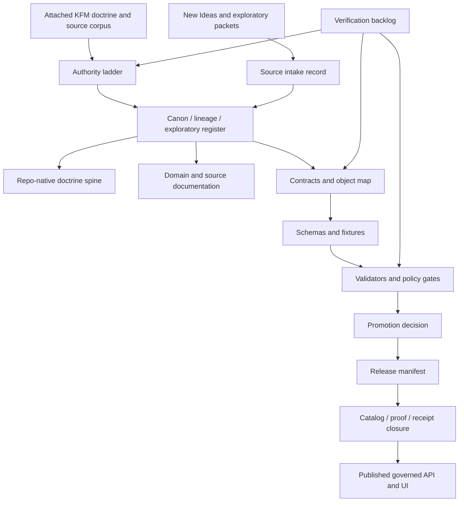

<!-- [KFM_META_BLOCK_V2]
doc_id: kfm://doc/TODO-control-plane-readme
title: Control Plane
type: standard
version: v1
status: draft
owners: TODO
created: TODO
updated: TODO
policy_label: TODO
related: [../../README.md, ../README.md, ../registers/AUTHORITY_LADDER.md, ../registers/CANONICAL_LINEAGE_EXPLORATORY.md, ../intake/IDEA_INTAKE.md, ../../contracts/OBJECT_MAP.md]
tags: [kfm, control-plane, documentation, governance, evidence, provenance]
notes: [NEEDS VERIFICATION: doc_id, owners, dates, policy_label, and related paths must be verified against the mounted repository before publication.]
[/KFM_META_BLOCK_V2] -->

# Control Plane

The KFM control plane keeps doctrine, source authority, proof objects, policy posture, validation gates, and publication state visible before anything becomes public-facing truth.

<p align="left">
  
  
  
  
</p>

> [!IMPORTANT]
> This README is repo-ready control-plane documentation, not proof that every referenced register, schema, validator, workflow, or emitted artifact already exists. Paths marked **PROPOSED** must be verified in the mounted repository before maintainers treat them as current implementation.

## Impact block

| Field | Value |
|---|---|
| **Status** | `draft` / **NEEDS VERIFICATION** |
| **Owners** | `TODO` |
| **Path** | `docs/control-plane/README.md` |
| **Authority level** | **PROPOSED** repo-native landing page for KFM documentation/governance control-plane surfaces |
| **Primary audience** | maintainers, architecture reviewers, documentation stewards, source stewards, policy reviewers, CI/validator owners |
| **Update trigger** | authority-ladder changes, canon/lineage/intake changes, object-family changes, schema/policy/validator placement changes, release/promotion process changes |
| **Do not use for** | claiming runtime maturity, route existence, workflow enforcement, emitted proof-object existence, or deployment status without direct repo evidence |

## Quick jumps

- [Scope](#scope)
- [Repo fit](#repo-fit)
- [Accepted inputs](#accepted-inputs)
- [Exclusions](#exclusions)
- [Control-plane map](#control-plane-map)
- [Directory tree](#directory-tree)
- [Core registers](#core-registers)
- [Governed lifecycle](#governed-lifecycle)
- [Maintenance gates](#maintenance-gates)
- [Verification checklist](#verification-checklist)
- [Appendix](#appendix)

---

## Scope

The control plane is the repo-visible layer that prevents KFM materials from becoming accidental authority by repetition, filename realism, or presentation polish.

It governs:

- source authority and source status;
- canon, lineage, exploratory, superseded, and archived material;
- object-family ownership across `contracts/`, `schemas/`, `policy/`, `tests/fixtures/`, and emitted artifact folders;
- evidence-resolution expectations for public claims;
- promotion, release, rollback, and correction documentation;
- documentation truth labels and verification boundaries.

It does **not** replace domain architecture, source registries, validators, policy rules, or emitted proof objects. It tells maintainers where those surfaces belong, how they relate, and what must be verified before claims become stronger than **PROPOSED**.

[Back to top](#control-plane)

## Repo fit

| Relationship | Path | Status | Role |
|---|---:|---|---|
| Root landing | [`../../README.md`](../../README.md) | **NEEDS VERIFICATION** | top-level repo orientation and project posture |
| Docs landing | [`../README.md`](../README.md) | **NEEDS VERIFICATION** | documentation entrypoint |
| Control-plane home | `docs/control-plane/README.md` | **PROPOSED** | this orientation file |
| Authority registers | `docs/registers/` | **PROPOSED** | source/canon/verification control records |
| Intake lane | `docs/intake/` | **PROPOSED** | controlled entry path for New Ideas and other exploratory material |
| Doctrine spine | `docs/doctrine/` | **PROPOSED** | stable project law and terminology |
| Object map | `contracts/OBJECT_MAP.md` | **PROPOSED** | semantic object-family ownership map |
| Executable shapes | `schemas/` or `schemas/contracts/v1/` | **CONFLICTED / NEEDS VERIFICATION** | machine-checkable schemas, pending repo convention |
| Policy gates | `policy/` | **PROPOSED / NEEDS VERIFICATION** | allow/deny/abstain/review logic |
| Fixtures and tests | `tests/fixtures/`, `tests/` | **PROPOSED / NEEDS VERIFICATION** | valid/invalid examples and regression checks |
| Emitted artifacts | `data/receipts/`, `data/proofs/`, `data/catalog/`, `release/` | **PROPOSED / NEEDS VERIFICATION** | produced receipts, proof packs, catalog records, release manifests |

> [!NOTE]
> If the mounted repository proves different canonical homes, update this README through an ADR or documented migration note rather than silently rewriting the control-plane map.

[Back to top](#control-plane)

## Accepted inputs

Use this directory for documentation that answers one of these questions:

| Input type | Belongs here when it… | Example |
|---|---|---|
| Authority rule | ranks source families or resolves source conflicts | source authority ladder |
| Canon register | identifies what is current canon, lineage, exploratory, superseded, or archived | canonical/lineage/exploratory register |
| Documentation law | defines truth-label, README, metadata, or repo-doc rules | documentation law |
| Intake process | controls how new packets, ideas, sources, or proposed docs enter review | New Ideas intake |
| Object-family map | explains where semantic contracts, schemas, policies, fixtures, and emitted artifacts belong | proof-object placement matrix |
| Verification backlog | records unknowns that must be retired by repo inspection, tests, emitted artifacts, or source checks | direct verification backlog |
| Drift register | tracks contradictions, duplicated authority, unresolved schema homes, or naming collisions | docs/schema-home conflict note |
| Rollback/correction control | documents how governance docs are reverted, superseded, or corrected | rollback register |

## Exclusions

| Does not belong here | Why | Put it here instead |
|---|---|---|
| Domain-specific architecture | control plane should not become the domain atlas | `docs/domains/<domain>/` |
| Source instance descriptors | source records belong in registry/source homes | `data/registry/` or `docs/sources/` |
| Machine schemas | executable validation belongs with schemas | `schemas/` or repo-confirmed schema home |
| Rego/OPA policies | policy code belongs with policy tooling | `policy/` |
| Test fixtures | fixtures must remain executable/verifiable | `tests/fixtures/` |
| Runtime routes or DTO implementation | implementation belongs with app/API packages | `apps/`, `packages/`, `web/`, or repo-confirmed homes |
| Emitted receipts/proofs/manifests | emitted artifacts are instances, not governance docs | `data/receipts/`, `data/proofs/`, `release/` |
| Raw New Ideas packets as canon | exploratory material must be triaged before promotion | `docs/intake/` and `docs/archive/exploratory/` |

[Back to top](#control-plane)

## Control-plane map



The diagram is intentionally a governance flow, not a runtime architecture. It shows how material becomes authoritative before public clients, map surfaces, or AI-assisted outputs can rely on it.

[Back to top](#control-plane)

## Directory tree

> [!WARNING]
> This tree is a **PROPOSED control-plane layout** unless the mounted repository already contains these paths.

```text
docs/
  control-plane/
    README.md                         # this landing page

  doctrine/
    DOCUMENTATION_LAW.md              # PROPOSED
    MASTER_DOCTRINE.md                # PROPOSED
    TERMINOLOGY.md                    # PROPOSED

  registers/
    AUTHORITY_LADDER.md               # PROPOSED
    CANONICAL_LINEAGE_EXPLORATORY.md  # PROPOSED
    DRIFT_REGISTER.md                 # PROPOSED
    VERIFICATION_BACKLOG.md           # PROPOSED

  intake/
    IDEA_INTAKE.md                    # PROPOSED
    NEW_IDEAS_INDEX.md                # PROPOSED

  archive/
    lineage/
      README.md                       # PROPOSED
    exploratory/
      README.md                       # PROPOSED

contracts/
  OBJECT_MAP.md                       # PROPOSED

schemas/
  README.md                           # NEEDS VERIFICATION

policy/
  README.md                           # NEEDS VERIFICATION

tests/
  fixtures/
    README.md                         # NEEDS VERIFICATION
```

## Core registers

| Register | Proposed path | What it controls | First useful content |
|---|---|---|---|
| Authority ladder | `docs/registers/AUTHORITY_LADDER.md` | source precedence and conflict resolution | ranked source classes + disagreement protocol |
| Canon/lineage/exploratory | `docs/registers/CANONICAL_LINEAGE_EXPLORATORY.md` | document status and canon boundaries | current canon, current support, lineage, exploratory, superseded |
| Verification backlog | `docs/registers/VERIFICATION_BACKLOG.md` | unknowns and concrete proof tasks | repo tree, schema home, workflow YAML, fixture inventory, emitted proof examples |
| Drift register | `docs/registers/DRIFT_REGISTER.md` | contradiction and duplication tracking | schema-home conflict, renamed object families, duplicated documentation |
| Idea intake | `docs/intake/IDEA_INTAKE.md` | exploratory packet triage and promotion | intake statuses, promotion criteria, reviewer burden |
| New Ideas index | `docs/intake/NEW_IDEAS_INDEX.md` | source-packet inventory | source id, date, family, status, proposed destination |
| Object map | `contracts/OBJECT_MAP.md` | semantic ownership of recurring KFM objects | EvidenceBundle, EvidenceRef, run_receipt, ReleaseManifest, CatalogMatrix, DecisionEnvelope, PromotionDecision |

[Back to top](#control-plane)

## Governed lifecycle

KFM’s control plane exists to protect this lifecycle:

```text
SOURCE EDGE
  -> RAW
  -> WORK / QUARANTINE
  -> PROCESSED
  -> CATALOG / TRIPLET
  -> PUBLISHED
  -> GOVERNED API
  -> TRUST-VISIBLE UI / FOCUS MODE
```

| Stage | Control-plane question | Required posture |
|---|---|---|
| Source edge | Is the source known, licensed, scoped, and role-classified? | SourceDescriptor or intake record before activation |
| Raw | Is this original material preserved without becoming public truth? | no public UI/API access |
| Work / quarantine | Did validation, rights, sensitivity, or ambiguity block promotion? | fail closed; record reason |
| Processed | Are derived outputs reproducible from admissible evidence? | run receipt and validator report |
| Catalog / triplet | Can artifacts close through catalog/provenance records? | catalog/proof closure |
| Published | Was promotion a reviewed state transition? | PromotionDecision + ReleaseManifest |
| Governed API | Are claims evidence-resolving and policy-safe? | EvidenceRef -> EvidenceBundle |
| UI / Focus Mode | Are trust state, citations, review state, and negative outcomes visible? | cite-or-abstain; finite outcomes |

> [!IMPORTANT]
> Receipts, proof packs, catalog records, release manifests, review records, correction notices, and published objects are related but not interchangeable. The control plane should make their boundaries obvious.

[Back to top](#control-plane)

## Maintenance gates

Before merging changes that affect this directory, reviewers should check:

- [ ] Every new or changed control-plane doc declares a truth posture.
- [ ] Every **PROPOSED** path remains labeled until verified in the mounted repo.
- [ ] No exploratory packet is promoted to canon without intake status and reviewer decision.
- [ ] No documentation claim asserts runtime behavior, route names, workflow enforcement, branch protection, emitted artifacts, or deployment maturity without direct evidence.
- [ ] Contract/schema/policy/test responsibilities remain separated.
- [ ] Any schema-home conflict is routed through an ADR or explicit migration note.
- [ ] Archived/lineage material remains reachable and is not silently deleted.
- [ ] Links from root/docs landing pages are updated when new control-plane docs are added.
- [ ] Rollback is simple: revert documentation/register changes without data or runtime side effects.

## Verification checklist

Use this checklist before marking this README `review` or `published`.

| Check | Status |
|---|---|
| Confirm `docs/control-plane/README.md` path exists in the repository | **NEEDS VERIFICATION** |
| Confirm owner/team for control-plane docs | **NEEDS VERIFICATION** |
| Confirm root README and docs README link here | **NEEDS VERIFICATION** |
| Confirm actual schema home: `schemas/`, `contracts/`, or `schemas/contracts/v1/` | **NEEDS VERIFICATION** |
| Confirm existing register docs before creating duplicates | **NEEDS VERIFICATION** |
| Confirm policy toolchain and policy folder conventions | **NEEDS VERIFICATION** |
| Confirm fixture and validator conventions | **NEEDS VERIFICATION** |
| Confirm emitted receipt/proof/catalog/release artifact folders | **NEEDS VERIFICATION** |
| Confirm workflow YAML and required CI checks before claiming enforcement | **NEEDS VERIFICATION** |
| Confirm documentation metadata conventions and replace TODOs | **NEEDS VERIFICATION** |

[Back to top](#control-plane)

## Appendix

<details>
<summary>Truth labels used by this README</summary>

| Label | Meaning |
|---|---|
| **CONFIRMED** | verified from current repo/workspace evidence, attached doctrine, directly inspected files, command output, or generated artifacts |
| **INFERRED** | strongly supported by source-grounded synthesis but not directly verified as implementation |
| **PROPOSED** | recommended design, path, rule, or placement not verified as current repo behavior |
| **UNKNOWN** | not verified strongly enough to claim |
| **NEEDS VERIFICATION** | concrete check required before promotion to stronger status |
| **CONFLICTED** | source or placement ambiguity exists and needs explicit resolution |
| **LINEAGE** | preserved historical/support material, not current implementation proof |
| **EXPLORATORY** | idea/intake material that may influence future work but is not canon |
| **SUPERSEDED** | retained for history but replaced by stronger current authority |

</details>

<details>
<summary>Minimum first PR shape</summary>

A small first PR for this control plane should create or revise only documentation and registers:

1. `docs/control-plane/README.md`
2. `docs/registers/AUTHORITY_LADDER.md`
3. `docs/registers/CANONICAL_LINEAGE_EXPLORATORY.md`
4. `docs/registers/VERIFICATION_BACKLOG.md`
5. `docs/intake/IDEA_INTAKE.md`
6. `docs/archive/lineage/README.md`
7. `contracts/OBJECT_MAP.md`
8. root/docs landing links

It should not add live source connectors, runtime routes, model integrations, promotion automation, or public UI claims.

</details>

<details>
<summary>Review questions</summary>

- Does this file describe current repo reality, proposed structure, or both?
- Are all uncertain claims labeled with the narrowest truthful status?
- Does any linked path need an ADR before becoming canonical?
- Does this README make it easier to locate authority, or does it create another competing authority surface?
- Can a maintainer roll back this doc change without touching data, schemas, policies, release artifacts, or runtime services?

</details>

[Back to top](#control-plane)
