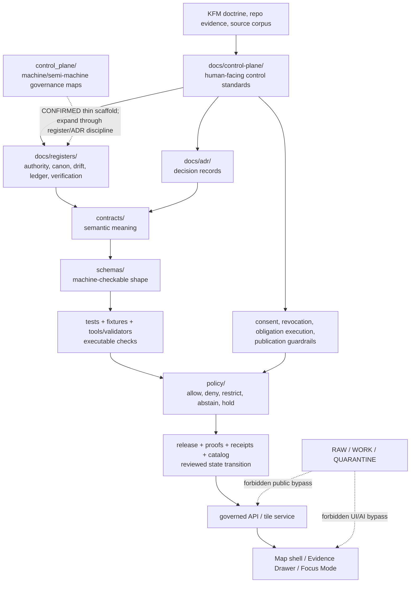

<!-- [KFM_META_BLOCK_V2]
doc_id: kfm://doc/TODO-control-plane-readme
title: Control Plane
type: standard
version: v1
status: draft
owners: TODO-NEEDS-CODEOWNERS-VERIFICATION
created: TODO-NEEDS-GIT-HISTORY-VERIFICATION
updated: 2026-05-06
policy_label: TODO-NEEDS-POLICY-LABEL-VERIFICATION
related: [../../README.md, ../README.md, ../../control_plane/README.md, ../registers/README.md, ../registers/AUTHORITY_LADDER.md, ../registers/CANONICAL_LINEAGE_EXPLORATORY.md, ../registers/DRIFT_REGISTER.md, ../registers/SOURCE_LEDGER.md, ../registers/VERIFICATION_BACKLOG.md, ../architecture/contract-schema-policy-split.md, ../adr/ADR-0001-schema-home.md, ../../contracts/README.md, ../../schemas/README.md, ../../policy/README.md, ../../tools/ci/verify_baseline.sh, ../../.github/workflows/README.md, ./CONSENT_AND_REVOCATION.md, ./obligation-execution.md]
tags: [kfm, control-plane, documentation, governance, evidence, registers, verification, publication]
notes: [Target path is CONFIRMED from GitHub repository evidence. Local workspace was not mounted as a Git checkout in this session. doc_id, owners, created date, and policy_label remain review placeholders until verified through the repo-native document registry, Git history, CODEOWNERS, and policy-label source.]
[/KFM_META_BLOCK_V2] -->

<a id="top"></a>

# Control Plane

Repo-facing control surface for KFM authority, registers, verification gaps, and publication guardrails.

<p align="left">
  
  
  
  
  
  
</p>

> [!IMPORTANT]
> This README orients the **human-facing** control-plane documentation under `docs/control-plane/`. It does not prove runtime behavior, CI enforcement, route maturity, branch protections, emitted proof objects, release state, dashboard state, or deployment posture unless those are backed by direct current repo evidence.

---

## Impact block

| Field | Value |
|---|---|
| **Status** | `draft` content on a **CONFIRMED** repository path |
| **Owners** | `TODO-NEEDS-CODEOWNERS-VERIFICATION` |
| **Path** | `docs/control-plane/README.md` |
| **Owning root** | `docs/` — human-facing doctrine, architecture, runbook, register, and control-plane documentation |
| **Sibling machine/semi-machine root** | `control_plane/` — **CONFIRMED thin scaffold**; expand only with register/ADR-backed placement |
| **Primary audience** | maintainers, documentation stewards, source stewards, policy reviewers, schema/contract reviewers, release reviewers, CI/validator owners |
| **Primary upstreams** | root README, Directory Rules, current ADRs, register files, source ledger, contract/schema/policy split |
| **Primary downstreams** | registers, ADRs, contracts, schemas, policy, validators, workflow checks, release/correction runbooks, governed API/UI surfaces |
| **Do not use for** | asserting implementation maturity, source activation, route behavior, CI enforcement, public-release readiness, or model/runtime safety without direct evidence |

**Quick jumps:** [Scope](#scope) · [Repo fit](#repo-fit) · [Accepted inputs](#accepted-inputs) · [Exclusions](#exclusions) · [Confirmed repo checkpoint](#confirmed-repo-checkpoint) · [Operating model](#operating-model) · [Control surfaces](#control-surfaces) · [Directory tree](#directory-tree) · [Lifecycle hooks](#lifecycle-hooks) · [Maintenance gates](#maintenance-gates) · [Quickstart](#quickstart) · [FAQ](#faq) · [Appendix](#appendix)

---

## Scope

`docs/control-plane/` is the human-readable control surface for keeping KFM’s source authority, register discipline, consent/revocation posture, obligation execution, verification backlog, and publication guardrails inspectable.

It exists because KFM is intentionally source-rich and doctrine-rich. Without a control plane, strong prose, generated plans, exploratory packets, repository scaffolds, and emitted artifacts can be mistaken for equal authority.

This directory helps maintainers answer:

| Question | Control-plane answer |
|---|---|
| What outranks what? | Route to the authority ladder and ADRs. |
| What is canon, lineage, exploratory, reference, or superseded? | Route to the classification register and source ledger. |
| What remains unknown or conflicted? | Route to drift and verification registers. |
| What must fail closed before publication? | Route to policy, obligation execution, consent/revocation, and release gates. |
| What can public clients trust? | Only governed API/UI outputs backed by evidence, policy, review, release, and correction state. |
| What can AI summarize? | Only released, evidence-bounded, policy-safe context; never RAW/WORK/QUARANTINE or direct model output as truth. |

### What this directory does not do

This directory does **not** store canonical data, machine schemas, policy code, source descriptors, runtime routes, validators, receipts, proof packs, release manifests, or public artifacts. It explains the governance boundaries that keep those surfaces from drifting.

[Back to top](#top)

---

## Repo fit

| Relationship | Path | Status | Role |
|---|---|---:|---|
| Root orientation | [`../../README.md`](../../README.md) | CONFIRMED | Project identity, trust law, lifecycle, responsibility-root orientation. |
| Docs landing | [`../README.md`](../README.md) | CONFIRMED / thin | Parent docs entrypoint; currently minimal and should link back here when expanded. |
| This file | [`./README.md`](./README.md) | CONFIRMED | Control-plane directory README and navigation surface. |
| Consent/revocation standard | [`./CONSENT_AND_REVOCATION.md`](./CONSENT_AND_REVOCATION.md) | CONFIRMED | Consent refs, obligation hashes, deterministic revocation deltas, secret non-serialization posture. |
| Obligation execution standard | [`./obligation-execution.md`](./obligation-execution.md) | CONFIRMED | Obligation receipts, recompute queue, publish-time fail-closed rules. |
| Documentation registers | [`../registers/README.md`](../registers/README.md) | CONFIRMED | Register directory index and inventory surface. |
| Authority ladder | [`../registers/AUTHORITY_LADDER.md`](../registers/AUTHORITY_LADDER.md) | CONFIRMED / draft | Source hierarchy and conflict-resolution rules. |
| Canon/lineage/exploratory register | [`../registers/CANONICAL_LINEAGE_EXPLORATORY.md`](../registers/CANONICAL_LINEAGE_EXPLORATORY.md) | CONFIRMED / draft | Classification model for source/document families. |
| Drift register | [`../registers/DRIFT_REGISTER.md`](../registers/DRIFT_REGISTER.md) | CONFIRMED / draft | Contradictions, overclaims, naming drift, authority ambiguity. |
| Source ledger | [`../registers/SOURCE_LEDGER.md`](../registers/SOURCE_LEDGER.md) | CONFIRMED / draft | Source-routing ledger; not a bibliography or implementation proof. |
| Verification backlog | [`../registers/VERIFICATION_BACKLOG.md`](../registers/VERIFICATION_BACKLOG.md) | CONFIRMED / draft | UNKNOWN / NEEDS VERIFICATION / CONFLICTED claims that must be retired by evidence. |
| Contract/schema/policy split | [`../architecture/contract-schema-policy-split.md`](../architecture/contract-schema-policy-split.md) | CONFIRMED / draft | Architecture note: contracts explain meaning; schemas validate shape; policy decides behavior. |
| Schema-home ADR | [`../adr/ADR-0001-schema-home.md`](../adr/ADR-0001-schema-home.md) | CONFIRMED / proposed | Proposed `schemas/contracts/v1/` machine-schema home; not accepted until evidence gates pass. |
| Semantic contracts | [`../../contracts/README.md`](../../contracts/README.md) | CONFIRMED / draft | Object meaning, field intent, compatibility, proof-object semantics. |
| Machine schemas | [`../../schemas/README.md`](../../schemas/README.md) | CONFIRMED / unresolved authority | Parent schema lane; schema-home authority still requires ADR acceptance. |
| Policy decision lane | [`../../policy/README.md`](../../policy/README.md) | CONFIRMED / review | Deny-by-default decision surface for rights, sensitivity, runtime trust, review, release, and correction. |
| Baseline verifier | [`../../tools/ci/verify_baseline.sh`](../../tools/ci/verify_baseline.sh) | CONFIRMED script | Checks required baseline files and workflow count; run status not claimed here. |
| Workflow orchestration docs | [`../../.github/workflows/README.md`](../../.github/workflows/README.md) | CONFIRMED / proposed enforcement | Workflow directory contract; exact YAML enforcement and branch rules need verification. |
| Machine/semi-machine control root | [`../../control_plane/README.md`](../../control_plane/README.md) | CONFIRMED / thin scaffold | Root-level operational register home; not a substitute for this human-facing doc. |

> [!NOTE]
> Directory placement follows the KFM responsibility-root rule: `docs/` explains; `control_plane/` indexes machine-readable or semi-machine-readable governance maps; `contracts/` defines meaning; `schemas/` validates shape; `policy/` decides admissibility; `tests/fixtures/` prove behavior.

[Back to top](#top)

---

## Accepted inputs

Use `docs/control-plane/` for concise, reviewable documentation that governs cross-domain evidence, authority, verification, publication, or public-trust behavior.

| Accepted input | Belongs here when it… | Typical downstream surface |
|---|---|---|
| Control-plane README | orients maintainers to authority, registers, and guardrails | docs/registers, ADRs, contracts, schemas, policy |
| Consent and revocation standard | controls consent refs, obligation hashes, revocation deltas, and public-safe disclosure | EvidenceBundle refs, run receipts, policy gates, correction/rollback |
| Obligation execution standard | controls obligation receipts, recompute queue, retention/consent conflict, public-field scans | policy/governance, release manifests, correction records |
| Publication guardrail note | explains release as state transition rather than file movement | release, proofs, receipts, catalog, policy |
| Authority routing note | clarifies source precedence, register use, and conflict routing | authority ladder, drift register, ADRs |
| Verification workflow note | defines what must be proven before claims are upgraded | verification backlog, CI, validators, tests |
| Control-plane correction note | explains how governance docs are superseded or corrected | correction/rollback runbooks, release history |
| Cross-surface map | explains how docs, registers, ADRs, contracts, schemas, policy, tests, release, and runtime relate | repo navigation and reviewer checklists |

---

## Exclusions

| Does not belong here | Why not | Put it instead |
|---|---|---|
| Machine-readable governance registers | This directory explains; machine/semi-machine maps need a separate operational root. | `control_plane/` after ADR/register-backed expansion |
| Full domain architecture | Domains need bounded homes and domain-specific review burden. | `docs/domains/<domain>/` |
| Source descriptors or source instance records | Source descriptors need rights, cadence, role, steward, and registry treatment. | `data/registry/` or `docs/sources/` after convention verification |
| JSON Schemas | Executable shape must stay in schema homes. | `schemas/` or ADR-approved schema home |
| Semantic object contracts | Contract meaning has its own root. | `contracts/` |
| Policy-as-code | Policy rules must remain executable and testable. | `policy/` |
| Fixtures and validator tests | Tests prove behavior; they should not become governance prose. | `tests/`, `fixtures/`, or repo-approved fixture home |
| Runtime code, API handlers, UI components, or adapters | Implementation consumes the control plane; it does not live here. | `apps/`, `packages/`, `tools/`, or repo-confirmed homes |
| Receipts, proof packs, release manifests, catalog records | Emitted artifacts are instances, not standards. | `data/receipts/`, `data/proofs/`, `data/catalog/`, `release/` |
| New Ideas packets as canon | Exploratory material requires intake/classification before promotion. | `docs/intake/` or register/ledger route after path verification |
| RAW / WORK / QUARANTINE data | Public or semi-public docs must not become an internal data path. | `data/raw/`, `data/work/`, `data/quarantine/` with governed access controls |

[Back to top](#top)

---

## Confirmed repo checkpoint

The table below reflects evidence inspected through the GitHub repository connector on `main`. It does not claim local checkout execution, workflow runs, branch protections, deployment state, or emitted artifact maturity.

| Surface | Status | Review note |
|---|---:|---|
| `docs/control-plane/README.md` | CONFIRMED | This target file exists and is being revised here. |
| `docs/control-plane/CONSENT_AND_REVOCATION.md` | CONFIRMED | Strong adjacent control-plane standard; owners and some metadata remain TODO/NEEDS VERIFICATION. |
| `docs/control-plane/obligation-execution.md` | CONFIRMED | Strong adjacent publication-enforcement standard; some fixture/test command paths remain NEEDS VERIFICATION. |
| `docs/registers/README.md` | CONFIRMED | Register inventory checkpoint lists key register files and reorg-control surfaces. |
| `docs/registers/AUTHORITY_LADDER.md` | CONFIRMED | Draft ladder exists; owner/policy label verification remains open. |
| `docs/registers/CANONICAL_LINEAGE_EXPLORATORY.md` | CONFIRMED | Draft classification register exists. |
| `docs/registers/DRIFT_REGISTER.md` | CONFIRMED | Active drift items include schema/contract authority, workflow enforcement proof, and proof-object executable definitions. |
| `docs/registers/VERIFICATION_BACKLOG.md` | CONFIRMED | Tracks repo truth, schema/policy home, runtime, release, and source verification gaps. |
| `docs/registers/SOURCE_LEDGER.md` | CONFIRMED | Source-routing ledger exists; content should be cleaned/reviewed before stronger status because metadata and repo-depth claims remain draft. |
| `docs/architecture/contract-schema-policy-split.md` | CONFIRMED | Operating split is documented but enforcement maturity remains NEEDS VERIFICATION. |
| `docs/adr/ADR-0001-schema-home.md` | CONFIRMED / PROPOSED | Proposes `schemas/contracts/v1/`; not accepted until validation and owner/review evidence pass. |
| `contracts/README.md` | CONFIRMED | Contract lane owns meaning; machine-contract authority remains unresolved until ADR acceptance. |
| `schemas/README.md` | CONFIRMED | Schema lane exists and includes first-wave schema families; canonical authority still needs verification. |
| `policy/README.md` | CONFIRMED | Policy lane states deny-by-default posture; implementation/enforcement claims remain bounded. |
| `control_plane/README.md` | CONFIRMED / thin | Root machine/semi-machine control-plane home exists as baseline scaffold only. |
| `.github/workflows/README.md` | CONFIRMED | Workflow-lane contract exists; exact YAML inventory and enforcement status remain NEEDS VERIFICATION. |
| `tools/ci/verify_baseline.sh` | CONFIRMED | Baseline checker script exists; this README does not claim it has run in the active branch. |

[Back to top](#top)

---

## Operating model



### Reading the diagram

The control plane is not a single file and not a runtime service. It is a reviewable set of boundaries:

1. **Human-facing control docs** explain what must be true.
2. **Registers and ADRs** classify authority and resolve conflicts.
3. **Contracts, schemas, policy, tests, and validators** make the trust objects executable and reviewable.
4. **Receipts, proof packs, catalog records, and release manifests** support governed publication.
5. **Governed APIs and trust-visible UI** are downstream consumers, not source truth.

[Back to top](#top)

---

## Control surfaces

| Surface | Governs | Current posture |
|---|---|---|
| `docs/control-plane/README.md` | Orientation and routing for the control-plane directory. | CONFIRMED path / draft content |
| `CONSENT_AND_REVOCATION.md` | Consent refs, obligation hashes, deterministic revocation deltas, revocation-token non-serialization. | CONFIRMED path / draft standard |
| `obligation-execution.md` | Obligation execution receipts, recompute queue, publish-time fail-closed rules. | CONFIRMED path / draft standard |
| `docs/registers/AUTHORITY_LADDER.md` | Source precedence and conflict-resolution protocol. | CONFIRMED path / draft |
| `docs/registers/CANONICAL_LINEAGE_EXPLORATORY.md` | Canon, lineage, exploratory, reference, superseded classification. | CONFIRMED path / draft |
| `docs/registers/DRIFT_REGISTER.md` | Active contradictions, authority gaps, workflow enforcement uncertainty. | CONFIRMED path / draft |
| `docs/registers/SOURCE_LEDGER.md` | Source routing, source classes, source authority ranking. | CONFIRMED path / draft |
| `docs/registers/VERIFICATION_BACKLOG.md` | Claims that cannot be upgraded without concrete evidence. | CONFIRMED path / draft |
| `docs/architecture/contract-schema-policy-split.md` | Responsibility split across contracts, schemas, policy, validators, release, runtime. | CONFIRMED path / draft |
| `docs/adr/ADR-0001-schema-home.md` | Proposed canonical machine schema home. | CONFIRMED path / proposed ADR |
| `control_plane/README.md` | Machine/semi-machine governance root. | CONFIRMED path / thin scaffold |

> [!WARNING]
> Do not treat a confirmed file path as proof that every statement in the file is enforced. KFM separates **file presence**, **doctrine**, **implementation**, **test evidence**, **workflow enforcement**, **release state**, and **runtime behavior**.

[Back to top](#top)

---

## Directory tree

```text
docs/
  control-plane/
    README.md                         # CONFIRMED: this file
    CONSENT_AND_REVOCATION.md         # CONFIRMED: consent/revocation standard
    obligation-execution.md           # CONFIRMED: obligation/recompute/publish enforcement standard

  registers/
    README.md                         # CONFIRMED: register landing page
    AUTHORITY_LADDER.md               # CONFIRMED: authority rules
    CANONICAL_LINEAGE_EXPLORATORY.md  # CONFIRMED: source/doc classification
    DRIFT_REGISTER.md                 # CONFIRMED: contradiction and drift tracking
    SOURCE_LEDGER.md                  # CONFIRMED: source-routing ledger
    VERIFICATION_BACKLOG.md           # CONFIRMED: unresolved verification work
    PMTILES_MANIFEST_REGISTER.md      # CONFIRMED by register index; content review not performed here
    REPO_ORGANIZATION_AUDIT.md        # CONFIRMED by register index; content review not performed here

  architecture/
    contract-schema-policy-split.md   # CONFIRMED: split architecture note

  adr/
    ADR-0001-schema-home.md           # CONFIRMED: proposed schema-home ADR

control_plane/
  README.md                           # CONFIRMED: thin scaffold; machine/semi-machine control root

contracts/
  README.md                           # CONFIRMED: semantic contract lane

schemas/
  README.md                           # CONFIRMED: schema parent lane; authority unresolved until ADR acceptance

policy/
  README.md                           # CONFIRMED: policy decision lane

tools/
  ci/
    verify_baseline.sh                # CONFIRMED: baseline verifier script

.github/
  workflows/
    README.md                         # CONFIRMED: workflow-lane contract; enforcement not claimed
```

[Back to top](#top)

---

## Lifecycle hooks

The control plane protects KFM’s lifecycle law:

```text
SOURCE EDGE
  -> RAW
  -> WORK / QUARANTINE
  -> PROCESSED
  -> CATALOG / TRIPLET
  -> PUBLISHED
  -> GOVERNED API
  -> TRUST-VISIBLE UI / FOCUS MODE
```

| Lifecycle stage | Control-plane question | Required posture |
|---|---|---|
| Source edge | Is the source role, rights posture, cadence, authority, sensitivity, and steward context known? | SourceDescriptor or intake record before activation. |
| RAW | Is source-native material preserved without becoming public truth? | No public API/UI/AI path. |
| WORK | Are transformations tracked and reviewable? | Receipts and validation reports before promotion. |
| QUARANTINE | Did rights, sensitivity, source-role, evidence, or validation fail? | Fail closed and record reason. |
| PROCESSED | Are outputs normalized but still unreleased? | No public claim until catalog/proof/policy/review close. |
| CATALOG / TRIPLET | Can discovery and graph/search projections resolve back to evidence? | Catalog/provenance closure; derivatives remain non-sovereign. |
| PUBLISHED | Was publication a reviewed state transition? | PromotionDecision, ReleaseManifest, proof support, correction path, rollback target. |
| GOVERNED API | Are public responses finite, cited, evidence-resolving, and policy-safe? | EvidenceRef → EvidenceBundle; finite outcomes. |
| TRUST-VISIBLE UI / FOCUS MODE | Are evidence, policy, review, release, stale, restriction, correction, and denial states visible? | Cite-or-abstain; no direct model or internal-store bypass. |

> [!IMPORTANT]
> Schema-valid does not mean publishable. A KFM object still needs evidence, rights, sensitivity, policy, review, release, and correction support before public or semi-public exposure.

[Back to top](#top)

---

## Maintenance gates

Before merging changes to `docs/control-plane/`, reviewers should confirm:

- [ ] The KFM Meta Block v2 wrapper remains intact.
- [ ] Status, owners, created date, updated date, and policy label are either verified or visibly marked `TODO` / `NEEDS VERIFICATION`.
- [ ] The file has one H1 and a one-line purpose directly below the title.
- [ ] The doc distinguishes **CONFIRMED path evidence** from **enforced implementation behavior**.
- [ ] No exploratory packet, older PDF, generated plan, or repeated prose is promoted to canon without register/ADR evidence.
- [ ] Links to register, ADR, contract, schema, policy, workflow, and validator surfaces are valid from `docs/control-plane/`.
- [ ] `docs/control-plane/` remains human-facing; machine/semi-machine registers are routed to `control_plane/` or `docs/registers/` as appropriate.
- [ ] Consent and revocation docs do not expose or normalize secret-bearing fields.
- [ ] Obligation/recompute/publication docs preserve fail-closed behavior.
- [ ] Schema-home claims remain aligned with `ADR-0001` and stay `PROPOSED` until acceptance evidence exists.
- [ ] Workflow and CI claims remain `NEEDS VERIFICATION` unless workflow YAML, run evidence, and required-check settings are inspected.
- [ ] Public UI/API/AI claims preserve the governed API and released-artifact boundary.
- [ ] Rollback is simple for documentation-only changes: revert the doc/register change and preserve correction lineage.

### Definition of done for this README

This README can move from `draft` to `review` only when:

- [ ] `doc_id` is assigned by the repo-native document registry or explicitly reserved.
- [ ] Owners are verified through CODEOWNERS or governance records.
- [ ] `created` date is reconciled with Git history.
- [ ] `policy_label` is confirmed.
- [ ] Root and docs landing pages link here.
- [ ] All relative links pass a repo-native link check.
- [ ] Adjacent `CONSENT_AND_REVOCATION.md` and `obligation-execution.md` metadata is checked for consistency.
- [ ] Register references match the active `docs/registers/` inventory.
- [ ] This README does not claim workflow enforcement or runtime maturity without evidence.

[Back to top](#top)

---

## Quickstart

Use these commands from a mounted checkout before editing or reviewing this directory.

```bash
# Confirm the checkout and branch state.
git status --short
git branch --show-current || true
git rev-parse --show-toplevel || true
```

```bash
# Inspect the control-plane and register surface.
find docs/control-plane docs/registers docs/architecture docs/adr control_plane \
  -maxdepth 2 -type f 2>/dev/null | sort
```

```bash
# Inspect adjacent authority and enforcement surfaces.
find contracts schemas policy tests fixtures tools/ci .github/workflows release data/proofs data/receipts \
  -maxdepth 3 -type f 2>/dev/null | sort | sed -n '1,500p'
```

```bash
# Search for trust-bearing vocabulary before upgrading claims.
git grep -nE \
  'EvidenceBundle|EvidenceRef|SourceDescriptor|DecisionEnvelope|RuntimeResponseEnvelope|PolicyDecision|PromotionDecision|ReleaseManifest|CorrectionNotice|Rollback|spec_hash|run_receipt|AIReceipt|ABSTAIN|DENY|RAW|QUARANTINE|PUBLISHED|schema home|control plane' \
  -- docs contracts schemas policy tests fixtures tools data release apps packages .github 2>/dev/null || true
```

```bash
# Confirm this README has exactly one H1.
grep -n '^# ' docs/control-plane/README.md
```

```bash
# Run the baseline verifier only when the active checkout and shell environment are verified.
sh tools/ci/verify_baseline.sh baseline-report.txt --root .
```

> [!NOTE]
> Do not report tests, workflow gates, policy checks, or baseline verification as passing unless they actually ran in the active checkout.

[Back to top](#top)

---

## FAQ

### Is `docs/control-plane/` the same as `control_plane/`?

No. `docs/control-plane/` is the human-facing standards and routing surface. Root `control_plane/` is the proposed machine-readable or semi-machine-readable governance-map root. The current root `control_plane/README.md` is confirmed but thin, so this README should not imply mature machine control-plane implementation.

### Does a confirmed README path prove enforcement?

No. A file path can be confirmed while its owners, policy label, workflow enforcement, validators, route behavior, emitted artifacts, and release state remain unverified.

### Why keep so many truth labels visible?

Because KFM’s main failure mode is persuasive overclaiming. Labels preserve reviewability when doctrine, repo evidence, lineage, exploratory plans, generated artifacts, and runtime behavior have different proof strength.

### Can this directory contain policy rules?

No. It can explain policy posture and route reviewers to policy surfaces. Policy-as-code belongs in `policy/`.

### Can this directory contain schemas?

No. It can explain schema-home decisions and link to schema surfaces. Machine-checkable shape belongs in `schemas/` or an ADR-approved schema home.

### Can AI or Focus Mode use control-plane docs as truth?

Only as interpretive context. Public or semi-public AI answers still need released, policy-safe evidence context and finite outcomes. EvidenceBundle, policy, review, release, correction, and rollback state outrank generated language.

[Back to top](#top)

---

## Appendix

<details>
<summary><strong>Truth labels used here</strong></summary>

| Label | Meaning |
|---|---|
| **CONFIRMED** | Verified from current repo evidence, attached doctrine, directly inspected files, command output, or generated artifacts. |
| **INFERRED** | Strongly supported by source-grounded synthesis but not directly verified as implementation. |
| **PROPOSED** | Recommended design, path, rule, or placement not verified as current repo behavior. |
| **UNKNOWN** | Not verified strongly enough to claim. |
| **NEEDS VERIFICATION** | Concrete check required before stronger status. |
| **CONFLICTED** | Source or placement ambiguity exists and needs explicit resolution. |
| **LINEAGE** | Preserved historical/support material, not current implementation proof. |
| **EXPLORATORY** | Idea/intake material that may influence future work but is not canon. |
| **SUPERSEDED** | Retained for history but replaced by stronger current authority. |

</details>

<details>
<summary><strong>Reviewer prompts</strong></summary>

1. Is this statement doctrine, current repo evidence, implementation proof, runtime behavior, or a proposal?
2. Does the statement need a truth label?
3. Which register or ADR would resolve a conflict?
4. Is a proposed path backed by Directory Rules and current repo evidence?
5. Does the doc preserve the split between `docs/`, `control_plane/`, `contracts/`, `schemas/`, `policy/`, `tests/`, and emitted artifacts?
6. Does any public-facing claim bypass EvidenceRef → EvidenceBundle?
7. Does any AI/UI/API claim imply direct access to RAW, WORK, QUARANTINE, canonical stores, or direct model output?
8. Is rollback/correction visible if this control-plane guidance is wrong?

</details>

<details>
<summary><strong>Smallest useful follow-up PR shape</strong></summary>

A small follow-up PR should stay documentation/register-only unless maintainers deliberately choose an implementation PR.

1. Resolve this README’s owner, created date, policy label, and doc ID.
2. Link root `README.md` and `docs/README.md` to this file.
3. Reconcile `docs/control-plane/` with `docs/registers/README.md`.
4. Confirm whether `docs/intake/` exists before linking exploratory intake docs.
5. Clean source-ledger metadata if needed.
6. Add or update a `control_plane/` root README that explains machine/semi-machine governance registers without duplicating this file.
7. Run link checks and metadata checks.
8. Record any remaining conflicts in `DRIFT_REGISTER.md` and `VERIFICATION_BACKLOG.md`.

</details>

[Back to top](#top)
