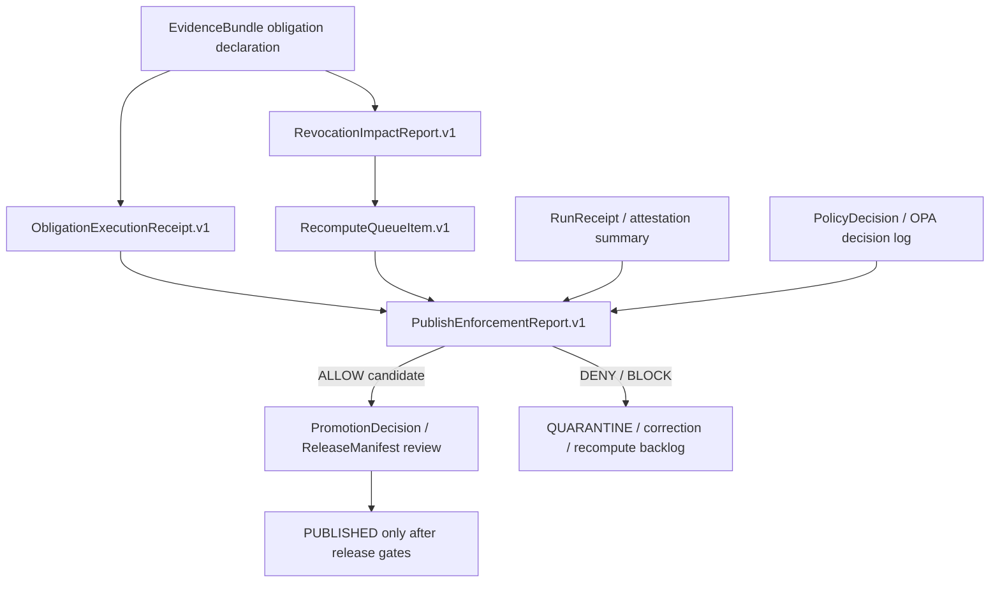
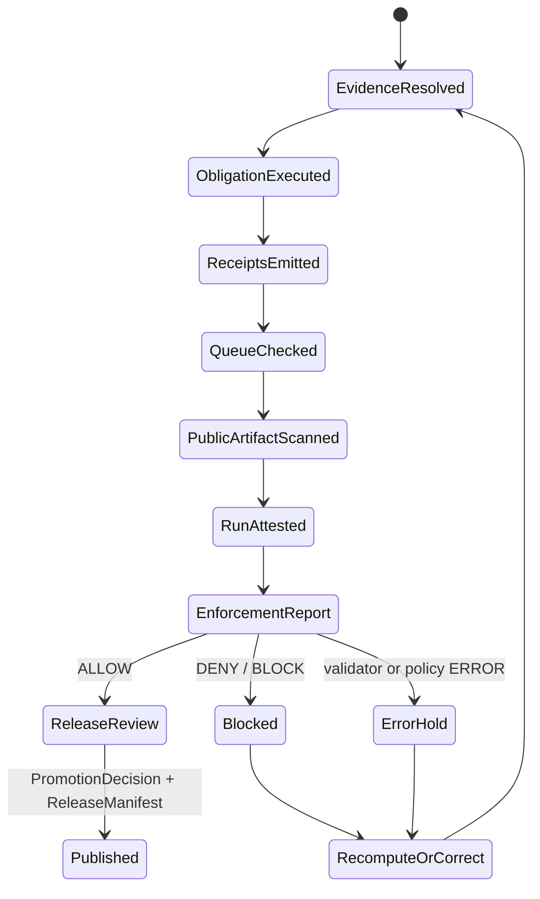
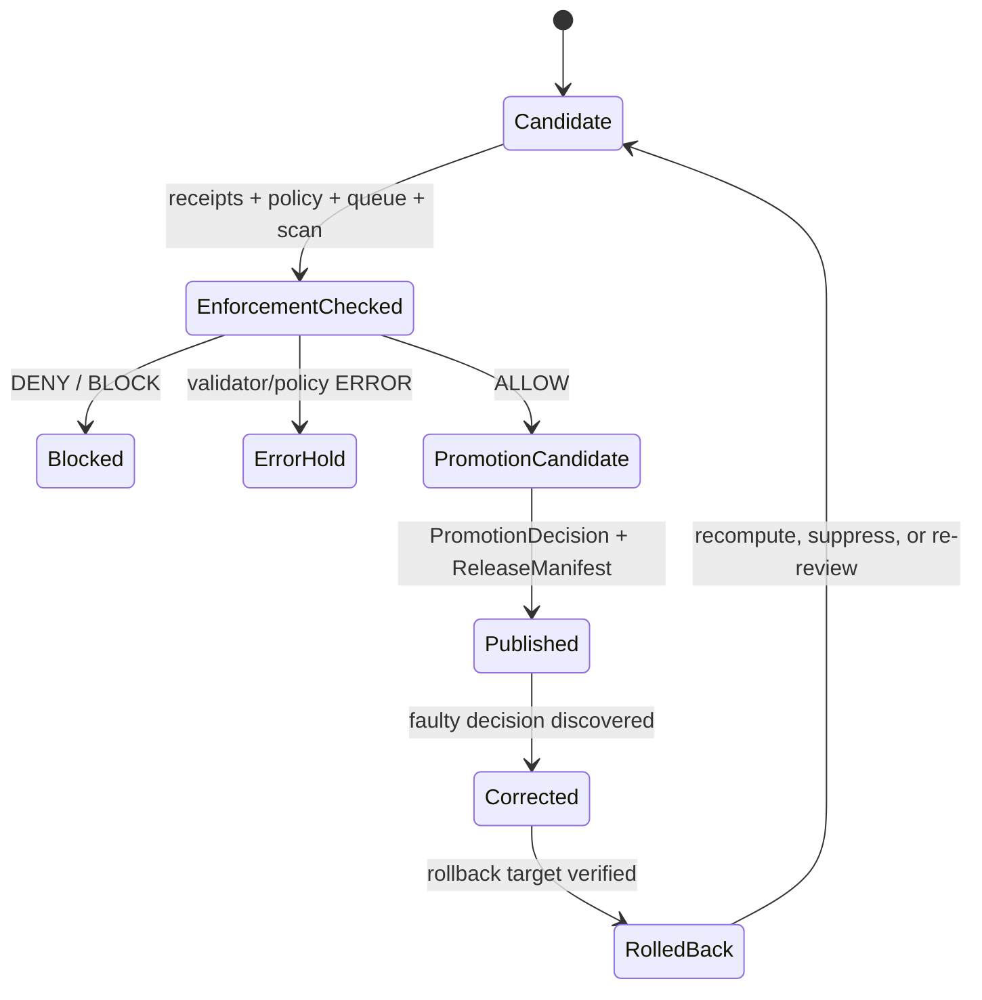

<!-- [KFM_META_BLOCK_V2]
doc_id: kfm://doc/governance/obligation-execution-v1
title: Obligation Execution + Recompute Queue + Publish Enforcement v1
type: standard
version: v1
status: draft
owners: TODO: governance owner not verified
created: NEEDS_VERIFICATION
updated: 2026-05-06
policy_label: public
related: [./README.md, ./CONSENT_AND_REVOCATION.md, ../adr/ADR-0427-consent-vc-and-revocation-delta.md, ../../schemas/governance/obligation_execution_receipt.schema.json, ../../schemas/governance/recompute_queue_item.schema.json, ../../schemas/governance/revocation_impact_report.schema.json, ../../schemas/governance/publish_enforcement_report.schema.json, ../../tools/validators/governance/validate_obligation_execution.py, ../../policy/governance/obligation_execution.rego, ../../policy/governance/obligation_execution_test.rego, ../../tests/governance/test_obligation_execution_validator.py, ../../tests/fixtures/governance/obligation_execution/valid/suppress_huc12.json, ../../tests/fixtures/governance/obligation_execution/valid/revocation_triggers_recompute.json, ../../tests/fixtures/governance/obligation_execution/invalid/unresolved_recompute_queue.json]
tags: [kfm, governance, obligation-execution, recompute-queue, publish-enforcement, receipts, fail-closed]
notes: [Existing repo path confirmed on main. Schema, validator, policy, policy-test, pytest, and named fixture paths were confirmed through repository connector evidence. Owners and created date remain unresolved. Updated is set to current authoring date and should be verified at commit time. CI enforcement, branch protection, job logs, OPA availability, and runtime/release integration remain NEEDS VERIFICATION.]
[/KFM_META_BLOCK_V2] -->

<a id="top"></a>

# Obligation Execution + Recompute Queue + Publish Enforcement v1

Governance standard for proving obligation execution, reconciling recompute backlog, and blocking unsafe publication before KFM material reaches `PUBLISHED`.

<p align="left">
  
  
  
  
  
  
</p>

> [!IMPORTANT]
> Publication is a governed state transition, not a file move. This layer must fail closed when obligation receipts are missing, recompute work is unresolved, consent or retention posture conflicts with publication, public artifacts expose forbidden fields, or run attestation cannot be verified.

**Quick jumps:** [Document control](#document-control) · [Repo fit](#repo-fit) · [Accepted inputs](#accepted-inputs) · [Exclusions](#exclusions) · [Lifecycle placement](#lifecycle-placement) · [Object model](#object-model) · [Execution flow](#execution-flow) · [Receipt chain](#receipt-chain) · [Recompute queue](#recompute-queue) · [Publish enforcement](#publish-enforcement) · [Public-safety scan](#public-safety-scan) · [Validation](#validation) · [CI expectations](#ci-expectations) · [Known gaps](#known-gaps) · [Rollback](#rollback-and-correction) · [Review checklist](#review-checklist)

---

## Document control

| Field | Value |
|---|---|
| **Path** | `docs/control-plane/obligation-execution.md` |
| **Status** | `draft` |
| **Authority role** | Human-facing control-plane standard for obligation receipts, recompute queue state, and publish enforcement |
| **Owning root** | `docs/` — human-facing doctrine, standards, runbooks, registers, and control-plane guidance |
| **Primary upstreams** | [`./README.md`](./README.md), [`./CONSENT_AND_REVOCATION.md`](./CONSENT_AND_REVOCATION.md), [`../adr/ADR-0427-consent-vc-and-revocation-delta.md`](../adr/ADR-0427-consent-vc-and-revocation-delta.md) |
| **Primary downstreams** | governance schemas, validator fixtures, policy rules, policy tests, release review, correction/rollback, Evidence Drawer, Focus Mode |
| **Confirmed adjacent implementation surfaces** | governance schemas, Python validator, Rego policy, Rego tests, pytest file, and named fixtures listed in the metadata block |
| **Not claimed here** | CI enforcement, branch protection, recent workflow pass/fail status, deployed route behavior, OPA availability, release-system maturity, or production runtime behavior |

### Truth posture

| Claim class | Status | Handling |
|---|---:|---|
| Target path and adjacent file presence on `main` | **CONFIRMED** | Use as repo evidence for this revision. |
| Schema shapes for the four object families | **CONFIRMED** | Use exact enum and required-field language where documented. |
| Validator behavior from checked-in Python source | **CONFIRMED source evidence / UNRUN here** | Document expected behavior; do not claim local run success. |
| Rego policy and Rego tests | **CONFIRMED source evidence / UNRUN here** | Treat as policy surface; active CI enforcement remains unverified. |
| Pytest file and named fixture paths | **CONFIRMED source evidence / UNRUN here** | Commands are path-grounded but still require checkout execution. |
| Workflow enforcement and required checks | **NEEDS VERIFICATION** | Do not upgrade to enforced behavior without workflow/run evidence. |
| Owners and created date | **NEEDS VERIFICATION** | Preserve placeholders until CODEOWNERS, registry, or Git history confirms. |

[Back to top](#top)

---

## Repo fit

`docs/control-plane/obligation-execution.md` belongs in `docs/control-plane/` because obligation execution is a cross-domain governance control. It explains how KFM should treat trust-bearing obligations before publication. It is not a schema file, policy module, release artifact, fixture bundle, or runtime handler.

| Relationship | Path | Status | Role |
|---|---|---:|---|
| Control-plane index | [`./README.md`](./README.md) | CONFIRMED | Directory orientation and boundary map. |
| Consent and revocation standard | [`./CONSENT_AND_REVOCATION.md`](./CONSENT_AND_REVOCATION.md) | CONFIRMED | Consent refs, revocation deltas, obligation hashes, token non-serialization posture. |
| Consent ADR | [`../adr/ADR-0427-consent-vc-and-revocation-delta.md`](../adr/ADR-0427-consent-vc-and-revocation-delta.md) | CONFIRMED | Local-only consent placeholder and deterministic revocation delta posture. |
| Obligation execution receipt schema | [`../../schemas/governance/obligation_execution_receipt.schema.json`](../../schemas/governance/obligation_execution_receipt.schema.json) | CONFIRMED | Machine shape for executed obligation proof. |
| Recompute queue item schema | [`../../schemas/governance/recompute_queue_item.schema.json`](../../schemas/governance/recompute_queue_item.schema.json) | CONFIRMED | Machine shape for deferred recompute, suppression, or policy re-evaluation work. |
| Revocation impact report schema | [`../../schemas/governance/revocation_impact_report.schema.json`](../../schemas/governance/revocation_impact_report.schema.json) | CONFIRMED | Machine shape for consent-delta impact. |
| Publish enforcement report schema | [`../../schemas/governance/publish_enforcement_report.schema.json`](../../schemas/governance/publish_enforcement_report.schema.json) | CONFIRMED | Machine shape for publish allow/deny/block result. |
| Validator | [`../../tools/validators/governance/validate_obligation_execution.py`](../../tools/validators/governance/validate_obligation_execution.py) | CONFIRMED source | Offline fixture validator for schemas, hashes, obligations, forbidden fields, queue state, and run receipt verification. |
| Policy | [`../../policy/governance/obligation_execution.rego`](../../policy/governance/obligation_execution.rego) | CONFIRMED source | Rego deny/allow rules for governance enforcement. |
| Policy tests | [`../../policy/governance/obligation_execution_test.rego`](../../policy/governance/obligation_execution_test.rego) | CONFIRMED source | Rego test cases for missing obligations, retention denial, and a happy path. |
| Pytest | [`../../tests/governance/test_obligation_execution_validator.py`](../../tests/governance/test_obligation_execution_validator.py) | CONFIRMED source | Runs valid/invalid fixture classes through the Python validator. |
| Valid fixture | [`../../tests/fixtures/governance/obligation_execution/valid/suppress_huc12.json`](../../tests/fixtures/governance/obligation_execution/valid/suppress_huc12.json) | CONFIRMED fixture | Basic public HUC12 suppression case. |
| Valid fixture | [`../../tests/fixtures/governance/obligation_execution/valid/revocation_triggers_recompute.json`](../../tests/fixtures/governance/obligation_execution/valid/revocation_triggers_recompute.json) | CONFIRMED fixture | Revocation-triggered recompute example. |
| Invalid fixture | [`../../tests/fixtures/governance/obligation_execution/invalid/unresolved_recompute_queue.json`](../../tests/fixtures/governance/obligation_execution/invalid/unresolved_recompute_queue.json) | CONFIRMED fixture | Unresolved recompute queue denial case. |

> [!NOTE]
> Directory placement follows the KFM responsibility-root split: `docs/` explains; `schemas/` validates shape; `policy/` decides admissibility; `tools/validators/` executes checks; `tests/fixtures/` prove behavior; `release/`, `data/proofs/`, and `data/receipts/` carry emitted release/process evidence.

[Back to top](#top)

---

## Accepted inputs

This control-plane standard may describe or reference these inputs:

| Accepted input | Required posture |
|---|---|
| EvidenceBundle obligation declarations | Must identify obligation ID, action, scope, and channel before publication. |
| Consent or revocation impact | Must remain public-safe and token-free; secret inputs do not belong in public artifacts. |
| Obligation execution receipts | Must validate against the receipt schema and carry deterministic IDs/hashes. |
| Recompute queue items | Must have finite status and reason values. |
| Publish enforcement report | Must use the schema-supported decision surface: `ALLOW`, `DENY`, or `BLOCK`. |
| Public artifact field scan | Must list forbidden fields and fail closed when unsafe fields are present. |
| Run receipt or attestation summary | Must be signed and verified before publish `ALLOW` is trusted. |
| Policy decision or OPA decision reference | Must remain separate from receipts and release manifests. |
| No-network governance fixtures | Must exercise both pass and fail cases without live source calls. |

## Exclusions

| Does not belong in this doc | Put it instead |
|---|---|
| JSON Schema definitions | `schemas/governance/` |
| Rego policy implementation | `policy/governance/` |
| Validator code | `tools/validators/governance/` |
| Valid/invalid fixture bundles | `tests/fixtures/governance/obligation_execution/` |
| Runtime route handlers | `apps/` or repo-confirmed runtime home |
| Emitted run receipts | `data/receipts/` or repo-confirmed receipt home |
| Proof packs | `data/proofs/` or repo-confirmed proof home |
| Release manifests and rollback cards | `release/` or repo-confirmed release home |
| RAW, WORK, QUARANTINE, or unpublished source payloads | `data/raw/`, `data/work/`, `data/quarantine/` with governed access controls |
| Secret tokens, credentials, private identifiers, or restricted raw payloads | Never commit; use approved secret-management and quarantine paths |

[Back to top](#top)

---

## Lifecycle placement

This layer sits between obligation-bearing evidence and promotion/release.

```text
EvidenceBundle obligation declaration
  -> ObligationExecutionReceipt.v1
  -> RevocationImpactReport.v1
  -> RecomputeQueueItem.v1
  -> PublishEnforcementReport.v1
  -> PromotionDecision / ReleaseManifest review
  -> PUBLISHED only when enforcement allows and release gates pass
```

It protects the KFM lifecycle law:

```text
SOURCE EDGE
  -> RAW
  -> WORK / QUARANTINE
  -> PROCESSED
  -> CATALOG / TRIPLET
  -> PUBLISHED
  -> GOVERNED API
  -> TRUST-VISIBLE UI / FOCUS MODE
```

The layer does **not** decide source truth by itself. It records whether declared obligations were executed, whether recompute/suppression work remains open, and whether publication must be allowed, denied, or blocked.

> [!WARNING]
> A schema-valid object can still be unpublishable. Publication also requires evidence closure, policy, rights, sensitivity review, release state, correction path, rollback target, and public-safe presentation.

[Back to top](#top)

---

## Object model

### Object-family separation

| Object | Role | Must not become |
|---|---|---|
| `ObligationExecutionReceipt.v1` | Process evidence that a required obligation action was executed or reached a finite execution outcome. | A policy decision, source authority, catalog record, or release manifest. |
| `RecomputeQueueItem.v1` | Deferred recompute, suppression, retention, or policy re-evaluation work item. | A silent TODO that publication can ignore. |
| `RevocationImpactReport.v1` | Consent-delta impact summary: no impact, suppress, recompute required, or block publish. | A replacement for consent policy, steward review, or correction records. |
| `PublishEnforcementReport.v1` | Publish allow/deny/block report derived from receipts, queue summary, public artifact scan, and run attestation. | A proof pack, release manifest, catalog record, or PromotionDecision. |

### Confirmed schema surfaces

| Object | Required fields confirmed in schema | Finite enum surface |
|---|---|---|
| `ObligationExecutionReceipt.v1` | `object_type`, `schema_version`, `id`, `spec_hash`, `obligation_ref`, `execution`, `receipt_refs` | `action`: `SUPPRESS`, `GENERALIZE`, `DELETE`; `scope`: `HUC12`, `COUNTY`, `RECORD`; `channel`: `PUBLIC`, `EXPORT`; `outcome`: `APPLIED`, `RECOMPUTE_REQUIRED`, `SUPPRESSED`, `DELETED`, `GENERALIZED`, `BLOCKED`; `status`: `PASS`, `FAIL` |
| `RecomputeQueueItem.v1` | `object_type`, `schema_version`, `id`, `spec_hash`, `subject_ref`, `status`, `reason` | `status`: `OPEN`, `IN_PROGRESS`, `RESOLVED`, `BLOCKED`; `reason`: `CONSENT_REVOKED`, `OBLIGATION_CHANGED`, `RETENTION_EXPIRED`, `POLICY_REEVALUATION` |
| `RevocationImpactReport.v1` | `object_type`, `schema_version`, `id`, `spec_hash`, `revocation_delta_id`, `impact_outcome`, `affected_subject_count` | `impact_outcome`: `NO_IMPACT`, `SUPPRESS`, `RECOMPUTE_REQUIRED`, `BLOCK_PUBLISH` |
| `PublishEnforcementReport.v1` | `object_type`, `schema_version`, `id`, `spec_hash`, `publish_decision`, `receipt_chain`, `public_artifact_scan`, `queue_summary` | `publish_decision`: `ALLOW`, `DENY`, `BLOCK`; scan `status`: `PASS`, `FAIL` |

> [!IMPORTANT]
> `ERROR` is not a confirmed `PublishEnforcementReport.v1.publish_decision` enum. Use `ERROR` for validator, CI, runtime, or enforcement-process failure. A tool error must never be converted into publish `ALLOW`.

### Relationship map



[Back to top](#top)

---

## Execution flow

1. Resolve the obligation-bearing evidence context.
2. Normalize declared obligations into finite action/scope/channel values.
3. Execute required obligation actions.
4. Emit `ObligationExecutionReceipt.v1` records.
5. Emit `RevocationImpactReport.v1` when revocation has possible downstream impact.
6. Create or update `RecomputeQueueItem.v1` records for unresolved recompute, suppression, retention, or policy re-evaluation work.
7. Scan public-bound artifacts for forbidden fields.
8. Verify run receipt or attestation posture.
9. Evaluate publish enforcement using receipts, queue summary, public artifact scan, retention/consent posture, and policy.
10. Emit `PublishEnforcementReport.v1` with `ALLOW`, `DENY`, or `BLOCK`.
11. Route `ALLOW` candidates to release review; route `DENY` or `BLOCK` candidates to quarantine, correction, rollback, or recompute.



[Back to top](#top)

---

## Receipt chain

Publish enforcement should answer these questions without relying on prose alone.

| Question | Required support |
|---|---|
| Which obligation was executed? | `obligation_ref.obligation_id`, `action`, `scope`, `channel` |
| Was the action outcome valid for that action? | Validator action/outcome matching |
| Which run produced the execution receipt? | `receipt_refs.run_receipt_id` |
| Was generalization backed by a redaction/generalization receipt? | `redaction_receipt_id` when action is `GENERALIZE` |
| Was deletion backed by a deletion receipt? | `deletion_receipt_id` when action is `DELETE` |
| Was the publish decision evaluated over a receipt chain? | `PublishEnforcementReport.v1.receipt_chain` |
| Was policy evaluation available? | `opa_decision_log_ref` or policy decision reference when present |
| Was run attestation verified? | `run_receipt.signed == true` and `run_receipt.verified == true` in validator input |
| Were public fields safe? | `public_artifact_scan.status == "PASS"` and no forbidden fields |
| Was recompute unresolved? | `queue_summary.unresolved_count` and queue-item status review |

> [!CAUTION]
> A receipt proves that a process ran and what it reported. It does not independently prove that publication is lawful, complete, current, reviewed, or public-safe.

[Back to top](#top)

---

## Recompute queue

A recompute queue item records deferred work that must not be invisible at publication time.

| Trigger | Queue reason | Expected publish posture |
|---|---|---|
| Consent revoked | `CONSENT_REVOKED` | Deny or block until affected derivatives are suppressed, recomputed, reviewed, or explicitly found to have no public impact. |
| Obligation changed | `OBLIGATION_CHANGED` | Re-evaluate affected candidates against the new obligation. |
| Retention expired | `RETENTION_EXPIRED` | Deny or block while expired material remains public-bound. |
| Policy re-evaluated | `POLICY_REEVALUATION` | Re-run policy and record updated decision before release. |

### Current validator and policy behavior

The confirmed validator and Rego policy both deny publish `ALLOW` when the publish enforcement report says `queue_summary.unresolved_count > 0`.

```text
queue_summary.unresolved_count > 0
AND publish_decision == "ALLOW"
=> DENY / validator failure
```

### Queue-summary parity gap

The current checked-in fixture and validator structure make `queue_summary.unresolved_count` the enforcement signal. The validator does **not** currently prove that `unresolved_count` is reconciled against every `RecomputeQueueItem.v1.status`.

> [!WARNING]
> **NEEDS VERIFICATION / PROPOSED hardening:** add a queue reconciliation check so `OPEN`, `IN_PROGRESS`, or `BLOCKED` queue items cannot coexist with `queue_summary.unresolved_count == 0` unless an explicit reviewed no-impact rule explains why.

[Back to top](#top)

---

## Publish enforcement

`PublishEnforcementReport.v1` is the final pre-release enforcement summary for this layer. It is not the release itself.

| Condition | Required outcome |
|---|---|
| No obligations where obligations are expected | `DENY` or validator/policy failure |
| Missing execution receipt for an obligation | `DENY` |
| Unknown obligation action | validator failure |
| Action/outcome mismatch | validator failure |
| Missing generalization receipt for `GENERALIZE` | validator failure |
| Missing deletion receipt for `DELETE` | validator failure |
| Revoked consent with no suppress/recompute/block response | validator failure |
| Revoked consent with publish `ALLOW` | policy `DENY` |
| Retention expired with publish `ALLOW` | validator/policy failure |
| Unresolved recompute queue with publish `ALLOW` | validator/policy failure |
| Public artifact scan failed | `DENY` |
| Forbidden fields present in public-bound artifact | validator/policy failure |
| Run receipt unsigned or unverified | validator/policy failure |
| Enforcement cannot validate its own report | `ERROR` at tool/CI layer; no publication |

### Finite publication decision surface

```text
ALLOW = current enforcement report found no blocking condition.
DENY  = publication is not allowed because policy, receipt, retention, consent, field scan, or run attestation failed.
BLOCK = publication must stop until recompute, suppression, review, correction, or rollback completes.
```

### Tool/runtime outcome surface

```text
PASS    = enforcement completed for declared scope.
DENY    = policy or validation found a blocking condition.
ABSTAIN = evidence or scope cannot be resolved strongly enough to decide safely.
ERROR   = enforcement tooling, schema loading, fixture parsing, or policy execution failed.
```

[Back to top](#top)

---

## Public-safety scan

The confirmed Python validator denies these public-bound fields when they appear in `public_artifact_fields`:

| Field | Risk class |
|---|---|
| `decimalLatitude` | exact sensitive geometry |
| `decimalLongitude` | exact sensitive geometry |
| `geometry` | exact or insufficiently generalized geometry |
| `raw_payload` | source-native or internal payload leakage |
| `private_identifier` | private identifier leakage |
| `dna_sequence` | genomic / DNA-derived sensitive material |
| `token` | credential, revocation token, or secret-like material |

The confirmed Rego policy currently denies a narrower set: `decimalLatitude`, `decimalLongitude`, `geometry`, and `raw_payload`.

> [!IMPORTANT]
> **NEEDS VERIFICATION / PROPOSED hardening:** align Rego policy and Python validator forbidden-field coverage before claiming policy/validator parity. Until parity is proven, treat the broader Python validator set as the safer documentation posture and keep Rego enforcement claims bounded.

### Public scan rule

```text
public_artifact_scan.status == "FAIL"
OR forbidden_fields_present is non-empty
OR public_artifact_fields intersects the forbidden-field set
=> DENY / BLOCK / ERROR, never publish ALLOW
```

### Transform receipt rule

Redaction, suppression, deletion, and generalization must be receipt-backed.

| Transform | Required evidence |
|---|---|
| Suppression | obligation execution receipt with `SUPPRESSED`, `APPLIED`, `BLOCKED`, or `RECOMPUTE_REQUIRED` as allowed for `SUPPRESS` |
| Generalization | obligation execution receipt plus `redaction_receipt_id` |
| Deletion | obligation execution receipt plus `deletion_receipt_id` |
| Recompute | recompute queue record, run receipt, and updated publish enforcement report |
| No impact | revocation impact report with `NO_IMPACT` and reviewed support when publication risk is material |

[Back to top](#top)

---

## Validation

Run commands from a mounted checkout after confirming the active branch and dependency environment.

```bash
# Confirm the checkout.
git status --short
git branch --show-current || true
git rev-parse --show-toplevel || true
```

```bash
# Run the confirmed validator against the confirmed valid fixture.
python3 tools/validators/governance/validate_obligation_execution.py \
  --bundle tests/fixtures/governance/obligation_execution/valid/suppress_huc12.json
```

```bash
# Run all confirmed pytest coverage for this validator.
pytest -q tests/governance/test_obligation_execution_validator.py
```

```bash
# Run confirmed Rego policy tests when OPA is installed.
opa test \
  policy/governance/obligation_execution.rego \
  policy/governance/obligation_execution_test.rego
```

### Command status

| Command | Path status | Run status |
|---|---:|---:|
| Python validator against `suppress_huc12.json` | CONFIRMED paths | **NEEDS VERIFICATION** in active checkout |
| Pytest validator suite | CONFIRMED path | **NEEDS VERIFICATION** in active checkout |
| OPA policy test | CONFIRMED paths | **NEEDS VERIFICATION** for OPA install and CI execution |
| Fixture valid/invalid sweep in pytest | CONFIRMED pytest behavior from source | **NEEDS VERIFICATION** for actual pass/fail run |

> [!NOTE]
> Do not claim “tests pass” from file presence. A reviewer needs an actual local run, CI run, or workflow log before upgrading execution status.

[Back to top](#top)

---

## CI expectations

CI should run deterministic, offline checks for this layer.

| Gate | Expected behavior | Failure posture |
|---|---|---|
| Schema validation | Validate all four governance object families. | `ERROR` / fail job |
| Valid fixtures | Every valid fixture under `tests/fixtures/governance/obligation_execution/valid/` passes. | fail job |
| Invalid fixtures | Every invalid fixture under `tests/fixtures/governance/obligation_execution/invalid/` fails with `"ok": false`. | fail job |
| Hash checks | IDs and `spec_hash` values are deterministic under the repo-approved canonicalization helper. | fail job |
| Action/outcome matching | `SUPPRESS`, `GENERALIZE`, and `DELETE` allow only valid outcomes and required receipts. | fail job |
| Public-field scan | Forbidden public fields deny publication. | fail job |
| Consent and retention denial | Revoked consent and expired retention block publish `ALLOW`. | fail job |
| Queue denial | Unresolved recompute queue blocks publish `ALLOW`. | fail job |
| Run receipt verification | Unsigned or unverified run receipt blocks publish `ALLOW`. | fail job |
| Rego parity | Rego policy denies the same safety classes expected by validator or documents any deliberate split. | fail job or review hold |
| Summary output | CI summary reports `PASS`, `DENY`, `ABSTAIN`, or `ERROR` without leaking secrets or raw payloads. | fail job |

> [!WARNING]
> Active CI enforcement remains **NEEDS VERIFICATION** until workflow YAML, job logs, required checks, branch/ruleset configuration, OPA availability, and artifact retention are inspected.

[Back to top](#top)

---

## Known gaps

| Gap | Status | Why it matters | Suggested next step |
|---|---:|---|---|
| Governance owner | NEEDS VERIFICATION | Review and release responsibility should not remain implicit. | Confirm CODEOWNERS or stewardship register. |
| Created date | NEEDS VERIFICATION | Metadata must be auditable. | Reconcile with Git history or document registry. |
| Workflow enforcement | NEEDS VERIFICATION | File presence is not merge-blocking behavior. | Inspect `.github/workflows/*.yml`, required checks, and recent logs. |
| OPA availability | NEEDS VERIFICATION | Rego tests cannot be claimed as running if OPA is unavailable. | Pin/install OPA or mark policy checks advisory. |
| Validator/Rego forbidden-field parity | NEEDS VERIFICATION | Python validator denies a broader forbidden-field set than the confirmed Rego policy. | Add Rego tests/rules for `private_identifier`, `dna_sequence`, and `token`, or document deliberate split. |
| Queue item status vs `queue_summary.unresolved_count` | NEEDS VERIFICATION | Open queue items can be semantically inconsistent with summary counts unless reconciled. | Add validator check or reviewed no-impact exception field. |
| Canonicalization standard | NEEDS VERIFICATION | Validator uses `json.dumps(sort_keys=True, separators=(",", ":"))`; broader KFM hashing may require stricter canonicalization. | Route to shared canonical hash helper/ADR. |
| Release/correction integration | NEEDS VERIFICATION | Enforcement must connect to PromotionDecision, ReleaseManifest, CorrectionNotice, and rollback targets. | Add fixture that exercises release/correction handoff. |
| Evidence Drawer payload | PROPOSED / NEEDS VERIFICATION | Public users need trust visibility without secret leakage. | Add public-safe drawer fixture and contract. |
| Focus Mode response behavior | PROPOSED / NEEDS VERIFICATION | AI must abstain or deny when enforcement blocks evidence. | Add finite outcome fixture with citation validation. |

[Back to top](#top)

---

## Rollback and correction

If obligation execution or publish enforcement regresses:

1. Stop promotion for affected candidates.
2. Revert the doc, schema, validator, policy, fixture, or workflow change that introduced the regression.
3. Pin the last known-good validator/policy/schema set where appropriate.
4. Re-run the no-network fixture suite.
5. Identify affected `PublishEnforcementReport.v1` decisions.
6. Emit correction records for any incorrect publish decisions.
7. Recompute, suppress, generalize, or withdraw affected public artifacts.
8. Update release, catalog, proof, and Evidence Drawer references so public users can inspect correction lineage.
9. Preserve rollback target and reason; do not silently delete published history.



[Back to top](#top)

---

## Review checklist

Before moving this document or layer beyond `draft`:

- [ ] Replace `TODO: governance owner not verified`.
- [ ] Verify `created` date through Git history or the document registry.
- [ ] Confirm `updated` date at commit time.
- [ ] Confirm policy label and doc ID against repo-native registry conventions.
- [ ] Confirm all metadata `related` links resolve from `docs/control-plane/`.
- [ ] Run the Python validator against valid and invalid fixtures.
- [ ] Run pytest for `tests/governance/test_obligation_execution_validator.py`.
- [ ] Run OPA policy tests where OPA is available.
- [ ] Align Rego and Python forbidden-field coverage or document deliberate divergence.
- [ ] Add queue-summary reconciliation or a reviewed no-impact exception.
- [ ] Confirm release/correction/rollback handoff with a fixture or runbook.
- [ ] Confirm CI workflow coverage before claiming merge enforcement.
- [ ] Confirm Evidence Drawer and Focus Mode consume only public-safe enforcement state.
- [ ] Record remaining gaps in the appropriate drift or verification register.

### Definition of done

This layer can move from `draft` to `review` when:

- [ ] owner, dates, doc ID, and policy label are verified;
- [ ] schemas, validator, policy, pytest, and fixtures run successfully in a mounted checkout;
- [ ] invalid fixtures fail closed;
- [ ] Rego and Python validator safety coverage is reconciled;
- [ ] queue item status and queue summary semantics are consistent;
- [ ] release/correction/rollback integration is represented by a fixture or runbook;
- [ ] CI enforcement is backed by workflow/run evidence or explicitly documented as not yet enforced.

---

## Summary

Obligation execution is KFM’s publication safety interlock. It proves that declared obligations were executed, keeps recompute and revocation impacts visible, scans public-bound artifacts for unsafe fields, verifies run attestation, and emits a finite publish enforcement report. It does not replace EvidenceBundle, PolicyDecision, PromotionDecision, ReleaseManifest, proof packs, catalog records, correction notices, rollback cards, or steward review. When any required support is missing or unsafe, this layer fails closed.

[Back to top](#top)
