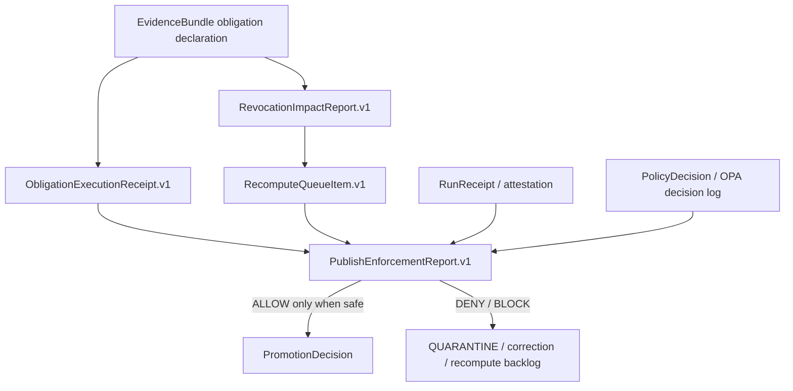
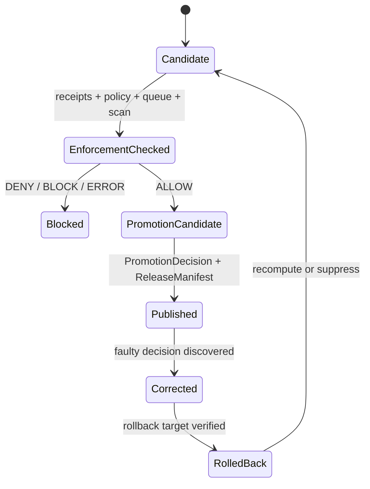

<!-- [KFM_META_BLOCK_V2]
doc_id: kfm://doc/governance/obligation-execution-v1
title: Obligation Execution + Recompute Queue + Publish Enforcement v1
type: standard
version: v1
status: draft
owners: TODO: governance owner not verified
created: NEEDS_VERIFICATION
updated: NEEDS_VERIFICATION
policy_label: public
related: [./README.md, ../../schemas/governance/obligation_execution_receipt.schema.json, ../../schemas/governance/recompute_queue_item.schema.json, ../../schemas/governance/revocation_impact_report.schema.json, ../../schemas/governance/publish_enforcement_report.schema.json, ../../tools/validators/governance/validate_obligation_execution.py, ../../policy/governance/obligation_execution.rego, ../../policy/governance/obligation_execution_test.rego, <NEEDS_VERIFICATION: ../../tests/governance/test_obligation_execution_validator.py>, <NEEDS_VERIFICATION: ../../tests/fixtures/governance/obligation_execution/valid/suppress_huc12.json>]
tags: [kfm, governance, obligation-execution, recompute-queue, publish-enforcement]
notes: [Owners and dates remain unresolved. Existing repo path confirmed as docs/control-plane/obligation-execution.md. Validator, schemas, and Rego policy paths were confirmed on main; pytest file and suppress_huc12 fixture path need verification before commands are treated as runnable.]
[/KFM_META_BLOCK_V2] -->

<a id="obligation-execution-v1"></a>

# Obligation Execution + Recompute Queue + Publish Enforcement v1

Governance layer for proving obligation execution, tracking recompute backlog, and blocking unsafe publication when obligations, receipts, consent, retention, queue state, public-field scans, or run attestations fail.

<p align="left">
  
  
  
  
  
</p>

> [!IMPORTANT]
> Publication is a governed state transition, not a file move. This layer must fail closed when an obligation is missing, an execution receipt cannot be verified, consent or retention posture conflicts with publication, recompute work remains unresolved, public artifacts expose forbidden fields, or the run receipt is unsigned/unverified.

## Quick jumps

- [Document control](#document-control)
- [Lifecycle placement](#lifecycle-placement)
- [Object separation](#object-separation)
- [Execution flow](#execution-flow)
- [Receipt chain](#receipt-chain)
- [Recompute queue behavior](#recompute-queue-behavior)
- [Publish-time fail-closed rules](#publish-time-fail-closed-rules)
- [Public-safety constraints](#public-safety-constraints)
- [Validation commands](#validation-commands)
- [CI gate expectations](#ci-gate-expectations)
- [Rollback and correction path](#rollback-and-correction-path)
- [Review checklist](#review-checklist)
- [Open verification items](#open-verification-items)

---

## Document control

| Field | Value |
|---|---|
| **Doc ID** | `kfm://doc/governance/obligation-execution-v1` |
| **Path** | `docs/control-plane/obligation-execution.md` |
| **Status** | `draft` |
| **Domain** | `governance` |
| **Layer** | `obligation_execution_v1` |
| **Rights** | `public` |
| **Sensitivity** | `public` |
| **Promotion state** | `not_promoted` |
| **Network posture** | `disabled` |
| **Owner** | `TODO: governance owner not verified` |
| **Created / updated** | `NEEDS_VERIFICATION` |
| **Truth posture** | **CONFIRMED** for the current checked-in doc path, validator path, schema paths, and Rego policy paths inspected on `main`; **NEEDS VERIFICATION** for missing fixture/test command paths and CI enforcement maturity. |

## Lifecycle placement

This layer sits between **EvidenceBundle obligation declaration** and **publish-time promotion**.

```text
EvidenceBundle obligation declaration
  -> ObligationExecutionReceipt.v1
  -> RecomputeQueueItem.v1 / RevocationImpactReport.v1
  -> PublishEnforcementReport.v1
  -> PromotionDecision / ReleaseManifest gate
  -> PUBLISHED only when enforcement passes or blocks safely
```

It protects the KFM lifecycle law:

```text
RAW -> WORK / QUARANTINE -> PROCESSED -> CATALOG / TRIPLET -> PUBLISHED
```

The layer does **not** decide source truth by itself. It records whether declared obligations were executed, whether recompute/suppression work remains open, and whether publication must be allowed, denied, or blocked.

> [!NOTE]
> Receipts are process evidence. Policy decisions, release manifests, proof packs, catalog closure, and correction records remain separate trust surfaces.

[Back to top](#obligation-execution--recompute-queue--publish-enforcement-v1)

## Object separation

| Object | Role | Must not become |
|---|---|---|
| `ObligationExecutionReceipt.v1` | Action execution proof for a declared obligation such as `SUPPRESS`, `GENERALIZE`, or `DELETE`. | A policy decision, source authority, or release manifest. |
| `RecomputeQueueItem.v1` | Deferred recompute, suppression, or re-evaluation backlog item. | A silent TODO list outside publication enforcement. |
| `RevocationImpactReport.v1` | Consent-delta impact summary that explains whether revocation creates no impact, suppression, recompute, or publish block. | A replacement for consent policy or steward review. |
| `PublishEnforcementReport.v1` | Final publish allow/deny/block result with receipt chain, public artifact scan, and queue summary. | A proof pack, release manifest, or catalog record. |

### Minimum relationship map



[Back to top](#obligation-execution--recompute-queue--publish-enforcement-v1)

## Execution flow

1. Resolve the obligation-bearing evidence context.
2. Execute required obligation actions.
3. Emit execution receipts with deterministic IDs and `spec_hash` values.
4. Open recompute queue items for consent revocation, obligation changes, retention expiry, or policy re-evaluation.
5. Scan public artifact fields before publication.
6. Evaluate publish enforcement with receipts, queue state, public-field scan, consent/retention posture, and run receipt verification.
7. Emit `PublishEnforcementReport.v1`.
8. Permit promotion only when enforcement does not deny or block.

```text
ANSWER only if evidence, receipts, policy, queue, public-field scan, and run attestation close.
ABSTAIN when evidence or scope cannot be resolved.
DENY when policy, consent, retention, forbidden fields, or missing receipts block publication.
ERROR when the enforcement layer itself cannot produce a valid report.
```

## Receipt chain

Publish decisions reference receipts and run attestations.

They should include enough information to answer:

| Question | Required evidence |
|---|---|
| Which obligation was executed? | `obligation_ref.obligation_id`, action, scope, channel |
| Was the action executed with a valid outcome? | `execution.outcome`, `execution.status` |
| Which run produced the receipt? | `receipt_refs.run_receipt_id` |
| Was generalization or deletion actually supported? | `redaction_receipt_id` or `deletion_receipt_id` when required |
| Was the publish decision made over the expected receipt chain? | `PublishEnforcementReport.v1.receipt_chain` |
| Was an independent policy decision available? | `policy_decision_ref` or `opa_decision_log_ref` |
| Was the run signed and verified? | `run_attestation_ref` plus run receipt `signed=true` and `verified=true` |

> [!WARNING]
> A receipt proves that a process ran and what it reported. It does not, by itself, prove that the publication is lawful, complete, current, reviewed, or public-safe.

[Back to top](#obligation-execution--recompute-queue--publish-enforcement-v1)

## Recompute queue behavior

Any consent revocation or policy-triggered recompute opens queue items.

Queue items should remain open until the affected artifacts, catalog records, layer manifests, and release candidates have been recomputed, suppressed, generalized, or blocked.

| Trigger | Queue reason | Publish effect |
|---|---|---|
| Consent revoked | `CONSENT_REVOKED` | `ALLOW` is denied until suppression/recompute closes. |
| Obligation definition changed | `OBLIGATION_CHANGED` | Candidate must be re-evaluated against the new obligation. |
| Retention window expired | `RETENTION_EXPIRED` | `ALLOW` is denied while expired material remains publish-bound. |
| Policy changed or was re-run | `POLICY_REEVALUATION` | Candidate must pass updated policy before release. |

Unresolved queue items force publish `DENY` or `BLOCK`.

```text
queue_summary.unresolved_count > 0
AND publish_decision == "ALLOW"
=> DENY/BLOCK
```

## Publish-time fail-closed rules

The enforcement layer must deny or block publication for these conditions.

| Condition | Required outcome |
|---|---|
| Missing obligations | `DENY` |
| Missing `ObligationExecutionReceipt.v1` for an obligation | `DENY` |
| Action/outcome mismatch | `DENY` |
| Missing generalization receipt for `GENERALIZE` | `DENY` |
| Missing deletion receipt for `DELETE` | `DENY` |
| Revoked consent with publish `ALLOW` | `DENY` |
| Retention expired with publish `ALLOW` | `DENY` |
| Unresolved recompute queue with publish `ALLOW` | `DENY` or `BLOCK` |
| Public artifact contains forbidden/raw/sensitive fields | `DENY` |
| Run receipt unsigned or unverified | `DENY` |
| Enforcement report cannot validate | `ERROR`, not publication |

### Finite decision surface

```text
ALLOW  = publish enforcement found no blocking condition.
DENY   = publication is not allowed because policy/evidence/receipt/safety failed.
BLOCK  = publication must stop until recompute, suppression, review, or correction completes.
ERROR  = enforcement could not produce a trustworthy decision; do not publish.
```

[Back to top](#obligation-execution--recompute-queue--publish-enforcement-v1)

## Public-safety constraints

Public artifacts must exclude forbidden, raw, sensitive, private, and high-risk fields.

| Forbidden or high-risk field class | Examples | Default posture |
|---|---|---|
| Exact sensitive geometry | `decimalLatitude`, `decimalLongitude`, `geometry` | Exclude, generalize, suppress, or restrict before public release. |
| Raw source payloads | `raw_payload`, source-native blobs | Never expose through normal public artifacts. |
| Private identifiers | `private_identifier`, personal/source-side IDs | Exclude unless explicitly public-safe and reviewed. |
| Secrets and tokens | `token`, API key material, credential fragments | Deny and treat as security incident if public-bound. |
| Genomics markers | `dna_sequence`, genomic or DNA-derived identifiers | Deny public release by default. |

```text
public_artifact_scan.status == "FAIL"
OR public_artifact_scan.forbidden_fields_present is non-empty
=> DENY
```

> [!CAUTION]
> Redaction/generalization must be receipt-backed. Do not remove a field silently and treat the result as safe without a transform receipt and reviewable reason.

## Validation commands

Run these from the repository root after confirming the files exist on the active branch.

```bash
python3 tools/validators/governance/validate_obligation_execution.py \
  --bundle tests/fixtures/governance/obligation_execution/valid/suppress_huc12.json
```

```bash
pytest -q tests/governance/test_obligation_execution_validator.py
```

```bash
opa test \
  policy/governance/obligation_execution.rego \
  policy/governance/obligation_execution_test.rego
```

### Current command status

| Command | Status | Notes |
|---|---|---|
| Python validator command | **PARTIALLY CONFIRMED / NEEDS VERIFICATION** | Validator path is confirmed. The referenced `suppress_huc12.json` fixture path was not confirmed in this inspection. |
| Pytest command | **NEEDS VERIFICATION** | The referenced pytest file was not confirmed in this inspection. |
| OPA command | **CONFIRMED path / NEEDS VERIFICATION runtime** | Rego policy and test paths are confirmed. OPA installation and CI availability still require local verification. |

## CI gate expectations

CI should run deterministic, offline checks for this layer.

| Gate | Expected behavior |
|---|---|
| Schema validation | Validate all four object families against their JSON Schemas. |
| Validator fixtures | Run valid and invalid obligation-execution fixture bundles. |
| Pytest | Exercise hash checks, action/outcome matching, forbidden-field denial, retention denial, consent revocation denial, queue unresolved denial, and run receipt verification. |
| OPA/Rego | Run publish enforcement policy tests when OPA is installed. |
| Artifact reporting | Emit machine-readable validation output where possible. |
| Fail-closed behavior | Missing schemas, missing fixtures, invalid reports, or tool failures should not produce a publish `ALLOW`. |

OPA checks may be best-effort only when OPA is unavailable, but skipped OPA must remain visible as `NEEDS_VERIFICATION`, not silently upgraded to pass.

> [!IMPORTANT]
> Do not claim CI enforcement until workflow YAML, job logs, required checks, and tool availability have been verified on the active branch.

[Back to top](#obligation-execution--recompute-queue--publish-enforcement-v1)

## Rollback and correction path

If enforcement logic regresses:

1. Stop promotion for affected candidates.
2. Revert the layer change or pin the previous validator/policy/schema version.
3. Re-run governance fixture tests and OPA policy tests.
4. Identify affected `PublishEnforcementReport.v1` decisions.
5. Issue correction artifacts that supersede incorrect publish decisions.
6. Recompute or suppress public artifacts that were exposed under the faulty decision.
7. Update release, catalog, proof, and Evidence Drawer references so public clients can inspect the correction lineage.



## Review checklist

Before treating this doc or layer as ready for review/promotion:

- [ ] Confirm owner/team and replace `TODO`.
- [ ] Confirm `created` and `updated` values.
- [ ] Confirm all related paths are present on the active branch.
- [ ] Confirm schema IDs, titles, and required fields match the validator.
- [ ] Add or verify valid and invalid fixture bundles.
- [ ] Add or verify pytest coverage for validator behavior.
- [ ] Run OPA tests where OPA is installed.
- [ ] Confirm CI workflow coverage before claiming enforcement.
- [ ] Confirm public artifact field scan coverage includes exact coordinates, raw payloads, private identifiers, tokens, and genomics markers.
- [ ] Confirm rollback and correction artifacts are reachable from any affected release.

## Open verification items

| Item | Status | Why it matters |
|---|---|---|
| Governance owner | **NEEDS VERIFICATION** | Review and release responsibility should not remain implicit. |
| Created/updated dates | **NEEDS VERIFICATION** | Metadata must be auditable before publication. |
| `tests/fixtures/governance/obligation_execution/valid/suppress_huc12.json` | **NEEDS VERIFICATION** | Referenced validator command depends on this fixture. |
| `tests/governance/test_obligation_execution_validator.py` | **NEEDS VERIFICATION** | Pytest command depends on this file. |
| CI workflow coverage | **NEEDS VERIFICATION** | A documented expectation is not the same as an enforced merge gate. |
| OPA availability | **NEEDS VERIFICATION** | Policy tests should not be reported as passing unless OPA runs. |
| Release/correction integration | **NEEDS VERIFICATION** | Enforcement decisions must connect to PromotionDecision, ReleaseManifest, CorrectionNotice, and rollback targets. |

[Back to top](#obligation-execution--recompute-queue--publish-enforcement-v1)
