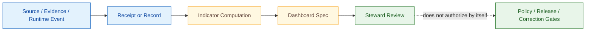

<!-- [KFM_META_BLOCK_V2]
doc_id: kfm://doc/<uuid-pending>
title: Indicator Catalog — Master Governance Health Indicators
type: standard
version: v0.2
status: draft
owners: <dashboards-stewards>  # PROPOSED placeholder; resolve before review
created: 2026-05-20
updated: 2026-06-12
policy_label: public
related:
  - docs/dashboards/README.md
  - docs/dashboards/DASHBOARD_CATALOG.md
  - docs/dashboards/governance/README.md
  - docs/atlases/Kansas_Frontier_Matrix_-_Domains_v1_1.md   # Ch. 24.11 authoritative source
  - docs/doctrine/directory-rules.md
  - docs/doctrine/truth-posture.md
  - docs/doctrine/trust-membrane.md
  - docs/doctrine/lifecycle-law.md
  - docs/registers/DRIFT_REGISTER.md
  - docs/registers/VERIFICATION_BACKLOG.md                  # VB-11-08
tags: [kfm, docs, dashboards, indicators, governance, health, evidence, release, sensitivity, ai, drift]
notes:
  - "v0.2 polish pass: preserves the 23 Atlas v1.1 Ch. 24.11 indicator mirror; adds stronger repo-fit, authority, validation, and drift language; improves GitHub readability; and makes implementation uncertainty explicit."
  - "This file is a human-readable MIRROR of Atlas v1.1 Ch. 24.11. The Atlas remains authoritative."
  - "If this mirror and the Atlas disagree, the Atlas wins; the discrepancy goes to docs/registers/DRIFT_REGISTER.md."
  - "Indicators are REPORTED, not enforced. Enforcement belongs to validators, policy gates, runtime checks, and release/review controls."
  - "Existing file presence at docs/dashboards/INDICATOR_CATALOG.md is CONFIRMED by GitHub fetch in the 2026-06-12 polishing session; running dashboard implementation remains NEEDS VERIFICATION."
[/KFM_META_BLOCK_V2] -->

# Indicator Catalog · `docs/dashboards/INDICATOR_CATALOG.md`

> Human-readable mirror of the **Master Governance Health Indicators** from Atlas v1.1 Ch. 24.11, with dashboard mappings, proposed owners, source receipts, and verification gaps.

**Status:** draft · **Version:** v0.2 · **Owners:** `<dashboards-stewards>` *(PROPOSED)* · **Last reviewed:** 2026-06-12

---

> [!IMPORTANT]
> **This catalog mirrors doctrine; it does not create doctrine.** Atlas v1.1 Ch. 24.11 is the authoritative source for the indicator set. This file exists so dashboard authors, stewards, and reviewers can see how each indicator is meant to be measured, surfaced, owned, and verified. If this file and the Atlas disagree, treat this file as stale, open a drift entry, and reconcile the mirror.

> [!CAUTION]
> **Indicators are reported, not enforced.** A healthy dashboard signal is not a substitute for `EvidenceBundle`, `PolicyDecision`, `ReviewRecord`, `ReleaseManifest`, `RollbackCard`, validator output, or release authority. Dashboards make governance health visible; they do not authorize publication.

---

## Quick jump

| Area | Links |
|---|---|
| Foundation | [1. Scope](#1-scope) · [2. Authority and repo fit](#2-authority-and-repo-fit) · [3. How to read this catalog](#3-how-to-read-this-catalog) |
| Indicators | [4. Evidence and source integrity](#4-category-24111--evidence-and-source-integrity) · [5. Release, correction, rollback](#5-category-24112--release-correction-rollback) · [6. Sensitivity and rights](#6-category-24113--sensitivity-and-rights) |
| More indicators | [7. AI surface health](#7-category-24114--ai-surface-health) · [8. Documentation and drift](#8-category-24115--documentation-and-drift) |
| Control | [9. Coverage matrix](#9-coverage-matrix) · [10. Validation and maintenance](#10-validation-and-maintenance) · [11. Open questions](#11-open-questions) · [12. Evidence boundary](#12-evidence-boundary) |

---

## 1. Scope

This catalog tracks the **23 governance health indicators** grouped into five Atlas v1.1 Ch. 24.11 categories:

1. Evidence and source integrity.
2. Release, correction, and rollback.
3. Sensitivity and rights.
4. AI surface health.
5. Documentation and drift.

For each indicator, this file records:

| Field | Meaning |
|---|---|
| **Indicator** | Human-readable signal name mirrored from the Atlas indicator set. |
| **Measures** | What the dashboard should count, compute, or trend. |
| **Healthy posture** | PROPOSED target posture. Where numeric thresholds appear, treat them as dashboard expectations pending validator/runtime confirmation. |
| **Owning steward** | PROPOSED accountability role. Must be reconciled against the reviewer-role / separation-of-duties matrix before review. |
| **Receipt / record sources** | Receipt, proof, manifest, decision, or source-record families expected to feed the dashboard. Presence and schema shape are NEEDS VERIFICATION unless current repo evidence confirms them. |
| **Dashboard spec** | Human-facing dashboard specification expected to surface the indicator. A spec path is PROPOSED unless confirmed by repo inspection. |

This file is intentionally narrow. It is a **dashboard authoring aid**, not a metric store, telemetry export, policy package, schema registry, release manifest, or proof object.

[↑ Back to top](#top)

---

## 2. Authority and repo fit

`docs/dashboards/INDICATOR_CATALOG.md` lives in the human-facing documentation control plane. It describes indicator meaning and dashboard intent, while implementation and enforcement remain in their responsibility roots.

| Concern | Canonical / expected home | This catalog's role |
|---|---|---|
| Indicator doctrine | Atlas v1.1 Ch. 24.11 | Mirrors the set for dashboard authors. |
| Placement and drift | `docs/doctrine/directory-rules.md`, `docs/registers/DRIFT_REGISTER.md` | Labels this file as a mirror and surfaces placement/authority uncertainty. |
| Machine-readable registers | `control_plane/` | May reference them, but does not replace them. |
| Contracts / object meaning | `contracts/` | Names receipt and decision families only. |
| Machine schema shape | `schemas/contracts/v1/...` | Links or points to schema homes after verification. |
| Policy decisions | `policy/` and emitted `PolicyDecision` records | Reports policy outcomes; does not encode policy. |
| Evidence and receipts | `data/receipts/`, `data/proofs/`, EvidenceBundle stores | Reports presence, resolution, and coverage; does not store evidence. |
| Release decisions | `release/` | Reports release / rollback / correction posture; does not authorize release. |
| Running dashboards | `apps/`, `packages/`, observability tooling, or steward console | Human spec only; runtime remains outside this file. |

> [!NOTE]
> The existing repository contains `docs/dashboards/INDICATOR_CATALOG.md` as a draft file, but dashboard runtime behavior, CI coverage, metric generation, and receipt/schema enforcement are **NEEDS VERIFICATION** unless proven by repo files, tests, workflows, dashboards, logs, or emitted artifacts.

[↑ Back to top](#top)

---

## 3. How to read this catalog

Use the indicator rows as a **governance-health map**, not as a release checklist. Each row answers four questions:

1. **What should a steward be able to see?**
2. **What evidence or receipt family should support the signal?**
3. **Which steward role should notice a bad trend?**
4. **Which dashboard spec should display it?**

A "green" value on one indicator does not prove the system is safe. KFM trust requires the object family chain to remain inspectable: `EvidenceBundle`, source role, rights/sensitivity posture, validation, policy, review, release state, correction path, and rollback target.

[↑ Back to top](#top)

---

## 4. Category 24.11.1 — Evidence and source integrity

Surfaced by [`governance/EVIDENCE_INTEGRITY.md`](governance/EVIDENCE_INTEGRITY.md) *(PROPOSED path; verify file presence)*.

| Indicator | Measures | Healthy posture (PROPOSED) | Owning steward (PROPOSED) | Receipt / record sources |
|---|---|---|---|---|
| EvidenceRef resolution rate | Percent of public-surface `EvidenceRef` values that resolve to an `EvidenceBundle` on demand. | `> 99.9%` across the trailing release window; any unresolved public claim is a defect. | Release steward | `ValidationReport`, EvidenceBundle index, public payload audit |
| Cite-or-abstain compliance | Percent of Focus Mode answers with non-empty, resolving evidence citations or a proper `ABSTAIN`. | `100%`; missing citation or unsupported answer is a defect to investigate. | AI surface steward | `AIReceipt`, citation validation report |
| Source-role distribution drift | Admitted source-role distribution over time by domain and source family. | No silent role shift without steward note, ADR, or source-registry update. | Source steward | Source descriptors, source-role registry, `ValidationReport` |
| Stale source rate | Percent of admitted sources past their declared freshness cadence. | Stale sources are refreshed, superseded, marked stale, or quarantined within tolerance. | Source steward | Source descriptors, freshness metadata, watcher receipts |
| Quarantine throughput | Percent of admitted records entering quarantine and clearance rate by reason code. | Visible cause distribution; sustained unresolved backlog is a governance defect. | Source steward | `ValidationReport`, quarantine ledger, remediation receipts |

[↑ Back to top](#top)

---

## 5. Category 24.11.2 — Release, correction, rollback

Surfaced by [`governance/RELEASE_CORRECTION_ROLLBACK.md`](governance/RELEASE_CORRECTION_ROLLBACK.md) *(PROPOSED path; verify file presence)*.

| Indicator | Measures | Healthy posture (PROPOSED) | Owning steward (PROPOSED) | Receipt / record sources |
|---|---|---|---|---|
| Release with rollback target | Percent of `PUBLISHED` releases that name a valid rollback target. | `100%`; no release is complete without rollback path. | Release steward | `ReleaseManifest`, `RollbackCard` |
| Correction lead time | Median time from defect detection to `CorrectionNotice`. | Tracked by release window; trend should not regress without explanation. | Correction reviewer | `CorrectionNotice`, defect report, review queue |
| Derivative-invalidation coverage | Percent of corrections that identify and invalidate downstream derivatives. | Approaches `100%` as lineage coverage matures. | Correction reviewer | `CorrectionNotice`, lineage graph, derivative registry |
| Rollback rehearsal rate | Count of rehearsed rollbacks per release window. | Non-zero and scheduled; skipped rehearsal requires steward note. | Release steward | `RollbackCard`, rehearsal receipt, run log |
| Supersession lineage gap | Count of superseded artifacts without a forward link to the replacement. | Zero. | Docs steward | `ReleaseManifest`, supersession entries, drift register |

[↑ Back to top](#top)

---

## 6. Category 24.11.3 — Sensitivity and rights

Surfaced by [`governance/SENSITIVITY_RIGHTS.md`](governance/SENSITIVITY_RIGHTS.md) *(PROPOSED path; verify file presence)*.

| Indicator | Measures | Healthy posture (PROPOSED) | Owning steward (PROPOSED) | Receipt / record sources |
|---|---|---|---|---|
| Sensitive-lane fail-closed rate | Percent of unauthorized sensitive-lane requests that `DENY` at the first policy gate. | `100%` at the first gate. | Sensitivity reviewer | `PolicyDecision`, access-denial logs |
| RedactionReceipt coverage | Percent of public-safe transformations in sensitive lanes with a `RedactionReceipt`. | `100%` for sensitive lanes and rights-limited public derivatives. | Sensitivity reviewer | `RedactionReceipt`, transform receipt, release manifest |
| Review-aged-out incidence | Count of sensitive-lane claims or artifacts past review cadence. | Visible and dispositioned; trend should not regress. | Sensitivity reviewer | `ReviewRecord`, sensitivity-tier register |
| Rights-change response time | Median time from rights-change detection to tier reassignment or release restriction. | Within source-family tolerance; unknown rights fail closed. | Rights-holder representative | Source descriptors, `ReviewRecord`, rights register |
| Sensitive-content side-channel audit | Frequency and findings from checks for label, popup, export, tile, screenshot, or AI-text leaks. | Periodic and documented; critical leaks trigger correction / rollback. | Sensitivity reviewer | Audit logs, `RepresentationReceipt`, AI audit sample |

[↑ Back to top](#top)

---

## 7. Category 24.11.4 — AI surface health

Surfaced by [`governance/AI_SURFACE_HEALTH.md`](governance/AI_SURFACE_HEALTH.md) *(PROPOSED path; verify file presence)*.

| Indicator | Measures | Healthy posture (PROPOSED) | Owning steward (PROPOSED) | Receipt / record sources |
|---|---|---|---|---|
| AIReceipt presence rate | Percent of Focus Mode / governed-AI answers with an `AIReceipt`. | `100%`; every consequential answer is receipt-bearing. | AI surface steward | `AIReceipt` |
| ABSTAIN rate by template | How often each Focus Mode template abstains due to insufficient evidence, policy, or sensitivity limits. | Visible by template; unusually low may signal over-answering, unusually high may signal evidence gaps. | AI surface steward | `AIReceipt`, template registry |
| DENY reason distribution | Distribution of policy reason codes returned by Focus Mode denials. | Stable and explainable; new spikes are investigated. | AI surface steward | `AIReceipt`, `PolicyDecision` |
| Synthetic-claim incidence | Percent of audited AI answers flagged for presenting synthetic, modeled, or inferred material as observed. | Approaches zero; never silently accepted. | AI surface steward | `AIReceipt`, audit sample, source-role registry |

[↑ Back to top](#top)

---

## 8. Category 24.11.5 — Documentation and drift

Surfaced by [`governance/DOCUMENTATION_DRIFT.md`](governance/DOCUMENTATION_DRIFT.md) *(PROPOSED path; verify file presence)*.

| Indicator | Measures | Healthy posture (PROPOSED) | Owning steward (PROPOSED) | Receipt / record sources |
|---|---|---|---|---|
| ADR completeness | Percent of structural moves requiring an ADR that have an accepted, retained ADR. | `100%` for Directory Rules §2.4 cases. | Docs steward | `docs/adr/`, drift register, PR notes |
| Drift register size | Count and age of open entries in `docs/registers/DRIFT_REGISTER.md`. | Visible; aged or repeated entries are investigated. | Docs steward | `DRIFT_REGISTER.md`, path-validation notes |
| Per-root README presence | Percent of canonical roots with a current README declaring purpose, authority, inputs, exclusions, validation, and review burden. | `100%`. | Docs steward | Repo tree scan, README-contract validator |
| Atlas / supplement lineage clarity | Whether each Atlas or supplement carries current supersession / lineage metadata. | `100%`; no silent supersession. | Docs steward | Atlas front matter, supersession entries, verification backlog |

[↑ Back to top](#top)

---

## 9. Coverage matrix

| Atlas section | Indicator count | Dashboard spec | Status |
|---|---:|---|---|
| §24.11.1 Evidence and source integrity | 5 | `governance/EVIDENCE_INTEGRITY.md` | PROPOSED |
| §24.11.2 Release, correction, rollback | 5 | `governance/RELEASE_CORRECTION_ROLLBACK.md` | PROPOSED |
| §24.11.3 Sensitivity and rights | 5 | `governance/SENSITIVITY_RIGHTS.md` | PROPOSED |
| §24.11.4 AI surface health | 4 | `governance/AI_SURFACE_HEALTH.md` | PROPOSED |
| §24.11.5 Documentation and drift | 4 | `governance/DOCUMENTATION_DRIFT.md` | PROPOSED |
| **Total** | **23** | **5 governance specs** | Mirror complete by count; implementation NEEDS VERIFICATION |

> [!IMPORTANT]
> "Complete by count" means this mirror preserves the 23-row structure from the draft indicator catalog and the Atlas-mirror framing. It does **not** prove the dashboard specs exist, the metrics are computed, the CI check is wired, or that running dashboards enforce anything.

[↑ Back to top](#top)

---

## 10. Validation and maintenance

Validation should catch mirror drift, missing ownership, broken references, and implementation overclaiming.

| Check | Expected behavior | Status |
|---|---|---|
| Indicator-count check | Confirms this file has exactly 23 indicator rows across five categories. | PROPOSED |
| Atlas mirror freshness | Diffs this mirror against Atlas v1.1 Ch. 24.11 source text or a generated machine register. | PROPOSED |
| Dashboard-spec link check | Verifies each referenced `governance/*.md` spec exists. | NEEDS VERIFICATION |
| Owner-placeholder scan | Flags `<dashboards-stewards>` and other unresolved owner placeholders before review. | PROPOSED |
| Receipt-source reconciliation | Confirms receipt / record names against the canonical receipt catalog and schemas. | NEEDS VERIFICATION |
| Drift-register hook | Opens or updates drift entry when this mirror and Atlas disagree. | PROPOSED |
| No-enforcement wording scan | Ensures this catalog does not claim dashboard enforcement or release authority. | PROPOSED |

### Definition of done for v1.0

- [ ] Atlas v1.1 Ch. 24.11 indicator text reconciled line-by-line.
- [ ] Every dashboard spec path verified or marked `PATH_TBD_AFTER_REPO_INSPECTION`.
- [ ] Owners replaced with concrete steward roles.
- [ ] Receipt / record sources checked against contracts and schemas.
- [ ] `VB-11-08` linked to a verification backlog row.
- [ ] Drift-register process documented for mirror divergence.
- [ ] Link checker and indicator-count check wired in CI or recorded as manual review.

[↑ Back to top](#top)

---

## 11. Open questions

| ID | Question | Status | Resolution path |
|---|---|---|---|
| `IND-OQ-01` | Which concrete role replaces each PROPOSED owning-steward value? | NEEDS VERIFICATION | Reconcile against Atlas v1.1 §24.7 and dashboard README ownership model. |
| `IND-OQ-02` | Are all receipt / record source names canonical, and do schemas exist for each? | NEEDS VERIFICATION | Check receipt catalog, `schemas/contracts/v1/...`, and emitted artifacts. |
| `IND-OQ-03` | What mechanism keeps this mirror fresh against Atlas v1.1 Ch. 24.11? | PROPOSED | Add mirror-freshness CI or generated register comparison. |
| `IND-OQ-04` | How should `VB-11-08` be closed for indicators that are owned but not instrumented? | OPEN | Split into ownership closure and instrumentation closure if needed. |
| `IND-OQ-05` | Should "healthy posture" thresholds become policy, dashboard-only expectations, or steward notes? | OPEN | Do not promote thresholds to policy without ADR / policy package. |
| `IND-OQ-06` | Should the indicator catalog have a machine-readable companion in `control_plane/`? | PROPOSED | Consider `control_plane/governance_health_indicators.yaml` with generated docs mirror. |

[↑ Back to top](#top)

---

## 12. Evidence boundary

| Source | Status | Supports | Limits |
|---|---|---|---|
| Existing `docs/dashboards/INDICATOR_CATALOG.md` | CONFIRMED current repo file in the polishing session | Baseline content, 23 indicators, five categories, mirror posture, open questions. | Does not prove metrics, dashboards, CI, runtime, or receipt schemas are implemented. |
| `docs/dashboards/README.md` | CONFIRMED current repo file in the polishing session | Folder purpose: dashboard specs and indicator catalogs, not running dashboards; placement still proposed / needs verification. | Does not prove dashboard runtime implementation or telemetry stack. |
| `docs/doctrine/directory-rules.md` | CONFIRMED doctrine file in the polishing session | Responsibility-root split; docs explain to humans; contracts/schemas/policy/data/release remain separate; drift process for conflicts. | Does not prove every referenced path exists or is implemented. |
| Atlas v1.1 Ch. 24.11 | CONFIRMED doctrine by cited project material; exact line reconciliation NEEDS VERIFICATION in this polishing pass | Authoritative source of the Master Governance Health Indicators. | This mirror does not replace it; divergence is drift. |
| Pasted Markdown request source | CONFIRMED user-provided baseline | The exact v0.1 text to preserve and polish. | Does not independently prove implementation. |

[↑ Back to top](#top)

---

## Related docs

- [`README.md`](README.md) — dashboards lane orientation.
- [`DASHBOARD_CATALOG.md`](DASHBOARD_CATALOG.md) — dashboard-spec index.
- [`governance/README.md`](governance/README.md) — governance dashboard-spec family *(PROPOSED / verify path)*.
- [`../atlases/`](../atlases/) — Atlas location; Ch. 24.11 remains authoritative.
- [`../doctrine/directory-rules.md`](../doctrine/directory-rules.md) — placement and authority doctrine.
- [`../registers/DRIFT_REGISTER.md`](../registers/DRIFT_REGISTER.md) — divergence and placement drift.
- [`../registers/VERIFICATION_BACKLOG.md`](../registers/VERIFICATION_BACKLOG.md) — `VB-11-08` and indicator ownership / instrumentation closure.

---

**Last updated:** 2026-06-12 · **Edition:** v0.2 draft · **Owner:** `<dashboards-stewards>` PROPOSED · **Authority:** mirror, not doctrine · **Back to top:** [↑](#top)
