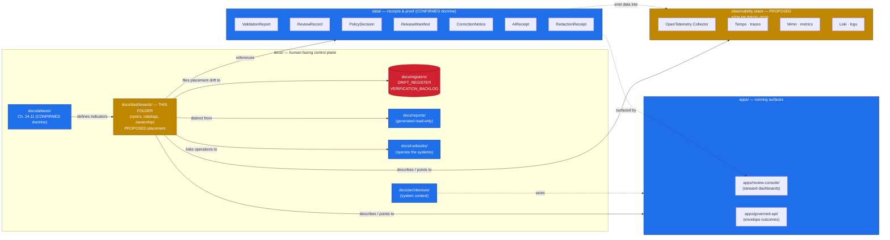

<!-- [KFM_META_BLOCK_V2]
doc_id: kfm://doc/<uuid-pending>
title: Dashboards — Human-facing dashboard specifications and indicator catalogs
type: standard
version: v0.1
status: draft
owners: <dashboards-stewards>  # PROPOSED placeholder; resolve before review (see §FAQ)
created: 2026-05-20
updated: 2026-05-20
policy_label: public
related:
  - docs/doctrine/directory-rules.md            # §6.1 (placement authority)
  - docs/atlases/Kansas_Frontier_Matrix_-_Domains_v1_1.md   # Ch. 24.11 (Master Governance Health Indicators)
  - docs/registers/DRIFT_REGISTER.md            # placement drift entry will live here
  - docs/registers/VERIFICATION_BACKLOG.md      # VB-11-08 (governance health instrumentation)
  - docs/reports/README.md                      # neighbor: generated review/release reports (read-only)
  - docs/architecture/README.md                 # apps/review-console, apps/governed-api wiring
tags: [kfm, docs, dashboards, observability, indicators, governance]
notes:
  - "Placement under docs/dashboards/ is PROPOSED — not in Directory Rules §6.1 canonical tree."
  - "Subfolder of docs/ is illustrative-not-exhaustive per §6.1 v1.1 note, but a drift entry SHOULD be opened."
  - "Mounted repo state UNKNOWN; all path/owner/badge target claims are PROPOSED unless verified."
[/KFM_META_BLOCK_V2] -->

# Dashboards · `docs/dashboards/`

> Human-facing specifications, ownership records, and indicator catalogs for KFM's
> governance and operational dashboards — not the running dashboards themselves.

<!-- Badge row: minimum 3, placeholders allowed -->


**Status:** draft · **Owners:** `<dashboards-stewards>` (PROPOSED placeholder) · **Last reviewed:** 2026-05-20

---

> [!IMPORTANT]
> **Placement drift notice (PROPOSED).** `docs/dashboards/` is **not currently listed**
> in the Directory Rules §6.1 canonical `docs/` tree. The §6.1 list is **illustrative,
> not exhaustive** (v1.1 note), so this folder is not *forbidden* — but a drift entry in
> [`docs/registers/DRIFT_REGISTER.md`](../registers/DRIFT_REGISTER.md) SHOULD be opened,
> and an ADR (per Directory Rules §17, "new compatibility root, new anti-pattern, new
> placement example") may be required if this folder hardens into a stable home. Until
> resolved, every path under `docs/dashboards/` is **PROPOSED** and **NEEDS VERIFICATION**
> against mounted repo state. See [Open questions](#11-task-list--open-questions).

---

## Quick jump

- [1. Scope](#1-scope)
- [2. Repo fit](#2-repo-fit)
- [3. Inputs](#3-inputs)
- [4. Exclusions](#4-exclusions-what-does-not-belong-here)
- [5. README contract (§15)](#5-readme-contract-directory-rules-15)
- [6. Directory tree (PROPOSED)](#6-directory-tree-proposed)
- [7. Architecture diagram](#7-architecture-diagram)
- [8. Dashboard catalog](#8-dashboard-catalog)
- [9. Indicator catalog (Atlas v1.1 Ch. 24.11)](#9-indicator-catalog-atlas-v11-ch-2411)
- [10. Quickstart — authoring a dashboard spec](#10-quickstart--authoring-a-dashboard-spec)
- [11. Task list & open questions](#11-task-list--open-questions)
- [12. FAQ](#12-faq)
- [13. Related docs](#13-related-docs)
- [14. Appendix](#14-appendix)

---

## 1. Scope

`docs/dashboards/` is a **documentation surface** that records:

1. **Dashboard specifications** — what each KFM dashboard is *for*, what it shows, what
   evidence and receipts it reads, what posture is "healthy," and who owns it.
2. **Indicator catalogs** — a human-readable mirror of the **Master Governance Health
   Indicators** (Atlas v1.1 Ch. 24.11; CONFIRMED doctrine), with each indicator's
   measurement, healthy posture, owning steward, and receipt sources.
3. **Ownership and review burden** — which steward role owns each dashboard, who reviews
   changes to the spec, and where the running implementation lives.
4. **Links to running implementations** — pointers (not embeds) to where each dashboard
   actually runs (e.g., `apps/review-console/`, an OpenTelemetry-backed surface, an
   external Grafana, a steward console).

It is **not** a place to store the running dashboards, telemetry data, generated metric
snapshots, evidence bundles, or release decisions. (PROPOSED scope; see §4.)

[↑ back to top](#dashboards--docsdashboards)

---

## 2. Repo fit

| Direction | Folder / object | Relationship | Status |
|---|---|---|---|
| **Doctrine** | `docs/doctrine/directory-rules.md` | Governs placement of this folder. `docs/dashboards/` is not yet listed in §6.1; §6.1's "illustrative, not exhaustive" note is the only basis. | CONFIRMED rule, PROPOSED placement |
| **Indicator source** | Atlas v1.1 Ch. 24.11 — Master Governance Health Indicators | Five-category indicator set; this folder mirrors it human-readably and adds dashboard mappings. | CONFIRMED doctrine |
| **Atlas idea cards** | `KFM-P11-FEAT-0002`, `KFM-P30-FEAT-0001`, `KFM-P31-FEAT-0015/16/17`, `KFM-P8-PROG-0026` | PROPOSED dashboards / observability stack that this folder documents. | PROPOSED |
| **Running surfaces** | `apps/review-console/`, `apps/governed-api/`, OpenTelemetry stack (Tempo + Mimir + Loki) | Where dashboards documented here actually execute. This folder describes; those folders run. | CONFIRMED doctrine (apps/review-console), PROPOSED (stack) |
| **Registers** | `docs/registers/DRIFT_REGISTER.md`, `docs/registers/VERIFICATION_BACKLOG.md` | Track open dashboards questions, placement drift, and `VB-11-08` (governance health instrumentation). | CONFIRMED canonical homes; entries PROPOSED |
| **Neighbor** | `docs/reports/` | Holds **generated** review/release **reports** (read-only). Distinct from `docs/dashboards/` (live-indicator specs). Some overlap; an ADR may merge or split. | CONFIRMED canonical (reports); overlap PROPOSED |
| **Neighbor** | `docs/runbooks/` | Operates the systems whose health these dashboards visualize. | CONFIRMED canonical |
| **Neighbor** | `control_plane/` | Machine-readable governance registers; some indicators may have a machine-readable mirror there. | CONFIRMED canonical |

[↑ back to top](#dashboards--docsdashboards)

---

## 3. Inputs

What materials become content under `docs/dashboards/`:

- **Master Governance Health Indicators** (Atlas v1.1 Ch. 24.11, CONFIRMED doctrine):
  Evidence/source integrity · Release/correction/rollback · Sensitivity/rights · AI
  surface health · Documentation/drift.
- **Receipts and decision records** that dashboards consume (CONFIRMED doctrine; mounted
  presence NEEDS VERIFICATION): `ValidationReport`, `ReviewRecord`, `PolicyDecision`,
  `ReleaseManifest`, `CorrectionNotice`, `RollbackCard`, `AIReceipt`, `RedactionReceipt`,
  `RepresentationReceipt`.
- **Source descriptors** and freshness cadence metadata (from `connectors/`, `data/registry/`).
- **CI / pipeline observability** — OpenTelemetry Collector → Tempo (traces) + Mimir
  (metrics) + Loki (logs) per `KFM-P8-PROG-0026` (PROPOSED implementation).
- **Negative-state vocabulary** (`MISSING_EVIDENCE`, `SOURCE_STALE`, `DENIED_BY_POLICY`,
  `RELEASE_WITHDRAWN`, etc.) — surfaced by dashboards rather than hidden.

[↑ back to top](#dashboards--docsdashboards)

---

## 4. Exclusions — what does **not** belong here

> [!WARNING]
> Anti-patterns to avoid. Placement collapse here would create parallel authority for
> trust-bearing surfaces — exactly what Directory Rules §13 forbids.

| Do **not** place here | Where it belongs instead | Rule basis |
|---|---|---|
| Running dashboard code, queries, panels, JSON exports | `apps/review-console/`, `apps/governed-api/`, `packages/ui/`, or external observability tooling | Directory Rules §7.1 |
| Telemetry data, metric series, log archives, traces | OpenTelemetry stack (Tempo/Mimir/Loki) per `KFM-P8-PROG-0026`; not in `docs/` | Atlas KFM-P8-PROG-0026 |
| Generated review/release reports (read-only) | `docs/reports/` | Directory Rules §6.1 |
| Machine-readable registers, deprecation maps, status ledgers | `control_plane/` | Directory Rules §6.2 |
| Receipts, proofs, evidence bundles, release manifests | `data/receipts/`, `data/proofs/`, `release/` | Directory Rules §13.2 |
| Schemas for dashboard payloads / telemetry envelopes | `schemas/contracts/v1/...` (per ADR-0001) | Directory Rules §6.4 |
| Policy logic for dashboard access control | `policy/` | Directory Rules §6.5 |
| Sensitive operational secrets, credentials, tokens | Not in repo; see `configs/` (templates only) and `infra/` | Directory Rules §10.3 |
| Domain folders at this level (e.g., `docs/dashboards/hydrology/`) without a per-domain README and explicit owner | Either a flat catalog file or a properly-contracted subfolder (see §6) | Directory Rules §12 |

[↑ back to top](#dashboards--docsdashboards)

---

## 5. README contract (Directory Rules §15)

CONFIRMED contract; PROPOSED values until verified in mounted repo.

| Field | Value |
|---|---|
| **Purpose** | PROPOSED — Human-facing dashboard specifications and governance-health-indicator catalogs that describe what KFM dashboards exist, what they measure, who owns them, and where they run. |
| **Authority level** | PROPOSED — `docs/` subfolder; **not yet listed** in Directory Rules §6.1 canonical tree. Class: **documentation root for dashboard specifications** (PROPOSED). |
| **Status** | PROPOSED — Folder placement and contents are PROPOSED; mounted-repo presence NEEDS VERIFICATION. |
| **What belongs here** | Dashboard specifications (one Markdown per dashboard or family); indicator catalogs mirroring Atlas v1.1 Ch. 24.11; ownership records; pointers to running implementations; this README; cross-links to relevant registers, runbooks, ADRs. |
| **What does NOT belong here** | See §4 — running dashboards, telemetry data, generated reports, machine registers, receipts/proofs/release decisions, schemas, policy logic, secrets. |
| **Inputs** | Atlas v1.1 Ch. 24.11; receipts (`ValidationReport`, `ReviewRecord`, `ReleaseManifest`, `AIReceipt`, etc.); source descriptors; observability stack outputs (PROPOSED — `KFM-P8-PROG-0026`); negative-state vocabulary (Unified Doctrine §19). |
| **Outputs** | Reviewable dashboard specs; an indicator catalog stewards and authors can cite; review-burden / ownership table; pointers consumed by `docs/runbooks/` and `apps/review-console/` authors. |
| **Validation** | Link check; README-contract check (Directory Rules §15); spec-per-dashboard presence check; indicator-coverage check vs. Atlas v1.1 Ch. 24.11; placeholder-owner scan (no anonymous specs at v1). |
| **Review burden** | `<dashboards-stewards>` (PROPOSED placeholder) + docs steward + the subsystem steward whose domain the dashboard measures (e.g., AI surface steward for Focus Mode dashboards; release steward for release-health dashboards; sensitivity reviewer for sensitive-lane dashboards). |
| **Related folders** | `docs/registers/`, `docs/reports/`, `docs/runbooks/`, `docs/architecture/`, `apps/review-console/`, `apps/governed-api/`, `control_plane/`. |
| **ADRs** | PROPOSED — open one ADR (e.g., `ADR-####-dashboards-folder.md`) to either canonicalize `docs/dashboards/` in Directory Rules §6.1 or merge its scope into `docs/reports/` / `control_plane/`. Cross-reference Atlas v1.1 Ch. 24.12 `ADR-S-08`. |
| **Last reviewed** | 2026-05-20 (PROPOSED — this draft). |

[↑ back to top](#dashboards--docsdashboards)

---

## 6. Directory tree (PROPOSED)

> [!NOTE]
> This tree is **PROPOSED**, not observed. Each `.md` file is a planned dashboard spec
> derived from a corresponding Atlas idea card. Files MUST NOT be created until placement
> is confirmed by ADR or §6.1 update — but the planned layout is documented here so
> stewards and reviewers can comment before files land.

```text
docs/dashboards/
├── README.md                                # this file (PROPOSED authored)
├── INDICATOR_CATALOG.md                     # PROPOSED — mirror of Atlas v1.1 Ch. 24.11
├── DASHBOARD_CATALOG.md                     # PROPOSED — index of all dashboard specs
│
├── governance/                              # PROPOSED — governance-health dashboards
│   ├── EVIDENCE_INTEGRITY.md                # Atlas v1.1 §24.11.1
│   ├── RELEASE_CORRECTION_ROLLBACK.md       # Atlas v1.1 §24.11.2
│   ├── SENSITIVITY_RIGHTS.md                # Atlas v1.1 §24.11.3
│   ├── AI_SURFACE_HEALTH.md                 # Atlas v1.1 §24.11.4
│   └── DOCUMENTATION_DRIFT.md               # Atlas v1.1 §24.11.5
│
├── operational/                             # PROPOSED — feed / artifact / QC dashboards
│   ├── SLO_LIVE_FEEDS.md                    # KFM-P11-FEAT-0002 (Standards-first SLO dashboard)
│   ├── REALTIME_FEED_FRESHNESS.md           # KFM-P31-FEAT-0015 (Realtime Feed Freshness Monitor)
│   ├── COG_ZARR_REPRODUCIBILITY.md          # KFM-P31-FEAT-0016 (COG/Zarr Reproducibility)
│   └── GEOSPATIAL_QC_PANEL.md               # KFM-P31-FEAT-0017 (Quick Geospatial QC Panel)
│
├── domain/                                  # PROPOSED — domain-specific dashboards
│   └── air/
│       └── PM_SENSOR_CALIBRATION_REVIEW.md  # KFM-P30-FEAT-0001 (PM Sensor Calibration Review)
│
└── observability/                           # PROPOSED — CI / pipeline observability
    └── OPENTELEMETRY_STACK.md               # KFM-P8-PROG-0026 (OTEL + Tempo + Mimir + Loki)
```

**Naming convention (PROPOSED).** Follow `docs/standards/` precedent
(Directory Rules §6.1.a): `UPPERCASE_WITH_UNDERSCORES.md` for spec files, lowercase
hyphen/underscore-free subfolder names. An ADR may freeze this; until then, treat as
PROPOSED.

**Subfolder pattern (PROPOSED, OPEN).** Two patterns are in play across the wider
`docs/` tree (Directory Rules §6.1.b OPEN-DR-02): domain-segment subfolders vs. flat
with prefix. This tree uses **category-segment subfolders** (`governance/`,
`operational/`, `domain/`, `observability/`) because dashboard cardinality is likely to
remain modest per category. Consistency across `docs/dashboards/`, `docs/runbooks/`,
and `docs/standards/` is an open question worth pinning in one ADR.

[↑ back to top](#dashboards--docsdashboards)

---

## 7. Architecture diagram

CONFIRMED relationships use solid arrows; PROPOSED relationships use dashed arrows.
Diagram shows **what dashboards read, what they document, and where they run** — not the
running implementations themselves.



[↑ back to top](#dashboards--docsdashboards)

---

## 8. Dashboard catalog

PROPOSED catalog of dashboard specs to live under `docs/dashboards/`. Each row PROPOSES a
spec file; **no file exists yet**. The "Source card" column links each spec to its
originating Atlas idea card (CONFIRMED present in corpus; CONFIRMED PROPOSED status per
the card's own truth label).

| Spec file (PROPOSED) | Category | What the dashboard documents | Source card | Spec status |
|---|---|---|---|---|
| `governance/EVIDENCE_INTEGRITY.md` | Governance | EvidenceRef resolution rate; cite-or-abstain compliance; source-role distribution drift; stale source rate; quarantine throughput. | Atlas v1.1 §24.11.1 | PROPOSED — not yet authored |
| `governance/RELEASE_CORRECTION_ROLLBACK.md` | Governance | % releases with rollback target; correction lead time; derivative-invalidation coverage; rollback rehearsal rate; supersession lineage gap. | Atlas v1.1 §24.11.2 | PROPOSED — not yet authored |
| `governance/SENSITIVITY_RIGHTS.md` | Governance | Sensitive-lane fail-closed rate; RedactionReceipt coverage; review-aged-out incidence; rights-change response time; side-channel audit cadence. | Atlas v1.1 §24.11.3 | PROPOSED — not yet authored |
| `governance/AI_SURFACE_HEALTH.md` | Governance | AIReceipt presence rate; ABSTAIN rate by template; DENY reason distribution; synthetic-claim incidence. | Atlas v1.1 §24.11.4 | PROPOSED — not yet authored |
| `governance/DOCUMENTATION_DRIFT.md` | Governance | ADR completeness; drift register size; per-root README presence; atlas/supplement lineage clarity. | Atlas v1.1 §24.11.5 | PROPOSED — not yet authored |
| `operational/SLO_LIVE_FEEDS.md` | Operational | Standards-first SLOs for live transit and other high-cadence feeds: freshness, schema validation, latency, deduplication, non-material suppression, agency license terms. | `KFM-P11-FEAT-0002` (EXPANDED, active) | PROPOSED — not yet authored |
| `operational/REALTIME_FEED_FRESHNESS.md` | Operational | Realtime feed dashboards: schema validation, SLO freshness, canonical identity, partition output, promotion/hold state. | `KFM-P31-FEAT-0015` (UNCHANGED, active) | PROPOSED — not yet authored |
| `operational/COG_ZARR_REPRODUCIBILITY.md` | Operational | Raster/datacube artifacts: build container, GDAL/numcodecs versions, chained hashes, overview/block layout, reproducibility verdict. | `KFM-P31-FEAT-0016` (UNCHANGED, active) | PROPOSED — not yet authored |
| `operational/GEOSPATIAL_QC_PANEL.md` | Operational | Quick geospatial QC panel — fast inspectable surface for geometry/CRS/topology checks. | `KFM-P31-FEAT-0017` (UNCHANGED, active) | PROPOSED — not yet authored |
| `domain/air/PM_SENSOR_CALIBRATION_REVIEW.md` | Domain · Air | PM-sensor trust scores, meteorology features, co-location windows, low-concentration safeguards. | `KFM-P30-FEAT-0001` (UNCHANGED, active) | PROPOSED — not yet authored |
| `observability/OPENTELEMETRY_STACK.md` | Observability | CI/pipeline observability via OpenTelemetry Collector → Tempo (traces) + Mimir (metrics) + Loki (logs), one agent shape across runners. | `KFM-P8-PROG-0026` (UNCHANGED, active) | PROPOSED — not yet authored |

> [!NOTE]
> All source cards above carry their own `UNKNOWN: Repository implementation status
> remains unverified` self-check. The dashboards documented here are PROPOSED designs,
> not claims of running surfaces.

[↑ back to top](#dashboards--docsdashboards)

---

## 9. Indicator catalog (Atlas v1.1 Ch. 24.11)

CONFIRMED doctrine (PROPOSED healthy postures, per Atlas v1.1). Each indicator is
**reported, not enforced** — enforcement is the validator's job (Atlas v1.1 §24.11
preamble). Owning steward is **PROPOSED** until reconciled with `docs/governance/`.

<details>
<summary><strong>9.1 — Evidence and source integrity</strong> (5 indicators)</summary>

| Indicator | Measures | Healthy posture (PROPOSED) | Owning steward (PROPOSED) |
|---|---|---|---|
| EvidenceRef resolution rate | % of public-surface EvidenceRefs that resolve to an EvidenceBundle on demand. | > 99.9% over trailing release window. | Release steward |
| Cite-or-abstain compliance | % of Focus Mode answers with non-empty, resolving evidence citations. | 100% (any miss is a defect). | AI surface steward |
| Source-role distribution drift | Distribution of admitted source roles over time per domain. | No silent shift without documented ADR or steward note. | Source steward |
| Stale source rate | % of admitted sources past their freshness cadence. | Stewards dispositioned (refresh / supersede / mark stale) within tolerance. | Source steward |
| Quarantine throughput | % of admitted records that quarantine + clearance rate. | Visible, with cause distribution; sustained backlog is a defect. | Source steward |

</details>

<details>
<summary><strong>9.2 — Release, correction, rollback</strong> (5 indicators)</summary>

| Indicator | Measures | Healthy posture (PROPOSED) | Owning steward (PROPOSED) |
|---|---|---|---|
| Release with rollback target | % of PUBLISHED releases naming a valid rollback target. | 100%. | Release steward |
| Correction lead time | Median time from defect detection to CorrectionNotice. | Visibly tracked; trend not regressing. | Correction reviewer |
| Derivative-invalidation coverage | % of corrections naming and invalidating downstream derivatives. | Approaches 100% as coverage matures. | Correction reviewer |
| Rollback rehearsal rate | Rehearsed rollbacks per release window. | Non-zero; periodic, scheduled. | Release steward |
| Supersession lineage gap | Supersessions without a forward link. | Zero. | Docs steward |

</details>

<details>
<summary><strong>9.3 — Sensitivity and rights</strong> (5 indicators)</summary>

| Indicator | Measures | Healthy posture (PROPOSED) | Owning steward (PROPOSED) |
|---|---|---|---|
| Sensitive-lane fail-closed rate | % of unauthorized sensitive-lane requests that DENY at the first gate. | 100% at first gate. | Sensitivity reviewer |
| RedactionReceipt coverage | % of public-safe transformations emitting a RedactionReceipt. | 100% for sensitive lanes. | Sensitivity reviewer |
| Review-aged-out incidence | Sensitive-lane claims past their review cadence. | Visibly tracked; trend not regressing. | Sensitivity reviewer |
| Rights-change response time | Median time from rights-change detection to tier reassignment. | Within stated tolerance per source family. | Rights-holder representative |
| Sensitive-content side-channel audit | Frequency of automated checks for label / popup / AI-text leaks. | Periodic; documented. | Sensitivity reviewer |

</details>

<details>
<summary><strong>9.4 — AI surface health</strong> (4 indicators)</summary>

| Indicator | Measures | Healthy posture (PROPOSED) | Owning steward (PROPOSED) |
|---|---|---|---|
| AIReceipt presence rate | % of Focus Mode answers with an AIReceipt. | 100%. | AI surface steward |
| ABSTAIN rate by template | How often each Focus Mode template abstains. | Visibly tracked; very low suggests over-fitting; very high suggests evidence gaps. | AI surface steward |
| DENY reason distribution | Reason codes returned by Focus Mode denials. | Stable; large new-reason spikes investigated. | AI surface steward |
| Synthetic-claim incidence | % of audited AI answers flagged for presenting synthetic content as observed. | Approaches zero; never silently. | AI surface steward |

</details>

<details>
<summary><strong>9.5 — Documentation and drift</strong> (4 indicators)</summary>

| Indicator | Measures | Healthy posture (PROPOSED) | Owning steward (PROPOSED) |
|---|---|---|---|
| ADR completeness | % of structural moves with an accepted ADR. | 100% for Directory Rules §2.4 cases. | Docs steward |
| Drift register size | Open entries in `docs/registers/DRIFT_REGISTER.md`. | Visibly tracked; aged entries investigated. | Docs steward |
| Per-root README presence | % of canonical roots with a current README declaring authority class. | 100%. | Docs steward |
| Atlas / supplement lineage clarity | Each Atlas/supplement carries a current supersession entry. | 100%. | Docs steward |

</details>

> [!TIP]
> **Non-collapse rule** (Atlas v1.1 CONFIRMED): nothing in this folder lets summaries,
> tables, registers, or dashboards substitute for evidence, policy, review state, source
> authority, or release state. Dashboards **report**; the validator **enforces**; the
> EvidenceBundle **proves**.

[↑ back to top](#dashboards--docsdashboards)

---

## 10. Quickstart — authoring a dashboard spec

PROPOSED workflow. A dashboard spec is a Markdown file that **describes** a dashboard;
it does not implement it.

1. **Confirm placement.** Re-read Directory Rules §6.1 and this README's drift notice.
   If `docs/dashboards/` is still PROPOSED, open or update a `DRIFT_REGISTER.md` entry
   first; do not silently establish the folder.
2. **Pick the category.** `governance/`, `operational/`, `domain/<domain>/`, or
   `observability/`. If none fits cleanly, raise the question in §11.
3. **Cite the source card.** Identify the Atlas idea card (e.g., `KFM-P11-FEAT-0002`)
   or Atlas v1.1 §24.11 row this dashboard reflects. If neither exists, the dashboard
   is premature — file it as an idea first.
4. **Apply the doc template** (Atlas `KFM-P7-PROG-0008` — CONFIRMED):
   - **META block** — KFM Meta Block v2 at the top.
   - **BADGES block** — deterministic badges only (status, authority, last reviewed).
   - **DESCRIPTION block** — what the dashboard documents and why it exists.
   - **FILES block** — `path`, `role`, `spec_hash` (PROPOSED; pending JCS+SHA-256
     computation), and pointers to running surfaces.
   - **ACCEPTANCE block** — what tests/fixtures/gates determine "correct enough to
     publish" (e.g., link-check, indicator-coverage check, owner assigned).
5. **Apply badge family** (Atlas `KFM-P3-FEAT-0005` — CONFIRMED): truth · gate ·
   freshness · source-role badges. **Do not edit truth badges by hand**; they URL-encode
   `≠` and are generated from structured outcomes.
6. **Name the owner.** No anonymous dashboard specs at v1. Use a placeholder role
   (e.g., `<release-steward>`) and resolve before review.
7. **Mark every claim.** CONFIRMED · INFERRED · PROPOSED · UNKNOWN · NEEDS VERIFICATION ·
   EXTERNAL. Mounted-repo claims default to NEEDS VERIFICATION in this docs-only
   environment.
8. **Cross-reference.** Link to:
   - The Atlas indicator (§24.11.x) or atlas idea card.
   - The receipt types the dashboard reads.
   - The running implementation surface (`apps/review-console/...`,
     `apps/governed-api/...`, OpenTelemetry stack).
   - Any related runbook in `docs/runbooks/`.
9. **Open the PR.** Cite Directory Rules §15 (README contract) and §6.1 (placement),
   note the drift-register entry, and request `docs steward` + the relevant domain
   steward as reviewers.

> [!CAUTION]
> A dashboard spec is **not** a substitute for the receipts the dashboard reads. If a
> dashboard "shows" cite-or-abstain compliance, the underlying `AIReceipt` records are
> still the canonical evidence. Dashboards make posture **visible**; they do not make
> it **true**.

[↑ back to top](#dashboards--docsdashboards)

---

## 11. Task list & open questions

PROPOSED backlog. Items should mirror to `docs/registers/VERIFICATION_BACKLOG.md` once
this folder's placement is settled.

- [ ] **DASH-OQ-01 — Placement ADR.** Decide whether `docs/dashboards/` is canonicalized
  in Directory Rules §6.1, merged into `docs/reports/`, or moved entirely under
  `control_plane/dashboards/`. (PROPOSED; cross-reference Atlas v1.1 Ch. 24.12 `ADR-S-08`.)
- [ ] **DASH-OQ-02 — Subfolder vs. flat.** Confirm category subfolders
  (`governance/`, `operational/`, `domain/<domain>/`, `observability/`) vs. a flat layout.
  Parallels Directory Rules §6.1.b OPEN-DR-02 (runbooks). One cross-cutting ADR may
  cover all three.
- [ ] **DASH-OQ-03 — Spec filename convention.** UPPERCASE_WITH_UNDERSCORES vs.
  Title-Case vs. lowercase-with-hyphens. Aligns with §6.1.a OPEN-DR-04
  (standards-file naming irregularity).
- [ ] **DASH-OQ-04 — Owners roster.** Replace `<dashboards-stewards>` placeholder with
  a real role assignment. Pending Atlas v1.1 §24.7 (Reviewer Role and
  Separation-of-Duties Matrix) reconciliation with `docs/governance/`.
- [ ] **DASH-OQ-05 — `VB-11-08` linkage.** Atlas v1.1 Appendix G `VB-11-08` says
  governance health indicators must be "instrumented or owned by a steward"; resolve
  the **dashboard** half here once the folder is canonical.
- [ ] **DASH-OQ-06 — Overlap with `docs/reports/`.** Per Directory Rules §6.1,
  `docs/reports/` holds generated review/release **reports** (read-only). Confirm that
  *dashboard specs* are a distinct artifact class, not just live versions of those
  reports. NEEDS VERIFICATION against mounted repo and prior intent.
- [ ] **DASH-OQ-07 — `control_plane/` mirror.** Decide whether each dashboard spec
  should have a machine-readable mirror under `control_plane/registries/` (PROPOSED).
- [ ] **DASH-OQ-08 — CI checks.** Define link check, indicator-coverage check (every
  Atlas v1.1 §24.11 row is covered), owner-presence check, and truth-label scan.
  Wire to `tools/validators/` orchestrator (`validate_all.py`, per Directory Rules
  §7.5.a OPEN-DR-03).
- [ ] **DASH-OQ-09 — Negative-state vocabulary.** Confirm dashboards surface the
  Unified Doctrine §19 negative states (`MISSING_EVIDENCE`, `SOURCE_STALE`,
  `DENIED_BY_POLICY`, `RELEASE_WITHDRAWN`, `RUNTIME_ERROR`, `REVIEW_PENDING`, etc.)
  consistently with `apps/explorer-web/` and `apps/review-console/`.

[↑ back to top](#dashboards--docsdashboards)

---

## 12. FAQ

**Q. Why does `docs/dashboards/` exist if `docs/reports/` already exists?**
A (PROPOSED). `docs/reports/` is for **generated** review/release reports (read-only);
`docs/dashboards/` is for **specifications** of live, recurring observability surfaces —
what they should show, what receipts they read, who owns them, what "healthy" looks like.
The two are complementary. DASH-OQ-06 tracks whether they should be merged.

**Q. Are running dashboards stored here?**
A. **No.** Running dashboards belong in `apps/review-console/` (steward / reviewer
surface) or in an external observability stack (Tempo + Mimir + Loki per
`KFM-P8-PROG-0026`, PROPOSED). This folder describes them.

**Q. Can a dashboard spec be the source of truth for an indicator's healthy posture?**
A. **No.** Atlas v1.1 Ch. 24.11 is the doctrine; this folder mirrors it human-readably
with dashboard mappings. If the two disagree, the Atlas wins, and the discrepancy goes
into the drift register.

**Q. Who owns `docs/dashboards/`?**
A (PROPOSED placeholder). `<dashboards-stewards>` — to be resolved as part of Atlas v1.1
§24.7 reviewer-role reconciliation. In the meantime, individual specs SHOULD name a
concrete owning role (release steward, AI surface steward, etc.) per §10 step 6.

**Q. Why are most of the rows in §8 (Dashboard catalog) marked PROPOSED?**
A. Each Atlas card carries its own self-check that ends with `UNKNOWN: Repository
implementation status remains unverified`. The dashboards documented here are PROPOSED
designs in the corpus. Until mounted-repo evidence confirms a running implementation,
the spec for it remains PROPOSED too. This is per Directory Rules §17 and Atlas v1.1
CONFIRMED non-collapse rule.

**Q. What if I want to add a dashboard for a domain that isn't in the proposed tree?**
A. Use `domain/<domain>/<NAME>.md` (PROPOSED pattern). Confirm the `<domain>` name
matches Directory Rules §6.1 `docs/domains/` (hydrology, soil, fauna, flora, habitat,
geology, atmosphere, roads-rail-trade, settlements-infrastructure, archaeology, hazards,
agriculture, people-dna-land). Do **not** invent new domain names here.

[↑ back to top](#dashboards--docsdashboards)

---

## 13. Related docs

| Topic | Path | Status of link target |
|---|---|---|
| Placement authority | [`docs/doctrine/directory-rules.md`](../doctrine/directory-rules.md) | CONFIRMED authored; mounted-repo presence NEEDS VERIFICATION |
| Master Governance Health Indicators (CONFIRMED doctrine) | `docs/atlases/Kansas_Frontier_Matrix_-_Domains_v1_1.md` (Ch. 24.11) | CONFIRMED in attached corpus |
| Drift register | [`docs/registers/DRIFT_REGISTER.md`](../registers/DRIFT_REGISTER.md) | PROPOSED — canonical home named in §6.1; presence NEEDS VERIFICATION |
| Verification backlog | [`docs/registers/VERIFICATION_BACKLOG.md`](../registers/VERIFICATION_BACKLOG.md) | PROPOSED — canonical home named in §6.1; presence NEEDS VERIFICATION |
| Generated review/release reports | [`docs/reports/`](../reports/) (README PROPOSED) | PROPOSED — canonical home; folder README NEEDS VERIFICATION |
| Operational runbooks (operate what dashboards visualize) | [`docs/runbooks/`](../runbooks/) | CONFIRMED canonical; subfolder convention OPEN per §6.1.b OPEN-DR-02 |
| Architecture (`apps/review-console/`, governed-API wiring) | [`docs/architecture/`](../architecture/) | CONFIRMED in §6.1 |
| Doctrine — negative-state vocabulary | `kfm_unified_doctrine_synthesis.md` §19 | CONFIRMED in attached corpus |
| Doctrine — separation of duties (reviewer roles) | `kfm_unified_doctrine_synthesis.md` §31; Atlas v1.1 §24.7 | CONFIRMED in attached corpus |
| Doctrine — receipt catalog | Atlas v1.1 §24.2 | CONFIRMED in attached corpus |
| Doc template (META / BADGES / DESCRIPTION / FILES / ACCEPTANCE) | Atlas `KFM-P7-PROG-0008` | CONFIRMED in attached corpus |
| Badge family (truth · gate · freshness · source-role) | Atlas `KFM-P3-FEAT-0005` | CONFIRMED in attached corpus |
| Open ADR backlog | Atlas v1.1 §24.12 (15 ADR-S items) | CONFIRMED in attached corpus |

[↑ back to top](#dashboards--docsdashboards)

---

## 14. Appendix

<details>
<summary><strong>A — Source idea cards referenced in this README</strong></summary>

| Stable ID | Title | Class | Status | Carry-forward |
|---|---|---|---|---|
| `KFM-P11-FEAT-0002` | Standards-first SLO dashboard for live feeds | feature | active | EXPANDED |
| `KFM-P30-FEAT-0001` | PM Sensor Calibration Review Dashboard | feature | active | UNCHANGED |
| `KFM-P31-FEAT-0015` | Realtime Feed Freshness Monitor | feature | active | UNCHANGED |
| `KFM-P31-FEAT-0016` | COG/Zarr Reproducibility Dashboard | feature | active | UNCHANGED |
| `KFM-P31-FEAT-0017` | Quick Geospatial QC Panel | feature | active | UNCHANGED |
| `KFM-P8-PROG-0026` | OpenTelemetry CI observability stack | programming | active | UNCHANGED |
| `KFM-P7-PROG-0008` | Repo doc template (META / BADGES / DESCRIPTION / FILES / ACCEPTANCE) | programming | active | UNCHANGED |
| `KFM-P3-FEAT-0005` | Badge Family for Trust, Gate, Freshness, Source-Role | feature | active | UNCHANGED |

All cards carry: `CONFIRMED: Required schema fields are present.` ·
`CONFIRMED: Narrative claims use explicit truth labels.` ·
`UNKNOWN: Repository implementation status remains unverified.`

</details>

<details>
<summary><strong>B — Cross-references to Directory Rules</strong></summary>

| Rule | Section | Used here for |
|---|---|---|
| Placement authority | §2.1, §3 | Justifying why `docs/dashboards/` is PROPOSED, not canonical. |
| `docs/` tree (illustrative not exhaustive) | §6.1, §6.1.a, §6.1.b | Basis for category subfolders and naming convention parallels. |
| Compatibility/canonical class | §5, §8 | Authority-level field in §5 README contract. |
| README contract | §15 | §5 table in this file. |
| Anti-patterns (placement) | §13 | §4 Exclusions; specifically §13.2 (artifacts/proofs/release split). |
| Drift handling | §2.5 | Drift notice at top of file; DASH-OQ-01. |
| ADR triggers | §2.4, §17 | DASH-OQ-01, §5 ADRs row. |
| Path validation checklist | §16 | §10 Quickstart step 1. |

</details>

<details>
<summary><strong>C — Document discipline self-check</strong></summary>

- CONFIRMED: This README applies the §15 README contract (Purpose, Authority, Status,
  What belongs, What does NOT belong, Inputs, Outputs, Validation, Review burden,
  Related folders, ADRs, Last reviewed).
- CONFIRMED: KFM Meta Block v2 is present at top of file with placeholder doc_id.
- CONFIRMED: Truth labels (CONFIRMED · INFERRED · PROPOSED · UNKNOWN · NEEDS
  VERIFICATION · EXTERNAL) are applied where confidence materially matters.
- CONFIRMED: All path claims and mounted-repo claims are marked PROPOSED or NEEDS
  VERIFICATION.
- CONFIRMED: KFM terminology (EvidenceBundle, EvidenceRef, AIReceipt, RAW →
  WORK/QUARANTINE → PROCESSED → CATALOG/TRIPLET → PUBLISHED, etc.) is preserved
  verbatim.
- PROPOSED: Owner roles, badge endpoints, ADR numbers, dashboard `spec_hash` values
  are placeholders pending review.
- UNKNOWN: Repository implementation status remains unverified in this docs-only
  session.

</details>

---

**Related docs:** [doctrine/directory-rules.md](../doctrine/directory-rules.md) ·
[atlases/ — Atlas v1.1 Ch. 24.11](../atlases/) ·
[registers/DRIFT_REGISTER.md](../registers/DRIFT_REGISTER.md) ·
[registers/VERIFICATION_BACKLOG.md](../registers/VERIFICATION_BACKLOG.md) ·
[reports/](../reports/) · [runbooks/](../runbooks/)

**Last updated:** 2026-05-20 · **Edition:** v0.1 (draft) · **Owners:**
`<dashboards-stewards>` (PROPOSED placeholder)

[↑ back to top](#dashboards--docsdashboards)
