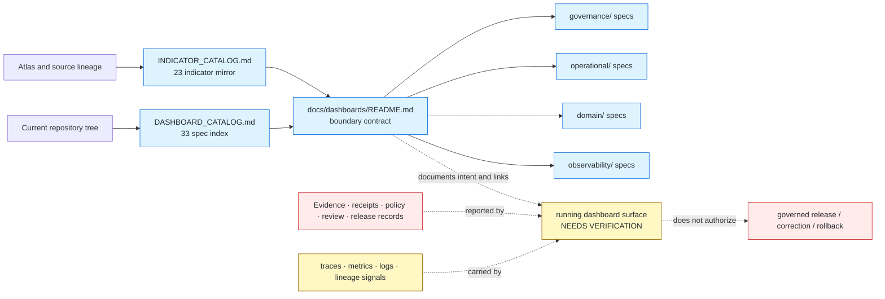

<!-- [KFM_META_BLOCK_V2]
doc_id: kfm://doc/dashboards-readme
title: Dashboards — Human-facing dashboard specifications and indicator catalogs
type: documentation-lane-readme
version: v1.0.1
status: "repository-grounded; active-path; placement-hold; runtime-needs-verification"
owners:
  - "@bartytime4life"
owner_status: "CONFIRMED GitHub review route through the repository default CODEOWNERS rule; dashboard, observability, domain, and independent-review stewardship assignments remain NEEDS VERIFICATION"
created: 2026-05-20
updated: 2026-08-21
policy_label: repository-facing
truth_posture: cite-or-abstain
owning_root: docs/
responsibility: "Define the human-readable dashboard-specification lane, its current repository inventory, trust boundaries, authoring contract, validation expectations, placement hold, and relationships to runtime, evidence, policy, and release authorities."
current_path: docs/dashboards/README.md
placement_status: "CONFIRMED existing path under canonical docs/ root; HOLD as an unadmitted direct-child lane in the adopted Directory Rules v2 canonical docs map"
runtime_status: "NEEDS VERIFICATION — specification presence is not running-dashboard evidence"
evidence_snapshot:
  repository: bartytime4life/Kansas-Frontier-Matrix
  base_ref: main
  base_commit: 075cbc5dbf9918ef0ce7719b24463d40f8ed09ef
  target_prior_blob: c3a0ab69cfc14cea7269cc2cdd853fbac3bb14e3
  docs_root_readme_blob: 1f8bac189dac1d01c1185e8b4fb8e25efd11d09f
  directory_rules_blob: fd49a0b83e55cef52c1124281f093e263526898d
  adr_0029_blob: a4de0d7a96b78da59cfc499d1025e1508afd8dd9
  root_registry_blob: 024f668b5f0a9239bafa4f8b09e2afd86300ff8c
  codeowners_blob: dd2a84aa514d8ecd9208bc347f90f9a2ed37dd61
  dashboard_catalog_blob: 82c7859b2782c13e97b1b3d3d55cdf35400fe675
  indicator_catalog_blob: 4fe3d6be5b0b6ba6359a301942c01d713c8e970f
  governance_tree: 448e5614c90534266064dee9a218519876ca8b1c
  operational_tree: c24b6e74e62d0c895282a2e1d9defbe62750f62c
  domain_tree: 57d617906f292492c79f769e147e9716ab7fabb9
  observability_tree: d330bc33e5f94dd54f4d5487fe3ed30ac088f7c7
related:
  - docs/README.md
  - docs/doctrine/directory-rules.md
  - docs/adr/ADR-0029-adopt-directory-governance-standard-v2.md
  - docs/dashboards/DASHBOARD_CATALOG.md
  - docs/dashboards/INDICATOR_CATALOG.md
  - docs/dashboards/governance/README.md
  - docs/dashboards/operational/README.md
  - docs/dashboards/domain/README.md
  - docs/dashboards/observability/README.md
  - docs/atlases/KFM_Domains_Culmination_Atlas_v1_1.md
  - docs/registers/DRIFT_REGISTER.md
  - docs/registers/VERIFICATION_BACKLOG.md
  - apps/review-console/README.md
  - control_plane/root_registry.yaml
  - data/receipts/generated/README.md
tags: [kfm, docs, dashboards, specifications, governance-health, operational-health, domain-health, observability, cite-or-abstain]
notes:
  - "v1.0 is a same-path repository reconciliation. It replaces the 2026-05 evidence boundary with a pinned current-tree inventory and adopted Directory Rules v2 posture."
  - "v1.0.1 reconciles the parent inventory to the current 33-spec catalog and thirteen-spec domain lane after removal of the air sensor-review path; it changes no catalog, runtime, policy, release, deployment, or publication authority."
  - "The current dashboards subtree contains 33 specification files and seven lane/catalog navigation files, for 40 Markdown files total at the pinned base."
  - "Specification-file presence is CONFIRMED; running dashboards, telemetry production, query execution, metric computation, alerting, and deployed review-console integration remain NEEDS VERIFICATION."
  - "The dashboards lane reports posture. It does not create evidence, policy, review, release, correction, rollback, or publication authority."
  - "This documentation-only update does not settle the placement hold, migrate the lane, resolve duplicate observability filenames, or alter runtime behavior."
[/KFM_META_BLOCK_V2] -->

<a id="top"></a>

# Dashboards · `docs/dashboards/`

> Human-facing specifications, catalogs, ownership expectations, and trust-boundary guidance for KFM dashboard surfaces. **This lane specifies and indexes; it does not run dashboards or create truth.**

<p>
  
  
  
  
  
  
</p>

> [!IMPORTANT]
> **Existence, placement, specification, implementation, and publication are separate states.** The path and its current inventory are **CONFIRMED** at the pinned repository snapshot. The parent `docs/` root is canonical under accepted [ADR-0029](../adr/ADR-0029-adopt-directory-governance-standard-v2.md). The nested dashboard lane is absent from the adopted canonical direct-child map, so long-term placement remains **HOLD**.

> [!CAUTION]
> **A dashboard is a downstream carrier.** A panel, trend line, SLO, trace, metric, log, report, badge, or screenshot does not substitute for an `EvidenceBundle`, validator result, `PolicyDecision`, `ReviewRecord`, `ReleaseManifest`, correction path, rollback target, or authorized release decision.

> [!NOTE]
> This same-path documentation update preserves the existing lane while its disposition is reviewed. It does not create runtime code, activate telemetry, release data, deploy a dashboard, publish KFM knowledge, or admit a new canonical docs lane.

## Quick jump

- [1. Scope](#1-scope)
- [2. Repo fit](#2-repo-fit)
- [3. Inputs](#3-inputs)
- [4. Exclusions](#4-exclusions-what-does-not-belong-here)
- [5. README contract](#5-readme-contract-directory-rules-15)
- [6. Current directory map](#6-directory-tree-proposed)
- [7. Architecture diagram](#7-architecture-diagram)
- [8. Dashboard catalog](#8-dashboard-catalog)
- [9. Indicator catalog](#9-indicator-catalog-atlas-v11-ch-2411)
- [10. Quickstart](#10-quickstart--authoring-a-dashboard-spec)
- [Validation and acceptance](#validation-and-acceptance)
- [11. Task list and open questions](#11-task-list--open-questions)
- [12. FAQ](#12-faq)
- [13. Related docs](#13-related-docs)
- [14. Appendix](#14-appendix)

---

<a id="1-scope"></a>

## 1. Scope

`docs/dashboards/` is an existing human-documentation lane for four specification classes:

1. **Governance health** — evidence integrity, release/correction/rollback posture, sensitivity and rights, AI surfaces, and documentation drift.
2. **Operational health** — feed freshness, SLOs, geospatial quality, and artifact reproducibility.
3. **Domain health** — domain roll-ups that preserve the owning domain's evidence, sensitivity, source-role, release, and correction boundaries.
4. **Observability** — traces, metrics, logs, lineage signals, service health, and validator-orchestrator health.

The lane also contains two indexes:

- [`DASHBOARD_CATALOG.md`](DASHBOARD_CATALOG.md) — current repository inventory and cross-lane spec index.
- [`INDICATOR_CATALOG.md`](INDICATOR_CATALOG.md) — human-readable governance-health indicator mirror and dashboard mapping.

### Current inventory

The four complete subtree listings at the pinned base establish the following file counts. Counts exclude category READMEs and the two catalogs unless stated otherwise.

| Category | Contract | Specification files | Evidence posture |
|---|---|---:|---|
| Governance | [`governance/README.md`](governance/README.md) | 5 | Presence **CONFIRMED**; runtime **NEEDS VERIFICATION** |
| Operational | [`operational/README.md`](operational/README.md) | 4 | Presence **CONFIRMED**; runtime **NEEDS VERIFICATION** |
| Domain | [`domain/README.md`](domain/README.md) | 13 | Thirteen top-level domain specs; the removed air sensor-review path is not counted; runtime **NEEDS VERIFICATION** |
| Observability | [`observability/README.md`](observability/README.md) | 11 | Presence **CONFIRMED**; naming conflict and runtime unresolved |
| **Total** | Four child lanes | **33** | Specification presence only |

Together with this README, two catalogs, and four category READMEs, the subtree contains **40 Markdown files** at the evidence snapshot.

[↑ Back to top](#top)

---

<a id="2-repo-fit"></a>

## 2. Repo fit

### Authority and placement

| Surface | Current role | Status | Consequence |
|---|---|---|---|
| [`docs/`](../README.md) | Human-readable governance and explanation root | **CONFIRMED** under ADR-0029 | Dashboard specs inherit the parent trust and exposure boundary. |
| `docs/dashboards/` | Existing nested lane | **CONFIRMED path / HOLD placement** | Preserve the path; do not infer canonical admission from presence. |
| [`control_plane/`](../../control_plane/README.md) | Machine-readable governance projections and indexes | **CONFIRMED root** | Any future machine dashboard registry requires separate governance and validation. |
| [`apps/review-console/`](../../apps/review-console/README.md) | Proposed role-gated steward review application boundary | **README CONFIRMED / runtime NEEDS VERIFICATION** | Specs may link to verified implementation later; they must not invent routes or panels. |
| External observability tooling | Collectors, stores, panel definitions, queries, and alerts | **UNKNOWN / implementation-specific** | Runtime artifacts and credentials do not belong in `docs/`. |

Accepted [ADR-0029](../adr/ADR-0029-adopt-directory-governance-standard-v2.md) adopts the exact Directory Rules v2 bytes at [`docs/doctrine/directory-rules.md`](../doctrine/directory-rules.md). Those rules define `docs/` as the human explanation surface and require a `BOUNDARY_COMPACT` README where a nested lane changes ownership, exposure, mutation, or authority. They do **not** automatically admit every current direct child as canonical.

### Current maturity model

| Level | Meaning | Dashboard-lane posture |
|---|---|---|
| **Tracked** | Path, indexes, category lanes, and spec files exist | **CONFIRMED** |
| **Documented** | Lane boundaries and spec intent are written | **CONFIRMED**, with stale claims reconciled here |
| **Indexed** | Specs appear in the current dashboard catalog | **CONFIRMED for 33 catalog rows; machine parity NEEDS VERIFICATION** |
| **Implemented** | Queries, panels, adapters, access controls, and stores exist | **NEEDS VERIFICATION** |
| **Observed** | Current telemetry or governed records feed a running surface | **UNKNOWN / NEEDS VERIFICATION** |
| **Enforced** | Validators or policy fail closed on dashboard contracts | **NEEDS VERIFICATION** |
| **Released** | A governed public or steward release exists | **UNKNOWN; not asserted by this README** |

[↑ Back to top](#top)

---

<a id="3-inputs"></a>

## 3. Inputs

A dashboard specification may describe how a running surface consumes or summarizes:

- governed validation, review, policy, release, correction, withdrawal, rollback, AI, redaction, and representation records **when their object families and instances are verified**;
- source identity, role, cadence, freshness, and stale-state metadata from governed registries;
- bounded telemetry such as trace coverage, run duration, exit-code distribution, service latency, and contract-health outcomes;
- finite negative states such as `MISSING_EVIDENCE`, `SOURCE_STALE`, `DENIED_BY_POLICY`, `RELEASE_WITHDRAWN`, `RUNTIME_ERROR`, and `REVIEW_PENDING` when defined by the owning contract or runtime;
- repository and CI signals when repository health is kept separate from KFM truth and release state.

Inputs remain owned by their source families. This lane records presentation and review intent; it does not store, rewrite, approve, or promote the underlying records.

[↑ Back to top](#top)

---

<a id="4-exclusions-what-does-not-belong-here"></a>

## 4. Exclusions — what does not belong here

| Prohibited responsibility | Owning home or disposition | Why |
|---|---|---|
| Running dashboard code, panel JSON, queries, adapters, or UI state | `apps/`, `packages/`, `runtime/`, `infra/`, or a governed external observability repository selected by execution role | Implementation is not documentation. |
| Telemetry series, traces, logs, profiles, or alert history | Governed runtime or observability storage | `docs/` is not an operational datastore. |
| Generated review or release reports | The verified report lane or external generated-artifact store | Reports are point-in-time outputs. |
| Machine-readable governance registers | `control_plane/` | A prose catalog is not machine authority. |
| Semantic contracts, machine schemas, or policy source | `contracts/`, `schemas/`, `policy/` | Meaning, shape, and admissibility remain separate. |
| Receipts, proofs, EvidenceBundles, catalogs, or lifecycle data | The correct `data/` accountability or lifecycle lane | Dashboards report on trust objects; they do not host them. |
| Promotion, release, correction, withdrawal, rollback, or signature decisions | `release/` | A dashboard cannot authorize the transition it visualizes. |
| Secrets, credentials, private endpoints, signed URLs, or protected payloads | Never committed; use governed secret and access systems | Public documentation is an exposure boundary. |
| Sensitive locations, living-person private data, genomic material, restricted archaeology, rare-species locations, or critical-infrastructure detail | Redact, generalize, quarantine, stage, delay, abstain, or deny according to policy | A metric dimension can become a side channel. |

> [!WARNING]
> Client-side hiding, aggregation labels, dashboard permissions, or a private-looking panel are not substitutes for upstream policy and public-safe transformation.

[↑ Back to top](#top)

---

<a id="5-readme-contract-directory-rules-15"></a>

## 5. README contract (Directory Rules v2 §16)

This lane uses the adopted `BOUNDARY_COMPACT` profile.

| Required field | Current contract |
|---|---|
| **Purpose and inherited parent** | Human-readable dashboard specifications and indexes under the canonical `docs/` explanation root. |
| **Local owner and scope** | GitHub review routes to `@bartytime4life`; complete dashboard, observability, domain, policy, release, and independent-review stewardship remains **NEEDS VERIFICATION**. |
| **Belongs / prohibited** | Sections [1](#1-scope) and [4](#4-exclusions-what-does-not-belong-here) define the local boundary. |
| **Inputs / outputs** | Inputs are references to governed records and telemetry contracts. Outputs are Markdown specs, two human indexes, and review guidance. |
| **Exposure** | Repository-facing; no secrets, restricted payloads, unsafe precision, or private operational detail. |
| **Mutation and retention** | Reviewed Git history. Generated or mirrored derivatives must declare source and edit policy. |
| **Validation** | Metadata, H1, anchors, links, inventory/catalog parity, sensitive-content, generated-receipt, and diff-hygiene checks. |
| **Status** | Path and inventory **CONFIRMED**; placement **HOLD**; runtime, enforcement, and release **NEEDS VERIFICATION** or **UNKNOWN**. |

A child category README owns deeper lane detail. This parent lists only direct children.

[↑ Back to top](#top)

---

<a id="6-directory-tree-proposed"></a>

## 6. Current directory map

```text
docs/dashboards/
├── README.md                    # this boundary contract
├── DASHBOARD_CATALOG.md         # 33-spec cross-lane index
├── INDICATOR_CATALOG.md         # 23-indicator human mirror
├── governance/                  # README + 5 specs
├── operational/                 # README + 4 specs
├── domain/                      # README + 13 specs
└── observability/               # README + 11 specs
```

### Current conflict to preserve

`observability/` contains both `OPENTELEMETRY_STACK.md` and `opentelemetry-stack.md`. Their simultaneous presence is **CONFIRMED**; identity, precedence, consumers, and migration disposition are **NEEDS VERIFICATION**. Do not delete, merge, rename, or declare either canonical from this README.

[↑ Back to top](#top)

---

<a id="7-architecture-diagram"></a>

## 7. Architecture diagram

Solid arrows show current documentation relationships. Dashed arrows show implementation relationships requiring separate evidence.


```mermaid
flowchart LR
  ATLAS["Atlas and source lineage"] --> IC["INDICATOR_CATALOG.md<br/>23 indicator mirror"]
  TREE["Current repository tree"] --> DC["DASHBOARD_CATALOG.md<br/>33 spec index"]
  IC --> ROOT["docs/dashboards/README.md<br/>boundary contract"]
  DC --> ROOT
  ROOT --> GOV["governance/ specs"]
  ROOT --> OPS["operational/ specs"]
  ROOT --> DOM["domain/ specs"]
  ROOT --> OBS["observability/ specs"]

  RECORDS["Evidence · receipts · policy · review · release records"] -. "reported by" .-> RUNTIME["running dashboard surface<br/>NEEDS VERIFICATION"]
  TELEMETRY["traces · metrics · logs · lineage signals"] -. "carried by" .-> RUNTIME
  ROOT -. "documents intent and links" .-> RUNTIME
  RUNTIME -. "does not authorize" .-> RELEASE["governed release / correction / rollback"]

  classDef docs fill:#ddf4ff,stroke:#0969da,color:#24292f;
  classDef runtime fill:#fff8c5,stroke:#9a6700,color:#24292f;
  classDef trust fill:#ffebe9,stroke:#cf222e,color:#24292f;
  class ROOT,IC,DC,GOV,OPS,DOM,OBS docs;
  class RUNTIME,TELEMETRY runtime;
  class RECORDS,RELEASE trust;
```

A specification can define intended panels, indicators, source records, negative states, owners, and response paths. Only implementation evidence establishes that those behaviors run.

[↑ Back to top](#top)

---

<a id="8-dashboard-catalog"></a>

## 8. Dashboard catalog

[`DASHBOARD_CATALOG.md`](DASHBOARD_CATALOG.md) is the current repository index for this lane. It records 33 specs and separates file presence from running-surface status.

| Category | Category contract | Specs | Posture |
|---|---|---:|---|
| Governance | [`governance/README.md`](governance/README.md) | 5 | Files **CONFIRMED** |
| Operational | [`operational/README.md`](operational/README.md) | 4 | Files **CONFIRMED** |
| Domain | [`domain/README.md`](domain/README.md) | 13 | Files **CONFIRMED** |
| Observability | [`observability/README.md`](observability/README.md) | 11 | Files **CONFIRMED**; duplicate-name conflict open |

### Catalog rules

- Every spec should appear in the catalog and nearest category README.
- A catalog row confirms an indexed specification, not a running panel or released capability.
- `implementation_status` becomes `CONFIRMED` only with pinned implementation plus representative test, workflow, dashboard artifact, emitted telemetry, or runtime evidence.
- Missing or extra rows are catalog drift; do not silently delete files to make counts match.
- The catalog cannot resolve placement or filename conflicts by declaration.

[↑ Back to top](#top)

---

<a id="9-indicator-catalog-atlas-v11-ch-2411"></a>

## 9. Indicator catalog

[`INDICATOR_CATALOG.md`](INDICATOR_CATALOG.md) mirrors **23 governance-health indicators** in five categories. It is an authoring and review aid, not doctrine, policy, metric storage, or enforcement.

| Indicator family | Rows | Example focus |
|---|---:|---|
| Evidence and source integrity | 5 | Evidence resolution, cite-or-abstain, source role, staleness |
| Release, correction, and rollback | 5 | Rollback coverage, correction timing, invalidation, supersession |
| Sensitivity and rights | 5 | Fail-closed behavior, redaction, rights changes, side channels |
| AI surface health | 4 | AIReceipt presence, ABSTAIN/DENY distributions, synthetic-claim audit |
| Documentation and drift | 4 | ADR completeness, drift backlog, README coverage, lineage |
| **Total** | **23** | Reported posture only |

> [!TIP]
> **Non-collapse rule:** the dashboard reports; the owning validator or policy enforces; governing records and EvidenceBundles carry support; the authorized release process decides publication.

If the mirror disagrees with its upstream atlas or another accepted authority, record and reconcile the discrepancy. A mirror cannot silently amend doctrine.

[↑ Back to top](#top)

---

<a id="10-quickstart--authoring-a-dashboard-spec"></a>

## 10. Quickstart — authoring a dashboard spec

1. **Pin repository state.** Record base commit, target lane, catalog rows, and overlapping work.
2. **Read the boundary.** Read this README, the category README, [`docs/README.md`](../README.md), [ADR-0029](../adr/ADR-0029-adopt-directory-governance-standard-v2.md), and [Directory Rules](../doctrine/directory-rules.md).
3. **Use an existing category.** A new category or direct child requires placement review before creation.
4. **Name source and limits.** Mark unsupported implementation claims `NEEDS VERIFICATION` or `UNKNOWN`.
5. **Keep one responsibility.** Put code, schema, policy, telemetry storage, trust objects, and release decisions in their owning roots.
6. **Define finite states.** Include normal, stale, missing, denied, withdrawn, review-pending, and runtime-error behavior. Do not convert absence into a healthy zero.
7. **Protect sensitive dimensions.** Prohibit labels, coordinates, identifiers, prompts, or log content that can reconstruct restricted information.
8. **Update indexes.** Reconcile the catalog, category README, and indicator catalog only where coverage changes.
9. **Validate.** Check metadata, H1, anchors, links, inventory parity, sensitive content, diff hygiene, and generated receipt.
10. **Stop at reviewable state.** A spec pull request does not deploy, release, publish, or approve a dashboard.

[↑ Back to top](#top)

---

<a id="validation-and-acceptance"></a>

## Validation and acceptance

### Documentation checks

A focused change should verify:

- one `KFM_META_BLOCK_V2` and one H1 per changed document;
- balanced Markdown, HTML, tables, and Mermaid fences;
- valid headings, internal fragments, legacy anchors, and case-sensitive paths;
- catalog/category coverage for added or removed specs;
- no placeholder claim presented as runtime behavior;
- no secrets, restricted payloads, unsafe precision, or sensitive side channels;
- final newline and diff hygiene;
- generated-receipt schema and artifact-hash integrity.

Useful repository checks include:

```bash
python tools/validators/validate_generated_receipt.py \
  data/receipts/generated/<receipt>.json --repo-root .

git diff --check
```

### Acceptance interpretation

| Criterion | Passing evidence |
|---|---|
| Same-path modernization | Only this README and its generated receipt change unless a direct dependency is admitted. |
| Inventory accuracy | Four subtree counts reconcile to 33 specs and seven navigation/catalog files. |
| Placement truth | Existing path confirmed; nested-lane status remains `HOLD`. |
| Trust boundary | No runtime, evidence, policy, release, or publication authority moves into docs. |
| Runtime claims | No running-dashboard claim is upgraded without evidence. |
| Reversibility | Prior README blob and focused revert remain sufficient rollback targets. |

[↑ Back to top](#top)

---

<a id="11-task-list--open-questions"></a>

## 11. Task list & open questions

- [ ] **DASH-OQ-01 — Placement disposition.** Admit the lane, retain a bounded exception, migrate it, or split by responsibility through a separate reviewed decision.
- [ ] **DASH-OQ-02 — Observability duplicate identity.** Reconcile the two OpenTelemetry filenames only after comparing content, IDs, inbound links, writers, consumers, and migration needs.
- [ ] **DASH-OQ-03 — Steward assignments.** Establish dashboard, observability, category, domain, policy, release, and independent-review roles.
- [ ] **DASH-OQ-04 — Runtime mapping.** Verify which specs correspond to code, queries, panels, stores, alerts, review-console features, or deployments.
- [ ] **DASH-OQ-05 — Catalog parity enforcement.** Identify or add a repository-owned check that rejects missing, duplicate, or unclassified specs without treating the catalog as runtime authority.
- [ ] **DASH-OQ-06 — Indicator lineage.** Verify the operative source identity for the 23-row mirror and define bounded synchronization.
- [ ] **DASH-OQ-07 — Negative-state vocabulary.** Reconcile reason codes and labels with owning contracts, schemas, policy, Explorer, Review Console, and runtime envelopes.
- [ ] **DASH-OQ-08 — Sensitive telemetry profile.** Define and test cardinality, labels, coordinates, identifiers, prompts, and log-redaction rules.
- [ ] **DASH-OQ-09 — Review and correction workflow.** Define investigation, correction, versioning, withdrawal propagation, and cache behavior.

[↑ Back to top](#top)

---

<a id="12-faq"></a>

## 12. FAQ

### Why keep dashboard specifications separate from generated reports?

Specifications describe recurring surfaces, inputs, owners, finite states, and expected posture. Reports are point-in-time outputs. This README creates no report authority.

### Are running dashboards stored here?

No. Code, queries, dashboard-as-code, collector configuration, telemetry stores, and alerts belong in execution or infrastructure surfaces selected by responsibility.

### Does a green dashboard prove KFM truth or release readiness?

No. It is one review signal. Evidence, policy, validation, review, release, correction, and rollback remain independently governed.

### Is `docs/dashboards/` canonical?

The path is **CONFIRMED** and the parent `docs/` root is canonical. The nested lane is omitted from the adopted canonical direct-child map, so placement remains **HOLD**.

### Who owns this lane?

`@bartytime4life` is the confirmed GitHub review route. Complete dashboard and observability stewardship, including independent review where warranted, remains **NEEDS VERIFICATION**.

### May a new domain or category be invented here?

No. Use registered identities. A new category, scope, or authority boundary requires evidence and placement review.

[↑ Back to top](#top)

---

<a id="13-related-docs"></a>

## 13. Related docs

| Surface | Relationship |
|---|---|
| [`docs/README.md`](../README.md) | Parent documentation authority and exposure contract |
| [`Directory Rules v2`](../doctrine/directory-rules.md) | Adopted placement and README-profile law |
| [`ADR-0029`](../adr/ADR-0029-adopt-directory-governance-standard-v2.md) | Accepted adoption decision and migration boundary |
| [`Dashboard Catalog`](DASHBOARD_CATALOG.md) | Current 33-spec index |
| [`Indicator Catalog`](INDICATOR_CATALOG.md) | Current 23-row governance-health mirror |
| [`Governance lane`](governance/README.md) | Governance-health category contract |
| [`Operational lane`](operational/README.md) | Feed, artifact, and QC category contract |
| [`Domain lane`](domain/README.md) | Per-domain category contract |
| [`Observability lane`](observability/README.md) | Telemetry and system-health category contract |
| [`Domains Culmination Atlas v1.1`](../atlases/KFM_Domains_Culmination_Atlas_v1_1.md) | Indicator-lineage source path; authority and mirror synchronization still require verification |
| [`Drift Register`](../registers/DRIFT_REGISTER.md) | Human-readable placement and authority drift |
| [`Verification Backlog`](../registers/VERIFICATION_BACKLOG.md) | Concrete unresolved checks |
| [`Review Console README`](../../apps/review-console/README.md) | Proposed role-gated review application boundary |
| [`Root Registry`](../../control_plane/root_registry.yaml) | Top-level root projection; it does not admit nested placement |
| [`Generated receipts`](../../data/receipts/generated/README.md) | AI-authoring provenance guidance |

[↑ Back to top](#top)

---

<a id="14-appendix"></a>

## 14. Appendix

### Evidence ledger

| Evidence | Establishes | Does not establish |
|---|---|---|
| Target prior blob | Stable prior bytes and rollback target | Current correctness or canonical placement |
| Four subtree SHAs | Current paths and spec counts | Runtime behavior or telemetry emission |
| Dashboard catalog | Current inventory claim and metadata | Running dashboards or release state |
| Indicator catalog | Current 23-row human mirror | Enforcement or threshold policy |
| ADR-0029 and Directory Rules | Placement authority and README profiles | Automatic admission of this nested lane |
| `docs/README.md` | Parent root contract | Nested-lane disposition |
| CODEOWNERS | GitHub review routing | Steward assignment, approval, independent review, or release authority |

### No-loss reconciliation

This modernization preserves the prior document's substantive duties:

- specs remain separate from running implementations;
- indicator mirrors remain separate from enforcement;
- governance, operational, domain, and observability categories remain visible;
- evidence, receipts, policy, review, release, correction, and rollback stay outside docs authority;
- sensitive material remains fail closed;
- authoring, validation, open questions, FAQ, navigation, and rollback remain documented;
- legacy section anchors are retained.

It corrects stale claims that the repository was not mounted, the tree was merely proposed, only 24 specs existed, Directory Rules v1 governed placement, and the prior atlas filename was current.

### Rollback

Before merge, close the draft PR and delete its scoped branch through normal controls. After an authorized merge, revert this focused correction and its generated receipt, restore prior README blob `c3a0ab69cfc14cea7269cc2cdd853fbac3bb14e3`, and rerun documentation and receipt checks. No runtime, telemetry, lifecycle, release, deployment, cache, or public artifact requires reversal.

---

**Current edition:** v1.0.1 · **Evidence review:** 2026-08-21 · **GitHub review route:** `@bartytime4life` · **Placement:** `HOLD` · **Runtime:** `NEEDS VERIFICATION`

[↑ Back to top](#top)
