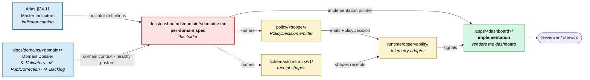

<!-- [KFM_META_BLOCK_V2]
doc_id: kfm://doc/dashboards-domain-readme
title: Per-Domain Dashboard Specifications (PROPOSED lane; specifications only, not implementations)
type: standard
version: v1
status: draft
owners: OWNER_TBD  # NEEDS VERIFICATION: docs steward + domain stewards + governance-health steward
created: 2026-05-25
updated: 2026-05-25
policy_label: public
related:
  - kfm://doc/directory-rules                                # CONFIRMED: docs/doctrine/directory-rules.md
  - kfm://doc/atlas-v1-1                                     # PROPOSED: docs/atlases/KFM_Domains_Culmination_Atlas_v1_1.pdf §24.11
  - kfm://doc/atlas-v1-1-ch24-5-sensitivity-tier-reference   # CONFIRMED authored sibling
  - kfm://doc/atlas-v1-1-ch24-6-pipeline-gate-reference      # CONFIRMED authored sibling
  - kfm://doc/backlog-navigation-index                       # CONFIRMED authored: docs/backlog/README.md
  - kfm://adr/atlas-chapter-split-layout                     # PROPOSED candidate (paired ADR)
  - kfm://adr/dashboards-lane-existence                      # PROPOSED candidate: OPEN-DASH-01
tags: [kfm, dashboards, domain, specifications, governance-health, indicators, readme]
notes:
  - This README sits at a PROPOSED lane (`docs/dashboards/`). The lane is not in the Directory Rules §6.1 `docs/` tree.
  - This file is SPECIFICATIONS only — it documents what dashboards should exist per domain, what they should measure, who owns them. It does NOT implement dashboards (those live in `apps/`) and does NOT own indicator definitions (Atlas §24.11 does).
  - Whether `docs/dashboards/` should exist as a lane is ADR-class per Directory Rules §2.4(5). Logged as OPEN-DASH-01.
[/KFM_META_BLOCK_V2] -->

# Per-Domain Dashboard Specifications

<!-- [doc: kfm://doc/dashboards-domain-readme] -->
<a id="top"></a>

> Per-domain **dashboard specifications** — what each domain measures, the healthy postures, the ownership chain. **This folder specifies; it does not implement.** Implementations live in `apps/`; the master indicator set lives in Atlas v1.1 §24.11; per-domain instrumentation hints live in `docs/domains/<domain>/`.

<p>
  
  
  
  
  
  
  
</p>

> [!IMPORTANT]
> **Truth posture.** The **master governance health indicators** in Atlas §24.11 are PROPOSED doctrine — the indicator catalog is named in CONFIRMED Atlas v1.1 text but adoption as canonical is open per VB-11-08. The **per-domain specification pattern** in this folder is PROPOSED. The **lane `docs/dashboards/` itself** is PROPOSED per OPEN-DASH-01. Implementation status (whether any specified dashboard actually exists) is NEEDS VERIFICATION.

> [!CAUTION]
> **Parallel-authority concern.** Atlas §24.11 owns the master indicator catalog. Per-domain dossiers in `docs/domains/<domain>/` already carry instrumentation hints in their `K. Validators, tests, fixtures` and `L. Governed AI behavior` sections. A file here that **redefines** an indicator — rather than specifying its per-domain instance — is parallel authority. See §4 (exclusions).

> [!NOTE]
> **Anti-collapse rule.** A dashboard spec does not substitute for the underlying receipts, evidence bundles, policy decisions, or review records. Indicators are reported, not enforced. *(Atlas v1.1 §24.11, CONFIRMED.)*

---

## Contents

1. [Scope](#1-scope)
2. [Repo fit](#2-repo-fit)
3. [Accepted inputs](#3-accepted-inputs)
4. [Exclusions](#4-exclusions)
5. [Per-domain inventory](#5-per-domain-inventory)
6. [Specification template](#6-specification-template)
7. [Integration with Atlas §24.11, dossiers, and `apps/`](#7-integration-with-atlas-2411-dossiers-and-apps)
8. [Indicator-to-implementation flow](#8-indicator-to-implementation-flow)
9. [Verification checklist](#9-verification-checklist)
10. [Maintenance task list](#10-maintenance-task-list)
11. [Open questions & ADR cross-reference](#11-open-questions--adr-cross-reference)
12. [Evidence basis & citations](#12-evidence-basis--citations)

---

## 1. Scope

This folder hosts **per-domain dashboard specification files** — one file per KFM domain — describing:

- which **governance health indicators** (Atlas §24.11 categories) apply to the domain;
- what the **healthy posture** looks like for each indicator at the domain scale;
- which **receipts, policies, and validators** feed the indicator;
- who **owns** the dashboard (domain steward + governance-health steward);
- where the **implementation** lives (`apps/` path, dashboard URL, telemetry config).

The specifications are **read-only references** for implementers. The receipts and evidence the indicators measure live in their normal homes (`data/receipts/`, `release/manifests/`, `policy/`, etc.). The dashboards themselves render in `apps/` (e.g., `apps/review-console/`, `apps/admin/`).

> [!TIP]
> If you're looking for the master indicator catalog (what to measure system-wide), go to Atlas v1.1 §24.11. If you're looking for a specific domain's instrumentation context, start in `docs/domains/<domain>/`. If you're looking for the actual rendered dashboard, follow the implementation pointer in the per-domain spec to its `apps/` home.

[↑ back to top](#top)

---

## 2. Repo fit

```text
docs/
└── dashboards/                       # PROPOSED lane (Directory Rules §6.1 does not list this)
    ├── README.md                     # PROPOSED parent README (NEEDS VERIFICATION)
    ├── domain/                       # THIS FOLDER — per-domain dashboard specifications
    │   ├── README.md                 # THIS FILE
    │   ├── hydrology.md              # ⏳ proposed per-domain spec
    │   ├── soil.md                   # ⏳
    │   └── …                         # ⏳ remaining domains listed in §5
    ├── cross-domain/                 # PROPOSED sibling — release, AI, drift, governance-health
    └── release/                      # PROPOSED sibling — release / rollback / correction
```

**Upstream authorities.**

| Upstream | Relationship |
|:---|:---|
| `docs/atlases/KFM_Domains_Culmination_Atlas_v1_1.pdf` §24.11 | **Master governance health indicators** — the indicator catalog. Per-domain specs in this folder **instance** these indicators; they do not **redefine** them. |
| `docs/atlases/KFM_Domains_Culmination_Atlas_v1_1.pdf` §24.10 | Risk register — drives which indicators are critical for each domain. |
| `docs/domains/<domain>/` | Per-domain dossier — source of `K. Validators, tests, fixtures`, `M. Publication, correction, rollback`, and `N. Verification backlog` content that informs the per-domain dashboard spec. **Dossier always wins on conflict.** |
| `docs/doctrine/directory-rules.md` | Places `docs/` lanes; this lane is not yet placed there. See §11 OPEN-DASH-01. |

**Downstream consumers.**

| Downstream | Relationship |
|:---|:---|
| `apps/review-console/`, `apps/admin/`, `apps/explorer-web/`, future `apps/dashboards/` | **Implementations.** Each dashboard spec here points to its implementation home. |
| `runtime/observability/` *(if it exists; NEEDS VERIFICATION)* | Telemetry plumbing — emits the signals the dashboards visualize. |
| `schemas/contracts/v1/` | Receipt and report schemas — define the shape of the signals dashboards read. |
| `policy/` | Policy bundles — emit `PolicyDecision` outcomes that several indicators count (DENY-reason distribution, ABSTAIN rate, etc.). |
| `docs/registers/DRIFT_REGISTER.md` | When a domain's actual dashboard state diverges from spec, the divergence is logged here. |

[↑ back to top](#top)

---

## 3. Accepted inputs

Files that belong in this folder:

- **One `<domain>.md` file per KFM domain**, following the template in §6 and the inventory in §5.
- **This README** (`README.md`).
- Optional `<domain>/figures/` sub-folder per domain spec for separately-versioned diagrams (PROPOSED; parallels the chapter-extract figures pattern).

Each per-domain spec MUST:

- declare the **indicator subset** (from Atlas §24.11) that applies to the domain;
- declare the **healthy posture** per indicator at the domain scale;
- name the **receipt / evidence source** for each indicator;
- name the **dashboard owner** (domain steward + governance-health steward);
- point to its **implementation home** in `apps/` (or note `UNKNOWN` if not yet implemented).

[↑ back to top](#top)

---

## 4. Exclusions

Files that do **not** belong here and where they should live instead:

| ❌ Do not put here | ✅ Belongs in |
|:---|:---|
| Dashboard implementations (React components, configs, charts) | `apps/<dashboard-app>/` |
| Telemetry plumbing or signal-emission code | `runtime/observability/` or per-package observability adapters |
| Schema definitions for receipts / reports | `schemas/contracts/v1/<family>/` |
| Policy bundles emitting denial reasons | `policy/<scope>/` |
| **Redefinitions** of master indicators (drift from Atlas §24.11) | Atlas §24.11 — propose a change via ADR, not a redefinition here |
| Cross-domain dashboards (release, AI, drift) | `docs/dashboards/cross-domain/` (PROPOSED sibling) |
| Per-domain validator code | `tests/domains/<domain>/` or `tools/validators/` |
| New backlog items | The canonical backlog homes — see `docs/backlog/README.md` |
| ADRs about dashboard architecture | `docs/adr/` |
| Operational dashboards' real-time data | Live telemetry stores; **never** mirrored as files here |

> [!WARNING]
> **Redefinition watch.** If a per-domain spec finds itself rewriting an indicator definition, that's a signal that Atlas §24.11 is missing context. The correct response is **propose a §24.11 amendment via ADR**, not redefine the indicator at the domain scale. The Atlas is doctrine; this folder is documentation.

[↑ back to top](#top)

---

## 5. Per-domain inventory

Atlas v1.0 chapters 4 – 16 carry per-domain `H. Pipeline shape`, `I. Sensitivity, rights, and publication posture`, `K. Validators, tests, fixtures`, and `M. Publication, correction, and rollback` sections. Each domain is a candidate target for a dashboard spec.

### 5.1 Authored (✅) and proposed (⏳) status

Domain naming follows `docs/domains/<domain>/` convention from Directory Rules §6.1.

| Atlas Ch. | Domain | File | Status | Indicator categories that primarily apply |
|:---:|:---|:---|:---:|:---|
| 4 | Hydrology | [`hydrology.md`](hydrology.md) | ✅ | Evidence-and-source; Release-correction-rollback; Documentation-and-drift |
| 5 | Soil | [`soil.md`](soil.md) | ✅ | Evidence-and-source; Documentation-and-drift |
| 6 | Habitat | [`habitat.md`](habitat.md) | ✅ | Evidence-and-source; Sensitivity-and-rights |
| 7 | Fauna | [`fauna.md`](fauna.md) | ✅ | **Sensitivity-and-rights** *(T4 defaults)*; Evidence-and-source |
| 8 | Flora | [`flora.md`](flora.md) | ✅ | **Sensitivity-and-rights** *(T4 defaults)*; Evidence-and-source |
| 9 | Agriculture | [`agriculture.md`](agriculture.md) | ✅ | Evidence-and-source; Documentation-and-drift |
| 10 | Geology / Natural Resources | [`geology.md`](geology.md) | ✅ | Evidence-and-source |
| 11 | Atmosphere / Air | [`atmosphere.md`](atmosphere.md) | ✅ | Evidence-and-source; **AI-surface-health** *(forecasting cite-or-abstain)* |
| 12 | Hazards | [`hazards.md`](hazards.md) | ✅ | **Release-correction-rollback** *(alert-authority denial)*; Evidence-and-source |
| 13 | Roads / Rail / Trade Routes | [`roads-rail-trade.md`](roads-rail-trade.md) | ✅ | Evidence-and-source; Documentation-and-drift |
| 14 | Settlements / Infrastructure | [`settlements-infrastructure.md`](settlements-infrastructure.md) | ✅ | **Sensitivity-and-rights** *(critical-asset T4)*; Release-correction-rollback |
| 15 | Archaeology / Cultural Heritage | [`archaeology.md`](archaeology.md) | ✅ | **Sensitivity-and-rights** *(T4 defaults, sovereignty)*; Evidence-and-source |
| 16 | People / Genealogy / DNA / Land Ownership | [`people-dna-land.md`](people-dna-land.md) | ✅ | **Sensitivity-and-rights** *(living-person T4, DNA T4)*; AI-surface-health |

> [!NOTE]
> **Cross-domain systems** (Atlas Ch. 17 Frontier Matrix, Ch. 18 Planetary/3D, Ch. 19 Cross-Domain Systems) are **not** in this inventory — they belong in `docs/dashboards/cross-domain/` (PROPOSED sibling). Spatial Foundation (Ch. 3) is foundational, not a domain; its instrumentation rolls up into every domain's dashboard.

### 5.2 Status legend

| Symbol | Meaning |
|:---:|:---|
| ✅ | Authored in this folder. |
| ⏳ | Proposed; not yet authored. |
| 🛠️ | In progress. |
| 🚫 | Withdrawn (not currently used). |
| 🔄 | Superseded by a later spec (not currently used). |

[↑ back to top](#top)

---

## 6. Specification template

Each per-domain spec file SHOULD follow this skeleton.

```markdown
<!-- KFM_META_BLOCK_V2 with type: standard, related: cross-references -->

# <Domain> Dashboard Specification

> One-line scope statement.

[badges: status, lane=PROPOSED, atlas chapter reference, indicator subset]

> [!IMPORTANT]
> Truth posture: indicator catalog from Atlas §24.11 (PROPOSED); per-domain instances PROPOSED.

## 1. Domain scope
- Atlas chapter reference (Ch. N)
- Default sensitivity tier(s) — link to §24.5 chapter file
- Pipeline shape — link to §24.6 chapter file

## 2. Indicator subset
Table: which §24.11 indicators apply, healthy posture for THIS domain, source of signal.

| Indicator | §24.11 cat. | Domain-scale healthy posture | Receipt / signal source |
|:---|:---|:---|:---|
| EvidenceRef resolution rate | 24.11.1 | > 99.9% (matches master) | EvidenceBundle resolver logs |
| Sensitive-lane fail-closed rate | 24.11.3 | 100% (T4 defaults apply) | PolicyDecision DENY counts |
| …                              | …       | …                             | …                              |

## 3. Domain-specific indicators (if any)
Indicators NOT in §24.11 but specific to this domain. PROPOSED; surfaces candidate §24.11 amendment.

## 4. Ownership
- Domain steward: <name or OWNER_TBD>
- Governance-health steward: <name or OWNER_TBD>
- Implementation owner: <apps/ team or OWNER_TBD>

## 5. Implementation pointer
- Dashboard app: `apps/<path>/` or `UNKNOWN`
- Telemetry: `runtime/observability/<adapter>/` or `UNKNOWN`
- Schemas read: `schemas/contracts/v1/<families>/`
- Policy bundles emitting signals: `policy/<scope>/`

## 6. Review cadence
How often the spec is reviewed; trigger events (e.g., domain dossier edition bump).

## 7. Open questions
Local `OPEN-DASH-<domain>-NN` items if any.

## 8. Evidence basis & citations
Standard source ledger.

<sub>Anti-collapse footer.</sub>
```

> [!TIP]
> Keep specs **bounded**. A per-domain spec should fit in a single Markdown file with the indicator table as the centerpiece. If a domain's dashboard story requires multiple files, that's a signal to either reduce scope or escalate the multi-file pattern via an OPEN-DASH item.

[↑ back to top](#top)

---

## 7. Integration with Atlas §24.11, dossiers, and `apps/`

Each per-domain spec is a **three-way bridge**:

| Direction | What it consumes | What it produces |
|:---|:---|:---|
| **Up to Atlas §24.11** | The master indicator catalog (categories 24.11.1 – 24.11.5). | A statement of *which* §24.11 indicators apply to the domain and *why* the domain's healthy posture differs (if at all). |
| **Sideways to `docs/domains/<domain>/`** | The dossier's `K.` validators, `M.` publication-correction-rollback context, `N.` verification backlog, `I.` sensitivity defaults. | A reference column in the spec table — the dossier supplies the *why* for each healthy posture. |
| **Down to `apps/` & `runtime/`** | Nothing — the spec does not consume implementations. | The implementation pointer (§5 of the template) — tells the implementer which `apps/` path, telemetry adapter, schema, and policy bundle to wire up. |

### 7.1 Conflict resolution

| Conflict | Winner |
|:---|:---|
| Per-domain spec vs Atlas §24.11 indicator definition | **Atlas wins.** Propose a §24.11 amendment via ADR. |
| Per-domain spec vs `docs/domains/<domain>/` dossier | **Dossier wins.** File a drift entry in `DRIFT_REGISTER.md`. |
| Per-domain spec vs `apps/` actual implementation | **The implementation is the operational truth**, but the divergence is a **drift signal** — log it. Specs should never silently match implementations that violate doctrine. |
| Per-domain spec vs `policy/` enforcement | **Policy wins.** A spec claiming an indicator measures a policy outcome must match the actual policy's `PolicyDecision` shape. |

> [!IMPORTANT]
> Specs **describe**; doctrine **defines**; policy **enforces**; implementations **render**. When the specs in this folder forget that layering, parallel-authority drift follows.

[↑ back to top](#top)

---

## 8. Indicator-to-implementation flow



*Doctrine (blue) drives specifications (red). Specifications point to implementations (green) and reference the machinery (yellow) that emits the signals. The reviewer reads the implementation, not the spec.*

[↑ back to top](#top)

---

## 9. Verification checklist

Apply before merging a new per-domain spec or treating this folder as canonical.

- [ ] Confirm target path `docs/dashboards/domain/<domain>.md` resolves under an accepted lane (OPEN-DASH-01).
- [ ] Confirm each indicator referenced in the spec exists in Atlas §24.11 — or is labeled as a PROPOSED §24.11 amendment with an ADR pointer.
- [ ] Confirm the spec's implementation pointer (§5 of template) resolves to a real `apps/` path or is honestly marked `UNKNOWN`.
- [ ] Confirm the spec's receipt-shape references resolve to `schemas/contracts/v1/` paths or are marked `NEEDS VERIFICATION`.
- [ ] Confirm the spec's policy-bundle references resolve to `policy/` paths or are marked `NEEDS VERIFICATION`.
- [ ] Confirm no spec **redefines** a §24.11 indicator silently. Drift to Atlas → ADR.
- [ ] Confirm domain dossier (`docs/domains/<domain>/`) has been consulted; healthy-posture values reflect dossier context.
- [ ] Confirm owners (domain steward + governance-health steward + implementation owner) named in spec.
- [ ] Confirm cross-reference back from `docs/domains/<domain>/README.md` to the spec (reciprocal linking).

[↑ back to top](#top)

---

## 10. Maintenance task list

Gates / definition-of-done for keeping the folder healthy.

- [ ] **Inventory sync.** §5.1 status column reflects actual files in this folder.
- [ ] **Atlas §24.11 sync.** When Atlas §24.11 amends an indicator, every spec that references it is reviewed within one edition cycle.
- [ ] **Dossier sync.** When `docs/domains/<domain>/` updates its `K.` / `M.` / `N.` sections, the corresponding dashboard spec is reviewed.
- [ ] **Implementation drift watch.** When an `apps/<dashboard>/` implementation changes, the spec's implementation pointer is verified.
- [ ] **Cross-domain promotion.** Indicators that prove broadly useful across multiple domain specs are surfaced as candidate §24.11 amendments.
- [ ] **No redefinition.** Periodic check: no spec redefines a §24.11 indicator silently.
- [ ] **Parallel-authority watch.** This folder does not grow non-spec content (no validator code, no schema definitions, no policy bundles).
- [ ] **Owner roster updated.** Meta-block `owners:` reflects current docs steward + governance-health steward.

[↑ back to top](#top)

---

## 11. Open questions & ADR cross-reference

| # | Question | Class | Cross-reference |
|:---|:---|:---|:---|
| **OPEN-DASH-01** | Should `docs/dashboards/` exist as a lane? Or should dashboard specs live in `docs/domains/<domain>/dashboard.md` files (per-dossier), or in `docs/architecture/dashboards/`? | ADR-class | Directory Rules §2.4(5); §6.1 *(canonical `docs/` tree)*; parallels OPEN-BLOG-01. |
| **OPEN-DASH-02** | Subfolder convention — `docs/dashboards/domain/<domain>.md` (flat per-domain files, current) vs `docs/dashboards/domain/<domain>/spec.md` (per-domain sub-folder)? | Naming class | Parallels OPEN-DR-02 *(`docs/runbooks/<domain>/` subfolder convention)*. |
| **OPEN-DASH-03** | Where do **dashboard implementations** live? `apps/review-console/`, `apps/admin/`, a new `apps/dashboards/`, or scattered across feature apps? | Directory class | Directory Rules §7.1; relates to apps/web vs apps/explorer-web (OPEN-DR-06). |
| **OPEN-DASH-04** | How does this folder relate to **telemetry contracts** in `schemas/contracts/v1/`? Does the dashboard spec reference an existing contract or does it surface a new one? | Contract class | Relates to §24.2 Receipt Catalog and `schemas/contracts/v1/` placement (ADR-S-03). |
| **OPEN-DASH-05** | **Cross-domain dashboards** (Promotion gate status board, Drift Register Triage, AI surface health, Release/rollback timeline) — where do they live? `docs/dashboards/cross-domain/`, `docs/dashboards/system/`, or somewhere else? | Scoping class | Currently sibling of `domain/`; needs explicit sibling-README. |
| **OPEN-DASH-06** | Should dashboard specs carry a **version** independent of the dossier edition, or follow the dossier? | Lifecycle class | Relates to Atlas v1.1 §24.8 (Stale-State & Supersession). |
| **OPEN-DASH-07** | When a per-domain spec proposes a new indicator (not in Atlas §24.11), what is the **escalation path** — chapter file open item, candidate ADR, or both? | Process class | Relates to OPEN-BLOG-03 *(OPEN-XXX-NN lifecycle)*. |
| **OPEN-DASH-08** | Should the **sensitive-domain** specs (fauna, flora, archaeology, people-dna-land, settlements-infrastructure) have stricter authoring controls — e.g., sensitivity-reviewer required on the PR? | Governance class | Relates to §24.5 *(T4 defaults)* and §24.7 *(Reviewer / SoD matrix)*. |

[↑ back to top](#top)

---

## 12. Evidence basis & citations

<details>
<summary><strong>Source ledger</strong></summary>

| Source | Status | Supports | Limits |
|:---|:---|:---|:---|
| Atlas v1.1 §24.11 — Master Governance Health Indicators (PDF, pp. 173–174) | CONFIRMED (manuscript) | §1 scope; §5.1 indicator categories; §6 template indicator-subset table. | Indicators labeled PROPOSED in source; instrumentation ownership is VB-11-08 NEEDS VERIFICATION. |
| Atlas v1.1 §24.10 — Risk Register and Threat Posture | CONFIRMED (manuscript) | §5.1 sensitivity-emphasis for fauna, flora, archaeology, people-dna-land. | Risk severities are PROPOSED. |
| Atlas v1.1 §G.7 VB-11-08 | CONFIRMED (manuscript) | §1 truth-posture statement that §24.11 instrumentation is NEEDS VERIFICATION. | Backlog item is open. |
| `docs/doctrine/directory-rules.md` §6.1 (`docs/` tree) | CONFIRMED (prior-session authored) | §2 repo fit; OPEN-DASH-01 *(lane not in canonical tree)*. | `docs/dashboards/` does **not** appear in §6.1. |
| `docs/doctrine/directory-rules.md` §2.4(5), §13.5 | CONFIRMED (prior-session authored) | §4 exclusions; parallel-authority caution; specification-lane framing. | Doctrinal anchor for "specifications, not authority." |
| Atlas v1.0 ch. 3–18 (per-domain dossiers, `K.` / `M.` / `N.` sections) | CONFIRMED (manuscript) | §5.1 domain inventory; §7 dossier-as-context relationship. | Mounted-repo dossier presence NEEDS VERIFICATION. |
| Pass 32 New Cards Register — KFM-P32-FEAT-0014 (Promotion gate status board) | CONFIRMED (corpus) | §11 OPEN-DASH-05 cross-domain dashboard examples. | Pass-card statements are PROPOSED. |
| Pass 30 cards — KFM-P30-FEAT-0001 (PM Sensor Calibration Review Dashboard), KFM-P20-FEAT-0007 (Telemetry contract health dashboard) | CONFIRMED (corpus) | §1, §11 dashboard-as-specification precedent in the corpus. | Cards are PROPOSED; not implementation evidence. |
| `docs/backlog/README.md` (prior-session authored) | CONFIRMED (prior-session authored) | §4 exclusion routing for backlog items; OPEN-DASH-01 paired-lane precedent. | Same parallel-authority pattern; same resolution model (pointer / specifications, not authority). |

</details>

### 12.1 Citation key

| Tag | Refers to |
|:---|:---|
| `[ENCY]` | KFM Encyclopedia |
| `[DIRRULES]` | Directory Rules |
| `[ATLAS]` | KFM Domains Culmination Atlas (any edition) |

> [!NOTE]
> **Anti-collapse rule (reaffirmed).** A dashboard spec is one carrier of governance posture; the posture itself rests on the receipts, evidence bundles, policy decisions, and review records that the spec **points to**. Replacing those artifacts with the spec — or replacing the spec with the rendered dashboard — collapses the layering this entire folder exists to preserve.

[↑ back to top](#top)

---

<sub>Per-domain dashboard specifications. PROPOSED lane (`docs/dashboards/`) pending OPEN-DASH-01 ADR. **Specifications only — implementations live in `apps/`; indicator definitions live in Atlas §24.11; domain context lives in `docs/domains/<domain>/`.** Atlas v1.1 §24.11 wins on indicator conflicts; domain dossier wins on context conflicts.</sub>
