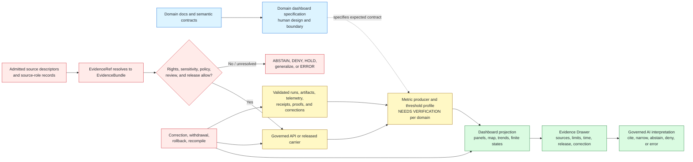

<!-- [KFM_META_BLOCK_V2]
doc_id: kfm://doc/dashboards-domain-readme
title: Domain Dashboard Specifications — Repository-Grounded Boundary and Inventory
type: standard
version: v2.0
status: draft; repository-grounded; boundary-compact; specification-lane; runtime-unverified; non-release; non-publication
owners:
  - "@bartytime4life"
created: 2026-05-25
updated: 2026-08-21
policy_label: repository-facing; dashboard-specifications; domain-health; sensitive-context; cite-or-abstain
owning_root: docs/
responsibility: Define the human-readable boundary, inventory, shared measurement contract, evidence limits, safety rules, validation expectations, maintenance duties, and review path for the thirteen domain dashboard specifications without creating domain, metric, runtime, policy, release, or publication authority.
truth_posture: CONFIRMED current path, thirteen-spec directory inventory, catalog coverage, accepted Directory Rules v2, current child-file presence, and bounded documentation validators / PROPOSED dashboard measurements, panels, thresholds, joins, alerts, and implementation mappings / UNKNOWN running dashboard routes, production telemetry, active policy evaluation, complete evidence resolution, release integration, correction propagation, rollback execution, deployment, and public parity / NEEDS VERIFICATION accountable domain, measurement, sensitivity, policy, UI, release, and independent reviewers.
current_path: docs/dashboards/domain/README.md
evidence_snapshot: "repository=bartytime4life/Kansas-Frontier-Matrix; initial_base=main@40f68c17b16cdc4219ea3d00756912f9fdb768b8; reconciled_base=main@17923d0bdfd87feadeebe6afe344ef35ca949c63; target_prior_blob=fc18e269e8f674688ea580ac384ba46c40304840; parent_readme_blob=c3a0ab69cfc14cea7269cc2cdd853fbac3bb14e3; dashboard_catalog_blob=82c7859b2782c13e97b1b3d3d55cdf35400fe675; hydrology_spec_blob=ee1816f1bec8ccf3da3e3c58f1ec58b2bfa2fa9d; generated_receipt_readme_blob=5a67f8d743306799a014590ccb45fa9f1177f16a; directory_rules_blob=fd49a0b83e55cef52c1124281f093e263526898d; metadata_validator_readme_blob=25be64b52c6fe74fbe0c167f32ba878280b11f5c"
related:
  - docs/dashboards/README.md
  - docs/dashboards/DASHBOARD_CATALOG.md
  - docs/dashboards/INDICATOR_CATALOG.md
  - docs/doctrine/directory-rules.md
  - docs/adr/ADR-0029-adopt-directory-governance-standard-v2.md
  - docs/registers/DRIFT_REGISTER.md
  - docs/registers/VERIFICATION_BACKLOG.md
  - apps/review-console/README.md
  - apps/explorer-web/README.md
  - data/receipts/generated/README.md
  - tools/validators/docs/meta-block/README.md
tags: [kfm, dashboards, domain, specifications, measurement-contract, evidence, sensitivity, correction, rollback, cite-or-abstain]
notes:
  - "v2.0 replaces the Atlas-first generated orientation with a same-path, repository-grounded boundary and exact thirteen-file domain inventory."
  - "The current catalog records 33 dashboard specifications overall: 5 governance, 4 operational, 13 domain, and 11 observability."
  - "The parent dashboard README still carries the superseded 34/14 counts from the removed domain/air sensor-review path; that inherited documentation drift is disclosed here and left for a focused parent reconciliation."
  - "Child-document richness and synthetic validation do not prove production metrics, a dashboard route, source admission, policy enforcement, release, deployment, or publication."
[/KFM_META_BLOCK_V2] -->

<!-- [doc: kfm://doc/dashboards-domain-readme] -->
<a id="top"></a>

# Per-Domain Dashboard Specifications

> **Purpose.** Orient maintainers to the thirteen domain dashboard specifications currently tracked under `docs/dashboards/domain/`, define the shared evidence and measurement boundary they inherit, and prevent documentation, telemetry, maps, or generated summaries from becoming domain truth or publication authority.

<p>
  
  
  
  
  
  
</p>

> [!IMPORTANT]
> **Specification presence is not dashboard implementation.** Current repository evidence confirms this README and thirteen sibling domain specification files. It does not establish metric producers, query execution, telemetry stores, panel configurations, access controls, deployed routes, active policy evaluation, release integration, or public behavior.

> [!CAUTION]
> **A domain dashboard is a downstream review projection.** It may summarize released or otherwise authorized evidence, validation, policy, review, correction, and operational signals. It must not define canonical domain records, infer missing evidence, approve its own thresholds, authorize exposure, or turn a green visualization into a claim of domain health.

> [!WARNING]
> **Metrics can disclose protected information.** Counts, filters, small cells, map selections, labels, exports, logs, accessibility text, cache keys, repeated queries, and generated language can reconstruct rare-species locations, archaeology, living-person or genomic facts, private land or wells, critical infrastructure, or other harmful precision. Public and ordinary-user surfaces must fail closed before those dimensions reach the client.

> [!NOTE]
> The historical KFM Domains Atlas and its indicator discussions remain useful design lineage. Current repository files, accepted doctrine, contracts, schemas, policy, tests, workflows, receipts, and runtime evidence control current claims within their respective authority classes. This README does not promote the Atlas into a machine registry or current runtime authority.

---

## Contents

1. [Scope](#1-scope)
2. [Repo fit](#2-repo-fit)
3. [Accepted inputs](#3-accepted-inputs)
4. [Exclusions](#4-exclusions)
5. [Per-domain inventory](#5-per-domain-inventory)
6. [Specification template](#6-specification-template)
7. [Integration with Atlas §24.11, dossiers, and `apps/`](#7-integration-with-atlas-2411-dossiers-and-apps)
8. [Indicator-to-implementation flow](#8-indicator-to-implementation-flow)
9. [Verification checklist](#9-verification-checklist)
10. [Maintenance task list](#10-maintenance-task-list)
11. [Open questions & ADR cross-reference](#11-open-questions--adr-cross-reference)
12. [Evidence basis & citations](#12-evidence-basis--citations)

---

## 1. Scope

This folder is the human-readable specification lane for KFM's thirteen current domain dashboard documents. Each child file may describe candidate measurements, panels, finite states, review cues, accessibility behavior, evidence links, correction behavior, and implementation dependencies for one domain.

This folder owns:

- navigation to the current domain dashboard specification set;
- the shared documentation contract inherited by child specifications;
- explicit separation among file presence, measurement design, implementation, observation, enforcement, release, and publication;
- source-role, claim-strength, spatial, temporal, uncertainty, sensitivity, and correction guardrails for dashboard design;
- maintenance triggers and bounded validation expectations;
- visible `CONFIRMED`, `PROPOSED`, `UNKNOWN`, and `NEEDS VERIFICATION` status.

This folder does **not** own:

- canonical domain semantics or records;
- source admission, rights determinations, EvidenceBundles, policy decisions, or review records;
- measurement execution, telemetry collection, operational stores, dashboard code, or application routes;
- release, correction, withdrawal, rollback, deployment, or publication decisions.

### 1.1 Shared dashboard posture

| Question | Current bounded answer |
|---|---|
| Are thirteen domain specification files present? | **CONFIRMED** at the pinned repository snapshot. |
| Are they cataloged? | **CONFIRMED** in [`DASHBOARD_CATALOG.md`](../DASHBOARD_CATALOG.md). |
| Do all child specs use one mature contract and measurement vocabulary? | **NEEDS VERIFICATION.** The lane contains multiple documentation generations and maturity levels. |
| Do production metric producers, queries, telemetry, and routed panels exist for every domain? | **UNKNOWN / NEEDS VERIFICATION.** |
| Are numeric thresholds, cadences, and suppression rules adopted? | **PROPOSED or UNKNOWN** unless a child spec points to current governing evidence. |
| Does a passing fixture or validator prove domain-wide health? | **No.** It proves only its bounded profile. |
| Does this lane authorize a public dashboard? | **No.** Release and public exposure remain separately governed. |

### 1.2 Measurement versus truth

A dashboard measurement is a derived observation about a defined process, artifact set, or evidence population. It is not the underlying domain fact. For example:

- Evidence-resolution rate measures whether references resolve under a declared scope; it does not establish that every resolved claim is true.
- Source freshness measures age against a declared cadence; it does not establish current real-world conditions.
- A synthetic public-safe fixture proves deterministic behavior for that fixture; it does not prove production geoprivacy enforcement.
- A correction-latency metric reports workflow timing; it does not authorize the correction or establish that every derivative was invalidated.
- A map count reports the released carrier available to that view; it does not prove absence outside the carrier or survey scope.

[↑ back to top](#top)

---

## 2. Repo fit

### 2.1 Placement result

The target already exists under the `docs/` responsibility root and explains a human-facing documentation lane. The smallest safe result is a same-path **`PLACE`** update.

Accepted [ADR-0029](../../adr/ADR-0029-adopt-directory-governance-standard-v2.md) adopts [Directory Rules v2](../../doctrine/directory-rules.md) as the current human placement authority. The rules recognize `docs/` as the human explanation surface and require nested lanes to declare their authority and exposure boundary. They do not automatically admit every existing direct child as a permanent canonical lane. Therefore:

- same-path documentation maintenance is supported;
- moving, renaming, splitting, deleting, or creating a parallel dashboard tree remains **`HOLD`**;
- no source, contract, schema, policy, receipt, proof, catalog, release, or runtime authority is created here.

### 2.2 Current repository inventory

At reconciled `main@17923d0bdfd87feadeebe6afe344ef35ca949c63`, the direct-child domain lane contains:

```text
docs/dashboards/domain/
├── README.md
├── agriculture.md
├── archaeology.md
├── atmosphere.md
├── fauna.md
├── flora.md
├── geology.md
├── habitat.md
├── hazards.md
├── hydrology.md
├── people-dna-land.md
├── roads-rail-trade.md
├── settlements-infrastructure.md
└── soil.md
```

That is **one README plus thirteen dashboard specifications**. No nested `domain/air/` lane is present at the pinned snapshot.

The current dashboard catalog records **33 specification files overall**: 5 governance, 4 operational, 13 domain, and 11 observability. The parent [`docs/dashboards/README.md`](../README.md) still reports the superseded 34/14 counts from the formerly tracked air sensor-review specification. That discrepancy is inherited documentation drift; this one-file lane modernization exposes it without silently changing a broader parent contract.

### 2.3 Responsibility map

| Surface | Owns | Relationship to this README |
|---|---|---|
| [`docs/dashboards/README.md`](../README.md) | Parent lane boundary and whole-dashboard navigation | Inherited boundary; currently stale on aggregate counts. |
| [`DASHBOARD_CATALOG.md`](../DASHBOARD_CATALOG.md) | Human specification inventory | Current count and row-level navigation; not runtime authority. |
| [`INDICATOR_CATALOG.md`](../INDICATOR_CATALOG.md) | Human indicator mirror | Design and review aid; not metric storage or enforcement. |
| Child domain specifications | Domain-specific dashboard intent | Must remain downstream of domain, evidence, policy, and release authorities. |
| `docs/domains/<domain>/` | Human domain explanation | Supplies domain vocabulary and evidence limits where current. |
| `contracts/`, `schemas/`, `policy/` | Meaning, machine shape, and admissibility | May be referenced; never redefined here. |
| `data/receipts/`, `data/proofs/`, `release/` | Process memory, proof, and governed release/correction objects | Inputs to review projections when verified; not hosted here. |
| `apps/`, `packages/`, `runtime/`, `infra/` | Executable dashboard, adapters, telemetry, storage, and deployment | Implementation must be verified separately. |
| MapLibre and Explorer | Downstream map rendering and interaction | Renderer and UI only; neither is truth, evidence, policy, or release authority. |
| Governed AI | Bounded explanation over resolved evidence | Interpretive only; cite, narrow, abstain, deny, or error. |

[↑ back to top](#top)

---

## 3. Accepted inputs

A child specification may reference an input only within that input's verified role and authority.

### 3.1 Input classes

| Input class | Allowed use | Required boundary |
|---|---|---|
| Domain documentation and contracts | Define terms, scope, source roles, object meaning, and limitations | Documentation does not prove runtime implementation. |
| Machine schemas and fixtures | Describe validated shape and bounded examples | Schema validity and fixture success do not establish truth, policy permission, or production parity. |
| Validators and tests | Support a named deterministic behavior claim | State exact command/profile and limits; do not generalize beyond tested scope. |
| Workflows and hosted checks | Show that configured checks ran for an exact revision | Workflow success is not source admission, policy approval, release, or deployment. |
| Source registries and descriptors | Identify authority, rights, access, cadence, and source role when populated and reviewed | A connector or URL is not an admitted source. |
| Evidence, policy, review, and release objects | Support a dashboard measurement or public-facing claim | References must resolve; missing closure produces a bounded negative state. |
| Telemetry and operational records | Measure behavior of a declared producer over a declared interval | Minimize labels and prevent sensitive or high-cardinality leakage. |
| Maps, tiles, reports, models, and AI output | Provide downstream context or interpretation | They remain derived carriers and cannot bootstrap their own evidence. |

### 3.2 Source-role anti-collapse

A dashboard must keep materially different source characters distinct.

| Source character | May support | Must not silently become |
|---|---|---|
| Direct observation | A bounded observation with time, place, method, unit, and quality context | Complete coverage, causation, warning authority, or forecast |
| Administrative or regulatory record | Status or designation within the issuing authority's scope and effective period | Physical condition, title truth, exposure, or universal legal advice |
| Statistical aggregate | A reported population-level measure with vintage and suppression rules | Individual, parcel, producer, household, or facility fact |
| Model, forecast, interpolation, or classification | A method-bound estimate with uncertainty and evaluation context | Observation, current condition, causation, or decision authority |
| Remote-sensing derivative | A sensor- and processing-bound representation | Ground truth, private-land fact, or exact sensitive occurrence |
| Historical or archival record | A dated event or interpretation | Current operational status or present-day identity |
| Context or educational source | Background and framing | Evidence closure for a consequential claim |
| Generated interpretation | Plain-language explanation over resolved support | Evidence, review, policy, release, or correction authority |

### 3.3 Minimum measurement contract

Before a proposed indicator can be treated as implementation-ready, its child specification should identify:

| Field | Minimum requirement |
|---|---|
| `measurement_id` | Stable identifier or explicit `NEEDS VERIFICATION` placeholder; do not invent registry state. |
| Purpose and question | What review question the measurement answers and what it cannot answer. |
| Numerator / denominator / population | Explicit inclusion, exclusion, and zero-denominator behavior. |
| Unit and aggregation | Unit, grouping keys, allowed dimensions, and anti-double-counting rule. |
| Spatial support | Geography type, version, generalization, join semantics, and no-data behavior. |
| Temporal support | Observed/effective/retrieved/released/corrected times as applicable; window and freshness basis. |
| Source roles | Source identifiers and role of each input; conflicting sources remain visible. |
| Evidence and lineage | `EvidenceRef`/`EvidenceBundle`, run, artifact, receipt, proof, or release references appropriate to significance. |
| Method and uncertainty | Method version, assumptions, confidence/quality fields, missingness, coverage, and known bias. |
| Threshold profile | Versioned threshold or explicit absence; no magic number embedded only in prose or UI. |
| Sensitivity and rights | Allowed dimensions, suppression/generalization duties, audience, access class, and side-channel analysis. |
| Finite states | Supported, stale, missing, restricted, review-pending, corrected, withdrawn, and system-error behavior where applicable. |
| Correction and rollback | How superseded values, caches, exports, maps, search, and generated summaries are invalidated or replaced. |
| Owner and review | Accountable producer, domain reviewer, policy/sensitivity reviewer, and release/correction route—each verified or marked unresolved. |

### 3.4 Claim-strength ladder

A dashboard should not let visualization strength exceed evidence strength.

| Level | Allowed presentation | Prohibited escalation |
|---|---|---|
| Context | Source coverage, inventory, age, or descriptive background | Inferring condition, risk, or causation |
| Observation | Time- and scope-bounded observed value | Treating a sample or incomplete survey as exhaustive |
| Derived indicator | Reproducible computation over declared inputs | Presenting method output as direct observation |
| Association | Reviewed relationship with uncertainty and scope | Causal language without causal evidence |
| Causal or prescriptive conclusion | Only with specifically adequate evidence, authority, review, and release support | Dashboard styling, correlation, or model score as a substitute |

[↑ back to top](#top)

---

## 4. Exclusions

Files and responsibilities that do not belong in this lane:

| Do not place or decide here | Owning boundary or disposition |
|---|---|
| React components, panel JSON, queries, adapters, collectors, storage, alert rules, or deployment configuration | The verified `apps/`, `packages/`, `runtime/`, `infra/`, or governed external implementation surface |
| Telemetry series, traces, logs, profiles, alert history, or user-event payloads | Governed operational storage with retention and access controls |
| Canonical domain records, source payloads, EvidenceBundles, policy decisions, review records, or release objects | Their distinct domain, lifecycle, accountability, policy, or release roots |
| Semantic contracts, JSON Schemas, validators, or policy source | `contracts/`, `schemas/`, `tools/validators/`, and `policy/` |
| Master indicator or threshold authority created only by prose | A reviewed contract, registry, policy profile, or accepted decision in the owning root |
| Unverified owner, route, package, service, cadence, threshold, SLO, or panel claim | Mark `UNKNOWN`, `NEEDS VERIFICATION`, or `PROPOSED` |
| Protected payloads, exact harmful locations, living-person private data, genomics, private wells, title assertions, or critical-asset detail | Quarantine, redact, generalize, aggregate, delay, restrict, abstain, or deny under reviewed policy |
| Direct browser access to RAW, WORK, QUARANTINE, internal canonical stores, model runtimes, or unreleased candidates | Deny; ordinary clients use governed interfaces and released public-safe carriers |
| A dashboard-generated claim treated as proof of its own evidence or policy | Reject as circular support |
| Release, deployment, promotion, publication, correction approval, or rollback authorization | `release/` and accountable human/governed decision processes |

> [!WARNING]
> **Client-side filtering is not a security or sensitivity control.** Protected dimensions must be removed, transformed, or denied before delivery. Tooltips, legends, URLs, accessibility trees, exports, logs, search indexes, caches, and AI context require the same review as visible charts.

[↑ back to top](#top)

---

## 5. Per-domain inventory

Every row below confirms a tracked specification file and summarizes its bounded design focus. It does not confirm a running dashboard.

| Domain specification | Bounded focus | High-risk or non-collapse boundary | Current runtime conclusion |
|---|---|---|---|
| [`agriculture.md`](agriculture.md) | Evidence resolution, statistical suppression, land-cover taxonomy/version, irrigation or classification confidence | Aggregates must not become producer, parcel, yield, title, or individual-operation claims | **PROPOSED / NEEDS VERIFICATION** |
| [`archaeology.md`](archaeology.md) | Aggregate-only governance health, cultural/sovereignty review, exact-location denial, side-channel controls | No exact or reconstructive site, burial, sacred-place, collection, private-land, or review-record exposure | **PROPOSED / NEEDS VERIFICATION** |
| [`atmosphere.md`](atmosphere.md) | Observation/model/forecast separation, freshness, finite outcomes, correction, AI citation posture | Not an alert authority; forecasts and models must not become observations or emergency guidance | **PROPOSED / NEEDS VERIFICATION** |
| [`fauna.md`](fauna.md) | Evidence, taxonomy, source role, geoprivacy, public-safe transform, proof/release and correction posture | No exact sensitive occurrence, nest, den, roost, lek, migration bottleneck, or small-cell reconstruction | **PROPOSED / NEEDS VERIFICATION** |
| [`flora.md`](flora.md) | Evidence, taxonomy, occurrence roles, public-safe validation, policy/proof/release holds, anti-inference | No exact rare-plant, collection-vulnerable, culturally sensitive, or private-land reconstruction | **PROPOSED / NEEDS VERIFICATION** |
| [`geology.md`](geology.md) | Source breadth, stratigraphic/lithologic normalization, well and resource-record identifiability | Educational/resource context is not mineral-rights, title, engineering, hazard, or exposure determination | **PROPOSED / NEEDS VERIFICATION** |
| [`habitat.md`](habitat.md) | Evidence/source-role posture, observation/model separation, public-safe joins, finite states, correction | Habitat models and connectivity products are not occurrence truth; sensitive joins must fail closed | **PROPOSED / NEEDS VERIFICATION** |
| [`hazards.md`](hazards.md) | Life-safety denial and official referral, event/advisory/model separation, freshness/expiry, correction/withdrawal | Never an alert, dispatch, evacuation, routing, or emergency-command authority | **PROPOSED / NEEDS VERIFICATION** |
| [`hydrology.md`](hydrology.md) | Evidence resolution, source and time posture, correction/rollback coverage, documentation drift | Observations are not forecasts, flood determinations, water rights, or emergency guidance | **PROPOSED / NEEDS VERIFICATION** |
| [`people-dna-land.md`](people-dna-land.md) | Consent/revocation, evidence and title anti-collapse, closed synthetic profiles, sensitive-metric controls | No real-person, genomic, kinship, owner, parcel, title, sovereignty, or identity inference without authority | **PROPOSED / NEEDS VERIFICATION** |
| [`roads-rail-trade.md`](roads-rail-trade.md) | Source breadth, network/functional-class normalization, historic/current distinction, feed posture | Archives are not current closure or routing state; infrastructure and trade detail may be sensitive | **PROPOSED / NEEDS VERIFICATION** |
| [`settlements-infrastructure.md`](settlements-infrastructure.md) | Place-role and vintage separation, condition/dependency posture, EvidenceBundle projection, correction | No vulnerability map, private facility/person detail, current service assurance, or security posture inference | **PROPOSED / NEEDS VERIFICATION** |
| [`soil.md`](soil.md) | Evidence/source roles, taxonomy and interpretation versions, map-unit identity and stability | Survey/derivative products are not parcel truth, current moisture observation, engineering verdict, or prescription | **PROPOSED / NEEDS VERIFICATION** |

### 5.1 Inventory interpretation

- **File presence:** `CONFIRMED`.
- **Specification intent:** generally `PROPOSED`, with child-specific repository evidence and bounded synthetic implementation recorded where available.
- **Running route, telemetry producer, threshold evaluator, policy enforcement, and deployed panel:** `UNKNOWN` or `NEEDS VERIFICATION` unless the child document cites exact current evidence.
- **Release or publication:** not established by any row.
- **Owner identities:** GitHub review routing is not equivalent to domain, sensitivity, policy, release, or independent stewardship.

### 5.2 Cross-domain placement

A cross-domain measurement belongs here only when one domain is clearly accountable for its semantics and review. Otherwise, use the existing cross-domain architecture and dashboard-governance surfaces after placement is verified. Do not create a new `cross-domain/`, `system/`, or topic-specific child merely because a metric reads multiple sources.

[↑ back to top](#top)

---

## 6. Specification template

A new or materially revised child specification should use the repository's bounded metadata profile and the smallest complete structure appropriate to its risk. The following is a design template, not a generator or accepted machine contract.

```markdown
<!-- Begin the repository's KFM metadata block v2 here. -->
doc_id: kfm://doc/dashboard/domain/<domain>
title: <Domain> Dashboard Specification
type: standard
version: v0.x
status: draft; repository-grounded-or-proposed; runtime-unverified; non-release; non-publication
owners:
  - "<verified GitHub route or NEEDS VERIFICATION>"
created: YYYY-MM-DD
updated: YYYY-MM-DD
policy_label: repository-facing; dashboard-specification; <sensitivity posture>
owning_root: docs/
responsibility: <human-readable dashboard-specification responsibility only>
truth_posture: CONFIRMED <current evidence> / PROPOSED <design> / UNKNOWN <runtime> / NEEDS VERIFICATION <open gates>
related:
  - docs/dashboards/domain/README.md
  - docs/dashboards/DASHBOARD_CATALOG.md
<!-- End the KFM metadata block v2 here. -->

<a id="top"></a>

# <Domain> Dashboard Specification

## 1. Purpose, authority, and current evidence
## 2. Domain and claim-strength boundary
## 3. Source-role, spatial, temporal, uncertainty, and no-data rules
## 4. Candidate measurements and threshold profiles
## 5. Proposed panels, filters, finite states, and accessibility
## 6. Evidence, policy, sensitivity, rights, and anti-inference controls
## 7. Governed API, MapLibre, export, and AI boundaries
## 8. Validation, negative proof, correction, withdrawal, and rollback
## 9. Implementation mapping, readiness, owners, and open questions
## 10. Evidence ledger and maintenance triggers
```

### 6.1 Candidate measurement row

| Field | Example posture |
|---|---|
| Measurement | Human-readable name plus stable identifier when registered |
| Review question | One bounded question |
| Population | Exact eligible records or runs |
| Computation | Numerator, denominator, unit, aggregation, and no-data behavior |
| Dimensions | Finite, reviewed, low-cardinality labels only |
| Spatial and temporal support | Versioned geography, time roles, window, and freshness |
| Evidence and method | Source roles, EvidenceBundle or run/artifact lineage, method version, uncertainty |
| Threshold | Versioned profile or `NOT ADOPTED` |
| Sensitivity | Audience, suppression/generalization, anti-reconstruction controls |
| Finite states | Supported, stale, missing, restricted, review-pending, corrected, withdrawn, error |
| Correction | Replacement, invalidation, cache/export/search/AI propagation, rollback target |
| Implementation | Producer/query/route/panel/test references, each verified or marked unresolved |

### 6.2 Dashboard state contract

A dashboard must distinguish at least:

- **supported value** — computation completed over the declared population;
- **no data / not measured** — no eligible input or producer result;
- **stale** — freshness contract exceeded;
- **partial / coverage limited** — declared population or spatial/temporal support is incomplete;
- **restricted / generalized** — policy permits only a bounded projection;
- **review pending** — evidence, policy, sensitivity, or release review has not closed;
- **corrected / superseded / withdrawn** — prior value is no longer current;
- **system error** — producer, resolver, validator, policy, or delivery failed.

A missing or denied value must never be rendered as zero, healthy, or absent.

[↑ back to top](#top)

---

## 7. Integration with Atlas §24.11, dossiers, and `apps/`

The existing heading is retained for inbound compatibility. Its authority interpretation is updated.

### 7.1 Atlas and dossier lineage

The KFM Domains Atlas and historical per-domain dossiers supplied the initial indicator and dashboard vocabulary. They remain design lineage and may identify useful review questions. They do not, by repetition or age, prove:

- current file placement or runtime implementation;
- adopted indicator definitions or numeric thresholds;
- current source rights, cadences, or endpoint behavior;
- current policy, review, release, or publication state.

A child spec should cite current repository contracts, schemas, policies, validators, fixtures, tests, workflows, and emitted artifacts for current implementation claims. When source documents and implementation differ, record the difference explicitly instead of silently treating either as universal authority.

### 7.2 Conflict and authority order

| Conflict | Required treatment |
|---|---|
| Child spec versus accepted doctrine or ADR | Accepted authority controls; correct or hold the spec. |
| Child spec versus domain semantic contract or schema | Meaning and shape remain in their owning roots; record and resolve drift. |
| Child spec versus policy | Policy controls admissibility; the spec cannot weaken or reinterpret it. |
| Child spec versus current implementation | Current bytes/tests/logs establish observed behavior, not automatic architectural legitimacy; record behavior and any governance conflict separately. |
| Child spec versus catalog | Reconcile path, description, and status without turning the catalog into runtime authority. |
| Atlas/dossier lineage versus current repository evidence | Use lineage for design history and current evidence for current implementation; preserve unresolved differences. |
| Map or AI presentation versus EvidenceBundle | EvidenceBundle and governing release state outrank presentation. |

### 7.3 Implementation relationship

- `apps/` and `packages/` own executable UI and reusable implementation.
- `runtime/` and `infra/` own runtime/operational concerns appropriate to their role.
- Governed APIs mediate ordinary client access.
- MapLibre renders approved carriers and interaction state; it does not query canonical truth directly.
- Evidence Drawer surfaces support, limitations, source roles, time, policy, review, release, and correction state.
- Governed AI may explain only the bounded evidence and state available to it; missing support produces a narrowed or finite negative outcome.
- Documentation updates must accompany material behavior changes, but documentation cannot substitute for the change or its proof.

[↑ back to top](#top)

---

## 8. Indicator-to-implementation flow


```mermaid
flowchart LR
  DOCS["Domain docs and semantic contracts"] --> DESIGN["Domain dashboard specification<br/>human design and boundary"]
  SOURCES["Admitted source descriptors<br/>and source-role records"] --> EVIDENCE["EvidenceRef resolves to EvidenceBundle"]
  RUNS["Validated runs, artifacts, telemetry,<br/>receipts, proofs, and corrections"] --> MEASURE["Metric producer and threshold profile<br/>NEEDS VERIFICATION per domain"]
  EVIDENCE --> POLICY{"Rights, sensitivity, policy,<br/>review, and release allow?"}
  POLICY -- "No / unresolved" --> NEGATIVE["ABSTAIN, DENY, HOLD,<br/>generalize, or ERROR"]
  POLICY -- "Yes" --> API["Governed API or released carrier"]
  API --> MEASURE
  DESIGN -. "specifies expected contract" .-> MEASURE
  MEASURE --> DASH["Dashboard projection<br/>panels, map, trends, finite states"]
  DASH --> DRAWER["Evidence Drawer<br/>sources, limits, time, release, correction"]
  DRAWER --> AI["Governed AI interpretation<br/>cite, narrow, abstain, deny, or error"]
  CORRECT["Correction, withdrawal,<br/>rollback, recompile"] --> RUNS
  CORRECT --> API
  CORRECT --> DASH

  classDef docs fill:#ddf4ff,stroke:#0969da,color:#24292f;
  classDef trust fill:#ffebe9,stroke:#cf222e,color:#24292f;
  classDef runtime fill:#fff8c5,stroke:#9a6700,color:#24292f;
  classDef public fill:#dafbe1,stroke:#1a7f37,color:#24292f;
  class DOCS,DESIGN docs;
  class SOURCES,EVIDENCE,POLICY,NEGATIVE,CORRECT trust;
  class RUNS,MEASURE,API runtime;
  class DASH,DRAWER,AI public;
```

### 8.1 Flow invariants

1. The specification does not create the source, EvidenceBundle, policy result, metric, or release.
2. The metric producer does not decide rights, sensitivity, or public exposure.
3. The dashboard does not infer a value when the producer returns no data, restriction, or error.
4. The Evidence Drawer and AI projection do not reveal information withheld from the underlying public-safe carrier.
5. Correction, withdrawal, and rollback must invalidate every affected derivative rather than merely updating dashboard prose.
6. No loop promotes a dashboard or metric automatically; human/governed review remains separate.

[↑ back to top](#top)

---

## 9. Verification checklist

Apply the following checks to this README and to each material child-specification change.

### 9.1 Repository and placement

- [ ] Pin current `main`, target blob, catalog blob, and overlapping pull requests or branches.
- [ ] Confirm same-path maintenance or record a reviewed `PLACE`, `SPLIT`, `MIGRATE`, `MIRROR`, `HOLD`, or `DENY` result.
- [ ] Confirm the child filename and catalog row resolve with exact case.
- [ ] Do not create a parallel dashboard, contract, schema, policy, source, registry, receipt, proof, or release home.
- [ ] Reconcile parent/category counts when the file inventory changes; disclose inherited drift when it is out of scope.

### 9.2 Documentation structure

- [ ] Exactly one complete `KFM_META_BLOCK_V2`, one H1, and one stable `top` anchor.
- [ ] Required metadata fields use the bounded top-level scalar/list profile; no unsupported nested mappings.
- [ ] Existing stable headings, explicit anchors, and inbound fragments are preserved or migrated deliberately.
- [ ] Tables and code fences are balanced; relative links and local fragments resolve.
- [ ] UTF-8/LF, final newline, no tabs, no trailing whitespace, and `git diff --check`.
- [ ] AI-authored files have one schema-valid, hash-exact generated receipt with human review pending.

### 9.3 Measurement and trust boundary

- [ ] Every indicator states purpose, population, computation, unit, dimensions, spatial/temporal support, source roles, uncertainty, and no-data behavior.
- [ ] Numeric thresholds and cadences point to a versioned adopted profile or remain explicitly proposed.
- [ ] Fixture-only, synthetic, local, or declaration-only evidence is not generalized into production or domain-wide health.
- [ ] Source roles, observation/model/forecast/history distinctions, and claim strength remain visible.
- [ ] Missing evidence, stale data, restriction, denial, review-pending state, correction, withdrawal, and system error are distinct.
- [ ] Protected dimensions cannot leak through charts, maps, filters, URLs, exports, logs, accessibility text, caches, search, or AI context.
- [ ] Public clients use governed interfaces or released public-safe carriers, not internal stores or direct model paths.
- [ ] Correction and rollback behavior covers derived metrics, panels, maps, exports, caches, search, and generated summaries.

### 9.4 Repository-owned bounded checks

```bash
python tools/validators/docs/meta-block/check_meta_blocks.py \
  --repo-root . \
  --profile present \
  docs/dashboards/domain/README.md

python tools/validators/validate_generated_receipt.py \
  data/receipts/generated/<receipt>.json \
  --repo-root .

git diff --check
```

These checks establish bounded structural and integrity results only. Hosted exact-head checks, domain review, sensitivity review, policy review, release review, and runtime proof remain separate evidence.

[↑ back to top](#top)

---

## 10. Maintenance task list

- [ ] **Inventory parity.** Keep this thirteen-file inventory and the domain section of [`DASHBOARD_CATALOG.md`](../DASHBOARD_CATALOG.md) synchronized with the repository tree.
- [ ] **Parent-count correction.** Reconcile the parent README's inherited 34/14 counts with the current 33/13 catalog and removed `domain/air/` path in a focused successor change.
- [ ] **Child metadata convergence.** Bring child specs onto the bounded metadata profile when they are materially edited; do not perform formatting-only churn.
- [ ] **Current-evidence refresh.** Reinspect domain docs, contracts, schemas, policies, fixtures, tests, workflows, and emitted objects before changing implementation status.
- [ ] **Metric-contract closure.** Define or identify the owning contract/registry for measurement IDs, dimensions, threshold versions, finite states, and correction lineage.
- [ ] **Runtime mapping.** Bind a child spec to exact producer/query/route/panel/test evidence before claiming implementation.
- [ ] **Sensitive-domain review.** Require qualified review for archaeology, fauna, flora, people/DNA/land, settlements/infrastructure, and any other metric with harmful reconstruction risk.
- [ ] **Source-currentness review.** Recheck external sources, terms, endpoints, cadences, and rights before live use; documentation lineage is not activation authority.
- [ ] **No silent promotion.** A merge, green workflow, passing fixture, screenshot, badge, or generated receipt must not move a spec to released or public status.
- [ ] **Correction propagation.** Re-review affected specs when a source, contract, schema, policy, EvidenceBundle, release, correction, or rollback object changes materially.
- [ ] **Accessibility and anti-inference.** Test keyboard use, screen-reader state, non-color cues, table alternatives, small-cell disclosure, repeated-query differencing, and public-safe export.
- [ ] **Review ownership.** Resolve actual domain, metric/observability, evidence, policy, sensitivity, UI, release/correction, and independent reviewer identities.

[↑ back to top](#top)

---

## 11. Open questions & ADR cross-reference

| ID | Open question | Resolution mode |
|---|---|---|
| `OPEN-DASH-01` | Should the existing `docs/dashboards/` lane be formally admitted, migrated, split, or retained under a bounded compatibility decision? | Architecture / Directory Rules decision |
| `OPEN-DASH-02` | Which machine authority owns dashboard measurement identity, field shape, dimensions, threshold versions, and lifecycle? | Contract/schema/registry decision |
| `OPEN-DASH-03` | Which app and runtime surfaces actually implement domain dashboards, and what evidence is sufficient to claim parity? | Repository/runtime verification |
| `OPEN-DASH-04` | How should the parent README's stale 34/14 inventory be corrected while preserving the removed air sensor-review lineage? | Focused documentation correction |
| `OPEN-DASH-05` | Is Atlas §24.11 retained only as design lineage, or will a reviewed current indicator contract/registry supersede or formalize it? | Governance/documentation decision |
| `OPEN-DASH-06` | What finite dashboard-state vocabulary is shared, and which states remain domain-specific projections? | Contract/policy/UI review |
| `OPEN-DASH-07` | What source-role vocabulary and claim-strength rules are mandatory across every child spec? | Cross-domain semantic decision |
| `OPEN-DASH-08` | Which dimensions, minimum cells, aggregation/generalization transforms, query budgets, and export rules prevent sensitive reconstruction without publishing control-defeating parameters? | Policy/sensitivity/security review |
| `OPEN-DASH-09` | Who owns domain metrics, telemetry production, policy review, correction, release, and independent approval? | Stewardship decision |
| `OPEN-DASH-10` | What exact negative fixtures and rollback/correction drills are required before any domain dashboard is treated as operational or public? | Test/release decision |
| `OPEN-DASH-11` | How should dashboard metrics represent partial coverage, conflicting sources, source revisions, survey absence, and non-comparable vintages? | Domain/statistical review |
| `OPEN-DASH-12` | Should domain dashboards remain flat files or eventually use a registered per-domain packet? No structural change is authorized here. | Architecture/migration decision |

Accepted ADR-0029 establishes Directory Rules authority; it does **not** answer the dashboard-lane admission, measurement contract, runtime mapping, or sensitive-metric questions above. Any later decision must preserve source, evidence, policy, review, release, correction, and rollback separation.

[↑ back to top](#top)

---

## 12. Evidence basis & citations

### 12.1 Current-session repository evidence

| Evidence surface | Confirmed result | Limit |
|---|---|---|
| `main@17923d0bdfd87feadeebe6afe344ef35ca949c63` | Reconciled current-main evidence snapshot after the Hydrology modernization merged during authoring | Later main changes require reconciliation |
| Prior target blob `fc18e269e8f674688ea580ac384ba46c40304840` | Existing v1 README, stable identity, H1, top anchor, headings, and Atlas-first design lineage | Its 2026-05 implementation and placement claims were stale |
| [`DASHBOARD_CATALOG.md`](../DASHBOARD_CATALOG.md) blob `82c7859b2782c13e97b1b3d3d55cdf35400fe675` | v0.7 records 33 cataloged specs overall, thirteen domain rows, and the current Hydrology evidence boundary | Cataloging does not prove runtime |
| [`docs/dashboards/README.md`](../README.md) blob `c3a0ab69cfc14cea7269cc2cdd853fbac3bb14e3` | Parent boundary and placement hold | Its 34/14 inventory is stale relative to the current catalog/tree |
| Current domain directory | README plus thirteen exact child spec paths; no nested `air/` lane | File presence does not prove semantic parity or implementation |
| [Directory Rules v2](../../doctrine/directory-rules.md) blob `fd49a0b83e55cef52c1124281f093e263526898d` | `docs/` explanation authority, nested-lane boundary, finite placement outcomes | Does not admit sources, metrics, dashboards, or release |
| [ADR-0029](../../adr/ADR-0029-adopt-directory-governance-standard-v2.md) | Accepted adoption of the pinned Directory Rules v2 bytes | Does not settle dashboard lane placement |
| [`data/receipts/generated/README.md`](../../../data/receipts/generated/README.md) blob `5a67f8d743306799a014590ccb45fa9f1177f16a` | AI-authored artifact receipt requirement and non-authority boundary | Receipt is process memory, not approval or proof |
| [Documentation metadata validator](../../../tools/validators/docs/meta-block/README.md) blob `25be64b52c6fe74fbe0c167f32ba878280b11f5c` | Bounded top-level metadata profile and changed-file ratchet | Structural QA does not establish truth or publication |
| CODEOWNERS default route | Repository review routes to `@bartytime4life` | Routing is not domain, policy, sensitivity, release, or independent approval |

### 12.2 Child-document evidence boundary

The thirteen child files were inspected for path presence and their current documentation posture through direct repository reads and the current catalog. Several record bounded synthetic validators, fixtures, workflows, or placeholder UI seams. During authoring, the Hydrology specification advanced to repository-grounded v0.2.0 at blob `ee1816f1bec8ccf3da3e3c58f1ec58b2bfa2fa9d`; current main and catalog v0.7 were merged into the task branch without force. Those are valid implementation facts only for the named profiles. No live source was fetched, no production metric was queried, no dashboard route was exercised, no policy evaluator was run, no release record was resolved, and no deployed panel or public endpoint was tested in this documentation change.

### 12.3 Attached doctrine and prompt basis

The repository update follows the supplied KFM implementation prompt's smallest coherent feature-branch, risk-proportionate validation, draft-PR, and non-publication boundaries. Attached architecture and atlas material informed terminology and design lineage only; current repository evidence controls current file and implementation claims.

### 12.4 Evidence exclusions

This README does not claim:

- that every child specification is semantically correct, current, or mutually consistent;
- that every repository-relative implementation pointer in a child spec resolves;
- that a domain dashboard, metric producer, telemetry store, governed API response, map panel, or AI explanation is deployed;
- that source rights, sensitivity transforms, policy decisions, review state, release state, correction propagation, or rollback execution are complete;
- that the parent dashboard inventory has already been repaired;
- that any child spec is released, public-safe, or KFM-published.

> [!NOTE]
> **Anti-collapse rule reaffirmed.** A dashboard specification points to the evidence, policy, review, release, correction, and runtime objects needed to support a projection. It cannot replace them. The rendered dashboard is another downstream carrier and cannot replace the specification or the underlying trust objects.

[↑ back to top](#top)

---

<sub>Domain dashboard specifications are human-readable, review-oriented projections. They do not create domain truth, source authority, metric authority, policy permission, runtime implementation, release state, deployment, or publication. Missing or unsafe support narrows, abstains, denies, holds, or errors rather than becoming a confident visualization.</sub>
