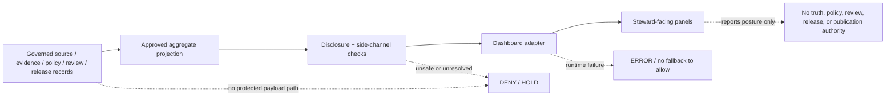

<!-- [KFM_META_BLOCK_V2]
doc_id: kfm://doc/dashboards-domain-archaeology
title: Archaeology / Cultural Heritage Dashboard Specification
type: standard
version: v1.0
status: draft; repository-grounded; sensitive-domain; placement-hold; runtime-needs-verification; non-publisher
owners:
  - "@bartytime4life — CONFIRMED GitHub review route; not domain, cultural, sovereignty, sensitivity, policy, release, or publication authority"
owner_status: "Archaeology, cultural/Tribal, rights, sensitivity, evidence, dashboard-runtime, correction, and release stewardship remain NEEDS VERIFICATION"
created: 2026-05-26
updated: 2026-08-21
policy_label: repository-facing; sensitive-domain; aggregate-only; no-protected-payload; no-release; no-publication
owning_root: docs/
responsibility: Specify a public-safe, evidence-bounded archaeology governance-health dashboard without exposing protected records or claiming that panels, telemetry, policy enforcement, release, or publication exist.
truth_posture: CONFIRMED current repository paths, source documents, fixture-only assessment contract, validator, and focused tests / PROPOSED dashboard indicators, panels, projection shape, and reviewer workflow / UNKNOWN deployed dashboard, telemetry, protected-policy evaluation, live review records, release integration, and public behavior / NEEDS VERIFICATION accountable stewards, approved measurement profiles, safe aggregation, runtime bindings, hosted exact-head checks, and qualified human review.
current_path: docs/dashboards/domain/archaeology.md
base_commit: 51d45e45a56d19961a3014009b80c2c94b1107ee
prior_blob: 0c5727e7b812b34889962e8158d4c3c51ca971df
codeowners_blob: dd2a84aa514d8ecd9208bc347f90f9a2ed37dd61
placement_status: "CONFIRMED existing path under docs/; HOLD as part of the unadmitted docs/dashboards/ direct-child lane under adopted Directory Rules v2"
runtime_status: "NEEDS VERIFICATION — specification presence and fixture tests are not running-dashboard or policy-enforcement evidence"
sensitivity_status: "Exact or reconstructive archaeology location exposure remains deny-by-default as a proposed, unassigned ADR posture; no less-restrictive profile, transform, policy binding, or release is adopted here."
related:
  - README.md
  - ../README.md
  - ../DASHBOARD_CATALOG.md
  - ../INDICATOR_CATALOG.md
  - ../governance/SENSITIVITY_RIGHTS.md
  - ../../domains/archaeology/README.md
  - ../../domains/archaeology/CULTURAL_REVIEW.md
  - ../../domains/archaeology/sensitivity-and-publication-posture.md
  - ../../adr/ADR-archaeology-exact-location-policy.md
  - ../../../contracts/governance/sensitive_location_parity_assessment.md
  - ../../../schemas/contracts/v1/governance/sensitive_location_parity_assessment.schema.json
  - ../../../tools/validators/validate_sensitive_location_parity_assessment.py
  - ../../../tests/validators/test_validate_sensitive_location_parity_assessment.py
  - ../../../data/receipts/generated/README.md
tags:
  - kfm
  - dashboards
  - archaeology
  - cultural-heritage
  - sensitivity
  - rights
  - sovereignty
  - exact-location
  - aggregate-only
  - governance-health
  - cite-or-abstain
notes:
  - "v1.0 modernizes the same-path dashboard specification against current repository evidence; it does not admit the dashboards lane or implement a running surface."
  - "The fixture-only sensitive-location parity assessment proves bounded declaration consistency only; it cannot prove policy, transform, review, access, release, or publication."
  - "No protected location, cultural record, living-person detail, private parcel relation, source payload, or protective transform parameter belongs in this document or its dashboard projection."
  - "No policy, schema, contract, runtime, app, telemetry, data-lifecycle, release, deployment, publication, or repository-setting behavior changes through this specification."
[/KFM_META_BLOCK_V2] -->

<a id="top"></a>

# Archaeology / Cultural Heritage Dashboard Specification

> **One-line purpose.** Define the smallest safe, reviewable dashboard contract for archaeology and cultural-heritage governance health while ensuring that protected content, exact or reconstructive location signals, cultural authority, policy decisions, and release authority remain upstream of the dashboard.

[](#status-and-evidence-boundary)
[](#directory-rules-and-placement)
[](#purpose-scope-and-non-effects)
[](#implementation-and-runtime-boundary)
[](#protected-information-and-anti-leakage-contract)
[](#safe-dashboard-projection-contract)
[](#authority-and-non-effects)
[](#truth-posture)

> [!IMPORTANT]
> **This file is a specification, not a dashboard implementation.** It does not prove that a query, metric, panel, telemetry stream, access-control rule, policy evaluator, review record, release, or public surface exists. A rendered panel is a downstream carrier and cannot create evidence, permission, review, release, or publication authority.

> [!CAUTION]
> **The dashboard must never receive protected payloads.** Exact geometry, reverse-engineerable spatial clues, restricted identifiers, free-text cultural content, burial or sacred-place detail, collection-security data, private-land associations, and other harmful precision must be denied, withheld, quarantined, or transformed upstream. Client-side hiding, collapsed rows, masked labels, private-looking routes, or role-gated CSS are not safety controls.

> [!WARNING]
> **Cultural and sovereignty authority is not created by KFM.** A GitHub owner, dashboard author, validator, policy stub, review badge, or generated receipt cannot stand in for the qualified authority, community, rights-holder, cultural reviewer, or release reviewer required for a particular record or operation.

**Quick navigation:** [Status](#status-and-evidence-boundary) · [Purpose](#purpose-scope-and-non-effects) · [Placement](#directory-rules-and-placement) · [Truth posture](#truth-posture) · [Authority](#authority-and-non-effects) · [Scope](#domain-scope-and-protected-boundary) · [Signals](#safe-dashboard-projection-contract) · [Indicators](#indicator-register) · [Panels](#panel-and-interaction-specification) · [States](#finite-dashboard-states) · [Anti-leakage](#protected-information-and-anti-leakage-contract) · [Runtime](#implementation-and-runtime-boundary) · [Validation](#validation-and-acceptance) · [Review](#review-and-separation-of-duties) · [Correction](#correction-withdrawal-and-rollback) · [Backlog](#open-verification-backlog) · [References](#related-repository-surfaces) · [History](#change-history)

---

## Status and evidence boundary

This revision reconciles the existing May 2026 draft with the repository state pinned below. It preserves the same document identity, path, H1, domain boundary, and specification-only role.

| Surface | Current-session evidence at `main@51d45e45a56d19961a3014009b80c2c94b1107ee` | Safe interpretation |
|---|---|---|
| This specification | Existing file at `docs/dashboards/domain/archaeology.md`; prior blob `0c5727e7b812b34889962e8158d4c3c51ca971df`. | **CONFIRMED path and prior bytes.** Content remains a review candidate, not runtime authority. |
| Dashboard lane | [`../README.md`](../README.md) describes human-facing specifications and catalogs only. It records current path presence but keeps long-term placement on **HOLD**. | Preserve the path for this update; do not infer canonical admission or migrate the lane. |
| Domain inventory | [`README.md`](README.md) catalogs thirteen top-level domain specs and an additional air sub-spec. | File presence does not prove implementation or telemetry. |
| Catalog row | [`../DASHBOARD_CATALOG.md`](../DASHBOARD_CATALOG.md) lists this file as an archaeology/cultural-heritage spec with runtime `PROPOSED`. | Catalog presence confirms discoverability only. |
| Master indicator mirror | [`../INDICATOR_CATALOG.md`](../INDICATOR_CATALOG.md) mirrors five sensitivity-and-rights indicators and states that indicators are reported, not enforced. | Indicator names and target postures remain proposed until accepted measurement contracts and runtime evidence exist. |
| Cross-domain sensitivity dashboard | [`../governance/SENSITIVITY_RIGHTS.md`](../governance/SENSITIVITY_RIGHTS.md) requires aggregate posture only and prohibits protected payload fields. | This domain spec narrows that boundary for archaeology; it does not override it. |
| Archaeology domain documentation | [`../../domains/archaeology/README.md`](../../domains/archaeology/README.md) and sibling materials exist in the repository. | Domain documentation supplies context but does not prove every path, policy, reviewer assignment, or runtime claim inside those drafts. |
| Exact-location decision candidate | [`../../adr/ADR-archaeology-exact-location-policy.md`](../../adr/ADR-archaeology-exact-location-policy.md) is proposed and unassigned. It denies exact or reconstructive public exposure by default and keeps generalized output on `HOLD` pending separately accepted controls. | Strong current safety posture; **not** an accepted policy, transform profile, access grant, or release decision. |
| Fixture-only parity packet | The semantic contract, machine schema, validator, and focused tests exist for `SensitiveLocationParityAssessmentCandidate`. | **CONFIRMED bounded declaration validation.** No live policy, transform, access, API, UI, or release effect follows. |
| Focused test matrix | Current tests define 24 synthetic cases: 10 `PASS`, 13 `DENY`, and 1 `ERROR`; passing cases contain no coordinate or geometry members. | Current executable evidence is fixture-only and authority-free. It must be displayed separately from operational measurements. |
| Review route | [CODEOWNERS](../../../.github/CODEOWNERS) routes GitHub review to `@bartytime4life`. | Review routing is not archaeology stewardship, cultural authority, policy approval, independent review, or release authority. |
| Running surface | No current panel, query, telemetry producer, access-control binding, deployed route, or emitted archaeology dashboard metric was verified in this task. | **UNKNOWN / NEEDS VERIFICATION.** Default display state is `NO_MEASURED_DATA`, not zero or green. |

### Evidence limit

The update is based on repository files and bounded GitHub metadata available in this session. No protected payload, exact location, source-system credential, private review record, deployed dashboard, runtime log, production telemetry store, policy evaluation, release packet, correction cascade, or rollback drill was inspected.

[↑ Back to top](#top)

---

## Purpose, scope, and non-effects

This file specifies how a future steward-facing archaeology dashboard may present **governance health** without becoming a second truth store or a sensitive-data side channel.

It may define:

- the indicator intent and evidence family for each safe aggregate signal;
- the distinction between fixture assurance and operational measurement;
- panel and finite-state behavior;
- safe aggregation, disclosure, and drill-through limits;
- reviewer roles that must be resolved before implementation;
- validation, correction, withdrawal, and rollback expectations;
- the current gaps that require contracts, schemas, policy, implementation, fixtures, tests, telemetry, and human review elsewhere.

It does not:

- create or redefine an archaeology object, cultural classification, review decision, sensitivity tier, source role, policy outcome, or release state;
- approve a protected-data transform or publish its parameters;
- authorize an exact, generalized, aggregated, or restricted-access location output;
- define the legal scope or applicability of NAGPRA or another external authority;
- expose, count, list, or summarize protected records unless an accepted disclosure profile permits the specific aggregate;
- activate a source, connector, policy bundle, dashboard adapter, telemetry sink, or public route;
- change the KFM lifecycle or move an artifact toward `PUBLISHED`;
- substitute a metric, test, badge, screenshot, or generated receipt for an `EvidenceBundle`, `PolicyDecision`, qualified `ReviewRecord`, release decision, correction path, or rollback target.

[↑ Back to top](#top)

---

## Directory Rules and placement

Accepted Directory Rules v2 governs placement. The target already exists under the canonical `docs/` responsibility root, which owns human explanation. The nested `docs/dashboards/` lane is tracked but is absent from the adopted canonical direct-child map, so its final disposition remains **HOLD**.

| Question | Current result |
|---|---|
| Does this human-readable specification belong under `docs/`? | **PLACE** — human explanation belongs in `docs/`. |
| Does same-path modernization admit `docs/dashboards/` as a canonical lane? | **No.** Existing path and canonical admission are separate states. |
| May this change move, rename, duplicate, or retire the lane? | **No.** Structural disposition requires separate inventory, authority, consumer closure, migration, and rollback evidence. |
| May this file define schemas, policy, telemetry, implementation, receipts, proofs, or release objects? | **DENY.** Those responsibilities remain in their owning roots. |
| May implementation read internal archaeology stores directly because this is a steward dashboard? | **DENY by default.** A steward surface still requires a governed, least-privilege interface and an approved safe projection. |
| May this document publish protective thresholds or reconstruction parameters? | **DENY.** Such parameters, where permitted at all, belong to accepted protected policy and implementation authority. |

The safe change is therefore one in-place documentation revision plus its generated authoring receipt. No parent index, catalog identity, path, contract, schema, policy, runtime, data, or release surface needs to change for this bounded slice.

[↑ Back to top](#top)

---

## Truth posture

| Label | Applies to |
|---|---|
| **CONFIRMED** | Current path and prior blob; dashboard and domain documentation paths; catalog entry; proposed exact-location ADR bytes; fixture-only contract, schema, validator, and focused test matrix; CODEOWNERS review route. |
| **PROPOSED** | Dashboard indicators, target postures, projection fields, panels, finite display states, access model, aggregation rules, reviewer workflow, and implementation sequence. |
| **UNKNOWN** | Deployed dashboard, production telemetry, live policy evaluation, protected-data authority records, actual review instances, source-currentness feeds, public consumer behavior, correction propagation, and rollback execution. |
| **NEEDS VERIFICATION** | Accountable domain/cultural/rights/sensitivity/release reviewers; accepted measurement and disclosure profiles; runtime bindings; safe query implementation; panel access controls; exact-head hosted checks; human review. |
| **HOLD** | Dashboard-lane canonical placement; any generalized or aggregate archaeology output without an accepted operation profile; any claim that the dashboard is implemented or operational. |
| **DENY** | Exact or reconstructive public exposure; direct protected-payload input; client-side hiding as control; unreviewed free-text drill-through; unsafe low-count or cross-filter reconstruction; fallback-to-allow on error. |

When evidence cannot support a stronger result, the dashboard must show `NO_MEASURED_DATA`, `HOLD`, `ABSTAIN`, `DENY`, `STALE`, `WITHDRAWN`, or `ERROR` rather than inventing zero, green, complete, or safe.

[↑ Back to top](#top)

---

## Authority and non-effects



| Concern | Owning authority | Dashboard responsibility | Dashboard non-effect |
|---|---|---|---|
| Archaeology meaning | `contracts/domains/archaeology/` and accepted domain doctrine | Display verified aggregate labels only. | Cannot invent or reinterpret archaeological facts. |
| Machine shape | Accepted schemas under `schemas/` | Consume a versioned dashboard projection when one exists. | Cannot define hidden shape in prose. |
| Rights, cultural authority, sensitivity, access | Accepted policy, authority records, and qualified review | Show safe outcome families and unresolved state. | Cannot grant permission or reveal denial-sensitive details. |
| Evidence | `EvidenceRef → EvidenceBundle` and source admission records | Report safe resolution/freshness posture. | Cannot become evidence by citing a count. |
| Validation | Validator outputs and tests in owning roots | Distinguish fixture assurance from operational results. | A passing fixture is not a live control. |
| Release/correction/rollback | `release/` and accountability records | Show safe aggregate release/correction posture when authorized. | Cannot promote, publish, withdraw, correct, or roll back. |
| Runtime and access | Governed application/runtime/infra boundaries | Enforce role and safe-projection consumption in implementation. | This Markdown does not create access control. |
| GitHub review | `.github/CODEOWNERS` and repository settings | Route review. | Routing does not prove review or domain authority. |

[↑ Back to top](#top)

---

## Domain scope and protected boundary

The dashboard concerns archaeology and cultural-heritage governance health. It may summarize the posture of candidate and released objects such as sites, surveys, contexts, features, artifacts, remote-sensing candidates, collections, chronology assertions, cultural reviews, sensitivity transforms, evidence bundles, and release records **only through a separately governed safe projection**.

### Protected information classes

The dashboard must not ingest or display:

- exact, near-exact, or reverse-engineerable site geometry;
- tiles, bounding boxes, centroids, cell identifiers, labels, screenshots, or vertex patterns that narrow a protected place;
- burial, human-remains, sacred-place, ceremonial, or community-restricted detail;
- cultural-affiliation or authority-to-control content beyond an approved aggregate status;
- collection-security locations, storage detail, or vulnerability information;
- private-land or owner/occupant associations;
- restricted source identifiers, join keys, access URLs, signed links, or provenance details that enable retrieval;
- free-text review notes, oral-history content, culturally controlled terminology, or private reviewer identities;
- small cells, sparse cross-filters, time slices, or unique combinations that permit reconstruction;
- policy internals, protected thresholds, transform seeds, buffers, grids, jitter parameters, or inference-defense recipes;
- raw error messages, logs, traces, or model output that might echo protected content.

### Safe subject of measurement

The dashboard may report a bounded status such as:

- whether a required decision or receipt family is present;
- whether a synthetic declaration passed the fixture-only validator;
- whether an approved review is current, expired, pending, denied, or unavailable;
- whether evidence resolves and is fresh enough for the requested operation;
- whether a release is current, corrected, withdrawn, or missing rollback support;
- whether a side-channel audit completed and its safe finite result;
- aggregate outcome counts only after disclosure review and only where the grouping cannot reveal protected membership.

The subject is **governance posture**, not the protected archaeology record.

[↑ Back to top](#top)

---

## Safe dashboard projection contract

A future implementation must consume a dedicated, versioned, read-only projection from a governed interface. It must not query canonical or lifecycle stores from the browser or embed protected records in a client bundle.

### Candidate projection fields

The fields below are **PROPOSED**. They are a design checklist, not a schema claim.

| Field | Purpose | Safety rule |
|---|---|---|
| `projection_version` | Bind the dashboard adapter to an explicit shape. | Required; reject unknown major versions. |
| `as_of` | State when the aggregate was computed. | UTC timestamp; no hidden “current” assumption. |
| `scope_class` | Identify the approved reporting scope. | Closed vocabulary; must not encode a protected place. |
| `measurement_mode` | Separate `FIXTURE_ASSURANCE` from `OPERATIONAL_MEASUREMENT`. | Never merge the two in one total or trend. |
| `indicator_id` | Stable safe indicator identity. | Closed registry; no record identifier. |
| `outcome` | Finite status such as `PASS`, `HOLD`, `ABSTAIN`, `DENY`, `ERROR`, `STALE`, `WITHDRAWN`, or `NO_MEASURED_DATA`. | No free-form fallback. |
| `reason_family` | Public-safe or steward-safe reason family. | Must not reveal protected existence, location, affiliation, or policy internals. |
| `numerator` / `denominator` | Optional aggregate support for a rate. | Omit unless disclosure profile permits the cell. |
| `sample_class` | `SYNTHETIC`, `FIXTURE`, or approved operational class. | Operational and synthetic samples remain visibly distinct. |
| `evidence_state` | Resolution/freshness posture for the aggregate. | No source payload or protected citation detail. |
| `review_state` | Bounded review closure state. | No private reviewer note or identity unless separately authorized. |
| `release_state` | Candidate/current/corrected/withdrawn posture. | A value is descriptive, not authorization. |
| `correction_ref` | Safe reference to a public or steward-approved correction record. | Omit if the reference itself creates inference risk. |
| `next_review_due` | Signal review aging. | Aggregate/cadence only; no private calendar detail. |

### Required projection effects

A conforming projection must assert and enforce that:

- no protected payload, geometry, source value, or free text is included;
- no public output, policy allow, review approval, release, or publication is created by projection generation;
- all counts subject to disclosure risk are suppressed or replaced with a finite withheld state;
- every field is derived from an identified record family or explicit `NO_MEASURED_DATA`;
- errors fail closed and do not reuse a stale successful value without a visible stale marker;
- the projection is cacheable only under a correction/withdrawal invalidation plan;
- the client cannot request arbitrary group-bys, joins, filters, or drill-through dimensions.

[↑ Back to top](#top)

---

## Indicator register

### Status classes

| Class | Meaning |
|---|---|
| **Repository-confirmed fixture assurance** | A current contract/validator/test packet can produce bounded synthetic outcomes. It does not measure production behavior. |
| **Specification-only operational indicator** | The repository contains prose defining the desired signal; no live producer, query, metric series, or panel was verified. |
| **Unavailable** | A required authority, projection, or measurement is not verified; show `NO_MEASURED_DATA`, `HOLD`, or `ABSTAIN`. |

### Indicators

| Indicator | Measurement definition | Evidence or record family | Current status | Safe display rule |
|---|---|---|---|---|
| Exact-location denial declaration parity | Synthetic exact-location cases declare `EXACT_DENIED`, no transform refs, target precision `NONE`, no generalized output, and all authority effects false. | `SensitiveLocationParityAssessmentCandidate`; validator/tests | **Repository-confirmed fixture assurance** | Show fixture pass/deny/error totals and test revision only; never imply live enforcement. |
| Generalized-output receipt-candidate parity | Synthetic generalized cases carry separate receipt and method-profile references and remain candidates with no transform or public output executed. | Same fixture-only packet | **Repository-confirmed fixture assurance** | Label `CANDIDATE`, never `ALLOW`, `RELEASED`, or `PUBLIC_SAFE`. |
| Sensitive-location assessment outcome distribution | Outcome counts across the current deterministic fixture matrix. | Validator fixture replay | **Repository-confirmed fixture assurance** | Keep synthetic counts in a dedicated panel; do not mix with operational traffic. |
| First-gate deny rate | Share of unauthorized sensitive operations denied by the first effective policy gate. | Bound `PolicyDecision` and request-class records | **Specification-only / runtime unknown** | Target posture may be 100%; observed value remains `NO_MEASURED_DATA` until producer and query are verified. |
| Transform-receipt coverage | Approved public-safe derivatives with the required transform/redaction receipt. | Accepted transform receipt + release records | **Specification-only / authority incomplete** | Do not count candidate refs as executed transforms or released outputs. |
| Qualified review closure | Operations requiring domain, cultural/Tribal, rights, sensitivity, or release review with current approved records. | Accepted review contracts and authenticated records | **Specification-only / reviewer authority unresolved** | Report closure state only; no private notes, protected authority identifiers, or content. |
| Review aging | Required reviews past an accepted cadence. | Review records and cadence profile | **Specification-only** | Show safe aggregate aging bands only after disclosure review. |
| Rights or authority change response | Time from a verified restriction/authority change to restriction, reassignment, correction, or withdrawal. | Source/authority records, review and correction records | **Specification-only** | Never expose the change content or affected protected record set. |
| Evidence resolution and freshness | Aggregate operations whose evidence resolves and meets the applicable freshness requirement. | Evidence resolver and source registry | **Specification-only** | Unresolved evidence yields `ABSTAIN`/`HOLD`, not a zero-filled success. |
| Protected-classification applicability review | Records routed to qualified legal/cultural review that have an explicit applicability disposition. | Qualified review record; external authority profile | **Specification-only / NEEDS VERIFICATION** | Do not infer NAGPRA or another classification from metadata; do not display record-level flags or counts without disclosure approval. |
| Side-channel and reconstruction audit | Last bounded audit outcome across labels, popups, maps, exports, screenshots, logs, search, graph, cache, and generated text. | Audit report / representation receipt | **Specification-only** | Display only safe finite result, coverage class, and age; critical findings trigger correction/withdrawal outside the dashboard. |
| Correction and withdrawal propagation | Affected safe projections, caches, maps, search, exports, and AI surfaces invalidated after a correction or withdrawal. | Correction/withdrawal records and lineage | **Specification-only** | No “current” badge until dependent invalidation is verified. |
| Rollback-target coverage | Governed released dashboard projections with a valid rollback target. | Release manifest / rollback record | **Specification-only; no release verified** | `NO_MEASURED_DATA` until a governed release exists. |

### Non-equivalence rules

- Fixture `PASS` is not policy `ALLOW`.
- A receipt reference is not proof that a transform executed.
- An executed transform is not proof that a derivative is safe or released.
- Review-route presence is not a completed review.
- A completed review is not release authority.
- A dashboard green state is not evidence sufficiency or publication.
- `0` is not interchangeable with `NO_MEASURED_DATA`, `SUPPRESSED`, `ABSTAIN`, `DENY`, `STALE`, or `ERROR`.

[↑ Back to top](#top)

---

## Panel and interaction specification

### 1. Evidence banner

Always show:

- projection version and `as_of`;
- measurement mode;
- evidence and freshness state;
- runtime/producer verification state;
- explicit non-authority statement;
- correction/withdrawal state when applicable.

### 2. Fixture-assurance panel

Display the current synthetic validation matrix separately:

- fixture profile and validator identity;
- exact `PASS` / `DENY` / `ERROR` totals;
- last verified commit or artifact digest;
- fixed statement: **“Fixture declaration proof only; no live policy, transform, access, release, or publication effect.”**

### 3. Operational posture panel

Until a real producer is verified, every operational indicator displays `NO_MEASURED_DATA`. The panel must not borrow fixture totals, hard-code a desired target as observed fact, or infer success from absence of incidents.

### 4. Review-closure panel

May display safe aggregate states such as:

- `COMPLETE`;
- `PENDING`;
- `EXPIRED`;
- `REJECTED`;
- `UNAVAILABLE`;
- `SUPPRESSED`.

No record-level drill-through, reviewer notes, protected authority names, cultural content, or affected-site counts are permitted without a separately accepted restricted-access profile.

### 5. Evidence/source panel

May display aggregate resolution, stale, conflict, and quarantine reason families only when:

- the source role is explicit;
- the aggregate does not disclose protected membership;
- unresolved or stale evidence remains visible;
- source identifiers do not provide a retrieval path to restricted data.

### 6. Correction and withdrawal panel

Must make stale, corrected, superseded, and withdrawn states more prominent than the prior healthy state. Cached panels, exports, screenshots, and downstream AI/search/map projections need an invalidation path outside this spec.

### 7. Audit panel

Shows safe audit coverage and age, not the protected finding. A critical or unresolved audit result must move the dashboard to `HOLD`, `DENY`, `WITHDRAWN`, or `ERROR` as appropriate and route details through a protected incident/review channel.

### Interaction constraints

The implementation must not provide:

- record-level tables;
- arbitrary filtering or group-by;
- map zoom-to, coordinates, geometry previews, or nearby-feature search;
- downloadable raw rows;
- unbounded date slicing;
- combined filters that create a unique cell;
- hover text or tooltips sourced from protected records;
- links to internal APIs, stores, object keys, source URLs, logs, or traces;
- copy-to-clipboard of protected fields;
- AI-generated explanations over unfiltered sensitive records.

[↑ Back to top](#top)

---

## Finite dashboard states

These states are **PROPOSED presentation vocabulary** pending an accepted machine contract.

| State | Meaning | Required behavior |
|---|---|---|
| `PASS` | A named bounded check passed for the displayed measurement mode. | State exactly what passed; no authority elevation. |
| `NO_MEASURED_DATA` | No verified operational producer or admissible sample exists. | Do not display zero, target, or inferred green. |
| `HOLD` | A checkable dependency or decision is unresolved. | Name a safe reason family and owner role; no protected detail. |
| `ABSTAIN` | Evidence or scope is insufficient for a conclusion. | Narrow the claim; preserve cite-or-abstain. |
| `DENY` | Policy/sensitivity/rights or exact-location posture blocks the operation. | Do not reveal whether a protected record exists or why in reconstructive detail. |
| `STALE` | The measurement or supporting record is outside its accepted freshness/review window. | Prevent “current” presentation and route correction. |
| `WITHDRAWN` | The supporting projection or release was withdrawn. | Stop serving prior values; invalidate caches and derivatives. |
| `ERROR` | Validator, resolver, policy, projection, access, or runtime operation failed. | Fail closed; never reuse an old allow/green state silently. |
| `SUPPRESSED` | An aggregate is withheld under disclosure control. | Do not reveal the threshold or suppressed value. |

Every panel must retain the state and `as_of` in exports and screenshots. Color alone is insufficient; state text and accessible description are required.

[↑ Back to top](#top)

---

## Protected information and anti-leakage contract

### Upstream controls required before dashboard consumption

1. **Authority and source admission** — source role, rights, access class, and authority-to-control are explicit.
2. **Evidence resolution** — consequential aggregate claims resolve to admissible evidence or abstain.
3. **Operation-specific policy** — map, API, search, export, dashboard, AI, review, and aggregate operations are evaluated separately.
4. **Approved transformation** — when a derivative is even eligible, the transform and receipt are separately governed.
5. **Disclosure and reconstruction review** — the aggregate and available dimensions are tested together, not one field at a time.
6. **Qualified review** — required domain, cultural/Tribal, rights, sensitivity, security, and release roles are recorded.
7. **Release and reversal** — any released projection has correction, withdrawal, expiry, invalidation, and rollback support.

### Dashboard-level controls

- Deny unregistered fields, filters, joins, and query parameters.
- Use closed enums and safe reason families.
- Reject direct identifiers and high-cardinality dimensions.
- Prevent client receipt of protected rows, even for hidden components.
- Use server-side authorization and least privilege; never rely on frontend state.
- Remove protected values before logging, tracing, error reporting, analytics, or model calls.
- Test screenshots, accessibility labels, URLs, browser history, caches, exports, and clipboard behavior.
- Treat `404`, empty sets, counts, latency differences, and denial reasons as possible existence side channels.
- Keep fixture assurance and operational telemetry visually and computationally separate.
- Fail closed on schema mismatch, stale policy, missing reviewer authority, resolver failure, or cache invalidation failure.

### Prohibited dashboard claims

The surface must not say:

- “all sensitive records are protected” because fixtures passed;
- “policy is enforced” without a bound evaluator and runtime evidence;
- “generalized data is safe” because receipt references exist;
- “sovereignty review is complete” without authenticated current review records;
- “NAGPRA compliant” from a metadata flag or aggregate;
- “no incidents” when telemetry is absent;
- “published” because a PR merged, a panel rendered, or a release-like field exists.

[↑ Back to top](#top)

---

## Implementation and runtime boundary

| Surface | Repository status | Dashboard consequence |
|---|---|---|
| This specification | **CONFIRMED** | Human design and review contract only. |
| Dashboard and indicator catalogs | **CONFIRMED files** | Human indexes/mirrors, not machine registries. |
| `apps/review-console/` documentation | **Repository path exists; running archaeology panel not verified here** | Candidate steward surface only. |
| `SensitiveLocationParityAssessmentCandidate` contract/schema | **CONFIRMED / inactive / fixture-only** | May support a synthetic assurance panel. |
| Sensitive-location validator/tests | **CONFIRMED implementation and focused matrix** | May be executed in CI/local validation; no runtime-policy claim. |
| Archaeology exact-location ADR candidate | **PROPOSED / unassigned** | Safety reference and HOLD boundary, not adopted policy. |
| Archaeology policy/evaluator binding | **NEEDS VERIFICATION** | Operational deny-rate panel remains unavailable. |
| Transform/generalization execution | **NEEDS VERIFICATION** | Receipt-candidate parity cannot become transform coverage. |
| Qualified review/authority records | **NEEDS VERIFICATION** | Review panel remains `NO_MEASURED_DATA` or `HOLD`. |
| Governed dashboard projection schema/API | **Not verified** | No production adapter or public/steward route may be claimed. |
| Telemetry store and query definitions | **UNKNOWN** | No operational trend, rate, SLO, or alert claim. |
| Release/correction/rollback binding | **UNKNOWN / not exercised** | No released dashboard state. |

### Smallest future implementation slice

**PROPOSED:** add one no-network, synthetic dashboard-projection candidate for the existing fixture-only parity assessment. The slice should include semantic meaning, closed schema, valid/invalid fixtures, deterministic validator/tests, a read-only adapter or static preview, and explicit false authority effects. It must not activate policy, ingest protected data, execute a transform, grant access, create an operational metric, or release a dashboard.

Any slice that requires real archaeology records, actual reviewer identities, protected policy parameters, or public geometry must remain on `HOLD` until the corresponding authority and review packet closes.

[↑ Back to top](#top)

---

## Validation and acceptance

### Source and document checks

| Check | Expected result | Current posture |
|---|---|---|
| Exact path, prior blob, base commit | Match pinned evidence | **CONFIRMED** |
| One `KFM_META_BLOCK_V2` and one H1 | Structurally valid | Required for this revision |
| Stable `top` anchor and section links | Resolve locally | Required |
| Repository-relative links | Targets exist at the pinned base | Required; external URLs intentionally absent |
| Markdown fences and tables | Balanced and structurally consistent | Required |
| Protected-content scan | No coordinate/value payload, source secret, private review note, or protective parameter | Required |
| Fixture/operational distinction | No live enforcement claim from synthetic tests | Required |
| Diff hygiene | No trailing whitespace or unrelated paths | Required |
| Generated receipt | Final authored bytes bound by SHA-256; review pending | Required for AI-authored change |

### Repository-native commands

Run from a mounted checkout:

```bash
python tools/validators/validate_sensitive_location_parity_assessment.py --fixtures

python tests/validators/test_validate_sensitive_location_parity_assessment.py -v

python tools/validators/docs/meta-block/check_meta_blocks.py \
  --repo-root . \
  --profile required \
  docs/dashboards/domain/archaeology.md

python tools/validators/validate_generated_receipt.py \
  data/receipts/generated/<receipt>.json

git diff --check
```

The first two commands validate the existing synthetic assessment packet only. They do not validate this dashboard's runtime, policy enforcement, access control, aggregation safety, review authority, release, or public behavior.

### Required negative acceptance cases for a future dashboard implementation

A future executable packet must prove that it rejects or safely suppresses:

- any coordinate, geometry, bounding box, tile, cell, address, or protected-place identifier;
- arbitrary filter, group-by, join, drill-through, export, or date-range requests;
- free text from archaeology or cultural-review records;
- low-count or unique cross-filter cells;
- policy internals and protected denial reasons;
- stale or missing reviewer authority;
- a generalized-output candidate presented as executed or released;
- fixture outcomes presented as production measurements;
- missing evidence converted to zero;
- an error or unavailable policy engine converted to allow/green;
- corrected or withdrawn values remaining in cache, export, map, search, or AI projection;
- accessibility labels, URL state, logs, traces, screenshots, or client bundles leaking protected content.

### Acceptance criteria for this documentation slice

| Criterion | Required outcome |
|---|---|
| Same-path modernization with identity preserved | `PASS` |
| Current repository evidence separated from proposal | `PASS` |
| Dashboard-lane placement remains `HOLD` | `PASS` |
| Exact/reconstructive exposure remains denied | `PASS` |
| No accepted-policy, runtime, reviewer, release, or publication overclaim | `PASS` |
| Fixture assurance separated from operational metrics | `PASS` |
| Safe projection, states, anti-leakage, correction, and rollback are explicit | `PASS` |
| Final authored bytes and receipt validate | `PASS` before PR handoff |
| Hosted exact-head workflows and human review | `NEEDS VERIFICATION` after draft PR creation |

[↑ Back to top](#top)

---

## Review and separation of duties

### Current routing

- **GitHub review route:** `@bartytime4life` — **CONFIRMED** through CODEOWNERS.
- **Archaeology domain steward:** **NEEDS VERIFICATION**.
- **Qualified cultural/Tribal authority or reviewer:** **NEEDS VERIFICATION per operation and material**.
- **Rights-holder/authority-to-control reviewer:** **NEEDS VERIFICATION**.
- **Sensitivity/disclosure reviewer:** **NEEDS VERIFICATION**.
- **Evidence/source reviewer:** **NEEDS VERIFICATION**.
- **Dashboard/runtime/security reviewer:** **NEEDS VERIFICATION**.
- **Release/correction/rollback reviewer:** **NEEDS VERIFICATION**.

### Separation rules

- The document author must not be treated as the sole approver for a sensitive-domain boundary.
- CODEOWNERS routing does not satisfy cultural, rights, sensitivity, policy, security, or release review.
- A validator author does not approve the policy it tests.
- A transform implementer does not approve the derivative's disclosure risk.
- A dashboard implementer does not approve access, review, release, or publication.
- Human review of this spec is separate from review of a future executable dashboard or protected operation.
- Merge approval is separate from release, deployment, lifecycle promotion, and KFM publication.

[↑ Back to top](#top)

---

## Correction, withdrawal, and rollback

### Dashboard correction behavior

A future dashboard must:

1. preserve the prior projection identity and `as_of`;
2. mark corrected, superseded, stale, or withdrawn values visibly;
3. invalidate dependent caches, exports, screenshots where controllable, maps, search, AI summaries, and review links;
4. prevent an old green state from surviving after upstream restriction or withdrawal;
5. record a safe correction lineage without exposing the protected subject;
6. require a complete new gate sequence before any re-release.

A restriction, correction, or withdrawal may move toward less exposure immediately under fail-safe authority. Re-expansion toward more exposure requires the full accepted evidence, rights, sensitivity, transform, review, validation, release, and rollback chain.

### Documentation rollback

Before merge, close the draft pull request and abandon the feature branch. After a separately authorized merge, use either:

- a transparent revert of the README and generated receipt together; or
- a bounded forward-correction PR preserving the prior blob, evidence basis, changed claims, and review trail.

Do not silently restore the May 2026 overclaims, delete the lane, select a new canonical path, change policy, or alter runtime behavior as part of documentation rollback.

[↑ Back to top](#top)

---

## Open verification backlog

| Priority | Item | Current status | Closure evidence |
|---|---|---|---|
| P0 | Assign accountable archaeology, cultural/Tribal, rights, sensitivity, evidence, dashboard-security, and release roles without treating CODEOWNERS as authority. | **NEEDS VERIFICATION** | Verified assignments and operation-specific review protocol. |
| P0 | Resolve the proposed/unassigned exact-location ADR and determine whether a separate accepted policy profile is required. | **HOLD** | Accepted decision with protected implementation parameters outside public docs. |
| P0 | Prove that no protected or reconstructive fields reach the dashboard projection, client, logs, traces, cache, URL, export, screenshot, or model. | **UNKNOWN** | Threat model, closed schema, negative fixtures, runtime tests, and independent sensitivity review. |
| P0 | Define safe aggregation/disclosure behavior, including suppression and cross-filter reconstruction protection. | **UNKNOWN** | Accepted protected profile and adversarial disclosure tests. |
| P1 | Define a versioned dashboard projection contract and schema with fixed false authority effects. | **PROPOSED** | Semantic contract, closed schema, fixtures, validator, tests. |
| P1 | Implement the fixture-assurance panel without mixing synthetic and operational measurements. | **PROPOSED** | No-network adapter/preview and exact UI tests. |
| P1 | Bind a real policy evaluator and operation classes before measuring first-gate denial. | **NEEDS VERIFICATION** | Accepted policy, evaluator tests, authenticated request classification, runtime evidence. |
| P1 | Define review-record authentication, expiry, revocation, and safe aggregate projection. | **CONFLICTED / NEEDS VERIFICATION** | Accepted contracts/schemas, authority registry, fixtures, tests. |
| P1 | Define correction/withdrawal invalidation across dashboard, cache, map, search, export, and AI surfaces. | **UNKNOWN** | Deterministic propagation and rollback drill. |
| P1 | Decide how NAGPRA applicability is reviewed and represented without inferring legal status or exposing protected records. | **NEEDS VERIFICATION** | Qualified legal/cultural review and accepted bounded contract. |
| P2 | Establish operational telemetry, queries, retention, access, observability, and SLOs for the steward surface. | **UNKNOWN** | Runtime implementation, least-privilege access proof, logs/metrics, runbook. |
| P2 | Reconcile dashboard lane placement under Directory Rules v2. | **HOLD** | Accepted placement decision, inventory, migration/rollback plan if needed. |
| P2 | Verify hosted exact-head checks, branch controls, and independent review for an executable dashboard packet. | **NEEDS VERIFICATION** | Exact-head runs and repository-control evidence. |

[↑ Back to top](#top)

---

## Related repository surfaces

| Surface | Relationship |
|---|---|
| [`README.md`](README.md) | Parent per-domain dashboard specification contract and inventory. |
| [`../README.md`](../README.md) | Dashboard-lane boundary, current inventory, placement hold, and non-runtime posture. |
| [`../DASHBOARD_CATALOG.md`](../DASHBOARD_CATALOG.md) | Human catalog row for this specification. |
| [`../INDICATOR_CATALOG.md`](../INDICATOR_CATALOG.md) | Human mirror of proposed governance-health indicators. |
| [`../governance/SENSITIVITY_RIGHTS.md`](../governance/SENSITIVITY_RIGHTS.md) | Cross-domain aggregate-only sensitivity/rights dashboard specification. |
| [`../../domains/archaeology/README.md`](../../domains/archaeology/README.md) | Archaeology domain documentation boundary and current sibling map. |
| [`../../domains/archaeology/CULTURAL_REVIEW.md`](../../domains/archaeology/CULTURAL_REVIEW.md) | Draft cultural-review protocol; reviewer assignments and implementation remain to be verified. |
| [`../../domains/archaeology/sensitivity-and-publication-posture.md`](../../domains/archaeology/sensitivity-and-publication-posture.md) | Draft domain sensitivity/publication lineage; current effective policy remains separate. |
| [`../../adr/ADR-archaeology-exact-location-policy.md`](../../adr/ADR-archaeology-exact-location-policy.md) | Proposed, unassigned exact/reconstructive-location deny-by-default decision candidate. |
| [`../../../contracts/governance/sensitive_location_parity_assessment.md`](../../../contracts/governance/sensitive_location_parity_assessment.md) | Inactive fixture-only semantic assessment contract. |
| [`../../../schemas/contracts/v1/governance/sensitive_location_parity_assessment.schema.json`](../../../schemas/contracts/v1/governance/sensitive_location_parity_assessment.schema.json) | Closed machine shape for the synthetic assessment. |
| [`../../../tools/validators/validate_sensitive_location_parity_assessment.py`](../../../tools/validators/validate_sensitive_location_parity_assessment.py) | Bounded deterministic validator. |
| [`../../../tests/validators/test_validate_sensitive_location_parity_assessment.py`](../../../tests/validators/test_validate_sensitive_location_parity_assessment.py) | Focused synthetic and negative proof. |
| [`../../../data/receipts/generated/README.md`](../../../data/receipts/generated/README.md) | Generated authoring provenance boundary; receipt is not approval or release. |
| [CODEOWNERS](../../../.github/CODEOWNERS) | GitHub review routing only. |

[↑ Back to top](#top)

---

## Change history

| Version | Date | Change |
|---|---|---|
| `v0.1` | 2026-05-26 | Initial Atlas-derived per-domain specification with T4/sovereignty framing and proposed indicators. |
| `v1.0` | 2026-08-21 | Same-path repository reconciliation: pins current evidence, preserves the sensitive-domain boundary, separates fixture assurance from operational measurement, defines a protected-payload-free projection and finite states, expands anti-leakage/correction/rollback controls, and records runtime, reviewer, policy, release, and placement gaps. No implementation or authority transition. |

---

<sub>Last updated · 2026-08-21 · Role · archaeology governance-health dashboard specification · Path · confirmed · Placement · hold · Runtime · needs verification · Exact/reconstructive public location · deny · Publication · none · <a href="#top">Back to top ↑</a></sub>
