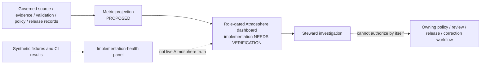

<!-- [KFM_META_BLOCK_V2]
doc_id: kfm://doc/dashboards-domain-atmosphere
title: Atmosphere / Air Dashboard Specification
type: dashboard-specification
version: v1.0
status: "draft; repository-grounded; specification-only; placement-hold; runtime-needs-verification; non-release; non-publication"
owners:
  - "@bartytime4life — CONFIRMED GitHub review route through the repository default CODEOWNERS rule"
  - "NEEDS VERIFICATION — Atmosphere, dashboard, observability, evidence, policy, release, correction, AI-surface, and independent-review stewards"
created: 2026-05-26
updated: 2026-08-21
policy_label: repository-facing
truth_posture: cite-or-abstain
owning_root: docs/
current_path: docs/dashboards/domain/atmosphere.md
responsibility: >-
  Define the human-readable, steward-facing Atmosphere dashboard specification:
  its bounded indicator model, source-role anti-collapse rules, finite display
  states, implementation boundary, validation burden, correction path, and
  current repository maturity without becoming telemetry, evidence, policy,
  release, emergency guidance, or publication authority.
placement_status: >-
  CONFIRMED existing file under the canonical docs/ root; the nested
  docs/dashboards/ lane remains HOLD under the accepted Directory Rules v2
  posture recorded by the parent dashboard README.
implementation_status: >-
  BOUNDED FIXTURE AND WORKFLOW PROOF ONLY. No running Atmosphere dashboard,
  metric computation service, telemetry store, review-console panel, public
  dashboard route, or deployed dashboard behavior is established.
evidence_snapshot:
  repository: bartytime4life/Kansas-Frontier-Matrix
  base_ref: main
  base_commit: 51d45e45a56d19961a3014009b80c2c94b1107ee
  target_prior_blob: f072fa8c629d35822940ec2eb06b02e633ea5f91
  dashboards_readme_blob: c3a0ab69cfc14cea7269cc2cdd853fbac3bb14e3
  atmosphere_domain_readme_blob: 9010f9412b152329fb96b858495d02936fed5ba3
  atmosphere_schema_readme_blob: cad321bf62d7da2a723388d5978e04fbfc694b5b
  domain_lane_register_blob: 1bfc6f91cfa713a5e3d51ece011b63b46310734f
  codeowners_blob: dd2a84aa514d8ecd9208bc347f90f9a2ed37dd61
  directory_rules_blob: fd49a0b83e55cef52c1124281f093e263526898d
  generated_receipt_schema_blob: fba21ed27ebccf1362fe397fe0c3ebd85e072685
  deleted_pm_sensor_dashboard_subspec_at_base: absent
inspection_boundary: >-
  Current-session GitHub reads covered this complete target, the parent dashboard
  boundary and catalogs, accepted Directory Rules v2 and ADR-0029, CODEOWNERS,
  the domain-lane projection, Atmosphere doctrine, contract and schema indexes,
  policy boundary, fixture and test indexes, the domain-atmosphere workflow,
  Explorer Atmosphere feature README, Review Console README, generated-receipt
  schema, exact-target open-PR overlap, branch overlap, and the absence of the
  former domain/air PM-sensor dashboard sub-spec. No mounted clone, local
  repository-native command, live source, active policy evaluator, dashboard
  query, telemetry store, API route, browser session, deployed surface, release,
  correction propagation, rollback drill, or public operation was exercised.
related:
  - ../README.md
  - README.md
  - ../DASHBOARD_CATALOG.md
  - ../INDICATOR_CATALOG.md
  - ../../domains/atmosphere/README.md
  - ../../domains/atmosphere/OBSERVED_MODELED_SEPARATION.md
  - ../../doctrine/directory-rules.md
  - ../../adr/ADR-0029-adopt-directory-governance-standard-v2.md
  - ../../../control_plane/domain_lane_register.yaml
  - ../../../contracts/domains/atmosphere/README.md
  - ../../../schemas/contracts/v1/domains/atmosphere/README.md
  - ../../../policy/domains/atmosphere/README.md
  - ../../../fixtures/domains/atmosphere/README.md
  - ../../../tests/domains/atmosphere/README.md
  - ../../../tools/validators/domains/atmosphere/README.md
  - ../../../.github/workflows/domain-atmosphere.yml
  - ../../../apps/review-console/README.md
  - ../../../apps/explorer-web/src/features/domains/atmosphere/README.md
  - ../../../data/registry/sources/atmosphere/README.md
  - ../../../release/candidates/atmosphere/README.md
tags: [kfm, dashboards, domain, atmosphere, air-quality, weather, smoke, climate, observed-versus-modeled, low-cost-sensor, evidence, policy, finite-outcomes, correction, rollback, no-life-safety-authority]
notes:
  - "v1.0 is a same-path, repository-grounded replacement of the stale v0.1 planning specification."
  - "The update removes the live link to the deleted domain/air/PM_SENSOR_CALIBRATION_REVIEW.md path and preserves that material only as historical lineage."
  - "Current executable evidence is bounded, synthetic, no-network fixture validation; it is not live Atmosphere truth, active policy, dashboard runtime, release, or publication proof."
  - "The dashboard reports posture. It cannot resolve evidence, execute policy, approve review, release data, issue an advisory, or authorize a public answer."
[/KFM_META_BLOCK_V2] -->

<a id="top"></a>

# Atmosphere / Air Dashboard Specification

> **Operating rule.** An Atmosphere dashboard may make evidence, source-role, validation, policy, release, correction, and implementation posture visible to authorized reviewers. It must not turn observations, models, proxies, advisories, workflow results, or generated summaries into a second source of truth.

<p>
  
  
  
  
  
  
</p>

> [!IMPORTANT]
> **Specification presence is not dashboard implementation.** This file, the dashboard catalogs, the Atmosphere workflow, fixtures, tests, and validators are review inputs. They do not establish a running dashboard, live telemetry, an accepted metric threshold, source admission, policy activation, release eligibility, deployment, or KFM publication.

> [!CAUTION]
> **Atmosphere is context, not emergency authority.** KFM is not an official AQI, medical, regulatory, weather-warning, emergency-alerting, or life-safety issuer. Advisory-like states must preserve the official issuing authority and direct users to that authority. A dashboard must never substitute its own status color, score, model output, or AI summary for official guidance.

> [!WARNING]
> **Preserve source-character boundaries.** AQI is not concentration. AOD is not surface PM2.5. A forecast or model field is not an observation. A low-cost sensor value is not reference-grade merely because it was corrected. A dashboard that collapses those meanings is defective even when every chart renders and every workflow is green.

> [!NOTE]
> The prior linked sub-specification at `docs/dashboards/domain/air/PM_SENSOR_CALIBRATION_REVIEW.md` is absent from the pinned base. This revision removes the broken live reference and does not restore the deleted path. Current low-cost-sensor proof remains in the Atmosphere fixture, validator, test, workflow, and provenance surfaces identified below.

## Quick navigation

[Current checkpoint](#0-current-repository-checkpoint) · [Domain scope](#1-domain-scope) · [Indicator subset](#2-indicator-subset) · [Domain-specific indicators](#3-domain-specific-indicators-proposed) · [Ownership](#4-ownership) · [Implementation](#5-implementation-pointer) · [Review cadence](#6-review-cadence) · [Open questions](#7-open-questions) · [Evidence](#8-evidence-basis--citations) · [Validation](#9-validation-and-acceptance) · [Safety](#10-security-sensitivity-and-public-safety) · [Rollback](#11-correction-rollback-and-supersession) · [History](#12-revision-history)

---

<a id="0-current-repository-checkpoint"></a>

## 0. Current repository checkpoint

The safe current conclusion is **partial, bounded, and fixture-first**.

| Surface | CONFIRMED current repository evidence | What remains unproved |
|---|---|---|
| Dashboard specification | This exact path exists and is cataloged as the Atmosphere domain dashboard specification. | Running panel, query, telemetry, access control, deployment, or public route. |
| Dashboard lane | [`docs/dashboards/`](../README.md) contains human specifications and catalogs. | Long-term nested-lane placement; parent status remains `HOLD`. |
| Domain identity | The machine projection lists `lane_id: atmosphere`, code alias `atmosphere`, sensitivity baseline `T0`, and unresolved alias `air: atmosphere`. | Accepted domain registration authority, final alias migration, or owner identity. |
| Domain doctrine | [`docs/domains/atmosphere/README.md`](../../domains/atmosphere/README.md) defines air quality, weather, smoke, AOD, climate, model, and advisory context and denies life-safety authority. | Live sources, end-to-end evidence, release, deployment, or operational effectiveness. |
| Semantic contracts | [`contracts/domains/atmosphere/`](../../../contracts/domains/atmosphere/README.md) indexes Atmosphere object meaning and anti-collapse rules. | Complete contract acceptance and consumer closure. |
| Machine schemas | [`schemas/contracts/v1/domains/atmosphere/`](../../../schemas/contracts/v1/domains/atmosphere/README.md) contains bounded `AirObservation` and `ForecastContext` profiles, mirrors, and a decision-envelope scaffold. | Full object-family coverage, active schema admission, and public API binding. |
| Fixtures and tests | Synthetic precipitation, knowledge-character, low-cost-sensor, and observed-versus-modeled profiles are indexed as executable. | Scientific validity, live observation/model accuracy, accepted policy, source admission, or release. |
| Atmosphere CI | [`.github/workflows/domain-atmosphere.yml`](../../../.github/workflows/domain-atmosphere.yml) executes bounded no-network checks and keeps broader semantics, evidence, proof, and release on hold. | That a particular branch or deployment passed; production monitoring or dashboard metrics. |
| Policy | [`policy/domains/atmosphere/`](../../../policy/domains/atmosphere/README.md) contains thirteen default-only Rego scaffolds with no accepted bundle or evaluator. | Active policy decisions, enforced obligations, production consumers, or public-safe release. |
| Review Console | [`apps/review-console/README.md`](../../../apps/review-console/README.md) defines a proposed steward app boundary. | Atmosphere dashboard panel, queries, decision recorder, telemetry integration, or deployment. |
| Air sub-spec | The prior PM-sensor dashboard sub-spec path is absent at the pinned base. | Whether a replacement spec should be authored later; the dashboard catalog's stale row remains separate drift. |

### Current truth split

- **CONFIRMED:** the specification path, current Atmosphere documentation/contract/schema/fixture/test/workflow surfaces, inactive policy boundary, `atmosphere` lane projection, and absence of the former air sub-spec.
- **PROPOSED:** the indicator and view model below, a steward-facing Atmosphere dashboard, any metric calculation, any threshold, any Review Console integration, and any conditional AI-health panel.
- **UNKNOWN:** live sources, live evidence resolution, active policy decisions, current metric values, running dashboard behavior, deployed access controls, release state, and public parity.
- **NEEDS VERIFICATION:** functional owners, metric contracts, telemetry storage, query definitions, dashboard implementation, source rights/freshness, policy activation, release/correction feeds, and hosted exact-head results for this change.

[↑ Back to top](#top)

---

<a id="1-domain-scope"></a>

## 1. Domain scope

This specification covers a **steward-facing governance and implementation-health view** for the registered Atmosphere lane. It may summarize Atmosphere records only through governed references and derived metrics. It does not host the records or decide their authority.

### 1.1 Source-character anti-collapse matrix

| Character boundary | Dashboard display rule | Fail-safe result |
|---|---|---|
| `OBSERVED_SENSOR` vs `ATMOSPHERIC_MODEL_FIELD` | Separate panels, labels, counts, and temporal fields; no combined “current value” without an accepted composition rule. | `HOLD`, `ABSTAIN`, `DENY`, or `ERROR` according to the owning contract or policy result. |
| `PUBLIC_AQI_REPORT` vs concentration | Display AQI/report context separately from measured concentration and units. | Never infer concentration from an AQI category. |
| `REMOTE_SENSING_MASK` vs ground measurement | Show proxy/mask/model provenance and limitations. | Never render AOD or a smoke mask as PM2.5 observation truth. |
| `LOW_COST_SENSOR` vs reference-grade observation | Preserve device/qualification/correction/caveat state. | Do not label regulatory/reference-grade without accepted support. |
| `CLIMATE_ANOMALY_CONTEXT` vs observation | Show baseline and reference period next to anomaly. | Abstain when baseline identity or period is unresolved. |
| `ALERT_AND_ADVISORY_CONTEXT` vs issuing authority | Show referral context and official-source identity only. | Never issue KFM life-safety instructions. |

### 1.2 Spatial, temporal, and audience boundary

A dashboard metric is meaningful only when its scope is explicit:

- **spatial:** state, county/generalized area, station network, model grid, or release footprint;
- **temporal:** observation time, model generation time, model valid time, retrieval time, processing time, release time, and correction time remain distinct where material;
- **audience:** steward/reviewer, internal operator, semi-public reviewer, or public user;
- **release:** candidate, held, unreleased, released, corrected, withdrawn, or rolled back only when an owning record defines that state.

The default design target here is **role-gated steward review**. A public Atmosphere health dashboard is not authorized by this specification.

[↑ Back to top](#top)

---

<a id="2-indicator-subset"></a>

## 2. Indicator subset

The parent [`INDICATOR_CATALOG.md`](../INDICATOR_CATALOG.md) mirrors five governance-health categories. Atmosphere primarily instances evidence/source integrity and AI-surface health, but current repository evidence also makes policy activation, correction/reconciliation, and implementation-boundary status material.

> [!IMPORTANT]
> **No production SLO or threshold is adopted here.** Numeric targets in older dashboard drafts and the indicator mirror remain proposed until a metric contract, data source, query, evaluation window, owner, and response obligation are reviewed together. An invariant such as “an `ANSWER` cannot carry an unresolved EvidenceRef” is a trust rule, not a dashboard SLO.

### 2.1 Required steward indicators

| Indicator | Domain-scale meaning | Expected signal source | Current maturity |
|---|---|---|---|
| Claim-support closure | Count claim-bearing outputs by resolved, unresolved, stale, conflicted, or out-of-scope evidence state. | Evidence resolver result, validation report, released-payload audit | **NEEDS VERIFICATION** |
| Source-character completeness | Records requiring a knowledge character have one unambiguous supported value. | Atmosphere knowledge-character validator/report | **BOUNDED FIXTURE PROOF** |
| Observed-versus-modeled separation | Count invalid substitutions, missing model lineage, identity mismatch, and unresolved-source abstentions. | `AirObservation` / `ForecastContext` validator results | **BOUNDED FIXTURE PROOF** |
| Source freshness disposition | Sources beyond declared cadence are marked stale, held, superseded, or otherwise dispositioned. | SourceDescriptor/registry and watcher records | **NEEDS VERIFICATION** |
| Low-cost-sensor qualification posture | Show caveat, correction, confidence, limitation, collocation, evaluation, transferability, and drift result families. | Low-cost-sensor validator/test results | **BOUNDED FIXTURE PROOF** |
| AirNow/AQS reconciliation posture | Count provisional, certified, replaced, pending, context-only, and held outcomes after the owning contract is accepted. | Reconciliation candidate/report validator | **BOUNDED WORKFLOW PROFILE; production feed unproved** |
| Policy activation status | Distinguish source files, accepted bundle, evaluator binding, emitted decisions, and consumer enforcement. | Policy bundle/evaluator records | **INACTIVE — thirteen default-only scaffolds** |
| Advisory redirect compliance | Advisory-like outputs retain official authority and do not issue KFM instructions. | Contract/policy/UI validation | **NEEDS VERIFICATION** |
| Release/correction/rollback closure | Released Atmosphere products name support appropriate to significance. | ReleaseManifest, CorrectionNotice, RollbackCard or accepted successors | **UNKNOWN / NOT RUN** |
| Fixture-profile execution | Report which bounded profiles ran at a pinned revision and their finite result. | `domain-atmosphere` workflow and test output | **Workflow definition confirmed; exact-head run is separate evidence** |
| Spec/runtime parity | Compare this spec with verified app/query/telemetry implementation. | Repository inventory and drift record | **NO VERIFIED RUNTIME TO COMPARE** |

### 2.2 Conditional AI-surface indicators

These indicators apply only after a governed Atmosphere answer or summary route is verified. Until then, a panel must display **NOT IMPLEMENTED / NOT APPLICABLE**, not zero.

| Indicator | Admission condition | Current state |
|---|---|---|
| AIReceipt presence | Verified consequential Atmosphere AI output exists. | **No verified Atmosphere AI route** |
| Citation or abstention | Verified answer contract and citation validator exist. | **No verified end-to-end route** |
| Synthetic-claim incidence | Auditable answer samples and source-role ground truth exist. | **No production sample established** |
| DENY / ABSTAIN reason distribution | Active policy and normalized response contracts exist. | **Policy evaluator unbound** |
| Receipt-to-release parity | Public/semi-public answer is tied to current release/correction state. | **No verified integration** |

[↑ Back to top](#top)

---

<a id="3-domain-specific-indicators-proposed"></a>

## 3. Domain-specific indicators (PROPOSED)

| Candidate projection | Proposed display | Authority boundary |
|---|---|---|
| Observation/model boundary violations | Trend exact reason codes and object families at a pinned revision. | The owning validator decides fixture acceptance. |
| Knowledge-character closure | Missing, unknown, multiple, and valid character states. | The fixture vocabulary is not automatically the canonical registry. |
| Low-cost-sensor qualification matrix | Qualification dimensions and exact-negative reason counts; no composite trust score unless separately adopted. | Metrics cannot promote a sensor or establish regulatory equivalence. |
| AirNow/AQS reconciliation state | State counts with source, time, replacement, and correction lineage visibility. | A dashboard cannot certify or replace a record. |
| Forecast lineage completeness | Model run, generated/valid time, spatial support, lineage, uncertainty, evidence, and release-state completeness. | Model skill and operational forecast quality remain unproved. |
| Climate baseline/anomaly integrity | Baseline identity, reference period, aggregation, anomaly linkage, and correction state. | The dashboard does not make trend or attribution claims. |
| Official-authority redirect coverage | Advisory-like views with issuing authority and non-KFM life-safety disclaimer after a view exists. | Not applicable until an implemented view is verified. |

### Explicitly rejected local shortcuts

- A single “Atmosphere health score” that compensates for missing evidence, inactive policy, stale sources, or absent release state.
- A green CI result presented as proof that live air quality, weather, smoke, or climate information is correct.
- A low-cost-sensor ranking generated from fixture metrics and treated as source admission.
- A forecast-confidence number inferred from AI wording rather than a verified model/verification record.
- A “zero incidents” value when the relevant route, audit sample, telemetry contract, or consumer does not exist.
- A dashboard-generated `ALLOW`, `RELEASED`, “safe,” “official,” or “current” label without the owning record.

[↑ Back to top](#top)

---

<a id="4-ownership"></a>

## 4. Ownership

[`CODEOWNERS`](../../../.github/CODEOWNERS) routes this path through the default owner `@bartytime4life`. That is a GitHub review route only. It is not evidence that the functional stewardship roles below have been assigned or that independent review occurred.

| Role | Decision burden | Current status |
|---|---|---|
| Atmosphere domain steward | Domain meaning, object families, scientific caveats, source-character boundaries. | **NEEDS VERIFICATION** |
| Source/evidence steward | Source identity, authority role, rights, cadence, EvidenceRef/EvidenceBundle support. | **NEEDS VERIFICATION** |
| Validation steward | Validator/test/profile scope, reason codes, deterministic execution, negative proof. | **NEEDS VERIFICATION** |
| Policy/sensitivity steward | Package/entrypoint, bundle, evaluator, obligations, protected detail, exact-station posture. | **NEEDS VERIFICATION** |
| Dashboard/observability steward | Metric contracts, query definitions, storage, access, rendering, stale/error behavior. | **NEEDS VERIFICATION** |
| AI-surface steward | Conditional route, receipt, citation, finite outcomes, no synthetic overclaim. | **NEEDS VERIFICATION** |
| Release/correction steward | Release, correction, withdrawal, invalidation, rollback, cache propagation. | **NEEDS VERIFICATION** |
| Independent reviewer | Separation from author/implementer for policy-significant or public-impact changes. | **NEEDS VERIFICATION** |

[↑ Back to top](#top)

---

<a id="5-implementation-pointer"></a>

## 5. Implementation pointer

- [`apps/review-console/`](../../../apps/review-console/README.md) has a **README-level proposed steward application boundary**. No Atmosphere dashboard panel, query, decision recorder, telemetry adapter, or deployment was verified.
- [`apps/explorer-web/src/features/domains/atmosphere/`](../../../apps/explorer-web/src/features/domains/atmosphere/README.md) has a **README-level public-safe feature boundary**. It is not the steward dashboard and does not prove routes, panels, adapters, tests, or runtime behavior.
- [`.github/workflows/domain-atmosphere.yml`](../../../.github/workflows/domain-atmosphere.yml) is **CI validation**, not dashboard telemetry or Atmosphere truth.
- No accepted dashboard metric schema, query catalog, telemetry store, panel configuration, or public dashboard route was established.



### Minimum implementation admission gates

1. **Metric contract:** identity, definition, scope, time window, source records, missing-data semantics, finite states, and version.
2. **Query and storage:** deterministic producer, governed store, retention, access, redaction, and replay posture.
3. **Source/evidence binding:** verified source roles, rights, cadence, evidence references, and stale/conflict behavior.
4. **Policy boundary:** accepted package/entrypoint/bundle/evaluator when policy indicators are shown.
5. **UI boundary:** role-gated route or panel, accessible states, safe errors, no raw/internal leakage, no life-safety overclaim.
6. **Correction and rollback:** metric recomputation and cache invalidation when source, release, or correction state changes.
7. **Tests:** positive, missing, stale, conflict, deny, abstain, error, unauthorized, side-channel, and rollback/correction cases.
8. **Operational evidence:** exact-head validation plus a deployed/runtime observation when deployment is claimed.

[↑ Back to top](#top)

---

<a id="6-review-cadence"></a>

## 6. Review cadence

No accepted fixed cadence was established. Use event-driven review now; quarterly review remains a **PROPOSED** maintenance target only after owners and operating responsibility are assigned.

Review is required when contracts/schemas, substantive validators, source admission or rights, policy activation, dashboard implementation, Explorer/AI integration, release/correction/rollback behavior, advisory boundaries, parent catalogs, or the `air`/`atmosphere` alias change.

Each review packet should pin the repository revision, metric/source/contract/schema/policy versions, exact fixtures and results, owner/reviewer identities, rights/sensitivity/public-use posture, implementation evidence if claimed, correction impact, rollback target, and remaining holds.

[↑ Back to top](#top)

---

<a id="7-open-questions"></a>

## 7. Open questions

| ID | Question | Current state |
|---|---|---|
| `OPEN-DASH-ATMOS-01` | What deployable owns the steward dashboard? | **UNKNOWN** |
| `OPEN-DASH-ATMOS-02` | What is the canonical metric contract and query vocabulary? | **UNKNOWN** |
| `OPEN-DASH-ATMOS-03` | Which indicators are steward-only, semi-public, or public? | **NEEDS VERIFICATION** |
| `OPEN-DASH-ATMOS-04` | Which admitted sources, rights, cadences, and consumers feed metrics? | **NEEDS VERIFICATION** |
| `OPEN-DASH-ATMOS-05` | When may policy indicators move from inactive scaffold to evaluated status? | **HOLD** |
| `OPEN-DASH-ATMOS-06` | Does a governed Atmosphere AI route exist, and what binds it? | **UNKNOWN** |
| `OPEN-DASH-ATMOS-07` | Which numeric thresholds and evaluation windows are legitimate? | **NEEDS VERIFICATION** |
| `OPEN-DASH-ATMOS-08` | How are exact station coordinates, low-count dimensions, and diagnostics protected? | **NEEDS VERIFICATION** |
| `OPEN-DASH-ATMOS-09` | Is the former PM-sensor sub-spec retired, replaced, or historical only? | **NEEDS VERIFICATION** |
| `OPEN-DASH-ATMOS-10` | How do `air` and `atmosphere` aliases converge? | **CONFLICTED** |
| `OPEN-DASH-ATMOS-11` | How do correction and rollback recompute dashboard state? | **UNKNOWN** |
| `OPEN-DASH-ATMOS-12` | Which people hold the functional roles in §4? | **NEEDS VERIFICATION** |

[↑ Back to top](#top)

---

<a id="8-evidence-basis--citations"></a>

## 8. Evidence basis & citations

| Repository evidence | Status | Supports | Does not prove |
|---|---|---|---|
| [`docs/dashboards/README.md`](../README.md) | **CONFIRMED** | Dashboard lane scope, inventory, placement hold, specification/runtime separation. | Running dashboard or admitted nested lane. |
| [`docs/dashboards/domain/README.md`](README.md) | **CONFIRMED** | Domain-spec pattern and Atmosphere relationship. | Current runtime or authority of stale source claims. |
| [`docs/dashboards/DASHBOARD_CATALOG.md`](../DASHBOARD_CATALOG.md) | **CONFIRMED but stale in one row** | Atmosphere spec is cataloged. | Runtime; former PM-sensor row needs separate repair. |
| [`docs/dashboards/INDICATOR_CATALOG.md`](../INDICATOR_CATALOG.md) | **CONFIRMED mirror** | Governance-health categories and proposed postures. | Adopted thresholds, producers, or enforcement. |
| [`control_plane/domain_lane_register.yaml`](../../../control_plane/domain_lane_register.yaml) | **CONFIRMED projection / PROPOSED authority** | `atmosphere` identity, `air` alias, T0 projection. | Accepted registration or owner. |
| [`docs/domains/atmosphere/README.md`](../../domains/atmosphere/README.md) | **CONFIRMED explanation** | Scope, object families, anti-collapse, no-life-safety posture. | Live source admission or release. |
| [`docs/domains/atmosphere/OBSERVED_MODELED_SEPARATION.md`](../../domains/atmosphere/OBSERVED_MODELED_SEPARATION.md) | **CONFIRMED document** | Observation/model distinction. | Scientific model skill or live accuracy. |
| [`contracts/domains/atmosphere/README.md`](../../../contracts/domains/atmosphere/README.md) | **CONFIRMED semantic index** | Object meaning and source-character guardrails. | Complete acceptance or runtime use. |
| [`schemas/contracts/v1/domains/atmosphere/README.md`](../../../schemas/contracts/v1/domains/atmosphere/README.md) | **CONFIRMED schema index** | Bounded profiles and mirrors. | Full shape or active API admission. |
| [`fixtures/domains/atmosphere/README.md`](../../../fixtures/domains/atmosphere/README.md) | **CONFIRMED fixture index** | Bounded synthetic profiles. | Live truth, rights, policy, or release. |
| [`tests/domains/atmosphere/README.md`](../../../tests/domains/atmosphere/README.md) | **CONFIRMED test boundary** | Named no-network tests and limits. | Exact-head pass or production correctness. |
| [`.github/workflows/domain-atmosphere.yml`](../../../.github/workflows/domain-atmosphere.yml) | **CONFIRMED workflow definition** | Bounded executable inventory and broader hold. | Current run conclusion or deployment. |
| [`policy/domains/atmosphere/README.md`](../../../policy/domains/atmosphere/README.md) | **CONFIRMED inactive boundary** | Thirteen default-only scaffolds and activation gaps. | Active policy. |
| [`apps/review-console/README.md`](../../../apps/review-console/README.md) | **CONFIRMED README** | Proposed role-gated app boundary. | Atmosphere panel or runtime. |
| [`data/registry/sources/atmosphere/README.md`](../../../data/registry/sources/atmosphere/README.md) | **CONFIRMED registry README** | Source-registry boundary. | Admitted live inventory. |
| [`release/candidates/atmosphere/README.md`](../../../release/candidates/atmosphere/README.md) | **CONFIRMED candidate README** | Candidate/release boundary. | Released Atmosphere output. |

### Evidence exclusions

This revision does not claim current air quality, weather, smoke, climate, or forecast conditions; live or licensed sources; scientific validity from synthetic fixtures; active Rego policy; a dashboard/query/store/panel/route; release, correction propagation, rollback, deployment, or public operation; or resolution of the dashboard catalog's separate stale-row drift.

[↑ Back to top](#top)

---

<a id="9-validation-and-acceptance"></a>

## 9. Validation and acceptance

### Documentation validation

The authored bytes must have one parseable KFM metadata block, one H1, stable legacy anchors, balanced fences/Mermaid source, resolving repository-relative links, UTF-8/LF, a final newline, no tabs/trailing whitespace, no protected payloads or hidden reasoning, generated-receipt path/hash parity, and a diff limited to this specification plus provenance.

### Current bounded Atmosphere proof commands

The repository workflow defines no-network commands including:

```bash
PYTHONDONTWRITEBYTECODE=1 KFM_NO_NETWORK=1 \
  python tests/domains/atmosphere/test_atmosphere_smoke.py --verbose

PYTHONDONTWRITEBYTECODE=1 KFM_NO_NETWORK=1 \
  python tests/domains/atmosphere/test_low_cost_sensor_caveat_required.py --verbose

PYTHONDONTWRITEBYTECODE=1 PYTHONHASHSEED=0 KFM_NO_NETWORK=1 \
  python tests/domains/atmosphere/test_observed_modeled_separation.py --verbose
```

Those commands prove only their bounded synthetic profiles. This connector-first authoring environment did not execute them. Hosted exact-head workflows remain separate evidence.

### Minimum future dashboard negative proof

A running implementation must fail closed or show an explicit non-answer when a metric contract or scope is unknown; evidence is unresolved/stale; source character is ambiguous; model output is shown as observation; AQI as concentration; AOD as PM2.5; low-cost caveats are missing; policy is inactive or errors; advisory authority/redirect is missing; release/correction/rollback is unresolved; viewer role is insufficient; protected dimensions or diagnostics would leak; or a metric producer/query/store fails.

### What a green dashboard does not prove

A green panel, test, workflow, badge, or chart does not by itself prove source authority, scientific validity, evidence closure, policy permission, review approval, release, official guidance, deployment safety, or publication.

[↑ Back to top](#top)

---

<a id="10-security-sensitivity-and-public-safety"></a>

## 10. Security, sensitivity, and public safety

An Atmosphere dashboard can leak protected or misleading information through dimensions, drill-downs, labels, tooltips, exports, screenshots, or error text even when an aggregate looks harmless.

Required posture:

- no credentials, signed URLs, private endpoints, raw payloads, internal paths, or protected logs;
- no exact station coordinates without accepted public-safe release and policy support;
- no low-count dimension that reidentifies protected sites, operators, reviewers, or sources;
- no raw policy reason, private diagnostic, hidden model reasoning, prompt, or provider trace;
- no medical, AQI, regulatory, emergency, burn-authorization, or life-safety instruction;
- no silent conversion among AQI, concentration, AOD, modeled fields, observations, climate context, and advisories;
- no client-side hiding as a substitute for upstream access control and safe transformation;
- no public export without citation, caveat, release, correction, and rollback context appropriate to the output.

[↑ Back to top](#top)

---

<a id="11-correction-rollback-and-supersession"></a>

## 11. Correction, rollback, and supersession

### This documentation change

Before merge, rollback is to close the draft pull request and abandon the branch. After merge, rollback is a transparent revert of the implementation commit. Reverting restores the prior v0.1 specification and removes the paired authoring receipt; it does not change Atmosphere contracts, schemas, fixtures, tests, workflow, policy, data, release, runtime, or public state.

### Future dashboard behavior

A running dashboard must pin the metric/query/producer version and source revision, retain prior computed state or a reproducible replay target, recompute affected metrics when evidence/policy/release/correction state changes, invalidate caches/exports/dependent AI/UI projections, show corrected/withdrawn/stale/rolled-back status from owning records, preserve audit history without displaying superseded values as current, and never mutate canonical records or release state.

A later specification may supersede this file only through a reviewed, linked transition that preserves inbound navigation and records whether this path remains canonical, compatibility-only, or retired. The deleted PM-sensor sub-spec is not restored by implication.

[↑ Back to top](#top)

---

<a id="12-revision-history"></a>

## 12. Revision history

| Version | Date | Status | Material change |
|---|---|---|---|
| `v0.1` | 2026-05-26 | draft | Initial Atlas-derived Atmosphere/Air planning specification with proposed indicators and an air/PM-sensor sub-spec link. |
| `v1.0` | 2026-08-21 | draft | Same-path repository-grounded rewrite: pins current evidence, separates fixture proof from dashboard runtime, records inactive policy and unverified apps, removes the broken deleted sub-spec link, strengthens source-character and life-safety boundaries, defines bounded indicators/admission gates, and preserves legacy anchors. |

> [!NOTE]
> `v1.0` is a documentation maturity revision only. It does not admit the dashboard lane, activate sources or policy, implement telemetry or UI, authorize an Atmosphere answer, release data, deploy a dashboard, or publish KFM knowledge.

[↑ Back to top](#top)

---

<sub>
Atmosphere dashboard specification only. The domain lane owns Atmosphere meaning; contracts own semantics; schemas own shape; policy owns admissibility; tests and validators prove bounded behavior; release objects own publication/correction/rollback; apps and observability tooling own runtime presentation. This file owns none of those authorities.
</sub>
