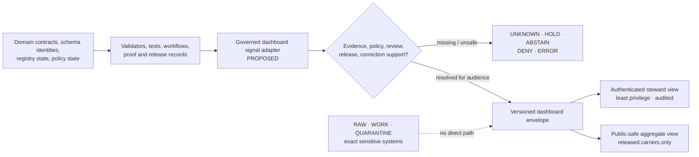

<!-- [KFM_META_BLOCK_V2]
doc_id: kfm://doc/dashboards-domain-flora
title: Flora Dashboard Specification
type: standard
version: v0.2
status: draft; repository-grounded; bounded synthetic validation; policy inactive; proof and release held; dashboard runtime unestablished
owners: OWNER_TBD  # NEEDS VERIFICATION: Flora steward + sensitivity/geoprivacy reviewer + evidence/source steward + UI steward
created: 2026-05-26
updated: 2026-08-21
policy_label: public
related:
  - ./README.md
  - ../DASHBOARD_CATALOG.md
  - ../../domains/flora/README.md
  - ../../domains/flora/ARCHITECTURE.md
  - ../../../contracts/domains/flora/flora_occurrence.md
  - ../../../schemas/contracts/v1/domains/flora/flora_occurrence.schema.json
  - ../../../fixtures/domains/flora/README.md
  - ../../../tools/validators/domains/flora/README.md
  - ../../../tests/domains/flora/README.md
  - ../../../policy/domains/flora/README.md
  - ../../../policy/sensitivity/flora/README.md
  - ../../../data/registry/sources/flora/README.md
  - ../../../data/proofs/flora/README.md
  - ../../../release/candidates/flora/README.md
  - ../../../.github/workflows/domain-flora.yml
tags: [kfm, dashboards, domain, flora, plants, evidence, sensitivity, geoprivacy, fail-closed, specification]
notes:
  - This is a dashboard specification, not a running dashboard, botanical authority, sensitivity decision, release record, or publication surface.
  - Current repository evidence confirms one bounded, deterministic, no-network, synthetic public-safe fixture profile; it does not prove a live source, real Flora occurrence, active policy, proof producer, release candidate, or dashboard route.
  - Exact or reverse-engineerable rare, protected, culturally sensitive, steward-controlled, or private-land Flora locations remain fail-closed. A proposed T0-T4 label never overrides that invariant or creates policy authority.
[/KFM_META_BLOCK_V2] -->

<!-- [doc: kfm://doc/dashboards-domain-flora] -->
<a id="top"></a>

# Flora Dashboard Specification

> A repository-grounded specification for reporting Flora evidence, source-role, taxonomy, sensitivity, validation, correction, and release posture without becoming botanical truth, policy, surveillance, release, or publication authority.

> [!IMPORTANT]
> **Truth posture:** this file and the repository surfaces linked below are `CONFIRMED` at the pinned repository snapshot. A complete dashboard route, telemetry binding, accepted threshold set, named stewardship assignments, live source admission, active Flora policy evaluator, proof producer, release candidate, and public runtime behavior remain `PROPOSED`, `UNKNOWN`, or `NEEDS VERIFICATION` as labeled.

> [!CAUTION]
> **Sensitive Flora fails closed.** Exact or reverse-engineerable rare, protected, culturally sensitive, steward-controlled, private-land, or collection-risk locations must not appear in ordinary dashboard metrics, labels, map features, exports, logs, generated summaries, or denial details. Public-safe representation requires independently governed evidence, rights, sensitivity, review, transformation, release, correction, and rollback support.

> [!WARNING]
> A green test, zero-count panel, schema path, placeholder source record, policy file, workflow, receipt, pull request, or map does not establish botanical truth, source activation, rights clearance, geoprivacy, review approval, release, or publication.

## Contents

1. [Domain scope](#1-domain-scope)
2. [Indicator subset](#2-indicator-subset)
3. [Domain-specific indicators](#3-domain-specific-indicators-proposed)
4. [Ownership](#4-ownership)
5. [Implementation pointer](#5-implementation-pointer)
6. [Review cadence](#6-review-cadence)
7. [Open questions](#7-open-questions)
8. [Evidence basis and citations](#8-evidence-basis--citations)
9. [Finite outcomes and display states](#9-finite-outcomes-and-display-states)
10. [Sensitive-metric and anti-inference controls](#10-sensitive-metric-and-anti-inference-controls)
11. [Signal flow and implementation contract](#11-signal-flow-and-implementation-contract)
12. [Validation](#12-validation)
13. [Correction, withdrawal, and rollback](#13-correction-withdrawal-and-rollback)
14. [Appendix](#14-appendix)

---

## Status and evidence boundary

| Surface | Current repository-grounded state | Safe dashboard interpretation |
|---|---|---|
| This specification | Existing tracked file; prior blob `79b3c8134494b394cbaa52e26f33adf98b8ba6a4`. | Same-path documentation modernization; no runtime or authority effect. |
| Flora domain documentation | Extensive draft Flora orientation, architecture, source, sensitivity, lifecycle, UI, API, correction, and rollback documentation exists. | Explanatory evidence; not proof that every described object, source, route, policy, or release is implemented. |
| Flora semantic contracts | Flora occurrence and related object-family contracts exist as drafts. | Meaning is documented; acceptance and complete machine enforcement remain unverified. |
| Flora schemas | Flora schema files exist, but representative files such as `flora_occurrence.schema.json` remain permissive `PROPOSED` scaffolds. | Path presence is not field-complete validation or active schema status. |
| Public-safe fixture validator | One deterministic standard-library validator, one synthetic positive fixture, six negative fixtures with exact error sidecars, focused tests, and `domain-flora / validate-flora` CI are established. | `CONFIRMED` bounded conformance only; no real occurrence, source, policy, proof, release, or public-safety claim. |
| Source registry | The subtype-first Flora source lane contains an expanded README plus a placeholder `usda_plants.yaml`; parallel registry topology remains unresolved. | No admitted or activated live Flora source is established by this lane. |
| Connectors | `connectors/flora/` is a README-only compatibility index; Flora-relevant source-first connector lanes elsewhere have mixed draft/scaffold status. | No Flora connector activation, source currentness, rights clearance, or production ingestion is established. |
| Flora domain policy | The current domain-policy lane is an inactive M0 scaffold with an unbound evaluator and no accepted Flora policy bundle. | Missing or ambiguous policy is a hold/deny condition, never implicit permission. |
| Flora sensitivity policy | The current Flora sensitivity README is a proposed scaffold. | Exact-location controls are doctrinal authoring constraints, not proved runtime enforcement. |
| Flora proof support | Proof, EvidenceBundle, and citation-validation support lanes are documented; no accepted Flora proof producer or populated release-bound proof packet is established. | Proof closure remains held. |
| Flora release candidate | The candidate lane has no verified child candidate dossier, approved manifest, or published Flora release. | Release and publication remain held. |
| Dashboard/API/UI/telemetry | No Flora-specific dashboard route, panel, telemetry producer, governed API response, or public map integration was verified in the bounded inspection. | Runtime remains `UNKNOWN`; do not infer permanent absence outside inspected repository evidence. |

### Directory Rules basis

Accepted [ADR-0029](../../adr/ADR-0029-adopt-directory-governance-standard-v2.md) adopts [Directory Rules v2](../../doctrine/directory-rules.md) as the single writable human placement authority. This update keeps an existing tracked human dashboard specification at the same path and updates its direct catalog dependency. It does not use the still-proposed dashboard documentation lane as authority for a move, new root, contract, schema, policy, runtime, or release object.

[Back to top](#top)

---

## 1. Domain scope

This specification describes a read-only governance-health view for Flora. It may summarize bounded evidence and validation state for plant taxonomy, occurrences, specimens, rare-plant records, vegetation communities, invasive plants, phenology, range and distribution products, botanical surveys, restoration plantings, and Flora-side habitat associations.

It does not own botanical meaning, exact geometry, source admission, rights, sensitivity, policy, evidence, proof, release, or publication.

| Concern | Owning surface | Dashboard relationship |
|---|---|---|
| Flora scope, object families, source roles, sensitivity, and public posture | [Flora domain README](../../domains/flora/README.md) and [architecture](../../domains/flora/ARCHITECTURE.md) | Read and summarize; do not redefine. |
| Semantic object meaning | [`contracts/domains/flora/`](../../../contracts/domains/flora/README.md) | Link exact contract identities represented by a signal. |
| Machine shape | [`schemas/contracts/v1/domains/flora/`](../../../schemas/contracts/v1/domains/flora/README.md) | Report schema maturity and validation results; never infer active enforcement from path presence. |
| Source identity and admission | [`data/registry/sources/flora/`](../../../data/registry/sources/flora/README.md) | Display reviewed registry state; do not activate a source or treat a placeholder as admitted. |
| Admissibility and sensitivity | [Flora domain policy](../../../policy/domains/flora/README.md) and [sensitivity policy](../../../policy/sensitivity/flora/README.md) | Display finite outcomes and inactive/held state; do not decide policy in the dashboard. |
| Executable conformance | [fixtures](../../../fixtures/domains/flora/README.md), [validator](../../../tools/validators/domains/flora/README.md), [tests](../../../tests/domains/flora/README.md), and [workflow](../../../.github/workflows/domain-flora.yml) | Report the exact bounded profile, revision, and result. |
| Evidence and proof | [`data/proofs/flora/`](../../../data/proofs/flora/README.md) | Display proof closure only when a governed packet exists; current producer remains held. |
| Release, correction, and rollback | [Flora candidate lane](../../../release/candidates/flora/README.md) and shared `release/` controls | Display governing records; never convert a candidate, test, or receipt into release. |
| Public UI and map delivery | Governed APIs and released public-safe carriers | Render only policy-filtered envelopes; never read canonical/internal stores directly. |

### Source-role and claim-strength boundary

A Flora dashboard must keep these meanings separate:

- specimen-backed occurrence;
- direct observation;
- community-science candidate;
- survey-derived record;
- administrative or regulatory status;
- aggregate range or checklist context;
- modeled distribution surface;
- synthetic fixture or generated interpretation.

A specimen is not necessarily current presence. A checklist is not an occurrence. A modeled surface is not an observation. A fixture is not a plant claim. A public derivative is not the canonical exact record.

The lifecycle shorthand remains `RAW -> WORK / QUARANTINE -> PROCESSED -> CATALOG / TRIPLET -> PUBLISHED`. A dashboard, validator pass, badge, screenshot, commit, pull request, merge, or generated receipt does not perform promotion.

[Back to top](#top)

---

## 2. Indicator subset

Numeric service objectives and alert thresholds are not established by this document. Until a threshold, aggregation rule, denominator, time window, and owner are accepted, the dashboard should expose the measured value and its support state without inventing a healthy/unhealthy cutoff.

| Indicator family | Required presentation | Current evidence | Dashboard status |
|---|---|---|---|
| Bounded fixture conformance | Show exact fixture-profile identity, validator revision, test result, and the explicit synthetic/no-network boundary. | One public-safe synthetic fixture profile, validator, focused tests, and workflow are established. | Signal source `CONFIRMED`; dashboard binding `PROPOSED`. |
| Stable validator findings | Summarize findings by stable code and affected contract path without exposing candidate values or sensitive detail. | Validator emits stable code/path findings and avoids candidate-value echo. | `CONFIRMED` bounded behavior; telemetry route `UNKNOWN`. |
| Shape and contract maturity | Distinguish path presence, permissive scaffold, draft field shape, and active accepted schema/contract status. | Flora contracts and schema files exist; representative occurrence schema remains permissive. | Metric definition `PROPOSED`; active coverage `NEEDS VERIFICATION`. |
| Source admission closure | Separate placeholder, candidate, admitted, restricted, stale, withdrawn, and denied sources; preserve source role and originating publisher. | Flora registry documentation plus one placeholder record are present; connector activation is unproved. | Current admitted-source count `UNKNOWN`. |
| Taxonomy and source-role integrity | Show unresolved taxon crosswalk, source-role collapse, specimen/occurrence confusion, and model/observation confusion as explicit findings. | Synthetic negative fixtures cover role/taxonomy collapse; broader taxonomy enforcement remains proposed. | Bounded negative proof `CONFIRMED`; domain-wide state `UNKNOWN`. |
| Rights and sensitivity posture | Show whether rights, sensitivity, geoprivacy, review, and representation support resolve, remain held, or deny use. | Domain policy is inactive; sensitivity policy is a scaffold; doctrine requires fail-closed handling. | Runtime enforcement `NOT ESTABLISHED`; missing state must not appear green. |
| Evidence and proof closure | Show whether consequential claims resolve to EvidenceBundle/citation support and whether a Flora-specific proof packet exists. | Shared EvidenceBundle surfaces and Flora proof-support docs exist; Flora proof producer remains held. | Proof closure `HOLD` / `NEEDS VERIFICATION`. |
| Redaction and public-safe representation | Show whether a public derivative has a governed transform receipt, review, residual-risk posture, release linkage, and rollback target. | Synthetic fixture requires fixture-only redaction/review references; no real transform execution is established. | Operational coverage `UNKNOWN`; never infer from fixture pass. |
| Release candidate posture | Preserve no-candidate, assembling, blocked, review, approved-for-manifest, promoted, stale, superseded, and withdrawn states without collapsing them. | Current candidate lane reports no verified child dossier and no release dry-run command. | Current release posture `HOLD`. |
| Correction and rollback | Show correction, withdrawal, invalidation, supersession, and rollback readiness for every released surface. | Flora runbooks/docs exist; no released Flora artifact or completed rollback drill was verified. | Runtime and drill state `UNKNOWN`. |
| Dashboard/API/UI integration | Show exact route, envelope, telemetry producer, access control, and consumer version when implemented. | No Flora-specific route, panel, telemetry producer, or governed response was verified. | `UNKNOWN`; do not display synthetic zeros. |

> [!NOTE]
> A missing signal is not zero. An inactive policy is not a successful policy evaluation. An empty candidate lane is not proof of release safety. A held workflow is not a proof pack or release dry run.

[Back to top](#top)

---

## 3. Domain-specific indicators (PROPOSED)

These are candidate review views. They are not adopted thresholds, running panels, or authority to collect additional sensitive telemetry.

| Candidate indicator | Question answered | Minimum support and fail-closed behavior |
|---|---|---|
| Voucher-support posture | For claims that require voucher context, what proportion is specimen-backed, survey-backed, photo-only, aggregate, modeled, or unresolved? | Exact denominator and taxon classes require steward decision; unresolved support remains `ABSTAIN`/`HOLD`. |
| Taxonomic disposition | How many candidate records are accepted, synonym-mapped, unresolved, conflicted, stale, or superseded under the represented taxonomy version? | Contract/schema identity and review record required; mixed or missing authority remains visible. |
| Public-representation closure | Do proposed public Flora derivatives have evidence, rights, sensitivity, review, transform, release, correction, and rollback support? | Any missing dependency yields `HOLD`, `DENY`, `ABSTAIN`, or `ERROR`; no partial-green state. |
| Exact-location denial coverage | Does every exact or reverse-engineerable sensitive representation fail closed before public delivery? | Requires active policy/evaluator and negative tests; current runtime coverage is `UNKNOWN`. |
| Join-induced sensitivity disposition | Have Flora joins with Habitat, Soil, Hydrology, Agriculture, Hazards, Fauna, land, or infrastructure been reassessed for the resulting product? | Most-restrictive applicable posture controls; unregistered or unsupported joins remain held. |
| Source and rights currentness | Are source terms, attribution, redistribution, cadence, source role, and access conditions current and review-bound? | Placeholder or undocumented source state must not count as admitted or healthy. |
| Correction propagation | When taxonomy, source, rights, sensitivity, or occurrence support changes, which public carriers, caches, indexes, maps, exports, and generated summaries are invalidated? | No release means not applicable; a release without a tested cascade is held. |
| Defensive access-pattern review | Is an authorized security surface detecting repeated attempts to infer restricted localities without exposing taxon/location/query details in dashboard output? | Separate security/privacy decision, least-privilege access, aggregation/suppression, audit controls, and incident process required. Not implemented by this spec. |

[Back to top](#top)

---

## 4. Ownership

No current repository evidence inspected for this update establishes named Flora, dashboard, sensitivity, evidence, source, UI, security, or release stewards for this path.

[`.github/CODEOWNERS`](../../../.github/CODEOWNERS) routes repository review requests to `@bartytime4life`, including the default pattern and explicit Flora-domain documentation path. That is routing only; it is not an accepted stewardship assignment, independent sensitivity review, rights-holder approval, policy decision, release approval, or publication authority.

| Responsibility | Required decision | Current state |
|---|---|---|
| Flora steward | Owns domain meaning, taxonomic interpretation, and Flora-side relation semantics. | `OWNER_TBD` / `NEEDS VERIFICATION` |
| Sensitivity/geoprivacy reviewer | Owns exact-location, rare/protected/culturally sensitive, private-land, harmful-precision, and anti-inference review. | Role required; identity `UNKNOWN` |
| Source/rights steward | Owns source admission, originating publisher, terms, attribution, cadence, and rights-change review. | Role required; identity `UNKNOWN` |
| Evidence/validation steward | Owns signal binding to exact contract, schema, fixture, validator, test, proof, correction, and receipt identities. | `OWNER_TBD` / `NEEDS VERIFICATION` |
| UI/dashboard steward | Owns the implemented route, envelope, accessibility, role separation, safe aggregation, and operational maintenance. | `OWNER_TBD` / `NEEDS VERIFICATION` |
| Security/privacy reviewer | Owns defensive access-pattern telemetry, abuse controls, audit retention, and non-disclosure of restricted detail. | Required if such telemetry is proposed; identity `UNKNOWN` |
| Release/correction steward | Owns release decisions, withdrawal, correction propagation, and rollback evidence. | Role required for released surfaces; identity `UNKNOWN` |

Documentation authorship and a generated authoring receipt do not satisfy these roles.

[Back to top](#top)

---

## 5. Implementation pointer

Current repository bytes support a bounded validator slice and extensive draft documentation, not a single running Flora dashboard claim.

| Surface | Repository evidence | Status and limit |
|---|---|---|
| Flora dashboard specification | [`flora.md`](./flora.md) | `CONFIRMED` document; implementation authority absent. |
| Domain orientation | [Flora README](../../domains/flora/README.md) and [architecture](../../domains/flora/ARCHITECTURE.md) | `CONFIRMED` draft documentation; several implementation and source claims remain proposed or stale. |
| Flora occurrence meaning | [semantic contract](../../../contracts/domains/flora/flora_occurrence.md) | Substantive draft contract; not release or public-use authority. |
| Flora occurrence shape | [schema](../../../schemas/contracts/v1/domains/flora/flora_occurrence.schema.json) | `CONFIRMED` path and permissive `PROPOSED` scaffold; no field-level enforcement. |
| Synthetic public-safe fixture profile | [fixtures](../../../fixtures/domains/flora/README.md), [validator](../../../tools/validators/domains/flora/README.md), and [tests](../../../tests/domains/flora/README.md) | `CONFIRMED` deterministic no-network profile over synthetic data only. |
| Flora workflow | [`domain-flora.yml`](../../../.github/workflows/domain-flora.yml) | `validate-flora` executes the bounded suite; proof and release jobs are explicit readiness holds. |
| Source registry | [Flora source registry](../../../data/registry/sources/flora/README.md) and [`usda_plants.yaml`](../../../data/registry/sources/flora/usda_plants.yaml) | Registry documentation plus placeholder only; no admitted source established; parallel topology remains unresolved. |
| Connector boundary | [Flora connector compatibility index](../../../connectors/flora/README.md) | README-only compatibility path; source-first lanes have mixed maturity and no activation implied. |
| Domain policy | [Flora policy](../../../policy/domains/flora/README.md) | Repository-grounded M0 scaffold; evaluator unbound and inactive. |
| Sensitivity policy | [Flora sensitivity policy](../../../policy/sensitivity/flora/README.md) | Proposed scaffold only. |
| Proof support | [Flora proof lane](../../../data/proofs/flora/README.md) | Documentation and shared evidence surfaces exist; no accepted Flora proof producer or populated release-bound packet. |
| Release candidates | [Flora candidate lane](../../../release/candidates/flora/README.md) | No verified child dossier, approved manifest, release dry-run command, or published Flora release. |
| Dashboard route and telemetry | No Flora-specific dashboard route, panel, telemetry producer, or governed API response was verified in the bounded repository inspection. | `UNKNOWN`; external or differently named systems were not inspected. |

### Current bounded result

```text
synthetic fixture profile -> deterministic validator -> focused tests -> read-only CI

proof producer     = HOLD
policy evaluator   = INACTIVE / UNBOUND
sensitivity policy = SCAFFOLD
source activation  = NOT ESTABLISHED
release candidate  = NOT ESTABLISHED
dashboard runtime  = UNKNOWN
publication        = NONE ESTABLISHED
```

[Back to top](#top)

---

## 6. Review cadence

Review is event-driven until accountable stewards adopt a periodic cadence.

| Trigger | Required review |
|---|---|
| Flora contract, schema, fixture, validator, test, workflow, or finding-code change | Reconcile affected indicators and exact profile identity. |
| Source registry or connector change | Reverify source identity, role, publisher, terms, rights, cadence, sensitivity, and activation state. |
| Policy or sensitivity profile/evaluator change | Reverify finite outcomes, obligations, negative tests, consumer enforcement, expiry, correction, and rollback. |
| Dashboard route, envelope, panel, telemetry, access-control, map, export, or governed-AI integration | Replace `UNKNOWN`/`PROPOSED` claims with exact code, tests, runtime evidence, and public-safe aggregation rules. |
| Taxonomic authority, conservation status, source obscuration, rights, embargo, or steward posture change | Reassess displayed state, stale-state handling, derivatives, and public exposure. |
| Correction, withdrawal, supersession, or rollback | Verify propagation to every released map, API, export, search index, cache, Evidence Drawer, and generated summary. |
| Sensitive-metric or defensive-access analytics proposal | Require Flora, sensitivity, privacy/security, policy, and legal/rights review before collection or display. |
| Dashboard catalog change | Recompute file presence from a pinned tree and repair direct references. |

[Back to top](#top)

---

## 7. Open questions

- [ ] **OPEN-DASH-FLORA-01** — Identify accountable Flora, sensitivity/geoprivacy, source/rights, evidence, UI, security/privacy, and release/correction stewards.
- [ ] **OPEN-DASH-FLORA-02** — Decide which governed application and route will own the operational review surface; do not create parallel Explorer and Review Console authorities.
- [ ] **OPEN-DASH-FLORA-03** — Define a versioned dashboard signal/envelope contract, telemetry producer, access roles, retention, and exact consumer tests.
- [ ] **OPEN-DASH-FLORA-04** — Ratify the sensitivity and audience vocabulary, including any T0-T4 mapping, without treating a proposed tier label as active policy.
- [ ] **OPEN-DASH-FLORA-05** — Graduate Flora schemas from permissive scaffolds through paired contracts, fixtures, validators, registry entries, policy tests, and review.
- [ ] **OPEN-DASH-FLORA-06** — Reconcile source-registry topology and replace placeholder source records with governed admission records before reporting source coverage.
- [ ] **OPEN-DASH-FLORA-07** — Establish and bind an accepted Flora domain and sensitivity policy evaluator before reporting enforcement or fail-closed rates.
- [ ] **OPEN-DASH-FLORA-08** — Define public-safe metric aggregation, minimum-group suppression, temporal/spatial generalization, small-cell handling, and anti-inference tests without publishing reverse-engineerable parameters.
- [ ] **OPEN-DASH-FLORA-09** — Decide whether defensive access-pattern analytics are necessary and lawful, and place them under the correct security/observability authority rather than this domain spec.
- [ ] **OPEN-DASH-FLORA-10** — Establish Flora-specific EvidenceBundle/proof production, release-candidate validation, correction propagation, withdrawal, and rollback drills.
- [ ] **OPEN-DASH-FLORA-11** — Reconcile Flora dashboard indicators with the unregistered vegetation-stress cross-domain profile without converting association or model output into observed Flora truth.
- [ ] **OPEN-DASH-FLORA-12** — Reconcile the proposed `docs/dashboards/` lane with accepted Directory Rules before any structural migration.

[Back to top](#top)

---

<a id="8-evidence-basis--citations"></a>

## 8. Evidence basis & citations

| Evidence | What it supports | Limit |
|---|---|---|
| [Per-domain dashboard README](./README.md) | Existing dashboard-spec pattern and the proposed status of the documentation lane. | Not indicator, policy, runtime, or release authority. |
| [Dashboard catalog](../DASHBOARD_CATALOG.md) | Direct inventory relationship for this file. | Catalog presence does not prove a running dashboard. |
| [Flora domain README](../../domains/flora/README.md) and [architecture](../../domains/flora/ARCHITECTURE.md) | Scope, object families, source-role, sensitivity, lifecycle, public-surface, and correction boundaries. | Draft documents contain proposal-era implementation assumptions that require current repository reconciliation. |
| [Accepted ADR-0029](../../adr/ADR-0029-adopt-directory-governance-standard-v2.md) and [Directory Rules](../../doctrine/directory-rules.md) | Current human placement authority and responsibility-root separation. | Same-path edits do not canonicalize the proposed dashboard lane. |
| [Flora occurrence contract](../../../contracts/domains/flora/flora_occurrence.md) and [schema](../../../schemas/contracts/v1/domains/flora/flora_occurrence.schema.json) | Current semantic depth and representative permissive schema posture. | Contract/schema presence does not establish validation, policy, proof, or release. |
| [Flora fixture, validator, and test READMEs](../../../tools/validators/domains/flora/README.md) | Exact bounded synthetic public-safe profile and its non-effects. | No live source, real occurrence, accepted taxonomy, rights, active policy, geoprivacy transform, proof, or release. |
| [Flora workflow](../../../.github/workflows/domain-flora.yml) | `validate-flora` execution and explicit proof/release readiness holds. | A held green job is not proof or release. |
| [Flora policy](../../../policy/domains/flora/README.md) and [sensitivity policy](../../../policy/sensitivity/flora/README.md) | Current inactive/scaffold maturity. | No accepted evaluator or runtime enforcement. |
| [Flora source registry](../../../data/registry/sources/flora/README.md) and [connector compatibility index](../../../connectors/flora/README.md) | Current registry/connector placement, placeholder, activation, and source-role boundaries. | No current source terms, endpoint health, or activation proof. |
| [Flora proof lane](../../../data/proofs/flora/README.md) and [candidate lane](../../../release/candidates/flora/README.md) | Current proof/release holds and no verified child candidate. | No public release or dashboard. |
| [CODEOWNERS](../../../.github/CODEOWNERS) | Current GitHub review-request routing. | Not stewardship, independent approval, policy, release, or publication authority. |

The attached KFM corpus supports fail-closed Flora doctrine and the broader dashboard idea, but current repository evidence controls implementation claims in this specification. External source terms, taxonomy currentness, conservation status, and scientific fitness were not researched for this documentation-only update and remain `NEEDS VERIFICATION` before operational use.

[Back to top](#top)

---

## 9. Finite outcomes and display states

### Public or interpretive outcome

| Outcome | Dashboard behavior |
|---|---|
| `ANSWER` | Present only released or otherwise authorized public-safe aggregate content with resolvable evidence, applicable caveats, and correction state. |
| `ABSTAIN` | State that evidence, taxonomy, time, precision, rights, sensitivity, source role, or support is insufficient for the requested claim. |
| `DENY` | Withhold content blocked by rights, sensitivity, harmful precision, private-land, cultural, stewardship, policy, release-state, or anti-inference controls. Do not reveal a sensitive reason that confirms the target's existence or location. |
| `ERROR` | Report a bounded contract, validator, resolver, policy, telemetry, or availability failure without silently substituting unsupported data. |

### Internal health/evidence state

| State | Meaning |
|---|---|
| `BOUNDED_PASS` | A named revision of an exact synthetic fixture/test profile passed. Never use this as domain-wide health or public readiness. |
| `HOLD` | A named prerequisite such as policy, proof, review, release, correction, or rollback is unresolved. |
| `UNKNOWN` | No admissible signal or current verification supports a stronger claim. |
| `STALE` | The represented source, taxonomy, evidence, review, policy, release, or metric window has expired or been superseded. |
| `CONFLICTED` | Current evidence or authorities disagree and no accepted decision resolves them. |
| `NOT_APPLICABLE` | The metric genuinely does not apply; distinguish this from missing telemetry. |

A dashboard must never coerce `UNKNOWN`, `HOLD`, `STALE`, `CONFLICTED`, `DENY`, `ABSTAIN`, or `ERROR` into zero, success, green, or “no issues.”

[Back to top](#top)

---

## 10. Sensitive-metric and anti-inference controls

The dashboard can itself become a disclosure channel. Even counts and trends can reveal a restricted taxon, locality, source, visit, collection window, or steward action when the population is small or the dimensions are overly specific.

### Ordinary public view must not expose

- coordinates, geometry, bounding boxes, map centers, precision classes, grid IDs, parcels, access routes, collection clues, or source-locality strings for sensitive records;
- taxon + small geography + narrow time combinations that permit re-identification;
- exact small-N counts, before/after deltas, single-source counts, denial-trigger counts, or review timestamps that confirm a restricted record;
- originating record identifiers, collector/observer identifiers, institution accession detail, private-land joins, steward notes, or culturally sensitive plant knowledge;
- redaction offsets, jitter seeds, generalization thresholds, suppression rules, transform secrets, or reverse-engineering hints;
- raw policy inputs, sensitive reason text, query strings, abuse-detection details, or candidate values emitted by validators;
- direct links to RAW, WORK, QUARANTINE, restricted registries, proof stores, or exact-location systems.

### Required design posture

| Control | Requirement |
|---|---|
| Aggregation and suppression | Use accepted policy-owned rules and public-safe envelopes. This document defines no numeric threshold. |
| Most-restrictive composition | A join or drill-down inherits the most restrictive applicable rights/sensitivity posture until an accepted public-safe transform says otherwise. |
| Role separation | Steward-only detail requires authenticated, least-privilege, audited access through governed services; it is not a hidden public panel. |
| Non-confirmation | `DENY` and public summaries must avoid confirming the existence, identity, or location of a protected record. |
| Temporal protection | Delay, coarsen, suppress, or withhold time dimensions when freshness or update cadence would reveal activity. |
| Stable public language | Show bounded generic states and public-safe reason families; never echo sensitive source or candidate values. |
| Export parity | CSV, JSON, screenshots, links, print, AI summaries, tooltips, and accessibility text must preserve the same restrictions as the map/panel. |
| Cache and search parity | Corrections, withdrawals, and policy changes must invalidate search, cache, graph, map, export, and generated-language derivatives. |

[Back to top](#top)

---

## 11. Signal flow and implementation contract



### Minimum implementation contract

A future operational dashboard should not be marked implemented until repository and runtime evidence establishes:

1. one owning application and route;
2. one versioned dashboard signal or response-envelope contract;
3. exact producer identities for every signal;
4. contract/schema version, fixture or artifact identity, and deterministic result binding;
5. source, evidence, policy, sensitivity, review, proof, release, correction, and rollback references appropriate to the metric;
6. role-based access control and audit behavior for non-public states;
7. public-safe aggregation/suppression and anti-inference tests;
8. no direct canonical/internal-store access by ordinary clients;
9. accessibility, export, cache, search, map, Evidence Drawer, and generated-language parity;
10. telemetry currentness, missing-signal behavior, retention, correction, and rollback;
11. negative tests proving no exact or reverse-engineerable sensitive detail crosses the boundary; and
12. a rollback target for the dashboard configuration and every released carrier it represents.

[Back to top](#top)

---

## 12. Validation

### Existing bounded Flora checks

From repository root:

```bash
python -m unittest discover \
  --start-directory tests/domains/flora \
  --pattern 'test_flora_smoke.py' \
  --verbose

python tools/validators/domains/flora/validate_public_safe_fixture.py \
  fixtures/domains/flora/valid/public_safe_occurrence.json
```

These commands validate only the declared synthetic public-safe fixture profile. They do not validate this Markdown file, live sources, botanical truth, accepted taxonomy, active policy, proof production, release, or dashboard runtime.

### Documentation checks for this specification

A change to this file must verify:

- stable path, `doc_id`, H1, created date, `#top`, and the eight original numbered H2 headings;
- parseable KFM metadata;
- unique explicit anchors and resolving local fragments;
- balanced code fences, valid GitHub alerts, structurally consistent tables, UTF-8 text, no tabs or trailing whitespace, and a final newline;
- repository-relative destinations against the proposed head;
- no source payload, exact/reverse-engineerable sensitive location, private data, cultural knowledge, transform secret, access pattern, or credential;
- exact SHA-256 binding in the generated authoring receipt;
- catalog row parity; and
- hosted exact-head checks without weakening frozen baselines or treating inherited failures as introduced.

### Acceptance boundary

This documentation slice is complete when the revised specification and catalog row are exact-byte-bound, structurally valid, repository-grounded, reviewable, and reversible. It does not complete a Flora dashboard or authorize a source, policy, proof, release, deployment, or publication.

[Back to top](#top)

---

## 13. Correction, withdrawal, and rollback

### Dashboard-state correction

When an upstream source, taxon mapping, rights term, sensitivity decision, evidence packet, policy result, review record, release, or correction changes, a dashboard must:

1. stop presenting the superseded state as current;
2. expose a public-safe correction or withdrawal state where authorized;
3. invalidate affected caches, search indexes, graph projections, map layers, exports, screenshots/links where controllable, and generated summaries;
4. preserve lineage to the prior state without exposing protected material;
5. record the affected metric window and envelope version; and
6. provide a verified rollback or forward-correction target.

### Documentation rollback

Before merge, close or abandon the draft pull request and feature branch.

After an authorized merge, use a transparent revert or bounded forward-correction pull request. The prior target blob is:

```text
79b3c8134494b394cbaa52e26f33adf98b8ba6a4
```

Correct or supersede the paired generated authoring receipt through the legitimate process. Do not rewrite shared history, restore unsupported T4/runtime claims as current fact, create a parallel Flora dashboard specification, or remove historical receipts.

[Back to top](#top)

---

## 14. Appendix

### Truth labels

| Label | Meaning in this specification |
|---|---|
| `CONFIRMED` | Verified from current repository files, exact paths/blobs, tests/workflows, or generated artifacts in this session. |
| `PROPOSED` | Candidate metric, route, envelope, implementation, threshold, or governance design not established as current. |
| `UNKNOWN` | Evidence is insufficient to establish the claim. |
| `NEEDS VERIFICATION` | A concrete repository, runtime, source, policy, rights, sensitivity, or review check remains. |
| `HOLD` | Advancement must stop until named dependencies close. |
| `CONFLICTED` | Current surfaces disagree and no accepted authority resolves them. |

### Definition of done for v0.2

- [x] Stable identity, path, H1, created date, top anchor, and original numbered headings are preserved.
- [x] Proposal-era running-dashboard, threshold, source-coverage, and active-policy implications are removed.
- [x] Current bounded Flora fixture, validator, test, and workflow evidence is represented without upgrading its authority.
- [x] Source registry, connector, schema, policy, sensitivity, proof, release, and runtime gaps remain visible.
- [x] Exact/reverse-engineerable sensitive information and anti-inference controls are explicit.
- [x] Correction, withdrawal, invalidation, and rollback boundaries are explicit.
- [ ] Hosted exact-head checks pass or every failure is classified with evidence.
- [ ] Human review is recorded through the accepted process.

### Change history

| Version | Date | Material change | Rollback |
|---|---|---|---|
| v0.1 | 2026-05-26 | Initial Atlas-derived Flora dashboard proposal. | Repository history. |
| v0.2 | 2026-08-21 | Repository-grounded rewrite: bounded synthetic validation, inactive policy, source/schema/proof/release holds, anti-inference, finite states, validation, correction, and rollback. | Restore prior blob `79b3c8134494b394cbaa52e26f33adf98b8ba6a4` or revert the reviewed change. |

[Back to top](#top)

---

<sub>Flora dashboard specification. **Documentation only — domain meaning remains under `docs/domains/flora/` and `contracts/domains/flora/`; machine shape under `schemas/`; admissibility under `policy/`; evidence/proofs under governed `data/`; release and rollback under `release/`; implementation under an accepted app/runtime path.** The dashboard reports bounded posture. It does not enforce, release, publish, or reveal sensitive Flora data.</sub>
