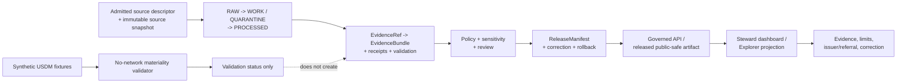

<!-- [KFM_META_BLOCK_V2]
doc_id: kfm://doc/dashboards-domain-hazards
title: Hazards Dashboard Specification
type: dashboard-specification
version: v1.0
status: "draft; repository-grounded; specification-only; placement-hold; runtime-needs-verification; fixture-first; policy-inactive; not-for-life-safety; non-release; non-publication"
owners:
  - "@bartytime4life — CONFIRMED GitHub review route through the repository default CODEOWNERS rule"
  - "NEEDS VERIFICATION — Hazards, dashboard, observability, evidence, source, policy, public-safety-boundary, release, correction, rollback, UI, and independent-review stewards"
created: 2026-05-26
updated: 2026-08-21
policy_label: repository-facing
truth_posture: cite-or-abstain
owning_root: docs/
current_path: docs/dashboards/domain/hazards.md
responsibility: >-
  Define the human-readable, steward-facing Hazards dashboard specification:
  its source-role and object-family boundaries, life-safety denial posture,
  time/freshness states, indicator contract, implementation boundary,
  validation burden, correction path, and current repository maturity without
  becoming hazard truth, telemetry, evidence, policy, alerting, release, or
  publication authority.
placement_status: >-
  CONFIRMED existing file under the canonical docs/ root; the nested
  docs/dashboards/ lane remains HOLD under the accepted Directory Rules v2
  posture recorded by the parent dashboard README.
implementation_status: >-
  BOUNDED FIXTURE AND WORKFLOW PROOF ONLY. The repository contains a
  deterministic, no-network U.S. Drought Monitor materiality profile and
  domain-hazards workflow. No running Hazards dashboard, live hazard feed,
  source admission, metric computation service, telemetry store, active policy
  evaluator, EvidenceBundle/ProofPack producer, review-console panel, public
  route, release dry-run, or deployed dashboard behavior is established.
evidence_snapshot:
  repository: bartytime4life/Kansas-Frontier-Matrix
  base_ref: main
  base_commit: 0bcae3f30f682c4bcd0694f0f97deced6f4c5e0e
  target_prior_blob: 249c22050dcb22746813895d92ad113a9d77c7f9
  dashboards_readme_blob: c3a0ab69cfc14cea7269cc2cdd853fbac3bb14e3
  dashboard_catalog_blob: 3b9ee1b34a8278fbabe04145a99a37e4d6214838
  hazards_domain_readme_blob: 8aeff8396db3e38f71999a61c42fb94c39f2d579
  hazards_policy_readme_blob: b77040cbd1c7989f6fdddc474becc57bc29870dc
  usdm_validator_blob: dac5f56560f40e725c4d8924d8d20138ae5708fd
  usdm_tests_blob: dc71faa0667b8817abe070a7fef08361c9ddc743
  usdm_cases_blob: 86041228885e993b7b0f8da79e5b3cceadced4ed
  domain_hazards_workflow_blob: a77b7d7e926a375a1d8bc29a0d2609c0d619e068
  domain_lane_register_blob: 1bfc6f91cfa713a5e3d51ece011b63b46310734f
  codeowners_blob: dd2a84aa514d8ecd9208bc347f90f9a2ed37dd61
  generated_receipt_schema_blob: fba21ed27ebccf1362fe397fe0c3ebd85e072685
inspection_boundary: >-
  Current-session GitHub reads covered this complete target, the parent dashboard
  boundary and catalog, accepted Directory Rules posture, CODEOWNERS, the
  domain-lane projection, Hazards doctrine and life-safety boundary, contract and
  policy indexes, source-registry boundary, deterministic USDM materiality
  validator/fixtures/tests, the domain-hazards workflow, Explorer Hazards feature
  README, Review Console README, generated-receipt schema, exact-target open-PR
  overlap, and task-branch overlap. No mounted checkout, live source, current
  hazard condition, source activation, active policy evaluator, dashboard query,
  telemetry store, API route, browser session, deployed surface, EvidenceBundle,
  ProofPack, release candidate, correction propagation, rollback drill, or public
  operation was exercised.
related:
  - ../README.md
  - README.md
  - ../DASHBOARD_CATALOG.md
  - ../INDICATOR_CATALOG.md
  - ../governance/RELEASE_CORRECTION_ROLLBACK.md
  - ../../domains/hazards/README.md
  - ../../domains/hazards/LIFE_SAFETY_BOUNDARY.md
  - ../../domains/hazards/SOURCE_ROLE_MATRIX.md
  - ../../domains/hazards/PUBLICATION_AND_BOUNDARY.md
  - ../../domains/hazards/DROUGHT_ANTI_COLLAPSE.md
  - ../../architecture/hazards-trust-membrane.md
  - ../../doctrine/directory-rules.md
  - ../../adr/ADR-0029-adopt-directory-governance-standard-v2.md
  - ../../../control_plane/domain_lane_register.yaml
  - ../../../contracts/domains/hazards/README.md
  - ../../../schemas/contracts/v1/domains/hazards/README.md
  - ../../../policy/domains/hazards/README.md
  - ../../../fixtures/domains/hazards/README.md
  - ../../../fixtures/domains/hazards/usdm_materiality/cases.json
  - ../../../tests/domains/hazards/README.md
  - ../../../tests/domains/hazards/test_validate_usdm_materiality.py
  - ../../../tools/validators/domains/hazards/README.md
  - ../../../tools/validators/domains/hazards/validate_usdm_materiality.py
  - ../../../.github/workflows/domain-hazards.yml
  - ../../../apps/review-console/README.md
  - ../../../apps/explorer-web/src/features/domains/hazards/README.md
  - ../../../data/registry/sources/hazards/README.md
  - ../../../data/proofs/hazards/README.md
  - ../../../release/candidates/hazards/README.md
  - ../../../schemas/contracts/v1/receipts/generated_receipt.schema.json
tags:
  - kfm
  - dashboards
  - domain
  - hazards
  - hazard-context
  - source-role
  - time-aware
  - freshness
  - expiry
  - official-referral
  - not-for-life-safety
  - evidence
  - policy
  - finite-outcomes
  - correction
  - rollback
notes:
  - "v1.0 is a same-path, repository-grounded replacement of the stale v0.1 planning specification."
  - "The update corrects the prior overbroad rule that all official warning-like context must be denied: KFM may carry governed WarningContext or AdvisoryContext, but must deny KFM alert authorship, life-safety instruction, expired-as-current presentation, and source-role collapse."
  - "Current executable evidence is one bounded synthetic no-network USDM materiality profile; it is not live drought truth, source admission, active policy, dashboard runtime, release, or publication proof."
  - "The dashboard reports posture. It cannot resolve evidence, execute policy, approve review, issue or interpret alerts, release data, or authorize a public answer."
[/KFM_META_BLOCK_V2] -->

<a id="top"></a>

# Hazards Dashboard Specification

> **Operating rule.** A Hazards dashboard may make evidence, source role, time, freshness, policy, release, correction, and implementation posture visible to authorized reviewers. It must never become a hazard detector, current-condition authority, emergency alert system, protective-action adviser, regulatory determination, or second source of truth.

<p>
  
  
  
  
  
  
  
</p>

> [!IMPORTANT]
> **Specification presence is not dashboard implementation.** This file, the dashboard catalogs, the Hazards workflow, fixtures, tests, and validators are review inputs. They do not establish live feeds, current conditions, an accepted metric threshold, source admission, an active policy decision, EvidenceBundle closure, release eligibility, deployment, or KFM publication.

> [!CAUTION]
> **KFM is never an alert or life-safety authority.** Operational warnings, advisories, and watches may appear only as governed context with the issuing authority, issue/expiry state, freshness, disclaimer, and official-source referral intact. KFM must deny outputs that present KFM as the issuer, interpret protective action, relay expired context as current, or substitute for official emergency channels.

> [!WARNING]
> **Preserve knowledge character.** A warning is not an observed event. A disaster declaration is not damage evidence. A regulatory flood zone is not observed inundation. A satellite detection is not confirmed perimeter or impact. A model, drought classification, susceptibility surface, exposure summary, or resilience score is not a direct observation. A dashboard that collapses those meanings is defective even when every chart renders and every workflow is green.

> [!NOTE]
> The machine domain projection records Hazards with a `T0` baseline, while the domain doctrine permanently denies KFM alert authority and requires more restrictive handling for sensitive joins. The dashboard must apply the most restrictive supported posture; it must not turn one baseline label into a universal public-release decision.

## Quick navigation

[Current checkpoint](#0-current-repository-checkpoint) ·
[Domain scope](#1-domain-scope) ·
[Indicator subset](#2-indicator-subset) ·
[Domain-specific indicators](#3-domain-specific-indicators-proposed) ·
[Ownership](#4-ownership) ·
[Implementation](#5-implementation-pointer) ·
[Review cadence](#6-review-cadence) ·
[Open questions](#7-open-questions) ·
[Evidence](#8-evidence-basis--citations) ·
[Validation](#9-validation-and-acceptance) ·
[Safety](#10-security-sensitivity-and-public-safety) ·
[Rollback](#11-correction-rollback-and-supersession) ·
[History](#12-revision-history)

---

<a id="0-current-repository-checkpoint"></a>

## 0. Current repository checkpoint

The safe current conclusion is **partial, bounded, and fixture-first**.

| Surface | CONFIRMED current repository evidence | What remains unproved |
|---|---|---|
| Dashboard specification | This exact path exists and is cataloged as the Hazards domain dashboard specification. | Running panel, query, metric producer, telemetry, access control, deployment, or public route. |
| Dashboard lane | [`docs/dashboards/`](../README.md) contains human specifications and catalogs. | Long-term nested-lane placement; parent status remains `HOLD`. |
| Domain identity | The machine projection lists `lane_id: hazards`, code alias `hazards`, and sensitivity baseline `T0`. | Accepted registration authority, final sensitivity authority, or functional owner identity. |
| Domain doctrine | [`docs/domains/hazards/README.md`](../../domains/hazards/README.md) and [`LIFE_SAFETY_BOUNDARY.md`](../../domains/hazards/LIFE_SAFETY_BOUNDARY.md) define historical, regulatory, observational, modeled, and operational-context scope while denying KFM alert/life-safety authority. | Live sources, end-to-end evidence, policy enforcement, release, deployment, or operational effectiveness. |
| Semantic contracts | [`contracts/domains/hazards/`](../../../contracts/domains/hazards/README.md) defines proposed object meanings, source-role rules, expiry, referral, evidence, release, and rollback obligations. | Complete contract acceptance, machine-consumer closure, or runtime enforcement. |
| Machine schemas | [`schemas/contracts/v1/domains/hazards/`](../../../schemas/contracts/v1/domains/hazards/README.md) contains mixed-maturity Hazards schema profiles and scaffolds. | Full object-family coverage, accepted admission, or public API binding. |
| Source registry | [`data/registry/sources/hazards/`](../../../data/registry/sources/hazards/README.md) currently provides a registry boundary README and reports unresolved parallel topology. | Admitted SourceDescriptor instances, activated live sources, current rights/cadence review, or a production resolver. |
| Bounded validator | [`validate_usdm_materiality.py`](../../../tools/validators/domains/hazards/validate_usdm_materiality.py) deterministically compares committed weekly synthetic drought snapshots with network access forbidden. | Live U.S. Drought Monitor retrieval, scientific validation, policy, evidence closure, promotion, release, or publication. |
| Fixtures and tests | [`cases.json`](../../../fixtures/domains/hazards/usdm_materiality/cases.json) carries four valid states and five exact negative cases; [`test_validate_usdm_materiality.py`](../../../tests/domains/hazards/test_validate_usdm_materiality.py) exercises deterministic criteria, hold behavior, hierarchy, time order, governance denial, and declaration-field rejection. | Broader hazard families, live-source fidelity, accepted thresholds, dashboard metrics, or production behavior. |
| Hazards CI | [`.github/workflows/domain-hazards.yml`](../../../.github/workflows/domain-hazards.yml) runs `make hazards-validate` and keeps proof and release-dry-run jobs on explicit hold. | That a particular future branch passed; EvidenceBundle/ProofPack construction, candidate assembly, release, or deployment. |
| Policy | [`policy/domains/hazards/`](../../../policy/domains/hazards/README.md) reports seven default-only Rego scaffolds, no operative rule bodies, no native Rego tests, and no accepted evaluator/bundle. | Active policy decisions, enforced obligations, authenticated decision receipts, production consumers, or public-safe release. |
| Proof and release | The workflow and README surfaces explicitly hold proof and release-dry-run work. | Any active Hazards proof payload, release candidate, correction propagation run, rollback rehearsal, or published bytes. |
| Explorer feature | A Hazards feature README exists under Explorer Web and defines fail-closed UI obligations. | Route, panel, adapter, tests, governed envelopes, Evidence Drawer, Focus Mode, export, or deployed behavior. |
| Review Console | [`apps/review-console/README.md`](../../../apps/review-console/README.md) defines a proposed role-gated steward app boundary. | Hazards panel, query, decision recorder, telemetry integration, access controls, or deployment. |

### Current truth split

- **CONFIRMED:** the specification path; current Hazards doctrine, life-safety, contract, schema, registry-boundary, policy-boundary, fixture, validator, test, workflow, Explorer README, and Review Console README surfaces; and the bounded no-network USDM materiality profile.
- **PROPOSED:** the indicator and view model below, a steward-facing Hazards dashboard, every metric calculation and threshold, official-referral coverage reporting, correction/rollback panels, and any public dashboard projection.
- **UNKNOWN:** live source state, current hazard conditions, active policy decisions, EvidenceBundle resolution, metric values, running dashboard behavior, deployed access controls, release state, and public parity.
- **NEEDS VERIFICATION:** functional owners, metric contracts and denominators, telemetry storage, query definitions, source rights/freshness, source-role resolution for operational context, policy activation, dashboard implementation, review-console/Explorer integration, release/correction feeds, and hosted exact-head results for this change.

[↑ Back to top](#top)

---

<a id="1-domain-scope"></a>

## 1. Domain scope

This specification covers a **steward-facing governance, evidence, correction, and implementation-health view** for the registered Hazards lane. It may summarize Hazards records only through governed references and derived metrics. It does not host the records, classify current conditions, or decide their authority.

### 1.1 In-scope object and context families

| Family | Dashboard responsibility | Required distinction |
|---|---|---|
| `HazardEvent` and `HazardObservation` | Show source, time, geometry/support, revision, evidence, and release state. | Event/observation is not warning, declaration, model, or regulatory context. |
| `WarningContext` and `AdvisoryContext` | Show issuing authority, issue/expiry, freshness/stale state, disclaimer, and official referral. | KFM does not issue, interpret, relay as advice, or replace the authority. |
| `DisasterDeclaration` | Show administrative scope, effective period, authority, linkage, and evidence limits. | Declaration is administrative context, not measured damage or event confirmation by itself. |
| `FloodContext` | Show observed, regulatory, modeled, forecast, or historical character explicitly. | NFHL/regulatory context is not observed inundation or a forecast. Hydrology owns water truth. |
| `WildfireDetection` and `SmokeContext` | Show sensor/model/detection role, confidence, time, caveat, owning-domain links, and release state. | Detection is not confirmed perimeter, legal status, impact, AQI, or life-safety instruction. |
| `DroughtIndicator` | Show classification/aggregate/model identity, valid date, comparison basis, and materiality posture. | Classification or aggregate is not per-place observation, forecast, declaration, or promotion authority. |
| `EarthquakeEvent` and heat/cold context | Show observation/advisory/model character, revision, uncertainty, time, and evidence. | Event observation is not protective-action guidance. |
| `ExposureSummary` and `ResilienceSummary` | Show aggregation, input releases, uncertainty, sensitivity, and correction lineage. | Exposure is not impact, loss, casualty, vulnerability, or deterministic risk. |
| `HazardTimeline` and `ImpactArea` | Show derivation, source roles, valid interval, correction state, and limits. | A timeline or footprint is a downstream carrier, not sovereign event truth. |

### 1.2 Knowledge-character and source-role anti-collapse matrix

| Boundary | Dashboard display rule | Fail-safe result |
|---|---|---|
| Historical event vs operational warning/advisory/watch | Separate object families, temporal fields, panels, and counts. | Never infer an event from warning issuance or a warning from an event record. |
| Administrative declaration vs observed impact | Display declaration authority and scope separately from damage/impact evidence. | `HOLD` or `ABSTAIN` when impact support is absent. |
| Regulatory hazard area vs observed/forecast event | Label regulatory/effective-date context and owning lane. | Never display a regulatory polygon as observed inundation, fire, or current condition. |
| Remote-sensing detection vs confirmed event/perimeter | Show sensor, product, confidence, detection time, and review status. | Keep as detection/candidate unless a governed transition supports stronger wording. |
| Modeled/forecast/susceptibility surface vs observation | Show model/run identity, valid time, uncertainty, and limitations. | Never combine into an unlabeled “current hazard” value. |
| Aggregate classification vs per-place condition | Show aggregation support, denominator, date, and scale. | Abstain on unsupported parcel/site-level inference. |
| Exposure vs impact/loss/risk | Show inputs, population/assets basis, aggregation, uncertainty, and policy posture. | Never infer damage, casualties, probability, or vulnerability from exposure alone. |
| Candidate/synthetic vs released evidence | Keep candidate and synthetic material outside authoritative dashboard totals unless explicitly shown as held test data. | `DENY`, `HOLD`, or `ABSTAIN`; never silently upgrade role through promotion. |
| Operational-context canonical source role | Preserve the explicit recorded role and object family; the repository documents unresolved role-mapping tension. | Do not invent a role. The not-for-life-safety boundary applies regardless of the eventual role decision. |

### 1.3 Spatial, temporal, audience, and authority boundary

A dashboard metric is meaningful only when its scope is explicit:

- **spatial:** state, county/generalized area, event footprint, regulatory area, station/sensor support, model grid, or release footprint;
- **temporal:** observed/event time, issue time, valid time, expiry time, source time, retrieval time, processing time, release time, supersession time, and correction time remain distinct where material;
- **audience:** steward/reviewer, internal operator, semi-public reviewer, or public user;
- **authority:** source issuer, data producer, model producer, administrative authority, review authority, policy evaluator, and release authority stay separate;
- **release:** candidate, held, unreleased, released, stale, expired, corrected, withdrawn, superseded, or rolled back only when an owning record defines that state.

The default design target here is **role-gated steward review**. A public or emergency Hazards dashboard is not authorized by this specification.

[↑ Back to top](#top)

---

<a id="2-indicator-subset"></a>

## 2. Indicator subset

The dashboard instances existing governance-health families; it does not redefine them. No metric below has a current value until a machine contract, producer, denominator, query, freshness rule, access policy, and validation evidence exist.

### 2.1 Required steward indicators

| Indicator | What it may measure | Required inputs | Healthy posture | Current status |
|---|---|---|---|---|
| EvidenceRef resolution coverage | Evaluated released/candidate items whose required refs resolve to admissible evidence. | Stable population definition; resolver result; evidence status; time and release scope. | No authoritative claim is displayed without required support; unresolved items are visible as gaps. | PROPOSED; no Hazards resolver or dashboard query verified. |
| Source-role/object-family integrity | Findings for warning/event, declaration/impact, regulatory/observed, detection/confirmation, model/observation, aggregate/per-place, exposure/impact, or synthetic/observed collapse. | Accepted role vocabulary; object family; validator result; denominator. | Zero unreviewed collapse in any authoritative/public-safe population. | PROPOSED; broader validators incomplete. |
| Freshness and expiry disposition coverage | Time-sensitive context carrying issue/valid/expiry/freshness and stale handling. | Time semantics; source cadence; expiry rule; supersession/correction state. | No expired or stale operational context appears as current. | PROPOSED; source descriptors and policy integration unverified. |
| Not-for-life-safety posture coverage | Eligible operational-context projections carrying the required disclaimer and non-authority state. | Governed envelope; UI projection; policy obligation; evidence/release scope. | 100% for every eligible operational-context projection. | PROPOSED; no running projection verified. |
| Official-referral coverage | Eligible operational-context projections with validated official-source identity/link metadata. | Issuer identity; referral target; temporal state; validation result. | 100% for eligible projections; referral is a pointer, not paraphrased advice. | PROPOSED; no accepted field/validator/query verified. |
| Alert-authority/life-safety denial findings | Evaluated requests or candidates denied because KFM would act as alert issuer, protective-action adviser, official-source substitute, or expired-as-current carrier. | Evaluated population; finite reason vocabulary; policy/validator outcome. | Every prohibited case is denied and reviewable. A zero denominator is displayed as `NO_EVALUATED_CASES`, not as success. | PROPOSED; current policy is inactive. |
| Rollback-target coverage | Released Hazards artifacts with a resolvable rollback target. | ReleaseManifest population; RollbackCard/reference; integrity validation. | 100% for release types requiring rollback. | PROPOSED; Hazards release-dry-run remains held. |
| Correction propagation latency | Time from accepted correction/withdrawal to affected dashboard state and derivative invalidation. | CorrectionNotice; lineage; invalidation events; cache/search/map/AI propagation times. | Within an accepted domain tolerance; overdue items visibly held. | PROPOSED; tolerance and producers unaccepted. |
| Derivative-invalidation coverage | Known downstream artifacts invalidated, corrected, or held after an upstream correction. | Dependency/lineage graph; correction scope; downstream state. | 100% of known affected derivatives dispositioned. | PROPOSED; no end-to-end correction drill verified. |
| Supersession lineage gaps | Superseded records or artifacts without forward/backward lineage. | Stable identity; release/correction records; catalog state. | Zero gaps in the evaluated population. | PROPOSED. |
| Source-admission completeness | Referenced source families with an admitted descriptor and reviewed role/rights/cadence/sensitivity posture. | Source registry resolver; activation decision; source refs. | No source-dependent metric claims admission when descriptors are missing or inactive. | PROPOSED; current source-registry lane reports no admitted instances. |

### 2.2 Display rules for every indicator

Every metric card or table row must expose, directly or through an accessible detail view:

- metric contract/version and producer identity;
- numerator, denominator, excluded states, and zero-denominator behavior;
- spatial, temporal, audience, source-role, object-family, and release scope;
- freshness/expiry and last successful evaluation time;
- outcome vocabulary and reason codes;
- supporting EvidenceRefs, receipts, policy/review/release references where applicable;
- limitations, unresolved dependencies, and correction state;
- whether the value is fixture-only, synthetic, candidate, released, stale, or unavailable.

`0%`, `100%`, an empty chart, a green badge, or a successful workflow must never stand in for missing denominator, missing evaluation, missing evidence, or held implementation.

[↑ Back to top](#top)

---

<a id="3-domain-specific-indicators-proposed"></a>

## 3. Domain-specific indicators (PROPOSED)

### 3.1 Current bounded USDM materiality proof

The repository currently supports a narrow **validation-status panel**, not a drought-condition dashboard. The no-network profile compares committed synthetic weekly snapshots and produces four finite assessment states:

| State | Validator outcome | Dashboard interpretation |
|---|---|---|
| `UNCHANGED` | `NON_EVENT` | Synthetic comparison found no metric or geometry change. |
| `SEMANTIC_NON_MATERIAL` | `NON_EVENT` | Synthetic metrics changed below the configured materiality criteria. |
| `MATERIAL` | `PROMOTION_CANDIDATE` | Synthetic comparison crossed one or more declared criteria; this creates no authority, source activation, promotion, release, or publication. |
| `UNDETERMINED` | `HOLD` | Geometry changed without supporting metric change or another unresolved condition requires review. |

A future steward dashboard may report the validator's fixture inventory, last workflow result, profile/version, exact findings, and hold reasons. It must label the panel **synthetic/no-network validation**, never “current drought,” “Kansas drought status,” or release readiness.

### 3.2 Candidate Hazards-specific health indicators

| Candidate indicator | Why it is Hazards-specific | Admission requirement |
|---|---|---|
| Operational-context expiry violations | Stale or expired warning/advisory/watch context can mislead within minutes or hours. | Accepted time contract, source cadence, policy obligation, fixtures, consumer test. |
| Official-referral failures | The life-safety boundary requires a validated authority referral wherever operational context is shown. | Issuer/referral contract, link validation, policy rule, UI negative tests. |
| Warning/event and regulatory/observed collapse findings | These errors can transform context into false event/current-condition claims. | Accepted role/object-family vocabulary and deterministic validator. |
| Detection/confirmation collapse findings | Remote-sensing and report feeds may identify candidates without confirming perimeter, impact, or legal status. | Source-specific role contract, review state, evidence transition, negative fixtures. |
| Correction-to-last-derivative latency | Hazard corrections can invalidate maps, search, summaries, exposure analyses, and AI answers quickly. | Correction graph, propagation receipt, accepted tolerance, rollback drill. |
| Most-restrictive-join enforcement | Exposure/resilience joins may inherit critical-infrastructure, private-property, living-person, archaeology, or other restricted posture. | Cross-lane policy contract, redaction/generalization receipts, access tests. |

### Explicitly rejected local shortcuts

- Treating `PROMOTION_CANDIDATE` as promotion, release, publication, or current-condition truth.
- Treating a zero `ALERT_AUTHORITY` denial count as healthy without showing the evaluated denominator.
- Counting source-family README files as admitted or active SourceDescriptors.
- Treating an official warning polygon as an observed event footprint.
- Treating an administrative declaration as event severity, damage, loss, or casualty evidence.
- Treating NFHL or another regulatory layer as observed inundation.
- Treating FIRMS/HMS or another detection as a confirmed fire perimeter or protective-action instruction.
- Treating a drought classification/aggregate as a parcel-level observation, forecast, or legal declaration.
- Combining model, observation, warning, regulatory, administrative, candidate, and synthetic records into one unlabeled “hazard” total.
- Treating a passing workflow, validator, receipt, badge, map, dashboard, or AI answer as release or publication authority.

[↑ Back to top](#top)

---

<a id="4-ownership"></a>

## 4. Ownership

### Verified review route

The repository default [`CODEOWNERS`](../../../.github/CODEOWNERS) rule routes this path to `@bartytime4life`. That is a GitHub review route only; it is not a verified assignment of Hazards, emergency-management, evidence, policy, release, or independent-review authority.

### Functional responsibility matrix

| Responsibility | Required function | Identity status |
|---|---|---|
| Hazards domain steward | Confirms object-family meaning, cross-lane ownership, and domain fitness. | NEEDS VERIFICATION |
| Life-safety/public-safety boundary reviewer | Reviews denial/referral semantics and prohibited protective-action behavior. | NEEDS VERIFICATION |
| Source steward | Reviews SourceDescriptor, role, rights, cadence, freshness, and authority limits. | NEEDS VERIFICATION |
| Evidence steward | Reviews EvidenceRef/EvidenceBundle closure and citation fitness. | NEEDS VERIFICATION |
| Metric/observability steward | Owns metric contracts, producers, denominator rules, query integrity, and telemetry quality. | NEEDS VERIFICATION |
| Policy steward | Owns accepted rules, reason codes, obligations, bundle identity, and evaluator binding. | NEEDS VERIFICATION |
| UI/accessibility steward | Owns finite states, disclaimer/referral presentation, keyboard/screen-reader access, and no-color-only semantics. | NEEDS VERIFICATION |
| Release/correction/rollback steward | Owns release state, corrections, invalidation, withdrawal, and rollback evidence. | NEEDS VERIFICATION |
| Independent reviewer | Reviews high-consequence boundary and policy-significant changes separately from authorship when required. | NEEDS VERIFICATION |

No dashboard status may imply that an unassigned role approved a metric, warning context, policy result, release, or public projection.

[↑ Back to top](#top)

---

<a id="5-implementation-pointer"></a>

## 5. Implementation pointer

### Current boundary

- **Specification:** this file under `docs/dashboards/domain/`.
- **Proposed steward surface:** [`apps/review-console/`](../../../apps/review-console/README.md); no Hazards panel, query, or telemetry integration is verified.
- **Proposed public/semi-public feature seam:** [`apps/explorer-web/src/features/domains/hazards/`](../../../apps/explorer-web/src/features/domains/hazards/README.md); the README exists, but route, panel, adapter, Evidence Drawer, Focus Mode, export, tests, and deployment remain unverified.
- **Current executable proof:** `make hazards-validate`, exercised by [`.github/workflows/domain-hazards.yml`](../../../.github/workflows/domain-hazards.yml), for deterministic fixture-only USDM materiality validation.
- **Current policy posture:** documented and fail-closed at integration, but no accepted executable Hazards policy bundle/evaluator is established.
- **Current proof/release posture:** explicit workflow holds; no active Hazards proof producer or release-dry-run command/candidate contract is established.

### Responsibility flow



The dashboard may consume governed projections from the right side of the trust membrane. It must not query live source endpoints or canonical/internal stores as its normal path.

### Minimum implementation admission gates

Before a running Hazards dashboard or metric is described as implemented, verify all of the following:

1. accepted metric contract/version, stable population, numerator/denominator, exclusions, and zero-denominator state;
2. producer code, immutable configuration, deterministic identity, and authenticated receipts;
3. source admission, rights, role, cadence, freshness, and temporal semantics appropriate to the metric;
4. object-family/source-role anti-collapse validation;
5. not-for-life-safety denial and official-referral obligations at policy and consumer boundaries;
6. EvidenceRef/EvidenceBundle support for claim-bearing rows;
7. policy bundle/evaluator identity, finite reason codes, and enforced obligations;
8. review, access control, and separation-of-duty posture;
9. release/correction/withdrawal/rollback references for released populations;
10. governed API or released-artifact adapter; no direct live-source or pre-publication-store client;
11. explicit loading, empty, no-evaluated-cases, stale, expired, partial, evidence-gap, denied, redirected, malformed, and error states;
12. accessibility, performance, security, redaction/generalization, export, and no-sensitive-side-channel tests;
13. repository-native and hosted exact-head validation.

[↑ Back to top](#top)

---

<a id="6-review-cadence"></a>

## 6. Review cadence

No universal seasonal or monthly cadence is accepted by current implementation evidence. Review should be **triggered by material change** and later supplemented by an approved periodic cadence.

### Mandatory review triggers

- Hazards doctrine, life-safety boundary, source-role matrix, contract, schema, policy, or reason-code change;
- source descriptor admission, source terms/rights change, source product/version/cadence change, or endpoint retirement;
- freshness, expiry, supersession, issuer/referral, or time-semantics change;
- new validator/fixture/test profile or a change to USDM materiality criteria;
- workflow proof/release hold graduation;
- metric contract, producer, query, denominator, threshold, or telemetry-store change;
- Review Console or Explorer Hazards route/panel implementation;
- correction, withdrawal, invalidation, stale-state failure, rollback rehearsal, or public-safety incident;
- official-source referral validation failure or broken/deprecated referral path;
- dashboard placement or authority decision.

### Review packet

A review should include:

- exact base/head refs and changed files;
- metric/contract/schema/policy versions and digests;
- source descriptors, rights/freshness posture, and issuer/referral scope where applicable;
- positive and negative fixtures, validator results, workflow runs, and inherited-failure classification;
- evidence/review/release/correction/rollback references appropriate to the claimed maturity;
- accessibility, security, redaction/generalization, and no-life-safety-authority proof;
- rollback plan for the documentation or implementation change.

[↑ Back to top](#top)

---

<a id="7-open-questions"></a>

## 7. Open questions

| ID | Question | Current posture | Evidence required to close |
|---|---|---|---|
| `OPEN-DASH-HAZ-01` | What metric contracts, stable denominators, and zero-denominator states govern each indicator? | NEEDS VERIFICATION | Accepted contract/schema, producer, fixtures, tests, and query evidence. |
| `OPEN-DASH-HAZ-02` | Is alert/life-safety denial represented by one reason or a reviewed family such as issuer, instruction, expired-as-current, and official-substitution? | NEEDS VERIFICATION | Accepted policy vocabulary, negative fixtures, consumer tests, and review decision. |
| `OPEN-DASH-HAZ-03` | What fields and validation make an official referral complete without turning it into relayed advice? | NEEDS VERIFICATION | Contract/schema, issuer registry, link/referral validator, policy obligation, UI tests. |
| `OPEN-DASH-HAZ-04` | How are freshness and expiry windows selected per product/source and audience? | NEEDS VERIFICATION | Admitted source descriptors, temporal contract, policy, stale-state fixtures, review. |
| `OPEN-DASH-HAZ-05` | How should the USDM materiality validation panel map to broader Hazards dashboard health without implying current drought truth or promotion? | PROPOSED | Accepted metric contract and explicit fixture-only presentation tests. |
| `OPEN-DASH-HAZ-06` | Which operational-context source role is canonical, and how is the unresolved repository vocabulary migrated? | NEEDS VERIFICATION | Accepted ADR/contract/schema/source-role decision and migration proof. |
| `OPEN-DASH-HAZ-07` | Which source-registry topology is authoritative: subtype-first, domain-first, or a pointer/mirror relation? | NEEDS VERIFICATION | Directory/registry decision, migration note, duplicate-authority check, validator. |
| `OPEN-DASH-HAZ-08` | What are the accepted correction-propagation and rollback-rehearsal tolerances for each released Hazards artifact family? | NEEDS VERIFICATION | Release/correction contract, drill, telemetry, reviewer acceptance. |
| `OPEN-DASH-HAZ-09` | Is the first dashboard steward-only, semi-public, or public, and which data classes are allowed in each audience projection? | NEEDS VERIFICATION | Product decision, access policy, threat model, sensitivity review, tests. |
| `OPEN-DASH-HAZ-10` | Who holds each functional steward/reviewer responsibility? | UNKNOWN | Verified assignments and reviewer-role records. |
| `OPEN-DASH-01` | Is `docs/dashboards/` admitted as a durable direct-child docs lane? | HOLD | Accepted placement decision/ADR or governed migration plan. |

[↑ Back to top](#top)

---

<a id="8-evidence-basis--citations"></a>

## 8. Evidence basis & citations

| Repository evidence | Status used here | Supports | Does not prove |
|---|---|---|---|
| [`docs/dashboards/README.md`](../README.md) | CONFIRMED path and current lane boundary | Specification-only role and placement HOLD. | Runtime, telemetry, or canonical nested-lane admission. |
| [`DASHBOARD_CATALOG.md`](../DASHBOARD_CATALOG.md) | CONFIRMED current catalog | Hazards spec inventory and current proposed status. | Running dashboard or current metrics. |
| [`docs/domains/hazards/README.md`](../../domains/hazards/README.md) | CONFIRMED repository document / draft doctrine surface | Domain scope, objects, source roles, non-ownership, map/AI/publication boundaries. | Live implementation or source activation. |
| [`LIFE_SAFETY_BOUNDARY.md`](../../domains/hazards/LIFE_SAFETY_BOUNDARY.md) | CONFIRMED repository document / draft boundary surface | Absolute KFM alert/life-safety denial and referral posture. | Executable enforcement by itself. |
| [`SOURCE_ROLE_MATRIX.md`](../../domains/hazards/SOURCE_ROLE_MATRIX.md) and [`DROUGHT_ANTI_COLLAPSE.md`](../../domains/hazards/DROUGHT_ANTI_COLLAPSE.md) | CONFIRMED paths used as domain guidance | Role/object-family separation and drought-specific anti-collapse. | Accepted machine enforcement. |
| [`contracts/domains/hazards/README.md`](../../../contracts/domains/hazards/README.md) | CONFIRMED contract index / proposed semantics | Object meanings, trust flow, temporal/referral/release obligations. | Contract acceptance or consumer closure. |
| [`schemas/contracts/v1/domains/hazards/README.md`](../../../schemas/contracts/v1/domains/hazards/README.md) | CONFIRMED schema index | Mixed-maturity schema inventory and intended shapes. | Full coverage or active admission. |
| [`data/registry/sources/hazards/README.md`](../../../data/registry/sources/hazards/README.md) | CONFIRMED registry-boundary README | Source families, admission posture, unresolved topology, no-public-path rule. | Admitted descriptors or live source status. |
| [`policy/domains/hazards/README.md`](../../../policy/domains/hazards/README.md) | CONFIRMED repository-grounded policy inventory | Default-only/inactive policy posture and integration gaps. | Active bundle, evaluator, decision, or consumer enforcement. |
| [`validate_usdm_materiality.py`](../../../tools/validators/domains/hazards/validate_usdm_materiality.py), [`cases.json`](../../../fixtures/domains/hazards/usdm_materiality/cases.json), and [`test_validate_usdm_materiality.py`](../../../tests/domains/hazards/test_validate_usdm_materiality.py) | CONFIRMED executable source and synthetic fixtures/tests | Deterministic no-network USDM materiality semantics and exact fixture polarity. | Current drought conditions, scientific validity, source admission, evidence, policy, promotion, release, or publication. |
| [`.github/workflows/domain-hazards.yml`](../../../.github/workflows/domain-hazards.yml) | CONFIRMED workflow source | `make hazards-validate` wiring and explicit proof/release holds. | Current branch pass, production operation, or release readiness. |
| [`apps/explorer-web/src/features/domains/hazards/README.md`](../../../apps/explorer-web/src/features/domains/hazards/README.md) | CONFIRMED feature README | Proposed public-safe UI boundary and finite-state obligations. | Route/panel/runtime implementation. |
| [`apps/review-console/README.md`](../../../apps/review-console/README.md) | CONFIRMED app README | Proposed role-gated steward surface boundary. | Hazards dashboard or deployed review workflow. |
| [`control_plane/domain_lane_register.yaml`](../../../control_plane/domain_lane_register.yaml) | CONFIRMED machine projection / proposed authority | Hazards lane ID, alias, T0 baseline, unresolved ownership/authority. | Final sensitivity decision or implementation maturity. |
| [`CODEOWNERS`](../../../.github/CODEOWNERS) | CONFIRMED review-routing file | `@bartytime4life` review route. | Functional stewardship, approval, separation of duties, or completed review. |

### Evidence exclusions

This revision does **not** use any of the following as proof of current Hazards state or dashboard maturity:

- generated briefing prose, memory, or uncited model output;
- file names, badges, diagrams, README language, or workflow presence without the underlying behavior;
- public map appearance, tiles, screenshots, or dashboard mockups;
- source-family lists as source admission;
- synthetic fixtures as live conditions;
- validator PASS as EvidenceBundle, PolicyDecision, ReviewRecord, ReleaseManifest, or publication;
- a pull request, commit, merge, release page, or deployment badge as governed KFM publication.

[↑ Back to top](#top)

---

<a id="9-validation-and-acceptance"></a>

## 9. Validation and acceptance

### Documentation validation for this revision

A repository implementation of this replacement should verify:

- KFM meta block parses as YAML and retains the stable `doc_id` and current path;
- one H1, ordered heading structure, balanced fences, and valid GitHub Flavored Markdown;
- internal fragments and every relative repository link resolve;
- legacy anchors for domain scope, indicator subset, domain-specific indicators, ownership, implementation, review cadence, open questions, and evidence remain reachable;
- no unsupported running-dashboard, live-source, active-policy, release, deployment, or publication claim was introduced;
- the Dashboard Catalog Hazards row is updated in the same change;
- a generated authoring receipt covers every AI-modified Markdown artifact and binds exact artifact hashes;
- changed-area documentation, link, dashboard-catalog, and generated-receipt validators pass.

### Current bounded Hazards proof commands

Repository evidence identifies these focused commands:

```bash
make hazards-validate
```

```bash
python -m unittest tests.domains.hazards.test_validate_usdm_materiality
```

The workflow runs the first command with `KFM_NO_NETWORK=1`. Hosted exact-head results remain separate evidence and must be inspected after a branch/PR exists.

### Minimum future dashboard negative proof

A running dashboard must prove fail-closed behavior for at least:

- no evaluated population versus a true zero finding count;
- missing EvidenceRef/EvidenceBundle;
- unknown or conflicting source role;
- warning/advisory/watch rendered as observed event;
- KFM alert authorship or protective-action language;
- missing/invalid official referral or disclaimer;
- expired/superseded operational context rendered as current;
- disaster declaration rendered as observed damage/impact;
- regulatory flood context rendered as observed inundation;
- remote-sensing detection rendered as confirmed perimeter/impact;
- modeled/forecast/susceptibility surface rendered as observation;
- aggregate classification rendered as per-place condition;
- exposure rendered as impact/loss/risk;
- sensitive cross-lane join without most-restrictive policy;
- missing review/policy/release/correction/rollback reference;
- direct live-source, RAW, WORK, QUARANTINE, or unreleased-store access;
- malformed metric payload, stale telemetry, and producer/query failure;
- inaccessible status conveyed only by color or map geometry.

### What a green dashboard does not prove

A green card, passing validator, successful workflow, or zero-error trend does not prove:

- that a hazard exists or does not exist;
- that conditions are current, safe, unsafe, improving, or worsening;
- that an official warning is valid, complete, or still active;
- that an emergency action should or should not be taken;
- that a regulatory, insurance, legal, engineering, or property-safety determination is correct;
- that sources are admitted, rights-cleared, fresh, or complete;
- that policy, review, release, correction, rollback, deployment, or publication gates passed.

[↑ Back to top](#top)

---

<a id="10-security-sensitivity-and-public-safety"></a>

## 10. Security, sensitivity, and public safety

### Required finite surface states

A dashboard implementation must distinguish at least:

| State | Required meaning |
|---|---|
| `LOADING` | A bounded query is in progress; no prior value is silently presented as current. |
| `READY` | The governed metric payload is valid for the displayed scope; not a hazard-condition judgment. |
| `EMPTY` | The evaluated population is valid and contains no rows. |
| `NO_EVALUATED_CASES` | No eligible items were evaluated; never display as zero findings or success. |
| `STALE` | Metric source/telemetry is older than its accepted freshness window. |
| `EXPIRED` | Operational context passed expiry and cannot be presented as current. |
| `PARTIAL` | Some sources, populations, regions, times, or dependencies are unavailable/held. |
| `EVIDENCE_GAP` | Required evidence does not resolve or is unfit for the claimed use. |
| `POLICY_DENIED` | Policy blocks the projection; expose only audience-safe reason/obligation text. |
| `LIFE_SAFETY_REDIRECT` | The request would make KFM an alert/instruction authority; deny and direct the user to official channels without paraphrasing advice. |
| `HELD_FOR_REVIEW` | A candidate requires steward/independent review. |
| `MALFORMED` | Payload or contract validation failed. |
| `ERROR` | The producer, resolver, policy, query, or UI failed safely; never fallback to stale/unsafe allow. |

### Public-safety and sensitivity rules

- The life-safety denial is absolute: no transform turns KFM into alert authority.
- Operational context must retain issuer, issue/valid/expiry, freshness, stale/superseded state, disclaimer, and official referral.
- A referral points to the official authority; it must not relay or paraphrase protective-action advice as KFM guidance.
- The UI must never show “all clear,” “safe,” “no risk,” or equivalent merely because data is absent, stale, filtered, or below a threshold.
- Source and model uncertainty, support scale, aggregation, and knowledge character must be visible.
- Cross-lane joins inherit the most restrictive supported rights/sensitivity/publication posture.
- Critical infrastructure, private property, living-person, health, archaeology, culturally sensitive, or otherwise harmful precision must be denied, restricted, redacted, or generalized through governed transforms.
- Tooltips, exports, URLs, logs, analytics, search, screenshots, caches, tiles, and error messages must not leak restricted detail or policy internals.
- Accessibility must not rely on color, animation, siren-like audio, map shape, or hover alone; status and referral text must be keyboard- and screen-reader-accessible.
- A dashboard must not imitate official alert branding, urgency patterns, or notification behavior in a way that implies issuer authority.

[↑ Back to top](#top)

---

<a id="11-correction-rollback-and-supersession"></a>

## 11. Correction, rollback, and supersession

### This documentation change

Rollback is the inverse repository change: restore the prior blob for `docs/dashboards/domain/hazards.md`, restore the prior Dashboard Catalog row, and remove or supersede the generated authoring receipt through a reviewed follow-up. Reverting documentation does not alter any source, hazard condition, policy, release, deployment, or published artifact.

### Future dashboard behavior

A running Hazards dashboard must:

1. bind every metric/result to stable producer, contract, source/evidence, temporal, policy, review, and release identities;
2. surface corrected, withdrawn, superseded, stale, expired, held, and rolled-back states without silently rewriting history;
3. invalidate or hold affected maps, tables, search, exports, exposure/resilience derivatives, caches, and AI answers after accepted correction;
4. retain forward/backward lineage and audience-safe correction notes;
5. verify that rollback restores a known prior governed state and does not resurrect expired context, withdrawn evidence, or restricted detail;
6. treat correction propagation and rollback rehearsal as separately measured, reviewable processes.

### Supersession

This v1.0 specification supersedes the prior v0.1 planning text **at the same path**. It preserves the stable document identity and legacy section anchors while replacing stale implementation assumptions with current bounded repository evidence. It does not supersede Hazards doctrine, contracts, schemas, policy, source descriptors, evidence, release records, or runtime behavior.

[↑ Back to top](#top)

---

<a id="12-revision-history"></a>

## 12. Revision history

| Version | Date | Change | Authority effect |
|---|---|---|---|
| `v0.1` | 2026-05-26 | Initial Atlas-derived per-domain planning specification. | Specification only; no implementation authority. |
| `v1.0` | 2026-08-21 | Repository-grounded same-path modernization: current Hazards fixture/workflow proof, life-safety/referral boundary, anti-collapse matrix, finite states, indicator admission contract, implementation gates, validation, security, correction, rollback, and catalog/receipt dependency closure. | Documentation and provenance only; no source activation, policy, evidence, release, deployment, or publication effect. |

---

<sub>Hazards dashboard specification. The dashboard may report governed posture; it cannot create hazard truth, issue or interpret alerts, execute policy, approve review, release data, or publish KFM knowledge. Follow official authorities for current emergency information and protective-action guidance.</sub>
