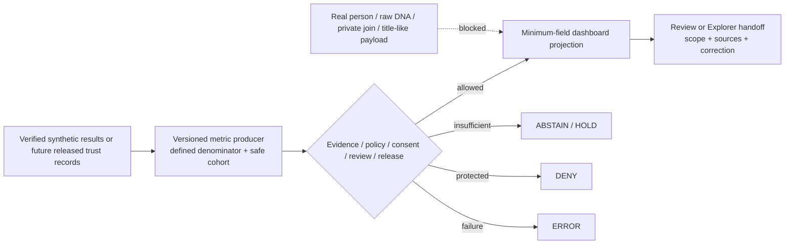

<!-- [KFM_META_BLOCK_V2]
doc_id: kfm://doc/dashboards-domain-people-dna-land
title: People, Genealogy, DNA, and Land Ownership Dashboard Specification
type: dashboard-spec
version: v1.1
status: draft
owners:
  - "@bartytime4life — CONFIRMED CODEOWNERS review route only"
created: 2026-05-26
updated: 2026-08-21
policy_label: restricted-review
owning_root: docs/
responsibility: >-
  Specify the human-facing People, Genealogy, DNA, and Land Ownership
  domain-health dashboard contract without creating person, kinship, genomic,
  consent, title, source, policy, release, or publication authority.
truth_posture: cite-or-abstain
current_path: docs/dashboards/domain/people-dna-land.md
placement_status: >-
  CONFIRMED existing path under docs/; the parent docs/dashboards/ lane remains
  on placement HOLD pending an accepted structural decision.
implementation_status: >-
  CONFIRMED bounded synthetic consent and revocation validation only; policy
  evaluator, dashboard runtime, proof producer, release producer, deployment,
  and publication remain unverified or held.
evidence_snapshot:
  repository: bartytime4life/Kansas-Frontier-Matrix
  base_commit: 2f730283b19f1b82245fac0087752e7f26761ce5
  reconciled_main: b820a8a938db741018289c6131477f2ceaa052fc
  prior_blob: cfd63497e182f67ced50aac3fa3dae6cdae84164
inspection_boundary: >-
  Current-session GitHub reads covered dashboard doctrine and catalogs,
  Directory Rules and ADR-0029, CODEOWNERS, People/DNA/Land domain,
  sensitivity, contract, schema, policy, fixture, validator, test, workflow,
  Explorer, proof, and release-candidate boundaries. No real person,
  genealogy, DNA/genomic, consent credential, deed, parcel, title, assessor,
  tax, or private person-land payload was inspected or introduced.
related:
  - docs/dashboards/README.md
  - docs/dashboards/domain/README.md
  - docs/dashboards/DASHBOARD_CATALOG.md
  - docs/dashboards/INDICATOR_CATALOG.md
  - docs/domains/people-dna-land/README.md
  - docs/domains/people-dna-land/SENSITIVITY.md
  - docs/domains/people-dna-land/SENSITIVITY_PROFILE.md
  - docs/doctrine/directory-rules.md
  - docs/adr/ADR-0029-adopt-directory-governance-standard-v2.md
  - contracts/domains/people-dna-land/README.md
  - schemas/contracts/v1/domains/people-dna-land/README.md
  - policy/domains/people-dna-land/README.md
  - .github/workflows/domain-people-dna-land.yml
tags: [kfm, dashboards, people-dna-land, living-person, genealogy, dna, consent, revocation, land-title, sensitivity, correction, rollback]
notes:
  - "v1.1 repairs the metadata type to the repository validator's single-token contract and preserves the repository-grounded v1.0 substance in a tighter form."
  - "Fixed percentages, target-zero claims, quarterly cadence, and presumed runtime surfaces remain removed because no accepted metric contract or producer was verified."
[/KFM_META_BLOCK_V2] -->

# People, Genealogy, DNA, and Land Ownership Dashboard Specification

> **Purpose.** Define a reviewable People/DNA/Land governance-health dashboard contract without letting a dashboard, metric, workflow, consent token, map, parcel, tree import, or generated answer become identity, kinship, genomic, consent, title, boundary, release, or publication authority.

> [!IMPORTANT]
> **A dashboard is a downstream carrier.** It may summarize verified, policy-safe, aggregation-safe records about evidence, consent, validation, review, release, correction, and rollback. It cannot establish a person, relationship, DNA result, consent, title, parcel boundary, source authority, or public-use decision.

> [!CAUTION]
> **A metric can disclose the protected fact it summarizes.** Small cohorts, relationship graphs, exact places, consent state, denial reasons, filters, exports, errors, traces, caches, search facets, and AI context can reveal existence or identity. Upstream minimization and anti-reconstruction proof must precede rendering; client-side hiding is not a control.

> [!WARNING]
> **The current executable slice is synthetic and deliberately non-releasable.** The domain workflow exercises two bounded, no-network consent/revocation profiles. It does not validate real identity, kinship, genomic findings, legal consent, source rights, land title, public-safe transformation, production policy, proof production, release, withdrawal execution, cache invalidation, or publication.

**Quick navigation:** [Status](#status-and-evidence-boundary) · [Scope](#1-domain-scope) · [Indicators](#2-indicator-subset) · [Domain signals](#3-domain-specific-indicators-proposed) · [Ownership](#4-ownership) · [Implementation](#5-implementation-pointer) · [Review](#6-review-cadence) · [Open questions](#7-open-questions) · [Evidence](#8-evidence-basis--citations) · [Correction](#correction-withdrawal-and-rollback)

---

## Status and evidence boundary

| Surface | Repository-grounded state | Safe interpretation |
|---|---|---|
| Specification | Existing tracked file, modernized in place | Documentation only |
| Dashboard lane | Parent README, domain lane, and catalog exist | Path confirmed; nested-lane placement remains `HOLD` |
| Review route | CODEOWNERS routes repository review to `@bartytime4life` | Routing only; not independent review or release authority |
| Domain documentation | Substantive scope, sensitivity, DNA, land, consent, API, and UI documents exist | Doctrine and planning; not production enforcement |
| Contracts and schemas | Bounded consent/revocation profiles and three closed fixture-profile schemas exist | Synthetic shape proof only |
| Policy | Seven proposed Rego scaffolds use inconsistent `allow`/`deny` polarity and no operative rules | `EVALUATOR_UNBOUND`; never report policy healthy |
| Synthetic validation | Two substantive validators and two substantive test modules exercise two no-network profiles; the policy README records 25 deterministic tests | Bounded fixture proof only |
| Proof and release | Workflow explicitly holds both because accepted producers are absent | No proof pack, approved release, or public carrier |
| Explorer feature | People/DNA/Land feature README exists | Boundary only; route, panel, adapter, telemetry, and deployment unknown |
| Dashboard runtime | No route, metric producer, safe aggregation service, telemetry feed, or deployed panel verified | `NEEDS VERIFICATION` |
| Public release | No People/DNA/Land dashboard release or publication evidence verified | None |

### Truth posture

- **CONFIRMED:** the paths, files, synthetic profiles, validators, tests, workflow boundaries, and explicit holds inspected at the pinned repository revisions.
- **PROPOSED:** indicator formulas, denominators, safe cohorts, thresholds, queries, panels, routes, owners, review cadence, and future runtime bindings.
- **CONFLICTED:** Rego result polarity and package namespaces; `people`, `people-dna-land`, and `people_dna_land` spellings; schema-index prose versus concrete fixture schemas.
- **UNKNOWN:** real subject records, current source rights, production consent/revocation, effective policy decisions, telemetry, access controls, correction propagation, cache invalidation, release, deployment, and public parity.
- **HOLD:** live-source activation, real-person processing, public genomic or consent signals, private person-parcel joins, title-like conclusions, proof/release production, deployment, and publication.

---

## 1. Domain scope

This specification covers the **governance and delivery health** of the People, Genealogy, DNA, and Land Ownership bounded context:

- assertion-first person and name evidence, identity candidates, life/residence/migration events, and genealogy relationships;
- consent-scoped and revocation-aware use of restricted DNA-derived summaries, never raw genomic material or identifying vendor data;
- land instruments, ownership assertions and intervals, chain-of-title gaps, assessor/tax context, parcel versions, and legal-description evidence without converting administrative or geometric records into title truth;
- source admission, rights, time, evidence resolution, validation, policy, review, release, correction, withdrawal, revocation propagation, and rollback posture;
- public-safe or restricted dashboard projections only after upstream controls and audience boundaries close.

It does **not** own:

| Excluded responsibility | Authority boundary |
|---|---|
| Person, identity, relationship, DNA, consent, title, ownership, or parcel truth | Admitted sources, EvidenceBundles, accepted contracts, qualified authorities, and accountable review |
| Machine object shape | Accepted People/DNA/Land schemas |
| Allow, deny, restrict, abstain, consent, and sensitivity decisions | Accepted policy bundle and bound evaluator |
| Real subject records, DNA material, deeds, parcels, tax rows, or consent credentials | Governed restricted lifecycle stores |
| Metric computation, aggregation, queries, routes, panels, access, and telemetry | Governed implementation and operations roots |
| Promotion, release, correction, withdrawal, and rollback | Distinct release and accountability objects |
| Public claims | Released, evidence-backed, policy-safe outputs through governed interfaces |

A dashboard may report a verified upstream state. It must not become the state machine, evaluator, registry, resolver, consent service, title authority, or release gate it visualizes.

### Repository fit

The file remains under the existing `docs/` responsibility root. Accepted [ADR-0029](../../adr/ADR-0029-adopt-directory-governance-standard-v2.md) adopts [Directory Rules v2](../../doctrine/directory-rules.md), which makes `docs/` the human explanation surface. The parent [dashboard README](../README.md) keeps the direct-child dashboard lane on structural `HOLD`; this update does not create, move, rename, or admit a parallel authority.

---

## Measurement contract

No indicator may receive a green, passing, complete, safe, or healthy state unless its record binds:

| Required element | Purpose |
|---|---|
| Stable `metric_id` and version | Prevent silent redefinition |
| Plain-language question and non-goals | Bound interpretation |
| Numerator, denominator, exclusions, and zero-denominator behavior | Prevent unsupported percentages |
| Observation, evaluation, and freshness windows | Keep temporal support visible |
| Audience, cohort, precision, and aggregation/redaction transform | Prevent disclosure |
| Source, evidence, contract, schema, validator, policy, review, and release references | Preserve the trust chain |
| Finite result and stable reason code | Avoid ambiguous “healthy” prose |
| Conflict, stale, withdrawal, revocation, and correction state | Preserve negative state |
| Correction and rollback/invalidation target | Make results reversible |
| Producer, owner, reviewer class, and independent-review requirement | Make responsibility inspectable |
| Public-field allowlist and anti-reconstruction test | Close side channels |

> [!IMPORTANT]
> The prior `100%`, `>99.9%`, target-zero, and quarterly-review values are not accepted People/DNA/Land SLOs in the inspected repository. Any future threshold requires an accepted metric contract, safe denominator, policy binding, accountable owner, and negative proof.

---

## 2. Indicator subset

These are **candidate dashboard questions**, not live metrics or adopted SLOs.

| Candidate indicator | Positive-state prerequisites | Current state |
|---|---|---|
| Synthetic consent-overlay profile | Exact-head workflow result, fixture/schema/validator digests, deterministic identity checks, and no-network proof | Profile exists; dashboard feed unknown |
| Synthetic revocation-propagation assessment | Exact-head run, manifest/case digest, test versions, and declared non-effects | Profile exists; feed unknown |
| Executable-boundary inventory | Workflow proof that only reviewed validators, tests, and fixture roots are substantive | Workflow check exists; telemetry absent |
| Policy evaluator binding | Accepted package, selector, normalized input, decision grammar, native tests, receipts, and consumer | `HOLD` |
| Proof readiness | Accepted proof schema, deterministic producer, validator, access boundary, and independent review | `HOLD` |
| Release readiness | Evidence, policy, review, proof, correction, withdrawal, and rollback closure | `HOLD` |
| Schema/document parity | Current schemas indexed and paired without parallel authority | `DRIFT / NEEDS VERIFICATION` |
| Source-admission posture | Current role, rights, consent applicability, sensitivity, cadence, and correction behavior per source | `UNKNOWN` |
| Unsupported-claim incident posture | Accepted incident taxonomy, safe aggregation, reviewed records, and correction state | Proposed; any confirmed escape is a defect |
| Sensitive-metric side-channel posture | Approved transform, disclosure rule, adversarial tests, and reviewer approval | `NOT_RUN` |

A finite state such as `HOLD`, `DENY`, `ABSTAIN`, `STALE`, `CONFLICTED`, or `NOT_MEASURED` is often safer than a percentage in this lane.

---

## 3. Domain-specific indicators (proposed)

| Signal family | Safe posture | Required negative proof |
|---|---|---|
| Living-person exposure | Approved aggregate control state only | No identifiers, exact residence, private relationships, or reconstructive filters |
| DNA/genomic handling | Fixture/profile and policy-binding posture only | No raw material, segment data, kit/vendor IDs, match graphs, or subject consent state |
| Consent and revocation | Synthetic contract and future executor posture | Revocation precedence, fail-closed uncertainty, downstream invalidation, no stale replay |
| Genealogy assertions | Evidence/review-system health at a safe aggregate | Imports and generated relationships cannot become authority |
| Land/title assertions | Source-role and chain-gap control state | Assessor/tax remains administrative; parcel geometry remains non-title |
| AI surface | Finite-outcome and receipt-system posture | No uncited identity, kinship, DNA, title, boundary, or living-person inference |
| Correction and withdrawal | Propagation through every declared derivative class | Revoked material cannot remain in API, map, graph, index, cache, export, or AI context |
| Ownership and review | Role-assignment completeness | No positive state from placeholders, CODEOWNERS alone, or self-approval |

### Source-role anti-collapse

| Input or carrier | Legitimate role | Must never be treated as |
|---|---|---|
| Person/name/life-event assertion | Source-scoped assertion at a time | Automatic identity truth |
| GEDCOM, family tree, vendor export, generated relation | Candidate input under rights/evidence/review controls | Kinship proof |
| DNA-derived synthetic summary | Restricted fixture for testing consent/revocation mechanics | Raw DNA, medical finding, identity or kinship proof |
| Raw genomic/segment/kit/vendor material | Restricted source material if separately admitted | Dashboard input, log field, export, citation, or public carrier |
| Consent token or manifest | Bounded admissibility input with scope, audience, time, and revocation | Evidence, review, release, or perpetual permission |
| Deed/title instrument | Evidence in chain-of-title analysis | KFM legal title opinion |
| Assessor/tax record | Administrative context | Title, conveyance, ownership certainty, or legal boundary |
| Parcel geometry | Versioned spatial context | Surveyed boundary or title truth |
| Policy decision | Admissibility result over explicit inputs | Person, kinship, consent, genomic, or title truth |
| Workflow/test/receipt | Evidence named synthetic checks ran | Real-world correctness, enforcement, release, or publication |
| Map/dashboard/graph/index/AI answer | Downstream carrier of released public-safe evidence | Sovereign truth |

### Sensitivity and side-channel boundary

The lane documents a **T4 / deny-by-default baseline** for living-person, raw DNA/genomic, and private person-parcel material. The current repository also shows a proposed machine projection, conflicted Rego interface, and unbound evaluator. The dashboard must therefore distinguish:

- `BASELINE_DOCUMENTED`
- `POLICY_SHAPE_PROPOSED`
- `EVALUATOR_UNBOUND`
- `SYNTHETIC_PROFILE_VALIDATED`
- `PUBLIC_SAFE_TRANSFORM_VERIFIED`
- `PUBLIC_RELEASED`

The final state is **not currently established**.

Unless accepted policy and adversarial disclosure review permit otherwise, do not expose subject, kit, vendor, family, household, relation, consent, revocation, deed, parcel, owner, claimant, address, exact residence, protected evidence locator, small-cell count, narrow time slice, confirming denial reason, raw policy input, or consent/token hash. The prohibition applies equally to charts, filters, query parameters, traces, logs, errors, tooltips, exports, caches, search facets, and AI prompts.

### Finite outcomes

| Outcome | Meaning |
|---|---|
| `ANSWER` | Safely aggregated, evidence-bound, policy-allowed, reviewed, and correctly released |
| `ABSTAIN` | Denominator, evidence, safe cohort, policy result, source role, or temporal support is insufficient |
| `DENY` | Request, dimension, filter, export, or explanation would expose protected or reconstructive detail |
| `ERROR` | Producer, resolver, evaluator, query, or dependency failed; fail closed |
| `HOLD` | Governance prerequisites are incomplete; not a fifth public runtime outcome |

---

## 4. Ownership

`@bartytime4life` is the only verified GitHub review route in current CODEOWNERS. It is not proof of domain stewardship, independent review, policy approval, rights-holder representation, consent authority, or release approval.

Roles still requiring verified assignment include:

- People/DNA/Land domain steward;
- living-person privacy reviewer;
- DNA/genomic reviewer;
- consent/revocation steward;
- genealogy/evidence steward;
- land/title reviewer;
- metric/observability steward;
- policy/validation steward;
- UI/accessibility/security steward;
- correction/release steward;
- rights-holder, sovereignty, community, or independent reviewer where significance requires it.

For policy-significant release, authoring, policy/sensitivity review, and release approval should be separated when maturity supports it. This specification does not claim that separation is enforced.

---

## 5. Implementation pointer

### Confirmed bounded surfaces

| Surface | Confirmed role | Limit |
|---|---|---|
| [`domain-people-dna-land.yml`](../../../.github/workflows/domain-people-dna-land.yml) | Two synthetic no-network profiles and explicit proof/release holds | Not dashboard telemetry or production policy |
| [`consented_genealogy_overlay.schema.json`](../../../schemas/contracts/v1/domains/people-dna-land/consented_genealogy_overlay.schema.json) | Closed fixture-only shape with non-public governance flags | Not production consent or overlay |
| [`policy/domains/people-dna-land/README.md`](../../../policy/domains/people-dna-land/README.md) | Policy boundary and maturity inventory | Evaluator and consumer unbound |
| [`apps/explorer-web/.../people_dna_land/README.md`](../../../apps/explorer-web/src/features/domains/people_dna_land/README.md) | Candidate restricted/public-safe feature boundary | No verified route, panel, adapter, or dashboard |
| [`data/proofs/people-dna-land/README.md`](../../../data/proofs/people-dna-land/README.md) | Proof-lane boundary | Producer absent |
| [`release/candidates/people-dna-land/README.md`](../../../release/candidates/people-dna-land/README.md) | Candidate-release boundary | Release held |

### Proposed governed flow

This diagram is a proposed contract, not runtime evidence.

### Dependency-ordered implementation sequence

1. Ratify a dashboard metric-envelope contract and finite reason vocabulary.
2. Resolve policy result grammar and bind an accepted evaluator to synthetic inputs.
3. Define aggregation/redaction/disclosure controls and adversarial tests.
4. Emit metric records from the existing synthetic profiles only.
5. Prove fixture-only `ANSWER`, `ABSTAIN`, `DENY`, `ERROR`, and review `HOLD`.
6. Add access, export, logging, cache, search, and AI-context negative tests.
7. Bind proof, correction, revocation, withdrawal, rollback, and release records.
8. Consider any live source or real subject only through a separate rights- and consent-reviewed authorization.

No step authorizes the next automatically.

### Required dashboard negative cases

| Case | Expected state |
|---|---|
| Missing denominator, version, or observation window | `ABSTAIN` |
| Missing evidence, source role, policy, review, or release | `ABSTAIN` or `HOLD` |
| Living-person identifying fields enter payload | `DENY` |
| Raw DNA, segment, kit/vendor ID, identifying hash, or private graph enters payload/log/export/cache | `DENY` |
| Consent absent, expired, revoked, out of scope, or evaluator unavailable | `DENY` or `ERROR` |
| Filter or count reveals protected existence | `DENY` |
| Assessor/tax labeled ownership/title | `DENY` |
| Parcel geometry labeled legal/title boundary | `DENY` |
| Generated text asserts identity, kinship, genomic finding, title, or boundary without resolved evidence | `DENY` plus correction path |
| Revoked material persists downstream | `ERROR` plus withdrawal escalation |
| Policy grammar or namespace conflicted | `HOLD` |
| Proof or release producer absent | `HOLD` |
| Metric/evaluator/telemetry dependency fails | `ERROR` |

---

## 6. Review cadence

No fixed interval is established. Review this specification when a material trigger occurs:

- a domain contract, schema, source, policy, consent rule, validator, test, workflow, proof, release, correction, revocation, or rollback surface changes;
- the policy result grammar or evaluator binding changes;
- a metric, threshold, cohort, filter, export, route, or telemetry producer is proposed;
- rights, consent scope, sensitivity, public-use posture, or steward assignments change;
- an incident, dispute, correction, withdrawal, revocation, cache invalidation, or rollback occurs;
- the Explorer feature or dashboard route becomes substantive;
- dashboard placement or domain-segment naming changes;
- exact-head hosted evidence contradicts the documented maturity.

A periodic interval may be adopted later through an accountable review contract. A date badge alone is not evidence that review occurred.

---

## 7. Open questions

| ID | Question | State |
|---|---|---|
| `PDL-DASH-01` | What accepted metric-envelope contract governs IDs, denominators, windows, cohorts, reasons, correction, and rollback? | `NEEDS VERIFICATION` |
| `PDL-DASH-02` | Which indicator catalog is authoritative, and how are proposal-era thresholds retired or versioned? | `CONFLICTED` |
| `PDL-DASH-03` | What is the accepted policy result grammar, namespace, bundle, selector, evaluator, and consumer? | `HOLD` |
| `PDL-DASH-04` | Which aggregation, redaction, cohort, and anti-reconstruction rules permit any metric dimension? | `NEEDS VERIFICATION` |
| `PDL-DASH-05` | Who holds the accountable and independent review roles? | `UNKNOWN` |
| `PDL-DASH-06` | Where will the producer, projection, telemetry, access control, and route live? | `UNKNOWN` |
| `PDL-DASH-07` | How are revocation, withdrawal, tombstoning, erasure duties, graph/index/cache invalidation, and public correction distinguished? | `NEEDS VERIFICATION` |
| `PDL-DASH-08` | What safe incident taxonomy covers unsupported identity, kinship, genomic, title, boundary, or ownership claims? | `NEEDS VERIFICATION` |
| `PDL-DASH-09` | Which real sources, if any, are admitted with current rights, consent applicability, cadence, and correction behavior? | `UNKNOWN` |
| `PDL-DASH-10` | When do proof and release producers graduate from workflow holds? | `HOLD` |
| `PDL-DASH-11` | How should stale schema-index text and cross-root segment spellings be corrected without another authority path? | `NEEDS VERIFICATION` |
| `PDL-DASH-12` | Which dashboard states and reason classes are safe for public, restricted-review, and internal audiences? | `NEEDS VERIFICATION` |

---

## 8. Evidence basis and citations

### Governing and dashboard surfaces

- [Dashboard parent boundary](../README.md)
- [Per-domain dashboard lane](./README.md)
- [Dashboard catalog](../DASHBOARD_CATALOG.md)
- [Indicator catalog](../INDICATOR_CATALOG.md)
- [Accepted Directory Rules v2](../../doctrine/directory-rules.md)
- [ADR-0029](../../adr/ADR-0029-adopt-directory-governance-standard-v2.md)
- [CODEOWNERS](../../../.github/CODEOWNERS)

### Domain, contract, schema, and policy

- [People/DNA/Land domain landing doc](../../domains/people-dna-land/README.md)
- [Sensitivity boundary](../../domains/people-dna-land/SENSITIVITY.md)
- [Sensitivity profile](../../domains/people-dna-land/SENSITIVITY_PROFILE.md)
- [DNA handling](../../domains/people-dna-land/DNA_HANDLING.md)
- [Land ownership boundary](../../domains/people-dna-land/LAND_OWNERSHIP.md)
- [Semantic contract lane](../../../contracts/domains/people-dna-land/README.md)
- [Schema index](../../../schemas/contracts/v1/domains/people-dna-land/README.md)
- [Domain policy boundary](../../../policy/domains/people-dna-land/README.md)

### Validation, UI, proof, and release

- [Fixture lane](../../../fixtures/domains/people-dna-land/README.md)
- [Domain workflow](../../../.github/workflows/domain-people-dna-land.yml)
- [Explorer feature boundary](../../../apps/explorer-web/src/features/domains/people_dna_land/README.md)
- [Proof-lane boundary](../../../data/proofs/people-dna-land/README.md)
- [Release-candidate boundary](../../../release/candidates/people-dna-land/README.md)

These references support only the states their current bytes and bounded synthetic checks establish. They do not collectively prove production enforcement, real-world correctness, public safety, release, or publication.

---

## Correction, withdrawal, and rollback

### Documentation correction

When repository evidence makes this specification stale:

1. mark the affected claim `STALE`, `CONFLICTED`, `UNKNOWN`, or `NEEDS VERIFICATION`;
2. preserve the prior evidence snapshot and explain the change;
3. update the dashboard catalog and generated receipt in the same dependency-closed packet;
4. do not upgrade policy, runtime, proof, release, deployment, or publication without corresponding evidence;
5. revert the packet if the correction cannot be completed safely.

### Future dashboard correction contract

A running dashboard must:

- withdraw or demote positive state when evidence, consent, rights, policy, review, release, or metric inputs become revoked, stale, conflicted, or invalid;
- prevent protected detail from surviving in traces, logs, exports, caches, screenshots, search facets, graph/index projections, tiles, or AI context;
- record the affected metric version, window, derivative set, correction reason, and invalidation/rollback target;
- propagate a coarse audience-safe correction without confirming protected record existence;
- preserve review lineage while honoring stronger erasure or access duties in accepted runbooks.

Current correction propagation and rollback execution remain `UNKNOWN`.

[Back to top](#top)
