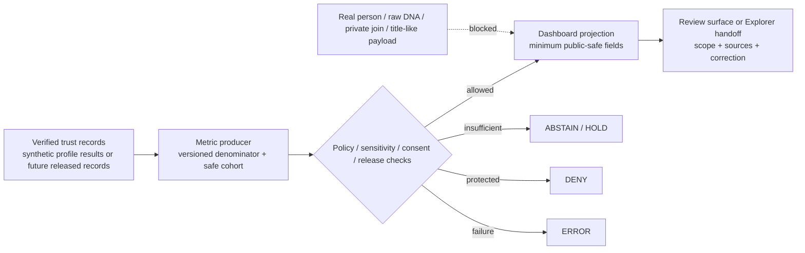

<!-- [KFM_META_BLOCK_V2]
doc_id: kfm://doc/dashboards-domain-people-dna-land
title: People, Genealogy, DNA, and Land Ownership Dashboard Specification
type: dashboard-spec; domain-health; boundary-compact; restricted-domain
version: v1.0
status: repository-grounded; specification-only; placement-hold; T4-baseline-projection; policy-evaluator-unbound; runtime-needs-verification; non-release; non-publication
owners:
  - "@bartytime4life — CONFIRMED CODEOWNERS review route only"
owner_status: >-
  People/DNA/Land, living-person privacy, genealogy, genomic/DNA, consent and
  revocation, land/title, source/evidence, policy, metric/observability, UI,
  correction, release, rights-holder or sovereignty, and independent-review
  stewardship assignments remain NEEDS VERIFICATION.
created: 2026-05-26
updated: 2026-08-21
policy_label: restricted-review; documentation; people-dna-land; dashboard-spec; cite-or-abstain; fail-closed
truth_posture: cite-or-abstain
owning_root: docs/
responsibility: >-
  Specify the human-facing People, Genealogy, DNA, and Land Ownership
  domain-health dashboard contract: which governed and safely aggregated
  signals may be summarized, how evidence, source roles, consent, sensitivity,
  policy, finite outcomes, correction, withdrawal, and rollback remain visible,
  and which negative cases prevent a positive dashboard posture.
authority: >-
  Documentation and review guidance only. This file does not establish a
  person, relationship, DNA/genomic finding, consent state, parcel boundary,
  land title, ownership interest, source admission, policy decision, metric
  result, release, deployment, or public claim.
current_path: docs/dashboards/domain/people-dna-land.md
placement_status: >-
  CONFIRMED existing path under the canonical docs/ responsibility root; HOLD
  as part of the unadmitted docs/dashboards/ direct-child lane recorded by the
  repository-grounded parent README.
runtime_status: >-
  NEEDS VERIFICATION — a domain workflow and two bounded no-network synthetic
  validation profiles exist, but no dashboard route, metric producer, telemetry
  feed, accepted policy evaluator, proof or release producer, deployed panel, or
  production People/DNA/Land data path was verified in this change.
truth_labels: >-
  CONFIRMED current target bytes, parent dashboard boundaries, repository
  review route, domain/contract/schema/policy/UI documentation, three bounded
  fixture-profile schemas, two substantive validators, two substantive
  no-network test modules, the domain workflow, and explicit proof/release holds
  / PROPOSED indicator definitions, metric queries, denominators, thresholds,
  safe cohorts, panel composition, owner assignments, review cadence, and
  future runtime bindings / CONFLICTED direct Rego result polarity and package
  namespaces, schema-index inventory versus current concrete fixture schemas,
  and domain-segment spellings across responsibility roots / UNKNOWN real
  subject data, production consent or revocation state, effective policy
  evaluation, source-rights currency, public-safe transformations, dashboard
  runtime, release parity, correction propagation, and rollback execution /
  NEEDS VERIFICATION every positive health claim until its input records,
  denominator, time window, aggregation or redaction boundary, policy state,
  evidence closure, review state, and release state are proven.
evidence_snapshot:
  repository: bartytime4life/Kansas-Frontier-Matrix
  base_ref: main
  base_commit: 2f730283b19f1b82245fac0087752e7f26761ce5
  target_prior_blob: cfd63497e182f67ced50aac3fa3dae6cdae84164
  dashboards_parent_blob: 8600c0ac09452b4b03e5f60b94f1eb27c072b5db
  domain_parent_blob: 48621badd51614db7bff0882c19096fa388234ac
  dashboard_catalog_prior_blob: 3b9ee1b34a8278fbabe04145a99a37e4d6214838
  codeowners_blob: dd2a84aa514d8ecd9208bc347f90f9a2ed37dd61
  directory_rules_blob: fd49a0b83e55cef52c1124281f093e263526898d
  adr_0029_blob: a4de0d7a96b78da59cfc499d1025e1508afd8dd9
  domain_docs_readme_blob: 19a3ea59bab2d5e04c73f402a35048c1a55ab071
  contracts_readme_blob: d99e7fc318f34fbeb90a1ee31658f5121b8ffd38
  schema_readme_blob: fbe5557ff4e19d1b70a97d284ab1743dd3d08f29
  consent_overlay_schema_blob: dbb3d8cd6310ee4534c4180dafc288f941e82dfd
  policy_readme_blob: 7260394c77d79629895da16d8d680e8d80c56b32
  domain_workflow_blob: bcf64c3e3b6653b9543489fc5a6031805ae3ef48
  generated_receipt_schema_blob: fba21ed27ebccf1362fe397fe0c3ebd85e072685
inspection_boundary: >-
  Current-session GitHub reads covered the complete prior dashboard
  specification, parent dashboard README and domain template, dashboard catalog,
  CODEOWNERS, accepted Directory Rules decision, People/DNA/Land domain and
  sensitivity documentation, contract and schema lanes, concrete bounded
  consent-overlay schema, domain policy inventory and maturity statement, test
  and fixture inventory, the domain workflow, proof and release holds, Explorer
  feature README, and generated-receipt contract. No real person, genealogy,
  DNA/genomic, consent, revocation, parcel, deed, title, assessor, tax, or
  private person-land payload was opened. No production source request, policy
  evaluation, metric query, telemetry store, browser session, dashboard route,
  released carrier, correction cascade, cache invalidation, or rollback drill
  was exercised.
related:
  - docs/dashboards/README.md
  - docs/dashboards/domain/README.md
  - docs/dashboards/DASHBOARD_CATALOG.md
  - docs/dashboards/INDICATOR_CATALOG.md
  - docs/domains/people-dna-land/README.md
  - docs/domains/people-dna-land/SENSITIVITY.md
  - docs/domains/people-dna-land/SENSITIVITY_PROFILE.md
  - docs/domains/people-dna-land/DNA_HANDLING.md
  - docs/domains/people-dna-land/LAND_OWNERSHIP.md
  - docs/doctrine/directory-rules.md
  - docs/adr/ADR-0029-adopt-directory-governance-standard-v2.md
  - contracts/domains/people-dna-land/README.md
  - contracts/domains/people-dna-land/consented_genealogy_overlay.md
  - contracts/domains/people-dna-land/consent_revocation_propagation_assessment.md
  - schemas/contracts/v1/domains/people-dna-land/README.md
  - schemas/contracts/v1/domains/people-dna-land/consented_genealogy_overlay.schema.json
  - schemas/contracts/v1/domains/people-dna-land/genealogy_overlay_revocation_manifest.schema.json
  - schemas/contracts/v1/domains/people-dna-land/consent_revocation_propagation_assessment.schema.json
  - policy/domains/people-dna-land/README.md
  - policy/consent/people-dna-land/README.md
  - fixtures/domains/people-dna-land/README.md
  - tests/domains/people-dna-land/consent/revocation/test_consent_overlay_safety.py
  - tests/domains/people-dna-land/consent/revocation/test_consent_revocation_propagation_assessment.py
  - tools/validators/domains/people-dna-land/validate_consent_overlay.py
  - tools/validators/domains/people-dna-land/validate_consent_revocation_propagation_assessment.py
  - .github/workflows/domain-people-dna-land.yml
  - apps/explorer-web/src/features/domains/people_dna_land/README.md
  - data/proofs/people-dna-land/README.md
  - release/candidates/people-dna-land/README.md
tags: [kfm, dashboards, people-dna-land, living-person, genealogy, dna, genomic, consent, revocation, land-title, evidence, sensitivity, correction, rollback, specification]
notes:
  - "v1.0 replaces the May 2026 proposal-only dashboard text with a current-main repository reconciliation at the same path."
  - "The prior fixed 100 percent, greater-than-99.9 percent, target-zero, and quarterly claims are removed because no accepted metric producer, denominator, safe cohort, SLO, incident taxonomy, or runtime feed was verified."
  - "The documented T4 baseline is retained as a strong default posture, but this specification distinguishes that posture from an accepted and bound policy evaluator."
  - "The two executable profiles remain synthetic, no-network, consent-focused, non-release proofs; they do not establish real identity, kinship, DNA, consent legal sufficiency, title, public safety, or publication."
  - "Legacy section anchors are retained for inbound-link compatibility."
[/KFM_META_BLOCK_V2] -->

# People, Genealogy, DNA, and Land Ownership Dashboard Specification

> **One-line purpose.** Define a reviewable People/DNA/Land domain-health dashboard contract without letting a dashboard, metric, workflow, consent token, map, parcel, tree import, or generated answer become identity, kinship, genomic, consent, title, boundary, release, or publication authority.

  
  
  
  
  
  
  

> [!IMPORTANT]
> **A dashboard is a downstream carrier.** It may summarize verified, policy-safe, aggregation-safe records about evidence, consent, validation, review, release, correction, and rollback. It cannot establish a person, relationship, DNA result, consent, title, parcel boundary, source authority, or public-use decision.

> [!CAUTION]
> **A metric can disclose the protected fact it claims to summarize.** Subject counts, small cohorts, relationship graphs, exact residence or parcel dimensions, DNA/consent status, denial reasons, filtered exports, error text, trace attributes, caches, and AI context can reveal existence or identity. Upstream minimization, approved aggregation or redaction, policy review, and anti-reconstruction proof must precede rendering; client-side hiding is not a control.

> [!WARNING]
> **The current executable slice is synthetic and deliberately non-releasable.** The domain workflow runs two bounded, no-network consent profiles. It does not validate real people, identity, kinship, genomic findings, consent legal sufficiency, source rights, land title, public-safe transformation, production policy, proof production, release, withdrawal execution, cache invalidation, or publication.

**Quick navigation:** [Status](#status-and-evidence-boundary) · [Scope](#1-domain-scope) · [Repo fit](#repository-fit-and-authority) · [Maturity](#current-repository-maturity) · [Metric contract](#measurement-contract) · [Indicators](#2-indicator-subset) · [Domain signals](#3-domain-specific-indicators-proposed) · [Source roles](#source-role-and-claim-anti-collapse) · [Sensitivity](#sensitivity-rights-consent-and-side-channel-boundary) · [Outcomes](#finite-outcomes-and-negative-states) · [Implementation](#5-implementation-pointer) · [Validation](#validation-and-negative-proof) · [Review](#4-ownership) · [Open work](#7-open-questions) · [Evidence](#8-evidence-basis--citations) · [Rollback](#correction-withdrawal-and-rollback)

---

## Status and evidence boundary

| Surface | Current repository-grounded state | Safe interpretation |
|---|---|---|
| This specification | Existing tracked file; prior blob `cfd63497e182f67ced50aac3fa3dae6cdae84164` | Same-path documentation modernization only |
| Dashboard lane | Parent path, category lane, and catalog exist | Path `CONFIRMED`; nested-lane placement `HOLD`; no runtime inferred |
| Domain documentation | Substantive People/DNA/Land doctrine, boundary, sensitivity, DNA, land, consent, API, map/UI, and backlog documents exist | Strong planning and doctrine surface; not production data or enforcement proof |
| Review routing | Repository-wide CODEOWNERS routes review to `@bartytime4life` | GitHub routing only; not stewardship, independent review, policy approval, or release authority |
| Semantic contracts | Parent contract lane and bounded consent/revocation profiles exist | Meaning and synthetic proof scope; not identity, consent, title, or release authority |
| Machine schemas | The workflow references three closed, fixture-profile schemas; the parent schema README still says no concrete schemas were confirmed | Concrete bounded shapes are present; parent index drift requires a separate correction; no complete domain schema family inferred |
| Domain policy | Seven direct proposed Rego scaffolds exist with inconsistent `allow`/`deny` result polarity and no operative rules; evaluator is unbound | Sensitive filenames and defaults do not prove active fail-closed enforcement |
| Synthetic validation | Two substantive validators and two substantive test modules exercise two frozen, no-network profiles; the policy README records 25 deterministic tests | Bounded consent/revocation fixture proof only |
| Proof and release | Domain workflow explicitly holds proof and release because accepted producers are absent | No People/DNA/Land proof pack, release candidate approval, or public carrier is established |
| Explorer feature | `apps/explorer-web/.../people_dna_land/README.md` exists | Feature boundary only; route, panel, adapter, governed envelope, telemetry, and deployment remain unverified |
| Dashboard runtime | No dashboard route, metric producer, safe aggregation service, telemetry feed, or deployed panel was verified | Runtime `NEEDS VERIFICATION` |
| Public release | No public People/DNA/Land dashboard release or publication evidence was verified | Publication effect: none |

### Truth posture

- **CONFIRMED:** repository paths and bytes named in the evidence snapshot; the dashboard lane boundary; CODEOWNERS route; inspected domain, contract, schema, policy, fixture, test, validator, workflow, proof/release-hold, and Explorer documentation.
- **PROPOSED:** indicators, formulas, denominators, safe cohorts, thresholds, metric queries, panels, routes, owner assignments, review cadence, and any future dashboard composition.
- **CONFLICTED:** direct Rego outcome polarity and package namespaces; `people`, `people-dna-land`, and `people_dna_land` segment spellings across responsibility roots; schema-index text versus the current concrete fixture schemas.
- **UNKNOWN:** real subject records, source-rights currency, production consent or revocation, effective policy decisions, telemetry, dashboard access controls, public-safe transforms, correction propagation, cache invalidation, release, deployment, and public parity.
- **NEEDS VERIFICATION:** every positive health state, every public metric, every threshold, and every statement that an upstream control is active.
- **HOLD:** live-source activation, real-person processing, public genomic or consent signals, private person-parcel joins, title-like conclusions, metric publication without anti-reconstruction proof, proof/release production, deployment, and publication.

[Back to top](#top)

---

## 1. Domain scope

This specification covers the **governance and delivery health** of the People, Genealogy, DNA, and Land Ownership bounded context, including:

- assertion-first person and name evidence, identity candidates, life/residence/migration events, and genealogy relationships;
- consent-scoped and revocation-aware use of restricted DNA-derived summaries, never raw genomic material or identifying vendor data;
- land instruments, ownership assertions and intervals, chain-of-title gaps, assessor/tax context, parcel versions, and legal-description evidence without converting administrative or geometric records into title truth;
- source admission, rights, temporal state, evidence resolution, validation, policy, review, release, correction, withdrawal, revocation propagation, and rollback posture;
- public-safe or restricted dashboard projections only after upstream controls and audience boundaries close.

It does **not** own:

| Excluded responsibility | Owning surface or disposition |
|---|---|
| Person, identity, relationship, DNA, consent, title, ownership, or parcel-boundary truth | Admitted sources, evidence objects, accepted semantic contracts, qualified authorities, and accountable review |
| Machine object shape | Accepted People/DNA/Land schema lane |
| Allow, deny, restrict, abstain, consent, and sensitivity decisions | Accepted policy bundle and bound evaluator |
| Real subject records, DNA/genomic material, deeds, parcels, assessor/tax rows, or consent credentials | Governed lifecycle and restricted stores; never this public documentation lane |
| Metric computation, aggregation, redaction, queries, routes, panels, access control, and telemetry | Governed implementation and operations roots |
| Promotion, release, correction, withdrawal, revocation execution, and rollback | Distinct release and accountability object families |
| Public People/DNA/Land claims | Released, evidence-backed, policy-safe claims served through governed interfaces |

A dashboard may report a verified upstream state. It must not become the state machine, evaluator, source registry, evidence resolver, consent service, title authority, or release gate it visualizes.

[Back to top](#top)

---

## Repository fit and authority

The current file remains under the existing `docs/` responsibility root. Accepted [ADR-0029](../../adr/ADR-0029-adopt-directory-governance-standard-v2.md) adopts the exact [Directory Rules v2](../../doctrine/directory-rules.md) bytes; those rules make `docs/` the human explanation surface and require responsibility boundaries to remain visible.

| Repository surface | Relationship to this specification | Current posture |
|---|---|---|
| [`docs/dashboards/README.md`](../README.md) | Parent dashboard-lane boundary | Repository-grounded; nested-lane placement `HOLD` |
| [`docs/dashboards/domain/README.md`](./README.md) | Per-domain specification index and legacy template | Present; proposal-era thresholds and maturity claims need later reconciliation |
| [`DASHBOARD_CATALOG.md`](../DASHBOARD_CATALOG.md) | Human dashboard-spec inventory | Updated with this specification; not metric or runtime authority |
| [`INDICATOR_CATALOG.md`](../INDICATOR_CATALOG.md) | Human indicator mirror | Documentation only; no accepted People/DNA/Land metric contract inferred |
| [`docs/domains/people-dna-land/`](../../domains/people-dna-land/README.md) | Domain doctrine and bounded-context documentation | Rich but mixed proposal/current-evidence posture; does not replace contracts, schemas, policy, or evidence |
| [`contracts/domains/people-dna-land/`](../../../contracts/domains/people-dna-land/README.md) | Semantic meaning and bounded fixture profiles | Draft/restricted-review; no universal authority |
| [`schemas/contracts/v1/domains/people-dna-land/`](../../../schemas/contracts/v1/domains/people-dna-land/README.md) | Machine-shape lane | Parent index is stale about concrete schemas; current accepted family coverage remains incomplete |
| [`policy/domains/people-dna-land/`](../../../policy/domains/people-dna-land/README.md) | Domain admissibility-policy boundary | Repository-grounded mixed-maturity lane; evaluator unbound |
| [`policy/consent/people-dna-land/`](../../../policy/consent/people-dna-land/README.md) | Consent-policy boundary | Presence confirmed by workflow; production binding unverified |
| [`fixtures/domains/people-dna-land/`](../../../fixtures/domains/people-dna-land/README.md) | Synthetic examples | Two accepted synthetic profiles; other fixture lanes are placeholders |
| [`tools/validators/domains/people-dna-land/`](../../../tools/validators/domains/people-dna-land/README.md) | Domain validators | Exactly two substantive validators are workflow-wired; broader coverage held |
| [`domain-people-dna-land.yml`](../../../.github/workflows/domain-people-dna-land.yml) | Bounded domain CI | Executes two synthetic no-network profiles; proof/release remain held |
| [`apps/explorer-web/.../people_dna_land/`](../../../apps/explorer-web/src/features/domains/people_dna_land/README.md) | Candidate restricted/public-safe UI feature boundary | README confirmed; route, panel, adapter, dashboard, and telemetry unknown |
| [`data/proofs/people-dna-land/`](../../../data/proofs/people-dna-land/README.md) | Proof accountability lane | README boundary only; emitted proof files held |
| [`release/candidates/people-dna-land/`](../../../release/candidates/people-dna-land/README.md) | Candidate release lane | Documentation/hold boundary; no approved release producer |

The target is an existing tracked file under `docs/`; therefore the smallest sound placement decision is **same-path modernization**. This change creates no new root, lane, schema home, policy home, source registry, data store, proof home, or release home.

[Back to top](#top)

---

## Current repository maturity

### Confirmed bounded implementation

The current repository proves a narrow, synthetic consent/revocation slice:

1. a semantic contract for a consented genealogy overlay candidate;
2. a closed fixture-profile schema and a revocation-manifest schema;
3. a consent-revocation propagation assessment schema;
4. two fixture roots containing repository-owned synthetic payloads;
5. two substantive validators;
6. two substantive test modules whose policy README records 25 deterministic tests;
7. a five-minute, contents-read, no-network domain workflow;
8. explicit workflow checks that keep all other test, validator, and fixture material classified as placeholders or held;
9. explicit proof and release jobs that fail closed when new material appears without an accepted producer and review path.

That is meaningful implementation evidence for the **declared synthetic profiles only**. It is not evidence of:

- real-person, genealogy, DNA/genomic, consent, revocation, deed, parcel, title, assessor, tax, or person-land processing;
- legal sufficiency of consent or land evidence;
- a bound policy evaluator;
- source admission or EvidenceBundle closure;
- public-safe transformation or aggregation;
- production metrics or dashboard telemetry;
- proof production, release, deployment, or publication.

### Confirmed drift and holds

| Surface | Current finding | Dashboard treatment |
|---|---|---|
| Policy result grammar | Five direct deny-shaped modules default `deny := false`; two allow-shaped modules default `allow := false`; no operative rules | Display `POLICY_INTERFACE_CONFLICT` and `EVALUATOR_UNBOUND`, never `POLICY_HEALTHY` |
| Schema index | Parent README says no concrete schemas were confirmed, while the current workflow requires three concrete fixture-profile schemas | Display `INDEX_DRIFT`; correct the index in a separate same-path slice |
| Domain naming | Hyphenated, short, and underscore segments coexist by root | Display naming drift; do not create another alias |
| Source registry | Source-registry README exists; admitted real sources and rights currency were not verified here | Display `SOURCE_ADMISSION_UNKNOWN` |
| Proof producer | Workflow holds because no accepted producer or deterministic proof command exists | Display `PROOF_HOLD` |
| Release producer | Workflow preserves release hold | Display `RELEASE_HOLD` |
| Explorer feature | README exists, implementation inventory remains unverified | Display `UI_BOUNDARY_ONLY` |
| Dashboard | No route, producer, query, telemetry, or deployed surface verified | Display `DASHBOARD_RUNTIME_UNKNOWN` |

[Back to top](#top)

---

## Measurement contract

No indicator may receive a green, passing, complete, safe, or healthy state unless its record binds all fields below.

| Required field | Why it is mandatory |
|---|---|
| `metric_id` and `metric_version` | Prevents a renamed or redefined metric from inheriting an earlier result |
| Plain-language question and non-goals | Makes clear what the metric can and cannot prove |
| Numerator, denominator, exclusions, and zero-denominator behavior | Prevents percentages without a defined population |
| Observation window, event time, evaluation time, and freshness rule | Prevents stale or future-leaking status |
| Cohort, audience, precision, and aggregation/redaction transform | Prevents the metric itself from disclosing protected existence or identity |
| Source, evidence, contract, schema, validator, policy, review, and release references | Preserves the trust chain |
| Finite result and stable reason code | Prevents ambiguous “healthy” prose |
| Conflict, stale, withdrawal, revocation, and correction state | Keeps negative state visible |
| Correction target and rollback or invalidation reference | Makes a public or steward-visible result reversible |
| Metric producer, accountable owner, reviewer class, and independent-review requirement | Makes responsibility inspectable |
| Public-safe field allowlist and anti-reconstruction test reference | Prevents logs, filters, errors, exports, or joins from becoming side channels |

> [!IMPORTANT]
> **Do not use the prior fixed targets as current facts.** `100%`, `>99.9%`, “target zero,” and quarterly review are not accepted People/DNA/Land SLOs in the inspected repository. A future threshold requires an accepted metric contract, safe denominator, source of truth, policy binding, accountable owner, and negative proof.

[Back to top](#top)

---

## 2. Indicator subset

The following are **candidate dashboard questions**, not current metrics or accepted SLOs.

| Candidate indicator | What it may safely report | Required evidence before a positive state | Current state |
|---|---|---|---|
| Synthetic consent-overlay profile | Exact-head pass/fail for the bounded fixture profile and its deterministic identity/revocation checks | Workflow run bound to commit, validator versions, fixture digests, schema versions, and no-network proof | `CONFIRMED profile exists`; latest run outcome `NEEDS VERIFICATION` |
| Synthetic revocation-propagation assessment | Whether the declared synthetic surfaces and receipts satisfy the frozen assessment | Exact-head run, manifest/case digest, validator/test versions, and declared non-effects | `CONFIRMED profile exists`; execution-to-dashboard feed `UNKNOWN` |
| Executable-boundary inventory | Whether only the two reviewed validators, two reviewed tests, and two reviewed fixture roots are substantive | Workflow inventory result at exact head | `CONFIRMED workflow check`; telemetry producer absent |
| Policy evaluator binding | Whether an accepted bundle, selector, normalized input, decision grammar, evaluator, and consumer are bound | Accepted contract/policy package, native tests, decision receipts, and runtime proof | `HOLD / evaluator unbound` |
| Proof readiness | Whether an accepted proof schema, producer, command, and independently reviewed artifact exist | Producer contract, deterministic command, synthetic fixtures, proof validator, access control, review | `HOLD` |
| Release readiness | Whether evidence, policy, review, proof, correction, withdrawal, and rollback gates close | Approved release records and public-safe carrier proof | `HOLD` |
| Schema and documentation parity | Whether current concrete bounded schemas are indexed and linked without parallel authority | Current schema inventory, contract pairing, fixture/validator/test links, reviewed path decision | `DRIFT / NEEDS VERIFICATION` |
| Source-admission posture | Whether each source has current role, rights, consent applicability, sensitivity, cadence, and correction behavior | Admitted source records and current rights review | `UNKNOWN` |
| Unsupported-claim incident posture | Whether a verified identity, kinship, genomic, title, boundary, or ownership claim escaped required evidence/policy gates | Accepted incident taxonomy, reviewed event records, safe aggregation, denominator, correction state | Metric `PROPOSED`; any confirmed occurrence is a defect, not a tolerable success rate |
| Sensitive-metric side-channel posture | Whether dashboard dimensions, filters, counts, exports, logs, and AI context resist reconstruction | Approved transform, minimum safe cohort or alternative disclosure rule, adversarial tests, reviewer approval | `NOT_RUN` |

A percentage is optional. A finite, evidence-bound state such as `HOLD`, `DENY`, `ABSTAIN`, `STALE`, `CONFLICTED`, or `NOT_MEASURED` is often safer and more honest for this lane.

[Back to top](#top)

---

## 3. Domain-specific indicators (proposed)

| Signal family | Safe dashboard posture | Required negative proof |
|---|---|---|
| Living-person exposure | Report only approved aggregate control state; never subject counts or existence signals below the accepted disclosure boundary | Living-person fields, exact residence, private relationships, and reconstructive filter combinations remain absent |
| DNA/genomic handling | Report fixture/profile and policy-binding posture; never raw material, kit/vendor IDs, segment data, match graphs, or subject consent state | Raw/segment-level material and identifying hashes never cross into dashboard payloads, logs, exports, caches, or AI context |
| Consent and revocation | Report whether the synthetic contract and future bound executor are current; do not expose who consented, refused, expired, or revoked | Revocation precedence, denial during uncertainty, downstream invalidation, and no stale cache replay |
| Genealogy assertions | Report evidence/review-system health at a safe aggregate; do not publish private relationship graphs or “canonical family” claims | Tree imports and generated relationships cannot become authoritative without source-scoped evidence and review |
| Land/title assertions | Report source-role and chain-gap control state; do not show person-parcel joins, ownership certainty, title conclusions, or exact disputed geometry | Assessor/tax records stay administrative, parcel geometry stays non-title, and chain gaps produce `ABSTAIN` or `DENY` |
| AI surface | Report finite-outcome and receipt-system posture only after a safe event taxonomy is accepted | No uncited identity, kinship, DNA, title, boundary, or living-person inference; model text never becomes evidence |
| Correction and withdrawal | Report whether reviewed corrections and revocations propagate through every declared derivative class | Withdrawn/revoked material cannot survive in API, map, tile, graph, index, cache, export, or AI context |
| Ownership and review | Report role-assignment completeness without exposing protected reviewer or rights-holder details | No positive state from placeholder roles, CODEOWNERS routing alone, or self-approval |

[Back to top](#top)

---

## Source-role and claim anti-collapse

| Input or carrier | Legitimate bounded role | Must never be treated as |
|---|---|---|
| `PersonAssertion`, `NameAssertion`, or life-event record | Source-scoped assertion about a person at a time | Automatic identity truth or public `PersonCanonical` |
| GEDCOM, family tree, vendor export, or generated relationship | Candidate/model input requiring rights, living-person, evidence, contradiction, and review controls | Kinship proof or source authority |
| DNA-derived synthetic summary | Restricted fixture-only profile for testing consent/revocation mechanics | Raw DNA, identity proof, kinship proof, medical finding, or public release |
| Raw genomic/segment/kit/vendor material | Restricted source material, if admitted under consent and rights | Dashboard input, log attribute, export, citation, or public carrier |
| Consent token or manifest | One bounded admissibility input with scope, audience, time, and revocation state | Evidence truth, rights clearance, review, release, or perpetual permission |
| Deed/title instrument | Evidence in a chain-of-title analysis | A KFM legal title opinion |
| Assessor or tax record | Administrative source role | Title, conveyance, ownership certainty, or legal boundary proof |
| Parcel geometry or legal-description projection | Spatial context with source/version limitations | Surveyed boundary or title truth |
| Policy decision | Admissibility result over explicit governed inputs | Person, relationship, genomic, consent, or title truth |
| Workflow/test/receipt | Evidence that named synthetic checks ran | Real-world correctness, production enforcement, release, or publication |
| Map, dashboard, graph, search index, or AI answer | Downstream carrier of released public-safe evidence | Sovereign truth or authority to reveal protected detail |

Every dashboard panel must preserve these distinctions in its labels, query contract, citation trail, and correction behavior.

[Back to top](#top)

---

## Sensitivity, rights, consent, and side-channel boundary

The lane carries a documented **T4 / deny-by-default baseline** for living-person, raw DNA/genomic, and private person-parcel material. Current repository evidence also says the machine projection is **PROPOSED**, the direct Rego interface is conflicted, and the evaluator is unbound.

Therefore the dashboard must distinguish:

| State | Meaning |
|---|---|
| `BASELINE_DOCUMENTED` | Domain and policy documentation require a strongest-default, fail-closed posture |
| `POLICY_SHAPE_PROPOSED` | Policy files or machine projections exist, but acceptance or semantic convergence is incomplete |
| `EVALUATOR_UNBOUND` | No accepted bundle/selector/evaluator/consumer chain is proven |
| `SYNTHETIC_PROFILE_VALIDATED` | A named fixture-only profile passed at a pinned commit; no real-world authority follows |
| `PUBLIC_SAFE_TRANSFORM_VERIFIED` | A reviewed transformation, safe cohort, anti-reconstruction proof, evidence, policy, and release record close |
| `PUBLIC_RELEASED` | A governed release exists; this state is not currently established for the dashboard |

### Prohibited metric dimensions

Unless an accepted policy and adversarial disclosure review explicitly permit them, do not expose:

- subject, kit, vendor, family, household, relationship, consent, revocation, deed, parcel, assessor, tax, owner, claimant, address, exact residence, or precise place identifiers;
- small-cell or complementary counts that reveal presence or absence;
- time slices narrow enough to isolate a person, family, transaction, or revocation;
- exact denial reasons that confirm protected record existence;
- raw policy inputs, consent scopes, token hashes, revocation references, source URLs with credentials, or protected evidence locators;
- query parameters, trace attributes, logs, error messages, tooltips, exports, caches, search facets, or AI prompts that reconstruct protected facts.

A dashboard “private” label, role check, or hidden chart does not replace upstream minimization and policy. Restricted reviewer surfaces still require purpose, audience, consent, evidence, policy, review, logging, correction, and revocation controls.

[Back to top](#top)

---

## Finite outcomes and negative states

| Outcome | Dashboard meaning | Required behavior |
|---|---|---|
| `ANSWER` | A safely aggregated, time-bounded governance-health statement is evidence-bound, policy-allowed, reviewed, and in the correct release state | Show scope, window, sources, metric version, limitations, and correction path |
| `ABSTAIN` | Denominator, evidence, source role, safe cohort, policy result, or temporal support is insufficient | Show a coarse non-sensitive reason; do not infer a value |
| `DENY` | The request, dimension, filter, export, or explanation would expose protected or reconstructive detail | Return no protected payload and no confirming side-channel |
| `ERROR` | Metric producer, resolver, evaluator, query, or downstream dependency failed | Fail closed; do not reuse stale positive state unless an accepted stale-state contract permits it |
| `HOLD` | Review, policy, proof, release, correction, revocation, or rollback prerequisites are incomplete | Keep the dashboard state visibly non-promotable |

`HOLD` is a governance state rather than one of the canonical four runtime envelope outcomes. A future implementation must map it deliberately without inventing a fifth public answer outcome.

[Back to top](#top)

---

## 5. Implementation pointer

### Confirmed repository surfaces

| Surface | Confirmed role | Limit |
|---|---|---|
| [`domain-people-dna-land.yml`](../../../.github/workflows/domain-people-dna-land.yml) | Runs two bounded synthetic no-network profiles and explicit proof/release holds | Not dashboard telemetry, production policy, or release proof |
| [`consented_genealogy_overlay.schema.json`](../../../schemas/contracts/v1/domains/people-dna-land/consented_genealogy_overlay.schema.json) | Closed fixture-only schema with `public_exposure: false` and `promotion_eligible: false` | Not a production overlay or consent record |
| [`genealogy_overlay_revocation_manifest.schema.json`](../../../schemas/contracts/v1/domains/people-dna-land/genealogy_overlay_revocation_manifest.schema.json) | Fixture revocation-manifest shape | Not a production revocation service |
| [`consent_revocation_propagation_assessment.schema.json`](../../../schemas/contracts/v1/domains/people-dna-land/consent_revocation_propagation_assessment.schema.json) | Synthetic dependency/receipt assessment shape | Does not execute cleanup or invalidation |
| [`validate_consent_overlay.py`](../../../tools/validators/domains/people-dna-land/validate_consent_overlay.py) | Substantive validator for the frozen overlay profile | Does not validate identity, consent law, or real data |
| [`validate_consent_revocation_propagation_assessment.py`](../../../tools/validators/domains/people-dna-land/validate_consent_revocation_propagation_assessment.py) | Substantive validator for the frozen assessment | Does not perform withdrawal or cache invalidation |
| [`policy/domains/people-dna-land/README.md`](../../../policy/domains/people-dna-land/README.md) | Repository-grounded policy boundary and maturity index | Evaluator, decision grammar, and production consumer remain unbound |
| [`apps/explorer-web/.../people_dna_land/README.md`](../../../apps/explorer-web/src/features/domains/people_dna_land/README.md) | Restricted/public-safe feature boundary | No verified route, panel, adapter, or dashboard |
| [`data/proofs/people-dna-land/README.md`](../../../data/proofs/people-dna-land/README.md) | Proof-lane boundary | No accepted proof producer or emitted proof established |
| [`release/candidates/people-dna-land/README.md`](../../../release/candidates/people-dna-land/README.md) | Candidate-release boundary | Release remains held |

### Proposed governed flow

This diagram is a proposed contract, not current runtime evidence.

### Implementation sequence

1. Ratify a dashboard metric-envelope contract and safe finite reason vocabulary.
2. Resolve the policy decision grammar and bind an accepted evaluator to synthetic inputs.
3. Define dashboard-safe aggregation, redaction, minimum-cohort or alternative disclosure controls and adversarial tests.
4. Emit metric records from the two existing synthetic workflow profiles without adding real subject data.
5. Build a fixture-only dashboard projection and prove `ANSWER`, `ABSTAIN`, `DENY`, `ERROR`, and review `HOLD`.
6. Add access, export, logging, cache, search, and AI-context negative tests.
7. Bind proof, correction, revocation, withdrawal, rollback, and release records.
8. Consider any live source or real subject only through a separate, rights- and consent-reviewed authorization.

No step authorizes the next automatically.

[Back to top](#top)

---

## Validation and negative proof

### Current executable proof

The existing domain workflow:

- uses read-only repository permissions and immutable action pins;
- executes with network denial for the two accepted profiles;
- confirms only the two reviewed test modules and two reviewed validators are substantive;
- rejects unreviewed fixture payloads outside the two accepted roots;
- runs known-invalid consent-overlay fixtures expecting rejection;
- checks deterministic identifiers, manifest membership, coarse synthetic place/time buckets, evidence references, active consent where the profile requires it, expiry/revocation precedence, and non-public governance flags;
- records explicit non-effects;
- keeps proof and release jobs on hold.

### Required dashboard negative cases

A future dashboard implementation must prove, using synthetic fixtures only until separately authorized:

| Case | Expected result |
|---|---|
| Missing denominator, metric version, or observation window | `ABSTAIN` |
| Missing evidence, source role, policy decision, review state, or release state | `ABSTAIN` or `HOLD` |
| Real or fixture payload includes living-person identifying fields | `DENY` |
| Raw DNA, segment data, kit/vendor ID, identifying hash, or private relationship graph enters metric payload/log/export/cache | `DENY` |
| Consent is absent, expired, revoked, out of audience, out of purpose, or evaluator unavailable | `DENY` or `ERROR`, fail closed |
| Metric filter or count reveals protected record existence | `DENY` |
| Assessor/tax record is labeled ownership or title | `DENY` |
| Parcel geometry is labeled legal/title boundary | `DENY` |
| Generated text asserts identity, kinship, genomic finding, title, ownership, or boundary without resolved evidence | `DENY` and incident/correction path |
| Revoked or withdrawn material persists in any declared derivative surface | `ERROR` plus withdrawal/correction escalation |
| Policy package polarity or namespace is conflicted | `HOLD`; no positive policy state |
| Proof or release producer remains absent | `HOLD`; no publication state |
| Dashboard query, evaluator, or telemetry dependency fails | `ERROR`; no unsupported fallback |

### Documentation checks for this change

This change is complete only when:

- one H1 and one KFM meta block remain;
- all quick-navigation and legacy anchors resolve;
- repository-relative links resolve at the pinned base;
- no fixed unadopted SLO or review cadence is presented as current;
- the dashboard catalog row matches the specification;
- no real-person, genomic, consent credential, private parcel, title, or sensitive payload is introduced;
- the generated authoring receipt binds the final target and catalog bytes;
- the pull-request diff contains only the direct dependency set.

[Back to top](#top)

---

## 4. Ownership

### Confirmed route

`@bartytime4life` is the only verified GitHub review route in current CODEOWNERS. That route is not proof of domain stewardship, independent review, policy approval, rights-holder representation, consent authority, or release approval.

### Roles requiring assignment

| Role class | Responsibility | Current state |
|---|---|---|
| People/DNA/Land domain steward | Domain semantics and bounded-context integrity | `NEEDS VERIFICATION` |
| Living-person privacy reviewer | Privacy, disclosure, and anti-reconstruction posture | `NEEDS VERIFICATION` |
| DNA/genomic reviewer | Genomic sensitivity and derived-summary boundaries | `NEEDS VERIFICATION` |
| Consent/revocation steward | Scope, audience, expiry, revocation, withdrawal, and invalidation semantics | `NEEDS VERIFICATION` |
| Genealogy/evidence steward | Assertion, relationship, contradiction, source-role, and evidence closure | `NEEDS VERIFICATION` |
| Land/title reviewer | Deed/title/assessor/tax/parcel role separation and legal-limit language | `NEEDS VERIFICATION` |
| Metric/observability steward | Metric contract, denominator, telemetry, query, and stale-state behavior | `NEEDS VERIFICATION` |
| Policy/validation steward | Decision grammar, package convergence, evaluator binding, fixtures, and tests | `NEEDS VERIFICATION` |
| UI/accessibility/security steward | Safe rendering, access, export, logs, errors, caches, and usability | `NEEDS VERIFICATION` |
| Correction/release steward | Correction, withdrawal, proof, release, rollback, and public parity | `NEEDS VERIFICATION` |
| Rights-holder, sovereignty, or independent reviewer | Independent review where source, cultural, community, consent, or release significance requires it | `NEEDS VERIFICATION` |

For policy-significant release, the author, policy/sensitivity reviewer, and release approver should be separated when project maturity supports it. This specification does not claim that separation is currently enforced.

[Back to top](#top)

---

## 6. Review cadence

No fixed review interval is established by current evidence. Review this specification when a material trigger occurs:

- a People/DNA/Land contract, schema, source, policy, consent, validator, test, workflow, proof, release, correction, revocation, or rollback surface changes;
- the policy result grammar or evaluator binding changes;
- a new metric, denominator, threshold, cohort, filter, export, or telemetry producer is proposed;
- source terms, rights, consent scope, sensitivity, public-use posture, or steward assignments change;
- an incident, dispute, correction, withdrawal, revocation, cache invalidation, or rollback occurs;
- the Explorer feature or a dashboard route becomes substantive;
- the dashboard-lane placement or domain-segment naming decision changes;
- a hosted exact-head result contradicts the documented maturity.

A periodic review interval may be adopted later through an accountable owner and metric/review contract. Until then, a date badge or elapsed time is not evidence that review occurred.

[Back to top](#top)

---

## 7. Open questions

| ID | Question | State | Closure evidence |
|---|---|---|---|
| `PDL-DASH-01` | What accepted metric-envelope contract governs IDs, versions, denominators, windows, safe cohorts, reason codes, correction, and rollback? | `NEEDS VERIFICATION` | Accepted contract/schema, fixtures, validator, tests, owner, and migration note |
| `PDL-DASH-02` | Which indicator catalog is authoritative, and how are proposal-era fixed thresholds retired or versioned? | `CONFLICTED / NEEDS VERIFICATION` | Dashboard/indicator authority decision and catalog reconciliation |
| `PDL-DASH-03` | What is the accepted People/DNA/Land policy result grammar, package namespace, bundle, selector, evaluator, and consumer? | `HOLD` | Converged policy contract, native tests, decision receipts, and runtime binding |
| `PDL-DASH-04` | Which aggregation, redaction, cohort, and anti-reconstruction rules permit any public or restricted metric dimension? | `NEEDS VERIFICATION` | Policy-approved transform, adversarial fixtures, review record, and field allowlist |
| `PDL-DASH-05` | Who holds the accountable and independent review roles listed above? | `UNKNOWN` | Verified assignments and review route |
| `PDL-DASH-06` | Where will the metric producer, dashboard projection, telemetry store, access control, and route live? | `UNKNOWN` | Current implementation, tests, and route/panel evidence |
| `PDL-DASH-07` | How are revocation, withdrawal, tombstoning, true erasure duties, graph/index/cache invalidation, and public correction distinguished and executed? | `NEEDS VERIFICATION` | Accepted runbook, executor, receipts, negative proof, and rollback drill |
| `PDL-DASH-08` | What event taxonomy defines an unsupported identity, kinship, genomic, title, boundary, or ownership claim without exposing protected existence? | `NEEDS VERIFICATION` | Incident contract, safe aggregate schema, tests, correction workflow |
| `PDL-DASH-09` | Which real sources, if any, are admitted with current rights, consent applicability, source role, cadence, and correction behavior? | `UNKNOWN` | Admitted source records and current rights review |
| `PDL-DASH-10` | When do proof and release producers graduate from explicit workflow holds? | `HOLD` | Accepted producers, commands, schemas, fixtures, validators, independent review, and rollback |
| `PDL-DASH-11` | How should the stale schema index and cross-root segment spellings be corrected without adding another authority path? | `NEEDS VERIFICATION` | Same-path index correction plus accepted naming/compatibility decision |
| `PDL-DASH-12` | Which dashboard states may be public, restricted-review, or internal, and what coarse reason classes are safe for each audience? | `NEEDS VERIFICATION` | Audience/access policy, UI contract, threat model, fixtures, and accessibility review |

[Back to top](#top)

---

## 8. Evidence basis and citations

### Governing and dashboard surfaces

- [Dashboards parent boundary](../README.md)
- [Per-domain dashboard lane](./README.md)
- [Dashboard catalog](../DASHBOARD_CATALOG.md)
- [Indicator catalog](../INDICATOR_CATALOG.md)
- [Accepted Directory Rules v2](../../doctrine/directory-rules.md)
- [ADR-0029 — adopt Directory Governance Standard v2](../../adr/ADR-0029-adopt-directory-governance-standard-v2.md)
- [CODEOWNERS](../../../.github/CODEOWNERS)

### Domain, contract, schema, and policy surfaces

- [People/DNA/Land domain landing doc](../../domains/people-dna-land/README.md)
- [Domain scope and sensitivity boundary](../../domains/people-dna-land/SENSITIVITY.md)
- [Sensitivity profile](../../domains/people-dna-land/SENSITIVITY_PROFILE.md)
- [DNA handling](../../domains/people-dna-land/DNA_HANDLING.md)
- [Land ownership boundary](../../domains/people-dna-land/LAND_OWNERSHIP.md)
- [Semantic contract lane](../../../contracts/domains/people-dna-land/README.md)
- [Consented genealogy overlay contract](../../../contracts/domains/people-dna-land/consented_genealogy_overlay.md)
- [Consent-revocation propagation assessment](../../../contracts/domains/people-dna-land/consent_revocation_propagation_assessment.md)
- [Domain schema index](../../../schemas/contracts/v1/domains/people-dna-land/README.md)
- [Closed consent-overlay fixture schema](../../../schemas/contracts/v1/domains/people-dna-land/consented_genealogy_overlay.schema.json)
- [Domain policy boundary](../../../policy/domains/people-dna-land/README.md)
- [Consent policy boundary](../../../policy/consent/people-dna-land/README.md)

### Validation, UI, proof, and release surfaces

- [Fixture lane](../../../fixtures/domains/people-dna-land/README.md)
- [Consent-overlay safety test](../../../tests/domains/people-dna-land/consent/revocation/test_consent_overlay_safety.py)
- [Consent-revocation assessment test](../../../tests/domains/people-dna-land/consent/revocation/test_consent_revocation_propagation_assessment.py)
- [Consent-overlay validator](../../../tools/validators/domains/people-dna-land/validate_consent_overlay.py)
- [Consent-revocation assessment validator](../../../tools/validators/domains/people-dna-land/validate_consent_revocation_propagation_assessment.py)
- [Domain workflow](../../../.github/workflows/domain-people-dna-land.yml)
- [Explorer People/DNA/Land feature boundary](../../../apps/explorer-web/src/features/domains/people_dna_land/README.md)
- [Proof-lane boundary](../../../data/proofs/people-dna-land/README.md)
- [Release-candidate boundary](../../../release/candidates/people-dna-land/README.md)

These references prove only the states supported by their current bytes and, where applicable, executable synthetic checks. They do not collectively prove production enforcement, real-world correctness, public safety, release, or publication.

[Back to top](#top)

---

## Correction, withdrawal, and rollback

### Documentation correction

If a repository change makes this specification stale:

1. mark the affected claim `STALE`, `CONFLICTED`, `UNKNOWN`, or `NEEDS VERIFICATION`;
2. preserve the prior evidence snapshot and explain what changed;
3. update the catalog row and generated authoring receipt in the same dependency-closed change;
4. do not upgrade runtime, policy, proof, release, deployment, or publication status without corresponding evidence;
5. revert this documentation packet if the correction cannot be completed safely.

### Future dashboard correction contract

A running dashboard must:

- withdraw or demote a positive state when evidence, consent, rights, policy, review, release, or metric inputs are revoked, stale, conflicted, or invalid;
- prevent protected details from surviving in traces, logs, exports, caches, screenshots, search facets, graph/index projections, tiles, or AI context;
- record the affected metric version, time window, derivative set, correction reason, and rollback/invalidation target;
- propagate a coarse, audience-safe correction state without confirming protected record existence;
- preserve lineage for reviewers while honoring any stronger erasure or access obligation in the accepted runbook.

This specification does not establish that executor or rollback path. Current correction propagation and rollback execution remain `UNKNOWN`.

[Back to top](#top)
