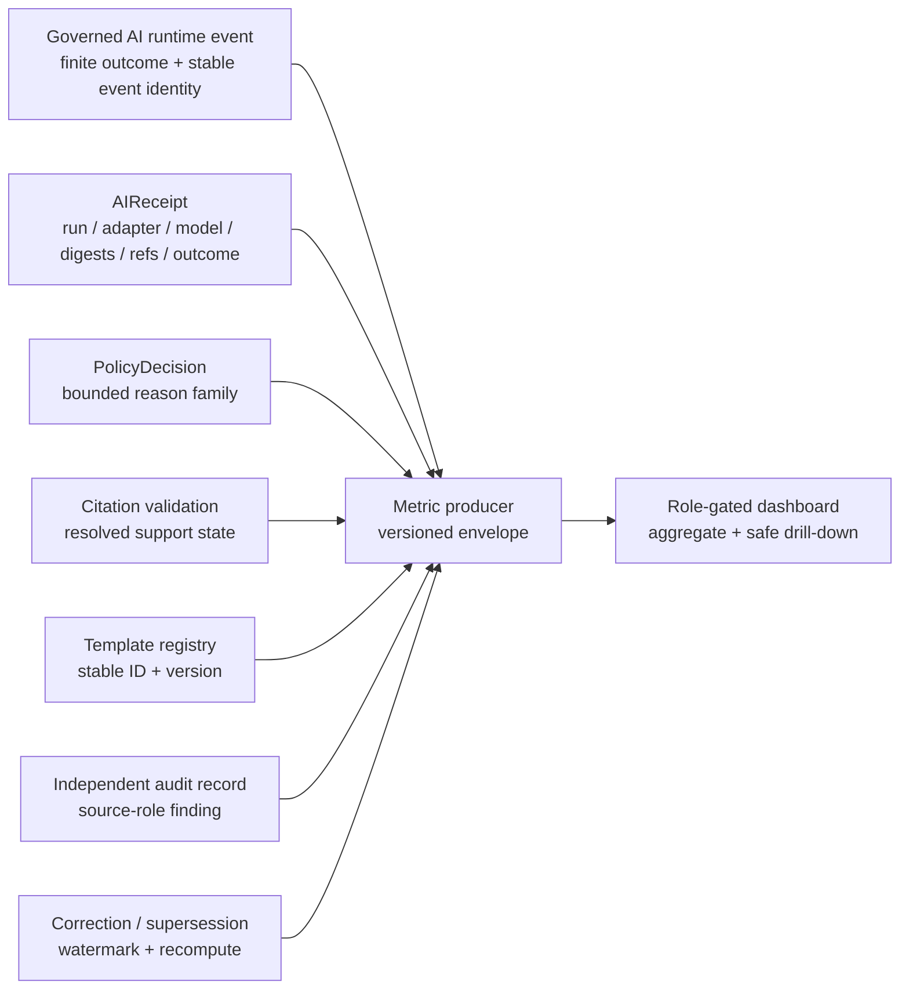

<!-- [KFM_META_BLOCK_V2]
doc_id: kfm://doc/dashboards-governance-ai-surface-health
title: AI Surface Health Dashboard Specification
type: dashboard-specification
version: v1.0.0
status: "draft; repository-grounded; specification-only; placement-hold; runtime-needs-verification; non-release; non-publication"
owners:
  - "@bartytime4life"
owner_status: "CONFIRMED GitHub review route through CODEOWNERS; AI-surface, evidence, citation, policy, privacy, observability, dashboard, release, and independent-review stewardship remain NEEDS VERIFICATION"
created: 2026-05-20
updated: 2026-08-22
policy_label: repository-facing
owning_root: docs/
responsibility: "Define a review-facing AI-surface health dashboard specification, measurement boundaries, finite display states, current repository evidence, safe drill-down rules, acceptance gates, correction behavior, and verification backlog without becoming AI, evidence, citation, policy, telemetry, review, release, or publication authority."
truth_posture: "CONFIRMED current repository evidence / PROPOSED metric contracts and panels / UNKNOWN runtime emission, production telemetry, deployed dashboard, release, and publication / cite-or-abstain"
current_path: docs/dashboards/governance/AI_SURFACE_HEALTH.md
placement_status: "CONFIRMED existing path under docs/; HOLD as part of the unadmitted docs/dashboards/ direct-child lane under accepted Directory Rules v2"
runtime_status: "NEEDS VERIFICATION — no AI-surface metric producer, query, route, deployed panel, production receipt stream, or operational review-console binding was verified"
evidence_snapshot:
  repository: bartytime4life/Kansas-Frontier-Matrix
  base_ref: main
  base_commit: 6aaea704230259e4fca30fcc0b9c1a168e12c2c2
  target_prior_blob: 8f30e04a53172098f08e7ced0a46a1ed425edbea
  dashboards_readme_blob: 02f891d4734b6d54ac36c4a9f7c4ba272585f167
  dashboard_catalog_blob: 82c7859b2782c13e97b1b3d3d55cdf35400fe675
  indicator_catalog_blob: 4fe3d6be5b0b6ba6359a301942c01d713c8e970f
  governance_readme_blob: 8f7dd5d42d4c1e2842e5d8f656b2f9c1fbe6cf73
  ai_receipt_contract_blob: 1e028525569b6032cd573e71d98df6b961fa70db
  ai_receipt_schema_blob: 2e0bebdb3a38acbc3c58a919db46970c6e829b4a
  ai_receipt_validator_blob: eb80e77aed15f478c32215c8f773f308a87a092a
  ai_receipt_valid_fixture_tree: 1e0ba1ece1c736075d086a899066434868ce1e21
  ai_receipt_invalid_fixture_tree: f07c6e14381f228994b5c03f2d637a301ac990d3
  governed_api_ai_readme_blob: cd38e803fa21262303ace292a1300e53a3e7ef7e
  mock_adapter_blob: 04d37e59b14c9e3b85126cb3380b6221b44e26d1
  model_adapters_readme_blob: cfc7a0979ee64041cb93e8140ea514f6ed6e262f
  ai_receipts_readme_blob: e2b8971c19ae6edd4f1e6a566eee2ec24d14becc
  review_console_readme_blob: 02512b6b8d16a8f1dfcd4c564f8b6d68b61b49e3
  codeowners_blob: dd2a84aa514d8ecd9208bc347f90f9a2ed37dd61
  directory_rules_blob: fd49a0b83e55cef52c1124281f093e263526898d
  adr_0029_blob: a4de0d7a96b78da59cfc499d1025e1508afd8dd9
inspection_boundary: "Current-session GitHub reads covered the complete predecessor, parent and governance dashboard lanes, both dashboard catalogs, AIReceipt contract/schema/validator/fixtures, governed-api AI source boundary, model-adapter inventory and deterministic MockAdapter, AI-receipt data lane, review-console inventory, accepted Directory Rules authority, CODEOWNERS, and open pull-request/task-branch overlap. No mounted checkout, repository-native command, production receipt stream, policy/citation resolver, metric producer, telemetry store, dashboard query, role-gated panel, deployed service, runtime log, release record, correction propagation, rollback drill, or public request was exercised."
related:
  - docs/dashboards/README.md
  - docs/dashboards/DASHBOARD_CATALOG.md
  - docs/dashboards/INDICATOR_CATALOG.md
  - docs/dashboards/governance/README.md
  - docs/doctrine/directory-rules.md
  - docs/adr/ADR-0029-adopt-directory-governance-standard-v2.md
  - docs/architecture/governed-ai/AI_RECEIPTS.md
  - docs/architecture/governed-ai/FOCUS_FLOW.md
  - contracts/runtime/ai_receipt.md
  - schemas/contracts/v1/runtime/ai_receipt.schema.json
  - tools/validators/validate_ai_receipt.py
  - fixtures/contracts/v1/runtime/ai_receipt/README.md
  - apps/governed-api/src/ai/README.md
  - runtime/model_adapters/MockAdapter.py
  - data/receipts/ai/README.md
  - apps/review-console/README.md
  - .github/CODEOWNERS
tags: [kfm, dashboards, governance, ai-surface-health, ai-receipt, finite-outcomes, abstain, deny, synthetic-claim, citation, evidence, policy, privacy, observability, correction, rollback]
notes:
  - "v1.0.0 replaces a corpus-only dashboard proposal with a current repository-grounded specification while preserving the four Atlas-derived indicator identities."
  - "The repository confirms an AIReceipt contract, paired schema, deterministic no-network validator, and bounded fixtures; it does not confirm a production AIReceipt emitter, eligible-event denominator, metric producer, dashboard query, route, deployed panel, or operational review workflow."
  - "The current AIReceipt schema has no template identifier, policy reason code, or synthetic-as-observed audit field. Those indicators require governed joins or independent audit records; this document does not amend the schema."
  - "Numeric healthy postures mirrored by the Indicator Catalog remain PROPOSED until an accepted metric contract defines population, window, null semantics, source authority, correction behavior, and accountable review."
  - "This revision changes documentation and its generated authoring provenance only."
[/KFM_META_BLOCK_V2] -->

<a id="top"></a>
<a id="ai-surface-health-dashboard--governanceai_surface_healthmd"></a>

# AI Surface Health Dashboard Specification

**Repository-grounded review specification for AIReceipt coverage, finite outcomes, policy-denial posture, citation support, and synthetic-as-observed audits.**


[Scope](#1-scope-and-authority-boundary) · [Evidence](#2-current-repository-evidence) · [Indicators](#3-indicator-contracts) · [Measurement](#4-measurement-envelope-and-finite-display-states) · [Flow](#5-signal-flow-and-governed-joins) · [Panels](#6-panels-and-review-interactions) · [Safety](#7-security-privacy-and-sensitivity-boundary) · [Ownership](#8-ownership-and-separation-of-duties) · [Build path](#9-implementation-boundary-and-smallest-safe-build-path) · [Validation](#10-validation-and-acceptance) · [Open work](#11-open-verification-register) · [Rollback](#12-maintenance-correction-and-rollback) · [Non-effects](#13-non-effects)

> [!IMPORTANT]
> **Current checkpoint.** The repository contains a draft `AIReceipt` semantic contract, a paired Draft 2020-12 schema, a deterministic no-network validator, two valid and three invalid JSON fixture candidates, a deterministic four-outcome `MockAdapter`, and documentation boundaries for governed API AI orchestration and AI receipt storage. No production AIReceipt emitter, eligible-response denominator, template registry join, policy-reason join, citation-report resolver, synthetic-claim audit stream, metric producer, dashboard query, AI-specific review-console panel, deployed dashboard, or public AI surface was verified.

> [!CAUTION]
> **A green AI dashboard does not make an answer true, safe, reviewed, released, or publishable.** `AIReceipt` is process accountability, not `EvidenceBundle`, `PolicyDecision`, citation validation, review, release, correction, rollback, or publication authority. The dashboard may report on those records only through governed, resolvable, policy-safe projections.

> [!WARNING]
> **Never expose prompts, raw retrieved evidence, model inputs or outputs, chain-of-thought, credentials, private endpoints, exact protected locations, living-person private data, or sensitive denial detail through a metric dimension or drill-down.** Aggregation and role-gated UI are not substitutes for upstream policy, redaction, and minimum-necessary disclosure.

> [!NOTE]
> `@bartytime4life` is the verified GitHub review route through `CODEOWNERS`. That route is not proof of AI-surface stewardship, policy approval, privacy review, independent review, release approval, or publication authority.

---

<a id="description"></a>

## 1. Scope and authority boundary

This document specifies a **system-wide, review-facing governance-health projection** for KFM AI-assisted surfaces. It preserves the four AI indicators mirrored from the Atlas lineage by [`INDICATOR_CATALOG.md`](../INDICATOR_CATALOG.md):

1. AIReceipt presence rate.
2. `ABSTAIN` rate by template.
3. `DENY` reason distribution.
4. Synthetic-claim incidence.

The specification defines what each indicator means, what must be known before it can be computed, which joins are admissible, which no-data and failure states must remain visible, which details must be withheld, and what current repository evidence does or does not prove.

### This document owns

- human-readable meaning for the AI-surface dashboard projection;
- the current repository evidence boundary for that projection;
- proposed metric envelopes, panel behavior, safe drill-down rules, and finite display states;
- review and acceptance expectations;
- an explicit verification backlog;
- correction and rollback guidance for this document.

### This document does not own

| Responsibility | Owning surface or decision | Boundary here |
|---|---|---|
| AIReceipt meaning | [`contracts/runtime/ai_receipt.md`](../../../contracts/runtime/ai_receipt.md) | This dashboard cannot add receipt fields or redefine receipt semantics. |
| AIReceipt machine shape | [Paired schema](../../../schemas/contracts/v1/runtime/ai_receipt.schema.json) | This dashboard cannot change required fields or outcome vocabulary. |
| Receipt validation | [`validate_ai_receipt.py`](../../../tools/validators/validate_ai_receipt.py) and fixtures | A passing validator proves only bounded shape and local consistency. |
| Evidence truth | `EvidenceRef` → `EvidenceBundle` and evidence validators | A receipt or chart cannot support a factual claim by itself. |
| Policy and denial | `PolicyDecision`, policy runtime, reason-code authority | This dashboard reports resolved outcomes; it does not permit or deny. |
| Citation validity | Citation-validation contract, resolver, and reports | `citation_validation_ref` is a reference, not proof that validation passed. |
| AI runtime orchestration | Governed API and runtime implementation roots | No route, emitter, model call, or runtime behavior is created here. |
| Metric production and telemetry | Accepted implementation/observability roots | Markdown is not a metric store, query engine, or telemetry source. |
| Reviewer UI | [`apps/review-console/`](../../../apps/review-console/README.md) or another accepted role-gated app | This document proposes behavior; it does not create a panel or route. |
| Release, correction, rollback, publication | `release/` and accountable review records | A dashboard cannot authorize the transition it visualizes. |

### Placement decision

Accepted ADR-0029 makes `docs/` the human-readable explanation root and adopts Directory Rules v2. The target is an existing tracked human specification under `docs/dashboards/governance/`; correcting it in place is a bounded same-path documentation change. The parent dashboard lane remains absent from the adopted canonical `docs/` direct-child map, so long-term lane placement stays **HOLD**. This update does not admit, move, rename, redirect, retire, or delete the lane.

[↑ Back to top](#top)

---

## 2. Current repository evidence

Repository presence establishes bytes and bounded executable shape. It does not establish a production service, operational metric, or public release.

| Surface inspected | Current observation | What is confirmed | What remains unproved |
|---|---|---|---|
| This target | Existing 5,465-byte draft proposal at prior blob `8f30e04…`. | The path and predecessor exist. | No implementation follows from the predecessor. |
| Dashboard parent and catalogs | Parent README catalogs 33 specs and labels runtime unverified; the dashboard catalog lists this file; the indicator mirror retains four AI indicators. | Documentation inventory and indicator lineage. | Running panels, metric producers, telemetry, accepted thresholds, and machine parity. |
| `AIReceipt` contract | Draft v0.2 contract defines accountable trace semantics and four finite runtime outcomes. | Receipt meaning exists as a proposed contract. | Runtime emission, persistence, reference resolution, operational adoption, and release coupling. |
| AIReceipt schema | Requires `id`, `run_id`, `adapter`, `model_ref`, input/output SHA-256 digests, policy and citation refs, and `outcome`; rejects extra properties. | Exact current proposed machine shape. | Template identity, denial reason, citation result state, audit classification, timestamps, and response identity are not fields in this schema. |
| AIReceipt validator | Deterministic, no-network shape/local-consistency validator with `PASS`, `FAIL`, and `ERROR`. | Bounded executable validation exists. | Evidence resolution, policy authenticity, citation authenticity, model approval, public-answer authorization, release, or publication. |
| AIReceipt fixtures | Two valid JSON candidates and three invalid JSON candidates with expected-error sidecars. | A small bounded fixture profile exists. | Domain breadth, all four runtime outcomes, runtime emitter parity, production data, or dashboard aggregates. |
| Governed API AI subtree | Contains `.gitkeep` and a detailed README only. | An app-local boundary is documented. | AI source modules, route handlers, policy/evidence/citation wiring, receipt handling, tests, logs, or deployment. |
| Model adapters | `MockAdapter.py` is deterministic and covers `ANSWER`, `ABSTAIN`, `DENY`, and `ERROR`; `OllamaAdapter.py` is a minimal placeholder-sized file. | A bounded mock selector exists. | The mock deliberately does not call a model, resolve evidence, evaluate policy, validate citations, or emit AIReceipt. Live-model fitness is unproved. |
| AI receipt data lane | Contains a README and documented atmosphere/flora child lanes. | Receipt-family documentation exists. | A repository-observed production corpus of AIReceipt instances, retention policy, query interface, signing, or completeness. |
| Review console | Contains README, minimal package metadata, source documentation, and documented feature lanes; no AI-surface feature was verified in the inspected tree. | A proposed review application boundary exists. | AI panel route, query, permissions, metric rendering, telemetry binding, tests, build, deployment, or access-control behavior. |
| CODEOWNERS | Routes repository review to `@bartytime4life`. | GitHub review routing. | Stewardship assignment, independent approval, policy decision, or release authority. |

### Bounded maturity summary

| Capability | Current status | Basis |
|---|---|---|
| Four indicator identities | `CONFIRMED` documentation lineage | Indicator and dashboard catalogs |
| Receipt semantics and shape | `CONFIRMED` bytes / `PROPOSED` adoption | Contract + schema |
| Shape/local-consistency validation | `CONFIRMED` executable code | Validator |
| Synthetic fixture profile | `CONFIRMED` bounded | 2 valid + 3 invalid JSON candidates |
| Deterministic finite-outcome mock | `CONFIRMED` bounded | `MockAdapter.py` |
| Runtime AI orchestration | `UNKNOWN` / `NEEDS VERIFICATION` | AI source subtree is documentation-only at the inspected checkpoint |
| Production AIReceipt emission | `UNKNOWN` | No emitter or instance stream verified |
| Metric computation | `NOT INSTRUMENTED` at this evidence boundary | No producer/query verified |
| Review-console AI panel | `UNKNOWN` / `NEEDS VERIFICATION` | No AI-specific feature/route verified |
| Release or public dashboard | `UNKNOWN`; not asserted | No release/deployment/public request exercised |

[↑ Back to top](#top)

---

<a id="indicators-surfaced"></a>

## 3. Indicator contracts

These are **PROPOSED metric contracts**, not implemented telemetry. The healthy postures mirrored in the indicator catalog remain proposals. A percentage, rate, rank, or trend must not appear until its eligible population, numerator, denominator, time window, source snapshot, null semantics, correction watermark, sensitivity treatment, and accountable reviewer are defined.

### 3.1 `AISH-01` — AIReceipt presence rate

**Question:** Among eligible governed-AI runtime responses, how many have one valid, resolvable, event-bound AIReceipt?

| Element | Proposed definition |
|---|---|
| Eligible population | Governed AI response events within the immutable measurement window that have a stable response/run identity and a finite outcome. Fixture-only records, docs examples, dry-run artifacts, retries explicitly marked non-final, and non-AI responses are excluded. |
| Numerator | Eligible events with exactly one schema-valid AIReceipt whose `run_id` and response linkage resolve to the measured event and whose artifact is not withdrawn, superseded without forward linkage, or outside retention. |
| Denominator | All eligible governed-AI response events, including `ANSWER`, `ABSTAIN`, `DENY`, and `ERROR`, unless an accepted metric contract narrows the population and states why. |
| Healthy posture | `100%` is the inherited **PROPOSED** target for consequential governed-AI events. A lower value is not silently rounded or hidden. |
| Required support | Runtime event registry or immutable envelope stream; AIReceipt store/index; schema validator result; event-to-receipt join; correction/supersession state. |
| Current state | `NOT_INSTRUMENTED`. The receipt contract/schema/validator/fixtures exist, but no production event denominator, emitter, instance corpus, or metric producer was verified. |

**Guardrails**

- File counts under `data/receipts/ai/` are not the denominator.
- A validator pass does not prove event linkage or runtime completeness.
- An `AIReceipt` attached after the measurement window must be reflected through a correction watermark, not silently backfilled.
- Duplicate, conflicting, or unresolved receipts produce `PARTIAL_COVERAGE` or `ERROR`; they are not counted as healthy.

### 3.2 `AISH-02` — `ABSTAIN` rate by template

**Question:** For each accepted Focus/governed-AI template identity, what share of eligible final outcomes is `ABSTAIN`, and why?

| Element | Proposed definition |
|---|---|
| Eligible population | Final governed-AI response events bound to a stable, versioned template identity and immutable measurement window. |
| Numerator | Eligible events with `outcome=ABSTAIN`, grouped by accepted template ID/version and bounded reason family. |
| Denominator | All eligible final events for the same template ID/version and window. |
| Healthy posture | No universal numeric target. Unusually low rates can indicate over-answering; unusually high rates can indicate evidence, scope, policy, source, or template defects. Review requires context. |
| Required support | Versioned template registry or runtime template reference; finite outcome; bounded abstention reason; evidence/citation/policy disposition; correction state. |
| Current state | `BLOCKED_BY_MISSING_JOIN`. The current AIReceipt schema has no template identifier and no abstention reason field. |

**Guardrails**

- Never infer a template from prompt text, model name, route string, user wording, or output content.
- Never expose prompt text as the grouping key.
- Separate `ABSTAIN` due to evidence insufficiency from policy `DENY`, runtime `ERROR`, cancellation, timeout, and user abandonment.
- A high abstention rate can be healthy when the template covers consequential or sparse-evidence questions.

### 3.3 `AISH-03` — `DENY` reason distribution

**Question:** Which policy reason families account for final governed-AI denials, by safe aggregation scope and time window?

| Element | Proposed definition |
|---|---|
| Eligible population | Final governed-AI events with `outcome=DENY` and a resolvable `policy_decision_ref`. |
| Numerator | Count of eligible denials grouped by an accepted public/reviewer-safe reason-code family. |
| Denominator | All eligible `DENY` events in the same measurement window. |
| Healthy posture | Stable and explainable. New or material spikes require review; no individual reason count is automatically “bad” without policy and workload context. |
| Required support | AIReceipt; resolvable PolicyDecision; accepted reason-code registry; policy version; caller/audience class at a safe aggregation level; correction state. |
| Current state | `BLOCKED_BY_UNVERIFIED_POLICY_JOIN`. The receipt stores a reference, not the denial reason. No production resolver or metric join was verified. |

**Guardrails**

- Do not parse reason codes from prose, logs, UI labels, or model output.
- Do not expose a reason whose detail would reveal a protected person, location, source, system weakness, or policy bypass condition.
- Unresolved policy refs remain visible as `UNRESOLVED_POLICY_REF`; they are not assigned to “other.”
- The distribution reports policy behavior; it does not evaluate whether the policy decision was correct.

### 3.4 `AISH-04` — Synthetic-as-observed incidence

**Question:** In an independently reviewed sample of eligible AI answers, how often is synthetic, modeled, inferred, reconstructed, or scenario material presented as direct observation or source fact?

| Element | Proposed definition |
|---|---|
| Eligible population | A reproducibly selected, reviewable sample of final `ANSWER` events with resolved evidence/citations, subject to an accepted audit protocol. |
| Numerator | Audited answers with a confirmed source-role or representation error that materially presents synthetic/modeled/inferred/reconstructed content as observed or directly sourced. |
| Denominator | Audited eligible answers, not all runtime events. Unaudited events are never assumed clean. |
| Healthy posture | Approaches zero; any confirmed material incident triggers triage, correction analysis, and possible withdrawal/rollback. |
| Required support | Immutable answer digest; resolved EvidenceBundle/citations; source-role registry; audit record; reviewer identity/role; finding severity; correction and disposition links. |
| Current state | `NOT_INSTRUMENTED`. The AIReceipt schema has no synthetic-claim field, and no independent audit record stream or sampling protocol was verified. |

**Guardrails**

- This is an **audit-derived** indicator, not a schema-native AIReceipt field.
- Automated classifiers may prioritize samples but cannot close the finding without an accepted review protocol.
- Synthetic material is not automatically prohibited; the defect is misrepresentation of its role or confidence.
- Audit samples and findings must not disclose restricted evidence, prompts, private user content, or sensitive locations.

### Cross-indicator anti-collapse

| Do not collapse | Why |
|---|---|
| Receipt presence and answer truth | Receipt coverage measures accountability plumbing, not factual correctness. |
| `ABSTAIN` and failure | Abstention can be the correct evidence-first outcome. |
| `DENY` and `ABSTAIN` | `DENY` is policy/admissibility; `ABSTAIN` is bounded inability to support an answer. |
| `ERROR` and denial | Operational failure must not masquerade as policy action. |
| Synthetic content and false content | Modeled or reconstructed content can be valid when correctly labeled and supported. |
| Fixture coverage and production coverage | Synthetic fixtures prove bounded behavior only. |
| Dashboard health and release readiness | No dashboard result authorizes release or publication. |

[↑ Back to top](#top)

---

## 4. Measurement envelope and finite display states

Every produced metric should be wrapped in an inspectable, versioned measurement envelope before a panel renders it.

### Minimum measurement fields

| Field | Purpose |
|---|---|
| `metric_id` and `metric_spec_version` | Bind the result to one accepted definition. |
| `as_of` and immutable `window_start` / `window_end` | Prevent an undated “current” claim. |
| `eligible_population_definition` | Explain what was counted and excluded. |
| `numerator`, `denominator`, `value`, and unit | Preserve arithmetic and avoid opaque percentages. |
| `dimensions` | Declare template, reason family, environment, surface, or audience groupings actually used. |
| `source_snapshot_refs` | Resolve the runtime/receipt/policy/audit snapshots used. |
| `producer_ref` and digest/version | Identify the computation implementation. |
| `completeness` | Quantify unresolved joins, excluded events, and late-arriving records. |
| `correction_watermark` | Show the newest correction/supersession applied. |
| `display_state` | One finite state from the table below. |
| `limitations` | Record known gaps without hiding them in tooltip-only prose. |

### Finite display states

These states describe **measurement availability**, not AI runtime outcomes.

| State | Meaning | Display rule |
|---|---|---|
| `MEASURED` | Eligible population, joins, producer, and window are complete enough for the accepted metric contract. | Show value, denominator, window, completeness, and source snapshot. |
| `NO_ELIGIBLE_EVENTS` | The accepted population is valid but empty for the window. | Show zero events, not 0% health. |
| `NOT_INSTRUMENTED` | Required emitter, store, query, or producer is absent or unverified. | Show instrumentation gap; never synthesize a value. |
| `PARTIAL_COVERAGE` | Some events or joins are missing, conflicted, late, or excluded. | Show partial result only with coverage and unresolved count. |
| `STALE_INPUT` | One or more required snapshots exceed an accepted freshness or correction tolerance. | Show stale state and last valid window; do not call it current. |
| `ACCESS_RESTRICTED` | The viewer is not entitled to the requested aggregate or drill-down. | Return a safe denial state without leaking restricted reason detail. |
| `ERROR` | Producer, resolver, schema, or query failed. | Fail closed; preserve incident reference and last known valid result separately. |

### Null and zero rules

- `0` means a measured count of zero under a complete accepted population.
- `0%` means numerator zero and denominator greater than zero.
- `NO_ELIGIBLE_EVENTS` is not `0%`.
- Missing receipt, policy, citation, template, audit, or correction joins are not zero.
- An unavailable producer is `NOT_INSTRUMENTED`, not “healthy.”
- An unresolved reference is not assigned to an “other” bucket without an accepted reason.
- Corrected data must produce a new measurement version or correction watermark; historical results remain traceable.

[↑ Back to top](#top)

---

<a id="inputs--receipts-and-records-read"></a>

## 5. Signal flow and governed joins

The dashboard should consume a **governed projection**, never scan canonical/internal receipt or evidence stores directly from a browser.



### Required join posture

| Join | Required behavior when unresolved |
|---|---|
| Runtime event → AIReceipt | `PARTIAL_COVERAGE`; preserve missing-event count. |
| AIReceipt → PolicyDecision | `UNRESOLVED_POLICY_REF` within a partial/error state; do not infer reason. |
| AIReceipt → Citation validation | Mark unresolved; do not treat `ANSWER` as citation-valid. |
| Runtime event → Template identity | Exclude from template rate only with explicit unresolved count; do not derive from prompt. |
| Answer/evidence → Audit record | Unaudited remains unaudited; do not count as clean. |
| Any source → Correction/supersession | Freeze or watermark the affected result until recomputation is complete. |

### Candidate source families

| Source family | Dashboard use | Authority limit |
|---|---|---|
| AIReceipt | Event accountability and finite outcome reference | Not factual evidence or release authority |
| Runtime response/event envelope | Eligible-event denominator and event identity | Must be governed and immutable enough for audit |
| PolicyDecision | Denial/admissibility reason | Policy authority remains outside the dashboard |
| Citation-validation report | Citation disposition and unsupported-claim state | Must resolve; reference alone is insufficient |
| Template registry/version | Stable per-template grouping | Prompt text is never a registry |
| Independent AI audit record | Synthetic-as-observed finding | Requires accountable review and sampling method |
| Correction/supersession records | Recompute and invalidate stale metrics | Dashboard cannot issue the correction |

[↑ Back to top](#top)

---

<a id="panels-proposed"></a>

## 6. Panels and review interactions

All panels are **PROPOSED**. No route or deployed component is asserted.

### 6.1 Instrumentation and coverage banner

Always render first.

Show:

- measurement state;
- as-of and immutable window;
- eligible event count;
- receipt/event/template/policy/citation/audit join coverage;
- producer version;
- correction watermark;
- last successful computation;
- active limitations.

A dashboard with no verified producer must lead with `NOT_INSTRUMENTED`, not four empty green cards.

### 6.2 AIReceipt coverage

Show:

- numerator, denominator, percentage, and unresolved/duplicate/conflicting receipt count;
- finite outcome breakdown;
- environment/surface dimensions only when accepted and safe;
- coverage trend by immutable window;
- correction/recompute state.

Safe drill-down may expose event/receipt identifiers, outcome, validation state, and safe timestamps to authorized reviewers. It must not expose prompt text, output text, raw evidence, chain-of-thought, or secrets.

### 6.3 `ABSTAIN` posture by template

Show only after stable template identity exists:

- final event count per template/version;
- `ANSWER` / `ABSTAIN` / `DENY` / `ERROR` distribution;
- bounded abstention reason families where an owning contract provides them;
- evidence/citation/policy gap trends;
- template-version comparison without combining incompatible versions.

Do not label a low abstention rate “good.” The panel supports review for over-answering and evidence gaps.

### 6.4 `DENY` reason distribution

Show:

- accepted safe reason families;
- unresolved policy-reference count;
- policy version and measurement window;
- material changes against a comparable prior window;
- restricted-reason suppression state.

A reason-code spike opens review; it does not prove policy failure or user misuse.

### 6.5 Synthetic-as-observed audit

Show:

- audit sample size and sampling protocol version;
- audited answer count;
- confirmed incident count and rate;
- severity/disposition;
- correction, withdrawal, or rollback linkage;
- unaudited population clearly separated.

Do not infer zero incidence from zero audits.

### 6.6 Trust-preserving interactions

| Interaction | Required behavior |
|---|---|
| Filter | Preserve metric-spec version, window, denominator, completeness, and correction watermark. |
| Compare | Permit only compatible metric and template versions; otherwise show `INCOMPARABLE`. |
| Export | Include as-of, definitions, source snapshots, limitations, and access classification. |
| Drill down | Role-gated, minimum necessary, audit-logged, and safe against side-channel disclosure. |
| Link to evidence | Route through governed resolver/projection; never direct browser access to internal stores. |
| Open correction | Create a candidate workflow only; dashboard does not decide or publish correction state. |
| Screenshot/share | Must retain visible status, as-of, limitations, and restricted-content posture. |

[↑ Back to top](#top)

---

## 7. Security, privacy, and sensitivity boundary

### Prohibited content

The metric producer, API projection, panel, logs, exports, and screenshots must not expose:

- prompts, system prompts, private user messages, or raw retrieved context;
- model inputs, raw model outputs, hidden reasoning, or chain-of-thought;
- credentials, tokens, signed URLs, private endpoints, hostnames, or internal network detail;
- full EvidenceBundle payloads or restricted source text;
- exact rare-species, archaeology, cultural, private-property, living-person, genomic, or critical-infrastructure details;
- protected policy reason detail that reveals a denied target, source, identity, or bypass condition;
- unsuppressed low-count dimensions that enable re-identification;
- raw error traces or provider diagnostics containing sensitive data.

### Required controls before an operational panel

- role and purpose-based authorization;
- policy-safe aggregation and dimension allowlist;
- minimum-necessary fields;
- suppression/generalization rules for small or sensitive cells;
- immutable audit reference for drill-down access;
- retention and deletion/correction policy;
- no prompt/output payload in routine telemetry;
- safe error and denial envelopes;
- negative tests for side channels, exports, URL parameters, screenshots, caches, and logs;
- incident, correction, withdrawal, and rollback procedures.

> [!IMPORTANT]
> Client-side hiding is not access control. A private-looking dashboard is not evidence that upstream projections are safe.

[↑ Back to top](#top)

---

<a id="ownership-and-review-burden"></a>

## 8. Ownership and separation of duties

| Responsibility | Accountable role needed | Current status |
|---|---|---|
| Repository review routing | `@bartytime4life` through CODEOWNERS | `CONFIRMED` route only |
| AI-surface indicator meaning | AI surface steward | `NEEDS VERIFICATION` |
| Evidence and citation support | Evidence/citation steward | `NEEDS VERIFICATION` |
| Policy reason taxonomy and safe disclosure | Policy steward | `NEEDS VERIFICATION` |
| Privacy, security, and sensitivity review | Privacy/security/sensitivity reviewer | `NEEDS VERIFICATION` |
| Metric producer and telemetry quality | Observability/metric steward | `NEEDS VERIFICATION` |
| Dashboard UX and accessibility | Review-console/UI steward | `NEEDS VERIFICATION` |
| Audit sampling and synthetic-claim adjudication | Independent AI/evidence reviewer | `NEEDS VERIFICATION` |
| Correction, withdrawal, rollback, release | Correction/release authority | `NEEDS VERIFICATION` |

A mature process should separate at least:

1. metric implementation from metric approval;
2. AI-surface operation from independent audit;
3. policy authorship from denial-distribution review;
4. dashboard presentation from release/publication authority;
5. authoring from accountable human review where consequences justify it.

No single owner, green indicator, test, pull request, merge, workflow, receipt, or dashboard can satisfy all duties.

[↑ Back to top](#top)

---

<a id="files"></a>

## 9. Implementation boundary and smallest safe build path

This document does not create implementation paths. New files require a current Directory Rules placement decision, owning-root confirmation, consumer check, and direct dependency review.

### Current candidate responsibility surfaces

| Responsibility | Existing surface | Current treatment |
|---|---|---|
| Human specification | This file under `docs/` | Existing path; same-path update |
| Receipt meaning/shape | Contract and schema linked above | Draft/proposed |
| Receipt validation | Existing no-network validator and fixtures | Bounded proof only |
| Governed runtime orchestration | Governed API AI subtree | Documentation boundary; implementation unverified |
| Model-independent proof | Deterministic `MockAdapter` | Synthetic selector only |
| Receipt process-memory lane | `data/receipts/ai/` | Documentation and layout uncertainty |
| Reviewer-facing application | `apps/review-console/` | Candidate role-gated consumer; AI panel unverified |
| Metric/telemetry implementation | Not verified | Placement and producer design required |

### Dependency-ordered build sequence

1. **Metric decision packet.** Accept or reject the four metric definitions, eligible populations, finite display states, source joins, sensitivity profile, correction behavior, and accountable roles.
2. **Fixture-only measurement slice.** Build a deterministic no-network candidate producer over safe synthetic runtime events, AIReceipts, policy/citation refs, template IDs, audit records, and corrections. It must exercise complete, partial, no-event, restricted, stale, and error states.
3. **Runtime event and receipt binding.** Add or verify stable event identity, AIReceipt emission, storage/indexing, and reference resolution without adding a browser-to-model path.
4. **Policy, citation, and template joins.** Resolve accepted object families; do not scrape prose or logs.
5. **Independent audit lane.** Define sampling, finding, severity, review, correction, and appeal behavior for synthetic-as-observed incidents.
6. **Read-only role-gated panel.** Render governed metric envelopes in the accepted review application with safe drill-down and accessibility tests.
7. **Correction and rollback proof.** Recompute affected windows, invalidate cached/exported derivatives, and prove rollback of the metric producer or panel without erasing history.
8. **Operational admission.** Only after review, policy, security/privacy testing, telemetry retention, incident response, and deployment evidence.

### Explicit non-goals for the first slice

- no live model or provider dependency;
- no public dashboard;
- no automatic policy approval;
- no raw prompt, model output, or EvidenceBundle storage in metrics;
- no schema amendment merely to make a chart easier;
- no promotion, release, deployment, publication, or source activation;
- no conclusion that fixture success proves production health.

[↑ Back to top](#top)

---

<a id="acceptance"></a>

## 10. Validation and acceptance

### Verified in this documentation run

| Check | Outcome |
|---|---|
| Complete predecessor read | `PASS` |
| Current main and exact target blob pinned | `PASS` |
| Parent lane, governance inventory, catalogs, Directory Rules, ADR, and CODEOWNERS inspected | `PASS` |
| AIReceipt contract, schema, validator, fixture inventory, governed API AI subtree, adapters, receipt data lane, and review-console inventory inspected | `PASS` |
| Open pull-request and task-branch overlap for the exact target | `PASS` — none found before mutation |
| Same-path placement treatment | `PASS` — parent `docs/` root retained; dashboard-lane placement remains `HOLD` |
| Runtime/dashboard implementation proof | `NOT ESTABLISHED` |
| Human review | `PENDING` |

### Repository-native checks for an implementation worktree

The following commands are appropriate to run from a mounted checkout; they are not represented as executed by this documentation-only connector session:

```bash
python tools/validators/validate_ai_receipt.py --fixtures

python tools/validators/docs/meta-block/check_meta_blocks.py \
  --repo-root . \
  --profile present \
  docs/dashboards/governance/AI_SURFACE_HEALTH.md
```

The full repository suite and hosted exact-head checks remain separate evidence.

### Specification acceptance matrix

| Criterion | Required result |
|---|---|
| Four indicator identities preserved | `PASS` |
| Metric definitions state population, numerator, denominator, window, joins, nulls, and correction posture | `PASS` |
| Missing template/reason/audit fields remain visible instead of invented | `PASS` |
| Receipt presence is not represented as truth or release readiness | `PASS` |
| Runtime outcomes and measurement states remain separate | `PASS` |
| `NO_ELIGIBLE_EVENTS`, `NOT_INSTRUMENTED`, partial, stale, restricted, and error states are explicit | `PASS` |
| Sensitive dimensions and drill-downs fail closed | `PASS` |
| Existing path and legacy anchors preserved | `PASS` |
| No route, panel, threshold, runtime, deployment, release, or publication is claimed without evidence | `PASS` |
| Accountable human review | `PENDING` |
| Production producer, telemetry, and panel evidence | `NEEDS VERIFICATION` |

### Operational acceptance gates

Before status can advance from specification-only:

- [ ] Stable governed-AI event identity and eligible denominator are accepted.
- [ ] AIReceipt emitter and event binding are verified end to end.
- [ ] Receipt storage/index, retention, correction, and query behavior are accepted.
- [ ] Template identity is stable and versioned.
- [ ] PolicyDecision and citation-validation references resolve through governed interfaces.
- [ ] Safe denial/abstention reason vocabularies are accepted.
- [ ] Independent synthetic-claim audit contract and sampling method are accepted.
- [ ] Metric producer emits deterministic, versioned envelopes and all finite display states.
- [ ] Role-gated UI, accessibility, export, cache, logging, and side-channel tests pass.
- [ ] Correction/recompute and rollback drills pass.
- [ ] Security, privacy, sensitivity, AI-surface, evidence, policy, observability, and independent reviewers approve the bounded release candidate.
- [ ] A separate release decision authorizes any operational or public exposure.

[↑ Back to top](#top)

---

<a id="open-questions"></a>

## 11. Open verification register

| ID | Question | Needed evidence or decision | Current state |
|---|---|---|---|
| `AISH-OQ-01` | What exact runtime object defines one eligible governed-AI event and final response? | Accepted semantic contract, schema, producer, and replay test | `UNKNOWN` |
| `AISH-OQ-02` | Where and how is AIReceipt emitted and bound to that event? | Runtime code, tests, fixtures, and emitted sample receipts | `NEEDS VERIFICATION` |
| `AISH-OQ-03` | What is the canonical receipt storage/index/query interface and retention rule? | Directory/receipt-layout decision, resolver, policy, and tests | `NEEDS VERIFICATION` |
| `AISH-OQ-04` | What stable template ID/version supports per-template rates? | Accepted template registry and runtime binding | `UNKNOWN` |
| `AISH-OQ-05` | Which object owns `ABSTAIN` reason families? | Contract/schema/reason registry and safe disclosure policy | `UNKNOWN` |
| `AISH-OQ-06` | Which policy reason vocabulary may the dashboard aggregate? | Accepted PolicyDecision/reason registry plus sensitivity review | `NEEDS VERIFICATION` |
| `AISH-OQ-07` | How is `citation_validation_ref` resolved, and what states count as supported? | Citation contract, resolver, fixtures, and runtime test | `NEEDS VERIFICATION` |
| `AISH-OQ-08` | What audit object, sampling method, cadence, and reviewer close a synthetic-as-observed finding? | Independent audit decision packet and correction workflow | `UNKNOWN` |
| `AISH-OQ-09` | Which thresholds, alerting rules, and review cadences are accepted? | Metric owners, baselines, risk analysis, and approved decision | `PROPOSED` |
| `AISH-OQ-10` | Which role-gated review-console route and permissions render the projection? | Current app implementation, authorization tests, and accessibility evidence | `UNKNOWN` |
| `AISH-OQ-11` | What aggregation, suppression, retention, and deletion controls prevent privacy/sensitivity leakage? | Policy, threat model, negative tests, and accountable review | `NEEDS VERIFICATION` |
| `AISH-OQ-12` | How do correction, withdrawal, and supersession recompute prior windows and exports? | Lineage contract, producer behavior, invalidation proof, rollback drill | `UNKNOWN` |
| `AISH-OQ-13` | Is `docs/dashboards/` admitted, migrated, or retained as compatibility documentation? | Accepted lane decision and consumer-closure evidence | `HOLD` |
| `AISH-OQ-14` | Who holds independent AI-surface, metric, policy, privacy, and release duties? | Verified stewardship assignments | `NEEDS VERIFICATION` |

[↑ Back to top](#top)

---

## 12. Maintenance, correction, and rollback

### Update triggers

Revise this specification when any of these materially changes:

- the four indicator definitions in the authoritative indicator source;
- AIReceipt contract/schema or finite outcome vocabulary;
- runtime event identity, template registry, policy/citation references, or audit object;
- metric producer, window, dimensions, thresholds, null semantics, or correction behavior;
- review-console implementation or access policy;
- security/privacy/sensitivity posture;
- dashboard-lane placement or authority;
- release, correction, withdrawal, rollback, or public exposure state.

### Correction discipline

1. Pin the affected document, contract, schema, producer, and runtime snapshots.
2. State whether the defect is in the metric definition, source data, join, producer, panel, threshold, or wording.
3. Preserve prior results and document the correction watermark.
4. Recompute affected windows deterministically where possible.
5. Invalidate or annotate cached panels, exports, screenshots, and downstream summaries.
6. Link the correction, supersession, withdrawal, or rollback record.
7. Do not rewrite history silently.

### Documentation rollback

Rollback target for this revision:

```text
docs/dashboards/governance/AI_SURFACE_HEALTH.md
blob 8f30e04a53172098f08e7ced0a46a1ed425edbea
```

Revert to that blob only if this revision introduces incorrect evidence claims, broken compatibility, unsafe disclosure guidance, or unreviewable scope. A rollback does not restore any runtime because this change creates none.

[↑ Back to top](#top)

---

## 13. Non-effects

This documentation change does **not**:

- create or modify an AIReceipt contract, schema, policy, validator, fixture, runtime event, template registry, citation report, audit object, metric producer, query, route, panel, telemetry stream, alert, or deployment;
- activate Ollama or any model provider;
- authorize browser-to-model traffic;
- resolve EvidenceRefs or authenticate PolicyDecisions;
- approve a model, prompt, template, policy, threshold, or reviewer;
- create a production AIReceipt instance or make a generated answer authoritative;
- admit `docs/dashboards/` as a canonical lane;
- change any lifecycle state;
- release, correct, withdraw, roll back, deploy, promote, publish, merge, or change repository settings.

The result is a reviewable specification and evidence boundary only.

[↑ Back to top](#top)

---

## 14. Related surfaces

### Dashboard documentation

- [Dashboard lane README](../README.md)
- [Dashboard catalog](../DASHBOARD_CATALOG.md)
- [Indicator catalog](../INDICATOR_CATALOG.md)
- [Governance dashboard README](README.md)

### Governed AI meaning, shape, and validation

- [AIReceipt contract](../../../contracts/runtime/ai_receipt.md)
- [AIReceipt schema](../../../schemas/contracts/v1/runtime/ai_receipt.schema.json)
- [AIReceipt validator](../../../tools/validators/validate_ai_receipt.py)
- [AIReceipt fixtures](../../../fixtures/contracts/v1/runtime/ai_receipt/README.md)
- [AI Receipts architecture](../../architecture/governed-ai/AI_RECEIPTS.md)
- [Focus flow](../../architecture/governed-ai/FOCUS_FLOW.md)

### Runtime and review boundaries

- [Governed API AI source boundary](../../../apps/governed-api/src/ai/README.md)
- [Deterministic MockAdapter](../../../runtime/model_adapters/MockAdapter.py)
- [AI receipt data-lane README](../../../data/receipts/ai/README.md)
- [Review console README](../../../apps/review-console/README.md)

### Governance and placement

- [Directory Rules](../../doctrine/directory-rules.md)
- [ADR-0029](../../adr/ADR-0029-adopt-directory-governance-standard-v2.md)
- [CODEOWNERS](../../../.github/CODEOWNERS)

<p align="right"><a href="#top">Back to top</a></p>
