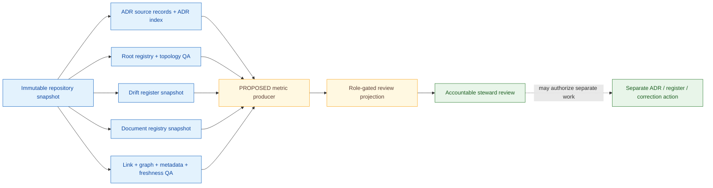

<!-- [KFM_META_BLOCK_V2]
doc_id: kfm://doc/dashboards-governance-documentation-drift
title: Documentation Drift Dashboard Specification
type: dashboard-specification
version: v1.0.0
status: "draft; repository-grounded; specification-only; placement-hold; runtime-needs-verification; non-release; non-publication"
owners:
  - "@bartytime4life"
owner_status: "CONFIRMED GitHub review route through CODEOWNERS; documentation, architecture, registry, tooling, dashboard, governance-health, release, and independent-review stewardship remain NEEDS VERIFICATION"
created: 2026-05-20
updated: 2026-08-22
policy_label: repository-facing
owning_root: docs/
responsibility: "Define a review-facing documentation-drift dashboard specification, metric boundaries, finite display states, current repository evidence, safe drill-down rules, acceptance gates, correction behavior, and verification backlog without becoming doctrine, ADR, registry, validator, review, release, or publication authority."
truth_posture: "CONFIRMED current repository evidence / PROPOSED metric contracts and panels / UNKNOWN production metric emission, complete registers, deployed dashboard, release, and publication / cite-or-abstain"
current_path: docs/dashboards/governance/DOCUMENTATION_DRIFT.md
placement_status: "CONFIRMED existing path under docs/; HOLD as part of the unadmitted docs/dashboards/ direct-child lane under accepted Directory Rules v2"
runtime_status: "NEEDS VERIFICATION — no documentation-drift metric producer, query, routed panel, complete machine register, production telemetry stream, or operational review-console binding was verified"
evidence_snapshot:
  repository: bartytime4life/Kansas-Frontier-Matrix
  base_ref: main
  base_commit: f86fcddb553217f7ffadafd80f20e95d635180b1
  target_prior_blob: a4999c965d17040d5ee2e627e06f8abb9a25c941
  dashboards_readme_blob: 02f891d4734b6d54ac36c4a9f7c4ba272585f167
  dashboard_catalog_blob: 82c7859b2782c13e97b1b3d3d55cdf35400fe675
  indicator_catalog_blob: 4fe3d6be5b0b6ba6359a301942c01d713c8e970f
  governance_readme_blob: 8f7dd5d42d4c1e2842e5d8f656b2f9c1fbe6cf73
  drift_register_blob: 5c5078b93c467e66f4cc8b86a7a696dbce5ae7e0
  document_registry_blob: 217a13a9f7d9eeb6ee6ea0bf6eaa90a707a32f1a
  root_registry_blob: 024f668b5f0a9239bafa4f8b09e2afd86300ff8c
  adr_index_blob: 8f90c75e662918f8062c4a9d139b19f268295c55
  docs_validators_readme_blob: 2d4cb440a2f9c0667628cb31ef1e25cd120d3a0a
  document_graph_readme_blob: 1bff0f5ff9d096e2b4b72fc6a4049fa7cd2f9d52
  meta_block_readme_blob: 25be64b52c6fe74fbe0c167f32ba878280b11f5c
  stale_scan_readme_blob: 5ff205239c91a85eee3a7ab31cc34b47199d9eca
  directory_governance_readme_blob: dcc1f6007de78e82de75a7c001e0cb0f1fec43e6
  document_graph_workflow_blob: 636749f75621bf773ac558286789dadb41c47c35
  stale_scan_workflow_blob: 4717668d30f98d9be2e6d2ebf57862e820cd41aa
  codeowners_blob: dd2a84aa514d8ecd9208bc347f90f9a2ed37dd61
  directory_rules_blob: fd49a0b83e55cef52c1124281f093e263526898d
  adr_0029_blob: a4de0d7a96b78da59cfc499d1025e1508afd8dd9
inspection_boundary: "Current-session GitHub reads covered the complete predecessor, parent dashboard lane, governance lane, dashboard and indicator catalogs, accepted Directory Rules authority, ADR index, human drift and document registers, machine root and document registers, bounded documentation validators, directory-topology validator, selected read-only workflows, CODEOWNERS, current main, and exact-target overlap. No mounted checkout, repository-native command, complete structural-change ledger, normalized drift-entry corpus, complete document registry, metric producer, telemetry store, dashboard query, role-gated panel, deployed service, human review record, release record, correction propagation, rollback drill, or public request was exercised."
related:
  - docs/dashboards/README.md
  - docs/dashboards/DASHBOARD_CATALOG.md
  - docs/dashboards/INDICATOR_CATALOG.md
  - docs/dashboards/governance/README.md
  - docs/doctrine/directory-rules.md
  - docs/adr/ADR-0029-adopt-directory-governance-standard-v2.md
  - docs/adr/INDEX.md
  - docs/registers/DRIFT_REGISTER.md
  - docs/registers/DOCUMENT_REGISTRY.md
  - docs/registers/VERIFICATION_BACKLOG.md
  - control_plane/root_registry.yaml
  - control_plane/document_registry.yaml
  - tools/validators/docs/README.md
  - tools/validators/docs/document-graph/README.md
  - tools/validators/docs/meta-block/README.md
  - tools/validators/docs/stale-scan/README.md
  - tools/validators/directory_governance/README.md
  - apps/review-console/README.md
  - .github/CODEOWNERS
tags: [kfm, dashboards, governance, documentation-drift, adr, directory-governance, root-readme, lineage, registry, document-graph, metadata, freshness, correction, rollback]
notes:
  - "v1.0.0 replaces an Atlas-only placeholder with a current repository-grounded specification while preserving the four inherited indicator identities."
  - "The repository confirms bounded documentation graph, metadata-block, link, stale-scan, ADR-index, root-registry, and repository-topology QA surfaces; it does not confirm one production metric producer or deployed documentation-health dashboard."
  - "The current DRIFT_REGISTER is dated prose without stable entry identity, explicit lifecycle state, owner, severity, or review timestamps; a reliable open-count and age distribution cannot be inferred from bullet count."
  - "The current machine document registry is PROPOSED and contains one entry; Atlas/supplement lineage coverage cannot be treated as complete."
  - "Numeric healthy postures mirrored by the Indicator Catalog remain PROPOSED until an accepted metric contract defines population, window, null semantics, source authority, correction behavior, and accountable review."
  - "This revision changes documentation and generated authoring provenance only."
[/KFM_META_BLOCK_V2] -->

<a id="top"></a>
<a id="documentation-drift-dashboard--governancedocumentation_driftmd"></a>

# Documentation Drift Dashboard Specification

**Repository-grounded review specification for ADR-trigger coverage, drift-record disposition, responsibility-root README contracts, and Atlas/supplement lineage.**


[Scope](#1-scope-and-authority-boundary) · [Evidence](#2-current-repository-evidence) · [Indicators](#3-indicator-contracts) · [Measurement](#4-measurement-envelope-and-finite-display-states) · [Flow](#5-signal-flow-and-governed-joins) · [Panels](#6-panels-and-review-interactions) · [Safety](#7-security-rights-and-exposure-boundary) · [Ownership](#8-ownership-and-separation-of-duties) · [Build path](#9-implementation-boundary-and-smallest-safe-build-path) · [Validation](#10-validation-and-acceptance) · [Open work](#11-open-verification-register) · [Rollback](#12-maintenance-correction-and-rollback) · [Non-effects](#13-non-effects)

> [!IMPORTANT]
> **Current checkpoint.** The repository contains a current ADR inventory and validator, an adopted Directory Rules decision and machine root projection, a twenty-rule repository-topology ratchet, bounded documentation link/graph/metadata/freshness validators with synthetic tests, read-only workflow definitions, a human drift register, and a machine document register. Those surfaces provide useful QA evidence, but they do **not** yet provide one accepted denominator, complete normalized register, metric producer, dashboard query, AI-free review projection, or deployed panel for the four indicators in this specification.

> [!CAUTION]
> **A green documentation dashboard does not make a path canonical, an ADR accepted, a drift item resolved, a document current, or a release publishable.** A metric, graph, badge, recent date, README, workflow, or registry row is a downstream review signal. Directory authority, source ADR state, current repository bytes, accountable review, and governed release/correction records remain separate.

> [!WARNING]
> **Do not manufacture health from file counts.** A bullet in a prose register is not automatically an open drift record. A README file is not automatically a conforming boundary contract. An ADR file is not automatically accepted. A filename containing a version is not lineage proof. Missing, ambiguous, duplicate, or unresolved inputs must remain visible as `PARTIAL_COVERAGE`, `REGISTER_UNSTRUCTURED`, `REGISTRY_INCOMPLETE`, `NOT_INSTRUMENTED`, or `ERROR` rather than being coerced to zero or green.

> [!NOTE]
> `@bartytime4life` is the verified GitHub review route through `CODEOWNERS`. That route is not proof of documentation stewardship, architecture approval, independent review, policy authority, release approval, or publication authority.

---

<a id="1-description"></a>

## 1. Scope and authority boundary

This document specifies a **system-wide, review-facing governance-health projection** for documentation and structural-governance drift. It preserves the four indicator identities mirrored by [`INDICATOR_CATALOG.md`](../INDICATOR_CATALOG.md):

1. ADR completeness.
2. Drift register size and age.
3. Per-root README presence and contract coverage.
4. Atlas/supplement lineage clarity.

The specification defines what each indicator may count, what must be known before computation, which joins are admissible, which missing-data states must remain visible, which details must be withheld, and what current repository evidence does or does not prove.

### This document owns

- human-readable meaning for the documentation-drift dashboard projection;
- the current repository evidence boundary for that projection;
- proposed metric envelopes, panel behavior, safe drill-down rules, and finite display states;
- review and acceptance expectations;
- an explicit verification backlog; and
- correction and rollback guidance for this document.

### This document does not own

| Responsibility | Owning surface or decision | Boundary here |
|---|---|---|
| Directory and placement authority | [Directory Rules](../../doctrine/directory-rules.md), accepted [ADR-0029](../../adr/ADR-0029-adopt-directory-governance-standard-v2.md), and reviewed successor decisions | This dashboard reports conformance signals; it cannot admit, move, retire, or canonicalize a path. |
| ADR identity and source status | [`docs/adr/INDEX.md`](../../adr/INDEX.md) plus each ADR source record | An index row or chart cannot accept, reject, or supersede an ADR. |
| Drift records and dispositions | [`DRIFT_REGISTER.md`](../../registers/DRIFT_REGISTER.md) and any accepted machine projection | This dashboard cannot create, close, waive, age, or reprioritize a drift record. |
| Machine root classes | [`control_plane/root_registry.yaml`](../../../control_plane/root_registry.yaml) | The registry is a projection of adopted authority; this dashboard cannot activate or reclassify roots. |
| Machine document identity | [`control_plane/document_registry.yaml`](../../../control_plane/document_registry.yaml) | A metric cannot add registry entries or make an incomplete registry complete. |
| Documentation QA | [`tools/validators/docs/`](../../../tools/validators/docs/README.md) and directory-governance validators | A passing validator proves only its bounded profile. |
| Human review | Review records and accountable reviewers | Workflow success, CODEOWNERS routing, and a fresh date are not human approval. |
| Metric production and telemetry | An accepted implementation and observability lane | Markdown is not a metric store, query engine, or telemetry source. |
| Reviewer UI | [`apps/review-console/`](../../../apps/review-console/README.md) or another accepted role-gated application | This document proposes behavior; it creates no route or panel. |
| Release, correction, rollback, publication | `release/` and accountable release records | A dashboard cannot authorize the transition it visualizes. |

### Placement decision

Accepted ADR-0029 makes `docs/` the human-readable explanation root and adopts Directory Rules v2. The target is an existing tracked human specification under `docs/dashboards/governance/`; correcting it in place is a bounded same-path documentation change. The parent dashboard lane remains absent from the adopted canonical `docs/` direct-child map, so long-term lane placement stays **HOLD**. This update does not admit, move, rename, redirect, retire, or delete the lane.

[↑ Back to top](#top)

---

## 2. Current repository evidence

Repository presence establishes bytes and bounded executable shape. It does not establish a complete metric population, production service, operational dashboard, or public release.

| Surface inspected | Current observation | What is confirmed | What remains unproved |
|---|---|---|---|
| This target | Existing 5,452-byte draft proposal at prior blob `a4999c9…`. | Path and predecessor exist. | No runtime or metric implementation follows from the predecessor. |
| Dashboard parent and catalogs | Parent README records 33 specs and 40 Markdown files at its pinned snapshot, labels runtime unverified, and keeps lane placement on `HOLD`; the catalogs retain this spec and four indicator identities. | Documentation inventory and indicator lineage. | Running panels, metric producers, accepted thresholds, complete machine parity, or current catalog freshness beyond their own snapshots. |
| ADR inventory | `docs/adr/INDEX.md` records 36 numbered ADRs, 3 effective `accepted`, 33 `proposed`, and 12 unassigned scaffolds; a dedicated validator is named. | Current human ADR inventory and source-status crosswalk at the inspected commit. | The denominator of structural changes that required an ADR, decision-time compliance, or complete external review history. |
| Human drift register | `DRIFT_REGISTER.md` is a dated Markdown bullet history with mixed remediation and open-state prose. | The file and its recorded statements exist. | Stable drift IDs, normalized state, severity, owner, opened/closed timestamps, correction links, or a reliable open count and age distribution. |
| Machine root registry | `root_registry.yaml` projects adopted root classes and binds to ADR-0029 and the adopted Directory Rules digest. | A machine-readable denominator candidate for root classes exists. | A current root-README metric snapshot, accepted coverage profile, or proof every listed root currently satisfies its README contract. |
| Repository-topology validator | A standard-library, no-network twenty-rule ratchet covers root admission, identities, placement, generated provenance, boundary READMEs, adopted-authority binding, and active aliases; its README records 138 inherited finding groups. | Bounded topology QA and inherited-debt ratchet design exist. | Current exact-head result, full conformance, root-README percentage, steward disposition of all inherited findings, or required-check coupling. |
| Documentation validator family | Link check, document graph, metadata block, and stale scan are bounded executables with synthetic tests; terminology parity and truth-label lint remain README-only proposals. | Four distinct no-network QA lanes exist. | One composed documentation-health metric producer, accepted cross-validator precedence, production report retention, or repository-wide conformance. |
| Document graph | Produces deterministic nodes, typed edges, reachability, backlinks, registry parity, findings, and a graph digest. | Bounded graph QA exists. | A graph edge or reachability score does not prove authority, currentness, lineage correctness, or review. |
| Metadata block | Validates a bounded `KFM_META_BLOCK_V2` profile and emits review-only registry deltas without mutation. | Structural metadata QA and conflict detection exist. | Metadata doctrine adoption, truth of field values, registry completeness, or automatic authority. |
| Freshness scan | Uses explicit as-of dates and advisory defaults; emits review signals for age, placeholders, temporal markers, verification debt, and implementation claims. | Deterministic review-age QA exists. | Recent content, actual human review, material currentness, or accepted universal thresholds. |
| Machine document registry | `control_plane/document_registry.yaml` is `PROPOSED` and contains one entry at the inspected commit. | A machine registry surface exists. | Complete repository document identity, Atlas/supplement inventory, or lineage coverage. |
| Workflow definitions | Read-only `docs-document-graph` and `docs-stale-scan` workflows trigger on relevant documentation paths and use no-network validator profiles; metadata and link workflows also exist in the validator family. | Orchestration definitions and least-privilege posture for inspected workflows. | Exact-head success for this change, branch-protection enforcement, required status, operational continuity, or human review. |
| CODEOWNERS | Routes repository review to `@bartytime4life`. | GitHub review routing. | Stewardship assignment, independent approval, decision authority, or release authority. |

### Bounded maturity summary

| Capability | Current status | Basis |
|---|---|---|
| Four indicator identities | `CONFIRMED` documentation lineage | Indicator and dashboard catalogs |
| ADR file inventory and status crosswalk | `CONFIRMED` current bytes | ADR index |
| Structural-change denominator | `NOT INSTRUMENTED` | No accepted change-event ledger or classifier result inspected |
| Drift-entry population | `REGISTER_UNSTRUCTURED` | Dated prose lacks stable machine fields |
| Root-class denominator candidate | `CONFIRMED` projection | Root registry |
| Root README contract metric | `PARTIAL_BOUNDED` | Topology rule exists; no accepted metric snapshot |
| Atlas/supplement inventory | `REGISTRY_INCOMPLETE` | Machine document registry contains one entry |
| Documentation graph/metadata/freshness QA | `CONFIRMED` bounded | Four validator implementations and synthetic tests |
| Production metric computation | `UNKNOWN` / `NOT_INSTRUMENTED` | No producer/query verified |
| Review-console documentation-health panel | `UNKNOWN` / `NEEDS VERIFICATION` | No routed panel or telemetry binding verified |
| Release or publication impact | `NONE` | Documentation specification only |

[↑ Back to top](#top)

---

<a id="2-indicators-surfaced"></a>

## 3. Indicator contracts

These are **PROPOSED metric contracts**, not implemented telemetry. The healthy postures mirrored in the indicator catalog remain proposals. A percentage, rate, rank, or trend must not appear until its eligible population, numerator, denominator, immutable time window, source snapshot, null semantics, correction watermark, sensitivity treatment, and accountable reviewer are defined.

### 3.1 `DOCDRIFT-01` — ADR completeness

**Question:** Of the structural changes that met an accepted ADR trigger at the time of change, how many were governed by a retained, effective ADR before the authority-changing mutation took effect?

| Element | Proposed definition |
|---|---|
| Eligible population | Repository changes in the immutable measurement window that a version-bound Directory Rules trigger classifier identifies as root admission/retirement, authority-home change, schema or contract authority change, lifecycle-boundary change, public-path change, or another accepted ADR-triggering structural mutation. |
| Numerator | Eligible changes linked to an ADR whose source record was effective for that decision before or with the governed mutation, whose identity remains retained, and whose status/relationship passes the ADR index validator. |
| Denominator | All eligible ADR-triggering changes in the same window, including reverted, corrected, or held attempts when the metric contract says they remain review-relevant. |
| Healthy posture | `100%` is the inherited **PROPOSED** target for authority-changing structural mutations; one missing decision is visible and cannot be rounded away. |
| Required support | Immutable Git/PR change identity, accepted trigger vocabulary and classifier version, path-decision record, ADR source record, ADR index validation, effective date/state, correction/revert linkage, and reviewer disposition. |
| Current state | `NOT_INSTRUMENTED`. The ADR inventory and topology validators exist, but no complete structural-change event population or accepted trigger-classification producer was verified. |

**Guardrails**

- The number of ADR files is not the numerator.
- The number of merged pull requests is not the denominator.
- A proposed ADR does not count as an accepted decision unless the governing profile explicitly measures proposal coverage separately.
- An ADR accepted after an unauthorized structural mutation does not silently rewrite the historical metric; record correction timing.
- Reverts, supersessions, and withdrawn changes remain traceable rather than disappearing from the measurement window.
- This indicator reports process closure. It does not prove the architecture is implemented correctly.

### 3.2 `DOCDRIFT-02` — Drift register load, age, and disposition

**Question:** How many governed drift records are open, held, overdue, recurring, or resolved, and how long have they remained in each state?

| Element | Proposed definition |
|---|---|
| Eligible population | Stable drift records in the accepted human or machine register with a unique ID, category, state, opened timestamp, last-reviewed timestamp, owning role, evidence refs, and correction/disposition links. |
| Numerator | Not one universal numerator. Panels may count `OPEN`, `HOLD`, `OVERDUE`, `RECURRING`, `RESOLVED`, or another accepted state by severity and age band. |
| Denominator | All eligible drift records in the immutable register snapshot, with exclusions and parse failures reported separately. |
| Healthy posture | Every material record is uniquely identified, owned or explicitly unowned, reviewed within its accepted cadence, and dispositioned without silent deletion. No universal “zero drift” target is assumed. |
| Required support | Versioned register snapshot, accepted state/severity vocabulary, opened/updated/resolved times, owner/reviewer identity, evidence refs, related ADR/issue/PR/correction links, and register digest. |
| Current state | `REGISTER_UNSTRUCTURED`. The current Markdown file is dated prose without enough stable fields to derive a reliable open count or age histogram. |

**Guardrails**

- Do not count every bullet as open.
- Do not infer resolution from words such as “remediated” without a stable record identity and state transition.
- Do not infer age from the most recent prose date when `opened_at` and `last_reviewed_at` are absent.
- Duplicate descriptions must remain duplicate candidates until identity or supersession is reviewed.
- A shrinking count is not automatically healthy; records may have been merged, lost, or silently deleted.
- Public panels must not expose sensitive vulnerability, private-source, or protected-location detail carried by a drift record.

### 3.3 `DOCDRIFT-03` — Responsibility-root README contract coverage

**Question:** For each eligible responsibility root, does a current README exist and satisfy the accepted boundary contract for purpose, authority, inputs, exclusions, exposure, validation, review, compatibility, and rollback?

| Element | Proposed definition |
|---|---|
| Eligible population | Root-registry entries whose accepted metric profile includes README coverage. The initial inherited indicator says “canonical roots”; platform, compatibility, conditional, deprecated, and retired roots must be shown separately unless an accepted profile explicitly includes them. |
| Numerator | Eligible roots with a resolving README at the declared root and a passing accepted boundary-contract profile at the same immutable repository snapshot. |
| Denominator | All eligible roots from the version-bound machine root registry, not an ad hoc filesystem list. |
| Healthy posture | `100%` is the inherited **PROPOSED** target for eligible canonical roots. Coverage for compatibility or conditional roots is reported separately and never mixed silently. |
| Required support | Root registry and digest, tracked tree snapshot, exact README path, boundary-contract validator version, metadata/links/topology results, accepted exceptions, and correction state. |
| Current state | `PARTIAL_BOUNDED`. Root-registry and topology/boundary-README QA exist, but no accepted metric producer or current percentage was verified. |

**Guardrails**

- File presence alone is not contract coverage.
- A meta block alone is not a complete README boundary contract.
- A topology warning baseline is not a pass claim.
- A compatibility root must not be counted as canonical to improve or degrade the percentage.
- Missing or ambiguous root class is `PARTIAL_COVERAGE` or `ERROR`, not exclusion by convenience.
- A green README metric does not prove the implementation beneath the root works.

### 3.4 `DOCDRIFT-04` — Atlas and supplement lineage clarity

**Question:** Does every eligible Atlas, supplement, consolidation, or successor document have unambiguous identity, version, authority class, predecessor/successor links, retained source lineage, and correction status?

| Element | Proposed definition |
|---|---|
| Eligible population | Documents classified by an accepted document-type/authority profile as Atlas, supplement, consolidation, edition, or lineage-bearing successor in a complete machine document registry. |
| Numerator | Eligible documents with stable `doc_id`, version, status, authority, path, content digest, `supersedes`/`superseded_by` reciprocity where applicable, retained predecessor locator, and no unresolved identity/path conflict. |
| Denominator | All eligible lineage-bearing documents in the immutable registry snapshot. |
| Healthy posture | `100%` is the inherited **PROPOSED** target; no silent supersession, orphan successor, duplicate current edition, or missing retained predecessor. |
| Required support | Complete machine document registry, validated metadata blocks, document graph, exact local links, artifact digests, authority/supersession decision, correction record, and registry snapshot digest. |
| Current state | `REGISTRY_INCOMPLETE`. The current machine document registry contains one entry, so a repository-wide Atlas/supplement denominator cannot be asserted. |

**Guardrails**

- A version-like filename is not lineage proof.
- A title containing “current,” “final,” “consolidated,” or “definitive” is not authority.
- Concatenation or deduplication does not establish supersession.
- A document graph edge is a QA projection, not a decision.
- Missing reciprocity or duplicate identity is visible as `LINEAGE_CONFLICT`; it is not assigned to “other.”
- A corrected or superseded document remains retained and traceable according to the governing policy.

[↑ Back to top](#top)

---

## 4. Measurement envelope and finite display states

### Minimum measurement fields

| Field | Purpose |
|---|---|
| `metric_id` and `metric_spec_version` | Bind the result to one accepted definition. |
| `as_of`, `window_start`, and `window_end` | Prevent an undated “current” claim. |
| `repository_ref` and immutable tree/commit | Bind all path and file claims to one snapshot. |
| `eligible_population_definition` | Explain what was counted, excluded, and held. |
| `numerator`, `denominator`, `value`, and unit | Preserve arithmetic and avoid opaque percentages. |
| `dimensions` | Declare root class, ADR trigger, drift state, severity, document type, or age bands actually used. |
| `source_snapshot_refs` | Resolve ADR index, root registry, drift register, document registry, graph, metadata, and topology inputs. |
| `producer_ref` and digest/version | Identify the computation implementation. |
| `coverage` and `unresolved_count` | Keep missing joins and parse failures visible. |
| `correction_watermark` | Identify late records, reclassifications, supersessions, or corrected snapshots. |
| `limitations` | State material boundaries in machine-readable and human-readable form. |
| `review_state` | Keep generated computation separate from accountable review. |

### Finite dashboard measurement states

| State | Required display behavior |
|---|---|
| `MEASURED` | Show value, denominator, immutable window, producer, source snapshots, coverage, correction watermark, and limitations. |
| `NO_ELIGIBLE_ITEMS` | Show zero eligible items under a valid accepted population; never render `0%` without a denominator. |
| `PARTIAL_COVERAGE` | Show measured subset and unresolved/excluded counts prominently; never rank incomplete groups as complete. |
| `NOT_INSTRUMENTED` | No accepted producer or population exists. Show required next evidence; do not show a green zero. |
| `REGISTER_UNSTRUCTURED` | Source register lacks stable machine fields needed for counting or aging. |
| `REGISTRY_INCOMPLETE` | Machine registry cannot establish the eligible population. |
| `SOURCE_STALE` | One or more required snapshots exceed their accepted review or freshness profile. |
| `LINEAGE_CONFLICT` | Duplicate identity, missing reciprocity, ambiguous current edition, or unresolved path/identity conflict blocks a clean result. |
| `ACCESS_RESTRICTED` | The viewer cannot inspect a sensitive underlying record; show only the allowed aggregate and limitation. |
| `ERROR` | Parsing, validation, query, digest, or join failed. Preserve diagnostics for authorized review; never reuse the last green value as current. |

### Zero, missing, and correction semantics

- `0` means a measured count of zero under a complete accepted population.
- `0%` means numerator zero and denominator greater than zero.
- `NO_ELIGIBLE_ITEMS` is not `0%`.
- A missing structural-change ledger is `NOT_INSTRUMENTED`, not perfect ADR compliance.
- Prose without stable drift states is `REGISTER_UNSTRUCTURED`, not zero open drift.
- An incomplete document registry is `REGISTRY_INCOMPLETE`, not complete lineage.
- Historical baseline findings remain visible; warning status does not make them conforming.
- Corrected data produces a new measurement version or correction watermark. Prior results remain traceable.
- A workflow cancellation, skip, or missing run is not a pass.

### Runtime outcomes are separate

`ANSWER`, `ABSTAIN`, `DENY`, and `ERROR` are finite governed runtime outcomes for answer surfaces. They are **not** documentation-health metric states. A documentation dashboard may describe those terms, but it must not coerce `REGISTER_UNSTRUCTURED` into `ABSTAIN` or a policy restriction into a metric error.

[↑ Back to top](#top)

---

<a id="4-inputs--records-read"></a>

## 5. Signal flow and governed joins



### Join requirements

| Join | Required behavior | Failure state |
|---|---|---|
| Structural change → ADR trigger | Bind a change event to a versioned accepted trigger classifier and reason code. | `NOT_INSTRUMENTED` or `ERROR` |
| Triggered change → ADR source record | Resolve the effective decision identity and decision-time state. | `PARTIAL_COVERAGE` |
| Drift row → stable drift identity | Resolve unique ID, state, time, owner, evidence, and disposition. | `REGISTER_UNSTRUCTURED` |
| Root registry → tracked README | Resolve exact root class and README path at one commit. | `PARTIAL_COVERAGE` |
| README → accepted boundary profile | Run exact metadata, link, topology, and content-contract checks without conflating them. | `PARTIAL_COVERAGE` or `ERROR` |
| Document registry → lineage-bearing document | Resolve stable identity, type, version, digest, and authority. | `REGISTRY_INCOMPLETE` |
| Successor → predecessor | Require reciprocal lineage and retained predecessor locator. | `LINEAGE_CONFLICT` |
| QA result → metric snapshot | Bind validator version, input snapshot, findings, and correction watermark. | `ERROR` |
| Metric snapshot → reviewer view | Apply role, minimum-necessary disclosure, and safe aggregation. | `ACCESS_RESTRICTED` |

### Anti-collapse rules

| Distinction | Required handling |
|---|---|
| Document exists vs. document is current | File presence and freshness review remain separate. |
| Metadata valid vs. metadata true | Structural conformance does not verify claims or ownership. |
| ADR indexed vs. ADR accepted | Source-record decision state controls. |
| ADR accepted vs. architecture implemented | Implementation requires separate code/config/test/runtime evidence. |
| Drift described vs. drift record open | Stable identity and explicit state are required. |
| Drift resolved vs. drift text removed | Resolution must preserve disposition and correction lineage. |
| Root listed vs. root conforming | Registry coverage and boundary checks remain separate. |
| README present vs. README complete | Required boundary fields and review profile must pass. |
| Lineage link exists vs. supersession authorized | Graph connectivity does not decide authority. |
| Workflow green vs. governance healthy | A check proves only its bounded run and exact head. |
| Merge vs. publication | Repository state and KFM release/publication state remain separate. |

[↑ Back to top](#top)

---

<a id="3-panels-proposed"></a>

## 6. Panels and review interactions

All panels are **PROPOSED**. No route, query, deployed component, or production data source is asserted.

### 6.1 Instrumentation and coverage banner

Always render first.

Show:

- measurement state;
- as-of date and immutable repository ref;
- metric-spec and producer versions;
- eligible population and unresolved count;
- ADR/change, drift-record, root/README, registry/lineage, and validator coverage;
- correction watermark;
- last successful computation;
- active limitations; and
- accountable review state.

A dashboard with no verified producer must lead with `NOT_INSTRUMENTED`, not four empty green cards.

### 6.2 ADR completeness

Show:

- complete/partial/not-instrumented state;
- eligible structural changes by accepted trigger family;
- accepted/proposed/missing decision linkage;
- decision-time status rather than current status only;
- corrected/reverted/superseded change history; and
- trigger-classifier and ADR-index validation versions.

**Safe drill-down:** change ID, repository path family, trigger reason, ADR ID/status, immutable refs, and review links. Do not expose private vulnerability detail or unredacted restricted change content.

### 6.3 Drift register load and age

Show:

- register structure state;
- counts by accepted lifecycle state and severity;
- age bands from `opened_at`, not prose date;
- unowned, overdue, recurring, duplicate-candidate, and correction-linked records;
- latest review date and register digest; and
- parse failures or missing fields.

Do not publish an “open count” while the source is `REGISTER_UNSTRUCTURED`.

### 6.4 Root README coverage

Show:

- denominator by root class;
- exact README presence;
- metadata, link, topology, freshness, and boundary-contract results as separate columns;
- accepted exceptions and expiry;
- inherited baseline findings distinct from current regressions; and
- root-registry and repository refs.

Do not average canonical and compatibility roots into one unexplained percentage.

### 6.5 Atlas and supplement lineage

Show:

- eligible lineage-bearing document count;
- current/superseded/deprecated/held/unknown state;
- reciprocal predecessor/successor links;
- duplicate-current and orphan-successor conflicts;
- retained predecessor path/digest;
- document-registry and graph coverage; and
- correction/supersession watermark.

A file title or version string may be displayed as text but never used as the authority decision by itself.

### 6.6 Documentation QA posture

This supporting panel is not a fifth inherited indicator. It explains input health.

Show each bounded validator separately:

- local link and fragment status;
- graph identity/reachability/backlink status;
- metadata-block and registry-delta status;
- freshness/review-age status;
- ADR-index status;
- root-registry and repository-topology status;
- exact workflow run/head when available; and
- current versus inherited findings.

Never collapse `WARN`, skipped, canceled, historical debt, or unexecuted checks into `PASS`.

### 6.7 Filters, comparison, and exports

Allowed filters require an accepted, low-risk dimension:

- immutable repository window;
- root class;
- ADR trigger family;
- drift state/severity;
- age band;
- document type/authority class;
- validator lane; and
- current versus inherited finding.

Comparisons must preserve metric-spec version, population definition, source snapshots, and correction watermark. Incompatible versions render side by side with a warning rather than one trend line.

Exports must include the measurement envelope, limitations, and source refs. A screenshot without those fields is a non-authoritative visual excerpt.

[↑ Back to top](#top)

---

## 7. Security, rights, and exposure boundary

Documentation governance is usually repository-facing, but its records can still expose sensitive operational detail.

### Never place in a public panel or export

- credentials, tokens, private endpoints, or signed URLs;
- private security reports or exploitable vulnerability detail;
- unreleased source payloads or protected precise locations;
- living-person private data, DNA/genomic data, or restricted cultural information;
- raw prompts, hidden reasoning, or model input/output;
- private reviewer notes or non-public policy rationale;
- unrestricted file-system paths from private deployments;
- low-count dimensions that reveal a protected record or investigation; or
- denial reasons whose detail enables bypass or reconstruction.

### Required controls for any implementation

| Control | Requirement |
|---|---|
| Source minimization | Read only fields required by the accepted metric contract. |
| Public-safe projection | Aggregate or redact restricted drift/incident details before display. |
| Role separation | Reviewer access does not grant ADR acceptance, register mutation, or release authority. |
| No direct canonical mutation | The dashboard reads governed projections; it never edits registers or ADRs in the normal path. |
| Query limits | Bound time windows, dimensions, result size, and export volume. |
| Auditability | Record metric/query identity and correction watermark without recording secrets or hidden reasoning. |
| Fail closed | Unresolved access, source classification, or disclosure risk becomes `ACCESS_RESTRICTED`, `PARTIAL_COVERAGE`, or `ERROR`. |
| Cache discipline | Corrected or withdrawn measurements must invalidate derived caches and exports through a separately governed process. |

[↑ Back to top](#top)

---

<a id="6-ownership-and-review-burden"></a>

## 8. Ownership and separation of duties

| Responsibility | Required role | Current evidence |
|---|---|---|
| GitHub review routing | Repository owner route | `@bartytime4life` is **CONFIRMED** in CODEOWNERS. |
| Indicator semantics | Documentation-governance steward plus architecture reviewer | `NEEDS VERIFICATION` |
| ADR trigger vocabulary | Directory-governance/architecture authority | Accepted Directory Rules exists; accountable operating role `NEEDS VERIFICATION`. |
| Drift-register schema and state transitions | Docs/governance register steward | `NEEDS VERIFICATION` |
| Root registry and topology producer | Directory-governance tooling owner | Implementation exists; accountable assignment `NEEDS VERIFICATION`. |
| Document registry and lineage classification | Docs steward plus authority/supersession reviewer | `NEEDS VERIFICATION` |
| Metric producer | Tooling/observability owner | `UNKNOWN` |
| Security/privacy review | Security/privacy reviewer when sensitive records participate | `NEEDS VERIFICATION` |
| Panel implementation and accessibility | Review-console/UI steward | `UNKNOWN` |
| Independent metric review | Reviewer independent of producer where policy-significant | `NEEDS VERIFICATION` |
| Release/correction/rollback | Release and correction authorities | Outside this specification |

The metric producer must not silently mutate its inputs. The dashboard implementer must not declare a record resolved. The author of a structural change must not use the dashboard as self-approval. GitHub review, metric review, ADR acceptance, register disposition, release approval, and publication remain separate states.

[↑ Back to top](#top)

---

<a id="5-files"></a>

## 9. Implementation boundary and smallest safe build path

### Current change boundary

This revision changes only:

1. this existing Markdown specification; and
2. its generated authoring receipt.

It does not change contracts, schemas, registers, validators, workflows, runtime, telemetry, UI, policy, ADR state, release, or publication.

### Smallest safe future build sequence

Each step is a separate reviewable slice unless current repository evidence proves a smaller dependency-closed grouping.

1. **Metric-contract review**
   - Ratify eligible populations, states, time windows, corrections, and safe dimensions.
   - Decide whether the four Atlas-derived metrics remain the long-term canonical set.
   - Keep numeric thresholds proposed until accountable approval.

2. **Normalized no-network fixtures**
   - Create synthetic structural-change, ADR, drift, root/README, and lineage snapshots.
   - Cover complete, partial, duplicate, missing, corrected, superseded, restricted, and invalid cases.
   - Use no real sensitive records.

3. **Read-only adapters**
   - Resolve current ADR index and source records without changing status.
   - Normalize drift records only after a stable schema or explicit compatibility adapter is reviewed.
   - Bind roots to the machine root registry.
   - Bind lineage documents to a complete registry projection.
   - Emit unresolved state rather than guessing.

4. **Deterministic metric producer**
   - Compute the four metrics from immutable snapshots.
   - Emit the minimum measurement envelope and finite states.
   - Hash inputs, metric spec, producer, and output.
   - Preserve correction and replay behavior.

5. **Negative and replay proof**
   - Prove that missing denominators, unstructured registers, incomplete registries, duplicate identities, invalid dates, and unresolved links cannot render as green.
   - Recompute identical inputs deterministically.
   - Verify corrections create new watermarks without erasing prior results.

6. **Role-gated review projection**
   - Add an accepted route only after contract and producer proof.
   - Render instrumentation state before values.
   - Apply accessibility, keyboard, responsive, export, and minimum-necessary disclosure controls.
   - Keep all mutation actions outside the normal read-only panel.

7. **Operational review and graduation**
   - Verify exact-head workflows, required-check coupling, storage/retention, alerting, ownership, runbooks, correction propagation, and rollback drills.
   - A deployed panel remains a review aid, not release authority.

### Explicitly deferred

- automatic ADR acceptance or status mutation;
- automatic drift entry creation, closure, waiver, or owner assignment;
- automatic Directory Rules amendment;
- automatic machine-registry mutation;
- live dashboard or telemetry route;
- public unauthenticated drill-down to sensitive records;
- AI-generated resolution decisions;
- release, deployment, promotion, or publication.

[↑ Back to top](#top)

---

<a id="7-acceptance"></a>

## 10. Validation and acceptance

### Current-session evidence checks

| Check | Outcome |
|---|---|
| Complete predecessor read | `PASS` |
| Current main and exact target blob pinned | `PASS` |
| Parent lane, governance README, dashboard catalog, indicator catalog, Directory Rules, ADR-0029, and CODEOWNERS inspected | `PASS` |
| ADR index, drift register, root registry, document registry, documentation validators, topology validator, and selected workflows inspected | `PASS` |
| Open pull-request and task-branch overlap for the exact target | `PASS` — none found before mutation |
| Same-path placement treatment | `PASS` — parent `docs/` root retained; dashboard-lane placement remains `HOLD` |
| Production metric/dashboard implementation proof | `NOT ESTABLISHED` |
| Human review | `PENDING` |

### Repository-native checks for an implementation worktree

The following commands are appropriate from a mounted checkout. They are not represented as executed by this connector-only authoring session.

```bash
python tools/validators/validate_adr_index.py

python tools/validators/directory_governance/validate_root_registry.py --fixtures
python tools/validators/directory_governance/validate_root_registry.py
python tools/validators/directory_governance/validate_repository_topology.py --format text

python tools/validators/docs/meta-block/check_meta_blocks.py \
  --repo-root . \
  --profile present \
  --registry control_plane/document_registry.yaml \
  docs/dashboards/governance/DOCUMENTATION_DRIFT.md

python tools/validators/docs/document-graph/check_document_graph.py \
  --repo-root . \
  --entrypoint README.md \
  --entrypoint docs/README.md \
  --registry control_plane/document_registry.yaml \
  --format markdown \
  README.md docs tools/validators/docs

python tools/validators/docs/stale-scan/check_stale_docs.py \
  --repo-root . \
  --as-of 2026-08-22 \
  --profile advisory \
  --review-window-days 365 \
  --placeholder-grace-days 90 \
  --format markdown \
  docs/dashboards/governance/DOCUMENTATION_DRIFT.md

python tools/validators/validate_generated_receipt.py \
  data/receipts/generated/<generated-receipt>.json \
  --repo-root .

git diff --check
```

Run the repository's current link-check profile as well; exact command and scope must be read from the current link-check README/workflow before execution.

### Documentation acceptance gates

- [x] Existing path retained; no new documentation lane or authority home created.
- [x] Four inherited indicator identities preserved.
- [x] Eligible populations, numerators/denominators, joins, null semantics, and correction behavior defined.
- [x] Current unstructured/incomplete inputs remain visible rather than counted as healthy.
- [x] ADR acceptance, drift disposition, root authority, lineage authority, validation, review, and release remain separate.
- [x] Runtime outcomes and metric states remain separate.
- [x] Sensitive drill-down and export behavior fail closed.
- [x] Legacy section anchors are preserved through explicit HTML anchors.
- [ ] Repository-native Markdown, graph, metadata, stale, topology, ADR-index, and receipt validation executed at final head.
- [ ] Hosted exact-head checks settled.
- [ ] Accountable human review completed.

### Graduation gates for a running panel

A future implementation cannot claim `MEASURED` until:

1. metric contracts are accepted and versioned;
2. input populations are complete or bounded coverage is explicit;
3. all source snapshots and producer bytes are immutable and digest-bound;
4. negative, partial, replay, correction, and access-restricted cases pass;
5. the review surface exposes source refs, limitations, and correction watermark;
6. role/access controls and safe exports are verified;
7. operational ownership and runbooks are assigned;
8. exact-head CI evidence exists;
9. correction and rollback behavior is rehearsed; and
10. release/publication authority remains outside the dashboard.

[↑ Back to top](#top)

---

<a id="8-open-questions"></a>

## 11. Open verification register

| ID | Priority | Question or missing evidence | Current state | Closure evidence |
|---|---:|---|---|---|
| `DDV-01` | P1 | Is `docs/dashboards/` an admitted long-term direct child of `docs/`? | `HOLD` | Accepted placement decision or reviewed migration; not file presence. |
| `DDV-02` | P0 | Who is accountable for documentation-governance, architecture, registry, tooling, and independent metric review? | `NEEDS VERIFICATION` | Verified assignments and review routes. |
| `DDV-03` | P0 | What immutable event family defines the denominator of ADR-triggering structural changes? | `UNKNOWN` | Accepted contract/schema, producer, fixtures, and replay tests. |
| `DDV-04` | P0 | What versioned classifier maps a change to an accepted Directory Rules ADR trigger? | `UNKNOWN` | Reviewed trigger vocabulary, deterministic classifier, negative tests, and decision-time binding. |
| `DDV-05` | P0 | What is the stable drift-record identity, lifecycle, severity, ownership, and correction schema? | `REGISTER_UNSTRUCTURED` | Accepted register contract and migration/compatibility plan preserving prose lineage. |
| `DDV-06` | P1 | Which root classes belong in the README denominator? | `NEEDS VERIFICATION` | Accepted metric profile bound to the root registry. |
| `DDV-07` | P1 | What fields and validators constitute a conforming root README boundary contract? | `NEEDS VERIFICATION` | Adopted profile, fixtures, validator, and correction behavior. |
| `DDV-08` | P1 | What document types qualify as Atlas, supplement, consolidation, or lineage-bearing edition? | `UNKNOWN` | Accepted document vocabulary and registry projection. |
| `DDV-09` | P0 | How will the machine document registry become complete without auto-promoting review-only deltas? | `REGISTRY_INCOMPLETE` | Reviewed population/migration plan, validator, and complete snapshot. |
| `DDV-10` | P1 | Are documentation and topology workflows exact-head, stable, and required by repository controls? | `NEEDS VERIFICATION` | Platform settings plus run/check IDs for exact heads. |
| `DDV-11` | P1 | Does a deterministic documentation-drift metric producer exist? | `UNKNOWN` | Code, contract, fixtures, tests, output digest, and replay evidence. |
| `DDV-12` | P1 | Is there a role-gated review-console route with safe queries, accessibility, and exports? | `UNKNOWN` | Routed implementation, tests, build, access-control evidence, and deployment record. |
| `DDV-13` | P1 | How do late ADR links, drift dispositions, registry corrections, and lineage changes propagate to prior measurements? | `PROPOSED` | Correction contract, watermarks, invalidation tests, and retained history. |
| `DDV-14` | P1 | How will inherited topology and documentation findings be classified without treating a warning baseline as conformance? | `NEEDS VERIFICATION` | Steward-owned baseline disposition and monotonic reduction policy. |
| `DDV-15` | P2 | What retention and audit policy applies to metric snapshots and exports? | `UNKNOWN` | Accepted retention, privacy, correction, and deletion policy. |
| `DDV-16` | P2 | Are external consumers relying on current anchors, path, or metric names? | `UNKNOWN` | Consumer inventory and compatibility review. |
| `DDV-17` | P2 | Should indicator-catalog thresholds remain mirrors or move to an accepted machine metric registry? | `PROPOSED` | Authority decision and one-way generation/migration plan. |
| `DDV-18` | P2 | How are terminology parity and truth-label overclaim checks graduated from README proposals? | `PROPOSED` | Bounded implementation, synthetic tests, review, and non-authority proof. |

[↑ Back to top](#top)

---

## 12. Maintenance, correction, and rollback

### Updating this specification

1. Pin the current default-branch commit and target blob.
2. Re-read the target, parent lane, catalogs, Directory Rules/ADR-0029, ADR index, registers, relevant validators/workflows, and open overlap.
3. Separate current repository evidence from doctrine, mirrors, proposals, and historical snapshots.
4. Update metric definitions only with explicit authority and compatibility notes.
5. Preserve stable IDs, legacy anchors, source identities, and non-effects.
6. Re-run proportionate Markdown, link, graph, metadata, freshness, topology, and receipt checks.
7. Emit a new generated receipt for the final bytes.
8. Deliver through review; do not self-approve or publish.

### Correcting a metric result

A future metric producer must:

- retain the original snapshot and output digest;
- issue a new corrected measurement identity or watermark;
- identify affected metric IDs, windows, populations, and exports;
- explain whether the change came from late data, register restructuring, status correction, classifier change, or producer defect;
- recompute downstream views deterministically;
- invalidate stale caches/exports through governed operations; and
- preserve reviewer disposition.

### Rollback for this documentation change

Before merge, close the draft pull request and delete its task branch if authorized. After an authorized merge, revert the merge or change commits, restoring predecessor blob `a4999c965d17040d5ee2e627e06f8abb9a25c941`, then rerun the same documentation and receipt validation set.

This documentation rollback does not alter ADR state, drift records, roots, source data, policy, runtime, release, deployment, or public artifacts. If a future running dashboard or published export depends on this metric specification, its correction and rollback require separate governed records.

[↑ Back to top](#top)

---

## 13. Non-effects

This revision does **not**:

- accept, reject, supersede, or implement an ADR;
- add, close, reprioritize, or waive a drift record;
- change Directory Rules, root classes, or path authority;
- complete or mutate the machine document registry;
- change a contract, schema, policy bundle, validator, fixture, test, workflow, check name, or repository setting;
- create a metric producer, telemetry stream, database table, API route, dashboard panel, alert, or export;
- assign a documentation, architecture, security, release, or independent reviewer role;
- activate a source or access internal/canonical data;
- release, deploy, promote, publish, correct, withdraw, or roll back KFM knowledge; or
- make a merge equivalent to publication.

The durable result is one reviewable documentation specification plus authoring provenance.

---

## Related references

### Dashboard lane and indicator lineage

- [Dashboard lane README](../README.md)
- [Dashboard catalog](../DASHBOARD_CATALOG.md)
- [Indicator catalog](../INDICATOR_CATALOG.md)
- [Governance dashboard README](README.md)

### Authority, ADR, and registers

- [Directory Rules](../../doctrine/directory-rules.md)
- [ADR-0029](../../adr/ADR-0029-adopt-directory-governance-standard-v2.md)
- [ADR index](../../adr/INDEX.md)
- [Drift register](../../registers/DRIFT_REGISTER.md)
- [Document registry](../../registers/DOCUMENT_REGISTRY.md)
- [Verification backlog](../../registers/VERIFICATION_BACKLOG.md)
- [Machine root registry](../../../control_plane/root_registry.yaml)
- [Machine document registry](../../../control_plane/document_registry.yaml)

### Validator and runtime boundaries

- [Documentation validators](../../../tools/validators/docs/README.md)
- [Document graph validator](../../../tools/validators/docs/document-graph/README.md)
- [Metadata-block validator](../../../tools/validators/docs/meta-block/README.md)
- [Freshness validator](../../../tools/validators/docs/stale-scan/README.md)
- [Directory-governance validators](../../../tools/validators/directory_governance/README.md)
- [Review console README](../../../apps/review-console/README.md)
- [CODEOWNERS](../../../.github/CODEOWNERS)

<p align="right"><a href="#top">Back to top</a></p>
