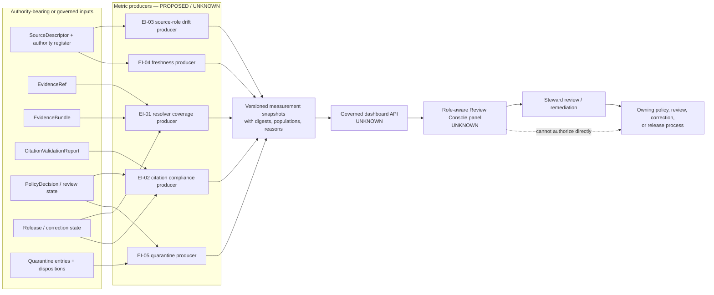

<!-- [KFM_META_BLOCK_V2]
doc_id: kfm://doc/dashboards-governance-evidence-integrity
title: Evidence Integrity Governance Dashboard Specification
type: standard; governance-dashboard; evidence-integrity; system-wide; documentation-specification
version: v1.0
status: draft; repository-grounded; documentation-only; metric-contracts-proposed; runtime-unverified; non-release; non-publication
owners: "@bartytime4life via CODEOWNERS; evidence, source, citation, AI, policy, metric/observability, review, release/correction, and independent-review stewardship NEEDS VERIFICATION"
created: 2026-05-20
updated: 2026-08-22
policy_label: public; documentation; dashboards; governance; evidence-integrity; source-integrity; cite-or-abstain; fail-closed
owning_root: docs/
responsibility: >-
  Define the human-readable, system-wide Evidence Integrity dashboard boundary:
  the five inherited indicator families, their proposed measurement contracts,
  finite display states, evidence dependencies, implementation gaps, review
  burden, validation expectations, and correction/rollback posture.
authority: >-
  Documentation and review guidance only. Evidence semantics belong to
  contracts; machine shape belongs to schemas; source authority belongs to
  governed registry/control-plane records; policy, review, release, telemetry,
  runtime, API, UI, correction, rollback, and publication remain with their
  owning roots and accountable decisions.
current_path: docs/dashboards/governance/EVIDENCE_INTEGRITY.md
canonical_relationship: >-
  Same-path replacement of an existing tracked specification. Accepted
  Directory Rules v2 supports PLACE for this docs-root edit. The final
  canonicality of the dashboards lane, the uppercase-versus-lowercase filename
  convention, and any structural migration remain HOLD.
truth_posture: >-
  CONFIRMED the tracked target and prior v0.1 blob; current dashboard and
  indicator catalogs; the governance dashboard parent boundary; accepted
  ADR-0029 and adopted Directory Rules v2; CODEOWNERS review routing; the
  EvidenceRef and EvidenceBundle semantic/schema surfaces; bounded EvidenceRef
  validation; the internal non-authoritative evidence-resolver candidate and
  one Hydrology fixture adapter; the fixture-first CitationValidationReport;
  the proposed schema-paired AIReceipt; the detailed singular
  SourceDescriptor schema and local shape validator; the empty proposed source
  authority register; the source-registry package placeholder; the
  documentation-only Review Console boundary; the governed API route registry
  containing bootstrap, layers, and evidence only; and the unverified
  quarantine payload/runtime posture / LINEAGE the five Atlas-derived
  indicator names, v0.1 thresholds, panel ideas, negative-state labels, and
  claimed running surface / PROPOSED eligible populations, metric envelopes,
  accepted thresholds, aggregation rules, telemetry producers, dashboard
  panels, drill-downs, alerts, and cross-domain rollups / CONFLICTED the v0.1
  treatment of target percentages and receipt paths as settled, the
  singular-versus-plural SourceDescriptor schema authority, admitted-source
  assumptions while the central authority register is empty, and a running
  Review Console panel without implementation evidence / UNKNOWN production
  EvidenceRef resolution, EvidenceBundle authentication, admitted-source
  registry population, source-role/freshness telemetry, quarantine event
  ledger, dashboard metric store, governed dashboard route, deployed panel,
  correction propagation, release coupling, and public parity.
evidence_snapshot:
  repository: bartytime4life/Kansas-Frontier-Matrix
  base_ref: main
  base_commit: 6aaea704230259e4fca30fcc0b9c1a168e12c2c2
  target_prior_blob: bba1be0102310aa7fb622ff62a448a29f1711751
  governance_readme_blob: 8f7dd5d70ad424b00ad59856813c11b0911f99de
  dashboard_catalog_blob: 82c7859b2782c13e97b1b3d3d55cdf35400fe675
  indicator_catalog_blob: 4fe3d6be5b0b6ba6359a301942c01d713c8e970f
  directory_rules_blob: fd49a0b83e55cef52c1124281f093e263526898d
  codeowners_blob: dd2a84aa514d8ecd9208bc347f90f9a2ed37dd61
  evidence_bundle_schema_blob: cf5256831b63dca46a5f68b168441adcf68b8751
  evidence_resolver_readme_blob: 74b12d1732b297458967a8c76bacca240b74eba3
  citation_validation_contract_blob: 29c507e76a9c15c44f2c195b7342e93630cdc701
  ai_receipt_contract_blob: 1e028525569b6032cd573e71d98df6b961fa70db
  source_authority_register_blob: 82c23722520922f5ca0dad7f37ed794d1c2edf81
  source_registry_package_blob: 6df77a248c72a17ddaeb5d701baf6e4d9db38eab
  source_descriptor_validator_blob: a0420731a1b80ce6d156f8e4cfd928a6b13699f4
  governed_api_route_registry_blob: 3418168d0b267160d6ad6dd87f289e880ef4a024
  review_console_readme_blob: 02512b6b8d16a8f1dfcd4c564f8b6d68b61b49e3
  quarantine_readme_blob: 9b375d795d96b15c06e51ef54770a023cd14454c
inspection_boundary: >-
  Current-session GitHub reads covered the complete prior target; dashboard,
  indicator, and governance-lane documentation; accepted directory authority;
  CODEOWNERS; evidence contracts and machine shape; the bounded resolver and
  citation-validation profiles; AIReceipt; SourceDescriptor/source-registry
  surfaces; the central source authority register; Review Console and governed
  API boundaries; quarantine documentation; exact-path PR/branch overlap; and
  target-fragment search. No live source, materialized production
  EvidenceBundle population, policy evaluator, review decision, release
  record, telemetry producer, dashboard API, deployed panel, correction
  cascade, rollback drill, or public endpoint was exercised.
related:
  - README.md
  - ../README.md
  - ../DASHBOARD_CATALOG.md
  - ../INDICATOR_CATALOG.md
  - ../domain/README.md
  - AI_SURFACE_HEALTH.md
  - RELEASE_CORRECTION_ROLLBACK.md
  - SENSITIVITY_RIGHTS.md
  - DOCUMENTATION_DRIFT.md
  - ../../doctrine/directory-rules.md
  - ../../adr/ADR-0029-adopt-directory-governance-standard-v2.md
  - ../../../contracts/evidence/README.md
  - ../../../contracts/evidence/evidence_ref.md
  - ../../../contracts/evidence/evidence_bundle.md
  - ../../../contracts/evidence/citation_validation_report.md
  - ../../../contracts/runtime/ai_receipt.md
  - ../../../schemas/contracts/v1/evidence/evidence_ref.schema.json
  - ../../../schemas/contracts/v1/evidence/evidence_bundle.schema.json
  - ../../../schemas/contracts/v1/source/source_descriptor.schema.json
  - ../../../packages/evidence-resolver/README.md
  - ../../../packages/source-registry/README.md
  - ../../../control_plane/source_authority_register.yaml
  - ../../../data/registry/sources/README.md
  - ../../../data/quarantine/README.md
  - ../../../tools/validators/validate_source_descriptor.py
  - ../../../apps/review-console/README.md
  - ../../../apps/governed-api/src/governed_api/routes/registry.py
  - ../../../.github/CODEOWNERS
tags: [kfm, dashboards, governance, evidence-integrity, evidence-ref, evidence-bundle, source-descriptor, source-role, citation-validation, quarantine, cite-or-abstain, compatibility, non-publication]
notes:
  - "v1.0 replaces Atlas-only, behavior-assertive v0.1 prose with a repository-grounded dashboard specification."
  - "The five inherited indicator names are preserved as lineage; numeric targets are not treated as accepted metric contracts."
  - "The original H1 fragment and all eight v0.1 section fragments are preserved explicitly."
  - "No dashboard, evidence, source, policy, review, release, correction, rollback, deployment, or publication state is changed by this document."
[/KFM_META_BLOCK_V2] -->

<a id="top"></a>
<a id="evidence-integrity-dashboard--governanceevidence_integritymd"></a>

# Evidence Integrity Governance Dashboard Specification

> **Purpose.** Define how a future system-wide review surface may report
> evidence and source integrity without treating a pointer as closure, a schema
> pass as truth, a dashboard score as policy or release authority, or missing
> telemetry as a healthy zero.

[](#1-status-and-scope)
[](#5-current-repository-evidence)
[](#5-current-repository-evidence)
[](#5-current-repository-evidence)
[](#3-indicator-contracts)
[](#2-responsibility-and-placement-boundary)

> [!IMPORTANT]
> **This file is a specification, not a running dashboard.** It cannot resolve
> an `EvidenceRef`, authenticate an `EvidenceBundle`, admit a source, compute a
> production metric, clear policy, approve review, change release state,
> invalidate a derivative, render a steward panel, or publish KFM material.

> [!WARNING]
> **`EvidenceRef` resolution is not the same as claim closure.** `EvidenceRef`
> is a governed pointer. `EvidenceBundle` is a claim-scope closure artifact.
> Neither one is a `PolicyDecision`, `ReviewRecord`, `ReleaseManifest`, or
> public answer by itself.

> [!CAUTION]
> **No numeric target is accepted here.** The v0.1 values `> 99.9%` and `100%`
> remain lineage from the mirrored indicator catalog. A percentage is not
> reviewable until an accepted metric contract defines the eligible
> population, exclusions, numerator, denominator, time window, immutable
> snapshot, null/no-data semantics, sensitivity profile, and correction
> behavior.

> [!NOTE]
> **Unknown coverage is not zero.** The central source authority register is
> currently proposed and empty; the source-registry package is a placeholder;
> the evidence resolver is internal alpha with one synthetic Hydrology adapter;
> and no routed dashboard implementation was found in the inspected API or
> Review Console surfaces. Those gaps produce `INCOMPLETE`, `ABSTAIN`, or
> `ERROR` posture—not a green card.

**Quick navigation:** [Status](#1-status-and-scope) ·
[Authority](#2-responsibility-and-placement-boundary) ·
[Indicators](#3-indicator-contracts) ·
[Measurement](#4-measurement-envelope-and-finite-display-states) ·
[Evidence](#5-current-repository-evidence) ·
[Signals](#6-signal-and-authority-model) ·
[Panels](#7-proposed-panels-and-drill-downs) ·
[Ownership](#8-ownership-review-and-separation-of-duties) ·
[Public boundary](#9-public-api-ui-and-ai-boundary) ·
[Validation](#10-validation-and-negative-tests) ·
[Open work](#11-open-verification-register) ·
[Maintenance](#12-maintenance-correction-and-documentation-rollback) ·
[References](#13-cross-references) · [History](#14-change-history)

---

<a id="1-description"></a>

## 1. Status and scope

| Question | Repository-grounded answer | Truth label |
|---|---|---|
| Does the requested file exist? | Yes. The prior v0.1 file is tracked at blob `bba1be0102310aa7fb622ff62a448a29f1711751`. | `CONFIRMED` |
| What does this file own? | A human-readable, system-wide dashboard specification and review boundary. | `CONFIRMED` responsibility |
| Is a production Evidence Integrity dashboard implemented? | No routed dashboard, metric producer, telemetry store, or deployed panel was proved in the inspected surfaces. | `UNKNOWN`; do not infer |
| Is `EvidenceRef` machine-shaped and validated? | A fielded schema and dedicated local shape validator exist. Referential resolution and bundle closure are separate. | `CONFIRMED` bounded shape; operational closure `UNKNOWN` |
| Is `EvidenceBundle` machine-shaped? | A closed proposed schema requires claim scope, refs, source records, citations, rights, sensitivity, transforms, checksums, and `spec_hash`. | `CONFIRMED` shape; contract remains `PROPOSED` |
| Does a resolver exist? | An internal, non-authoritative v1alpha1 evaluator and one fixed Hydrology synthetic-fixture adapter exist. They never produce public `ANSWER`. | `CONFIRMED` bounded candidate; production resolver `UNKNOWN` |
| Does citation validation exist? | A deterministic, fixture-first report validates declared states and returns `PASS`, `ABSTAIN`, `DENY`, or `ERROR`. It performs no live resolution, policy, review, release, or publication action. | `CONFIRMED` bounded profile |
| Is the source registry operational? | The package is a greenfield placeholder with no supported exports or adapter; the central source authority register has `entries: []`. | `CONFIRMED` placeholder/gap |
| Does SourceDescriptor validation exist? | A detailed singular schema and repository-anchored local validator exist. The singular/plural canonical schema relationship remains conflicted. | `CONFIRMED` bounded shape; authority `CONFLICTED` |
| Is quarantine throughput measurable today? | The quarantine root documents fail-closed semantics, but recursive payloads, writers/consumers, enforcement, and a lane-wide metric producer remain unverified. | `UNKNOWN` |
| Does Review Console implement this panel? | Its README documents only a proposed app boundary; app source, routes, dashboards, telemetry, deployment, and CI state remain unproved. | `UNKNOWN` |
| Does this page authorize policy, release, correction, rollback, or publication? | No. | `CONFIRMED` non-effect |
| Is the filename/lane final canon? | Same-path maintenance is allowed. Dashboard-lane canonicality and uppercase/lowercase naming convergence remain unresolved. | `HOLD` for structural change |

### Truth labels used here

| Label | Meaning |
|---|---|
| `CONFIRMED` | Verified from current-session repository bytes, remote state, or bounded executable evidence. |
| `PROPOSED` | A metric contract, display state, threshold, panel, producer, adapter, owner, or integration not accepted or proved. |
| `LINEAGE` | Prior design wording retained for compatibility; not current authority by itself. |
| `CONFLICTED` | Current repository surfaces claim incompatible authority or vocabulary. |
| `UNKNOWN` | Evidence does not establish the behavior, implementation, or state. |
| `NEEDS VERIFICATION` | A concrete repository, policy, runtime, review, or release check remains. |
| `HOLD` | Proceeding would cross an unresolved authority, sensitivity, placement, or release boundary. |
| `NOT_MEASURED` | No accepted producer and eligible population exist for a defensible metric. |

Repository presence proves bytes and proposed shapes exist. It does not prove
 evidence truth, source admission, rights, sensitivity clearance, policy permission,
 review, release, metric correctness, deployment, or public parity.

[Back to top](#top)

---

## 2. Responsibility and placement boundary

### This document owns

- the system-wide review question for evidence and source integrity;
- preservation and reconciliation of the five inherited indicator families;
- proposed measurement contracts and safe aggregate states;
- mapping from each indicator to current repository evidence and gaps;
- panel and drill-down guidance that prevents authority collapse;
- validation, negative-test, maintenance, and documentation rollback guidance;
- a visible verification backlog for future runtime implementation.

### This document does not own

| Responsibility | Current owning surface | Effect here |
|---|---|---|
| Evidence object meaning | [`contracts/evidence/`](../../../contracts/evidence/README.md) | This page cannot redefine `EvidenceRef`, `EvidenceBundle`, or citation reports |
| Machine shape | [`schemas/contracts/v1/evidence/`](../../../schemas/contracts/v1/evidence/) and source schemas | Current schema shape outranks dashboard prose |
| Source identity and authority | governed registry/control-plane records | A dashboard cannot admit or rank a source |
| Evidence material and proof records | `data/proofs/`, governed evidence stores | This file stores no evidence or proof |
| Source payloads and lifecycle records | `data/` lifecycle roots | No RAW/WORK/QUARANTINE payload belongs here |
| Policy, rights, sensitivity, and access | `policy/` and accountable decisions | A chart cannot allow, deny, redact, or generalize |
| Human review | governed review records and accountable reviewers | CODEOWNERS routing is not review approval |
| Release, correction, and rollback | `release/` and linked lifecycle records | A green indicator cannot publish or restore anything |
| Metric computation and telemetry | accepted producer/runtime/observability surfaces | This file cannot manufacture measurements |
| Dashboard implementation | `apps/` behind governed interfaces | No UI route or panel is created here |
| Public API, UI, map, export, and AI behavior | governed runtime/application boundaries | This file cannot select or render a public outcome |

### Directory Rules basis

Accepted ADR-0029 adopts the exact Directory Rules v2 bytes. `docs/` owns
 human-readable explanation and review guidance; contracts own semantic meaning;
 schemas own machine shape; policy owns admissibility; data roots own lifecycle and
 accountability records; applications own deployable interfaces; and release owns
 publication, correction, and rollback decisions.

| Proposed action | Placement outcome | Basis |
|---|---|---|
| Replace this existing tracked file in place | `PLACE` | Same docs-root responsibility; no authority or lifecycle change |
| Store metric snapshots, receipts, evidence, source records, or policy decisions here | `DENY` | Would create parallel authority under `docs/` |
| Rename to `evidence-and-source.md` in this slice | `HOLD` | Parent README and catalog naming diverge; consumers and migration evidence were not established |
| Create a second evidence-integrity spec in another dashboard folder | `DENY` absent an accepted split/migration | Would create competing human specifications |
| Build runtime code, telemetry, schemas, policy, or fixtures in this file | `DENY` | Those responsibilities belong to their own roots |

<a id="5-files"></a>

### Connected file posture

| Surface | Current relationship |
|---|---|
| [`README.md`](README.md) | Parent governance-dashboard boundary; specs describe, doctrine defines, policy enforces, registers record, implementations render |
| [`../DASHBOARD_CATALOG.md`](../DASHBOARD_CATALOG.md) | Catalog confirms this file exists and still marks runtime as proposed |
| [`../INDICATOR_CATALOG.md`](../INDICATOR_CATALOG.md) | Human-readable Atlas mirror preserving the five indicator names and legacy targets |
| [`../domain/README.md`](../domain/README.md) | Per-domain dashboard specifications; same indicator family may be aggregated by domain without redefining it |
| [`apps/review-console/`](../../../apps/review-console/README.md) | Proposed implementation boundary only; no Evidence Integrity panel proved |
| Governed API route registry | Current inspected registry exposes bootstrap, layers, and evidence routes only |

[Back to top](#top)

---

<a id="2-indicators-surfaced"></a>

## 3. Indicator contracts

The five indicator names below are retained from v0.1 and the current indicator
 catalog. Their **measurement contracts are PROPOSED**. A future producer must
 bind every value to an immutable snapshot and accepted population definition.

| ID | Inherited indicator family | Measurement question | Minimum eligible population | Proposed healthy posture | Current repository state |
|---|---|---|---|---|---|
| `EI-01` | **EvidenceRef resolution rate** | For claim-bearing items eligible for a named surface and snapshot, what disposition results when each required `EvidenceRef` is resolved and its claimed `bundle_ref` is checked? | Versioned set of released or public-candidate claims/payloads whose accepted contract requires evidence closure | Every item ends in a traceable `RESOLVED`, `UNRESOLVED`, `DENIED`, or `ERROR` candidate disposition; unresolved support never becomes public `ANSWER` | **BOUNDED ONLY.** EvidenceRef shape validation exists; internal alpha resolution exists for explicit candidates and one Hydrology fixture; no production population or public resolver is proved |
| `EI-02` | **Cite-or-abstain compliance** | For governed answer/export/map/API candidates, does every factual claim have a coherent citation report and closed support, or a finite non-answer outcome? | Accepted candidate envelopes for a named surface, excluding non-claim UI text under an explicit rule | Every eligible candidate either passes declared citation checks and downstream gates or reaches `ABSTAIN`, `DENY`, or `ERROR`; no unsupported answer is rendered | **FIXTURE-FIRST.** CitationValidationReport validates declared states; AIReceipt is schema-paired; runtime adoption and public enforcement are unproved |
| `EI-03` | **Source-role distribution drift** | Did any admitted source, descriptor version, or source family change role, authority rank, permitted claim role, or public-use posture without governed lineage and review? | Accepted, versioned SourceDescriptor and authority-register records for the measured snapshot | Role changes are versioned, attributable, reviewed, and visible; modeled, aggregate, regulatory, candidate, synthetic, and observed roles never collapse silently | **NOT MEASURABLE SYSTEM-WIDE.** Detailed schema/validator exists, but schema authority is conflicted, the package is a placeholder, and the central authority register is empty |
| `EI-04` | **Stale source rate** | Which accepted source descriptors are beyond their declared freshness expectation, and what finite disposition followed? | Accepted active descriptors with cadence, source-head, staleness policy, and current-state snapshot | Every stale item is explicitly marked, refreshed, superseded, quarantined, restricted, or routed to review; stale never renders as current | **SHAPE PRESENT / PRODUCER ABSENT.** The detailed schema includes cadence, freshness, source-head, and staleness fields; accepted registry population and system-wide freshness telemetry are unproved |
| `EI-05` | **Quarantine throughput** | For eligible quarantine entries, what reason, age, review state, remediation, and governed exit or continuing hold is recorded? | Versioned quarantine event/entry set under an accepted ledger and reason vocabulary | Every entry remains fail-closed, has a reason and accountable next action, and exits only through governed revalidation/review; missing telemetry is not zero | **NOT MEASURED.** The canonical quarantine boundary is documented, but recursive payloads, writers, consumers, ledger, reason registry, and aggregate producer are unverified |

### Metric-contract minimums

Before any value is displayed, the accepted contract for that indicator must define:

| Dimension | Required declaration |
|---|---|
| Identity | Indicator ID, metric-contract version, producer identity, computation profile, and digest |
| Population | Exact eligibility rule, snapshot, scope, domain/source/surface filters, and exclusions |
| Arithmetic | Numerator, denominator, units, rounding, aggregation, confidence/uncertainty, and duplicate handling |
| Time | Measurement window, source/retrieval/valid/release/correction times, timezone, and late-arrival rule |
| Missingness | Null, absent, unknown, stale, suppressed, restricted, malformed, and not-applicable semantics |
| Evidence | Source records, EvidenceRefs, bundles, validation/citation reports, and immutable input digests |
| Governance | Rights/sensitivity posture, PolicyDecision, review state, release state, and disclosure class |
| Correction | Supersession, recomputation, invalidation, retention, and rollback behavior |
| Presentation | Safe label, finite display state, drill-down permissions, and no-data copy |

### v0.1 threshold lineage

| Prior target | Current disposition |
|---|---|
| EvidenceRef resolution `> 99.9%` | `LINEAGE`; not accepted until the eligible public-surface population and measurement window are defined |
| Cite-or-abstain compliance `100%` | Normatively desirable, but still requires a concrete machine contract and producer before it can be reported as a measured percentage |
| “Low and explainable” quarantine throughput | `LINEAGE`; “low” is undefined and may reward unsafe bypass or under-detection |
| “Zero unreviewed role changes” | Preserved as a safety intent; accepted role vocabulary, authority register, and event lineage are still required |
| Stale-source tolerance | Must come from accepted per-source/per-family cadence policy; this page must not invent one global interval |

[Back to top](#top)

---

## 4. Measurement envelope and finite display states

A dashboard measurement must be a reviewable projection over governed records, not
 an unqualified number.

### Proposed measurement envelope

```yaml
indicator_id: EI-01
metric_contract_version: <accepted version>
measurement_id: <deterministic or traceable id>
producer_ref: <governed producer>
snapshot_ref: <immutable input snapshot>
snapshot_digest: sha256:<digest>
generated_at: <RFC 3339 time>
window:
  starts_at: <time>
  ends_at: <time>
scope:
  system: kfm
  domains: [<registered domains>]
  surfaces: [<accepted surface classes>]
population:
  eligibility_ref: <accepted rule>
  eligible_count: <integer or null>
  excluded_count: <integer or null>
  exclusion_reasons: [<reason refs>]
measurement:
  numerator: <number or null>
  denominator: <number or null>
  value: <number or null>
  unit: <unit or null>
  missing_semantics: <declared rule>
evidence_refs: [<refs>]
policy_decision_ref: <ref or null>
review_ref: <ref or null>
release_ref: <ref or null>
display_state: <proposed finite state>
reason_codes: [<accepted codes>]
limitations: [<bounded limitations>]
supersedes: <prior measurement or null>
```

The shape above is illustrative documentation. It is not a schema and must not be
 used as a parallel machine contract.

### Proposed finite display states

These states are dashboard presentation guidance, **not** the current runtime
 outcome enum and not a release-state vocabulary.

| Display state | Meaning | Required posture |
|---|---|---|
| `PASS` | The accepted metric contract ran over a complete eligible population and met its accepted condition. | Show snapshot, population, evidence, limitations, and review state |
| `DEGRADED` | The metric ran completely but did not meet an accepted condition or shows adverse drift. | Show reasons and route to accountable review; do not auto-mutate policy/release |
| `INCOMPLETE` | Coverage, population, authority, or required records are missing. | Show the gap; never coerce missing rows into denominator or healthy zero |
| `ABSTAIN` | A defensible value cannot be produced from the available evidence or allowed scope. | State why and identify the next verification step |
| `DENY` | Policy forbids displaying the metric or drill-down at the requested audience/precision. | Render a safe denial without leaking protected reasons or data |
| `ERROR` | Producer, resolver, schema, registry, or dependency failure prevented safe computation. | Fail closed; expose safe operational context only |
| `NOT_APPLICABLE` | The accepted contract explicitly excludes the scope. | Show the governing exclusion, not a numeric zero |
| `NOT_MEASURED` | No accepted metric contract or producer exists. | Display implementation gap; never imply a health result |

### Anti-collapse equations

```text
schema-valid EvidenceRef != resolved EvidenceRef
resolved EvidenceRef != authenticated EvidenceBundle closure
EvidenceBundle closure != policy permission
policy permission != human review
human review != release
release != correct metric computation
dashboard PASS != release, promotion, publication, or truth
missing telemetry != zero
stale != absent
quarantined != invalid
AIReceipt present != cite-or-abstain compliant
```

[Back to top](#top)

---

<a id="4-inputs--receipts-and-records-read"></a>

## 5. Current repository evidence

| Surface | What current evidence confirms | What it does not prove | Dashboard implication |
|---|---|---|---|
| [`EvidenceRef`](../../../contracts/evidence/evidence_ref.md) | Proposed semantic contract, fielded schema, dedicated shape validator, aggregate wiring, focused polarity tests | Referential resolution, bundle closure, rights, sensitivity, policy, release, or public use | Count shape validation separately from resolution and closure |
| [`EvidenceBundle`](../../../contracts/evidence/evidence_bundle.md) | Proposed closure semantics and a closed schema requiring refs, sources, citations, rights, sensitivity, transforms, checksums, and `spec_hash` | Authentic source lookup, complete resolver, policy approval, review, release, or public answer | Never label a schema-valid bundle “released evidence” |
| [`packages/evidence-resolver/`](../../../packages/evidence-resolver/README.md) | Internal non-authoritative v1alpha1 candidate evaluator and one fixed, no-network Hydrology fixture adapter; negative ratchet | Production registry/store lookup, public API, broad domain coverage, policy evaluation, `ANSWER`, deployment, or publication | Resolver coverage state is `BOUNDED`, not production-ready |
| [`CitationValidationReport`](../../../contracts/evidence/citation_validation_report.md) | Deterministic fixture-first validation of declared citation states and finite result derivation | Live EvidenceRef resolution, bundle authentication, source lookup, policy, reviewer identity, release, or runtime adoption | Report coherence and upstream truth must be distinct metrics |
| [`AIReceipt`](../../../contracts/runtime/ai_receipt.md) | Proposed schema-paired accountability receipt with policy/citation refs and four outcomes | Runtime emission, persistence, validator/fixture/CI enforcement, or factual correctness | Receipt presence alone cannot satisfy `EI-02` |
| Detailed SourceDescriptor schema | Rich proposed fields for source role, rights, sensitivity, cadence, source-head, admissibility, public release, review, release, and lifecycle | Accepted canonical schema, admitted source population, legal correctness, or activation | Enables future inputs, not current source-health statistics |
| [`validate_source_descriptor.py`](../../../tools/validators/validate_source_descriptor.py) | Repository-anchored local JSON Schema validation against the singular schema and fixtures | Network/source checks, source activation, policy, review, release, or publication | Report “shape checked” only |
| [`source_authority_register.yaml`](../../../control_plane/source_authority_register.yaml) | Proposed register exists with `entries: []` | Any accepted central source authority population | `EI-03` and `EI-04` are `NOT_MEASURED` centrally |
| [`packages/source-registry/`](../../../packages/source-registry/README.md) | Placeholder project metadata, empty exports, placeholder core, documented conflicts | Supported reader API, registry adapter, consumer, policy handoff, deployment, or operational health | Do not claim source-registry runtime coverage |
| [`data/quarantine/`](../../../data/quarantine/README.md) | Canonical fail-closed boundary and proposed exit rules | Recursive payloads, writers/consumers, complete validator, event ledger, or throughput producer | `EI-05` remains unmeasured |
| [`apps/review-console/`](../../../apps/review-console/README.md) | Proposed role-gated review application boundary | App source, routes, dashboard panel, metric store, telemetry, deployment, or logs | Running-surface claim remains `UNKNOWN` |
| Governed API route registry | Bootstrap, layers, and evidence routes only | Evidence Integrity dashboard route or metric endpoint | No dashboard API may be claimed |
| Dashboard and indicator catalogs | This specification is cataloged and five lineage indicator families are mirrored | Runtime implementation, authoritative threshold, or current metric values | Preserve navigation; qualify every implementation claim |

### Evidence-admission rule for this dashboard

A future producer may use only records admitted by the accepted metric contract.
 The producer must not scrape prose or infer “current state” from:

- README status badges;
- contract or schema file presence;
- Git branch, commit, pull request, merge, or workflow status alone;
- fixture counts;
- generated receipts without verified subject binding;
- raw directory counts without eligibility and sensitivity review;
- model-generated summaries;
- map tiles, screenshots, graph indexes, or cached UI state.

[Back to top](#top)

---

## 6. Signal and authority model



### Authority-preserving rules

1. Producers consume explicit governed records; they do not infer authority from
   filenames, publishers, URLs, or dashboard configuration.
2. Each producer writes or returns a versioned measurement record outside
   `docs/`; this page does not choose that home.
3. Dashboard implementations use governed API projections, not direct reads from
   canonical/internal stores as the normal path.
4. Drill-downs expose only audience-appropriate references and reasons.
5. Reviewer action remains separate from metric computation.
6. No dashboard state automatically changes policy, review, quarantine,
   correction, release, or publication state.
7. Every corrected measurement preserves its prior snapshot and a forward link.

[Back to top](#top)

---

<a id="3-panels-proposed"></a>

## 7. Proposed panels and drill-downs

Panels are **PROPOSED presentation guidance**. They are not proof of routes,
 components, producers, or accepted thresholds.

| Panel | Primary view | Required drill-down | Required negative states |
|---|---|---|---|
| **Evidence closure disposition** | Counts and rates by `RESOLVED`, `UNRESOLVED`, `DENIED`, `ERROR`, and unmeasured population | Claim/surface/domain snapshot, EvidenceRef, claimed bundle, resolver profile, reason and remediation refs | incomplete population, unresolved ref, missing bundle, denied disclosure, resolver error |
| **Cite-or-abstain posture** | Candidate result by surface/template and immutable release/snapshot | Citation report, evidence/bundle declarations, policy/review/release declarations, AIReceipt link when AI participated | malformed report, stale support, missing citation, denied rights/sensitivity, unreleased candidate |
| **Source-role and authority drift** | Descriptor-version changes by role, authority rank, and source family | Prior/new descriptor refs, accepted role vocabulary, review/correction lineage | empty authority register, conflicted schema, unknown role, unreviewed change |
| **Freshness and currentness disposition** | Active descriptor count by fresh/stale/unknown/held/superseded state | Cadence, source-head, observed/retrieved time, staleness policy, watcher/receipt refs | missing cadence, unknown source head, stale without disposition, producer error |
| **Quarantine state and exit flow** | Entry and disposition counts by accepted reason, age band, domain, and review state | Quarantine identity, reason, steward route, remediation, revalidation, exit/continuing-hold ref | ledger absent, reason unknown, restricted detail, aged-out review, silent exit attempt |

### Panel safeguards

- Default to counts plus coverage state; do not display a percentage when the
  denominator is incomplete.
- Show snapshot and generated-at time on every panel.
- Distinguish source time, retrieval time, measurement window, release time, and
  correction time.
- Do not expose raw source content, protected geometry, credentials, private
  records, or sensitive reason detail.
- Do not rank domains or stewards without an accepted comparison contract.
- Do not use red/green alone; include text, state, and reason.
- Do not generate “health scores” that average away `DENY`, `ERROR`, or
  `INCOMPLETE`.
- Do not let a user action from a dashboard mutate evidence, source, policy, or
  release records without a separately governed workflow.
- Preserve linkable measurement identity for review and correction.

### Relationship to per-domain dashboards

System-wide rollups and per-domain specifications may use the same indicator
 family at different scopes. They must share the accepted metric definition or
 declare an explicit profile difference. A domain value must never be silently
 summed into a system value when populations, cadence, sensitivity, or null
 semantics differ.

[Back to top](#top)

---

<a id="6-ownership-and-review-burden"></a>

## 8. Ownership, review, and separation of duties

`@bartytime4life` is the confirmed GitHub review route through `CODEOWNERS`.
 That routing does not prove evidence stewardship, source authority, policy
 approval, metric ownership, independent review, release approval, or
 publication authority.

| Responsibility | Needed role | Current status |
|---|---|---|
| EvidenceRef/EvidenceBundle semantics | Evidence and contracts stewards | `NEEDS VERIFICATION` |
| SourceDescriptor and source-role authority | Source/registry steward plus affected domain steward | `NEEDS VERIFICATION` |
| Citation-validation semantics | Citation/evidence steward | `NEEDS VERIFICATION` |
| Metric contract and producer | Metric/observability steward | `NEEDS VERIFICATION` |
| Rights and sensitivity projection | Policy, rights, and sensitivity reviewers | `NEEDS VERIFICATION` |
| Dashboard implementation and accessibility | App/UI steward | `NEEDS VERIFICATION` |
| Review and remediation routing | Review steward | `NEEDS VERIFICATION` |
| Correction, release, and rollback linkage | Release/correction steward | `NEEDS VERIFICATION` |
| Material metric or policy-significant change | Independent reviewer | `NEEDS VERIFICATION` |

### Separation-of-duties rules

- A metric producer may compute a result but must not be the sole authority to
  admit a source, clear policy, approve a correction, or release a public
  artifact.
- A source-role change requires governed descriptor lineage and accountable
  source/domain review; a chart edit cannot normalize it.
- A dashboard steward may alter presentation but must not redefine contract,
  schema, policy, or release semantics.
- Sensitive drill-down access must be independently policy-gated and audited.
- A reviewer may route remediation but a dashboard click must not silently
  mutate canonical evidence or release state.
- Emergency containment may fail closed, but reactivation requires explicit
  review and correction lineage.

### Re-review triggers

Re-review this specification when:

- EvidenceRef, EvidenceBundle, CitationValidationReport, AIReceipt, or
  SourceDescriptor contracts/schemas change materially;
- the central source authority register becomes populated or changes authority;
- a production evidence/source resolver is accepted;
- a metric contract or measurement schema is accepted;
- a dashboard API or Review Console panel is implemented;
- quarantine event/exit records gain an accepted machine profile;
- indicator doctrine or catalogs change;
- the dashboards lane or filename convention is migrated;
- public, rights, sensitivity, correction, or rollback behavior changes.

[Back to top](#top)

---

## 9. Public, API, UI, and AI boundary

### Governed API

A future dashboard API must:

- expose only accepted measurement envelopes and safe drill-down projections;
- preserve state, snapshot, population, evidence refs, limitations, and reason
  codes;
- enforce audience, role, rights, sensitivity, and purpose;
- avoid direct client access to internal evidence, registry, quarantine, or
  proof stores;
- distinguish absent measurement from zero and stale from current;
- return safe finite outcomes when dependencies cannot be resolved;
- make correction/supersession state visible.

The current inspected route registry does not include an Evidence Integrity
 dashboard route.

### Review Console

A future Review Console panel must be role-gated, read governed projections,
 preserve safe errors, and route actions through an auditable decision workflow.
 The current Review Console README does not prove source files, routes, panels,
 metric adapters, tests, deployment, logs, or telemetry.

### Public Explorer

A normal public Explorer surface should not expose steward-only evidence-health
 details, central authority gaps, quarantine reasons, protected source
 restrictions, internal paths, or sensitive join possibilities. A public-safe
 summary requires an explicit audience contract and release decision.

### Governed AI

AI may summarize a resolved, policy-safe measurement snapshot. It must not:

- compute a dashboard metric from prose;
- infer source authority or freshness;
- treat AIReceipt presence as evidence closure;
- disclose restricted drill-down details;
- turn a dashboard score into a factual or release claim;
- generate an `ANSWER` when the measurement, citations, policy, review, or
  release state is unresolved.

When AI participates, `AIReceipt` records accountability; it does not replace
 EvidenceBundle or citation validation.

[Back to top](#top)

---

<a id="7-acceptance"></a>

## 10. Validation and negative tests

### Documentation acceptance for this file

- [ ] Exactly one complete `KFM_META_BLOCK_V2`.
- [ ] Exactly one H1.
- [ ] Stable target path and explicit compatibility anchors retained.
- [ ] All relative links resolve at the pinned branch.
- [ ] No numeric threshold is presented as accepted without a metric contract.
- [ ] Every implementation claim is tied to current repository evidence or
      marked `PROPOSED`, `UNKNOWN`, or `NEEDS VERIFICATION`.
- [ ] Indicator semantics do not redefine contracts, schemas, policy, registers,
      or release state.
- [ ] No direct public path to evidence, registry, quarantine, proof, or
      canonical stores is described.
- [ ] Missing telemetry is never represented as zero or healthy.
- [ ] A dashboard pass is never represented as release, publication, or truth.
- [ ] UTF-8, LF, final newline, no conflict markers, no trailing whitespace.
- [ ] The pull request changes only this file unless a direct dependency is
      proved.

### Future metric-producer acceptance

- [ ] Accepted metric contract and machine shape.
- [ ] Immutable input snapshot and deterministic computation profile.
- [ ] Valid, invalid, missing, stale, denied, restricted, and error fixtures.
- [ ] Population, exclusion, null, no-data, duplicate, and late-arrival tests.
- [ ] Evidence/source/policy/review/release reference binding tests.
- [ ] Safe correction, supersession, recomputation, and retention behavior.
- [ ] No-network fixture tests and bounded resource limits.
- [ ] Governed API authorization and safe-error tests.
- [ ] Accessibility and non-color-only state tests.
- [ ] Sensitive reason and side-channel leakage tests.
- [ ] Independent review and rollback drill.

### Negative cases

| Negative case | Required safe result |
|---|---|
| EvidenceRef is schema-valid but cannot resolve | `UNRESOLVED` / dashboard `INCOMPLETE` or `ABSTAIN`; never compliant |
| `bundle_ref` points to missing or inactive closure | `UNRESOLVED`; no public `ANSWER` |
| Bundle lacks rights, sensitivity, citations, checksum, or `spec_hash` | validation failure or `ABSTAIN`/`DENY`; never PASS |
| Citation report declares PASS while upstream state is stale/unreleased | deterministic validation failure or non-pass result |
| AIReceipt exists but citation-validation ref is missing/unresolved | cite-or-abstain compliance is not satisfied |
| SourceDescriptor validates but no accepted authority/registry entry exists | `INCOMPLETE`; not “admitted” |
| Source role changes without a versioned descriptor and review lineage | `DEGRADED`/`HOLD`; open correction or drift work |
| Source cadence or source-head is missing | `INCOMPLETE`; do not classify as fresh |
| Source is stale and has no finite disposition | `DEGRADED` or `ABSTAIN`; do not serve as current |
| Central authority register is empty | `NOT_MEASURED`; do not report zero drift or zero stale sources |
| Quarantine ledger or writer inventory is absent | `NOT_MEASURED`/`INCOMPLETE`; do not report zero throughput |
| Restricted quarantine reason is requested publicly | `DENY` with safe copy and no protected detail |
| Dashboard route is absent | Documentation-only posture; no runtime claim |
| A green metric appears while policy/review/release is unresolved | No release or public-authority effect |
| Prior measurement changes after correction | Preserve old snapshot; emit a new measurement with supersession link |
| Producer failure occurs | `ERROR`; never reuse stale cached value as current without an accepted fallback rule |

[Back to top](#top)

---

<a id="8-open-questions"></a>

## 11. Open verification register

| ID | Question | Current status | Closure evidence |
|---|---|---|---|
| `EI-Q01` | Which accepted artifact owns the five indicator definitions and amendments? | `NEEDS VERIFICATION` | Accepted doctrine/ADR plus synchronized indicator mirror |
| `EI-Q02` | What is the exact eligible population for EvidenceRef resolution? | `UNKNOWN` | Accepted surface/claim contract and release-scoped population rule |
| `EI-Q03` | What metric envelope/schema and storage family own generated measurements? | `UNKNOWN` | Directory Rules decision, contract/schema, fixtures, validator, migration/rollback |
| `EI-Q04` | Which production resolver authenticates EvidenceRef, EvidenceBundle, verification state, and correction state? | `UNKNOWN` | Accepted resolver contract, implementation, tests, consumers, release integration |
| `EI-Q05` | Which SourceDescriptor schema path and source-role vocabulary are canonical? | `CONFLICTED` | Accepted schema/ADR or migration note with parity tests |
| `EI-Q06` | When and by whom will the central source authority register be populated and reviewed? | `UNKNOWN` | Versioned accepted entries, ownership, review, correction, and validator evidence |
| `EI-Q07` | What cadence/currentness policy applies per source family and how is source-head state observed? | `NEEDS VERIFICATION` | Accepted descriptor/policy profiles and watcher/receipt tests |
| `EI-Q08` | What is the canonical quarantine entry, event, reason, exit, and aging profile? | `UNKNOWN` | Contract/schema/ledger/fixtures/validator/review implementation |
| `EI-Q09` | Is CitationValidationReport consumed by governed runtime, Focus Mode, API, map, and export candidates? | `UNKNOWN` | Pinned consumers, integration tests, emitted instances, correction behavior |
| `EI-Q10` | Where are AIReceipt instances persisted and correlated with runtime/citation/evidence records? | `UNKNOWN` | Accepted persistence and correlation contract plus tests |
| `EI-Q11` | Which route and application own the dashboard implementation? | `UNKNOWN` | Governed API registry entry, app source, tests, policy, deployment/readback |
| `EI-Q12` | Which drill-down fields are public, steward-only, restricted, or prohibited? | `NEEDS VERIFICATION` | Audience/purpose policy, sensitivity review, side-channel tests |
| `EI-Q13` | Which named stewards and independent reviewers own metrics and remediation? | `NEEDS VERIFICATION` | Approved responsibility assignments; CODEOWNERS alone is insufficient |
| `EI-Q14` | Should the tracked uppercase filename be migrated to the lowercase name in the parent README? | `HOLD` | Consumer/anchor inventory, accepted naming decision, migration and rollback plan |
| `EI-Q15` | Is `docs/dashboards/` a final canonical lane or a compatibility/documentation lane? | `HOLD` | Accepted placement decision and machine projection; no new parallel home |
| `EI-Q16` | What evidence proves external/offline consumer invalidation after source or bundle correction? | `UNKNOWN` | Correction/withdrawal drill with derivative inventory and readback |

[Back to top](#top)

---

## 12. Maintenance, correction, and documentation rollback

### Maintenance

Review this page against current repository evidence whenever a trigger in
 [§8](#8-ownership-review-and-separation-of-duties) occurs. Refresh the evidence
 snapshot rather than carrying old implementation claims forward by memory.

When a metric contract becomes accepted:

1. link its semantic contract and machine schema;
2. identify the producer, snapshot, and storage authority;
3. add bounded positive and negative fixtures;
4. record accepted population and missingness rules;
5. update current-state rows with exact implementation evidence;
6. keep runtime/release/publication claims separate;
7. add correction and rollback evidence.

### Correction

If this page conflicts with contracts, schemas, policy, current implementation,
 or release evidence:

- contracts control semantic meaning;
- schemas control machine shape;
- policy controls admissibility;
- current implementation and tests control operational behavior;
- release records control publication/correction/rollback state;
- this document receives a forward correction and visible change-history entry.

Do not silently edit a metric definition to make a current value look healthy.

### Documentation rollback

Before merge, close the draft pull request and abandon the feature branch. After
 an authorized merge, transparently revert this file to prior blob
 `bba1be0102310aa7fb622ff62a448a29f1711751` or issue a bounded
 forward-correction pull request preserving lineage.

Reverting this Markdown does not:

- restore or delete evidence;
- change source admission or source role;
- clear policy or review;
- leave or exit quarantine;
- invalidate a cache or derivative;
- reverse a correction or withdrawal;
- roll back a release;
- change a deployed dashboard;
- alter public state.

Those effects require their own governed records, operators, validation, review,
 readback, and rollback paths.

[Back to top](#top)

---

## 13. Cross-references

### Dashboard documentation

- [Governance dashboard boundary](README.md)
- [Dashboard catalog](../DASHBOARD_CATALOG.md)
- [Indicator catalog mirror](../INDICATOR_CATALOG.md)
- [Domain dashboard boundary](../domain/README.md)
- [AI Surface Health specification](AI_SURFACE_HEALTH.md)
- [Release, Correction, and Rollback specification](RELEASE_CORRECTION_ROLLBACK.md)
- [Sensitivity and Rights specification](SENSITIVITY_RIGHTS.md)
- [Documentation and Drift specification](DOCUMENTATION_DRIFT.md)

### Evidence, source, and runtime authority

- [Evidence contracts](../../../contracts/evidence/README.md)
- [`EvidenceRef` contract](../../../contracts/evidence/evidence_ref.md)
- [`EvidenceBundle` contract](../../../contracts/evidence/evidence_bundle.md)
- [`CitationValidationReport` contract](../../../contracts/evidence/citation_validation_report.md)
- [`AIReceipt` contract](../../../contracts/runtime/ai_receipt.md)
- [`EvidenceBundle` schema](../../../schemas/contracts/v1/evidence/evidence_bundle.schema.json)
- [Internal evidence-resolver package](../../../packages/evidence-resolver/README.md)
- [Source-registry package](../../../packages/source-registry/README.md)
- [Central source authority register](../../../control_plane/source_authority_register.yaml)
- [Source-registry data boundary](../../../data/registry/sources/README.md)
- [Quarantine boundary](../../../data/quarantine/README.md)
- [Review Console boundary](../../../apps/review-console/README.md)
- [Governed API route registry](../../../apps/governed-api/src/governed_api/routes/registry.py)

### Governance

- [Accepted Directory Rules v2](../../doctrine/directory-rules.md)
- [ADR-0029 — adopt Directory Rules v2](../../adr/ADR-0029-adopt-directory-governance-standard-v2.md)
- [CODEOWNERS](../../../.github/CODEOWNERS)

[Back to top](#top)

---

## 14. Change history

| Version | Date | Change | Authority effect |
|---|---|---|---|
| v0.1 | 2026-05-20 | Atlas-derived five-indicator dashboard spec with proposed numeric targets, panel ideas, receipt list, owner placeholders, and Review Console pointer. | Design lineage only; runtime and metric implementation unproved. |
| v1.0 | 2026-08-22 | Reconciles current evidence/source contracts, schemas, validators, internal resolver, citation report, AIReceipt, SourceDescriptor, central authority register, source-registry placeholder, quarantine boundary, Review Console, governed API routes, Directory Rules, and CODEOWNERS; preserves compatibility anchors and replaces fixed claims with proposed metric contracts and explicit gaps. | Documentation-only; no evidence, source, policy, review, release, dashboard, deployment, or publication effect. |

---

**Last reviewed:** 2026-08-22 · **Prior target blob:**
`bba1be0102310aa7fb622ff62a448a29f1711751` · **Document version:** v1.0 ·
**Status:** repository-grounded draft · **Dashboard runtime:** `UNKNOWN` ·
**Publication effect:** none

[Back to top](#top)
