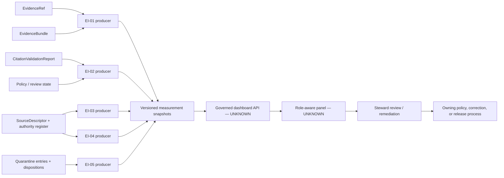

<!-- [KFM_META_BLOCK_V2]
doc_id: kfm://doc/dashboards-governance-evidence-integrity
title: Evidence Integrity Governance Dashboard Specification
type: dashboard
version: v1.0
status: draft; repository-grounded; documentation-only; metric-contracts-proposed; runtime-unverified; non-release; non-publication
owners: "@bartytime4life via CODEOWNERS; evidence, source, citation, policy, metric, review, release/correction, and independent-review stewardship NEEDS VERIFICATION"
created: 2026-05-20
updated: 2026-08-22
policy_label: public; documentation; dashboards; governance; evidence-integrity; cite-or-abstain; fail-closed
owning_root: docs/
responsibility: >-
  Define the human-readable Evidence Integrity dashboard boundary, preserve and
  reconcile its five inherited indicator families, describe proposed measurement
  contracts and safe display states, and expose current implementation gaps.
authority: >-
  Documentation and review guidance only. Contracts own semantic meaning;
  schemas own machine shape; registry and control-plane records own source
  authority; policy, review, telemetry, runtime, release, correction, rollback,
  deployment, and publication remain with their accountable owners.
current_path: docs/dashboards/governance/EVIDENCE_INTEGRITY.md
canonical_relationship: >-
  Same-path replacement of an existing tracked specification. Accepted Directory
  Rules v2 supports PLACE for this docs-root edit. Dashboard-lane canonicality,
  filename normalization, and structural migration remain HOLD.
truth_posture: >-
  CONFIRMED the tracked target and prior v0.1 blob; dashboard and indicator
  catalogs; accepted ADR-0029 and Directory Rules v2; CODEOWNERS routing;
  EvidenceRef, EvidenceBundle, CitationValidationReport, AIReceipt, and detailed
  SourceDescriptor surfaces; bounded EvidenceRef validation; the internal
  non-authoritative resolver candidate and one synthetic Hydrology adapter; the
  empty proposed source authority register; the placeholder source-registry
  package; the documentation-only Review Console boundary; and the inspected
  governed API route registry / LINEAGE the five Atlas-derived indicator names,
  old targets, panel ideas, and claimed running surface / PROPOSED metric
  populations, envelopes, thresholds, producers, panels, and drill-downs /
  CONFLICTED singular-versus-plural SourceDescriptor authority and admitted-source
  assumptions while the central register is empty / UNKNOWN production evidence
  resolution, source/freshness telemetry, quarantine ledger, metric store,
  dashboard route, deployed panel, correction propagation, and public parity.
evidence_snapshot:
  repository: bartytime4life/Kansas-Frontier-Matrix
  base_ref: main
  base_commit: 6aaea704230259e4fca30fcc0b9c1a168e12c2c2
  target_prior_blob: bba1be0102310aa7fb622ff62a448a29f1711751
  governance_readme_blob: 8f7dd5d70ad424b00ad59856813c11b0911f99de
  dashboard_catalog_blob: 82c7859b2782c13e97b1b3d3d55cdf35400fe675
  indicator_catalog_blob: 4fe3d6be5b0b6ba6359a301942c01d713c8e970f
  directory_rules_blob: fd49a0b83e55cef52c1124281f093e263526898d
  codeowners_blob: dd2a84aa514d8ecd9208bc347f90f9a2ed37dd61
  evidence_bundle_schema_blob: cf5256831b63dca46a5f68b168441adcf68b8751
  evidence_resolver_readme_blob: 74b12d1732b297458967a8c76bacca240b74eba3
  citation_validation_contract_blob: 29c507e76a9c15c44f2c195b7342e93630cdc701
  ai_receipt_contract_blob: 1e028525569b6032cd573e71d98df6b961fa70db
  source_authority_register_blob: 82c23722520922f5ca0dad7f37ed794d1c2edf81
  source_registry_package_blob: 6df77a248c72a17ddaeb5d701baf6e4d9db38eab
  source_descriptor_validator_blob: a0420731a1b80ce6d156f8e4cfd928a6b13699f4
  governed_api_route_registry_blob: 3418168d0b267160d6ad6dd87f289e880ef4a024
  review_console_readme_blob: 02512b6b8d16a8f1dfcd4c564f8b6d68b61b49e3
  quarantine_readme_blob: 9b375d795d96b15c06e51ef54770a023cd14454c
inspection_boundary: >-
  Current-session GitHub reads covered the complete prior target; dashboard,
  indicator, and governance documentation; directory authority; CODEOWNERS;
  evidence/source contracts, schemas, validators, resolver and registry surfaces;
  Review Console and governed API boundaries; quarantine documentation; and
  exact-path PR/branch overlap. No live source, production EvidenceBundle
  population, policy evaluator, review decision, release record, metric producer,
  dashboard API, deployed panel, correction cascade, rollback drill, or public
  endpoint was exercised.
related:
  - README.md
  - ../README.md
  - ../DASHBOARD_CATALOG.md
  - ../INDICATOR_CATALOG.md
  - ../domain/README.md
  - AI_SURFACE_HEALTH.md
  - RELEASE_CORRECTION_ROLLBACK.md
  - SENSITIVITY_RIGHTS.md
  - DOCUMENTATION_DRIFT.md
  - ../../doctrine/directory-rules.md
  - ../../adr/ADR-0029-adopt-directory-governance-standard-v2.md
  - ../../../contracts/evidence/README.md
  - ../../../contracts/evidence/evidence_ref.md
  - ../../../contracts/evidence/evidence_bundle.md
  - ../../../contracts/evidence/citation_validation_report.md
  - ../../../contracts/runtime/ai_receipt.md
  - ../../../packages/evidence-resolver/README.md
  - ../../../packages/source-registry/README.md
  - ../../../control_plane/source_authority_register.yaml
  - ../../../data/registry/sources/README.md
  - ../../../data/quarantine/README.md
  - ../../../apps/review-console/README.md
  - ../../../apps/governed-api/src/governed_api/routes/registry.py
  - ../../../.github/CODEOWNERS
tags: [kfm, dashboards, governance, evidence-integrity, evidence-ref, evidence-bundle, source-descriptor, source-role, citation-validation, quarantine, cite-or-abstain, non-publication]
notes:
  - "v1.0 replaces Atlas-only, behavior-assertive v0.1 prose with a repository-grounded dashboard specification."
  - "The five inherited indicator names remain lineage; numeric targets are not accepted metric contracts."
  - "The original H1 fragment and all eight v0.1 section fragments are preserved explicitly."
  - "This document changes no evidence, source, policy, review, release, dashboard, deployment, or publication state."
[/KFM_META_BLOCK_V2] -->

<a id="top"></a>
<a id="evidence-integrity-dashboard--governanceevidence_integritymd"></a>

# Evidence Integrity Governance Dashboard Specification

> **Purpose.** Define how a future system-wide review surface may report evidence
> and source integrity without treating a pointer as closure, a schema pass as
> truth, a dashboard score as policy or release authority, or missing telemetry as
> a healthy zero.

[](#1-status-and-scope)
[](#5-current-repository-evidence)
[](#5-current-repository-evidence)
[](#3-indicator-contracts)
[](#2-responsibility-and-placement-boundary)

> [!IMPORTANT]
> **This file is a specification, not a running dashboard.** It cannot resolve an
> `EvidenceRef`, authenticate an `EvidenceBundle`, admit a source, compute a
> production metric, clear policy, approve review, change release state, render a
> steward panel, or publish KFM material.

> [!WARNING]
> **`EvidenceRef` resolution is not claim closure.** `EvidenceRef` is a governed
> pointer; `EvidenceBundle` is a claim-scope closure artifact. Neither is a
> `PolicyDecision`, human review, `ReleaseManifest`, or public answer by itself.

> [!CAUTION]
> **No numeric target is accepted here.** The v0.1 values `> 99.9%` and `100%`
> remain lineage. A percentage is not reviewable until an accepted metric contract
> defines population, exclusions, arithmetic, time, missingness, disclosure, and
> correction behavior.

> [!NOTE]
> **Unknown coverage is not zero.** The central source authority register is empty;
> the source-registry package is a placeholder; the resolver is internal alpha with
> one synthetic Hydrology adapter; and no routed dashboard implementation was
> found. Those gaps produce `INCOMPLETE`, `ABSTAIN`, `ERROR`, or `NOT_MEASURED`—not
> a green card.

**Quick navigation:** [Status](#1-status-and-scope) ·
[Authority](#2-responsibility-and-placement-boundary) ·
[Indicators](#3-indicator-contracts) ·
[Measurement](#4-measurement-contract-and-display-states) ·
[Evidence](#5-current-repository-evidence) · [Signals](#6-signal-model) ·
[Panels](#7-proposed-panels-and-drill-downs) ·
[Ownership](#8-ownership-review-and-separation-of-duties) ·
[Public boundary](#9-public-api-ui-and-ai-boundary) ·
[Validation](#10-validation-and-negative-tests) ·
[Open work](#11-open-verification-register) ·
[Maintenance](#12-maintenance-correction-and-documentation-rollback) ·
[References](#13-cross-references) · [History](#14-change-history)

---

<a id="1-description"></a>

## 1. Status and scope

| Question | Repository-grounded answer | Truth label |
|---|---|---|
| Does the file exist? | Yes; the prior v0.1 target is blob `bba1be0102310aa7fb622ff62a448a29f1711751`. | `CONFIRMED` |
| What does it own? | Human-readable, system-wide dashboard and review guidance. | `CONFIRMED` responsibility |
| Is a production dashboard implemented? | No routed dashboard, metric producer, metric store, or deployed panel was proved. | `UNKNOWN` |
| Is `EvidenceRef` machine-shaped? | A fielded schema and dedicated local shape validator exist; referential resolution remains separate. | `CONFIRMED` bounded shape |
| Is `EvidenceBundle` machine-shaped? | A closed proposed schema requires claim scope, refs, sources, citations, rights, sensitivity, transforms, checksums, and `spec_hash`. | `CONFIRMED` shape; semantics `PROPOSED` |
| Does a resolver exist? | An internal non-authoritative candidate evaluator and one fixed Hydrology fixture adapter exist; neither is a public production resolver. | `CONFIRMED` bounded candidate |
| Is the source registry operational? | The package is a placeholder and the central authority register has `entries: []`. | `CONFIRMED` gap |
| Is quarantine throughput measurable? | The fail-closed boundary is documented, but a complete entry/event ledger and aggregate producer are unverified. | `UNKNOWN` |
| Does Review Console implement this panel? | Its README documents only a proposed app boundary. | `UNKNOWN` |
| Does this page authorize policy, release, or publication? | No. | `CONFIRMED` non-effect |
| Is the lane/filename final canon? | Same-path maintenance is allowed; structural convergence remains `HOLD`. | `CONFIRMED` disposition |

Repository presence proves bytes and proposed shapes exist. It does not prove evidence
truth, source admission, rights, policy, review, release, metrics, deployment, or
public parity.

[Back to top](#top)

---

## 2. Responsibility and placement boundary

This document owns indicator reconciliation, proposed measurement semantics, safe
aggregate states, current-evidence mapping, panel guidance, validation, maintenance,
and an explicit verification backlog.

It does **not** own:

| Responsibility | Owning surface | Effect here |
|---|---|---|
| Evidence meaning | [`contracts/evidence/`](../../../contracts/evidence/README.md) | This page cannot redefine evidence objects |
| Machine shape | evidence/source schemas | Current schema shape outranks prose |
| Source identity and authority | registry/control-plane records | A dashboard cannot admit or rank a source |
| Policy, rights, and sensitivity | `policy/` and accountable decisions | A chart cannot allow, deny, redact, or generalize |
| Human review | governed review records | CODEOWNERS routing is not approval |
| Release, correction, and rollback | `release/` and linked records | A green metric cannot publish or restore anything |
| Metric computation | accepted producer/telemetry surfaces | This file cannot manufacture measurements |
| Dashboard runtime | `apps/` behind governed interfaces | No route or panel is created here |

Accepted ADR-0029 adopts Directory Rules v2. `docs/` owns human explanation;
contracts own semantics; schemas own machine shape; policy owns admissibility;
data roots own lifecycle records; applications own deployable interfaces; and
release owns publication, correction, and rollback decisions.

| Proposed action | Placement outcome |
|---|---|
| Replace this tracked file in place | `PLACE` |
| Store metric snapshots, receipts, evidence, source records, or policy decisions here | `DENY` |
| Rename or move the dashboard lane in this slice | `HOLD` |
| Create a second Evidence Integrity specification | `DENY` absent an accepted split/migration |

<a id="5-files"></a>

### Connected file posture

- [`README.md`](README.md) defines the governance-dashboard documentation boundary.
- [`../DASHBOARD_CATALOG.md`](../DASHBOARD_CATALOG.md) catalogs this specification
  while runtime remains proposed.
- [`../INDICATOR_CATALOG.md`](../INDICATOR_CATALOG.md) mirrors the five lineage
  indicator families and prior targets.
- [`../domain/README.md`](../domain/README.md) governs per-domain dashboard specs.
- [`apps/review-console/`](../../../apps/review-console/README.md) is a proposed
  implementation boundary, not proof of this panel.
- The inspected governed API registry exposes bootstrap, layers, and evidence
  routes, not an Evidence Integrity dashboard route.

[Back to top](#top)

---

<a id="2-indicators-surfaced"></a>

## 3. Indicator contracts

The five names below are retained from v0.1 and the indicator catalog. Their
measurement contracts are **PROPOSED**.

| ID | Indicator family | Measurement question | Current repository posture |
|---|---|---|---|
| `EI-01` | **EvidenceRef resolution rate** | For an accepted claim/surface population, what disposition results when required refs and claimed bundles are checked? | Shape validation exists; internal fixture-only resolution exists; production population and resolver are unproved |
| `EI-02` | **Cite-or-abstain compliance** | Does each eligible answer/export/map/API candidate have coherent citation support and downstream gates, or a finite non-answer outcome? | Citation report is fixture-first; AIReceipt is proposed; runtime enforcement is unproved |
| `EI-03` | **Source-role distribution drift** | Did an admitted descriptor change role, authority, claim role, or public-use posture without governed lineage and review? | Detailed descriptor shape exists, but schema authority is conflicted and the central register is empty |
| `EI-04` | **Stale source rate** | Which accepted active descriptors are beyond their declared freshness expectation, and what disposition followed? | Freshness fields exist; accepted registry population and telemetry producer are unproved |
| `EI-05` | **Quarantine throughput** | What reason, age, review state, remediation, and governed exit or continuing hold is recorded for eligible entries? | Boundary semantics exist; complete ledger, reason registry, writers, consumers, and producer are unverified |

### Minimum metric contract

Every displayed value must bind:

- indicator and contract version;
- producer and computation profile;
- immutable snapshot and digest;
- exact eligible population, exclusions, numerator, denominator, unit, rounding,
  duplicates, and uncertainty;
- source/retrieval/valid/release/correction times and late-arrival rules;
- null, absent, unknown, stale, suppressed, restricted, malformed, and
  not-applicable semantics;
- evidence, source, policy, review, and release references;
- disclosure class, drill-down permissions, correction, supersession, retention,
  and rollback behavior.

### v0.1 threshold lineage

| Prior target | Current disposition |
|---|---|
| EvidenceRef resolution `> 99.9%` | `LINEAGE`; population and window are undefined |
| Cite-or-abstain compliance `100%` | Safety intent retained; no accepted producer or population yet |
| “Low and explainable” quarantine throughput | `LINEAGE`; “low” may reward unsafe under-detection |
| Zero unreviewed role changes | Safety intent retained; accepted role vocabulary and event lineage are required |
| One stale-source tolerance | Rejected; cadence must be source/family specific |

[Back to top](#top)

---

## 4. Measurement contract and display states

A dashboard value is a reviewable projection over governed records, not an
unqualified number. A future machine envelope should carry at least:

```yaml
indicator_id: EI-01
metric_contract_version: <accepted version>
measurement_id: <traceable id>
producer_ref: <governed producer>
snapshot_ref: <immutable snapshot>
snapshot_digest: sha256:<digest>
generated_at: <RFC 3339 time>
window: {starts_at: <time>, ends_at: <time>}
scope: {domains: [<ids>], surfaces: [<classes>]}
population:
  eligibility_ref: <accepted rule>
  eligible_count: <integer or null>
  excluded_count: <integer or null>
measurement:
  numerator: <number or null>
  denominator: <number or null>
  value: <number or null>
  unit: <unit or null>
evidence_refs: [<refs>]
policy_decision_ref: <ref or null>
review_ref: <ref or null>
release_ref: <ref or null>
display_state: <finite state>
reason_codes: [<accepted codes>]
limitations: [<limitations>]
supersedes: <prior measurement or null>
```

This YAML is illustrative documentation, not a schema.

| Display state | Meaning |
|---|---|
| `PASS` | Complete accepted population; accepted condition met |
| `DEGRADED` | Complete computation; adverse drift or condition missed |
| `INCOMPLETE` | Population, authority, or required records are missing |
| `ABSTAIN` | A defensible value cannot be produced |
| `DENY` | Policy forbids the requested value or detail |
| `ERROR` | Producer, resolver, registry, or dependency failed |
| `NOT_APPLICABLE` | Accepted contract excludes the scope |
| `NOT_MEASURED` | No accepted contract or producer exists |

```text
schema-valid EvidenceRef != resolved EvidenceRef
resolved EvidenceRef != authenticated EvidenceBundle closure
EvidenceBundle closure != policy permission != human review != release
dashboard PASS != release, promotion, publication, or truth
missing telemetry != zero
AIReceipt present != cite-or-abstain compliant
```

[Back to top](#top)

---

<a id="4-inputs--receipts-and-records-read"></a>

## 5. Current repository evidence

| Surface | Confirmed boundary | Dashboard implication |
|---|---|---|
| [`EvidenceRef`](../../../contracts/evidence/evidence_ref.md) | Proposed semantics, fielded schema, dedicated shape validator | Count shape validity separately from resolution and closure |
| [`EvidenceBundle`](../../../contracts/evidence/evidence_bundle.md) | Closed schema requires refs, sources, citations, rights, sensitivity, transforms, checksums, and `spec_hash` | Never call schema-valid bytes released evidence |
| [`packages/evidence-resolver/`](../../../packages/evidence-resolver/README.md) | Internal non-authoritative candidate evaluator plus one no-network Hydrology adapter | Resolver coverage is bounded, not production-ready |
| [`CitationValidationReport`](../../../contracts/evidence/citation_validation_report.md) | Fixture-first validation of declared states | Report coherence and upstream truth are different metrics |
| [`AIReceipt`](../../../contracts/runtime/ai_receipt.md) | Proposed accountability receipt | Receipt presence alone cannot satisfy `EI-02` |
| SourceDescriptor schema/validator | Rich source-role, rights, sensitivity, cadence, source-head, review, and release fields | Enables future inputs, not current source-health statistics |
| [`source_authority_register.yaml`](../../../control_plane/source_authority_register.yaml) | Proposed register with `entries: []` | `EI-03` and `EI-04` are centrally `NOT_MEASURED` |
| [`packages/source-registry/`](../../../packages/source-registry/README.md) | Placeholder metadata and exports | Do not claim operational registry coverage |
| [`data/quarantine/`](../../../data/quarantine/README.md) | Canonical fail-closed boundary | `EI-05` remains unmeasured without a ledger/producer |
| [`apps/review-console/`](../../../apps/review-console/README.md) | Proposed role-gated app boundary | Running panel remains `UNKNOWN` |
| Governed API route registry | Bootstrap, layers, and evidence routes only | No dashboard API may be claimed |

A future producer must not infer current state from README badges, file presence,
commit/PR/workflow state alone, fixture counts, generated receipts without subject
binding, raw directory counts, model summaries, map tiles, screenshots, graph
indexes, or cached UI state.

[Back to top](#top)

---

## 6. Signal model



Rules:

1. Producers consume explicit governed records, not inferred authority.
2. Measurements are versioned outside `docs/`; this page does not choose that home.
3. Clients use governed projections, not direct canonical-store reads.
4. Drill-downs are audience and sensitivity aware.
5. Metric computation, review, policy, correction, and release remain separate.
6. Corrections preserve prior snapshots and forward lineage.

[Back to top](#top)

---

<a id="3-panels-proposed"></a>

## 7. Proposed panels and drill-downs

| Panel | Primary view | Required negative states |
|---|---|---|
| Evidence closure disposition | Resolved/unresolved/denied/error/unmeasured by snapshot and scope | incomplete population, missing bundle, resolver error, denied detail |
| Cite-or-abstain posture | Candidate result by surface/template and snapshot | malformed report, stale support, missing citation, unreleased candidate |
| Source-role drift | Descriptor-version changes by role, authority, and family | empty register, unknown role, unreviewed change, conflicted schema |
| Freshness disposition | Fresh/stale/unknown/held/superseded by accepted cadence | missing cadence, unknown source head, stale without disposition |
| Quarantine flow | Entries and dispositions by reason, age, domain, and review | ledger absent, restricted reason, aged review, silent exit attempt |

Panel safeguards:

- show counts and coverage before percentages;
- show snapshot and generated time;
- distinguish source, retrieval, valid, release, and correction times;
- never expose protected content, geometry, credentials, or sensitive reasons;
- never average away `DENY`, `ERROR`, or `INCOMPLETE` into one health score;
- never let a dashboard click silently mutate evidence, policy, quarantine, or release;
- share a metric definition across system/domain rollups or declare an explicit
  profile difference.

[Back to top](#top)

---

<a id="6-ownership-and-review-burden"></a>

## 8. Ownership, review, and separation of duties

`@bartytime4life` is the confirmed GitHub review route through `CODEOWNERS`.
That does not prove evidence stewardship, source authority, policy approval,
metric ownership, independent review, release approval, or publication authority.

| Responsibility | Needed role | Status |
|---|---|---|
| Evidence semantics | Evidence/contracts steward | `NEEDS VERIFICATION` |
| Source role and authority | Source/registry plus domain steward | `NEEDS VERIFICATION` |
| Citation validation | Citation/evidence steward | `NEEDS VERIFICATION` |
| Metric contract/producer | Metric/observability steward | `NEEDS VERIFICATION` |
| Rights and sensitivity | Policy/rights/sensitivity reviewers | `NEEDS VERIFICATION` |
| Dashboard and accessibility | App/UI steward | `NEEDS VERIFICATION` |
| Remediation routing | Review steward | `NEEDS VERIFICATION` |
| Release/correction linkage | Release/correction steward | `NEEDS VERIFICATION` |
| Material change | Independent reviewer | `NEEDS VERIFICATION` |

A producer may compute but must not be the sole authority to admit a source, clear
policy, approve correction, or release. A UI steward may alter presentation but
must not redefine contract, schema, policy, or release semantics. Sensitive
access is separately policy-gated and audited.

[Back to top](#top)

---

## 9. Public, API, UI, and AI boundary

A future governed API must expose accepted measurement envelopes and safe
projections; preserve state, snapshot, population, limitations, and reasons;
enforce audience, role, rights, sensitivity, and purpose; distinguish absent from
zero and stale from current; and make correction state visible.

A future Review Console panel must be role-gated and route actions through an
auditable workflow. The current README does not prove source, routes, panels,
metric adapters, tests, deployment, logs, or telemetry.

A normal public Explorer should not expose steward-only health details, authority
gaps, quarantine reasons, protected source restrictions, internal paths, or
sensitive joins without an explicit public contract and release decision.

AI may summarize a resolved, policy-safe measurement snapshot. It must not infer
source authority/freshness, compute metrics from prose, disclose restricted detail,
treat AIReceipt as closure, turn a score into release authority, or emit `ANSWER`
when evidence, policy, review, or release is unresolved.

[Back to top](#top)

---

<a id="7-acceptance"></a>

## 10. Validation and negative tests

### Documentation acceptance

- [ ] One complete, YAML-parseable `KFM_META_BLOCK_V2` with an allowed `type`.
- [ ] One H1 and all legacy fragments retained exactly once.
- [ ] Relative links resolve at the pinned branch.
- [ ] No target is presented as accepted without a metric contract.
- [ ] Implementation claims are evidence-backed or truth-labeled.
- [ ] Indicator prose does not redefine contracts, schemas, policy, or release.
- [ ] Missing telemetry is never represented as zero or healthy.
- [ ] Dashboard PASS is never represented as publication or truth.
- [ ] UTF-8, LF, final newline, no tabs, trailing whitespace, or conflict markers.
- [ ] One changed file unless a direct dependency is proved.

### Future producer acceptance

- [ ] Accepted contract/schema, immutable snapshot, and deterministic profile.
- [ ] Positive, invalid, missing, stale, denied, restricted, and error fixtures.
- [ ] Population, exclusion, null, duplicate, late-arrival, and correction tests.
- [ ] Evidence/source/policy/review/release binding tests.
- [ ] Governed API authorization, safe errors, accessibility, and leakage tests.
- [ ] Independent review and rollback drill.

| Negative case | Required safe result |
|---|---|
| Schema-valid ref cannot resolve | `INCOMPLETE`/`ABSTAIN`; never compliant |
| Claimed bundle is missing or inactive | unresolved; no public `ANSWER` |
| Bundle lacks rights, sensitivity, citations, checksum, or `spec_hash` | fail or `ABSTAIN`/`DENY` |
| Citation report says PASS while upstream state is stale/unreleased | deterministic non-pass result |
| AIReceipt exists without valid citation/evidence binding | `EI-02` not satisfied |
| Descriptor validates but no accepted authority entry exists | `INCOMPLETE`, not admitted |
| Role changes without version/review lineage | `DEGRADED`/`HOLD` |
| Cadence or source head is missing | `INCOMPLETE`, not fresh |
| Central register is empty | `NOT_MEASURED`, not zero drift/staleness |
| Quarantine ledger is absent | `NOT_MEASURED`/`INCOMPLETE` |
| Restricted reason is requested publicly | `DENY` with safe copy |
| Producer fails | `ERROR`; no stale value reused as current without an accepted rule |
| Measurement is corrected | preserve old snapshot; issue a superseding measurement |

[Back to top](#top)

---

<a id="8-open-questions"></a>

## 11. Open verification register

| ID | Question | Status |
|---|---|---|
| `EI-Q01` | Which accepted artifact owns the five indicator definitions? | `NEEDS VERIFICATION` |
| `EI-Q02` | What is the eligible population for EvidenceRef resolution? | `UNKNOWN` |
| `EI-Q03` | Which contract/schema/storage family owns measurements? | `UNKNOWN` |
| `EI-Q04` | Which production resolver authenticates evidence and correction state? | `UNKNOWN` |
| `EI-Q05` | Which SourceDescriptor schema and role vocabulary are canonical? | `CONFLICTED` |
| `EI-Q06` | Who populates and reviews the source authority register? | `UNKNOWN` |
| `EI-Q07` | What cadence/currentness policy applies per source family? | `NEEDS VERIFICATION` |
| `EI-Q08` | What is the canonical quarantine entry/event/exit profile? | `UNKNOWN` |
| `EI-Q09` | Is citation validation consumed by governed runtime surfaces? | `UNKNOWN` |
| `EI-Q10` | Where are AIReceipt instances persisted and correlated? | `UNKNOWN` |
| `EI-Q11` | Which route/application owns the dashboard? | `UNKNOWN` |
| `EI-Q12` | Which drill-down fields are public, restricted, or prohibited? | `NEEDS VERIFICATION` |
| `EI-Q13` | Which named stewards and independent reviewers own remediation? | `NEEDS VERIFICATION` |
| `EI-Q14` | Should the uppercase filename or dashboards lane be migrated? | `HOLD` |
| `EI-Q15` | What proves external/offline invalidation after correction? | `UNKNOWN` |

[Back to top](#top)

---

## 12. Maintenance, correction, and documentation rollback

Re-review this page when evidence/source contracts, schemas, resolver, registry,
quarantine profile, metric contract, dashboard API/panel, indicator doctrine,
rights/sensitivity policy, correction behavior, or dashboard placement changes.

When a metric becomes accepted, link its contract/schema; name producer, snapshot,
and storage authority; add bounded fixtures and tests; record population and
missingness; update current-state rows with exact evidence; and add correction and
rollback proof.

If prose conflicts with contracts, schemas, policy, implementation/tests, or release
records, those owners control their respective meanings and this document receives a
visible forward correction. Never edit a metric definition merely to make a value look
healthy.

Before merge, close the draft PR and abandon the branch. After an authorized merge,
revert this file to prior blob `bba1be0102310aa7fb622ff62a448a29f1711751`
or issue a bounded forward-correction PR. A documentation revert does not restore
evidence, change source admission, clear policy/review, exit quarantine, invalidate a
cache, reverse a correction, roll back a release, change deployment, or alter public
state.

[Back to top](#top)

---

## 13. Cross-references

### Dashboard documentation

- [Governance dashboard boundary](README.md)
- [Dashboard catalog](../DASHBOARD_CATALOG.md)
- [Indicator catalog mirror](../INDICATOR_CATALOG.md)
- [Domain dashboard boundary](../domain/README.md)
- [AI Surface Health](AI_SURFACE_HEALTH.md)
- [Release, Correction, and Rollback](RELEASE_CORRECTION_ROLLBACK.md)
- [Sensitivity and Rights](SENSITIVITY_RIGHTS.md)
- [Documentation and Drift](DOCUMENTATION_DRIFT.md)

### Evidence, source, runtime, and governance

- [Evidence contracts](../../../contracts/evidence/README.md)
- [`EvidenceRef`](../../../contracts/evidence/evidence_ref.md)
- [`EvidenceBundle`](../../../contracts/evidence/evidence_bundle.md)
- [`CitationValidationReport`](../../../contracts/evidence/citation_validation_report.md)
- [`AIReceipt`](../../../contracts/runtime/ai_receipt.md)
- [Evidence resolver](../../../packages/evidence-resolver/README.md)
- [Source registry package](../../../packages/source-registry/README.md)
- [Central source authority register](../../../control_plane/source_authority_register.yaml)
- [Source registry data boundary](../../../data/registry/sources/README.md)
- [Quarantine boundary](../../../data/quarantine/README.md)
- [Review Console boundary](../../../apps/review-console/README.md)
- [Governed API route registry](../../../apps/governed-api/src/governed_api/routes/registry.py)
- [Accepted Directory Rules v2](../../doctrine/directory-rules.md)
- [ADR-0029](../../adr/ADR-0029-adopt-directory-governance-standard-v2.md)
- [CODEOWNERS](../../../.github/CODEOWNERS)

[Back to top](#top)

---

## 14. Change history

| Version | Date | Change | Authority effect |
|---|---|---|---|
| v0.1 | 2026-05-20 | Atlas-derived five-indicator spec with fixed targets, panel ideas, receipt list, owner placeholders, and Review Console pointer. | Design lineage; runtime and metrics unproved. |
| v1.0 | 2026-08-22 | Reconciles current evidence/source contracts, schemas, validators, resolver, citation report, AIReceipt, SourceDescriptor, empty authority register, source-registry placeholder, quarantine, Review Console, governed API, Directory Rules, and CODEOWNERS; preserves compatibility anchors and replaces fixed claims with proposed metric contracts and explicit gaps. | Documentation-only; no evidence, source, policy, review, release, dashboard, deployment, or publication effect. |

---

**Last reviewed:** 2026-08-22 · **Prior target blob:**
`bba1be0102310aa7fb622ff62a448a29f1711751` · **Document version:** v1.0 ·
**Status:** repository-grounded draft · **Dashboard runtime:** `UNKNOWN` ·
**Publication effect:** none

[Back to top](#top)
