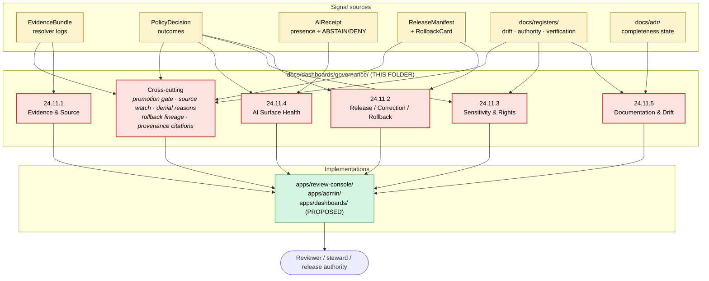

<!-- [KFM_META_BLOCK_V2]
doc_id: kfm://doc/dashboards-governance-readme
title: Governance Health Dashboards (PROPOSED lane; specifications only, system-wide scope)
type: standard
version: v1
status: draft
owners: OWNER_TBD  # NEEDS VERIFICATION: docs steward + governance-health steward + release authority
created: 2026-05-25
updated: 2026-05-25
policy_label: public
related:
  - kfm://doc/directory-rules                                # CONFIRMED: docs/doctrine/directory-rules.md
  - kfm://doc/atlas-v1-1                                     # PROPOSED: docs/atlases/KFM_Domains_Culmination_Atlas_v1_1.pdf §24.11
  - kfm://doc/atlas-v1-1-ch24-5-sensitivity-tier-reference   # CONFIRMED authored sibling (§24.5)
  - kfm://doc/atlas-v1-1-ch24-6-pipeline-gate-reference      # CONFIRMED authored sibling (§24.6)
  - kfm://doc/dashboards-domain-readme                       # CONFIRMED authored sibling: docs/dashboards/domain/README.md
  - kfm://doc/backlog-navigation-index                       # CONFIRMED authored: docs/backlog/README.md
  - kfm://adr/dashboards-lane-existence                      # PROPOSED candidate: OPEN-DASH-01
tags: [kfm, dashboards, governance, indicators, system-wide, health, readme]
notes:
  - This README sits at a PROPOSED lane (`docs/dashboards/`). The lane is not in the Directory Rules §6.1 `docs/` tree.
  - This file scopes to SYSTEM-WIDE governance health dashboards (§24.11.1–§24.11.5 + cross-cutting governance views). Per-domain dashboards live in the sibling `domain/` folder.
  - Specifications only — implementations live in `apps/`; indicator definitions live in Atlas §24.11; drift / verification / ADR records live in their canonical homes.
  - Whether `docs/dashboards/` should exist as a lane is ADR-class per Directory Rules §2.4(5). Logged as OPEN-DASH-01.
[/KFM_META_BLOCK_V2] -->

# Governance Health Dashboards

<!-- [doc: kfm://doc/dashboards-governance-readme] -->
<a id="top"></a>

> System-wide **governance health dashboard specifications** — the cross-domain views that show whether KFM is operating in keeping with its own doctrine. Five align with Atlas §24.11 sub-sections (evidence, release, sensitivity, AI, documentation); the rest are cross-cutting (promotion-gate status, drift triage, ADR completeness, source watch). **Specifications only.**

<p>
  
  
  
  
  
  
  
</p>

> [!IMPORTANT]
> **Truth posture.** Atlas §24.11 carries the indicator catalog (CONFIRMED text, indicators labeled PROPOSED in source). VB-11-08 (§G.7) explicitly flags instrumentation and steward ownership as NEEDS VERIFICATION. This folder's **lane** (`docs/dashboards/`) and **scope split** (governance vs domain vs release) are PROPOSED per OPEN-DASH-01 and OPEN-DASH-05. Whether any dashboard listed here is actually implemented in the mounted repo is NEEDS VERIFICATION.

> [!CAUTION]
> **Parallel-authority concern.** Atlas §24.11 owns the master indicator catalog. `docs/registers/` already owns several governance artifacts (AUTHORITY_LADDER, DRIFT_REGISTER, CANONICAL_LINEAGE_EXPLORATORY, VERIFICATION_BACKLOG, OBJECT_FAMILY_MAP). A dashboard spec here that **redefines** an indicator or **mirrors** a register is parallel authority. See §4 (exclusions) and §7.1 (conflict resolution).

> [!NOTE]
> **Anti-collapse rule.** Indicators are reported, not enforced — Atlas §24.11 says so explicitly. None of these dashboards is a sufficient condition for trust; together they describe a healthy posture that points back to the evidence, policy, review, and release artifacts that **actually** carry trust.

---

## Contents

1. [Scope](#1-scope)
2. [Repo fit](#2-repo-fit)
3. [Accepted inputs](#3-accepted-inputs)
4. [Exclusions](#4-exclusions)
5. [Dashboard inventory](#5-dashboard-inventory)
6. [Specification template](#6-specification-template)
7. [Integration with Atlas §24.11, registers, and `apps/`](#7-integration-with-atlas-2411-registers-and-apps)
8. [Signal-roll-up diagram](#8-signal-roll-up-diagram)
9. [Relationship to per-domain dashboards](#9-relationship-to-per-domain-dashboards)
10. [Verification checklist](#10-verification-checklist)
11. [Maintenance task list](#11-maintenance-task-list)
12. [Open questions & ADR cross-reference](#12-open-questions--adr-cross-reference)
13. [Evidence basis & citations](#13-evidence-basis--citations)

---

## 1. Scope

This folder hosts **system-wide governance health dashboard specifications** — one per Atlas §24.11 sub-section, plus a handful of cross-cutting governance views named in the Pass 32 corpus. The specifications describe:

- which **indicators** the dashboard surfaces (drawn from Atlas §24.11);
- what the **healthy posture** looks like at the system scale (not per-domain — see §9);
- which **receipts, registers, policies, and validators** emit the signals;
- who **owns** the dashboard (docs steward, governance-health steward, release authority — varies by dashboard);
- where the **implementation** lives (`apps/review-console/`, `apps/admin/`, or future `apps/dashboards/`).

These specs are **read-only references** for implementers. The signals live in `data/receipts/`, `release/manifests/`, `policy/`, `docs/registers/`, and the runtime observability layer. The dashboards render in `apps/`.

> [!TIP]
> **Three-folder mental model.** `docs/dashboards/governance/` is the **system-wide health view**. `docs/dashboards/domain/` is the **per-domain instance view**. A future `docs/dashboards/release/` (sibling, PROPOSED) would be the **release-lifecycle view**. The same indicator can appear in all three — at different aggregation scopes — without that being a redefinition.

[↑ back to top](#top)

---

## 2. Repo fit

```text
docs/
└── dashboards/                       # PROPOSED lane (Directory Rules §6.1 does not list this)
    ├── README.md                     # PROPOSED parent README (NEEDS VERIFICATION)
    ├── governance/                   # THIS FOLDER — system-wide governance health dashboards
    │   ├── README.md                 # THIS FILE
    │   ├── evidence-and-source.md    # ⏳ §24.11.1
    │   ├── release-correction-rollback.md  # ⏳ §24.11.2
    │   ├── sensitivity-and-rights.md # ⏳ §24.11.3
    │   ├── ai-surface-health.md      # ⏳ §24.11.4
    │   ├── documentation-and-drift.md # ⏳ §24.11.5
    │   ├── promotion-gate-status.md  # ⏳ cross-cutting
    │   └── …                         # ⏳ remaining cross-cutting governance specs (§5)
    ├── domain/                       # CONFIRMED authored sibling — per-domain dashboards
    │   └── README.md
    └── release/                      # PROPOSED sibling — release / rollback / correction
```

**Upstream authorities.**

| Upstream | Relationship |
|:---|:---|
| `docs/atlases/KFM_Domains_Culmination_Atlas_v1_1.pdf` §24.11 (subsections 1–5) | **Master governance health indicators.** This folder instances them at system scale; it does not redefine them. |
| `docs/atlases/KFM_Domains_Culmination_Atlas_v1_1.pdf` §24.10 (Risk Register) | Drives which governance health categories warrant prominent dashboards. |
| `docs/atlases/KFM_Domains_Culmination_Atlas_v1_1.pdf` §24.6 (Pipeline Gates) | Provides the gate-and-reason-code vocabulary that promotion-gate dashboards visualize. |
| `docs/atlases/KFM_Domains_Culmination_Atlas_v1_1.pdf` §24.9 (Failure-Mode Register) | Source of cross-cutting trust-membrane anti-patterns surfaced by governance dashboards. |
| `docs/registers/AUTHORITY_LADDER.md`, `DRIFT_REGISTER.md`, `VERIFICATION_BACKLOG.md` | Canonical **records** that several governance dashboards visualize. **Registers always win** on data conflicts. |
| `docs/doctrine/directory-rules.md` | Places `docs/` lanes; this lane is not yet placed there. See §12 OPEN-DASH-01. |

**Downstream consumers.**

| Downstream | Relationship |
|:---|:---|
| `apps/review-console/`, `apps/admin/`, future `apps/dashboards/` | **Implementations.** Each spec points to its implementation home. |
| `runtime/observability/` *(NEEDS VERIFICATION)* | Telemetry plumbing for indicator signals. |
| `schemas/contracts/v1/` | Receipt and report shapes whose presence/absence the governance dashboards measure. |
| `policy/` | Policy bundles emitting `PolicyDecision` outcomes (DENY-reason distributions, ABSTAIN rates, etc.). |
| `docs/dashboards/domain/<domain>.md` | **Reciprocal**: each governance dashboard has a per-domain breakdown surface in the sibling `domain/` folder. See §9. |

[↑ back to top](#top)

---

## 3. Accepted inputs

Files that belong here:

- **Five `<24.11-subsection>.md` files**, one per Atlas §24.11 sub-section (see §5.1).
- **Cross-cutting governance specs** as listed in §5.2.
- **This README** (`README.md`).
- Optional `<dashboard>/figures/` sub-folder per spec for separately-versioned diagrams.

Each spec MUST:

- declare the **§24.11 sub-section** (or specific cross-cutting card ID) it instances;
- declare the **system-wide healthy posture** per indicator;
- name the **canonical signal source** (receipt class, register file, policy bundle, validator output);
- name the **owners** (docs steward + governance-health steward + release authority where materiality applies);
- point to its **implementation home** in `apps/`, or note `UNKNOWN`;
- link to its **per-domain breakdown** in `docs/dashboards/domain/<domain>.md` for each applicable domain.

[↑ back to top](#top)

---

## 4. Exclusions

| ❌ Do not put here | ✅ Belongs in |
|:---|:---|
| **Per-domain instances** of indicators (e.g., "Hydrology stale-source rate") | `docs/dashboards/domain/<domain>.md` |
| **Release-lifecycle-only** dashboards (release manifest browser, rollback card timeline, correction lineage) | `docs/dashboards/release/` (PROPOSED sibling) — but note §24.11.2 indicators can appear in both views at different scopes |
| Dashboard implementations (React, configs, chart definitions) | `apps/<dashboard-app>/` |
| Telemetry plumbing or signal emission code | `runtime/observability/` or per-package adapters |
| Schema definitions for receipts / reports | `schemas/contracts/v1/<family>/` |
| Policy bundles emitting denial reasons | `policy/<scope>/` |
| **Redefinitions** of master indicators (drift from §24.11) | Atlas §24.11 — propose amendment via ADR |
| **Mirrors** of canonical registers (drift register data, authority ladder rows) | The registers themselves in `docs/registers/` — dashboards point to registers, never mirror them |
| The actual drift entries / ADR-completeness tracking data | `docs/registers/DRIFT_REGISTER.md` / `docs/adr/` |
| Per-domain validator code | `tests/domains/<domain>/` or `tools/validators/` |
| New backlog items | The canonical backlog homes — see `docs/backlog/README.md` |

> [!WARNING]
> **Register-mirror watch.** Governance dashboards visualize registers; they do not store register data. If a spec here begins to enumerate drift items, ADR statuses, or authority-ladder entries, that's a sign the canonical register is the right home for that content — point to it, don't copy it.

[↑ back to top](#top)

---

## 5. Dashboard inventory

Two groups: (1) one dashboard per Atlas §24.11 sub-section, and (2) cross-cutting governance dashboards drawn from the Pass 32 New Cards Register and the Atlas §24.9 / §24.10 registers.

### 5.1 §24.11-aligned dashboards (5)

Each row is a candidate target. Indicator counts are CONFIRMED from §24.11 of the Atlas v1.1 manuscript.

| §24.11 sub-section | Title | File | Indicators | Status |
|:---:|:---|:---|:---:|:---:|
| **24.11.1** | Evidence and Source Integrity | `evidence-and-source.md` | 5 | ⏳ |
| **24.11.2** | Release, Correction, Rollback | `release-correction-rollback.md` | 5 | ⏳ |
| **24.11.3** | Sensitivity and Rights | `sensitivity-and-rights.md` | 5 | ⏳ |
| **24.11.4** | AI Surface Health | `ai-surface-health.md` | 4 | ⏳ |
| **24.11.5** | Documentation and Drift | `documentation-and-drift.md` | 4 | ⏳ |

**Total indicators surfaced across all five: 23** (matches Atlas §24.11 catalog count).

### 5.2 Cross-cutting governance dashboards (5)

Drawn from the Pass 32 New Cards Register and Atlas §24.6 / §24.9 / §24.12 — each cross-cutting dashboard visualizes something the §24.11 sub-sections don't fully capture as a single view.

| Title | File | Source card / atlas reference | Status |
|:---|:---|:---|:---:|
| Promotion Gate Status Board | `promotion-gate-status.md` | **KFM-P32-FEAT-0014** (Pass 32 New Cards Register); maps to Atlas §24.6 gates + §24.6.3 reason codes | ⏳ |
| Source Availability Watchlist | `source-availability-watch.md` | **KFM-P32-FEAT-0016** (Pass 32); maps to Atlas §24.11.1 stale-source rate + Atlas §24.1 source roles | ⏳ |
| Denial Reason Explorer | `denial-reason-explorer.md` | **KFM-P32-FEAT-0017** (Pass 32); maps to Atlas §24.3 outcome envelope + §24.11.4 DENY distribution | ⏳ |
| Rollback & Correction Lineage Timeline | `rollback-correction-lineage.md` | **KFM-P32-FEAT-0020** (Pass 32); maps to Atlas §24.6 (Correction/Rollback gates) + §24.8 Stale-State/Supersession | ⏳ |
| Provenance Citations Panel | `provenance-citations.md` | **KFM-P32-FEAT-0019** (Pass 32); maps to Atlas §24.11.1 cite-or-abstain compliance | ⏳ |

> [!NOTE]
> **Overlap with `docs/dashboards/release/`.** Items like the Rollback & Correction Lineage Timeline genuinely fit either folder. Current convention: **release-lifecycle-only** views go to `release/`; **governance-posture** views (which include release health as one signal among many) live here. OPEN-DASH-GOV-01 tracks the boundary.

### 5.3 Status legend

| Symbol | Meaning |
|:---:|:---|
| ✅ | Authored in this folder. |
| ⏳ | Proposed; not yet authored. |
| 🛠️ | In progress. |
| 🚫 | Withdrawn (not currently used). |
| 🔄 | Superseded by a later spec (not currently used). |

[↑ back to top](#top)

---

## 6. Specification template

Each spec file follows the skeleton below — the same skeleton used by `domain/` specs, adapted to system-wide scope.

```markdown
<!-- KFM_META_BLOCK_V2 with type: standard, related: cross-references -->

# <Dashboard Title>

> One-line scope statement.

[badges: status, lane=PROPOSED, atlas §24.11.X reference, signal sources]

> [!IMPORTANT]
> Truth posture: indicator catalog from Atlas §24.11.X (PROPOSED in source); instrumentation NEEDS VERIFICATION (VB-11-08).

## 1. Scope
- Atlas §24.11.X reference (or §24.6 / §24.9 / Pass 32 card ID for cross-cutting)
- Audience (reviewer / steward / release authority)
- Aggregation scope (system-wide, **not** per-domain)

## 2. Indicators
Table: each indicator, what it measures, system-wide healthy posture, signal source.

| Indicator | What it measures | Healthy posture | Signal source |
|:---|:---|:---|:---|
| EvidenceRef resolution rate | % of public-surface EvidenceRefs that resolve | > 99.9% over trailing release window | EvidenceBundle resolver logs |
| …                              | …                              | …                              | …                              |

## 3. Per-domain breakdowns
Cross-reference to `docs/dashboards/domain/<domain>.md` for each domain that instances any indicator here.

## 4. Ownership
- Docs steward: <name or OWNER_TBD>
- Governance-health steward: <name or OWNER_TBD>
- Release authority (if §24.11.2 indicators): <name or OWNER_TBD>
- Implementation owner: <apps/ team or OWNER_TBD>

## 5. Implementation pointer
- Dashboard app: `apps/<path>/` or `UNKNOWN`
- Telemetry: `runtime/observability/<adapter>/` or `UNKNOWN`
- Schemas read: `schemas/contracts/v1/<families>/`
- Policy bundles emitting signals: `policy/<scope>/`
- Registers visualized: `docs/registers/<file>.md`

## 6. Review cadence
How often the spec is reviewed; trigger events (Atlas §24.11 amendment, register restructure, etc.).

## 7. Open questions
Local `OPEN-DASH-GOV-<scope>-NN` items if any.

## 8. Evidence basis & citations
Standard source ledger.

<sub>Anti-collapse footer reaffirming indicator-vs-register vs implementation layering.</sub>
```

> [!TIP]
> Keep specs **bounded**. A governance dashboard spec should fit in a single Markdown file with the indicator table as the centerpiece. Cross-cutting dashboards (§5.2) may carry slightly richer scope sections but follow the same skeleton.

[↑ back to top](#top)

---

## 7. Integration with Atlas §24.11, registers, and `apps/`

Each governance dashboard spec is a **four-way bridge**:

| Direction | What it consumes | What it produces |
|:---|:---|:---|
| **Up to Atlas §24.11** | The indicator definitions (24.11.1 – 24.11.5). | A statement of *which* indicators this dashboard renders and *how* they aggregate at system scope. |
| **Sideways to `docs/registers/`** | Canonical register state (drift entries, authority ladder, verification backlog). | Visualization pointers — *"this dashboard shows drift trends; the drift entries live in `DRIFT_REGISTER.md`."* |
| **Down to `policy/`, `schemas/`, `runtime/`** | The actual signal-emission machinery. | The implementation pointer (§5 of template) — tells the implementer which telemetry, schemas, and policy bundles to wire up. |
| **Across to `docs/dashboards/domain/`** | The per-domain breakdown of the same indicators. | Reciprocal cross-references (§9). |

### 7.1 Conflict resolution

| Conflict | Winner |
|:---|:---|
| Governance spec vs Atlas §24.11 indicator definition | **Atlas wins.** Propose a §24.11 amendment via ADR. |
| Governance spec vs `docs/registers/<register>.md` data | **Register wins.** The spec points to the register; it does not duplicate it. |
| Governance spec vs `docs/dashboards/domain/<domain>.md` | **Equal weight — different scope.** System-wide healthy posture and per-domain instance posture must reconcile, not override each other. Surface drift to `DRIFT_REGISTER.md`. |
| Governance spec vs `apps/` actual implementation | The implementation is the **operational truth**; divergence is a drift signal. |
| Governance spec vs `policy/` enforcement | **Policy wins.** A spec claiming an indicator measures a policy outcome must match the actual policy's `PolicyDecision` shape. |
| §24.11.2 governance indicator vs `docs/dashboards/release/` version of the same indicator | **No winner — different aggregation level.** Governance shows trend; release shows per-release detail. Both reference the same `ReleaseManifest` / `CorrectionNotice` / `RollbackCard` records. |

> [!IMPORTANT]
> Specs **describe**; doctrine **defines**; policy **enforces**; registers **record**; implementations **render**. Five layers, four conflict-resolution rules. When this folder forgets the layering, parallel-authority drift follows.

[↑ back to top](#top)

---

## 8. Signal-roll-up diagram



*Yellow signal sources feed red dashboard specs in this folder. Specs point to green implementations. The reviewer reads the implementation, not the spec. Specs never mirror the signal sources.*

[↑ back to top](#top)

---

## 9. Relationship to per-domain dashboards

The `governance/` and `domain/` folders are **reciprocal**, not hierarchical:

| Aspect | `governance/` (this folder) | `domain/` (sibling) |
|:---|:---|:---|
| **Aggregation** | System-wide | Per-domain |
| **Owner** | Governance-health steward + docs steward | Domain steward + governance-health steward |
| **Indicator source** | Atlas §24.11 + cross-cutting Pass 32 cards | Atlas §24.11 (subset per domain) |
| **Healthy-posture column** | "What healthy looks like for the whole system" | "What healthy looks like for **this** domain" |
| **Conflict winner** | Neither — same indicators, different scope; drift goes to `DRIFT_REGISTER.md` | Same |
| **Per-domain breakdown** | This folder's specs **link out** to domain specs | This folder's specs **link in** from governance specs |

> [!TIP]
> **The same indicator can appear in both folders without redefinition.** "EvidenceRef resolution rate > 99.9%" is the system-wide healthy posture in `governance/evidence-and-source.md`. The hydrology spec at `domain/hydrology.md` may match (also > 99.9%) or differ with documented context (e.g., "98% during NWS gauge outages"). Both are valid; the difference is *aggregation*, not *definition*.

### 9.1 Reciprocal linking rule

Each governance spec lists its applicable domains; each domain spec lists its applicable governance dashboards. New specs in either folder MUST update the other.

[↑ back to top](#top)

---

## 10. Verification checklist

Apply before merging a new governance dashboard spec or treating this folder as canonical.

- [ ] Confirm target path `docs/dashboards/governance/<dashboard>.md` resolves under an accepted lane (OPEN-DASH-01).
- [ ] Confirm each indicator referenced exists in Atlas §24.11 or maps to a named Pass 32 card; if neither, label as PROPOSED §24.11 amendment with ADR pointer.
- [ ] Confirm the spec's implementation pointer resolves to a real `apps/` path or is honestly marked `UNKNOWN`.
- [ ] Confirm the spec **references** (never mirrors) canonical registers in `docs/registers/`.
- [ ] Confirm the spec **points to** (never duplicates) per-domain breakdowns in `docs/dashboards/domain/`.
- [ ] Confirm reciprocal cross-link exists from each named domain spec back to this governance spec.
- [ ] Confirm `policy/` bundles referenced exist or are marked `NEEDS VERIFICATION`.
- [ ] Confirm `schemas/contracts/v1/` references resolve or are marked `NEEDS VERIFICATION`.
- [ ] Confirm owners named (docs steward + governance-health steward + release authority where §24.11.2 applies).
- [ ] Confirm no spec **redefines** a §24.11 indicator silently.
- [ ] Confirm no spec **mirrors** register data (drift entries, authority ladder rows, ADR statuses).
- [ ] Confirm cross-references to §24.5 (sensitivity tiers), §24.6 (pipeline gates), §24.9 (failure modes) where applicable.

[↑ back to top](#top)

---

## 11. Maintenance task list

Gates / definition-of-done for keeping the folder healthy.

- [ ] **Inventory sync.** §5 status columns reflect actual files in this folder.
- [ ] **§24.11 sync.** When Atlas §24.11 amends an indicator, every spec referencing it is reviewed within one edition cycle.
- [ ] **Register sync.** When a canonical register restructures, governance dashboards visualizing it review their pointers.
- [ ] **Reciprocal-link integrity.** Each governance spec's domain list matches each domain spec's governance-dashboard list.
- [ ] **Pass-card sync.** When Pass 32 cards referenced by cross-cutting dashboards (§5.2) are amended or superseded, specs review the cross-reference.
- [ ] **Implementation drift watch.** When `apps/<dashboard>/` changes, the spec's implementation pointer is verified.
- [ ] **No redefinition.** Periodic check: no spec redefines a §24.11 indicator silently.
- [ ] **No register-mirroring.** Periodic check: no spec stores register data; pointers only.
- [ ] **Parallel-authority watch.** This folder does not grow non-spec content (no validator code, schemas, policy bundles, register data).
- [ ] **Boundary review with `release/`.** When the PROPOSED `release/` sibling lands, §24.11.2-related dashboards review whether they belong here, there, or both.
- [ ] **Owner roster updated.** Meta-block `owners:` reflects current docs steward + governance-health steward + release authority.

[↑ back to top](#top)

---

## 12. Open questions & ADR cross-reference

| # | Question | Class | Cross-reference |
|:---|:---|:---|:---|
| **OPEN-DASH-01** | Should `docs/dashboards/` exist as a lane? *(inherited from sibling `domain/` README)* | ADR-class | Directory Rules §2.4(5); §6.1; parallels OPEN-BLOG-01. |
| **OPEN-DASH-GOV-01** | Where is the boundary between `governance/` and the PROPOSED `release/` sibling? §24.11.2 release indicators can plausibly live in either. | Scoping class | Relates to OPEN-DASH-05 from `domain/` README. |
| **OPEN-DASH-GOV-02** | Should the five §24.11 sub-section dashboards be **5 separate specs** (current proposal) or **1 consolidated spec** with five sections? | Granularity class | New question; needs docs-steward + governance-health-steward sign-off. |
| **OPEN-DASH-GOV-03** | How does this folder relate to `docs/registers/AUTHORITY_LADDER.md`? Should an "Authority Ladder Visibility" dashboard live here, or is the register itself sufficient? | Authority class | Relates to Directory Rules §6.1 (`docs/registers/` lane). |
| **OPEN-DASH-GOV-04** | Should **ADR completeness** tracking live as a dashboard spec here, or as a section in `docs/adr/README.md`? | Authority class | Relates to Atlas §24.11.5 "ADR completeness" indicator. |
| **OPEN-DASH-GOV-05** | For each §24.11 indicator that has a per-domain breakdown in `domain/`, where does the **reciprocal-link table** live — here, there, or both? | Convention class | §9.1 currently says both; needs ratification. |
| **OPEN-DASH-GOV-06** | Should **sensitive-content side-channel audits** (Atlas §24.11.3 last item) live as a public dashboard, a restricted dashboard, or a steward-only periodic report? | Sensitivity class | Relates to §24.5 T4 defaults and §24.7 reviewer/SoD matrix. |
| **OPEN-DASH-GOV-07** | Are the **5 cross-cutting governance dashboards** in §5.2 the right starter set, or should we add **drift triage**, **stale-state**, **review-aged-out** views as first-class specs? | Inventory class | Sources: Atlas §24.8 (Stale-State), §24.9 (Failure-Mode), §24.11.3 (review aging). |
| **OPEN-DASH-GOV-08** | Should governance dashboards carry a **review cadence indicator** showing how stale the spec itself is (last-reviewed date)? | Meta class | Self-referential; relates to OPEN-DASH-06 from sibling `domain/`. |

[↑ back to top](#top)

---

## 13. Evidence basis & citations

<details>
<summary><strong>Source ledger</strong></summary>

| Source | Status | Supports | Limits |
|:---|:---|:---|:---|
| Atlas v1.1 §24.11 — Master Governance Health Indicators (PDF, pp. 173–174) | CONFIRMED (manuscript) | §1 scope; §5.1 the five sub-section dashboards; §6 template indicator structure. | Indicators labeled PROPOSED in source. |
| Atlas v1.1 §24.11.1–§24.11.5 — 23 indicators total | CONFIRMED (manuscript) | §5.1 "23 indicators surfaced" total; per-subsection counts (5+5+5+4+4). | Counts verified against source table; healthy postures PROPOSED. |
| Atlas v1.1 §24.10 — Risk Register and Threat Posture | CONFIRMED (manuscript) | §2 upstream-authorities table; §7 conflict-resolution rules. | Risks PROPOSED. |
| Atlas v1.1 §24.6 — Pipeline Gate Reference + §24.6.3 reason codes | CONFIRMED (manuscript) | §5.2 Promotion Gate Status Board scope. | Per-domain authoring CONFIRMED via prior-session §24.6 chapter file. |
| Atlas v1.1 §24.9 — Failure-Mode and Anti-Pattern Register | CONFIRMED (manuscript) | §2 upstream-authorities table; cross-cutting dashboard scoping. | — |
| Atlas v1.1 §24.8 — Stale-State and Supersession Reference | CONFIRMED (manuscript) | §5.2 Rollback & Correction Lineage Timeline; §12 OPEN-DASH-GOV-07. | — |
| Atlas v1.1 §G.7 VB-11-08 | CONFIRMED (manuscript) | Opening truth-posture statement; VB-11-08 is the explicit "governance health indicators instrumented or owned by a steward" backlog item. | NEEDS VERIFICATION on instrumentation. |
| Pass 32 New Cards Register | CONFIRMED (corpus) | §5.2 five cross-cutting dashboards: KFM-P32-FEAT-0014 (Promotion gate status board), -0016 (Source availability watchlist), -0017 (Denial reason explorer), -0019 (Provenance citations panel), -0020 (Rollback and correction lineage timeline). | Card statements are PROPOSED; not implementation evidence. |
| `docs/doctrine/directory-rules.md` §6.1, §2.4(5), §13.5 | CONFIRMED (prior-session authored) | §2 repo fit; §4 exclusions; OPEN-DASH-01. | `docs/dashboards/` not in §6.1 tree. |
| `docs/registers/` (AUTHORITY_LADDER, DRIFT_REGISTER, VERIFICATION_BACKLOG, etc.) per Directory Rules §6.1 | CONFIRMED (corpus) | §4 register-mirror watch; §7.1 register-wins conflict rule; §11 register-sync maintenance task. | Mounted-repo register presence NEEDS VERIFICATION. |
| `docs/dashboards/domain/README.md` (prior-session authored sibling) | CONFIRMED (prior-session authored) | §1 three-folder mental model; §6 template (adapted from `domain/`); §9 reciprocal relationship. | Pattern continuity. |
| `docs/backlog/README.md` (prior-session authored) | CONFIRMED (prior-session authored) | §4 exclusion routing for backlog items; OPEN-DASH-01 paired-lane precedent. | Specification-lane pattern continuity. |

</details>

### 13.1 Citation key

| Tag | Refers to |
|:---|:---|
| `[ENCY]` | KFM Encyclopedia |
| `[DIRRULES]` | Directory Rules |
| `[ATLAS]` | KFM Domains Culmination Atlas (any edition) |
| `[GAI]` | Governed AI doctrine |

> [!NOTE]
> **Anti-collapse rule (reaffirmed).** A governance dashboard is one carrier of system-wide health posture; the posture itself rests on receipts, evidence bundles, policy decisions, review records, and the canonical registers in `docs/registers/`. Replacing those artifacts with the dashboard — or replacing the dashboard with this spec — collapses the layering this folder exists to preserve.

[↑ back to top](#top)

---

<sub>System-wide governance dashboard specifications. PROPOSED lane (`docs/dashboards/`) pending OPEN-DASH-01 ADR. **Specifications only — implementations live in `apps/`; indicator definitions live in Atlas §24.11; register data lives in `docs/registers/`; per-domain breakdowns live in the sibling `domain/` folder.** Atlas §24.11 wins on indicator conflicts; registers win on data conflicts; `domain/` is reciprocal-equal-weight on scope.</sub>
