<!-- [KFM_META_BLOCK_V2]
doc_id: kfm://doc/dashboards-governance-readme
title: Governance-Health Dashboard Specifications (PROPOSED lane; mirrors Atlas v1.1 §24.11)
type: standard
version: v1
status: draft
owners: OWNER_TBD  # NEEDS VERIFICATION: docs steward + governance-health steward + release/source/sensitivity/AI-surface stewards
created: 2026-05-26
updated: 2026-05-26
policy_label: public
related:
  - kfm://doc/dashboards-readme                              # CONFIRMED authored sibling: docs/dashboards/README.md
  - kfm://doc/dashboards-indicator-catalog                   # CONFIRMED authored sibling: docs/dashboards/INDICATOR_CATALOG.md
  - kfm://doc/dashboards-dashboard-catalog                   # CONFIRMED authored sibling: docs/dashboards/DASHBOARD_CATALOG.md
  - kfm://doc/dashboards-domain-readme                       # CONFIRMED authored sibling: docs/dashboards/domain/README.md
  - kfm://doc/atlas-v1-1                                     # CONFIRMED doctrine: docs/atlases/KFM_Domains_Culmination_Atlas_v1_1.pdf §24.11
  - kfm://doc/directory-rules                                # CONFIRMED: docs/doctrine/directory-rules.md
  - kfm://adr/dashboards-lane-existence                      # PROPOSED candidate: OPEN-DASH-01
tags: [kfm, dashboards, governance, indicators, governance-health, atlas-24-11, readme]
notes:
  - This README sits at a PROPOSED lane (`docs/dashboards/`). Lane existence is ADR-class per OPEN-DASH-01.
  - Governance dashboard specifications **mirror** Atlas §24.11 master indicators category-by-category; they do **not** define indicators.
  - One spec per §24.11 category (5 files). Master indicator catalog lives in `docs/dashboards/INDICATOR_CATALOG.md`; it mirrors Atlas v1.1 §24.11; Atlas wins on conflicts.
[/KFM_META_BLOCK_V2] -->

# Governance-Health Dashboard Specifications

<!-- [doc: kfm://doc/dashboards-governance-readme] -->
<a id="top"></a>

> Per-category **governance-health dashboard specifications** — one file per Atlas v1.1 §24.11 category. **This folder mirrors doctrine; it does not define it.** Master indicator catalog lives in Atlas §24.11; the human-readable mirror is `docs/dashboards/INDICATOR_CATALOG.md`; per-domain instances live in `docs/dashboards/domain/<domain>.md`.

<p>
  
  
  
  
  
  
  
</p>

> [!IMPORTANT]
> **Truth posture.** Atlas §24.11 is **CONFIRMED doctrine in manuscript** but the indicator catalog itself is labeled **PROPOSED** in source (instrumentation ownership is open per VB-11-08). The per-category specifications in this folder are **PROPOSED**. The lane `docs/dashboards/` is **PROPOSED** per OPEN-DASH-01. Implementation status is **NEEDS VERIFICATION**.

> [!CAUTION]
> **Doctrine boundary.** Atlas §24.11 defines the master indicator catalog. A spec here that **redefines** an indicator — rather than describing how a dashboard surfaces it — is parallel authority. See §4 (exclusions).

> [!NOTE]
> **Anti-collapse rule.** Governance dashboards **report** posture; the validator **enforces** it. A spec does not substitute for the underlying receipts, evidence bundles, policy decisions, or review records. Indicators are reported, not enforced. *(Atlas v1.1 §24.11, CONFIRMED.)*

---

## Contents

1. [Scope](#1-scope)
2. [Repo fit](#2-repo-fit)
3. [Accepted inputs](#3-accepted-inputs)
4. [Exclusions](#4-exclusions)
5. [Per-category inventory](#5-per-category-inventory)
6. [Specification template](#6-specification-template)
7. [Integration with Atlas §24.11, INDICATOR_CATALOG, and per-domain specs](#7-integration-with-atlas-2411-indicator_catalog-and-per-domain-specs)
8. [Indicator-to-implementation flow](#8-indicator-to-implementation-flow)
9. [Verification checklist](#9-verification-checklist)
10. [Maintenance task list](#10-maintenance-task-list)
11. [Open questions & ADR cross-reference](#11-open-questions--adr-cross-reference)
12. [Evidence basis & citations](#12-evidence-basis--citations)

---

## 1. Scope

This folder hosts **per-category governance-health dashboard specification files** — one file per Atlas v1.1 §24.11 category — describing:

- which **indicators** in the category the dashboard surfaces (from `INDICATOR_CATALOG.md`);
- the **panels** that render each indicator and the **negative state** vocabulary they emit;
- the **receipts and records** the dashboard reads;
- who **owns** the dashboard (the owning steward(s) from Atlas §24.7);
- where the **implementation** lives (`apps/` path) and what its acceptance gate looks like.

The specifications are **read-only references** for implementers. The receipts and evidence the indicators measure live in their normal homes (`data/receipts/`, `release/manifests/`, `policy/`, etc.). The dashboards themselves render in `apps/` (typically `apps/review-console/`).

> [!TIP]
> If you're looking for the master indicator catalog (the doctrinal definitions), go to Atlas v1.1 §24.11 and its mirror at `docs/dashboards/INDICATOR_CATALOG.md`. If you're looking for **how a specific domain instances these indicators**, go to `docs/dashboards/domain/<domain>.md`. If you're looking for the actual rendered dashboard, follow the implementation pointer in the per-category spec to its `apps/` home.

[↑ back to top](#top)

---

## 2. Repo fit

```text
docs/
└── dashboards/                                  # PROPOSED lane (Directory Rules §6.1 does not list this)
    ├── README.md                                # PROPOSED parent README
    ├── INDICATOR_CATALOG.md                     # PROPOSED — mirror of Atlas v1.1 §24.11
    ├── DASHBOARD_CATALOG.md                     # PROPOSED — index of all dashboard specs
    ├── governance/                              # THIS FOLDER — per-category governance-health specs
    │   ├── README.md                            # THIS FILE
    │   ├── EVIDENCE_INTEGRITY.md                # ✅ Atlas v1.1 §24.11.1
    │   ├── RELEASE_CORRECTION_ROLLBACK.md       # ✅ Atlas v1.1 §24.11.2
    │   ├── SENSITIVITY_RIGHTS.md                # ✅ Atlas v1.1 §24.11.3
    │   ├── AI_SURFACE_HEALTH.md                 # ✅ Atlas v1.1 §24.11.4
    │   └── DOCUMENTATION_DRIFT.md               # ✅ Atlas v1.1 §24.11.5
    ├── domain/                                  # per-domain instances of these indicators
    ├── operational/                             # feed / artifact / QC dashboards
    └── observability/                           # CI / pipeline observability
```

**Upstream authorities.**

| Upstream | Relationship |
|:---|:---|
| `docs/atlases/KFM_Domains_Culmination_Atlas_v1_1.pdf` §24.11 | **Master governance health indicators** — the canonical indicator catalog. Per-category specs here **describe how a dashboard surfaces each category**; they do **not** redefine the indicators. |
| `docs/atlases/...` §24.7 (Reviewer Role and Separation-of-Duties Matrix) | Resolves the owning-steward placeholders in each per-category spec. |
| `docs/dashboards/INDICATOR_CATALOG.md` | The human-readable mirror of §24.11. Indicator names, healthy postures, and receipt sources in this folder MUST match `INDICATOR_CATALOG.md` row-by-row. |
| `docs/doctrine/directory-rules.md` | Places `docs/` lanes; this lane is not yet placed. See §11 OPEN-DASH-01. |

**Downstream consumers.**

| Downstream | Relationship |
|:---|:---|
| `apps/review-console/`, future `apps/dashboards/` | **Implementations.** Each per-category spec points to its implementation home. |
| `docs/dashboards/domain/<domain>.md` | **Per-domain instances.** Each domain spec declares which §24.11 indicators apply at the domain scale. Drift from the master catalog → log to `DRIFT_REGISTER.md`. |
| `runtime/observability/` *(if it exists; NEEDS VERIFICATION)* | Telemetry plumbing — emits the signals these dashboards visualize. |
| `schemas/contracts/v1/` | Receipt and report schemas — define the shape of the signals dashboards read. |
| `policy/` | Policy bundles — emit `PolicyDecision` outcomes that several indicators count. |
| `docs/registers/DRIFT_REGISTER.md` · `docs/registers/VERIFICATION_BACKLOG.md` (VB-11-08) | Where drift between spec and implementation lives; where instrumentation-ownership gaps live. |

[↑ back to top](#top)

---

## 3. Accepted inputs

Files that belong in this folder:

- **One `<CATEGORY>.md` file per §24.11 category**, following the template in §6 and the inventory in §5.
- **This README** (`README.md`).
- Optional `<CATEGORY>/figures/` sub-folder for separately-versioned diagrams (PROPOSED; parallels OPEN-DASH-02 in the `domain/` sibling).

Each per-category spec MUST:

- declare the **indicators surfaced** (matching `INDICATOR_CATALOG.md` row-by-row);
- declare the **panels** that render each indicator and the **healthy posture** per panel;
- name the **receipt / record sources** that feed each panel;
- name the **owning steward(s)** per Atlas §24.7 (or carry an explicit OWNER_TBD with a NEEDS VERIFICATION note);
- point to its **implementation home** in `apps/` (or honestly mark `UNKNOWN`);
- define an **acceptance** checklist for "correct enough to publish."

[↑ back to top](#top)

---

## 4. Exclusions

Files that do **not** belong here and where they should live instead:

| ❌ Do not put here | ✅ Belongs in |
|:---|:---|
| Dashboard implementations (React components, configs, charts) | `apps/<dashboard-app>/` |
| Telemetry plumbing or signal-emission code | `runtime/observability/` or per-package observability adapters |
| Schema definitions for receipts / reports | `schemas/contracts/v1/<family>/` |
| Policy bundles emitting denial reasons | `policy/<scope>/` |
| **Redefinitions** of master indicators (drift from Atlas §24.11) | Atlas §24.11 — propose a change via ADR, not a redefinition here |
| Per-domain instances of these indicators (healthy posture at the domain scale) | `docs/dashboards/domain/<domain>.md` |
| Operational / feed / artifact / QC dashboards | `docs/dashboards/operational/` |
| Observability-stack dashboards (OTEL, Tempo, Mimir, Loki) | `docs/dashboards/observability/` |
| Validator code | `tests/...` or `tools/validators/` |
| ADRs about dashboard architecture | `docs/adr/` |
| New backlog items | The canonical backlog homes — see `docs/backlog/README.md` |
| Operational dashboards' real-time data | Live telemetry stores; **never** mirrored as files here |

> [!WARNING]
> **Redefinition watch.** If a per-category spec finds itself rewriting an indicator definition, that's a signal that Atlas §24.11 is missing context. The correct response is **propose a §24.11 amendment via ADR**, not redefine the indicator here. The Atlas is doctrine; this folder is documentation.

[↑ back to top](#top)

---

## 5. Per-category inventory

The five Atlas v1.1 §24.11 categories. One spec per category. **Cardinality is fixed by doctrine** — adding a sixth category would be an Atlas amendment, not a folder decision.

### 5.1 Authored (✅) status

| §24.11 cat. | Category name | File | Status | Owning steward(s) (PROPOSED, per Atlas §24.7) |
|:---:|:---|:---|:---:|:---|
| 24.11.1 | Evidence and source integrity | [`EVIDENCE_INTEGRITY.md`](EVIDENCE_INTEGRITY.md) | ✅ | Release steward · Source steward · AI surface steward (cite-or-abstain) |
| 24.11.2 | Release, correction, rollback | [`RELEASE_CORRECTION_ROLLBACK.md`](RELEASE_CORRECTION_ROLLBACK.md) | ✅ | Release steward · Correction reviewer · Docs steward (supersession) |
| 24.11.3 | Sensitivity and rights | [`SENSITIVITY_RIGHTS.md`](SENSITIVITY_RIGHTS.md) | ✅ | Sensitivity reviewer · Rights-holder representative |
| 24.11.4 | AI surface health | [`AI_SURFACE_HEALTH.md`](AI_SURFACE_HEALTH.md) | ✅ | AI surface steward |
| 24.11.5 | Documentation and drift | [`DOCUMENTATION_DRIFT.md`](DOCUMENTATION_DRIFT.md) | ✅ | Docs steward |

### 5.2 Status legend

| Symbol | Meaning |
|:---:|:---|
| ✅ | Authored in this folder. |
| ⏳ | Proposed; not yet authored. |
| 🛠️ | In progress. |
| 🚫 | Withdrawn (not currently used). |
| 🔄 | Superseded by a later spec (not currently used). |

[↑ back to top](#top)

---

## 6. Specification template

Each per-category spec file SHOULD follow this skeleton. This template matches the shape used by the five existing files in §5.1.

```markdown
<!-- KFM_META_BLOCK_V2 with type: standard, related: cross-references including Atlas §24.11.<n>, INDICATOR_CATALOG.md, DASHBOARD_CATALOG.md -->

# <Category Title> Dashboard · `governance/<FILE>.md`

> One-line scope statement naming the §24.11 category.

[badges: authority=PROPOSED, status=draft, category=governance, source=Atlas §24.11.<n>, policy=public]

> [!IMPORTANT]
> This dashboard **reports** posture; it does **not** establish trust. The canonical proof of any claim remains its receipts.

## 1. Description
What question this dashboard answers for stewards, in one paragraph.

## 2. Indicators surfaced
Table: every indicator in the category, measure, healthy posture (matching INDICATOR_CATALOG.md), negative state vocabulary.

| # | Indicator | Measures | Healthy posture (PROPOSED) | Negative state |
|---|---|---|---|---|
| 1 | <name> | <what it counts/computes> | <target> | `<NEGATIVE_STATE>` |
| … | …      | …                          | …          | …               |

## 3. Panels (PROPOSED)
One panel per indicator (or per healthy-posture cut). Brief description per panel.

## 4. Inputs — receipts and records read
CONFIRMED receipt types from Atlas v1.1 §24.2; mounted-repo paths NEEDS VERIFICATION.

## 5. Files
Spec path + running surface (PROPOSED `apps/<path>/` or `UNKNOWN`).

## 6. Ownership and review burden
Owning stewards (PROPOSED, against Atlas §24.7) + review burden.

## 7. Acceptance
Checklist for "correct enough to publish":
- [ ] All indicators in the category present and match INDICATOR_CATALOG.md.
- [ ] Every receipt type in §4 exists in the Atlas §24.2 receipt catalog.
- [ ] Owners named (no anonymous spec at v1).
- [ ] Link check passes; spec has a row in DASHBOARD_CATALOG.md.
- [ ] Negative states use the Unified Doctrine §19 vocabulary.

## 8. Open questions
Local `<CAT>-OQ-NN` items if any.

---

**Related docs:** README · INDICATOR_CATALOG · DASHBOARD_CATALOG · INDICATOR_CATALOG row anchors.
```

> [!TIP]
> Keep specs **bounded**. A per-category spec should fit in a single Markdown file with the indicators table as the centerpiece. If a category accumulates more than a handful of panels, that's a signal to either reduce scope or escalate the multi-file pattern via an OPEN-DASH item.

[↑ back to top](#top)

---

## 7. Integration with Atlas §24.11, INDICATOR_CATALOG, and per-domain specs

Each per-category spec is a **three-way bridge**:

| Direction | What it consumes | What it produces |
|:---|:---|:---|
| **Up to Atlas §24.11** | The master indicator catalog for the category. | A statement of *how a dashboard surfaces* each indicator (panels, negative states), without redefining the indicators. |
| **Sideways to `INDICATOR_CATALOG.md`** | The human-readable mirror's row(s) for the category. | Same indicator names, same healthy postures, same receipt sources — row-by-row. |
| **Down to `domain/<domain>.md`** | Nothing — the per-category spec does not consume per-domain content. | The master healthy posture, against which per-domain specs can declare their **domain-scale** posture. Drift here surfaces as candidate §24.11 amendments. |
| **Down to `apps/` & `runtime/`** | Nothing — the spec does not consume implementations. | The implementation pointer (§5 of the template) — tells the implementer which `apps/` path, telemetry adapter, schema, and policy bundle to wire up. |

### 7.1 Conflict resolution

| Conflict | Winner |
|:---|:---|
| Per-category spec vs Atlas §24.11 indicator definition | **Atlas wins.** Propose a §24.11 amendment via ADR. |
| Per-category spec vs `INDICATOR_CATALOG.md` row | **Atlas wins.** If catalog also disagrees, file drift in `DRIFT_REGISTER.md` and reconcile both. |
| Per-category spec vs `apps/` actual implementation | **The implementation is the operational truth**, but the divergence is a **drift signal** — log it. Specs should never silently match implementations that violate doctrine. |
| Per-category spec vs `policy/` enforcement | **Policy wins.** A spec claiming an indicator measures a policy outcome must match the actual policy's `PolicyDecision` shape. |
| Per-category spec vs per-domain spec | **Per-category wins on definition; per-domain wins on context.** A per-domain spec declaring a different healthy posture without a documented domain-context note is drift. |

> [!IMPORTANT]
> Specs **describe**; doctrine **defines**; policy **enforces**; implementations **render**. When the specs in this folder forget that layering, parallel-authority drift follows.

[↑ back to top](#top)

---

## 8. Indicator-to-implementation flow

```mermaid
flowchart LR
  ATLAS["Atlas §24.11<br/>Master Indicators<br/><i>indicator catalog · CONFIRMED</i>"]
  INDCAT["docs/dashboards/INDICATOR_CATALOG.md<br/><i>human-readable mirror</i>"]
  SPEC["docs/dashboards/governance/&lt;CAT&gt;.md<br/><b>per-category spec</b><br/><i>this folder</i>"]
  DOMAIN["docs/dashboards/domain/&lt;domain&gt;.md<br/><i>per-domain instance</i>"]
  POLICY["policy/&lt;scope&gt;/<br/><i>PolicyDecision emitter</i>"]
  SCHEMA["schemas/contracts/v1/<br/><i>receipt shapes</i>"]
  TELEMETRY["runtime/observability/<br/><i>telemetry adapter</i>"]
  APP["apps/&lt;dashboard&gt;/<br/><b>implementation</b><br/><i>renders the dashboard</i>"]
  USER([Reviewer / steward])

  ATLAS -- "indicator definitions" --> INDCAT
  INDCAT -- "row-by-row mirror" --> SPEC
  ATLAS -- "indicator definitions" --> SPEC
  SPEC -- "master healthy posture" --> DOMAIN
  SPEC -- "implementation pointer" --> APP
  SPEC -. "names" .-> SCHEMA
  SPEC -. "names" .-> POLICY
  POLICY -- "emits PolicyDecision" --> TELEMETRY
  SCHEMA -- "shapes receipts" --> TELEMETRY
  TELEMETRY -- "signals" --> APP
  APP --> USER

  classDef doctrine fill:#d6eaf8,stroke:#21618c,color:#000,stroke-width:2px;
  classDef mirror fill:#fdebd0,stroke:#ca6f1e,color:#000;
  classDef spec fill:#fde2e2,stroke:#c0392b,color:#000,stroke-width:2px;
  classDef machinery fill:#fcf3cf,stroke:#9a7d0a,color:#000;
  classDef impl fill:#d5f5e3,stroke:#1e8449,color:#000;
  class ATLAS doctrine;
  class INDCAT,DOMAIN mirror;
  class SPEC spec;
  class POLICY,SCHEMA,TELEMETRY machinery;
  class APP impl;
```



*Doctrine (blue) drives the mirror (orange) and the per-category spec (red). The per-category spec is consumed by per-domain instances and points to the implementation (green) plus the machinery (yellow) that emits signals. The reviewer reads the implementation, not the spec.*

[↑ back to top](#top)

---

## 9. Verification checklist

Apply before merging a new per-category spec or treating this folder as canonical.

- [ ] Confirm target path `docs/dashboards/governance/<CATEGORY>.md` resolves under an accepted lane (OPEN-DASH-01).
- [ ] Confirm each indicator listed in the spec exists in Atlas §24.11 and matches `INDICATOR_CATALOG.md` row-by-row.
- [ ] Confirm the spec's implementation pointer (§5 of the template) resolves to a real `apps/` path or is honestly marked `UNKNOWN`.
- [ ] Confirm the spec's receipt-shape references resolve to `schemas/contracts/v1/` paths or are marked `NEEDS VERIFICATION`.
- [ ] Confirm the spec's policy-bundle references resolve to `policy/` paths or are marked `NEEDS VERIFICATION`.
- [ ] Confirm no spec **redefines** a §24.11 indicator silently. Drift to Atlas → ADR.
- [ ] Confirm negative-state vocabulary matches Unified Doctrine §19.
- [ ] Confirm owners (owning steward + governance-health steward + implementation owner) named in spec or carry `OWNER_TBD` + NEEDS VERIFICATION note.
- [ ] Confirm row exists in `DASHBOARD_CATALOG.md` §2 (Governance dashboards).
- [ ] Confirm reciprocal link from `INDICATOR_CATALOG.md` to the spec.

[↑ back to top](#top)

---

## 10. Maintenance task list

Gates / definition-of-done for keeping the folder healthy.

- [ ] **Inventory sync.** §5.1 status column reflects actual files in this folder.
- [ ] **Atlas §24.11 sync.** When Atlas §24.11 amends an indicator, every per-category spec is reviewed within one edition cycle.
- [ ] **INDICATOR_CATALOG sync.** Each indicator row in `INDICATOR_CATALOG.md` is named identically in the corresponding per-category spec.
- [ ] **Per-domain reverse sync.** When a per-domain spec proposes a §24.11 amendment, the relevant per-category spec is flagged for review.
- [ ] **Implementation drift watch.** When an `apps/<dashboard>/` implementation changes, the spec's implementation pointer is verified.
- [ ] **No redefinition.** Periodic check: no spec redefines a §24.11 indicator silently.
- [ ] **Parallel-authority watch.** This folder does not grow non-spec content (no validator code, no schema definitions, no policy bundles).
- [ ] **Owner roster updated.** Each spec's `owners:` reflects current Atlas §24.7 reconciliation.
- [ ] **Negative-state vocabulary.** All per-category specs draw negative states from Unified Doctrine §19.

[↑ back to top](#top)

---

## 11. Open questions & ADR cross-reference

| # | Question | Class | Cross-reference |
|:---|:---|:---|:---|
| **OPEN-DASH-01** | Should `docs/dashboards/` exist as a lane? Or should governance specs live in `docs/governance/dashboards/` or `docs/architecture/dashboards/`? | ADR-class | Directory Rules §2.4(5); §6.1 *(canonical `docs/` tree)*; parallels OPEN-BLOG-01. |
| **OPEN-DASH-G-01** | Where do governance-dashboard **implementations** live? `apps/review-console/`, a new `apps/dashboards/`, or per-category mini-apps? Parallels OPEN-DASH-03 at the per-domain scope. | Directory class | Directory Rules §7.1. |
| **OPEN-DASH-G-02** | Should per-category specs carry an **independent version** tag or follow the Atlas edition? | Lifecycle class | Relates to Atlas v1.1 §24.8 (Stale-State & Supersession). |
| **OPEN-DASH-G-03** | **Owning steward** resolution — how to bind PROPOSED placeholders (`<release-steward>`, `<source-steward>`, `<sensitivity-reviewer>`, etc.) to real roles per Atlas §24.7. Tracked at the catalog scope as `CAT-OQ-03` / `DASH-OQ-04`. | Process class | Atlas §24.7 reconciliation; VB-11-08. |
| **OPEN-DASH-G-04** | When a per-domain spec proposes a §24.11 amendment, what is the **promotion path** — does it route through the governance per-category spec, or directly to an Atlas ADR? | Process class | Parallels OPEN-DASH-07. |
| **OPEN-DASH-G-05** | Should governance specs declare an explicit **sensitivity-content side-channel** audit cadence (e.g., per release window), or defer to `SENSITIVITY_RIGHTS.md`? | Scoping class | Relates to §24.11.3 indicator definitions. |
| **OPEN-DASH-G-06** | **Negative-state vocabulary** — are the strings used today (`MISSING_EVIDENCE`, `QUARANTINE_BACKLOG`, `SENSOR_LOW_TRUST`, etc.) consolidated in Unified Doctrine §19, or scattered across receipt schemas? | Contract class | Relates to Unified Doctrine §19 + `schemas/contracts/v1/`. |

[↑ back to top](#top)

---

## 12. Evidence basis & citations

<details>
<summary><strong>Source ledger</strong></summary>

| Source | Status | Supports | Limits |
|:---|:---|:---|:---|
| Atlas v1.1 §24.11 — Master Governance Health Indicators (PDF, pp. 173–174) | CONFIRMED (manuscript) | §1 scope; §5 inventory cardinality (5 categories); §6 template indicators table; §7 conflict-resolution rules. | Indicators labeled PROPOSED in source; instrumentation ownership VB-11-08 NEEDS VERIFICATION. |
| Atlas v1.1 §24.7 — Reviewer Role and Separation-of-Duties Matrix | CONFIRMED (manuscript) | §5.1 owning-steward placeholders; §11 OPEN-DASH-G-03. | Role-to-named-individual mapping NEEDS VERIFICATION. |
| Atlas v1.1 §24.2 — Receipt Catalog | CONFIRMED (manuscript) | §3 receipt-source requirements; §6 template §4. | Receipt-shape paths NEEDS VERIFICATION at mounted-repo. |
| Atlas v1.1 §G.7 VB-11-08 | CONFIRMED (manuscript) | §1 truth-posture statement that §24.11 instrumentation is NEEDS VERIFICATION. | Backlog item is open. |
| `docs/dashboards/README.md` (this folder's parent) | CONFIRMED (this folder) | §2 repo fit (folder tree); §5.1 file enumeration. | Parent README is PROPOSED. |
| `docs/dashboards/INDICATOR_CATALOG.md` | CONFIRMED (this folder) | §6 template indicators-table requirements; §7 row-by-row sync rule; §9 verification checklist. | Mirror of Atlas; Atlas wins on conflicts. |
| `docs/dashboards/DASHBOARD_CATALOG.md` | CONFIRMED (this folder) | §9 verification checklist (DASHBOARD_CATALOG row required). | Catalog is PROPOSED. |
| `docs/dashboards/domain/README.md` | CONFIRMED authored sibling | §6 template pattern; §7 per-category ↔ per-domain integration. | Same parallel-authority pattern; same resolution model. |
| `docs/doctrine/directory-rules.md` §6.1, §2.4(5), §13.5 | CONFIRMED (prior-session authored) | §2 repo fit; §4 exclusions; specification-lane framing. | `docs/dashboards/` does not appear in §6.1; OPEN-DASH-01. |

</details>

### 12.1 Citation key

| Tag | Refers to |
|:---|:---|
| `[ENCY]` | KFM Encyclopedia |
| `[DIRRULES]` | Directory Rules |
| `[ATLAS]` | KFM Domains Culmination Atlas (any edition) |

> [!NOTE]
> **Anti-collapse rule (reaffirmed).** A dashboard spec is one carrier of governance posture; the posture itself rests on the receipts, evidence bundles, policy decisions, and review records that the spec **points to**. Replacing those artifacts with the spec — or replacing the spec with the rendered dashboard — collapses the layering this entire folder exists to preserve.

[↑ back to top](#top)

---

<sub>Per-category governance-health dashboard specifications. PROPOSED lane (`docs/dashboards/`) pending OPEN-DASH-01 ADR. **Specifications only — implementations live in `apps/`; indicator definitions live in Atlas §24.11; per-domain instances live in `docs/dashboards/domain/`.** Atlas v1.1 §24.11 wins on indicator conflicts; `INDICATOR_CATALOG.md` mirrors it row-by-row; per-category specs in this folder describe the dashboards that surface each category.</sub>
