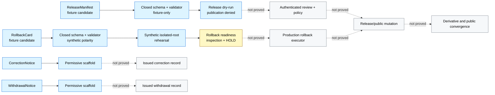

<!-- [KFM_META_BLOCK_V2]
doc_id: kfm://doc/dashboards-governance-release-correction-rollback
title: Release, Correction, and Rollback Governance Dashboard Specification
type: dashboard
version: v1.0
status: draft; repository-grounded; documentation-only; metric-contracts-proposed; runtime-unverified; correction-and-production-rollback-held; non-release; non-publication
owners: "@bartytime4life via CODEOWNERS; release, correction, rollback, evidence, policy, metric, review, security/sensitivity, UI, operations, and independent-review stewardship NEEDS VERIFICATION"
created: 2026-05-20
updated: 2026-08-22
policy_label: public; documentation; dashboards; governance; release; correction; rollback; cite-or-abstain; fail-closed
owning_root: docs/
responsibility: >-
  Define the human-readable system-wide Release, Correction, and Rollback
  dashboard boundary; preserve and reconcile the five inherited indicator
  families; specify proposed measurement contracts and safe display states; and
  expose current implementation, telemetry, review, and execution gaps.
authority: >-
  Documentation and review guidance only. Contracts own semantic meaning;
  schemas own machine shape; evidence, policy, review, and release records own
  trust-bearing decisions; validators and workflows prove only their declared
  fixture or readiness scope; applications own deployed interfaces.
current_path: docs/dashboards/governance/RELEASE_CORRECTION_ROLLBACK.md
canonical_relationship: >-
  Same-path replacement of an existing tracked specification. Accepted
  Directory Rules v2 supports PLACE for this docs-root edit. Dashboard-lane
  structural convergence, filename normalization, and any move remain HOLD.
truth_posture: >-
  CONFIRMED the tracked target and prior v0.1 blob; dashboard and indicator
  catalog entries; accepted ADR-0029 and Directory Rules v2; CODEOWNERS routing;
  current ReleaseManifest, RollbackCard, CorrectionNotice, and WithdrawalNotice
  schema profiles; release and rollback validators; focused RollbackCard,
  release-dry-run, and rollback-drill workflows; the README-only Review Console
  correction feature; and explicit production rollback/public-alias holds /
  LINEAGE the five Atlas-derived indicator names, old threshold language, panel
  ideas, and claimed running surface / PROPOSED metric populations, envelopes,
  thresholds, producers, panels, routes, and drill-downs / CONFLICTED rich
  correction semantics versus permissive CorrectionNotice and WithdrawalNotice
  schemas, plus current shared release profiles versus stale adjacent
  descriptions of them as uniformly thin / UNKNOWN production PUBLISHED
  population, production telemetry, correction-event ledger, derivative graph
  completeness, accepted live policy/review execution, dashboard route, deployed
  panel, correction propagation, production rollback execution, and public
  parity.
evidence_snapshot:
  repository: bartytime4life/Kansas-Frontier-Matrix
  base_ref: main
  base_commit: f86fcddb553217f7ffadafd80f20e95d635180b1
  target_prior_blob: 9da1c925c65d2008669650a44bab47b04055d44d
  governance_readme_blob: 8f7dd5d70ad424b00ad59856813c11b0911f99de
  dashboard_catalog_blob: 82c7859b2782c13e97b1b3d3d55cdf35400fe675
  indicator_catalog_status: path-confirmed; exact current blob NEEDS VERIFICATION
  directory_rules_blob: fd49a0b83e55cef52c1124281f093e263526898d
  codeowners_blob: dd2a84aa514d8ecd9208bc347f90f9a2ed37dd61
  release_manifest_schema_blob: c76cd9bdddb34cf33c8eb62801269553726c5923
  rollback_card_schema_blob: e0a9edf02dd5d6997eda60a054a5bf19636c3dd4
  correction_notice_schema_blob: d3fe47b9005cd52cf26f349c892386e8ce6d4c5a
  withdrawal_notice_schema_blob: 17f41df03a00f98bda7a08261506fab3bc56b231
  release_manifest_validator_blob: 00307dc0d5e2c3867a229076e3702f8111455425
  rollback_card_validator_blob: 9e9ed5a92851935b41a36698e4bead13ef4edf57
  rollback_card_workflow_blob: 1980b6e914532c1478d6f14310b916b69a0fb1c4
  release_dry_run_workflow_blob: 8f76d1011b80769952a0a6561ed7e5cd963bf8c9
  rollback_drill_workflow_status: path-confirmed; exact current blob NEEDS VERIFICATION
  review_console_readme_blob: 02512b6b8d16a8f1dfcd4c564f8b6d68b61b49e3
  correction_feature_readme_blob: d4a5b72fe0ac3cc562995fc364e61fd5ada74ac8
inspection_boundary: >-
  Current-session GitHub reads covered the complete prior target; governance
  dashboard and catalog documentation; accepted directory authority;
  CODEOWNERS; publication architecture; shared release contracts, schemas,
  validators, focused workflows, rollback-card records/readiness surfaces,
  Review Console boundaries, and exact-path pull-request overlap. No production
  release population, live policy evaluator, authenticated review action,
  correction-event store, complete derivative graph, release mutation,
  production rollback, cache or alias mutation, dashboard API, deployed panel,
  or public endpoint was exercised.
related:
  - README.md
  - ../README.md
  - ../DASHBOARD_CATALOG.md
  - ../INDICATOR_CATALOG.md
  - EVIDENCE_INTEGRITY.md
  - AI_SURFACE_HEALTH.md
  - SENSITIVITY_RIGHTS.md
  - DOCUMENTATION_DRIFT.md
  - ../../doctrine/directory-rules.md
  - ../../adr/ADR-0029-adopt-directory-governance-standard-v2.md
  - ../../architecture/publication/README.md
  - ../../architecture/publication/CORRECTION.md
  - ../../architecture/publication/ROLLBACK.md
  - ../../architecture/publication/RELEASE_GATES.md
  - ../../runbooks/ROLLBACK_RUNBOOK.md
  - ../../runbooks/EVIDENCE_CORRECTION.md
  - ../../runbooks/RELEASE_DRY_RUN.md
  - ../../../contracts/release/release_manifest.md
  - ../../../contracts/release/rollback_card.md
  - ../../../contracts/release/withdrawal_notice.md
  - ../../../schemas/contracts/v1/release/release_manifest.schema.json
  - ../../../schemas/contracts/v1/release/rollback_card.schema.json
  - ../../../schemas/contracts/v1/release/correction_notice.schema.json
  - ../../../schemas/contracts/v1/release/withdrawal_notice.schema.json
  - ../../../tools/validators/release/validate_release_manifest.py
  - ../../../tools/validators/release/validate_rollback_card.py
  - ../../../.github/workflows/release-dry-run.yml
  - ../../../.github/workflows/rollback-card.yml
  - ../../../.github/workflows/rollback-drill.yml
  - ../../../apps/review-console/README.md
  - ../../../apps/review-console/src/features/correction/README.md
  - ../../../release/README.md
  - ../../../release/rollback_cards/README.md
  - ../../../data/published/README.md
  - ../../../data/rollback/README.md
  - ../../../.github/CODEOWNERS
tags: [kfm, dashboards, governance, release, correction, rollback, release-manifest, rollback-card, correction-notice, withdrawal, supersession, derivative-invalidation, rehearsal, non-publication]
notes:
  - "v1.0 replaces Atlas-only and behavior-assertive v0.1 prose with a repository-grounded governance dashboard specification."
  - "The five inherited indicator names remain lineage; the prior 100-percent and non-zero targets are not accepted metric contracts."
  - "The original H1 fragment and all eight v0.1 section fragments are preserved explicitly."
  - "Fixture validation, dry-run denial, synthetic rehearsal, and readiness holds are not production release, correction, rollback, or publication proof."
  - "This document changes no contract, schema, policy, release record, alias, cache, runtime, deployment, or public state."
[/KFM_META_BLOCK_V2] -->

<a id="top"></a>
<a id="release--correction--rollback-dashboard--governancerelease_correction_rollbackmd"></a>

# Release, Correction, and Rollback Governance Dashboard Specification

> **Purpose.** Define how a future system-wide review surface may report whether
> released KFM material is correctable and reversible—without treating a metric,
> fixture pass, dry run, readiness workflow, dashboard card, or documentation
> update as a release decision or an executed correction or rollback.

[](#1-status-and-scope)
[](#6-current-repository-evidence)
[](#6-current-repository-evidence)
[](#3-indicator-contracts)
[](#2-responsibility-and-placement-boundary)

> [!IMPORTANT]
> **This file is a specification, not a running dashboard or release controller.**
> It cannot create or approve a `ReleaseManifest`, issue a `CorrectionNotice`,
> select or execute a rollback, repoint a published alias, invalidate a derivative,
> mutate a cache, clear policy, authenticate review, deploy a panel, or publish KFM
> material.

> [!WARNING]
> **Candidate validation is not operational execution.** The current shared
> `RollbackCard` and strict `ReleaseManifest` profiles are deterministic,
> fixture-first, and explicitly non-authoritative. Their governance fields deny
> release mutation and public-state effects. A green workflow proves only the
> declared synthetic or readiness scope.

> [!CAUTION]
> **Unknown population is not 100 percent coverage.** No production metric
> producer, accepted PUBLISHED-release population, correction-event ledger,
> complete derivative graph, or deployed dashboard was verified. Missing,
> restricted, stale, held, or unmeasured inputs must not render as zero defects,
> complete coverage, a successful rehearsal, or a healthy green state.

> [!NOTE]
> The five indicator families below are retained from the v0.1 Atlas-derived
> specification and the dashboard catalog. Their names are lineage; their
> populations, arithmetic, thresholds, producers, and review semantics remain
> `PROPOSED` until accepted through the owning contract, policy, telemetry, and
> review surfaces.

**Quick navigation:** [Status](#1-status-and-scope) ·
[Authority](#2-responsibility-and-placement-boundary) ·
[Indicators](#3-indicator-contracts) ·
[Measurement](#4-measurement-contract-and-display-states) ·
[Flow](#5-release-correction-and-rollback-flow) ·
[Evidence](#6-current-repository-evidence) ·
[Signals](#7-signal-model) · [Panels](#8-proposed-panels-and-drill-downs) ·
[Ownership](#9-ownership-review-and-separation-of-duties) ·
[Public boundary](#10-public-api-ui-ai-and-operations-boundary) ·
[Validation](#11-validation-and-negative-tests) ·
[Open work](#12-open-verification-register) ·
[Maintenance](#13-maintenance-correction-and-documentation-rollback) ·
[References](#14-cross-references) · [History](#15-change-history)

---

<a id="1-description"></a>

## 1. Status and scope

The dashboard's governing question is:

> For each eligible released object or public carrier, can KFM identify the
> current release, detect and contain a defect, preserve prior state, issue a
> governed correction or withdrawal, invalidate affected derivatives, and restore
> or supersede public state through an auditable and reviewable path?

| Question | Repository-grounded answer | Truth label |
|---|---|---|
| Does the specification exist? | Yes; the prior v0.1 target is blob `9da1c925c65d2008669650a44bab47b04055d44d`. | `CONFIRMED` |
| What does it own? | Human-readable system-wide dashboard and metric guidance. | `CONFIRMED` responsibility |
| Is a production dashboard implemented? | No routed dashboard, accepted producer, metric store, or deployed panel was proved. | `UNKNOWN` |
| Is a shared `ReleaseManifest` machine profile present? | Yes; a dual-profile schema includes a closed fixture-only inactive candidate profile and a legacy permissive profile. | `CONFIRMED` shape; release authority absent |
| Is a shared `RollbackCard` machine profile present? | Yes; a closed fixture-first candidate profile, validator, fixtures, tests, and focused workflow exist. | `CONFIRMED` bounded profile |
| Is rollback executed by that profile? | No. Its governance fields and workflow explicitly deny execution and public mutation. | `CONFIRMED` non-effect |
| Is a synthetic rollback helper exercised? | The readiness workflow checks a marker-protected synthetic-only helper and non-vacuous isolated-root tests. | `CONFIRMED` bounded rehearsal |
| Is production rollback accepted? | No production engine, live target selection, authenticated policy/review, external invalidation, or published-alias mutation is accepted. | `HOLD` |
| Are `CorrectionNotice` and `WithdrawalNotice` field-complete? | The inspected shared schemas are permissive proposed scaffolds. | `CONFIRMED` gap |
| Is a Review Console correction panel implemented? | A substantive README-only feature boundary exists; no route, component, recorder, evaluator, writer, test, or deployment was established. | `UNKNOWN` runtime |
| Does this update release, correct, withdraw, rollback, deploy, or publish? | No. | `CONFIRMED` non-effect |
| Is the lane or filename final canon? | Same-path maintenance is allowed; structural convergence remains `HOLD`. | `CONFIRMED` disposition |

### In scope

This specification may define and review:

- rollback-target closure for eligible releases;
- correction response and convergence timing;
- derivative-invalidation closure across declared carriers;
- rollback rehearsal evidence, explicitly separated by synthetic/readiness/production class;
- supersession, withdrawal, and correction-lineage closure;
- finite display states for missing, stale, restricted, held, corrected, or failed measurements;
- source-to-panel signal contracts and safe drill-down requirements;
- review, separation-of-duty, correction, and documentation rollback expectations;
- implementation and graduation gates for a future dashboard.

### Out of scope

This specification does not:

- define release, correction, withdrawal, or rollback object meaning;
- define or mutate schemas;
- create evidence, policy, review, release, or rollback decisions;
- enumerate canonical release records or copy register data into documentation;
- implement invalidation, alias movement, cache purge, public notices, or rollback;
- replace domain-specific release or rollback runbooks;
- declare a workflow successful without exact-head evidence;
- grant publication, deployment, promotion, merge, or repository-settings authority.

Repository presence proves bytes and bounded implementation shape. It does not prove
release authenticity, rights clearance, sensitivity review, production execution, public
convergence, or operational fitness.

[Back to top](#top)

---

## 2. Responsibility and placement boundary

This document owns indicator reconciliation, proposed measurement semantics, safe
aggregate states, repository-evidence mapping, panel guidance, negative cases,
maintenance, and an explicit verification backlog.

It does **not** own:

| Responsibility | Owning surface | Effect here |
|---|---|---|
| Release/correction/rollback meaning | [`contracts/release/`](../../../contracts/release/release_manifest.md) and accepted semantic homes | This page cannot redefine trust objects |
| Machine shape | [`schemas/contracts/v1/release/`](../../../schemas/contracts/v1/release/release_manifest.schema.json) | Current schema shape outranks prose |
| Evidence | evidence contracts and proof records | A dashboard cannot authenticate support |
| Rights, sensitivity, and policy | `policy/` and accountable decisions | A chart cannot allow, deny, redact, or generalize |
| Human review | governed review records and assignments | CODEOWNERS routing is not approval |
| Release, correction, withdrawal, rollback | [`release/`](../../../release/README.md) and linked records | A green metric cannot mutate public state |
| Metric computation | accepted producer and telemetry surfaces | This file cannot manufacture measurements |
| Dashboard runtime | `apps/` behind governed interfaces | No route or panel is created here |
| Cache, alias, index, and derivative operations | accepted runtime/release executors | Documentation cannot prove propagation |

Accepted [ADR-0029](../../adr/ADR-0029-adopt-directory-governance-standard-v2.md)
adopts [Directory Rules v2](../../doctrine/directory-rules.md). `docs/` owns
human explanation; contracts own semantics; schemas own machine shape; policy owns
admissibility; data roots own lifecycle and accountability records; applications own
deployable interfaces; and `release/` owns publication, correction, withdrawal, and
rollback decisions.

| Proposed action | Placement outcome |
|---|---|
| Replace this tracked file in place | `PLACE` |
| Add the required AI-authoring receipt under the established generated-receipt lane | `PLACE` |
| Store metrics, manifests, notices, cards, receipts, proofs, or runtime events here | `DENY` |
| Rename or move the dashboard lane in this slice | `HOLD` |
| Create a second release/correction/rollback dashboard authority | `DENY` absent an accepted split or migration |

<a id="5-files"></a>

### Connected file posture

- [`README.md`](README.md) describes the governance-dashboard documentation lane,
  but retains stale proposal-era inventory language and is not implementation proof.
- [`../DASHBOARD_CATALOG.md`](../DASHBOARD_CATALOG.md) already catalogs this
  path and the five inherited indicator families. Its high-level row remains
  materially accurate, so this focused slice does not rewrite it.
- [`../INDICATOR_CATALOG.md`](../INDICATOR_CATALOG.md) preserves the inherited
  indicator vocabulary; it is not a metric producer.
- [`../../architecture/publication/`](../../architecture/publication/README.md)
  contains human publication, release-gate, correction, rollback, object, and
  state-machine architecture.
- [`apps/review-console/`](../../../apps/review-console/README.md) and its
  [`correction` feature README](../../../apps/review-console/src/features/correction/README.md)
  are proposed presentation/review boundaries, not routed or deployed proof.
- The focused workflows are read-only validation and readiness surfaces; they emit
  summaries, not release or rollback records.

[Back to top](#top)

---

<a id="2-indicators-surfaced"></a>

## 3. Indicator contracts

The five names below are retained from v0.1 and the dashboard catalog. Their
measurement contracts are **PROPOSED**. No fixed target is adopted by this file.

| ID | Inherited indicator family | Measurement question | Current repository posture |
|---|---|---|---|
| `RCR-01` | **Release with rollback target** | For an accepted eligible release population, which releases resolve to a locally coherent, policy/review-bound rollback or withdrawal posture? | ReleaseManifest and RollbackCard candidate shapes exist; production release population and reference authentication are unproved |
| `RCR-02` | **Correction lead time** | How long elapses across detection, containment, notice, corrected release, and public convergence for eligible defects? | Correction architecture exists; field-complete notice/event ledger and production timestamps are unproved |
| `RCR-03` | **Derivative-invalidation coverage** | For each eligible correction, withdrawal, or rollback, which declared derivatives received a governed invalidation or supersession result? | RollbackCard names invalidation classes; complete derivative graph and external execution evidence are unproved |
| `RCR-04` | **Rollback rehearsal rate** | Which eligible release profiles have current, non-vacuous rehearsal evidence at the declared rehearsal class? | Fixture validation and synthetic isolated-root rehearsal exist; production rollback remains held |
| `RCR-05` | **Supersession lineage gap** | Which eligible releases/notices lack required previous/current/next, correction, withdrawal, or rollback links? | ReleaseManifest and RollbackCard carry lineage fields; notice schemas and production registry closure remain incomplete |

### 3.1 `RCR-01` — rollback-target closure

**Proposed eligible unit:** one immutable release-manifest identity that is
explicitly admitted to the metric population.

A release counts as closed only when the accepted profile proves, at minimum:

- stable release and manifest identity;
- immutable artifact references and digests;
- a rollback or withdrawal reference with a resolvable target posture;
- source and evidence references;
- policy, review, and release-state references appropriate to consequence;
- correction, withdrawal, and prior-release lineage;
- public-scope, rights, sensitivity, and transform posture;
- validation and receipt references;
- a correction path and tested failure outcome;
- no unresolved reference, integrity, or authority conflict.

The current strict `ReleaseManifest` profile is `PROPOSED_INACTIVE` and
`FIXTURE_ONLY`; its governance fields remain false. It therefore cannot be counted
as a production release or as successful rollback-target closure.

**Proposed numerator:** eligible releases with complete accepted rollback/withdrawal
closure at the metric snapshot.

**Proposed denominator:** all accepted eligible releases in the same immutable
population—not repository files, fixture cases, catalog rows, or documentation pages.

**Fail-closed states:** `NO_ELIGIBLE_POPULATION`, `NOT_MEASURED`,
`INCOMPLETE`, `RESTRICTED`, `STALE`, `REVIEW_PENDING`, or `ERROR`.

The v0.1 target of `100%` remains lineage. It becomes enforceable only through an
accepted metric contract and release population.

### 3.2 `RCR-02` — correction response and convergence timing

“Correction lead time” must not collapse distinct clocks. A future producer should
retain:

| Clock | Starts | Ends | Why separate |
|---|---|---|---|
| Detection | first governed defect detection | containment decision | Measures recognition and triage |
| Containment | containment decision | unsafe public exposure disabled or bounded | Measures immediate protection |
| Notice | governed defect confirmation | accepted correction/withdrawal notice | Measures formal acknowledgment |
| Repair | accepted correction work start | superseding artifact/release ready | Measures repair effort |
| Release | correction approval | superseding release effective | Measures governed release latency |
| Public convergence | superseding/withdrawal effective | declared clients, aliases, caches, indexes, and carriers converged | Measures downstream propagation |
| Closure | public convergence | accountable closure/review record | Measures audit completion |

A median or percentile is reviewable only when the producer defines:

- defect classes and severity;
- timezone-aware timestamp sources;
- clock pausing and reopening;
- duplicated, merged, withdrawn, or correction-of-correction cases;
- missing timestamps and late-arriving events;
- restricted incidents whose details cannot be displayed;
- population window and snapshot identity;
- whether ongoing cases are right-censored rather than discarded.

A single “time to correction” number without these distinctions must be
`INCOMPLETE` or `NOT_MEASURED`.

### 3.3 `RCR-03` — derivative-invalidation closure

The current shared `RollbackCard` candidate profile names these invalidation
classes:

- API cache;
- CDN;
- tiles;
- catalog;
- triplets;
- search index;
- vector index;
- AI cache;
- downstream derivatives.

The list is a candidate vocabulary, not proof that all consumers exist or that any
invalidation ran.

A future measurement must derive the expected derivative set from a versioned,
reviewed relationship source. It must preserve:

- affected release, claim, evidence, source, and artifact identities;
- direct and transitive derivative relationships;
- carrier class and environment;
- required action: invalidate, supersede, withdraw, rebuild, reindex, or mark stale;
- attempt, outcome, timestamp, receipt, and error reason;
- public-safe disclosure limits;
- retry, partial completion, and unresolved-consumer posture;
- correction-of-correction and rollback-of-rollback lineage.

**Proposed numerator:** expected derivative actions with an accepted finite terminal
result at the snapshot.

**Proposed denominator:** the complete expected derivative-action set—not only the
actions that emitted success.

Missing consumers or an incomplete graph produce `INCOMPLETE`, not complete
coverage. A no-op result is not successful invalidation unless the accepted contract
proves that no action was required.

### 3.4 `RCR-04` — rollback rehearsal evidence

Rehearsal classes must remain distinct:

| Class | What it may prove | What it must not imply |
|---|---|---|
| Fixture polarity | Candidate shape, deterministic validation, exact positive/negative behavior | Executable rollback or public mutation |
| Synthetic isolated-root rehearsal | A bounded helper can restore synthetic bytes/state within controlled temporary roots | Live target selection, external invalidation, production policy/review, alias mutation |
| Readiness inspection | Required surfaces remain present and explicit holds have not drifted | A production rollback was simulated |
| Staging rehearsal | A separately accepted non-public environment exercised declared operators and verification | Production readiness without environment parity and review |
| Production rollback drill | Accepted production-equivalent or production procedure executed with authority, receipts, bounded effects, and recovery proof | Automatic release approval or permanent operational fitness |

The current `rollback-card`, `release-dry-run`, and `rollback-drill` workflows prove
bounded candidate, denial, synthetic, and readiness behavior. The rollback-drill
workflow explicitly says no production rollback was simulated and records a hold on
the missing production executor, target selection, policy/review authentication,
external invalidation, and alias mutation.

**Proposed measurement unit:** one accepted rehearsal result bound to a release
profile, environment class, procedure version, target, immutable inputs, outcome,
review, receipt, and expiry rule.

The v0.1 “non-zero per release window” target remains lineage. A count alone is
unsafe because repeated fixture runs can inflate the number without increasing
operational readiness.

### 3.5 `RCR-05` — supersession and withdrawal lineage closure

A future lineage metric must distinguish:

- previous release;
- superseding release;
- corrected release;
- correction notice;
- withdrawal notice;
- rollback card or restoration target;
- release-manifest correction references;
- public signal (`corrected`, `superseded`, `withdrawn`, `stale`, or held);
- correction-of-correction and rollback-of-rollback chains.

The current strict `ReleaseManifest` and `RollbackCard` schemas carry useful lineage
fields. The shared `CorrectionNotice` and `WithdrawalNotice` schemas remain
permissive scaffolds; their presence cannot be counted as field-complete notice
closure.

A forward link is necessary but not sufficient. Closure also requires:

- reverse link consistency;
- no broken or self-referential cycles unless explicitly modeled;
- deterministic identity and digest binding;
- temporal ordering;
- affected artifact and derivative scope;
- policy/review/release state;
- retained prior history;
- safe public signal and correction path.

**Proposed numerator:** eligible lineage nodes with complete accepted bidirectional
closure.

**Proposed denominator:** all eligible nodes in the immutable release/correction
snapshot.

[Back to top](#top)

---

## 4. Measurement contract and display states

### Minimum metric envelope

Every displayed count, duration, rate, percentile, trend, or status must bind:

| Dimension | Required content |
|---|---|
| Identity | Stable metric ID, contract version, producer, computation/spec hash |
| Snapshot | Immutable source snapshot, run or release identity, and content digest |
| Population | Exact inclusion rule, exclusions, deduplication, and population count |
| Arithmetic | Numerator, denominator, units, rounding, aggregation, percentile method |
| Time | Detection, containment, notice, repair, release, convergence, correction, and snapshot clocks where material |
| Release identity | Release, manifest, artifact, version, audience, and environment |
| Lineage | Previous/current/next, correction, withdrawal, rollback, and affected-derivative references |
| Evidence and authority | Evidence refs, source refs, policy decision, review record, release state, validator and receipt refs |
| Rights and sensitivity | Disclosure class, aggregation/redaction/generalization, suppressed-cell behavior |
| Missingness | Null, absent, unknown, stale, restricted, malformed, in-progress, not-applicable, and not-measured semantics |
| Uncertainty | Incomplete graph, late events, censored durations, estimated scope, and confidence limits |
| Correction | Supersession rule, recomputation trigger, affected historical snapshots, and correction notice |
| Rollback | Prior metric snapshot, producer/config rollback target, and safe disable path |
| Review | Accountable reviewer roles, review state, and independent-review requirement |

### Display states

These are dashboard presentation states, not new release decisions:

| State | Meaning | Required presentation |
|---|---|---|
| `AVAILABLE` | Accepted producer emitted a complete measurement for the declared snapshot | Show value, scope, timestamp, contract, and evidence links |
| `NO_ELIGIBLE_POPULATION` | The accepted population is empty | Show “no eligible population”; never `100%` or zero defects |
| `NOT_MEASURED` | No accepted producer or current snapshot exists | Show explicit unmeasured state |
| `INCOMPLETE` | Population, lineage, derivative graph, references, or events are partial | Show missing dimensions and block healthy interpretation |
| `IN_PROGRESS` | Correction, rollback, or invalidation has not reached terminal state | Show elapsed time and open obligations without counting success |
| `STALE` | Snapshot or supporting source is beyond the accepted freshness rule | Show age and suppress current-health conclusions |
| `RESTRICTED` | Value or drill-down cannot be disclosed safely | Show a bounded restriction message without leaking reason detail |
| `REVIEW_PENDING` | Measurement or event awaits accountable review | Do not count as closed |
| `HELD` | Policy, release, or operational hold blocks progression | Show hold class and safe next step where disclosure permits |
| `DEGRADED` | Some carriers or consumers remain unresolved after a bounded action | Show partial completion and affected scope |
| `CORRECTED` | A prior metric snapshot or release record has a governed correction | Preserve the prior identity and link the successor |
| `SUPERSEDED` | A newer accepted object replaces the current one | Show forward and backward lineage |
| `WITHDRAWN` | Public use was withdrawn | Hide or disable affected claim/carrier while retaining history |
| `ERROR` | Producer, resolver, validator, policy, storage, or transport failed | Fail closed; never substitute a cached green state |

### Vocabulary separation

Do not collapse these axes:

| Axis | Examples |
|---|---|
| Dashboard presentation | `AVAILABLE`, `INCOMPLETE`, `STALE`, `RESTRICTED`, `ERROR` |
| Runtime answer | `ANSWER`, `ABSTAIN`, `DENY`, `ERROR` |
| Validator result | `PASS`, `FAIL`, finite findings and reason codes |
| Release candidate disposition | `CANDIDATE`, `HELD`, `DEGRADED`; candidate-specific values |
| Rollback candidate disposition | `ROLLBACK_CANDIDATE`, `WITHDRAWAL_CANDIDATE`, `HOLD`, `ERROR` |
| Lifecycle | `RAW`, `WORK`, `QUARANTINE`, `PROCESSED`, `CATALOG/TRIPLET`, `PUBLISHED` |
| Review | pending, approved, rejected, deferred, superseded—only as accepted review vocabulary defines |
| Public state | current, corrected, superseded, withdrawn, stale—only when backed by release records |

A dashboard state may summarize an accepted result. It must not create or coerce one.

[Back to top](#top)

---

## 5. Release, correction, and rollback flow

```text
released identity or governed public carrier
  -> defect / rights / sensitivity / evidence / policy / validation signal
  -> immediate containment or hold when risk requires
  -> affected release and derivative-scope resolution
  -> evidence, policy, rights, sensitivity, and reviewer checks
  -> correction / withdrawal / rollback candidate
  -> deterministic validation and review
  -> release-authority decision
  -> superseding manifest, withdrawal, or restoration
  -> aliases, caches, tiles, catalogs, indexes, APIs, and AI carriers updated
  -> public-safe signal and correction lineage
  -> convergence verification and closure
```

The current repository proves only selected early and fixture/readiness portions of
that flow. The following Mermaid diagram separates current bounded evidence from
unverified operational transitions:



> [!IMPORTANT]
> The diagram is a current-evidence map. It is not a release architecture
> decision, executable workflow graph, or proof that every shown transition exists.

[Back to top](#top)

---

## 6. Current repository evidence

| Surface | Current evidence at the snapshot | Safe dashboard conclusion |
|---|---|---|
| Target spec | v0.1 exists at the pinned blob | Same-path modernization is valid |
| Dashboard catalog | Target and five indicator families are cataloged; runtime is `PROPOSED` | No catalog rewrite required for this slice |
| Accepted placement | ADR-0029 accepts Directory Rules v2 and `docs/` responsibility boundaries | `PLACE` for this file; structural moves remain held |
| CODEOWNERS | `@bartytime4life` is the verified review route; file itself disclaims approval authority | Routing is not release/correction approval |
| ReleaseManifest schema | Legacy permissive profile plus closed `FIXTURE_ONLY` `PROPOSED_INACTIVE` candidate profile; governance effects all false | Shape/fixture metrics may be proposed; do not count production releases |
| ReleaseManifest validator | Substantive validator path exists | Validator presence is not live reference/authentication or release proof |
| RollbackCard contract/schema | Closed fixture-first candidate with target, refs, invalidations, restoration, time, lineage, and false governance effects | Candidate consistency may be measured; execution may not |
| RollbackCard validator/workflow | Dedicated validator, fixtures/tests, receipt binding, read-only focused workflow | Green proves bounded candidate validation only |
| Release dry run | Read-only workflow exercises deterministic denial and bounded promotion/rollback readiness over synthetic inputs | Denial-path/readiness proof only; no release record emitted |
| Rollback drill | Read-only workflow checks explicit holds, synthetic helper guards, non-vacuous isolated-root rehearsal, and absent aliases/payloads | Production rollback remains `HOLD` |
| CorrectionNotice schema | Permissive empty-property scaffold with `additionalProperties: true`; no contract binding in its metadata | Field-complete correction-event measurement unavailable |
| WithdrawalNotice schema | Permissive id-required scaffold with `additionalProperties: true` | Withdrawal closure measurement unavailable |
| Publication architecture | Substantive correction, rollback, release-gate, state-machine, and object docs exist | Human architecture, not runtime proof |
| Review Console | Parent app and correction feature READMEs define proposed role-gated review support | No routed dashboard, recorder, evaluator, writer, or deployment proved |
| Root rollback-card records | Readiness workflow treats current JSON records as non-conforming documentation placeholders | Do not count them as executable rollback cards |
| Published aliases | Readiness workflow reports no current aliases at its declared inspection boundary | Absence is readiness evidence, not public-state verification outside that boundary |
| Production telemetry | No accepted metric producer, event store, release population, derivative graph, or deployed panel was exercised | `NOT_MEASURED` / `UNKNOWN` |

### Material conflicts and drift

1. **Correction semantics versus shape.** Human contracts and architecture describe
   rich correction/supersession behavior while shared `CorrectionNotice` and
   `WithdrawalNotice` schemas remain permissive scaffolds.
2. **Stale adjacent descriptions.** Some older Review Console documentation describes
   the RollbackCard shape as uniformly thin. Current shared release evidence shows a
   closed fixture-first profile, while domain-local profiles remain mixed. Current
   schema bytes win for current shape.
3. **Candidate versus authority.** ReleaseManifest and RollbackCard profiles are
   useful deterministic candidates but explicitly deny policy, review, release,
   rollback execution, publication, and public mutation.
4. **Readiness versus operation.** `release-dry-run` and `rollback-drill` intentionally
   prove denial/readiness and preserve holds. Their green status must not be
   relabeled as successful production release or rollback.
5. **Documentation-lane drift.** The governance README retains older candidate
   filenames and “0 of 10” language. This spec records that stale parent posture
   but does not widen this target-scoped change into a lane-wide rewrite.

[Back to top](#top)

---

<a id="4-inputs--receipts-and-records-read"></a>

## 7. Signal model

A future dashboard may read only governed projections from accepted producers.
It must never scrape prose, infer release state from GitHub, or count repository
files as operational events.

| Signal family | Minimum required fields | Current maturity |
|---|---|---|
| Release population snapshot | population ID/digest, release and manifest IDs, version, state, audience, artifact count, effective time | `PROPOSED`; fixture candidate shape exists |
| Rollback-target assessment | affected release, target mode/ref, evidence/policy/review refs, invalidation set, restoration, time, lineage, disposition | `CONFIRMED` fixture-first candidate profile |
| Defect/correction event | defect ID/class/severity, detected/contained/confirmed/noticed/released/converged times, affected scope | `UNKNOWN`; no accepted production ledger proved |
| Correction notice | notice ID/version, affected release/artifacts/claims, evidence, review, supersession, rollback, invalidations, public signal | Rich semantics; shared schema scaffold |
| Withdrawal notice | notice ID/version, affected release/scope, reason, review/policy, effective time, public signal, lineage | Shared schema scaffold |
| Derivative relation snapshot | source object, derivative object, edge class, environment, required action, authority, digest | `UNKNOWN` complete producer |
| Invalidation result | action ID, target, operation, outcome, reason, attempted/effective time, receipt, retry state | `UNKNOWN` production execution |
| Rehearsal result | rehearsal ID/class, procedure version, environment, target, immutable inputs, findings, outcome, review, expiry | Synthetic/readiness evidence only |
| Alias/public convergence | release ref, carrier, old/new state, effective time, verification, receipt | Production producer unproved |
| Metric snapshot | contract/version, population, arithmetic, state, evidence, correction, rollback, review | `PROPOSED` |

### Required finite signal outcomes

A producer should return a closed result such as:

- `PASS` — declared local checks satisfied;
- `ABSTAIN` — evidence or population is insufficient;
- `DENY` — policy or sensitivity blocks the requested projection;
- `HOLD` — required review, authority, dependency, or operational support is absent;
- `ERROR` — malformed input, invariant failure, missing dependency, or producer failure.

The dashboard then maps the result to a presentation state without changing the
underlying outcome.

### Signal anti-collapse rules

| Do not collapse | Why |
|---|---|
| Repository file present vs. operational record emitted | Presence is not execution |
| Schema valid vs. references authenticated | Local shape does not resolve authority |
| Candidate target vs. approved rollback target | Candidate disposition is not release approval |
| Synthetic rehearsal vs. production drill | Environment and authority differ |
| Workflow success vs. release/correction success | CI records only declared test scope |
| Correction candidate vs. issued notice | Review and release authority remain separate |
| Invalidation requested vs. invalidation effective | Attempt and convergence differ |
| Alias absent vs. alias verified safe | Bounded absence is not external proof |
| Supersession link present vs. lineage closed | Reverse links, time, evidence, and policy still matter |
| Missing event vs. zero duration | Missingness must remain visible |

[Back to top](#top)

---

<a id="3-panels-proposed"></a>

## 8. Proposed panels and drill-downs

All panels are `PROPOSED`. No route, component, query, telemetry source, or deployment
is established by this specification.

| Panel | Primary question | Safe display requirement |
|---|---|---|
| Release rollback closure | Which eligible releases have accepted rollback/withdrawal closure? | Show eligible population, unknowns, profile, snapshot, and non-production candidates separately |
| Correction timeline | Where does time accumulate from detection to public convergence? | Show separate clocks and censored/open cases |
| Derivative convergence | Which expected carriers are invalidated, superseded, rebuilt, restricted, pending, or failed? | Never calculate from success events alone |
| Rehearsal evidence | What rehearsal class, procedure, environment, result, and expiry applies? | Separate fixture, synthetic, readiness, staging, and production |
| Supersession graph | Are prior/current/next, correction, withdrawal, rollback, and derivative links complete? | Flag broken, one-way, cyclic, stale, and restricted links |
| Active holds | What prevents safe correction or rollback? | Show bounded reason class without leaking sensitive details |
| Public convergence | Have released carriers reached the accepted corrected/withdrawn state? | Show per-carrier effective time and verification |
| Implementation readiness | Which contracts, schemas, fixtures, validators, policy, producers, APIs, UI, and operations are substantive? | File count is not maturity |

### Drill-down contract

Every drill-down must preserve:

- immutable snapshot and release identity;
- metric contract version;
- release/correction/rollback object refs;
- finite state and reason codes;
- evidence, policy, review, and release posture;
- expected versus observed derivative set;
- all material clocks and timezone;
- restricted-field handling;
- correction and supersession lineage;
- source limitation and uncertainty;
- a visible “not operational proof” boundary for fixture/readiness data.

### Filters

Proposed filters include:

- domain or cross-domain scope;
- release profile and audience;
- correction/defect class;
- severity and containment posture;
- public/restricted/internal environment;
- current/corrected/superseded/withdrawn/held state;
- rehearsal class;
- derivative carrier class;
- time window and snapshot;
- policy/review status;
- missing/stale/restricted/error state.

Filters must not create reconstruction or side-channel risk. Restricted counts,
small cells, sensitive reason codes, and repeated-query differencing require policy
and review before public or semi-public exposure.

### Accessibility and export

A mature implementation must provide:

- keyboard-operable filters and drill-down;
- visible focus and logical heading order;
- text alternatives for graphs and timelines;
- non-color state encoding;
- table views for chart data;
- announced loading, stale, restricted, held, and error states;
- export metadata with metric contract, snapshot, release IDs, citations, and
  correction status;
- no hidden tooltip-only evidence;
- no export of restricted identifiers or harmful operational detail.

[Back to top](#top)

---

<a id="6-ownership-and-review-burden"></a>

## 9. Ownership, review, and separation of duties

`@bartytime4life` is the only verified GitHub review route through
[CODEOWNERS](../../../.github/CODEOWNERS). That route is not a stewardship
assignment, independent review, `ReviewRecord`, policy decision, release approval,
correction approval, rollback authority, or proof that review occurred.

| Responsibility | Needed accountable role | Current status |
|---|---|---|
| Metric semantics and producer | Metric/observability steward | `NEEDS VERIFICATION` |
| Release population and manifests | Release steward | `NEEDS VERIFICATION` |
| Correction classification and notices | Correction reviewer | `NEEDS VERIFICATION` |
| Rollback target/procedure | Rollback/release operations steward | `NEEDS VERIFICATION` |
| Evidence and source closure | Evidence/source stewards | `NEEDS VERIFICATION` |
| Rights, sensitivity, and disclosure | Policy/sensitivity/security reviewers | `NEEDS VERIFICATION` |
| Derivative graph and invalidation | Runtime/catalog/search/map/AI owners | `NEEDS VERIFICATION` |
| Dashboard and accessibility | Review Console/UI/accessibility owners | `NEEDS VERIFICATION` |
| Independent verification | Independent reviewer appropriate to consequence | `NEEDS VERIFICATION` |
| Documentation | Docs steward/review route | CODEOWNERS route confirmed; stewardship assignment unproved |

### Minimum separation for trust-significant action

A mature process should separate, where material:

1. detector or author;
2. evidence and defect reviewer;
3. policy/rights/sensitivity reviewer;
4. release/correction authority;
5. rollback operator;
6. convergence verifier;
7. independent reviewer or approver.

The same person may hold more than one role only under an accepted, documented,
risk-proportionate exception. A dashboard must display the review state without
inventing identities or interpreting GitHub authorship as approval.

### Emergency containment

A sensitivity leak, rights withdrawal, security issue, or materially unsafe public
state may require immediate containment before the full correction completes.
Containment must:

- fail closed;
- minimize exposure;
- preserve the original release and audit trail;
- emit or link the required governed record when the owning process is available;
- not silently rewrite history;
- distinguish emergency disablement from final correction, withdrawal, or rollback;
- route to accountable review and post-event closure.

This document does not authorize emergency mutation.

[Back to top](#top)

---

## 10. Public API, UI, AI, and operations boundary

### Governed interface

A future dashboard must consume a governed, authenticated projection. It must not:

- query RAW, WORK, QUARANTINE, unresolved candidates, or internal canonical stores
  through the normal public path;
- read private release-operation systems directly from the browser;
- infer state from filenames, Git branches, pull requests, tags, badges, or workflow
  color;
- expose sensitive incident, reviewer, source, infrastructure, or rollback details;
- let the client decide policy, release, correction, withdrawal, or rollback;
- mutate aliases, caches, manifests, notices, cards, or published artifacts;
- send unresolved claims to a model for interpretation.

### Review Console

The current Review Console and correction-feature documentation define role-gated
review support and explicit no-write/no-publication boundaries. No implemented
dashboard route or production mutation path was verified.

A mature panel must:

- validate the response envelope before render;
- preserve finite outcome, state, and reason-code axes;
- show immutable release and metric-snapshot identity;
- resolve authorized evidence and review context through governed services;
- require elevated audited roles for restricted drill-down;
- provide a safe disabled mode when dependencies fail;
- keep public and steward views distinct.

### Governed AI

AI may summarize an accepted dashboard snapshot only after:

1. scope is explicit;
2. snapshot and release identities are fixed;
3. EvidenceRefs resolve to admissible EvidenceBundles;
4. policy, rights, sensitivity, review, and release posture are checked;
5. correction/withdrawal state is current;
6. citations are validated;
7. the answer is bounded to `ANSWER`, `ABSTAIN`, `DENY`, or `ERROR`;
8. an `AIReceipt` or accepted equivalent records the effective inputs and outcome.

AI must not:

- infer missing invalidations;
- treat a green workflow as operational rollback;
- recommend or execute a production rollback;
- disclose restricted defect or infrastructure detail;
- hide uncertainty behind a summary;
- regenerate an old answer after its release or evidence was corrected or withdrawn.

### Operational observability

Telemetry is an input to review, not sovereign truth. Producers must:

- emit deterministic identity and immutable snapshots where practical;
- preserve late, duplicated, missing, and corrected events;
- expose producer health separately from domain/release health;
- record event-time and processing-time where material;
- fail closed when the derivative graph, event ledger, policy, or release registry is unavailable;
- support replay, correction, and rollback of metric snapshots;
- avoid secrets and sensitive payloads in logs or labels.

[Back to top](#top)

---

<a id="7-acceptance"></a>

## 11. Validation and negative tests

### Documentation acceptance for this revision

- [x] Existing path and stable document role preserved.
- [x] Stable document ID replaces the unresolved UUID placeholder.
- [x] Five inherited indicator families retained.
- [x] Prior fixed targets demoted to lineage rather than silently adopted.
- [x] Current shared schema/validator/workflow maturity reconciled.
- [x] Candidate validation, synthetic rehearsal, readiness, and production execution separated.
- [x] No-data, unmeasured, incomplete, stale, restricted, held, corrected,
      superseded, withdrawn, and error states defined.
- [x] Original H1 and eight section fragments retained as explicit anchors.
- [x] Relative links stay inside inspected responsibility roots.
- [x] Documentation correction and rollback path defined.
- [ ] Hosted exact-head checks and accountable human review complete.

### Future producer and dashboard tests

| Test family | Required proof |
|---|---|
| Population closure | Exact eligible population, exclusions, deduplication, and immutable digest |
| Arithmetic | Numerator/denominator, units, rounding, percentiles, null/missing behavior |
| Identity | Stable metric, release, manifest, notice, card, derivative, and rehearsal identities |
| Temporal | Timezone-aware ordering, late events, open/censored cases, correction timing |
| Lineage | Forward/reverse closure, broken refs, cycles, correction-of-correction |
| Derivative scope | Complete expected set, direct/transitive edges, restricted consumers |
| Finite states | Every missing, stale, restricted, held, partial, and error path fails closed |
| Policy/review | Unauthenticated, unauthorized, expired, or conflicting review cannot close |
| Rehearsal classification | Fixture/synthetic/readiness/staging/production cannot be coerced |
| No-write | Read-only dashboard cannot mutate release, alias, cache, index, or public state |
| Security | Injection, IDOR, sensitive-reason leakage, cache poisoning, export leakage |
| Accessibility | Keyboard, focus, names/roles/values, non-color states, table alternatives |
| Correction | Prior metric snapshots retained; successor/correction links resolve |
| Rollback | Producer and UI can disable/revert without rewriting trust records |
| Deployment parity | Exact released build and configuration match reviewed behavior |

### Required negative cases

A correct implementation must reject or visibly fail closed when:

1. the eligible release population is absent but a percentage is requested;
2. a fixture case is counted as a PUBLISHED release;
3. a candidate `RollbackCard` is counted as an executed rollback;
4. a readiness workflow is labeled a production drill;
5. the correction or withdrawal object has only an `id`;
6. a success-only event stream is used as the derivative denominator;
7. a derivative graph is partial or unavailable;
8. invalidation was attempted but not verified effective;
9. an old release has a forward link but the successor lacks the reverse link;
10. a correction reuses the prior manifest ID or silently replaces prior bytes;
11. a missing timestamp becomes zero duration;
12. an open case is discarded from lead-time statistics;
13. a stale metric snapshot remains green;
14. a restricted incident leaks through labels, URLs, exports, logs, or AI;
15. GitHub merge, tag, release, or workflow status is treated as KFM publication;
16. one actor is treated as independent author, reviewer, release authority, and
    convergence verifier without an accepted exception;
17. a dashboard or AI client initiates rollback;
18. correction-of-correction or rollback-of-rollback lineage becomes cyclic or lost;
19. a producer failure falls back to cached success without stale/error signaling;
20. the normal public path reaches an internal release or evidence store directly.

### Current validation boundary

Repository-native release and rollback workflows exist and are valuable evidence,
but they do not trigger specifically because this documentation file changed unless
their path filters or aggregate selection include it. Hosted PR checks must be reported
by exact head and event. A passing broad workflow does not upgrade this specification's
runtime claims.

[Back to top](#top)

---

<a id="8-open-questions"></a>

## 12. Open verification register

| ID | Priority | Question | Current status | Closure evidence |
|---|---:|---|---|---|
| `RCR-OQ-01` | P0 | What accepted object/profile defines a production release population? | `UNKNOWN` | Accepted contract/schema, registry, producer, fixtures, tests, review |
| `RCR-OQ-02` | P0 | Which CorrectionNotice and WithdrawalNotice homes and field sets are authoritative? | `CONFLICTED / NEEDS VERIFICATION` | Placement decision, hardened schemas, compatibility and migration proof |
| `RCR-OQ-03` | P0 | Who may approve correction, withdrawal, rollback, and emergency containment? | `NEEDS VERIFICATION` | Stewardship assignments, policy, review and separation-of-duty records |
| `RCR-OQ-04` | P0 | What production rollback engine and target-selection contract are accepted? | `HOLD` | Contract, schema, policy, no-write/staging tests, authenticated review, rollback drill |
| `RCR-OQ-05` | P0 | How are external caches, tiles, catalogs, search/vector indexes, APIs, and AI carriers invalidated and verified? | `UNKNOWN` | Consumer registry, executor adapters, receipts, negative tests, convergence proof |
| `RCR-OQ-06` | P0 | What public alias or pointer profile is authoritative and reversible? | `HOLD / UNKNOWN` | Accepted ADR/profile, validator, receipts, pointer tests, production-safe migration |
| `RCR-OQ-07` | P1 | What exact clocks and severity classes govern correction timing? | `PROPOSED` | Metric contract, event schema, fixtures, review |
| `RCR-OQ-08` | P1 | What makes a rehearsal current, representative, and non-vacuous? | `PROPOSED` | Rehearsal contract, environment profile, expiry rule, independent review |
| `RCR-OQ-09` | P1 | How is derivative graph completeness measured without circular trust? | `UNKNOWN` | Canonical relation source, closure validator, mutation receipts, replay |
| `RCR-OQ-10` | P1 | What dashboard API envelope, route, authorization, and audit contract are accepted? | `UNKNOWN` | Governed API route/DTO, policy tests, app consumer, deployment evidence |
| `RCR-OQ-11` | P1 | How are sensitive corrections disclosed without side-channel leakage? | `NEEDS VERIFICATION` | Policy profile, aggregation/redaction tests, reviewer approval |
| `RCR-OQ-12` | P1 | How do domain-local release/rollback profiles converge with shared release profiles? | `CONFLICTED` | Inventory, compatibility matrix, ADR or migration note, aggregate tests |
| `RCR-OQ-13` | P2 | Which service-level objectives or thresholds should be adopted? | `PROPOSED` | Baseline evidence, risk owner, metric version, review and rollback |
| `RCR-OQ-14` | P2 | How are historical metric snapshots corrected and superseded? | `PROPOSED` | Snapshot schema, lineage tests, correction notice, UI behavior |
| `RCR-OQ-15` | P2 | What panel and export accessibility conformance is required? | `NEEDS VERIFICATION` | UI contract, automated/manual tests, human review |
| `RCR-OQ-16` | P2 | Should the stale governance README and filename inventory be reconciled in a separate slice? | `NEEDS VERIFICATION` | Current inventory, link analysis, target-scoped PR |
| `RCR-OQ-17` | P3 | Should a release-lifecycle dashboard lane remain separate from governance health? | `HOLD` | Directory Rules/ADR decision, consumer and migration analysis |

### Smallest sound implementation sequence

1. Ratify authoritative shared correction, withdrawal, rollback, and release
   contracts and compatibility with domain-local projections.
2. Harden `CorrectionNotice` and `WithdrawalNotice` schemas with exact positive and
   negative fixtures and deterministic validators.
3. Define one immutable synthetic release population and derivative graph.
4. Define one metric-envelope schema covering the five indicators and finite states.
5. Implement a no-network producer that emits deterministic metric snapshots from
   synthetic release/correction/rollback records.
6. Add negative tests for empty population, partial graph, unissued notice, open case,
   restricted incident, and candidate/execution anti-collapse.
7. Add a read-only governed API projection and parser.
8. Add a Review Console fixture panel with accessibility tests and no-write guards.
9. Prove correction propagation and synthetic rollback end to end.
10. Authorize staging or production work only through separate policy, review,
    release, deployment, and operational controls.

No step should activate a live source, mutate PUBLISHED state, or broaden public
access merely because the prior step passes.

[Back to top](#top)

---

## 13. Maintenance, correction, and documentation rollback

### Re-review triggers

Re-review this specification when any of these changes:

- ReleaseManifest, RollbackCard, CorrectionNotice, WithdrawalNotice, or
  supersession semantics;
- shared or domain-local schema authority;
- release, rollback, correction, or alias validators;
- release-dry-run, rollback-card, or rollback-drill workflow scope;
- production rollback or invalidation executor status;
- published alias or pointer profile;
- correction/release policy or stewardship assignments;
- derivative graph, cache, search, map, API, or AI consumer registry;
- governed API or Review Console implementation;
- metric population, threshold, producer, or telemetry storage;
- Directory Rules, ADRs, or dashboard-lane placement;
- public release, correction, withdrawal, or rollback behavior.

### Correcting this document

A correction must:

1. identify the affected claim, section, and evidence snapshot;
2. distinguish documentation error from implementation or runtime change;
3. re-read the current target and direct dependency set;
4. update truth labels and evidence identities;
5. preserve historical claims needed to explain prior decisions;
6. repair anchors and links in the same review boundary;
7. regenerate the authoring receipt for substantively AI-modified bytes;
8. obtain accountable human review;
9. use a normal feature branch and transparent pull request.

### Documentation rollback

Before merge, close the draft pull request and abandon the feature branch.

After an authorized merge, either:

- revert the bounded documentation-and-receipt packet; or
- apply a forward correction against then-current bytes.

Do not rewrite shared history. Preserve historical receipts as process memory. A
repository revert of this specification:

- does not restore or withdraw a KFM release;
- does not issue or revoke a correction or withdrawal notice;
- does not execute rollback;
- does not invalidate derivatives;
- does not repoint aliases or caches;
- does not change deployment or public state.

The prior target blob for this revision is
`9da1c925c65d2008669650a44bab47b04055d44d`.

[Back to top](#top)

---

## 14. Cross-references

### Dashboard lane

- [Governance dashboard README](README.md)
- [Dashboard catalog](../DASHBOARD_CATALOG.md)
- [Indicator catalog](../INDICATOR_CATALOG.md)
- [Evidence Integrity](EVIDENCE_INTEGRITY.md)
- [AI Surface Health](AI_SURFACE_HEALTH.md)
- [Sensitivity and Rights](SENSITIVITY_RIGHTS.md)
- [Documentation and Drift](DOCUMENTATION_DRIFT.md)

### Publication architecture and runbooks

- [Publication architecture](../../architecture/publication/README.md)
- [Correction architecture](../../architecture/publication/CORRECTION.md)
- [Rollback architecture](../../architecture/publication/ROLLBACK.md)
- [Release gates](../../architecture/publication/RELEASE_GATES.md)
- [Release objects](../../architecture/publication/release-objects.md)
- [Release state machine](../../architecture/publication/release-state-machine.md)
- [Rollback and correction](../../architecture/publication/rollback-and-correction.md)
- [Rollback runbook](../../runbooks/ROLLBACK_RUNBOOK.md)
- [Evidence correction runbook](../../runbooks/EVIDENCE_CORRECTION.md)
- [Release dry-run runbook](../../runbooks/RELEASE_DRY_RUN.md)

### Contracts, schemas, validators, and workflows

- [ReleaseManifest contract](../../../contracts/release/release_manifest.md)
- [RollbackCard contract](../../../contracts/release/rollback_card.md)
- [WithdrawalNotice contract](../../../contracts/release/withdrawal_notice.md)
- [ReleaseManifest schema](../../../schemas/contracts/v1/release/release_manifest.schema.json)
- [RollbackCard schema](../../../schemas/contracts/v1/release/rollback_card.schema.json)
- [CorrectionNotice schema](../../../schemas/contracts/v1/release/correction_notice.schema.json)
- [WithdrawalNotice schema](../../../schemas/contracts/v1/release/withdrawal_notice.schema.json)
- [ReleaseManifest validator](../../../tools/validators/release/validate_release_manifest.py)
- [RollbackCard validator](../../../tools/validators/release/validate_rollback_card.py)
- [RollbackCard workflow](../../../.github/workflows/rollback-card.yml)
- [Release dry-run workflow](../../../.github/workflows/release-dry-run.yml)
- [Rollback drill workflow](../../../.github/workflows/rollback-drill.yml)

### Applications and accountability roots

- [Review Console](../../../apps/review-console/README.md)
- [Review Console correction feature](../../../apps/review-console/src/features/correction/README.md)
- [Release root](../../../release/README.md)
- [Rollback-card records](../../../release/rollback_cards/README.md)
- [Published data boundary](../../../data/published/README.md)
- [Rollback data boundary](../../../data/rollback/README.md)
- [CODEOWNERS](../../../.github/CODEOWNERS)

[Back to top](#top)

---

## 15. Change history

| Version | Date | Material change |
|---|---|---|
| `v0.1` | 2026-05-20 | Atlas-derived five-indicator proposal with fixed healthy-posture language and unverified running-surface assumptions |
| `v1.0` | 2026-08-22 | Repository-grounded rewrite: current release/rollback profiles and workflows, correction/withdrawal schema gaps, metric contracts, finite states, anti-collapse rules, review burden, negative tests, graduation sequence, and documentation rollback |

### No-loss ledger

| v0.1 concept | v1.0 treatment |
|---|---|
| Five Atlas §24.11.2 indicators | Preserved as `RCR-01` through `RCR-05` |
| 100% rollback-target posture | Retained as lineage; no threshold adopted without population/contract |
| Median correction lead time | Expanded into distinct detection, containment, notice, repair, release, convergence, and closure clocks |
| Derivative-invalidation coverage | Expanded with expected-set denominator and carrier/result semantics |
| Rollback rehearsal rate | Preserved with explicit rehearsal-class anti-collapse |
| Supersession lineage gap | Expanded to bidirectional correction/withdrawal/rollback closure |
| Five proposed panels | Preserved and expanded into safe panel/drill-down contracts |
| ReleaseManifest, RollbackCard, CorrectionNotice, lineage graph inputs | Reconciled with current schemas, validators, workflows, and gaps |
| Review Console pointer | Retained as proposed README-only app/feature boundary |
| Ownership placeholders | Replaced with verified CODEOWNERS route plus explicit stewardship gaps |
| Acceptance and open questions | Expanded into current validation, negative tests, and prioritized verification register |

---

<sub>
This specification reports governance-health posture. Contracts, schemas, evidence,
policy, review, release, correction, withdrawal, rollback, runtime, deployment, and
public records remain authoritative in their owning roots. A dashboard may make their
state inspectable; it cannot create their authority.
</sub>
