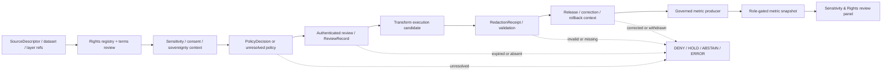

<!-- [KFM_META_BLOCK_V2]
doc_id: kfm://doc/dashboards-governance-sensitivity-rights
title: Sensitivity and Rights Governance Dashboard Specification
type: dashboard-specification
version: v1.0.0
status: "draft; repository-grounded; specification-only; metric-contracts-proposed; policy-unbound; rights-resolution-unverified; runtime-unverified; placement-hold; non-release; non-publication"
owners:
  - "@bartytime4life"
owner_status: "CONFIRMED GitHub review route through CODEOWNERS; sensitivity, rights-holder, consent/privacy, sovereignty/cultural, policy, security, metric/UI, release/correction, and independent-review stewardship remain NEEDS VERIFICATION"
created: 2026-05-20
updated: 2026-08-22
policy_label: "repository-facing; restricted-review; dashboards; governance; sensitivity; rights; redaction; anti-inference; fail-closed; non-release; non-publication"
owning_root: docs/
responsibility: >-
  Define a human-readable, review-facing Sensitivity and Rights governance-health
  dashboard specification; preserve the five inherited indicator families; reconcile
  them with current repository evidence; define proposed measurement envelopes,
  finite display states, safe drill-down rules, validation expectations, correction
  behavior, and open verification work without becoming sensitivity, rights, policy,
  evidence, review, telemetry, runtime, release, or publication authority.
authority: >-
  Documentation and review guidance only. Contracts own semantic meaning; schemas
  own machine shape; registries own reviewed control records; policy owns
  admissibility source; authenticated review and release records own decisions;
  governed applications own runtime display; this file owns none of those effects.
current_path: docs/dashboards/governance/SENSITIVITY_RIGHTS.md
canonical_relationship: >-
  Same-path replacement of an existing tracked specification. Accepted ADR-0029
  supports PLACE for this docs-root correction. The broader docs/dashboards lane,
  filename normalization, and structural migration remain HOLD.
truth_posture: >-
  CONFIRMED current repository evidence and bounded fixture profiles / LINEAGE the
  five Atlas-derived indicator identities, old panel ideas, and old numeric healthy
  postures / PROPOSED metric contracts, populations, thresholds, producers, panels,
  and drill-downs / CONFLICTED stale shared RedactionReceipt contract prose versus
  the current closed fielded fixture schema, multiple historical receipt-schema
  homes, and parallel redaction-profile placeholder paths / UNKNOWN production
  sensitivity evaluation, rights-resolution records, authenticated review cadence,
  redaction-transform execution, side-channel telemetry, metric production,
  dashboard routing, deployed access control, correction propagation, and public
  parity.
evidence_snapshot:
  repository: bartytime4life/Kansas-Frontier-Matrix
  base_ref: main
  base_commit: f86fcddb553217f7ffadafd80f20e95d635180b1
  target_prior_blob: a84b94362793082784b06dc4faf1972e27a82570
  directory_rules_adr_blob: a4de0d7a96b78da59cfc499d1025e1508afd8dd9
  redaction_receipt_contract_blob: c686cdf5c79a8b99ac66d4b01cd30d2f450f645f
  redaction_receipt_schema_blob: 7806abb702accd70dd17e947858c5768cc3eddae
  redaction_receipt_validator_blob: b6d22549a8b043d89ee9c1af658f1662ada70ee5
  redaction_receipt_fixtures_blob: a13adcae4e2fbcb3fa8a42dae8aba510a6ea31e3
  redaction_receipt_tests_blob: ddbbf4cf49476312a6eea1c8ecf53c7f5ab1b938
  redaction_receipt_workflow_blob: 71c1d0fb05b7a47583e5387f7dd120c2717fd67f
  review_record_contract_blob: 9641345d1e5d939dc59687a900e60a563d92c4f0
  review_record_schema_blob: fe2f2223af46481e7fb19b0baa94f62ce9c6c855
  sensitive_location_parity_contract_blob: 0740f68300075fc707b221f6ff49a000f4f9a3e9
  sensitive_location_parity_workflow_blob: 4f1468fe4116fb3df755d3c78aa0fbf90180d34f
  sensitive_release_review_contract_blob: 235ca86dd807c6842ca8c861f995371fe7758f64
  sensitive_release_review_workflow_blob: cc47e292f20a3a27c97430800f1a0a1c5a8c6a95
  review_console_sensitivity_readme_blob: 216feb98ebf2c4099dee61b485e539053bbd85a3
  governed_api_route_registry_blob: 3418168d0b267160d6ad6dd87f289e880ef4a024
inspection_boundary: >-
  Current-session GitHub reads covered the complete predecessor; governance and
  dashboard documentation; accepted Directory Rules authority; the shared
  RedactionReceipt contract, schema, fixtures, validator, tests, and workflow;
  sensitivity and redaction policy boundaries; the rights registry parent;
  ReviewRecord contract/schema; fixture-only sensitive-location parity and T3/T4
  independent-review closure profiles; Review Console sensitivity-review
  documentation; governed API route registration; open pull-request and task-branch
  overlap; and current main. No protected payload, live source, production policy
  evaluator, rights resolver, authenticated reviewer event, operational redaction
  transform, production receipt stream, metric producer, dashboard query, deployed
  panel, release record, correction cascade, rollback drill, or public request was
  exercised.
related:
  - README.md
  - ../README.md
  - ../DASHBOARD_CATALOG.md
  - ../INDICATOR_CATALOG.md
  - EVIDENCE_INTEGRITY.md
  - RELEASE_CORRECTION_ROLLBACK.md
  - AI_SURFACE_HEALTH.md
  - DOCUMENTATION_DRIFT.md
  - ../../doctrine/directory-rules.md
  - ../../adr/ADR-0029-adopt-directory-governance-standard-v2.md
  - ../../../contracts/shared/redaction_receipt.md
  - ../../../schemas/contracts/v1/receipts/redaction_receipt.schema.json
  - ../../../fixtures/contracts/v1/receipts/redaction_receipt/cases.json
  - ../../../tools/validators/receipts/validate_redaction_receipt.py
  - ../../../tests/validators/test_validate_redaction_receipt.py
  - ../../../policy/sensitivity/README.md
  - ../../../policy/redaction/README.md
  - ../../../data/registry/rights/README.md
  - ../../../contracts/governance/ReviewRecord.md
  - ../../../schemas/contracts/v1/governance/review_record.schema.json
  - ../../../contracts/governance/sensitive_location_parity_assessment.md
  - ../../../contracts/governance/sensitive_release_review_closure.md
  - ../../../apps/review-console/src/features/sensitivity_review/README.md
  - ../../../apps/governed-api/src/governed_api/routes/registry.py
  - ../../../.github/workflows/redaction-receipt.yml
  - ../../../.github/workflows/sensitive-location-parity-assessment.yml
  - ../../../.github/workflows/sensitive-release-review-closure.yml
  - ../../../.github/CODEOWNERS
tags: [kfm, dashboards, governance, sensitivity, rights, redaction-receipt, review-freshness, side-channel, anti-inference, finite-states, correction, rollback, non-publication]
notes:
  - "v1.0.0 replaces an Atlas-only, behavior-assertive v0.1 proposal with a current repository-grounded specification."
  - "The five inherited indicator identities remain lineage; their former 100 percent or cadence targets are not accepted metric contracts."
  - "The repository confirms three bounded no-network packages relevant to this dashboard: RedactionReceipt shape/semantics, sensitive-location parity declarations, and T3/T4 independent-review closure."
  - "Those packages are fixture-only and explicitly perform no production policy evaluation, transform, authenticated review, release, or publication."
  - "The original H1 fragment and all nine legacy section fragments are preserved explicitly."
  - "This revision changes documentation and required authoring provenance only."
[/KFM_META_BLOCK_V2] -->

<a id="top"></a>
<a id="sensitivity--rights-dashboard--governancesensitivity_rightsmd"></a>

# Sensitivity and Rights Governance Dashboard Specification

**Repository-grounded review specification for sensitivity fail-closed posture, protective-transform receipts, review freshness, rights-change response, side-channel audits, and safe correction behavior.**


[Scope](#1-description) · [Evidence](#2-current-repository-evidence) · [Indicators](#2-indicators-surfaced) · [Measurement](#4-measurement-envelope-and-finite-display-states) · [Signals](#5-signal-model) · [Panels](#3-panels-proposed) · [Inputs](#4-inputs--receipts-and-records-read) · [Ownership](#6-ownership-and-review-burden) · [Safety](#9-anti-leakage-constraints-confirmed-doctrine) · [Validation](#7-acceptance) · [Open work](#8-open-questions) · [Rollback](#12-maintenance-correction-and-documentation-rollback)

> [!IMPORTANT]
> **Current checkpoint.** KFM has a closed, deterministic, fixture-only `RedactionReceipt` schema/validator/test packet; a fixture-only cross-domain sensitive-location parity assessment; and a fixture-only T3/T4 independent-review closure profile. It also has documented sensitivity/redaction policy boundaries, a rights-registry parent, and a Review Console sensitivity-review feature boundary. The inspected evidence does **not** establish an active sensitivity bundle, operational rights resolver, real rights records, authenticated review stream, redaction-transform executor, side-channel audit producer, dashboard metric producer, routed dashboard, deployed role gate, release, or publication.

> [!CAUTION]
> **A green dashboard cannot make sensitive material safe.** A schema-valid receipt, successful fixture, review binding, policy source file, CODEOWNERS route, chart, percentage, or dashboard state is not a `PolicyDecision`, authenticated review, transform execution, rights clearance, `ReleaseManifest`, correction action, rollback action, or publication authority.

> [!WARNING]
> **The dashboard must not become the leak.** Never place protected values, exact or reconstructable coordinates, living-person private facts, genomic material, private cultural knowledge, exploit-enabling infrastructure detail, rights-holder confidential terms, reversal parameters, hidden thresholds, low-count intersections, free-text sensitive reasons, or internal access-control facts in a metric dimension, chart label, tooltip, URL, log, export, accessibility string, search index, cache key, or AI prompt.

> [!NOTE]
> **Unknown is not zero.** Missing policy execution, missing rights records, missing review cadence, missing telemetry, or missing metric populations must render `NOT_MEASURED`, `INCOMPLETE`, `RESTRICTED`, `CONFLICTED`, or `ERROR`—never a healthy zero or an implied 100 percent.

---

<a id="1-description"></a>

## 1. Scope and authority boundary

This document specifies a **system-wide, review-facing governance-health projection** for sensitivity and rights posture. It preserves the five indicator families inherited from the v0.1 specification and the indicator catalog:

1. sensitive-lane fail-closed posture;
2. `RedactionReceipt` closure coverage;
3. review-aged-out incidence;
4. rights-change response time; and
5. sensitive-content side-channel audit posture.

It defines what each indicator would need to mean, what current repository evidence can support, which finite states must remain visible, and which details must be withheld.

It does not:

- classify a record or claim as sensitive;
- decide rights, consent, sovereignty, cultural authority, geoprivacy, or access;
- execute a redaction, generalization, aggregation, delay, suppression, or withholding transform;
- authenticate a reviewer or rights-holder representative;
- evaluate production policy;
- grant access, promote, release, correct, withdraw, roll back, deploy, or publish;
- store protected payloads, policy decisions, receipts, review records, rights records, or metric snapshots;
- create a dashboard route, metric producer, or telemetry stream.

### Responsibility split

| Responsibility | Owning surface or decision | Boundary here |
|---|---|---|
| Sensitivity and rights meaning | accepted contracts, doctrine, source/rights records, and accountable stewards | This page cannot classify or clear a subject |
| Machine shape | `schemas/` | This page cannot add fields or certify an instance |
| Policy source and evaluation | `policy/` plus an accepted evaluator | A chart cannot allow, deny, restrict, redact, or generalize |
| Rights control state | [`data/registry/rights/`](../../../data/registry/rights/README.md) and governed review | This page cannot issue a license or resolve terms |
| Protective-transform process memory | `RedactionReceipt` and related receipt lanes | Receipt presence is not transform sufficiency or release |
| Human/qualified review | authenticated `ReviewRecord` or accepted review-binding profile | CODEOWNERS routing is not review approval |
| Metric production | accepted telemetry/implementation roots | Markdown is not a numerator, denominator, or event store |
| Role-gated display | an accepted app behind governed interfaces | This file creates no route or access control |
| Release, correction, rollback | `release/` and accountable records | A healthy indicator cannot perform a state transition |

### Placement decision

Accepted [ADR-0029](../../adr/ADR-0029-adopt-directory-governance-standard-v2.md) adopts Directory Rules v2 and makes `docs/` the human-readable explanation root. This is an existing tracked human specification, so correction at the same path is `PLACE`.

The broader `docs/dashboards/` direct-child lane and filename conventions remain a structural **HOLD**. This update does not admit, move, rename, mirror, redirect, retire, or delete the lane.

<a id="5-files"></a>

### Connected file posture

- [`README.md`](README.md) defines the governance-dashboard documentation boundary.
- [`../DASHBOARD_CATALOG.md`](../DASHBOARD_CATALOG.md) catalogs this specification while runtime remains proposed.
- [`../INDICATOR_CATALOG.md`](../INDICATOR_CATALOG.md) preserves the five inherited indicator families and old healthy postures as planning lineage.
- [`EVIDENCE_INTEGRITY.md`](EVIDENCE_INTEGRITY.md), [`AI_SURFACE_HEALTH.md`](AI_SURFACE_HEALTH.md), and [`RELEASE_CORRECTION_ROLLBACK.md`](RELEASE_CORRECTION_ROLLBACK.md) are adjacent governance-health specifications; none is policy or release authority.
- [`apps/review-console/src/features/sensitivity_review/README.md`](../../../apps/review-console/src/features/sensitivity_review/README.md) is a role-gated feature boundary document, not a working panel.
- The inspected governed API registry exposes bootstrap, layers, and evidence routes—not a sensitivity, rights, or dashboard route.

[Back to top](#top)

---

<a id="2-current-repository-evidence"></a>

## 2. Current repository evidence

Repository presence proves bytes, bounded shapes, and declared fixture behavior. It does not prove production protection, metric completeness, or public safety.

| Surface inspected | Current observation | What is confirmed | What remains unproved |
|---|---|---|---|
| This target | Existing v0.1 proposal at prior blob `a84b94362793082784b06dc4faf1972e27a82570`. | Path and predecessor exist. | The former behavior assertions and targets were not implementation proof. |
| RedactionReceipt contract | Shared semantic contract separates transform recording from policy, review, evidence, release, and protected input. | Cross-domain receipt meaning is documented. | The contract prose still describes an empty schema and is stale relative to the fielded closed schema. |
| RedactionReceipt schema | Closed Draft 2020-12 fixture profile with deterministic identity, T0–T4 exposure fields, public-candidate dependencies, and fixed-false authority effects. | Bounded machine shape exists. | Status is `PROPOSED_INACTIVE`; no production emitter or transform is established. |
| RedactionReceipt validator/tests | Deterministic no-network validator; fixture suite covers `PASS`, `DENY`, `ABSTAIN`, and `ERROR`, including leak and authority-overreach negatives. | Executable fixture validation exists. | It opens no restricted input, runs no policy, executes no transform, authenticates no review, and authorizes no release. |
| RedactionReceipt workflow | Read-only hosted workflow runs the fixture validator/test and generated-receipt check. | Hosted orchestration is declared. | A workflow pass is not rights clearance, policy enforcement, transform sufficiency, release, or publication. |
| Sensitivity policy boundary | Sixteen Rego files, eleven YAML files, and documented placeholders exist; defaults are mixed. | Policy source/scaffolds are inventoryable. | No accepted bundle, evaluator, complete native tests, authenticated decision emitter, or governed consumer is verified. |
| Redaction policy boundary | One empty proposed profile placeholder plus a parallel sensitivity placeholder; profile home is unresolved. | The path conflict and convergence hold are documented. | No accepted catalog, profile, selector, loader, executor, or public consumer exists. |
| Rights registry | Parent registry README and a Flora child README exist. | Rights and sensitivity are documented as separate fail-closed gates. | Canonical record shape, concrete records, resolver, validator, telemetry, and public API are unknown. |
| ReviewRecord | Rich semantic contract and a narrower proposed closed schema exist. | A review object family is documented and machine-shaped in part. | Contract/schema casing and vocabulary drift exist; the schema has no review-expiry or cadence field. |
| Sensitive-location parity | Fixture-only contract/schema/validator/tests/workflow cover exact-deny and generalized-with-receipt-candidate declarations without coordinates. | Cross-domain declaration consistency is testable. | No sensitivity registry, policy execution, evidence resolution, transform, access grant, release, API, or UI authority. |
| T3/T4 review closure | Fixture-only profile validates reviewer independence and required evidence/correction/rollback references before a separate release gate. | Bounded separation-of-duties closure is testable. | No actor authentication, signature, real policy evaluation, approval, promotion, release, or publication. |
| Review Console | `sensitivity_review/` contains only a detailed README under the inspected tree. | App-local feature boundary exists. | No feature module, route, DTO, query, fixture, test, build, access-control behavior, deployment, or metric panel is proved. |
| Governed API | Route registry contains bootstrap, layers, and evidence. | Exact routed surface is bounded. | No sensitivity/rights/dashboard route is registered. |
| Side-channel audits | Scattered domain/test references exist. | The risk is recognized in documentation. | No accepted audit profile, event stream, cadence producer, aggregate, or dashboard query is verified. |

### Current contradictions and drift

| Drift | Status | Dashboard treatment |
|---|---|---|
| Shared RedactionReceipt contract says schema is empty; current fixture schema is closed and fielded. | `CONFLICTED` documentation | Display as contract/schema drift; do not choose authority by dashboard prose. |
| Redaction profile candidates exist under both `policy/redaction/profiles.yaml` and `policy/sensitivity/profiles.yaml`. | `HOLD` pending ADR/convergence | Do not aggregate them as one accepted catalog or count either as active. |
| Search surfaces expose multiple historical RedactionReceipt schema homes. | `NEEDS VERIFICATION` / compatibility drift | Use the currently wired fixture profile only for bounded validation; do not imply canonical convergence. |
| `ReviewRecord.md` casing and schema `contract_doc` casing differ, and semantic vocabulary is broader than schema vocabulary. | `CONFLICTED` | Review-freshness metrics remain incomplete until a governed profile resolves identity and cadence. |

[Back to top](#top)

---

<a id="2-indicators-surfaced"></a>

## 3. Indicator contracts

The five names are retained from lineage. Their measurement contracts, eligible populations, thresholds, producers, and panels remain **PROPOSED**.

| ID | Indicator family | Review question | Current bounded posture |
|---|---|---|---|
| `SR-01` | **Sensitive-lane fail-closed disposition integrity** | For a versioned eligible request population, did unresolved or unauthorized cases receive the required finite disposition at the correct upstream gate, without unsafe fallback or later leakage? | Fixture profiles demonstrate selected denial/hold polarity; no production request population, policy evaluator, or gate telemetry is proved. |
| `SR-02` | **RedactionReceipt closure coverage** | For eligible public-safe transform candidates, is there a resolvable, profile-matching receipt with coherent policy, review, validation, evidence, source, release-candidate, and rollback references—and no protected or reversal material? | A closed fixture schema and deterministic validation packet exist; no production transform or receipt stream is proved. |
| `SR-03` | **Review freshness and aged-out incidence** | Which eligible sensitivity/rights decisions require refresh under an accepted cadence, and what safe disposition followed when review expired or context changed? | Review semantics exist, but the inspected ReviewRecord schema has no cadence/expiry field and no authenticated event population is proved. |
| `SR-04` | **Rights-change response and propagation** | From a governed rights-change event, how long until affected source/dataset/layer/release posture is reassessed, corrected, restricted, withdrawn, or held across dependent surfaces? | Rights registry documentation exists; concrete records, change events, resolver, dependency graph, timestamps, and propagation telemetry are unproved. |
| `SR-05` | **Sensitive-content side-channel audit posture** | For an accepted audit profile, were map/UI/API/search/export/log/cache/accessibility/AI channels tested without exposing protected values, low-count inference, denial secrets, or reversal material? | Risk language and bounded negatives exist; no complete audit profile, producer, cadence, aggregate, or operational finding stream is verified. |

### Why the former numeric targets are not accepted

The v0.1 specification and indicator catalog mirrored `100%` or cadence-style healthy postures. Those remain planning lineage, not accepted thresholds. Before a percentage or latency can be reviewed, an accepted metric contract must define:

- exact eligible population and excluded states;
- event identity and deduplication;
- numerator, denominator, arithmetic, units, and rounding;
- source, policy, review, receipt, and release versions;
- observation, valid, retrieval, decision, correction, and metric snapshot times;
- late, duplicated, corrected, withdrawn, revoked, or superseded events;
- null, unknown, not applicable, restricted, suppressed, stale, malformed, and error semantics;
- minimum-count and anti-inference controls;
- accountable owner, reviewer, correction path, and rollback target.

Until then, the dashboard may show evidence-backed counts and finite completeness states, but it must not present an unsupported compliance percentage.

[Back to top](#top)

---

<a id="4-measurement-envelope-and-finite-display-states"></a>

## 4. Measurement envelope and finite display states

Every metric snapshot should be a released or role-gated governed projection with at least:

| Field family | Required content |
|---|---|
| Metric identity | indicator ID, contract version, producer version, snapshot ID, digest |
| Population | exact eligibility rule, exclusions, deduplication, scope, audience, domain/source grouping |
| Arithmetic | numerator/denominator or count definition, units, rounding, uncertainty |
| Time | event time, source time, review time, decision time, correction time, snapshot window |
| Authority refs | schema/contract/profile, source/rights/sensitivity/policy/review references |
| Release/correction | release state, correction/supersession/withdrawal state, rollback target |
| Missingness | unknown, absent, stale, restricted, suppressed, malformed, not applicable, no eligible population |
| Disclosure | role/access class, minimum cell size, suppression/generalization, prohibited dimensions |
| Provenance | immutable input set or manifest, computation receipt, validation result |
| Ownership | producer, steward/reviewer roles, refresh cadence, escalation path |

### Finite dashboard states

| State | Meaning |
|---|---|
| `SUPPORTED` | The declared metric population, inputs, computation, access posture, and references are coherent for the stated snapshot. |
| `INCOMPLETE` | One or more required inputs or joins are absent; do not infer a value. |
| `NOT_MEASURED` | No accepted producer or snapshot exists. |
| `NO_ELIGIBLE_POPULATION` | The accepted eligibility rule yields no events; this is not automatically healthy. |
| `STALE` | The metric, policy, rights, review, receipt, or release basis is outside its accepted validity window. |
| `RESTRICTED` | The result or drill-down is not suitable for the current audience. |
| `REVIEW_PENDING` | Required steward/rights-holder/independent review is unresolved. |
| `CONFLICTED` | Contract, schema, policy, profile, registry, or lineage authorities disagree. |
| `CORRECTED` | A prior metric or supporting record was corrected and lineage is preserved. |
| `WITHDRAWN` | The metric or supporting release is no longer valid for current use. |
| `ERROR` | Reading, validation, resolution, policy, computation, or delivery failed; never fall back to allow. |

A dashboard card must carry the snapshot time, completeness state, and population definition. A blank value, missing row, unavailable backend, restricted projection, or parser failure must never render as `0`, `100%`, `PASS`, or “no issues.”

[Back to top](#top)

---

<a id="5-signal-model"></a>

## 5. Signal model



The dashboard sits at the far right. It does not write any upstream object or convert missing closure into permission.

### Aggregation rules

- Aggregate only over an accepted, versioned population.
- Preserve the most restrictive applicable disclosure state.
- Do not join across domain/source/rights dimensions when the join increases re-identification or targeting risk.
- Do not expose small cells, exact timestamps, rare combinations, hidden policy reasons, or identifiers that enable reverse lookup.
- Keep fixture-only, candidate, simulated, and production events in separate populations.
- Keep `DENY`, `HOLD`, `ABSTAIN`, `ERROR`, `RESTRICTED`, `CORRECTED`, and `WITHDRAWN` distinct.
- Do not count a schema-valid fixture receipt as a production transform receipt.
- Do not count a README, workflow file, generated authoring receipt, or code path as an operational event.

[Back to top](#top)

---

<a id="3-panels-proposed"></a>

## 6. Panels and safe drill-downs

All panels are **PROPOSED**. No routed implementation or metric producer was verified.

| Panel | Safe question | Proposed display | Required restrictions |
|---|---|---|---|
| Fail-closed integrity | Are eligible unresolved/unauthorized cases receiving the expected upstream finite disposition? | Counts by coarse gate, outcome, contract/profile version, and time window | No protected subject, exact location, private reason, actor identity, or low-count slice |
| RedactionReceipt closure | Which eligible public-safe candidates have complete, coherent receipt dependencies? | `SUPPORTED` / `INCOMPLETE` / `CONFLICTED` / `ERROR` counts by transform class and profile version | No input/output values, secret parameters, exact geometry, or reversal material |
| Review freshness | Which accepted review populations are current, due, expired, pending, or unmeasurable? | Age bands and finite states, not reviewer performance rankings | Reviewer identity and sensitive subject details restricted to authorized need |
| Rights-change response | Are known governed rights changes propagating through affected dependencies? | Coarse latency bands and propagation state by source family | No confidential terms, rights-holder private facts, or unresolved legal interpretation |
| Side-channel audit | Which accepted channels and profiles were checked, and what safe finite result was emitted? | Last accepted run, profile version, channel family, pass/hold/error, correction state | Never show leaked value, exploit path, hidden selector, threshold, or exact affected item |
| Readiness matrix | Which dependency families are fielded, fixture-only, unbound, conflicted, or unknown? | Component/state matrix with evidence links | Documentation maturity must not be labeled operational protection |

### Drill-down contract

A drill-down may expose:

- stable public-safe reason codes;
- contract/schema/profile versions;
- coarse domain or source family;
- finite outcome;
- snapshot and correction state;
- receipt/evidence/policy/review references appropriate to the viewer;
- remediation owner role and next check.

A drill-down must not expose:

- protected source or derivative values;
- exact sensitive geometry or timestamps that reveal it;
- rights-holder confidential terms;
- consent, sovereignty, cultural, genomic, living-person, private-well, rare-species, archaeology, or infrastructure specifics beyond authorized minimum need;
- raw policy input, secret denial logic, hidden thresholds, access roles, or clearance facts;
- low-count intersections that reveal a protected subject;
- raw prompts, generated explanations, internal paths, credentials, or validator internals.

[Back to top](#top)

---

<a id="4-inputs--receipts-and-records-read"></a>

## 7. Inputs, joins, and current admissibility

A future producer should consume explicit governed records or projections. It must not scrape prose or infer operational state from path presence.

| Input family | Example current surface | Current admissibility for production metrics |
|---|---|---|
| RedactionReceipt | shared contract + fixture schema/validator/tests | `FIXTURE_ONLY`; not a production event stream |
| Sensitivity policy | `policy/sensitivity/` scaffolds | `UNBOUND`; no accepted evaluator/consumer |
| Redaction profile | parallel empty placeholder candidates | `CONFLICTED` / `HOLD` |
| Rights registry | parent README; Flora child README | `INCOMPLETE`; concrete records/resolver unknown |
| ReviewRecord | semantic contract + proposed narrow schema | `CONFLICTED` for cadence/freshness use |
| Sensitive-location parity | closed synthetic assessment packet | `FIXTURE_ONLY`; declaration consistency only |
| T3/T4 review closure | closed synthetic independent-review packet | `FIXTURE_ONLY`; no actor authentication or release |
| Review Console sensitivity feature | README only | `DOCUMENTATION_ONLY` |
| Governed API | bootstrap/layers/evidence routes | `NO_DASHBOARD_ROUTE` |
| Side-channel evidence | scattered docs and bounded negatives | `NOT_INSTRUMENTED` as a system-wide metric |

### Join requirements

Before a metric may be `SUPPORTED`, the producer must prove:

- referenced records use accepted object identity and version;
- source, rights, sensitivity, policy, review, receipt, release, correction, and rollback references resolve as required;
- fixture-only and production profiles are separated;
- no authority-upcast occurs from documentation, validation, or receipt presence;
- missing or restricted dependencies return a finite non-success state;
- correction, revocation, withdrawal, and supersession are reflected in the metric snapshot;
- joins do not create a side channel or weaken the most restrictive policy.

[Back to top](#top)

---

<a id="6-ownership-and-review-burden"></a>

## 8. Ownership, review, and separation of duties

`@bartytime4life` is the verified GitHub review route through CODEOWNERS. That routing is not proof of qualified sensitivity, rights-holder, privacy, sovereignty/cultural, policy, security, independent-review, metric, or release authority.

| Role | Proposed responsibility | Status |
|---|---|---|
| Sensitivity steward | Sensitivity populations, tiers, transform obligations, safe display | `NEEDS VERIFICATION` |
| Rights steward / rights-holder representative | Rights-event interpretation, obligations, recheck cadence, escalation | `NEEDS VERIFICATION` |
| Consent/privacy/sovereignty reviewer | Living-person, genomic, cultural, tribal/community, consent and revocation posture | `NEEDS VERIFICATION` |
| Policy steward | Accepted evaluator inputs/outcomes and reason-code disclosure | `NEEDS VERIFICATION` |
| Security/anti-inference reviewer | Side-channel profile, minimum-count rules, threat model | `NEEDS VERIFICATION` |
| Metric/observability steward | Producer, population, arithmetic, telemetry, correction | `NEEDS VERIFICATION` |
| Review Console steward | Role-gated UI and accessibility-safe rendering | `NEEDS VERIFICATION` |
| Release/correction steward | Released snapshot, correction, withdrawal, rollback propagation | `NEEDS VERIFICATION` |
| Independent reviewer | Separation of duties for T3/T4 and policy-significant changes | `NEEDS VERIFICATION` |

Policy-significant or sensitive release work must preserve separation of duties when required. A dashboard maintainer, metric producer, policy author, reviewer, and release authority must not be silently collapsed into one unreviewed role.

[Back to top](#top)

---

<a id="9-anti-leakage-constraints-confirmed-doctrine"></a>

## 9. Public API, UI, AI, and anti-leakage boundary

### Access posture

The system-wide operational panel should be treated as **role-gated restricted review**, even when this Markdown specification is repository-public. Public clients must not read registry, policy, receipt, review, or metric-internal stores directly.

A public summary, if ever authorized, should contain only released, high-level, minimum-count, public-safe aggregates with explicit limitations and correction state. It must not reveal why a particular subject was denied or transformed.

### API boundary

A future endpoint must:

- sit behind the governed API or another accepted trust membrane;
- validate a closed response envelope;
- enforce audience/role before querying or returning data;
- expose only released or role-authorized projections;
- preserve snapshot, metric-contract, correction, and finite-state metadata;
- return `DENY`, `ABSTAIN`, or `ERROR` without internal detail when closure fails;
- avoid direct access to policy source, rights registry internals, protected receipts, or sensitive payloads.

The current governed API route registry has no sensitivity/rights/dashboard route.

### UI and accessibility boundary

- No client-side filtering or styling may serve as the protection boundary.
- Tooltips, legends, labels, charts, table cells, keyboard names, screen-reader text, focus announcements, URL state, copy/share text, exports, print views, caches, and error messages must follow the same disclosure policy as visible content.
- Restricted dimensions must not be downloaded to the browser and merely hidden.
- Suppressed/low-count values must not be reconstructable by subtracting overlapping views.
- “No data,” “restricted,” “not measured,” and “error” must remain distinguishable.

### Governed AI boundary

AI may summarize a released or role-authorized metric snapshot with its limitations and citations. It must not:

- infer the protected subject behind an aggregate;
- reconstruct exact locations or private terms;
- explain hidden policy logic or sensitive denial reasons;
- treat a receipt or dashboard as evidence for the underlying domain claim;
- convert missing telemetry into a confident statement;
- recommend bypassing policy, review, rights, release, correction, or rollback.

[Back to top](#top)

---

<a id="7-acceptance"></a>

## 10. Validation, negative tests, and acceptance

### Current bounded repository commands

These repository-present commands exercise fixture-only profiles:

```bash
PYTHONDONTWRITEBYTECODE=1 KFM_NO_NETWORK=1 \
  python -m unittest tests.validators.test_validate_redaction_receipt -v

PYTHONDONTWRITEBYTECODE=1 KFM_NO_NETWORK=1 \
  python tools/validators/receipts/validate_redaction_receipt.py --fixtures

PYTHONDONTWRITEBYTECODE=1 KFM_NO_NETWORK=1 \
  python -m unittest \
  tests.validators.test_validate_sensitive_location_parity_assessment --verbose

PYTHONDONTWRITEBYTECODE=1 KFM_NO_NETWORK=1 PYTHONHASHSEED=0 \
  python -m pytest -q \
  tests/validators/governance/test_sensitive_release_review_closure.py
```

A green result proves only the declared synthetic profile and deterministic local checks. It does not prove live rights, active policy, protected-input handling, transform sufficiency, authenticated review, operational access control, metric correctness, release, or publication.

### Required dashboard negative tests

| Test | Required result |
|---|---|
| Missing policy, rights, sensitivity, review, receipt, evidence, release, or rollback dependency | `INCOMPLETE`, `REVIEW_PENDING`, `RESTRICTED`, `DENY`, `ABSTAIN`, or `ERROR`; never healthy |
| No accepted metric producer or population | `NOT_MEASURED` |
| Empty eligible population | `NO_ELIGIBLE_POPULATION`, not `100%` |
| Stale or superseded review/rights/policy basis | `STALE`, `CORRECTED`, or `WITHDRAWN` with lineage |
| Shared contract/schema drift or profile-home conflict | `CONFLICTED` |
| Fixture-only event included in production denominator | validation failure |
| Protected value, exact geometry, reversal material, hidden threshold, or confidential term in output | fail closed; no value echoed |
| Low-count or differencing attack across filters | suppress/generalize/deny and record safe audit finding |
| Unauthorized role requests panel or drill-down | `DENY` before data access |
| Client receives restricted dimension and hides it locally | validation/security failure |
| Side-channel audit error or missing cadence | `ERROR` or `NOT_MEASURED`, not pass |
| Corrected/withdrawn source, rights, review, or release state | affected snapshots, caches, exports, search, and AI projections invalidated |
| Dashboard score used as release approval | explicit contract/policy failure |

### Documentation acceptance for this revision

- [x] Same existing path retained.
- [x] Five inherited indicator identities preserved.
- [x] Legacy H1 and section fragments preserved explicitly.
- [x] Current repository evidence separated from proposal and unknown state.
- [x] Unsupported numeric targets removed from authoritative posture.
- [x] Sensitive payloads and operational secrets excluded.
- [x] Correction and rollback path documented.
- [ ] Hosted exact-head checks settle.
- [ ] Accountable human review completes.
- [ ] Production metric/runtime claims remain held until independently verified.

[Back to top](#top)

---

<a id="8-open-questions"></a>

## 11. Open verification register

- [ ] **SR-OQ-01 — Stewardship.** Assign qualified sensitivity, rights, privacy/consent, sovereignty/cultural, security, metric, UI, release, and independent-review roles.
- [ ] **SR-OQ-02 — Metric contracts.** Ratify population, arithmetic, windows, null semantics, disclosure, correction, and owner for `SR-01` through `SR-05`.
- [ ] **SR-OQ-03 — Policy runtime.** Verify or implement an accepted sensitivity evaluator, bundle selector, authenticated decision emitter, and governed consumer.
- [ ] **SR-OQ-04 — Redaction profile authority.** Resolve `policy/redaction/profiles.yaml` versus `policy/sensitivity/profiles.yaml` through an ADR and single-writer migration.
- [ ] **SR-OQ-05 — Redaction contract drift.** Reconcile stale shared-contract schema posture with the closed fixture-only schema without converting fixture status into production authority.
- [ ] **SR-OQ-06 — Receipt authority.** Reconcile historical RedactionReceipt schema locations, compatibility expectations, signing, persistence, and production emitter ownership.
- [ ] **SR-OQ-07 — Transform runtime.** Implement and validate an accepted profile loader/executor with protected-input controls and no reversal leakage.
- [ ] **SR-OQ-08 — Rights records.** Define and populate an accepted rights-registry shape, resolver, terms-review events, dependency links, correction, and rollback semantics.
- [ ] **SR-OQ-09 — Review freshness.** Resolve ReviewRecord casing/vocabulary drift and add accepted cadence/expiry or refresh semantics.
- [ ] **SR-OQ-10 — Authenticated review.** Bind reviewer identity, role, independence, authority, and decision signatures for sensitive operations.
- [ ] **SR-OQ-11 — Side-channel profile.** Define channel inventory, minimum-count rules, differencing tests, disclosure-safe findings, cadence, and owner.
- [ ] **SR-OQ-12 — Metric producer.** Implement immutable snapshots, deterministic computation, validation, telemetry, retention, and correction propagation.
- [ ] **SR-OQ-13 — Governed route.** Define a role-gated response contract and route only after upstream policy/rights/review/metric closure.
- [ ] **SR-OQ-14 — Review Console.** Implement the sensitivity-review panel with authorization, accessibility, safe errors, fixtures, and tests.
- [ ] **SR-OQ-15 — Release and rollback.** Prove a correction/withdrawal/rollback drill that invalidates dashboard, cache, export, search, map, and AI projections.
- [ ] **SR-OQ-16 — Public summary.** Decide whether any system-wide summary is public-safe; default to no public operational panel until reviewed.
- [ ] **SR-OQ-17 — Dashboard placement.** Resolve the broader `docs/dashboards/` lane and naming through the accepted structural process; do not move this file opportunistically.
- [ ] **SR-OQ-18 — Catalog parity.** Keep dashboard and indicator catalogs synchronized without turning either into runtime evidence.

[Back to top](#top)

---

<a id="12-maintenance-correction-and-documentation-rollback"></a>

## 12. Maintenance, correction, and documentation rollback

### Maintenance triggers

Re-review this specification when any of the following changes:

- sensitivity tier or policy vocabulary;
- rights-registry record shape or resolver;
- redaction profile authority, schema, validator, or executor;
- ReviewRecord or reviewer-authority binding;
- metric producer or telemetry contract;
- Review Console or governed API route;
- public-summary access posture;
- correction, withdrawal, or rollback behavior;
- accepted Directory Rules or dashboard-lane placement.

### Correction behavior

When a supporting contract, schema, policy, rights record, review, receipt, release, or metric snapshot is corrected or withdrawn:

1. retain the prior identity and correction lineage;
2. invalidate or mark stale affected metric snapshots;
3. prevent stale values from remaining current in caches, exports, search, map, accessibility text, or AI summaries;
4. emit only public-safe correction notices to the audience;
5. recompute only from accepted, immutable inputs;
6. preserve rollback targets and auditability.

### Documentation rollback

The deterministic documentation rollback target for this revision is prior blob:

```text
a84b94362793082784b06dc4faf1972e27a82570
```

Before merge, close the draft pull request and abandon the feature branch. After an authorized merge, restore the prior blob or transparently revert the documentation commit through normal Git history. A documentation revert does not reverse policy, rights, review, transforms, metrics, release, deployment, or publication because this specification creates none.

### Non-effects

This file does not:

- activate a source, rights record, policy bundle, redaction profile, or connector;
- classify, transform, reveal, or publish protected material;
- authenticate a reviewer or rights-holder;
- emit a production receipt, metric, policy decision, review record, release manifest, correction notice, or rollback card;
- implement an API route, Review Console feature, dashboard query, telemetry producer, cache invalidation, or AI answer;
- merge itself, approve itself, change repository settings, release, deploy, promote, or publish.

[Back to top](#top)
