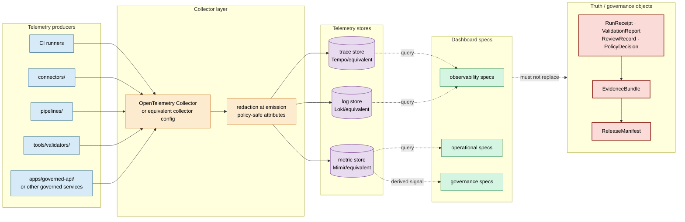

<!-- [KFM_META_BLOCK_V2]
doc_id: kfm://doc/dashboards-observability-opentelemetry-stack
title: OpenTelemetry Observability Stack — dashboard specification
type: standard
version: v0.2
status: draft
owners: OWNER_TBD  # NEEDS VERIFICATION: observability steward + docs steward + platform/infra owner
created: 2026-05-20
updated: 2026-06-12
policy_label: public
related:
  - docs/dashboards/README.md
  - docs/dashboards/observability/README.md
  - docs/dashboards/DASHBOARD_CATALOG.md
  - docs/dashboards/operational/SLO_LIVE_FEEDS.md
  - docs/dashboards/operational/REALTIME_FEED_FRESHNESS.md
  - docs/dashboards/observability/validator-orchestrator-health.md
  - docs/standards/TELEMETRY_MINIMUMS.md
  - docs/standards/OPENLINEAGE_FACETS.md
  - docs/doctrine/directory-rules.md
  - docs/registers/DRIFT_REGISTER.md
  - docs/registers/VERIFICATION_BACKLOG.md
tags: [kfm, dashboards, observability, opentelemetry, otel, tempo, mimir, loki, ci, telemetry, specification]
notes:
  - "v0.2 polish pass: preserves the KFM-P8-PROG-0026 source-card lineage and the telemetry-is-carrier-not-truth boundary."
  - "This is a dashboard/substrate specification, not proof of a running OpenTelemetry stack."
  - "Mounted-repo implementation status remains NEEDS VERIFICATION unless infra configs, services, telemetry exports, and dashboard queries are inspected."
  - "The observability lane is PROPOSED under docs/dashboards/ pending OPEN-DASH-01 / placement resolution."
  - "No telemetry signal, metric, trace, log, dashboard panel, or green status substitutes for EvidenceBundle, receipt, policy, review, or release state."
[/KFM_META_BLOCK_V2] -->

# OpenTelemetry Observability Stack · `observability/OPENTELEMETRY_STACK.md`

<!-- [doc: kfm://doc/dashboards-observability-opentelemetry-stack] -->
<a id="top"></a>

> Specification for KFM's proposed **CI / pipeline observability substrate**: one OpenTelemetry-compatible emission shape feeding trace, metric, and log stores that operational and governance dashboards may read — without turning telemetry into evidence or release authority.

<p>
  
  
  
  
  
  
  
  
  
</p>

**Status:** draft · **Owner:** `OWNER_TBD` · **Last reviewed:** 2026-06-12 · **Implementation depth:** NEEDS VERIFICATION

> [!IMPORTANT]
> **Telemetry is a carrier, not truth.** Traces, metrics, and logs help operate KFM. They do not establish trust in data, do not admit a source, do not promote an artifact, and do not publish a claim. Consequential trust still comes from source descriptors, receipts, validators, EvidenceBundles, policy decisions, review records, release manifests, correction lineage, and rollback targets.

> [!CAUTION]
> **Spec only.** This file does not prove that an OpenTelemetry Collector, Tempo, Mimir, Loki, Grafana, hosted equivalent, collector config, alert rule, dashboard, or CI emission path exists or is healthy. Those are **NEEDS VERIFICATION** until confirmed from repo files, infra configs, runtime evidence, CI logs, or emitted telemetry.

---

## Contents

1. [Scope](#1-scope)
2. [Repo fit](#2-repo-fit)
3. [Non-goals](#3-non-goals)
4. [Stack model](#4-stack-model-proposed)
5. [Signals carried](#5-signals-carried-proposed)
6. [Dashboard panels](#6-dashboard-panels-proposed)
7. [Architecture](#7-architecture-proposed)
8. [Inputs and producers](#8-inputs-and-producers)
9. [Outputs and consumers](#9-outputs-and-consumers)
10. [Public exposure and sensitivity](#10-public-exposure-and-sensitivity)
11. [Files and implementation pointers](#11-files-and-implementation-pointers)
12. [Ownership and review burden](#12-ownership-and-review-burden)
13. [Acceptance checklist](#13-acceptance-checklist)
14. [Validation and drift handling](#14-validation-and-drift-handling)
15. [Open questions](#15-open-questions)
16. [Evidence basis](#16-evidence-basis)

---

## 1. Scope

This specification describes the **observability substrate** that KFM dashboard specifications may rely on for CI and pipeline health signals.

It covers:

- a proposed shared telemetry emission pattern for CI runners, connectors, pipelines, validators, and governed services;
- stack components for collecting, storing, querying, and rendering telemetry;
- the signals that downstream operational and governance dashboard specs may consume;
- minimum health panels for the stack itself;
- boundaries that prevent telemetry from replacing evidence, validation, policy, review, or release state.

This spec is grounded in the source-card lineage named in the draft (`KFM-P8-PROG-0026`) and the observability README's substrate posture. The implementation is not confirmed here.

[↑ back to top](#top)

---

## 2. Repo fit

```text
docs/
└── dashboards/                                  # PROPOSED lane pending OPEN-DASH-01
    ├── README.md                                # dashboard-lane orientation
    ├── DASHBOARD_CATALOG.md                     # index of dashboard specs
    ├── INDICATOR_CATALOG.md                     # governance-health indicator mirror
    ├── operational/                             # application / feed / artifact / QC health specs
    │   ├── SLO_LIVE_FEEDS.md                    # consumes telemetry from this stack
    │   └── REALTIME_FEED_FRESHNESS.md           # consumes telemetry from this stack
    ├── governance/                              # governance posture specs
    └── observability/                           # THIS LANE — telemetry/substrate specs
        ├── README.md
        ├── OPENTELEMETRY_STACK.md               # this file
        └── validator-orchestrator-health.md     # system-health spec for validator orchestration
```

### 2.1 Responsibility split

| Concern | Correct home | Status | Notes |
|---|---|---:|---|
| Human-readable observability spec | `docs/dashboards/observability/OPENTELEMETRY_STACK.md` | PROPOSED lane | This file explains the substrate. |
| Collector config, store deployments, alert rules | `infra/observability/` or external stack repository | NEEDS VERIFICATION | Do not store implementation config in this doc. |
| Runtime telemetry adapters | `runtime/observability/` or package-local code | NEEDS VERIFICATION | This spec may point to adapters; it does not implement them. |
| Validator / SLO-checker code | `tools/validators/`, `tests/...` | NEEDS VERIFICATION | Dashboards report results; validators enforce. |
| Telemetry schemas / event envelopes | `schemas/contracts/v1/...` | PROPOSED | Schema home follows Directory Rules / ADR-0001 posture. |
| Policy for access, retention, release blocking | `policy/` | PROPOSED | Policy decisions do not live in dashboard specs. |
| Receipts, proof objects, release manifests | `data/receipts/`, `data/proofs/`, `release/` | NEEDS VERIFICATION | Telemetry may reference them; it does not replace them. |

> [!NOTE]
> `docs/dashboards/` remains a **PROPOSED lane** in this document. Placement should be resolved through the dashboard-lane ADR / drift process before treating this lane as fully canonical.

[↑ back to top](#top)

---

## 3. Non-goals

This file MUST NOT become any of the following:

| Not this | Why | Correct destination |
|---|---|---|
| Running Grafana / dashboard JSON | Would turn docs into implementation storage. | `infra/observability/` or external dashboard repo. |
| Collector deployment manifest | Would collapse spec and infrastructure. | `infra/observability/`. |
| Alert rule bundle | Alerts are operational policy / infra. | `infra/observability/alerts/` or `policy/observability/` as appropriate. |
| Evidence source | Telemetry is not EvidenceBundle. | `data/proofs/`, `data/receipts/`, `release/`. |
| Release gate decision | Release decisions are not dashboard states. | `release/`, `policy/release/`. |
| Public health claim | Observability may expose sensitive operational posture. | Public-safe summaries only after policy review. |

[↑ back to top](#top)

---

## 4. Stack model (PROPOSED)

The draft stack model is:

```text
OpenTelemetry-compatible emitters
  → OpenTelemetry Collector / equivalent collector layer
  → trace store + metric store + log store
  → internal dashboard surfaces / query layer
  → operational and governance dashboard specs consume derived, policy-safe signals
```

### 4.1 Components

| Component | Role | Healthy posture (PROPOSED) | Negative state | Implementation status |
|---|---|---|---|---|
| OpenTelemetry Collector or equivalent collector layer | Receives OTLP or compatible telemetry and fans out signals. | Reachable; bounded queue; no unexplained drops. | `OTEL_COLLECTOR_DOWN`, `OTEL_EXPORT_DROPPED` | NEEDS VERIFICATION |
| Trace store (`Tempo` or equivalent) | Stores pipeline, connector, validator, and service traces. | Traces queryable within retention. | `TRACE_BACKEND_UNAVAILABLE` | NEEDS VERIFICATION |
| Metric store (`Mimir` or equivalent) | Stores SLOs, freshness, validation, and substrate health metrics. | Metrics queryable within retention. | `METRICS_BACKEND_UNAVAILABLE` | NEEDS VERIFICATION |
| Log store (`Loki` or equivalent) | Stores structured logs after redaction-at-emission. | Logs queryable within retention and policy bounds. | `LOG_BACKEND_UNAVAILABLE` | NEEDS VERIFICATION |
| Dashboard / query surface | Renders internal operational views from the stores. | Queries are reproducible, scoped, and access-controlled. | `DASHBOARD_QUERY_FAILED` | NEEDS VERIFICATION |

> [!TIP]
> The product names (`Tempo`, `Mimir`, `Loki`) express the draft card's intended stack shape. KFM may later adopt managed or alternate backends if the signal contracts remain explicit and the substitution is documented.

[↑ back to top](#top)

---

## 5. Signals carried (PROPOSED)

| # | Signal family | Example signals | Primary consumers | Sensitivity posture |
|---:|---|---|---|---|
| 1 | Connector / ingest traces | fetch start/end, retry span, source endpoint class, normalized source ID | `SLO_LIVE_FEEDS.md`, realtime feed monitors | Internal; redact source URLs if sensitive. |
| 2 | Pipeline run traces | stage start/end, validator call span, transform span, artifact-write span | operational dashboards, runbooks | Internal; no raw payloads in spans. |
| 3 | Validation metrics | pass/fail counts, exit codes, per-validator duration, coverage drift | `validator-orchestrator-health.md`, governance validation view | Internal by default. |
| 4 | Freshness metrics | latest successful ingest time, lag against cadence, stale window count | live-feed SLO dashboards | Public-safe only after aggregation and review. |
| 5 | Artifact health metrics | build duration, reproducibility verdict count, hash-chain verify status | COG/Zarr reproducibility dashboard | Internal; artifact IDs may be policy-scoped. |
| 6 | QC metrics | geometry validity count, CRS mismatch count, topology defect count | geospatial QC panel | Internal; exact failing geometry stays out of telemetry. |
| 7 | Substrate health metrics | collector queue depth, dropped signal count, backend latency, retention age | observability owner, SRE | Internal operations. |
| 8 | Structured logs | sanitized operation logs, error codes, run IDs, trace IDs | runbooks, incident review | Internal; no sensitive artifact content. |

### 5.1 Signal contract rules

- Signals SHOULD carry stable IDs, receipt IDs, run IDs, artifact IDs, and trace IDs where safe.
- Signals MUST NOT carry raw source payloads, exact sensitive coordinates, living-person data, DNA/genomic details, restricted archaeology details, secrets, tokens, credentials, or raw validator stderr.
- Signals SHOULD reference receipts and manifests by ID; they MUST NOT substitute for them.
- Sensitive failures SHOULD emit a policy-safe reason code rather than exposing the sensitive value that failed.

[↑ back to top](#top)

---

## 6. Dashboard panels (PROPOSED)

| Panel | Shows | Healthy posture | Drill-down target | Boundary |
|---|---|---|---|---|
| Collector health | ingest rate, queue depth, dropped spans/metrics/logs | No unexplained drops; queue within budget. | Collector config / runbook | Does not show raw payloads. |
| Backend availability | trace, metric, and log store up/down + query latency | All stores queryable within SLO. | Store runbook | Does not prove workload health. |
| Runner / worker coverage | % CI runners and pipeline workers emitting telemetry | 100% for required runners; exceptions documented. | CI config / runner inventory | Does not imply tests passed. |
| Trace continuity | % pipeline runs with trace IDs propagated across stages | High and trending stable. | Trace search | Does not replace RunReceipt. |
| Metric freshness | latest metric timestamp by source family / worker class | Within expected cadence. | Metric-store query | Does not mean source data is fresh. |
| Log hygiene | redaction rate, sensitive-field drop count, parse errors | No raw sensitive material; parse errors investigated. | Log parser / redaction rule | Does not expose raw stderr. |
| Retention posture | oldest queryable trace / metric / log by backend | Meets configured retention window. | Retention config | Retention values NEEDS VERIFICATION. |
| Telemetry minimums | conformance to telemetry-minimum requirements | All required signals present or exception recorded. | `TELEMETRY_MINIMUMS.md` / validator | Standard path NEEDS VERIFICATION. |

[↑ back to top](#top)

---

## 7. Architecture (PROPOSED)



> [!IMPORTANT]
> The dashed relationship to truth objects is deliberate: observability specs may point to receipts, EvidenceBundles, and release manifests, but they do not define or replace them.

[↑ back to top](#top)

---

## 8. Inputs and producers

Mounted-repo / infrastructure evidence is **NEEDS VERIFICATION** for the producer paths below.

| Producer | Expected telemetry | Required guardrails | Status |
|---|---|---|---:|
| CI runners | job/run IDs, step timing, validation invocation spans, exit summaries | no secrets, no raw logs containing tokens | NEEDS VERIFICATION |
| `connectors/` | fetch spans, cadence metrics, retry counts, endpoint class, receipt IDs | no raw payloads; source-role and rights remain in source records | NEEDS VERIFICATION |
| `pipelines/` | transform spans, artifact-write spans, validation handoff, run receipt references | no direct public exposure | NEEDS VERIFICATION |
| `tools/validators/` | pass/fail counts, reason-code counts, duration, coverage drift | no raw failing artifact content or sensitive geometry | NEEDS VERIFICATION |
| `apps/governed-api/` | request traces, policy-decision latency, EvidenceRef resolution latency | no private claim bodies in telemetry | NEEDS VERIFICATION |
| release tooling | release-candidate timing and manifest reference IDs | release decision remains under `release/` | NEEDS VERIFICATION |

[↑ back to top](#top)

---

## 9. Outputs and consumers

| Consumer | Reads from stack | Uses it for | Must not use it for |
|---|---|---|---|
| `docs/dashboards/operational/SLO_LIVE_FEEDS.md` | freshness metrics, fetch latency, validation summaries | feed health panels | source admission or publication decision |
| `docs/dashboards/operational/REALTIME_FEED_FRESHNESS.md` | latest ingest timestamps, partition/write signals | realtime freshness posture | promotion proof |
| `docs/dashboards/observability/validator-orchestrator-health.md` | validator run metrics, exit-code summaries, duration | validator orchestrator health | validation semantics |
| governance dashboard specs | derived telemetry where appropriate | posture trends / operational context | replacing policy, review, release, or EvidenceBundle |
| runbooks | alerts, traces, logs, metrics | incident investigation | source-truth reconstruction without receipts |
| release reviewers | limited health indicators | operational risk context | release approval by green dashboard alone |

[↑ back to top](#top)

---

## 10. Public exposure and sensitivity

| Surface | Default | Rationale |
|---|---|---|
| Raw traces | INTERNAL | May expose pipeline topology, source cadence, IDs, or failure context. |
| Raw logs | INTERNAL | Logs can accidentally contain sensitive paths, artifact names, or source details. |
| Raw metrics | INTERNAL | Metrics can reveal source freshness, backlog, or operational weakness. |
| Aggregated public status | PROPOSED / restricted | Only after policy review, aggregation, and documented public-safe wording. |
| Security / incident metrics | DENY public by default | Operational security risk. |

### 10.1 Redaction-at-emission rules

- Redact secrets, credentials, tokens, exact restricted coordinates, sensitive artifact names, and raw validator stderr before telemetry export.
- Prefer stable opaque IDs over direct source names when source identity is sensitive.
- Emit reason codes and counts instead of raw failing records.
- Preserve internal traceability through receipt IDs and run IDs without exposing protected details.

[↑ back to top](#top)

---

## 11. Files and implementation pointers

| Path / object | Role | Status |
|---|---|---:|
| `docs/dashboards/observability/OPENTELEMETRY_STACK.md` | This human-facing stack specification. | draft |
| `docs/dashboards/observability/README.md` | Observability-lane orientation and spec template. | CONFIRMED file inspected |
| `docs/dashboards/DASHBOARD_CATALOG.md` | Catalog row should index this spec. | NEEDS VERIFICATION |
| `docs/standards/TELEMETRY_MINIMUMS.md` | Claimed telemetry conformance baseline. | NEEDS VERIFICATION |
| `docs/standards/OPENLINEAGE_FACETS.md` | Claimed lineage/telemetry reference. | NEEDS VERIFICATION |
| `infra/observability/` | Collector, store, dashboard, and alert implementation home. | PROPOSED / NEEDS VERIFICATION |
| `runtime/observability/` | Runtime adapters / emitters. | PROPOSED / NEEDS VERIFICATION |
| External Tempo / Mimir / Loki / Grafana or managed equivalent | Running substrate. | UNKNOWN |

[↑ back to top](#top)

---

## 12. Ownership and review burden

| Role | Responsibility | Status |
|---|---|---:|
| Observability steward | Owns stack shape, signal conventions, store health, and dashboard substrate. | OWNER_TBD |
| Docs steward | Maintains this specification and dashboard-lane consistency. | OWNER_TBD |
| Platform / infra owner | Owns collector deployment, store deployment, retention, access controls. | OWNER_TBD |
| Security / sensitivity reviewer | Reviews public exposure, retention, redaction, and operational-risk leakage. | OWNER_TBD / conditional |
| Release steward | Reviews whether telemetry context is allowed to inform release readiness without substituting for release proof. | OWNER_TBD / conditional |

Review is required when any of the following changes:

- collector agent shape;
- backend vendor/store choice;
- retention window;
- signal schema or naming convention;
- redaction rules;
- public exposure posture;
- downstream dashboards that consume this stack;
- relationship between telemetry and release gates.

[↑ back to top](#top)

---

## 13. Acceptance checklist

- [ ] Source card `KFM-P8-PROG-0026` is confirmed active or the lineage is downgraded.
- [ ] The dashboard lane placement is resolved or remains explicitly PROPOSED under OPEN-DASH-01.
- [ ] `docs/dashboards/DASHBOARD_CATALOG.md` has a row for this spec.
- [ ] `docs/standards/TELEMETRY_MINIMUMS.md` exists and this spec links to the correct section.
- [ ] The implementation pointer resolves to `infra/observability/`, a documented external stack, or is honestly marked `UNKNOWN`.
- [ ] Collector config / store config exists or the implementation remains NEEDS VERIFICATION.
- [ ] Retention windows are defined for traces, metrics, and logs.
- [ ] Redaction-at-emission rules are documented and testable.
- [ ] Dashboard panels do not expose raw logs, raw traces, raw source payloads, secrets, or sensitive artifact identifiers.
- [ ] Operational dashboards consuming this stack name the exact signal(s) they read.
- [ ] No panel, status, alert, or green SLO state is described as release proof.

[↑ back to top](#top)

---

## 14. Validation and drift handling

### 14.1 Validation checks (PROPOSED)

| Check | Purpose | Failure posture |
|---|---|---|
| Link check | Ensure related docs resolve. | Fix link or mark NEEDS VERIFICATION. |
| Dashboard-catalog row check | Ensure spec is indexed. | Add row or mark catalog drift. |
| Signal-contract check | Ensure operational specs name signals this stack actually emits. | Drift entry + spec correction. |
| Redaction check | Ensure no sensitive attributes are exported. | DENY public exposure; fix emission. |
| Retention check | Confirm store retention meets stated posture. | Mark retention UNKNOWN / revise posture. |
| Backend health check | Confirm collector and stores are queryable. | Operational incident / implementation note. |
| Release-boundary check | Ensure dashboard state is not used as proof. | Governance defect. |

### 14.2 Drift handling

If this spec and the running stack disagree:

1. identify whether the spec or implementation is wrong;
2. open/update a drift entry;
3. preserve the current spec until the change is reviewed;
4. update downstream operational/governance specs that consume the changed signal;
5. do not silently rewrite the spec to match an implementation that violates source-card or KFM doctrine.

[↑ back to top](#top)

---

## 15. Open questions

| ID | Question | Class | Current posture |
|---|---|---|---|
| **OTEL-OQ-01** | Confirm deployment home: `infra/observability/`, external hosted stack, or another path. | Directory / infra | NEEDS VERIFICATION |
| **OTEL-OQ-02** | Confirm retention windows for trace, metric, and log stores. | Operations / policy | NEEDS VERIFICATION |
| **OTEL-OQ-03** | Confirm whether dashboards query stores directly, via Grafana-equivalent, or via governed API. | Architecture | NEEDS VERIFICATION |
| **OTEL-OQ-04** | Confirm `KFM-P8-PROG-0026` implementation status against current repo and infra state. | Card lineage | UNKNOWN |
| **OTEL-OQ-05** | Decide whether public-safe aggregate telemetry summaries are allowed, and under what policy. | Policy / security | PROPOSED — deny by default |
| **OTEL-OQ-06** | Confirm whether OpenLineage facets are required for every pipeline span or only release-relevant spans. | Contract | NEEDS VERIFICATION |
| **OTEL-OQ-07** | Decide whether telemetry-minimum failures block release candidates or only create review warnings. | Release governance | NEEDS VERIFICATION |

[↑ back to top](#top)

---

## 16. Evidence basis

| Source | Status | Supports | Limits |
|---|---|---|---|
| `docs/dashboards/observability/OPENTELEMETRY_STACK.md` v0.1 | CONFIRMED current repo file inspected | Existing source-card lineage, draft status, stack components, telemetry-is-carrier boundary. | Does not prove running implementation. |
| `docs/dashboards/observability/README.md` | CONFIRMED current repo file inspected | Observability lane is substrate/specification focused; implementation status remains NEEDS VERIFICATION. | Does not prove stack deployment. |
| `docs/doctrine/directory-rules.md` | CONFIRMED doctrine inspected | Responsibility split: docs explain; infra/runtime/apps/tools/schemas/policy/data/release own their respective artifacts. | Does not prove every named subpath exists. |
| `docs/standards/TELEMETRY_MINIMUMS.md` | NEEDS VERIFICATION | Referenced by v0.1 as conformance baseline. | File existence and contents not verified in this pass. |
| `docs/standards/OPENLINEAGE_FACETS.md` | NEEDS VERIFICATION | Referenced by v0.1 as related telemetry/lineage standard. | File existence and contents not verified in this pass. |
| `KFM-P8-PROG-0026` source card | LINEAGE / NEEDS VERIFICATION | Names the intended stack shape in the draft. | Current card status and implementation status not independently verified here. |

[↑ back to top](#top)

---

<sub>Specification only. Telemetry is a carrier, not truth. The running stack, collector config, backend stores, dashboards, alert rules, retention windows, and signal contracts remain **NEEDS VERIFICATION** until confirmed from repo, infra, CI, runtime, or emitted telemetry evidence.</sub>
