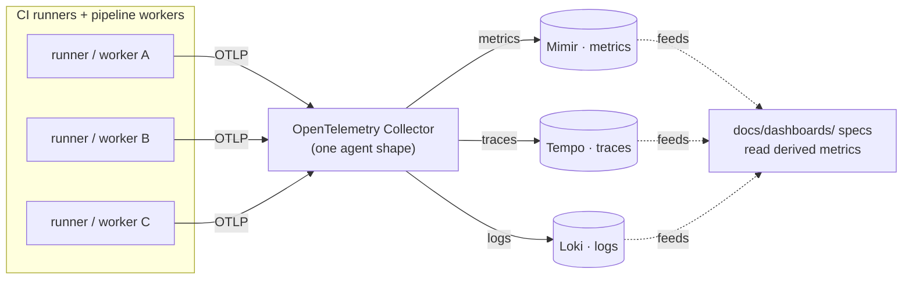

<!-- [KFM_META_BLOCK_V2]
doc_id: kfm://doc/<uuid-pending>
title: OpenTelemetry Observability Stack — dashboard specification
type: standard
version: v0.1
status: draft
owners: <observability-steward>  # PROPOSED placeholder; resolve before review
created: 2026-05-20
updated: 2026-05-20
policy_label: public
related:
  - docs/dashboards/README.md
  - docs/dashboards/observability/README.md
  - docs/dashboards/DASHBOARD_CATALOG.md
  - docs/dashboards/operational/SLO_LIVE_FEEDS.md
  - docs/standards/TELEMETRY_MINIMUMS.md
  - docs/standards/OPENLINEAGE_FACETS.md
tags: [kfm, dashboards, observability, opentelemetry, tempo, mimir, loki, ci]
notes:
  - "Source card: KFM-P8-PROG-0026 (OpenTelemetry CI observability stack) — UNCHANGED, active."
  - "Card self-check: UNKNOWN — repository implementation status remains unverified."
  - "This is a SPEC for the observability surface, not the running stack."
[/KFM_META_BLOCK_V2] -->

# OpenTelemetry Observability Stack · `observability/OPENTELEMETRY_STACK.md`

> Dashboard specification for KFM's **CI / pipeline observability stack** (Atlas card
> `KFM-P8-PROG-0026`): OpenTelemetry Collector → **Tempo** (traces) + **Mimir** (metrics)
> + **Loki** (logs), with one agent shape across all runners.

**Status:** draft · **Owners:** `<observability-steward>` (PROPOSED) · **Last reviewed:** 2026-05-20

---

> [!IMPORTANT]
> Telemetry is a **carrier**, not truth (`docs/standards/TELEMETRY_MINIMUMS.md`). Traces,
> metrics, and logs help operate KFM; they do not establish trust in data. Release
> evidence still comes from receipts and `EvidenceBundle`s, not from this stack.

---

## 1. Description

This spec describes the observability stack that the other dashboards in
`docs/dashboards/` read from. It standardizes CI and pipeline observability on a single
agent shape — the **OpenTelemetry Collector** — fanning out to three backends:

- **Tempo** — distributed traces (pipeline runs, connector fetches, validation passes).
- **Mimir** — long-retention metrics (SLOs, freshness, validation rates).
- **Loki** — structured logs.

"One agent shape across runners" means every CI runner and pipeline worker emits OTLP to
the same collector configuration, so dashboards do not need per-runner special cases.

## 2. Stack components

| Component | Role | Healthy posture (PROPOSED) | Negative state |
|---|---|---|---|
| OpenTelemetry Collector | Single OTLP ingest + fan-out agent across all runners. | Reachable; no dropped spans/metrics. | `OTEL_COLLECTOR_DOWN` |
| Tempo | Trace backend. | Traces queryable within retention. | `TRACE_BACKEND_UNAVAILABLE` |
| Mimir | Metrics backend. | Metrics queryable within retention. | `METRICS_BACKEND_UNAVAILABLE` |
| Loki | Log backend. | Logs queryable within retention. | `LOG_BACKEND_UNAVAILABLE` |

## 3. Stack health panels (PROPOSED)

- **Collector health** — ingest rate, dropped spans/metrics/logs, queue depth.
- **Backend availability** — Tempo / Mimir / Loki up + query latency.
- **Runner coverage** — % of CI runners and pipeline workers emitting OTLP.
- **Retention** — oldest queryable trace / metric / log per backend.
- **Telemetry minimums** — conformance to `docs/standards/TELEMETRY_MINIMUMS.md`.

## 4. Architecture (PROPOSED)

## 5. Inputs

Mounted-repo / infra state NEEDS VERIFICATION.

- OTLP exports from CI runners and pipeline workers (`infra/`, `connectors/`, `pipelines/`).
- Collector configuration — the single shared agent shape.
- `docs/standards/TELEMETRY_MINIMUMS.md` — the conformance baseline.

## 6. Files

| Path | Role | spec_hash |
|---|---|---|
| `docs/dashboards/observability/OPENTELEMETRY_STACK.md` | This stack specification. | PROPOSED — pending JCS+SHA-256 |
| Running stack (PROPOSED) | Tempo · Mimir · Loki deployment, collector config. | NEEDS VERIFICATION |

## 7. Ownership and review burden

- **Owning steward (PROPOSED):** Observability steward.
- **Review burden:** docs steward + observability steward + release steward (telemetry
  gates release per `TELEMETRY_MINIMUMS.md`). Resolve the placeholder against
  Atlas v1.1 §24.7 before review.

## 8. Acceptance

- [ ] All four stack components described with healthy posture + negative state.
- [ ] One agent shape (single collector config) is documented across runners.
- [ ] Owner named (no anonymous spec at v1).
- [ ] Link check passes; row present in [`DASHBOARD_CATALOG.md`](../DASHBOARD_CATALOG.md).
- [ ] Cross-link to `docs/standards/TELEMETRY_MINIMUMS.md` resolves.

## 9. Open questions

- [ ] **OTEL-OQ-01** — Confirm the deployment home (`infra/`) and downgrade if unverified.
- [ ] **OTEL-OQ-02** — Confirm retention windows per backend (Tempo / Mimir / Loki).
- [ ] **OTEL-OQ-03** — Confirm whether dashboards query backends directly or via a
      Grafana-equivalent surface.
- [ ] **OTEL-OQ-04** — Confirm `KFM-P8-PROG-0026` implementation status against
      mounted-repo state (card self-check: UNKNOWN).

---

**Related docs:** [observability/README.md](README.md) · [dashboards/README.md](../README.md) · [DASHBOARD_CATALOG.md](../DASHBOARD_CATALOG.md) ·
[operational/SLO_LIVE_FEEDS.md](../operational/SLO_LIVE_FEEDS.md) ·
[standards/TELEMETRY_MINIMUMS.md](../../standards/TELEMETRY_MINIMUMS.md)

**Last updated:** 2026-05-20 · **Edition:** v0.1 (draft) · **Owners:** `<observability-steward>` (PROPOSED)
