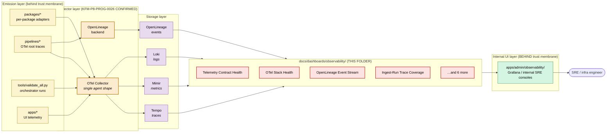

<!-- [KFM_META_BLOCK_V2]
doc_id: kfm://doc/dashboards-observability-readme
title: Observability Dashboards (PROPOSED lane; system-health scope, behind the trust membrane)
type: standard
version: v1
status: draft
owners: OWNER_TBD  # NEEDS VERIFICATION: docs steward + observability steward + infra owner
created: 2026-05-25
updated: 2026-05-25
policy_label: internal  # NOTE: observability dashboards sit BEHIND the trust membrane; not normally public
related:
  - kfm://doc/directory-rules                                # CONFIRMED: docs/doctrine/directory-rules.md
  - kfm://doc/atlas-v1-1                                     # PROPOSED: docs/atlases/KFM_Domains_Culmination_Atlas_v1_1.pdf (§24.6, §24.10, §24.11)
  - kfm://doc/dashboards-domain-readme                       # CONFIRMED authored sibling
  - kfm://doc/dashboards-governance-readme                   # CONFIRMED authored sibling
  - kfm://doc/standard-openlineage                           # PROPOSED: docs/standards/OPENLINEAGE.md (OPEN-DR-05)
  - kfm://doc/standard-opentelemetry                         # PROPOSED: docs/standards/OPENTELEMETRY.md (new candidate; OPEN-DASH-OBS-08)
  - kfm://adr/dashboards-lane-existence                      # PROPOSED candidate: OPEN-DASH-01
tags: [kfm, dashboards, observability, telemetry, opentelemetry, openlineage, runtime, system-health, readme]
notes:
  - This README sits at a PROPOSED lane (`docs/dashboards/`). The lane is not in the Directory Rules §6.1 `docs/` tree.
  - This file scopes to SYSTEM-HEALTH observability dashboards — runtime, telemetry, service, storage, resource, and UI-telemetry posture. NOT doctrine-compliance (that's `governance/`).
  - policy_label is `internal` (not `public`) — observability dashboards sit BEHIND the trust membrane.
  - Sensitive-content leakage in traces/logs (PII, archaeology coords, DNA, person-parcel joins) is a primary concern of this lane — see §10.
  - Specifications only; implementations live in `apps/`; signal emission lives in `runtime/observability/`.
  - Whether `docs/dashboards/` should exist as a lane is ADR-class. Logged as OPEN-DASH-01.
[/KFM_META_BLOCK_V2] -->

# Observability Dashboards

<!-- [doc: kfm://doc/dashboards-observability-readme] -->
<a id="top"></a>

> **System-health dashboard specifications** — distributed traces, lineage events, service uptime, validator-orchestrator health, tile-cache diagnostics, build/CI conformance, resource footprint. These dashboards live **behind the trust membrane**; they are for engineers and SREs, not reviewers or the public. **Specifications only.**

<p>
  
  
  
  
  
  
  
  
</p>

> [!CAUTION]
> **Sensitive-content leakage risk.** Distributed traces, structured logs, and lineage events can carry PII, archaeology coordinates, DNA fields, person-parcel join keys, and other T4-sensitive content if not redacted at emission time. The Atlas §24.10 risk register notes *"Inference risk grows with cross-lane joins."* Observability is **not** an exception to sensitivity-tier rules — it is one of the more dangerous surfaces, because operators tend to look at raw traces. See §10 for the sensitive-content posture.

> [!IMPORTANT]
> **Truth posture.** The OpenTelemetry CI observability stack (Collector + Tempo + Mimir + Loki) is **CONFIRMED in the corpus** (KFM-P8-PROG-0026, Pass 32 baseline). The dashboards specified in this folder are PROPOSED — they implement that stack's surfacing. The lane (`docs/dashboards/`) itself is PROPOSED per OPEN-DASH-01. Whether any spec listed here is actually instrumented in the mounted repo is NEEDS VERIFICATION.

> [!NOTE]
> **Anti-collapse rule.** Observability dashboards visualize runtime signals; they are not the runtime, the receipts, the policy decisions, or the evidence bundles. A green dashboard is not proof of governance — it is proof that the *plumbing* is working. Governance posture lives in `governance/`; system-health posture lives here.

---

## Contents

1. [Scope](#1-scope)
2. [Repo fit](#2-repo-fit)
3. [Accepted inputs](#3-accepted-inputs)
4. [Exclusions](#4-exclusions)
5. [Dashboard inventory](#5-dashboard-inventory)
6. [Specification template](#6-specification-template)
7. [Integration with `runtime/`, standards, registers, and `apps/`](#7-integration-with-runtime-standards-registers-and-apps)
8. [Signal-flow diagram](#8-signal-flow-diagram)
9. [Relationship to other dashboard siblings](#9-relationship-to-other-dashboard-siblings)
10. [Sensitive-content posture](#10-sensitive-content-posture)
11. [Public-exposure rule](#11-public-exposure-rule)
12. [Verification checklist](#12-verification-checklist)
13. [Maintenance task list](#13-maintenance-task-list)
14. [Open questions & ADR cross-reference](#14-open-questions--adr-cross-reference)
15. [Evidence basis & citations](#15-evidence-basis--citations)

---

## 1. Scope

This folder hosts **system-health observability dashboard specifications** — operational views that show whether KFM's runtime infrastructure is functioning. Each spec describes:

- which **operational signal** the dashboard surfaces (OTel trace, OpenLineage event, log stream, metric series);
- the **healthy posture** at the infrastructure scale (latency percentile, uptime, throughput, error rate, conformance %);
- which **runtime adapter, validator, or external system** emits the signal;
- the **sensitive-content posture** (redaction at emission, sampling rate, T4-restriction policy);
- who **owns** the dashboard (observability steward + infra owner, plus sensitivity reviewer when T4 data may appear);
- where the **implementation** lives (`apps/admin/`, internal SRE consoles, Grafana stacks, etc.).

The specs are read-only references for implementers. The signals live in `runtime/observability/` (PROPOSED path), the OpenTelemetry Collector pipeline, OpenLineage event stream, and per-package telemetry adapters. The dashboards render in internal consoles, not on the public path.

> [!TIP]
> **Four-folder mental model.** `governance/` = doctrine-compliance posture (reviewers/stewards). `domain/` = per-domain instance posture (domain stewards). `release/` (PROPOSED sibling) = per-release lifecycle posture (release authority). **`observability/` = system-health infrastructure posture (engineers/SREs)**. Same indicators may appear in multiple folders at different aggregation scopes — that is not redefinition.

[↑ back to top](#top)

---

## 2. Repo fit

```text
docs/
└── dashboards/                       # PROPOSED lane (Directory Rules §6.1 does not list this)
    ├── README.md                     # PROPOSED parent README
    ├── domain/                       # CONFIRMED authored sibling
    │   └── README.md
    ├── governance/                   # CONFIRMED authored sibling
    │   └── README.md
    ├── observability/                # THIS FOLDER — system-health dashboards
    │   ├── README.md                 # THIS FILE
    │   ├── telemetry-contract-health.md       # ⏳ KFM-P20-FEAT-0007
    │   ├── opentelemetry-stack.md             # ⏳ KFM-P8-PROG-0026
    │   ├── openlineage-event-stream.md        # ⏳ C1-05 (Pass 10) + P15-PROG-0006
    │   ├── ingest-run-trace-coverage.md       # ⏳ KFM-P13-PROG-0005 + P15-PROG-0006
    │   ├── service-uptime-latency.md          # ⏳ governed-API SLOs
    │   ├── validator-orchestrator-health.md   # ⏳ tools/validate_all.py
    │   ├── pmtiles-range-diagnostics.md       # ⏳ KFM-P32-FEAT-0013
    │   ├── build-ci-health.md                 # ⏳ CI workflow telemetry
    │   ├── focus-overlay-telemetry.md         # ⏳ KFM-P29-PROG-0023
    │   ├── energy-carbon-footprint.md         # ⏳ P20-FEAT-0007 dependency
    │   └── …                                  # ⏳ remaining specs (§5)
    └── release/                      # PROPOSED sibling
```

**Upstream authorities.**

| Upstream | Relationship |
|:---|:---|
| `runtime/observability/` *(PROPOSED path; NEEDS VERIFICATION)* | Source of telemetry emission — adapters that wire packages to the OTel Collector / OpenLineage backend. |
| `docs/standards/OPENLINEAGE.md` *(PROPOSED, per OPEN-DR-05)* | External-standard anchor for lineage event facets. |
| `docs/standards/OPENTELEMETRY.md` *(PROPOSED; new candidate per OPEN-DASH-OBS-08)* | External-standard anchor for trace/metric/log shape. |
| `docs/atlases/KFM_Domains_Culmination_Atlas_v1_1.pdf` §24.10 (Risk Register) | Source of sensitive-content / inference-risk warnings that govern §10. |
| `docs/atlases/KFM_Domains_Culmination_Atlas_v1_1.pdf` §24.5 (Sensitivity Tiers) | T4-default rules that govern sensitive-trace handling. |
| `docs/atlases/KFM_Domains_Culmination_Atlas_v1_1.pdf` §24.6 (Pipeline Gates) | Source of gate vocabulary for ingest-run trace span naming. |
| Pass 23/32 cards (P8-PROG-0026, P20-FEAT-0007, P13-PROG-0005, P15-PROG-0006, P29-PROG-0023, P32-FEAT-0013) | Source of specific dashboard concepts (§5). |
| `docs/doctrine/directory-rules.md` | Places `docs/` lanes; this one is not yet placed. See §14 OPEN-DASH-01. |

**Downstream consumers.**

| Downstream | Relationship |
|:---|:---|
| `apps/admin/`, internal SRE consoles, Grafana / Tempo / Mimir / Loki UIs | **Implementations.** Each spec points to its implementation home — internal-only. |
| `runtime/observability/` | The signal-emission code itself; dashboards visualize what it emits. |
| `tools/validate_all.py` *(CONFIRMED live per directory-rules.md §7.5.a)* | Source of validator-orchestrator signals. |
| `policy/` *(OPA / Conftest rules)* | Enforces minimum telemetry per Pass 10 C5-06 (Observability as Code via OPA). |
| `docs/dashboards/governance/` | **Reciprocal** — when a governance indicator turns red because of a missing signal, the observability dashboard for that signal tells the operator why. |

[↑ back to top](#top)

---

## 3. Accepted inputs

Files that belong here:

- **One `<dashboard-name>.md` file per spec** in §5.
- **This README** (`README.md`).
- Optional `<dashboard>/figures/` sub-folder for separately-versioned diagrams.

Each spec MUST:

- declare the **Pass card or external-standard** it instances (e.g. KFM-P20-FEAT-0007 + `docs/standards/OPENTELEMETRY.md`);
- declare the **signal source** with a runtime path or external system reference;
- declare the **healthy posture** in operational terms (p95 latency, uptime %, error rate, throughput, conformance %);
- declare the **sensitive-content posture** (redaction policy, sampling rate, T4 restriction) — required, not optional;
- name **owners** (observability steward + infra owner + sensitivity reviewer where T4 may appear);
- point to its **implementation home** in an internal-only console, or note `UNKNOWN`;
- mark **public-exposure policy** explicitly (default: internal; documented exceptions only).

[↑ back to top](#top)

---

## 4. Exclusions

| ❌ Do not put here | ✅ Belongs in |
|:---|:---|
| **Doctrine-compliance dashboards** (EvidenceRef resolution rate, ABSTAIN distribution, cite-or-abstain compliance) | `docs/dashboards/governance/` *(§24.11 indicators)* |
| **Per-domain instance views** of operational signals | `docs/dashboards/domain/<domain>.md` |
| **Release-lifecycle views** (per-release manifests, rollback timelines as the primary subject) | `docs/dashboards/release/` (PROPOSED sibling) |
| Telemetry emission code (OTel SDK config, span instrumentation) | `runtime/observability/` or per-package adapters |
| OpenLineage facet definitions | `docs/standards/OPENLINEAGE.md` |
| OpenTelemetry config bundles | `runtime/observability/otel-collector/` *(PROPOSED)* or `configs/` |
| Public-facing service-status pages | `apps/<public-shell>/status/` — NEVER mirrored here |
| Raw traces, logs, or PII | Live telemetry stores; **never** stored as files in `docs/` |
| Sensitive-domain raw data (archaeology coordinates, DNA, living-person fields) | NEVER stored anywhere; see §10 |
| Dashboard implementations (React, Grafana JSON, chart configs) | `apps/<dashboard-app>/` or external dashboard repositories |
| Validator code | `tools/validators/` or `tests/` |
| Policy bundles enforcing telemetry minimums | `policy/observability/` *(PROPOSED)* — Pass 10 C5-06 |

> [!WARNING]
> **Raw-data watch.** Observability dashboards visualize *signals*; they do not store *data*. If a spec begins to enumerate trace payloads, log entries, or telemetry samples, that's a sign the dashboard has crossed from "spec" to "data mirror" — and may have crossed sensitive-content boundaries in the process.

[↑ back to top](#top)

---

## 5. Dashboard inventory

Organized by signal-source category. Pass-card and standards anchors confirmed against the consolidated corpus.

### 5.1 Telemetry contract & stack (3)

| Title | File | Source anchor | Status |
|:---|:---|:---|:---:|
| Telemetry Contract Health | `telemetry-contract-health.md` | **KFM-P20-FEAT-0007** *(PROPOSED card)* — daily OTel traces, energy/carbon, required keys, missing fields for last 24h CI runs | ⏳ |
| OpenTelemetry Stack Health | `opentelemetry-stack.md` | **KFM-P8-PROG-0026** *(CONFIRMED in corpus)* — Collector + Tempo (traces) + Mimir (metrics) + Loki (logs); single agent shape | ⏳ |
| OpenLineage Event Stream | `openlineage-event-stream.md` | **C1-05** *(Pass 10, CONFIRMED)* — START/COMPLETE events with facets (job, run, inputs, outputs, spec hash, inputs hash, policy labels, dataset version, quality status, receiptRef) | ⏳ |

### 5.2 Pipeline & ingest (2)

| Title | File | Source anchor | Status |
|:---|:---|:---|:---:|
| Ingest-Run Trace Coverage | `ingest-run-trace-coverage.md` | **KFM-P13-PROG-0005** + **KFM-P15-PROG-0006** *(both PROPOSED)* — root trace with fetch / transform / policy / signing / publication spans; trace_id in receipts, ai_receipt, logs, attestations | ⏳ |
| Validator Orchestrator Health | `validator-orchestrator-health.md` | `tools/validate_all.py` *(CONFIRMED live; directory-rules.md §7.5.a)* — run frequency, exit-code distribution (0 = pass, 1 = fail, 2 = system error), p95 wallclock | ⏳ |

### 5.3 Service & storage (3)

| Title | File | Source anchor | Status |
|:---|:---|:---|:---:|
| Service Uptime & Latency | `service-uptime-latency.md` | Governed-API SLO; relates to operating-law invariant 1 *(public clients use governed interfaces)* | ⏳ |
| PMTiles Range Diagnostics | `pmtiles-range-diagnostics.md` | **KFM-P32-FEAT-0013** *(PROPOSED card)* — tile request range coverage, cache hit rate, byte-range failure rate | ⏳ |
| Build & CI Health | `build-ci-health.md` | **KFM-P8-PROG-0026** workflow-side rollup — runner conformance, agent-shape uniformity, sampling-rate compliance | ⏳ |

### 5.4 Resource & UI (2)

| Title | File | Source anchor | Status |
|:---|:---|:---|:---:|
| Energy / Carbon Footprint | `energy-carbon-footprint.md` | **KFM-P20-FEAT-0007** dependency — per-run energy & carbon telemetry; rollup view (OPEN-DASH-OBS-07 may merge with telemetry-contract-health) | ⏳ |
| Focus Overlay Telemetry Conformance | `focus-overlay-telemetry.md` | **KFM-P29-PROG-0023** *(PROPOSED card)* — Focus Mode UI overlay telemetry contract conformance (timeline + contextual panel sync) | ⏳ |

### 5.5 Status legend

| Symbol | Meaning |
|:---:|:---|
| ✅ | Authored in this folder. |
| ⏳ | Proposed; not yet authored. |
| 🛠️ | In progress. |
| 🚫 | Withdrawn. |
| 🔄 | Superseded. |

**Total candidate dashboards: 10** (3 telemetry-contract + 2 pipeline + 3 service/storage + 2 resource/UI). OPEN-DASH-OBS-07 flags energy/carbon as a possible merger with telemetry-contract-health, which would reduce to 9.

[↑ back to top](#top)

---

## 6. Specification template

Each spec file follows the skeleton below — adapted from the `governance/` template with sensitive-content and public-exposure fields added.

```markdown
<!-- KFM_META_BLOCK_V2 with type: standard, policy_label: internal, related: standards refs -->

# <Dashboard Title>

> One-line scope statement.

[badges: status, lane=PROPOSED, audience=SRE, sensitivity-class, public-exposure=internal]

> [!CAUTION]
> Sensitive-content posture: <T0–T4 declaration>; redaction rule: <e.g., "trace bodies redacted at emission for archaeology lane">; sampling rate: <e.g., "0.1% for T4 spans">.

## 1. Scope
- Source anchor (Pass card ID or external standard)
- Audience (SRE / infra owner / observability steward)
- Aggregation scope (whole stack vs per-service vs per-package)

## 2. Signals
Table: each signal, what it carries, healthy posture, emitting adapter.

| Signal | What it carries | Healthy posture | Emitting adapter / path |
|:---|:---|:---|:---|
| ingest-run root trace | fetch/transform/policy/signing/publication spans | p95 < 30s for fetch span; trace_id present in 100% of run_manifests | `runtime/observability/otel-pipeline/` |
| …                              | …                              | …                              | …                              |

## 3. Sensitive-content posture
- Sensitivity tier of signals: <T0/T1/T2/T3/T4>
- Redaction-at-emission rules
- Sampling policy for sensitive spans
- Trace-body retention window
- Access control on dashboard

## 4. Public-exposure policy
- Default: INTERNAL (not on public path)
- Documented exceptions (e.g., public service-status page derived from this dashboard)
- Aggregation/redaction applied if any signal is surfaced publicly

## 5. Ownership
- Observability steward: <name or OWNER_TBD>
- Infra owner: <name or OWNER_TBD>
- Sensitivity reviewer (if T2+): <name or OWNER_TBD>
- Implementation owner: <SRE team or OWNER_TBD>

## 6. Implementation pointer
- Dashboard UI: `apps/admin/observability/<path>/` or external (Grafana / Tempo / Loki / Mimir URL pattern)
- Telemetry source: `runtime/observability/<adapter>/`
- Standards: `docs/standards/OPENTELEMETRY.md`, `docs/standards/OPENLINEAGE.md`
- Policy bundles: `policy/observability/<bundle>/` *(per Pass 10 C5-06)*

## 7. Cross-links
- Governance dashboard(s) consuming this signal: `docs/dashboards/governance/<file>.md`
- Per-domain breakdown (if any): `docs/dashboards/domain/<domain>.md`
- Release-lifecycle view (if any): `docs/dashboards/release/<file>.md`

## 8. Review cadence
How often the spec is reviewed; trigger events (OTel SDK version bump, policy bundle change, sensitive-tier reclassification).

## 9. Open questions
Local `OPEN-DASH-OBS-<scope>-NN` items if any.

## 10. Evidence basis & citations
Standard source ledger.

<sub>Anti-collapse footer + sensitive-content reminder.</sub>
```

> [!TIP]
> Sections 3 (sensitive-content) and 4 (public-exposure) are **non-optional** for this folder — every observability dashboard must declare them, even if the answer is "T0, no redaction needed, public summary OK." Default-deny applies if the section is missing.

[↑ back to top](#top)

---

## 7. Integration with `runtime/`, standards, registers, and `apps/`

Each observability dashboard spec is a **five-way bridge** (one more than `governance/`):

| Direction | What it consumes | What it produces |
|:---|:---|:---|
| **Up to Pass-card / standards** | Pass-card definitions and external-standard contracts (OpenTelemetry, OpenLineage). | A statement of *which* operational concept this dashboard renders and *which* standard it conforms to. |
| **Sideways to `docs/registers/`** | The drift register for telemetry contract violations; verification backlog for unverified instrumentation. | Visualization pointers — *"this dashboard surfaces conformance drift; entries logged to DRIFT_REGISTER."* |
| **Down to `runtime/`, `tools/`, `policy/`** | The actual emission adapters and policy enforcement (Pass 10 C5-06). | The implementation pointer (§6 of template) — tells the implementer which adapter, SDK, agent, and policy bundle to wire up. |
| **Across to other dashboard siblings** | Governance dashboards rely on observability signals; observability dashboards expose the raw signals. | Reciprocal cross-references (§9). |
| **Through the trust membrane** | Internal-only signals (logs, traces, lineage facets). | An internal-only rendering; no public path unless explicitly redacted. |

### 7.1 Conflict resolution

| Conflict | Winner |
|:---|:---|
| Observability spec vs Pass-card definition | **Pass card wins** at conceptual level; propose card amendment via standard intake process if the spec disagrees. |
| Observability spec vs `docs/standards/OPENTELEMETRY.md` or `OPENLINEAGE.md` | **Standards doc wins.** Specs implement standards; they do not override them. |
| Observability spec vs `runtime/observability/` actual behavior | **Runtime is operational truth**; spec / runtime divergence is drift — log it. |
| Observability spec vs `policy/observability/` rule (Pass 10 C5-06) | **Policy wins.** Telemetry minimums enforced via Rego cannot be relaxed by a dashboard spec. |
| Observability spec vs `governance/<24.11-subsection>.md` for same signal | **Equal weight — different audience.** Governance shows whether the signal *means* what doctrine requires; observability shows whether the signal *exists* and *is healthy*. Reconcile, don't override. |
| Observability spec vs sensitive-content rule (Atlas §24.5) | **Sensitivity rule wins.** Always. No exceptions. |

> [!IMPORTANT]
> Specs **describe**; standards **define shape**; policy **enforces minima**; runtime **emits**; registers **record**; implementations **render**. The trust membrane runs through all of these — observability does not exempt anyone from sensitivity rules.

[↑ back to top](#top)

---

## 8. Signal-flow diagram



*Emission (yellow) feeds the OTel Collector / OpenLineage backend (orange, CONFIRMED stack per KFM-P8-PROG-0026), which writes to storage (purple). Dashboard specs in this folder (red) point to internal UI renderings (green). The trust membrane sits between specs and the public path — no arrow crosses it in this folder.*

[↑ back to top](#top)

---

## 9. Relationship to other dashboard siblings

Four sibling folders, four scopes:

| Folder | Aggregation | Audience | Trust-membrane side | Policy label |
|:---|:---|:---|:---|:---:|
| `governance/` | System-wide doctrine posture | Reviewer / steward | In front (public-safe) | `public` |
| `domain/` | Per-domain instance | Domain steward + reviewer | In front (public-safe with care) | `public` |
| `release/` *(PROPOSED)* | Per-release lifecycle | Release authority | Mixed — release notes public, raw release telemetry internal | mixed |
| **`observability/` (this folder)** | **System-health infrastructure** | **SRE / infra / observability steward** | **Behind (internal-only by default)** | **`internal`** |

> [!TIP]
> **The same indicator can appear in `governance/` and `observability/` at different levels.** "EvidenceRef resolution rate" in `governance/evidence-and-source.md` shows the **doctrine-compliance** view (the count, the trend, whether it exceeds 99.9%). The same metric in `observability/service-uptime-latency.md` shows the **infrastructure** view (per-endpoint, per-region, error decomposition, p95 latency of the resolver itself). Same signal, different rendering for a different reader.

### 9.1 Reciprocal linking rule

Each observability spec lists the **governance** and **domain** specs that consume its signals; each consuming spec links back to the observability spec for plumbing detail. The observability spec is the **definitive technical reference** for the signal source; the governance spec is the **definitive doctrinal reference** for the indicator's meaning.

[↑ back to top](#top)

---

## 10. Sensitive-content posture

Observability is the most leakage-prone surface in KFM, because operators tend to look at raw traces and logs. The Atlas §24.10 risk register flags this directly: *cross-lane joins compound inference risk*. **Sensitivity rules are not relaxed for observability — they are tightened.**

### 10.1 Default-deny rules

| Data type | Trace handling | Log handling | Metric handling | Dashboard handling |
|:---|:---|:---|:---|:---|
| **T0 public** | Allowed | Allowed | Allowed | Allowed |
| **T1 internal** | Allowed | Allowed with structured-field policy | Allowed | Internal-only |
| **T2 restricted** | Span body redacted at emission | Field-level redaction | Allowed | Internal-only + access log |
| **T3 sensitive** | Span body **omitted**; only span shape retained | Logs disabled; emit redaction receipt | Aggregate-only (minimum-cell suppression) | Restricted access; named-reviewer-only |
| **T4 default-deny** | Spans **suppressed** (only count survives) | No logs emitted; emit redaction receipt | Aggregate-only with k-anonymity ≥ 5 | **Separate dashboard** with explicit sensitive-content reviewer; never combined with T0–T2 |

### 10.2 Specific high-risk signals

| Signal | Risk | Rule |
|:---|:---|:---|
| Archaeology coordinates in ingest-run trace span attributes | High inference risk *(Atlas §24.10)* | Strip from span attributes at emission; emit `RedactionReceipt` per signing posture |
| Living-person fields in OpenLineage `inputs`/`outputs` facets | T4 default-deny | Replace with content-addressed digest; never name |
| DNA / genomic data in trace attributes | T4 default-deny | Suppress span entirely; emit only count metric |
| Person-parcel join keys | High inference risk *(Atlas §24.10 cross-lane joins)* | k-anonymity ≥ 5 at metric aggregation; deny dashboard surfacing if cell count < 5 |
| Rare-species coordinates *(fauna / flora T4)* | High inference risk | Strip from span attributes; bucket coordinates at county-scale or coarser; deny per-point surfacing |
| Critical-infrastructure precise location *(settlements-infrastructure T4)* | High inference risk | Same as rare-species |

### 10.3 Sensitive-content reviewer

For any spec carrying T2 or higher signals, the sensitivity reviewer named in Atlas §24.7 (Reviewer / SoD Matrix) **must** be on the PR review chain. Default-deny if the reviewer slot is unfilled.

> [!CAUTION]
> **No "operations exception."** It is tempting to argue "operators need raw data to debug incidents." The doctrine is unambiguous: sensitive content does not enter traces, logs, or metrics in raw form. If an incident genuinely requires raw data inspection, that inspection happens in a controlled environment with named reviewers and an audit receipt — not from a dashboard.

[↑ back to top](#top)

---

## 11. Public-exposure rule

| Question | Default | Exception path |
|:---|:---|:---|
| Can this dashboard be linked from a public KFM page? | **No.** Default is internal-only. | Documented exception with redaction summary and sensitivity-reviewer sign-off. |
| Can a derived public service-status page summarize this dashboard? | Only with explicit redaction. | Must declare exactly which signals are summarized and at what aggregation. |
| Can the dashboard URL appear in a public AIReceipt or PolicyDecision? | No. | None. |
| Can dashboard screenshots be included in public documentation? | No. | Only schematic / structural illustrations, never with real data. |
| Can SREs share dashboard links in public channels (Slack, GitHub Issues)? | No for T2+; per-team for T0–T1. | Documented per-team norm in the SRE runbook. |

Per the operating-law invariant *"Public clients and normal UI surfaces use governed interfaces, not canonical/internal stores,"* observability dashboards are **canonical/internal** — they do not become a public surface by default.

[↑ back to top](#top)

---

## 12. Verification checklist

Apply before merging a new observability dashboard spec or treating this folder as canonical.

- [ ] Confirm target path `docs/dashboards/observability/<dashboard>.md` resolves under an accepted lane (OPEN-DASH-01).
- [ ] Confirm the spec names a **Pass-card ID or external standard** as its anchor.
- [ ] Confirm §3 (sensitive-content posture) and §4 (public-exposure policy) of the template are **populated, not left blank**.
- [ ] Confirm sensitivity tier declaration matches Atlas §24.5 chapter file (e.g., archaeology trace handling matches T4 defaults).
- [ ] Confirm sensitivity reviewer named when T2+ signals appear.
- [ ] Confirm the spec **references** (never mirrors) standards docs in `docs/standards/`.
- [ ] Confirm `runtime/observability/` adapter path resolves or is marked `NEEDS VERIFICATION`.
- [ ] Confirm `policy/observability/` bundles referenced exist or are marked `NEEDS VERIFICATION` (Pass 10 C5-06).
- [ ] Confirm implementation pointer is internal-only or has explicit public-exposure exception documented.
- [ ] Confirm cross-references to consuming governance and domain specs are reciprocal.
- [ ] Confirm no spec stores raw telemetry payloads, sensitive coordinates, PII, or DNA fields.
- [ ] Confirm no spec relaxes a sensitivity rule via "operations exception" framing.

[↑ back to top](#top)

---

## 13. Maintenance task list

Gates / definition-of-done for keeping the folder healthy.

- [ ] **Inventory sync.** §5 status columns reflect actual files in this folder.
- [ ] **Standards sync.** When `docs/standards/OPENTELEMETRY.md` or `OPENLINEAGE.md` updates, every spec referencing them is reviewed.
- [ ] **Pass-card sync.** When source Pass cards (P8-PROG-0026, P20-FEAT-0007, P13-PROG-0005, P15-PROG-0006, P29-PROG-0023, P32-FEAT-0013) update, specs review the cross-reference.
- [ ] **Runtime sync.** When `runtime/observability/` adapters change, the spec's signal-source pointer is verified.
- [ ] **Policy sync.** When `policy/observability/` bundles (Pass 10 C5-06) change minimum-telemetry rules, every spec is reviewed.
- [ ] **Sensitive-content audit.** Periodic check that no spec has drifted into raw-data mirroring; no T2+ signal is surfaced without sensitivity-reviewer sign-off.
- [ ] **Public-exposure audit.** Periodic check that no public KFM page references an observability dashboard URL without documented exception.
- [ ] **Reciprocal-link integrity.** Each observability spec's consuming-dashboard list matches the consuming specs' source-signal lists.
- [ ] **Stack-version sync.** When the OTel Collector / Tempo / Mimir / Loki versions change (KFM-P8-PROG-0026 stack), specs review for shape compatibility.
- [ ] **Parallel-authority watch.** This folder does not grow non-spec content (no adapters, no policy bundles, no telemetry samples).
- [ ] **Owner roster updated.** Meta-block `owners:` reflects current observability steward + infra owner + sensitivity reviewer.

[↑ back to top](#top)

---

## 14. Open questions & ADR cross-reference

| # | Question | Class | Cross-reference |
|:---|:---|:---|:---|
| **OPEN-DASH-01** | Should `docs/dashboards/` exist as a lane? *(inherited from siblings)* | ADR-class | Directory Rules §2.4(5); §6.1; parallels OPEN-BLOG-01. |
| **OPEN-DASH-OBS-01** | Should this content live in `docs/architecture/observability/` instead of `docs/dashboards/observability/`? Observability is infrastructure architecture, not just a dashboard category. | Placement class | Directory Rules §6.1 (`docs/architecture/` lane). |
| **OPEN-DASH-OBS-02** | Where do **hybrid indicators** (signals that carry both doctrinal meaning *and* infrastructure-health meaning, e.g., EvidenceRef resolution rate) live — `governance/`, `observability/`, or both with explicit reciprocal cross-links? | Scoping class | §9 currently says both with reciprocal cross-links; needs ratification. |
| **OPEN-DASH-OBS-03** | What is the canonical rule for **sensitive-content redaction at emission time**? Per-package adapter responsibility, central OTel processor, or both? | Sensitivity class | Relates to Atlas §24.5 (sensitivity tiers); Pass 10 C5-06 (Observability as Code via OPA). |
| **OPEN-DASH-OBS-04** | Where do **trace IDs and lineage IDs** link out to from dashboards — internal Tempo UI, internal OpenLineage UI (Marquez/OpenMetadata), or a custom KFM admin console? | UI class | Relates to apps/admin/ existence (NEEDS VERIFICATION) and external tool selection. |
| **OPEN-DASH-OBS-05** | Should there be a **public service-status page** derived from a subset of these dashboards (e.g., governed-API uptime), or is public surfacing forbidden? | Exposure class | §11 currently says only with explicit redaction; needs sensitivity-reviewer ratification. |
| **OPEN-DASH-OBS-06** | When KFM-P20-FEAT-0007 flags **"missing required keys,"** where is the **telemetry contract schema-of-record**? `schemas/contracts/v1/telemetry/`, `docs/standards/OPENTELEMETRY.md`, or `policy/observability/` Rego rules? | Schema-home class | Relates to ADR-S-01 (schema home) and Pass 10 C5-06 telemetry-minimums-as-Rego. |
| **OPEN-DASH-OBS-07** | Should **energy/carbon telemetry** be a first-class dashboard (`energy-carbon-footprint.md`) or a sub-panel of `telemetry-contract-health.md`? P20-FEAT-0007 bundles them. | Granularity class | Reduces inventory by 1 if merged. |
| **OPEN-DASH-OBS-08** | Should `docs/standards/OPENTELEMETRY.md` be authored as a new standards doc? OPEN-DR-05 lists `OPENLINEAGE.md` as a candidate but not `OPENTELEMETRY.md` — yet KFM-P8-PROG-0026 makes OTel CONFIRMED in the corpus. | Standards class | Relates to Directory Rules §18 OPEN-DR-05 (standards backlog). |
| **OPEN-DASH-OBS-09** | The KFM-P8-PROG-0026 stack choice (Tempo / Mimir / Loki / OTel Collector) is **CONFIRMED in the corpus** but does it belong in a dashboard spec or in `docs/architecture/observability-stack.md` as architectural doctrine? | Doctrine class | Relates to Directory Rules §6.1 (`docs/architecture/`) and pattern continuity with maplibre-3d.md doctrine. |

[↑ back to top](#top)

---

## 15. Evidence basis & citations

<details>
<summary><strong>Source ledger</strong></summary>

| Source | Status | Supports | Limits |
|:---|:---|:---|:---|
| **KFM-P8-PROG-0026** — OpenTelemetry CI observability stack (Pass 32 baseline) | **CONFIRMED** in corpus | §5.1 OpenTelemetry Stack Health; §8 collector layer (Tempo + Mimir + Loki); §13 stack-version sync. | Implementation maturity in mounted repo NEEDS VERIFICATION. |
| **KFM-P20-FEAT-0007** — Telemetry contract health dashboard | PROPOSED in corpus | §5.1 Telemetry Contract Health; §5.4 Energy/Carbon Footprint dependency; OPEN-DASH-OBS-07. | Card statement is PROPOSED. |
| **KFM-P13-PROG-0005** — OpenTelemetry ingest-run trace contract | PROPOSED in corpus | §5.2 Ingest-Run Trace Coverage; §6 template span structure (fetch/transform/policy/signing/publication). | Card statement is PROPOSED. |
| **KFM-P15-PROG-0006** — Pipeline OTel root trace, trace_id in receipts | PROPOSED in corpus | §5.2 ingest-run trace coverage; trace-id-as-join-key pattern. | Card statement is PROPOSED. |
| **KFM-P29-PROG-0023** — Focus overlay telemetry schema | PROPOSED in corpus | §5.4 Focus Overlay Telemetry Conformance. | Card statement is PROPOSED. |
| **KFM-P32-FEAT-0013** — PMTiles range diagnostics | PROPOSED in corpus | §5.3 PMTiles Range Diagnostics. | Card statement is PROPOSED. |
| **Pass 10 C1-05** — OpenLineage Events for End-to-End Discovery | **CONFIRMED** in corpus | §5.1 OpenLineage Event Stream; §6 template facet structure (job, run, inputs, outputs, spec hash, inputs hash, policy labels, dataset version, quality status, receiptRef). | Facet vocabulary "still evolving" per source; KFM-specific facets namespaced. |
| **Pass 10 C5-06** — Observability as Code via OPA | **CONFIRMED** in corpus | §2 downstream consumers (policy); §4 exclusions (Rego rules); §7.1 conflict rule (policy wins). | Threshold-tunability concern noted. |
| Atlas v1.1 §24.10 — Risk Register and Threat Posture | CONFIRMED (manuscript) | §10 sensitive-content posture; cross-lane-join risk anchor. | — |
| Atlas v1.1 §24.5 — Sensitivity Tier Reference | CONFIRMED (manuscript; prior-session authored chapter file) | §10 default-deny rules T0–T4; sensitive-content reviewer requirement. | T4 defaults already established in prior-session §24.5 file. |
| Atlas v1.1 §24.6 — Pipeline Gate Reference | CONFIRMED (manuscript; prior-session authored chapter file) | §6 template span vocabulary alignment with gates. | — |
| Atlas v1.1 §24.7 — Reviewer / SoD Matrix | CONFIRMED (manuscript) | §10.3 sensitive-content reviewer requirement. | Per-tier reviewer roster NEEDS VERIFICATION. |
| `docs/doctrine/directory-rules.md` §6.1, §7.5.a, §18 (OPEN-DR-05) | CONFIRMED (prior-session authored) | §2 repo fit; OPEN-DASH-OBS-01; OPEN-DASH-OBS-08; `tools/validate_all.py` CONFIRMED-live anchor. | `docs/dashboards/` not in §6.1. |
| `docs/dashboards/governance/README.md` + `docs/dashboards/domain/README.md` (prior-session authored siblings) | CONFIRMED (prior-session authored) | §9 four-folder mental model; §1 audience differentiation; pattern continuity for §6 template. | — |
| Operating-law invariant 1 *(public clients use governed interfaces, not canonical/internal stores)* | CONFIRMED (KFM operating contract) | §11 public-exposure rule. | — |

</details>

### 15.1 Citation key

| Tag | Refers to |
|:---|:---|
| `[ENCY]` | KFM Encyclopedia |
| `[DIRRULES]` | Directory Rules |
| `[ATLAS]` | KFM Domains Culmination Atlas |
| `[P10]` | KFM Components Pass 10 — Idea Index |
| `[P23-32]` | Pass 23 + Pass 32 Consolidated Atlas |
| `[OTEL]` | OpenTelemetry (external) |
| `[OLINEAGE]` | OpenLineage (external) |

> [!NOTE]
> **Anti-collapse rule (reaffirmed).** An observability dashboard is one carrier of system-health posture; the posture itself rests on the OTel Collector pipeline, the OpenLineage event stream, the runtime adapters, the policy bundles, and the registers. **A green dashboard does not prove that doctrine is being followed — only that the plumbing is functioning.** Doctrine-compliance lives in `governance/`; system-health lives here; the two are reciprocal, not interchangeable.

[↑ back to top](#top)

---

<sub>Observability dashboard specifications. PROPOSED lane (`docs/dashboards/`) pending OPEN-DASH-01 ADR. **Specifications only — implementations live in `apps/admin/` and internal SRE consoles; signal emission lives in `runtime/observability/`; standards live in `docs/standards/OPENTELEMETRY.md` and `OPENLINEAGE.md`.** Behind the trust membrane by default. Sensitivity rules tighten here, not relax.</sub>

