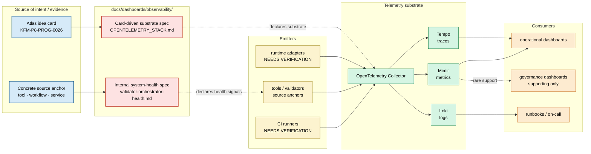

<!-- [KFM_META_BLOCK_V2]
doc_id: kfm://doc/dashboards-observability-readme
title: Observability Dashboard Specifications
type: standard
version: v2
status: draft
owners: OWNER_TBD  # NEEDS VERIFICATION: docs steward + observability steward + validation owner
created: 2026-05-26
updated: 2026-06-12
policy_label: public
related:
  - kfm://doc/dashboards-readme                              # parent: docs/dashboards/README.md
  - kfm://doc/dashboards-indicator-catalog                   # sibling: docs/dashboards/INDICATOR_CATALOG.md
  - kfm://doc/dashboards-dashboard-catalog                   # sibling: docs/dashboards/DASHBOARD_CATALOG.md
  - kfm://doc/dashboards-governance-readme                   # sibling: docs/dashboards/governance/README.md
  - kfm://doc/dashboards-operational-readme                  # sibling: docs/dashboards/operational/README.md
  - kfm://doc/dashboards-observability-opentelemetry-stack   # docs/dashboards/observability/OPENTELEMETRY_STACK.md
  - kfm://doc/dashboards-observability-validator-orchestrator-health
  - kfm://doc/directory-rules
  - kfm://adr/dashboards-lane-existence                      # PROPOSED candidate: OPEN-DASH-01
tags: [kfm, dashboards, observability, otel, tempo, mimir, loki, ci, validators, system-health, readme]
notes:
  - v2 optimizes the lane contract after the addition of internal system-health observability specs.
  - The lane remains PROPOSED pending OPEN-DASH-01; implementation status remains NEEDS VERIFICATION unless separately proven.
  - Observability specs define telemetry substrate and internal health views. They do not establish data trust, governance posture, or operational QC outcomes.
[/KFM_META_BLOCK_V2] -->

# Observability Dashboard Specifications

<!-- [doc: kfm://doc/dashboards-observability-readme] -->
<a id="top"></a>

> Human-facing specifications for KFM observability surfaces: telemetry substrates, CI / pipeline monitoring, and internal system-health views. **This folder specifies; it does not implement.** Running collectors, dashboards-as-code, alert rules, telemetry stores, and adapters live outside `docs/`.

<p>
  
  
  
  
  
  
  
</p>

> [!IMPORTANT]
> **Truth posture.** Observability is a carrier of signals, not the source of truth. Traces, metrics, logs, and dashboard panels can help operate KFM, but they do not replace validators, receipts, manifests, EvidenceBundles, policy decisions, review records, or release artifacts.

> [!CAUTION]
> **Lane status.** `docs/dashboards/observability/` is a **PROPOSED** documentation lane pending `OPEN-DASH-01`. Treat this README as an authoring and review contract, not proof that a running OpenTelemetry stack, Grafana board, alert pipeline, or validator telemetry integration exists.

> [!NOTE]
> **Substrate vs. posture.** Observability specs describe telemetry substrate and internal system health. They are not governance dashboards and not operational QC dashboards. A spec that starts defining cite-or-abstain compliance, feed promotion, artifact reproducibility, or domain release readiness is drifting into another lane.

---

## Contents

1. [Scope](#1-scope)
2. [Repo fit](#2-repo-fit)
3. [Accepted inputs](#3-accepted-inputs)
4. [Exclusions](#4-exclusions)
5. [Spec inventory](#5-spec-inventory)
6. [Spec classes](#6-spec-classes)
7. [Specification templates](#7-specification-templates)
8. [Integration model](#8-integration-model)
9. [Substrate and system-health flow](#9-substrate-and-system-health-flow)
10. [Validation checklist](#10-validation-checklist)
11. [Maintenance task list](#11-maintenance-task-list)
12. [Open questions and ADR cross-reference](#12-open-questions-and-adr-cross-reference)
13. [Evidence basis](#13-evidence-basis)

---

## 1. Scope

`docs/dashboards/observability/` hosts **human-readable specifications** for observability surfaces that support KFM operations and dashboarding.

It records:

- which **signals** are carried or exposed: traces, metrics, logs, exemplars, profiles, exit codes, coverage counters, run durations;
- the **emitter shape**: runtime adapter, CI runner, validator orchestrator, pipeline worker, connector, SDK, sidecar, or collector;
- the **store or rendering surface**: Tempo, Mimir, Loki, Grafana-equivalent surface, review console, admin console, or `UNKNOWN`;
- the **downstream consumers**: operational dashboards, governance dashboards, runbooks, validation owners, or observability stewards;
- the **owner and review burden** for each observability spec;
- the **implementation pointer**, when known, or an explicit `NEEDS VERIFICATION` placeholder.

The specs are **read-only references** for maintainers and implementers. They do not emit telemetry, enforce policy, validate data, store logs, run collectors, or create release evidence.

> [!TIP]
> Use this folder when the question is, “How do we observe the system or carry telemetry?” Use `docs/dashboards/operational/` when the question is, “Is this feed, artifact, or QC check healthy?” Use `docs/dashboards/governance/` when the question is, “Is the governed knowledge system in a trustworthy posture?”

[↑ back to top](#top)

---

## 2. Repo fit

```text
docs/
└── dashboards/                                  # PROPOSED lane pending OPEN-DASH-01
    ├── README.md                                # parent dashboard-lane README
    ├── INDICATOR_CATALOG.md                     # governance health indicator mirror
    ├── DASHBOARD_CATALOG.md                     # cross-lane dashboard/spec index
    ├── governance/                              # governance posture specs
    ├── operational/                             # feed / artifact / QC specs
    ├── domain/                                  # per-domain roll-ups
    └── observability/                           # THIS FOLDER
        ├── README.md                            # this file
        ├── OPENTELEMETRY_STACK.md               # telemetry substrate spec
        └── validator-orchestrator-health.md     # internal system-health spec
```

### 2.1 Responsibility split

| Responsibility | Belongs here? | Correct home | Notes |
|---|---:|---|---|
| Human-readable observability specifications | ✅ | `docs/dashboards/observability/` | This README defines the lane contract. |
| Collector configs, deployment manifests, alert rules | ❌ | `infra/observability/` or external stack repo | Implementation, not documentation. |
| Runtime telemetry adapters | ❌ | `runtime/observability/` or package-local code | Emits telemetry; this folder only describes. |
| Validator and SLO-checker code | ❌ | `tools/validators/`, `tools/`, `tests/` | Enforcement/proof belongs outside docs. |
| Machine schemas for telemetry envelopes or receipts | ❌ | `schemas/contracts/v1/...` | Machine shape, not prose. |
| Policy bundles for observability enforcement | ❌ | `policy/observability/...` | Admissibility / allow-deny logic. |
| Evidence bundles, receipts, release manifests | ❌ | `data/`, `release/` | Trust-bearing objects, not docs. |
| Operational feed/artifact/QC specs | ❌ | `docs/dashboards/operational/` | Application-level pipeline health. |
| Governance posture specs | ❌ | `docs/dashboards/governance/` | System trust posture. |
| Per-domain roll-ups | ❌ | `docs/dashboards/domain/` | Domain-facing dashboard aggregation. |

### 2.2 Upstream authorities

| Upstream | Relationship | Current status |
|---|---|---|
| `docs/doctrine/directory-rules.md` | Places `docs/` as human-facing control plane and assigns implementation roots to `infra/`, `runtime/`, `tools/`, `apps/`, `data/`, `release/`, etc. | CONFIRMED doctrine; `docs/dashboards/` lane remains PROPOSED. |
| `docs/dashboards/README.md` | Parent dashboard-lane contract. | CONFIRMED authored sibling; placement still PROPOSED. |
| `docs/dashboards/DASHBOARD_CATALOG.md` | Index where observability specs should be listed. | NEEDS VERIFICATION for row currency. |
| Atlas idea-card corpus | Source for card-driven stack specs such as `KFM-P8-PROG-0026`. | LINEAGE / CONFIRMED in prior corpus; implementation not proven. |
| Concrete system anchor | Source for system-health specs, such as `tools/validate_all.py`. | Repo presence can be CONFIRMED; behavior may remain NEEDS VERIFICATION. |

[↑ back to top](#top)

---

## 3. Accepted inputs

Files that belong in this folder:

- `README.md` — this lane contract.
- One Markdown spec per **observability substrate card**, such as `OPENTELEMETRY_STACK.md`.
- One Markdown spec per **internal system-health surface**, when the spec has:
  - a concrete source anchor, such as a tool, orchestrator, workflow, runner, or service;
  - an owner placeholder or resolved owner;
  - an explicit public-exposure policy;
  - a no-raw-sensitive-output rule;
  - an implementation pointer or `UNKNOWN`;
  - clear separation from operational and governance dashboard lanes.
- Optional diagrams under a spec-owned `figures/` subfolder, if separately versioned and not decorative.

Each observability spec MUST:

- declare whether it is **card-driven** or **system-health**;
- name its source card or source anchor;
- declare its signal classes: traces, metrics, logs, profiles, exit codes, coverage counters, run durations, or other structured observability outputs;
- name its emitter and store/rendering surface when known;
- list downstream consumers;
- identify the sensitivity/public-exposure posture;
- keep implementation claims bounded by evidence;
- define an acceptance checklist and open questions.

[↑ back to top](#top)

---

## 4. Exclusions

| ❌ Do not put here | ✅ Belongs in |
|---|---|
| Collector configuration, dashboards-as-code, Tempo/Mimir/Loki deployment manifests | `infra/observability/` or external stack repository |
| Per-package telemetry adapters, SDK wrappers, sidecars | `runtime/observability/`, package-local code, or `packages/` when shared |
| Validator implementations and SLO checkers | `tools/validators/`, `tools/`, `tests/` |
| Operational feed freshness, artifact reproducibility, geospatial QC outcomes | `docs/dashboards/operational/` |
| Governance indicators such as cite-or-abstain, fail-closed rate, rollback coverage | `docs/dashboards/governance/` |
| Domain dashboard roll-ups | `docs/dashboards/domain/` |
| Alert response procedures and on-call runbooks | `docs/runbooks/observability/` |
| Alert rules and routing policy | `infra/observability/alerts/` and/or `policy/observability/` |
| Telemetry schemas or event envelope JSON Schema | `schemas/contracts/v1/...` |
| Secrets, tokens, endpoints, private URLs | Not in repo; templates only under `configs/` when appropriate |
| Evidence, receipts, manifests, proof objects | `data/`, `release/` |
| Specs without a source card or source anchor | Propose the card or source anchor first |

> [!WARNING]
> **Parallel-authority watch.** A spec here must not redefine the truth of the pipeline, the source, the validator, the release, or the evidence bundle. It can say what the telemetry surface should show; it cannot make the telemetry surface authoritative over the underlying governed object.

[↑ back to top](#top)

---

## 5. Spec inventory

### 5.1 Authored specs

| Spec class | Source card / source anchor | File | Status | Public exposure | Purpose |
|---|---|---|---:|---|---|
| Card-driven substrate | `KFM-P8-PROG-0026` | [`OPENTELEMETRY_STACK.md`](OPENTELEMETRY_STACK.md) | ✅ | Public spec; running stack unknown | CI / pipeline observability stack: OpenTelemetry Collector → Tempo / Mimir / Loki with one agent shape across runners. |
| Internal system health | `tools/validate_all.py` | [`validator-orchestrator-health.md`](validator-orchestrator-health.md) | ✅ | Internal dashboard | Health view for validator orchestrator runs, exit-code distribution, p95 wallclock, and validator coverage drift. |

### 5.2 Status legend

| Symbol | Meaning |
|:---:|---|
| ✅ | Authored in this folder. |
| ⏳ | Proposed but not yet authored. |
| 🛠️ | In progress. |
| 🚫 | Withdrawn from active use. |
| 🔄 | Superseded by a later spec. |
| 🧭 | Needs placement or lane ADR resolution before becoming canonical. |

> [!NOTE]
> **Inventory rule.** The table above is a documentation inventory, not implementation proof. A file being authored does not prove the stack, dashboard, telemetry adapter, alert rule, or policy bundle exists.

[↑ back to top](#top)

---

## 6. Spec classes

### 6.1 Card-driven substrate specs

Use this class when the spec mirrors an Atlas idea card about an observability stack or instrumentation pattern.

Required fields:

- source card ID and lifecycle status;
- stack/substrate name;
- signals carried;
- agent shape;
- stores and retention posture;
- downstream consumers;
- implementation pointer;
- owner and review burden;
- acceptance checklist.

### 6.2 Internal system-health specs

Use this class when the spec monitors a repo system, CI process, validator orchestrator, runtime service, or admin-only component.

Required fields:

- source anchor path or service name;
- evidence boundary for current behavior;
- public-exposure policy;
- sensitive-output handling;
- metrics/panels surfaced;
- owner and review burden;
- implementation pointer;
- alert/paging posture;
- open questions.

> [!IMPORTANT]
> Internal system-health specs MAY live here only when they describe observability behavior. They MUST NOT become a backdoor home for validator code, CI workflows, policy bundles, or operational runbooks.

[↑ back to top](#top)

---

## 7. Specification templates

### 7.1 Card-driven substrate template

```markdown
<!-- [KFM_META_BLOCK_V2]
doc_id: kfm://doc/<id>
title: <Stack Title> — observability specification
type: standard
version: v0.1
status: draft
owners: OWNER_TBD  # NEEDS VERIFICATION
created: YYYY-MM-DD
updated: YYYY-MM-DD
policy_label: public|internal
related:
  - kfm://doc/dashboards-observability-readme
tags: [kfm, dashboards, observability]
notes:
  - "Spec class: card-driven substrate."
  - "Implementation status: NEEDS VERIFICATION unless proven by runtime / infra evidence."
[/KFM_META_BLOCK_V2] -->

# <Stack Title> · `observability/<FILE>.md`

> One-line scope statement naming the source card and substrate.

## 1. Description

What substrate this stack provides.

## 2. Signals carried

| # | Signal | Emitter | Store | Consumer | Status |
|---|---|---|---|---|---|
| 1 | OTLP traces | OTel SDK + collector | Tempo | `<consumer>` | PROPOSED |

## 3. Stack shape

Agent shape, stores, retention, cardinality, and operational boundaries.

## 4. Inputs and emitters

What emits into the stack. Mark paths NEEDS VERIFICATION unless inspected.

## 5. Implementation pointer

`infra/observability/...`, external stack handle, or `UNKNOWN`.

## 6. Ownership and review burden

Steward roles and review gates.

## 7. Acceptance

- [ ] Source card is named and active.
- [ ] Signal × emitter × store × consumer mapping is complete.
- [ ] Retention / cardinality / RPO is committed or marked NEEDS VERIFICATION.
- [ ] Implementation pointer is verified or honestly marked UNKNOWN.
- [ ] Link check passes; catalog row exists.

## 8. Open questions

Local `<CARD>-OQ-NN` items.
```

### 7.2 Internal system-health template

```markdown
<!-- [KFM_META_BLOCK_V2]
doc_id: kfm://doc/<id>
title: <System Health Surface> — observability specification
type: standard
version: v0.1
status: draft
owners: OWNER_TBD  # NEEDS VERIFICATION
created: YYYY-MM-DD
updated: YYYY-MM-DD
policy_label: internal
related:
  - kfm://doc/dashboards-observability-readme
tags: [kfm, dashboards, observability, system-health]
notes:
  - "Spec class: internal system-health."
  - "Source-anchor behavior remains NEEDS VERIFICATION unless inspected."
[/KFM_META_BLOCK_V2] -->

# <System Health Surface>

> One-line scope statement naming the source anchor and the system health view.

## 1. Scope

Source anchor, audience, aggregation scope, and public-exposure policy.

## 2. Signals

| Signal | What it carries | Healthy posture | Emitting adapter / path | Status |
|---|---|---|---|---|
| `<metric.name>` | <meaning> | <target or tracking-only> | <path or emitter> | PROPOSED |

## 3. Sensitive-output posture

What is redacted, what is never read, and what tier applies.

## 4. Panels

What the dashboard renders.

## 5. Implementation pointer

Dashboard UI, telemetry source, standards, policy hooks.

## 6. Validation and acceptance

- [ ] Source anchor exists.
- [ ] Signal semantics are verified or marked PROPOSED.
- [ ] Raw stderr/log bodies are not read by the dashboard.
- [ ] Public-exposure policy is explicit.
- [ ] Owners are named or OWNER_TBD remains visible.

## 7. Open questions
```

[↑ back to top](#top)

---

## 8. Integration model

| Direction | What this lane consumes | What this lane produces |
|---|---|---|
| Upstream card/source anchor | Card description or concrete repo/system anchor. | Bounded observability spec. |
| Runtime / infra | Emitter names, collector/store topology, running surface pointers. | Implementation expectations and drift checks. |
| Operational dashboards | Nothing authoritative. | Signal-carrier references consumed by feed/artifact/QC specs. |
| Governance dashboards | Rarely, telemetry as supporting signal; governance still prefers receipts and review records. | Forward links only; no governance redefinition. |
| Runbooks | Stack/component names and alert-facing posture. | Pointers to operational response docs; not the response procedure itself. |
| Catalogs | Dashboard catalog rows. | Spec IDs, owners, source anchors, public-exposure posture. |

### 8.1 Conflict resolution

| Conflict | Resolution |
|---|---|
| Spec vs source card | Source card wins. Propose a card update before changing the spec’s purpose. |
| Spec vs concrete source anchor behavior | Source anchor / runtime behavior is operational evidence; spec drift must be logged and corrected. |
| Spec vs downstream operational consumer | Consumer owns what it needs; observability spec declares whether the stack carries it. |
| Spec vs governance definition | Governance definition wins; this lane only references supporting telemetry. |
| Spec vs Directory Rules | Directory Rules win unless an accepted ADR amends them. |
| Spec vs sensitive-output policy | Policy/sensitivity review wins; redact, restrict, or internalize the surface. |

[↑ back to top](#top)

---

## 9. Substrate and system-health flow



> [!NOTE]
> The diagram is illustrative. It documents responsibility boundaries; it does not prove these components are deployed, connected, or emitting telemetry.

[↑ back to top](#top)

---

## 10. Validation checklist

Apply before merging a new observability spec or treating this lane as canonical.

- [ ] Confirm `docs/dashboards/` lane status under `OPEN-DASH-01`.
- [ ] Confirm the target file is a Markdown **spec**, not implementation, telemetry data, schema, policy, or runbook content.
- [ ] Confirm the spec class: card-driven substrate or internal system-health.
- [ ] Confirm the source card or source anchor is named.
- [ ] Confirm source-anchor behavior is verified, or every behavioral claim is marked `PROPOSED` / `NEEDS VERIFICATION`.
- [ ] Confirm implementation pointer resolves to `infra/observability/`, external stack handle, admin/review UI, or `UNKNOWN`.
- [ ] Confirm public-exposure policy is explicit.
- [ ] Confirm no raw sensitive logs, stderr, or artifact names are exposed.
- [ ] Confirm downstream consumers are named.
- [ ] Confirm no application-level, governance, domain, release, schema, policy, or validator implementation content has drifted into this folder.
- [ ] Confirm owners are named or `OWNER_TBD` remains visible with a `NEEDS VERIFICATION` note.
- [ ] Confirm row exists in `DASHBOARD_CATALOG.md` for every spec.

[↑ back to top](#top)

---

## 11. Maintenance task list

- [ ] **Inventory sync.** §5 reflects actual files in this folder.
- [ ] **Catalog sync.** Each authored spec has a row in `DASHBOARD_CATALOG.md`.
- [ ] **Card sync.** Card-driven substrate specs are reviewed when their source card is updated, retired, or superseded.
- [ ] **Source-anchor sync.** System-health specs are reviewed when the underlying tool, workflow, service, or orchestrator changes behavior.
- [ ] **Consumer-link sync.** Add forward links when operational or governance specs begin consuming an observability signal.
- [ ] **Runtime-adapter sync.** Review specs when `runtime/observability/` adapters or collector/exporter naming changes.
- [ ] **Sensitivity sync.** Review public-exposure and redaction posture after any new log body, trace body, artifact-name, or domain-specific signal is added.
- [ ] **No application-signal creep.** Periodically check that this folder does not define feed health, artifact reproducibility, QC outcomes, or governance posture.
- [ ] **Owner roster update.** Resolve `OWNER_TBD` values against the current steward roster before review.

[↑ back to top](#top)

---

## 12. Open questions and ADR cross-reference

| # | Question | Class | Cross-reference |
|---|---|---|---|
| **OPEN-DASH-01** | Should `docs/dashboards/` exist as a stable lane? | ADR-class | Directory Rules placement. |
| **OPEN-DASH-OBS-01** | Where do observability implementations live: `infra/observability/`, external stack repos, admin app, or split? | Directory class | Pairs with dashboard implementation placement. |
| **OPEN-DASH-OBS-02** | Agent shape: single OpenTelemetry Collector across runners, per-language SDKs, sidecars, or hybrid? | Stack class | `OPENTELEMETRY_STACK.md`. |
| **OPEN-DASH-OBS-03** | Should cardinality control be a separate card/spec or part of the OpenTelemetry stack spec? | Scoping class | Metrics cost / retention hygiene. |
| **OPEN-DASH-OBS-04** | Do alert rules belong in this lane as specs, or only in `infra/observability/alerts/` plus runbooks? | Scoping class | Alerting / response boundary. |
| **OPEN-DASH-OBS-05** | Profiler and exemplar tracks: separate specs or panels inside `OPENTELEMETRY_STACK.md`? | Future-card class | Potential future observability cards. |
| **OPEN-DASH-OBS-06** | Should observability stack self-health be a meta-dashboard in this lane or operational dashboard? | Self-reference class | Resolved provisionally as “allowed here if system-health class is explicit.” |
| **OPEN-DASH-OBS-07** | Should internal system-health specs require a source card, or is a concrete source anchor sufficient? | Governance class | Added by v2; requires steward decision. |

[↑ back to top](#top)

---

## 13. Evidence basis

<details>
<summary><strong>Source ledger</strong></summary>

| Source | Status | Supports | Limits |
|---|---|---|---|
| `docs/dashboards/observability/README.md` v1 | CONFIRMED baseline | Original lane purpose, substrate-not-posture boundary, card-driven spec model. | Did not account for internal system-health specs. |
| `docs/dashboards/observability/OPENTELEMETRY_STACK.md` | CONFIRMED authored sibling | Card-driven substrate example and KFM-P8-PROG-0026 stack shape. | Running stack remains NEEDS VERIFICATION. |
| `docs/dashboards/observability/validator-orchestrator-health.md` | CONFIRMED authored sibling | Internal system-health spec example. | `tools/validate_all.py` behavior and telemetry emission remain NEEDS VERIFICATION unless directly tested. |
| `docs/dashboards/README.md` | CONFIRMED parent doc | Dashboard lane as human-facing specs/catalogs, not running dashboards or telemetry stores. | Parent lane placement remains PROPOSED. |
| `docs/doctrine/directory-rules.md` | CONFIRMED doctrine | Responsibility-root split: `docs/` explains; `infra/`, `runtime/`, `tools/`, `apps/`, `schemas/`, `policy/`, `data/`, and `release/` carry other authority. | `docs/dashboards/` lane acceptance remains ADR/open-question dependent. |
| Current repo evidence | PARTIAL | Confirms this file and sibling spec paths can be fetched in-session. | Does not prove deployment, CI, telemetry, stack health, or dashboard runtime behavior. |

</details>

---

## Rollback and supersession

Rollback is required if this README causes observability specs to become a parallel home for implementation code, policy logic, schema definitions, trust-bearing evidence, raw logs, sensitive artifact names, or governance/operational signal definitions.

Preferred rollback path:

1. Restore the previous README version.
2. Move disputed system-health guidance into a separate ADR or runbook proposal.
3. Open or update `OPEN-DASH-OBS-07`.
4. Reconcile `DASHBOARD_CATALOG.md` rows and sibling spec links.

[↑ back to top](#top)

---

<sub>Observability dashboard specifications. PROPOSED lane (`docs/dashboards/`) pending OPEN-DASH-01. **Specifications only** — implementations live in external stack endpoints, `infra/observability/`, runtime adapters, admin/review apps, or other verified homes; application-level operational signals live in `docs/dashboards/operational/`; governance posture lives in `docs/dashboards/governance/`. The card or source anchor defines intent; runtime evidence defines behavior; policy and sensitivity rules define exposure.</sub>
