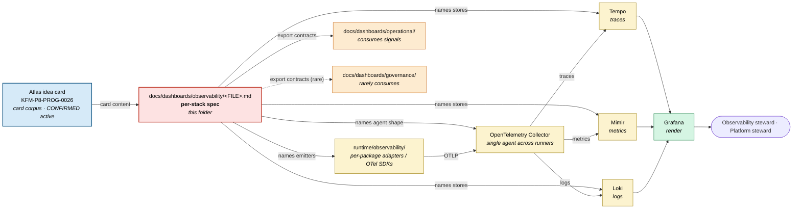

<!-- [KFM_META_BLOCK_V2]
doc_id: kfm://doc/dashboards-observability-readme
title: Observability Dashboard Specifications (PROPOSED lane; CI / pipeline observability stack)
type: standard
version: v1
status: draft
owners: OWNER_TBD  # NEEDS VERIFICATION: docs steward + observability steward
created: 2026-05-26
updated: 2026-05-26
policy_label: public
related:
  - kfm://doc/dashboards-readme                              # CONFIRMED authored sibling: docs/dashboards/README.md
  - kfm://doc/dashboards-indicator-catalog                   # CONFIRMED authored sibling: docs/dashboards/INDICATOR_CATALOG.md
  - kfm://doc/dashboards-dashboard-catalog                   # CONFIRMED authored sibling: docs/dashboards/DASHBOARD_CATALOG.md
  - kfm://doc/dashboards-governance-readme                   # CONFIRMED authored sibling: docs/dashboards/governance/README.md
  - kfm://doc/dashboards-operational-readme                  # CONFIRMED authored sibling: docs/dashboards/operational/README.md
  - kfm://doc/directory-rules                                # CONFIRMED: docs/doctrine/directory-rules.md
  - kfm://adr/dashboards-lane-existence                      # PROPOSED candidate: OPEN-DASH-01
tags: [kfm, dashboards, observability, otel, tempo, mimir, loki, ci, readme]
notes:
  - PROPOSED lane (`docs/dashboards/`). Lane existence is ADR-class per OPEN-DASH-01.
  - Observability dashboards specify the **substrate** the other dashboards read from — not application-level posture or QC.
  - The observability stack is itself a card-driven proposal (`KFM-P8-PROG-0026`); the observability folder's growth tracks programming-class cards.
[/KFM_META_BLOCK_V2] -->

# Observability Dashboard Specifications

<!-- [doc: kfm://doc/dashboards-observability-readme] -->
<a id="top"></a>

> Per-stack **observability dashboard specifications** — CI / pipeline observability surfaces (OpenTelemetry Collector → Tempo / Mimir / Loki). **This folder specifies the substrate**; the substrate is what other dashboards read from. Implementations live in the external observability stack and in `infra/observability/`; the cards each spec mirrors live in the Atlas idea-cards corpus.

<p>
  
  
  
  
  
  
  
</p>

> [!IMPORTANT]
> **Truth posture.** The observability stack is **PROPOSED** (`KFM-P8-PROG-0026`, UNCHANGED active). The lane `docs/dashboards/` is PROPOSED per OPEN-DASH-01. Implementation status is **NEEDS VERIFICATION** — no running stack is confirmed against mounted-repo evidence yet.

> [!CAUTION]
> **Substrate, not posture.** Observability dashboards describe the **telemetry stack** (collector, trace store, metric store, log store, agent shape). They are **not** governance dashboards (which report posture) and **not** operational dashboards (which report feed / artifact / QC health). A spec here that drifts into application-level signals is parallel authority.

> [!NOTE]
> **Anti-collapse rule.** The observability stack is the **carrier** of signals; the signals themselves originate in pipelines and validators. A green telemetry pipeline does not, by itself, mean the underlying workload is healthy — that's what the operational and governance dashboards read.

---

## Contents

1. [Scope](#1-scope)
2. [Repo fit](#2-repo-fit)
3. [Accepted inputs](#3-accepted-inputs)
4. [Exclusions](#4-exclusions)
5. [Per-card inventory](#5-per-card-inventory)
6. [Specification template](#6-specification-template)
7. [Integration with operational, governance, and the wider stack](#7-integration-with-operational-governance-and-the-wider-stack)
8. [Substrate diagram](#8-substrate-diagram)
9. [Verification checklist](#9-verification-checklist)
10. [Maintenance task list](#10-maintenance-task-list)
11. [Open questions & ADR cross-reference](#11-open-questions--adr-cross-reference)
12. [Evidence basis & citations](#12-evidence-basis--citations)

---

## 1. Scope

This folder hosts **per-stack observability dashboard specification files** — one file per Atlas idea card describing an observability substrate or instrumentation pattern:

- which **signals** the stack carries (traces, metrics, logs, exemplars, profiles);
- the **agent shape** (one OTEL agent across runners, per-language SDKs, sidecars);
- the **stores** that receive each signal (Tempo, Mimir, Loki, others);
- the **export contracts** that feed downstream dashboards (PromQL shape, trace ID propagation, log indices);
- who **owns** the stack (typically observability steward + platform steward);
- where the **implementation** lives (`infra/observability/`, external stack endpoints, `UNKNOWN`).

The specifications are **read-only references** for stack operators. The signals themselves come from pipelines, services, and validators — they're not generated by the observability stack.

> [!TIP]
> If you're looking for **what to measure** (governance indicators), go to `docs/dashboards/governance/`. If you're looking for **what the pipelines emit** (feed freshness, QC verdicts), go to `docs/dashboards/operational/`. If you're looking for the actual running stack, follow the implementation pointer here — typically a Tempo/Mimir/Loki/Grafana set or an OTEL collector config.

[↑ back to top](#top)

---

## 2. Repo fit

```text
docs/
└── dashboards/                                  # PROPOSED lane (Directory Rules §6.1 does not list this)
    ├── README.md                                # PROPOSED parent README
    ├── INDICATOR_CATALOG.md                     # PROPOSED — mirror of Atlas v1.1 §24.11
    ├── DASHBOARD_CATALOG.md                     # PROPOSED — index of all dashboard specs
    ├── governance/                              # per-category governance-health specs
    ├── operational/                             # feed / artifact / QC dashboards
    ├── domain/                                  # per-domain dashboard specs
    └── observability/                           # THIS FOLDER — CI / pipeline observability stack
        ├── README.md                            # THIS FILE
        └── OPENTELEMETRY_STACK.md               # ✅ KFM-P8-PROG-0026
```

**Upstream authorities.**

| Upstream | Relationship |
|:---|:---|
| Atlas idea-cards corpus (`KFM-P8-PROG-0026`, programming class) | **Card source** — each spec in this folder mirrors a single active card. A spec without a card is parallel authority. |
| Atlas v1.1 §24.2 — Receipt Catalog | Where the source receipts originate that the stack will carry as telemetry exhaust. |
| `infra/observability/` *(if it exists; NEEDS VERIFICATION)* | The collector configs, store deployment manifests, and Grafana dashboards-as-code that implement the stack. |
| `runtime/observability/` *(if it exists; NEEDS VERIFICATION)* | The per-package observability adapters that emit traces / metrics / logs. |
| `docs/doctrine/directory-rules.md` | Places `docs/` lanes; this lane is not yet placed. See §11 OPEN-DASH-01. |

**Downstream consumers.**

| Downstream | Relationship |
|:---|:---|
| `docs/dashboards/operational/SLO_LIVE_FEEDS.md`, `…/REALTIME_FEED_FRESHNESS.md` | **Consume the stack.** These specs read signals from the OTEL stack defined here. |
| `docs/dashboards/governance/*` | **May consume the stack** where telemetry is the source-of-truth for an indicator (rare; most governance indicators read receipts directly). |
| External Tempo / Mimir / Loki / Grafana instances | **Implementations** of the stack. |
| `infra/observability/` deployment | **Implementation** of collector + stores. |
| `docs/runbooks/` | Operational runbooks for the stack (alert response, store backups, cardinality control). |

[↑ back to top](#top)

---

## 3. Accepted inputs

Files that belong in this folder:

- **One `<CARD_NAME>.md` per active observability Atlas idea card** (programming-class or feature-class). File name uses `UPPERCASE_WITH_UNDERSCORES.md` per Directory Rules §6.1.a.
- **This README** (`README.md`).
- Optional `<CARD>/figures/` sub-folder for separately-versioned diagrams (PROPOSED).

Each per-stack spec MUST:

- name the **source card** and its lifecycle status;
- declare the **signals carried** (traces / metrics / logs / exemplars / profiles);
- name the **stores** that receive each signal;
- declare the **agent shape** (single agent, per-language SDK, sidecar);
- declare the **export contracts** consumed downstream;
- name the **owning steward(s)** (typically observability steward);
- point to its **implementation home** (`infra/observability/...`, external endpoint, or `UNKNOWN`);
- define an **acceptance** checklist for "correct enough to publish."

[↑ back to top](#top)

---

## 4. Exclusions

| ❌ Do not put here | ✅ Belongs in |
|:---|:---|
| Collector configs, store-deployment manifests, dashboards-as-code | `infra/observability/`, external stack repos |
| Per-package observability adapters (emit traces / metrics / logs) | `runtime/observability/`, per-package code |
| **Application-level signals** (feed freshness, QC verdicts, reproducibility) | `docs/dashboards/operational/<CARD>.md` |
| **Governance posture indicators** (cite-or-abstain, fail-closed rate) | `docs/dashboards/governance/<CATEGORY>.md` |
| Per-domain roll-ups | `docs/dashboards/domain/<domain>.md` |
| Stack operations runbooks (alert response, backups, scale-out) | `docs/runbooks/observability/` (when authored) |
| Schema definitions for receipts | `schemas/contracts/v1/<family>/` |
| Validator / SLO-checker code | `tools/validators/`, `tests/...` |
| New backlog items | `docs/backlog/` |
| ADRs about observability architecture | `docs/adr/` |
| Alert rules and rule files | `infra/observability/alerts/` (when authored) |
| Specs for cards that are not in the Atlas idea-cards corpus | Propose the card first, then author the spec |

> [!WARNING]
> **Substrate-vs-application watch.** If a spec here finds itself naming an application signal (gauge-state coverage, calibration residual, sensitive-lane fail-closed rate), that's a signal the content belongs in `operational/` or `governance/`. The observability folder describes the **stack that carries** those signals, not the signals themselves.

[↑ back to top](#top)

---

## 5. Per-card inventory

### 5.1 Authored (✅) status

| Source card | Card lifecycle | File | Status | Documents |
|:---|:---:|:---|:---:|:---|
| [`KFM-P8-PROG-0026`] | UNCHANGED, active | [`OPENTELEMETRY_STACK.md`](OPENTELEMETRY_STACK.md) | ✅ | CI/pipeline observability via OpenTelemetry Collector → Tempo (traces) + Mimir (metrics) + Loki (logs), one agent shape across runners. |

### 5.2 Status legend

| Symbol | Meaning |
|:---:|:---|
| ✅ | Authored in this folder. |
| ⏳ | Proposed; not yet authored. |
| 🛠️ | In progress. |
| 🚫 | Withdrawn (not currently used). |
| 🔄 | Superseded by a later spec. |

> [!NOTE]
> **Growth path.** Additional observability cards (a profiler track, an exemplar-export track, a cardinality-control card, an alert-pipeline card) would each land as a new file here. Card-to-spec cardinality is **one-to-one**.

[↑ back to top](#top)

---

## 6. Specification template

Each per-stack spec file SHOULD follow this skeleton. This template matches the shape used by `OPENTELEMETRY_STACK.md`.

```markdown
<!-- KFM_META_BLOCK_V2 with type: standard, related: cross-references including the source card, INDICATOR_CATALOG.md, DASHBOARD_CATALOG.md, and any operational/governance specs that consume the stack -->

# <Stack Title> · `observability/<FILE>.md`

> One-line scope statement naming the source card.

[badges: authority=PROPOSED, status=draft, category=observability, source=KFM-P*-*-*, policy=public]

> [!IMPORTANT]
> Card self-check: <UNKNOWN | VERIFIED>. Mounted-repo implementation status: <NEEDS VERIFICATION | CONFIRMED>.

## 1. Description
What substrate this stack provides, in one paragraph.

## 2. Signals carried (PROPOSED)
Table: traces / metrics / logs / exemplars / profiles, the agent that emits them, the store that receives them.

| # | Signal | Emitter (agent / SDK) | Store | Export contract consumed by |
|---|---|---|---|---|
| 1 | OTLP traces | OTel SDK + collector | Tempo | trace ID propagation; `operational/SLO_LIVE_FEEDS.md` |
| … | …          | …                     | …     | …                                                      |

## 3. Stack shape (PROPOSED)
Agent shape (single OTel collector vs. per-language SDKs vs. sidecars).
Store choices and their commitments (retention, cardinality, RPO/RTO).

## 4. Inputs — emitters and adapters
CONFIRMED emitters from `runtime/observability/`; mounted-repo paths NEEDS VERIFICATION.

## 5. Files
Spec path + running stack (external Tempo/Mimir/Loki endpoints, `infra/observability/` configs, or `UNKNOWN`).

## 6. Ownership and review burden
Observability steward + platform steward + per-runner team review burden.

## 7. Acceptance
- [ ] Signals × stores × consumers triangle complete.
- [ ] Agent shape declared (one collector across runners is the default).
- [ ] Cardinality / retention / RPO committed or marked NEEDS VERIFICATION.
- [ ] Every consumer named (forward links from operational/governance specs that read the stack).
- [ ] Link check passes; spec has a row in DASHBOARD_CATALOG.md §5.

## 8. Open questions
Local `<CARD>-OQ-NN` items if any.
```

> [!TIP]
> Keep specs **bounded** to a single stack pattern per file. Cardinality-control rules, alert pipelines, or profiler tracks deserve their own spec (and their own card) rather than expansion of this one.

[↑ back to top](#top)

---

## 7. Integration with operational, governance, and the wider stack

Each per-stack spec is a **four-way bridge**:

| Direction | What it consumes | What it produces |
|:---|:---|:---|
| **Up to the Atlas idea card** | Card description, lifecycle status. | A statement of the substrate the card asks for. |
| **Sideways to `operational/`** | Nothing — observability is the carrier, not the application. | Forward links: each downstream spec that reads the stack is listed in the per-stack spec's "consumed by" column. |
| **Sideways to `governance/`** | Nothing — governance indicators read receipts directly. | Forward links where governance specs *do* consume the stack (rare). |
| **Down to `infra/observability/` and runtime adapters** | Nothing — the spec does not consume implementations. | The implementation pointer (§5 of the template). |

### 7.1 Conflict resolution

| Conflict | Winner |
|:---|:---|
| Per-stack spec vs source Atlas card | **Card wins.** Propose a card update first; then update the spec. |
| Per-stack spec vs running stack signal shape | **Running stack is operational truth**, but divergence is a **drift signal** — log it. A spec that silently matches a stack that violates the card is parallel authority. |
| Per-stack spec vs `operational/` consumer | **The consumer wins on what signals it needs.** The spec must declare those signals as carried; if it can't, the substrate is the defect. |
| Per-stack spec vs `runtime/observability/` adapter | **Adapter wins.** If the spec names an emitter shape that does not exist at runtime, the spec is the defect. |

> [!IMPORTANT]
> Specs **describe**; cards **propose**; runtime adapters **emit**; stacks **carry**; downstream dashboards **render**.

[↑ back to top](#top)

---

## 8. Substrate diagram



*Cards (blue) authorize specs (red). Specs name the stack (yellow) and declare export contracts to consumers (orange). The substrate is operational; Grafana (green) is one rendering surface among others.*

[↑ back to top](#top)

---

## 9. Verification checklist

Apply before merging a new per-stack spec or treating this folder as canonical.

- [ ] Confirm target path `docs/dashboards/observability/<FILE>.md` resolves under an accepted lane (OPEN-DASH-01).
- [ ] Confirm the source card exists in the Atlas idea-cards corpus and is active.
- [ ] Confirm card-to-spec cardinality is one-to-one.
- [ ] Confirm the spec's implementation pointer resolves to `infra/observability/`, an external stack handle, or is honestly marked `UNKNOWN`.
- [ ] Confirm the spec **does not** name application-level signals (those belong in `operational/`).
- [ ] Confirm every downstream consumer (`operational/<X>.md`, occasionally `governance/<Y>.md`) is named explicitly with a forward link.
- [ ] Confirm cardinality / retention / RPO commitments are declared or marked `NEEDS VERIFICATION`.
- [ ] Confirm negative-state vocabulary matches Unified Doctrine §19.
- [ ] Confirm owners named or carry `OWNER_TBD` + NEEDS VERIFICATION note.
- [ ] Confirm row exists in `DASHBOARD_CATALOG.md` §5 (Observability dashboards).

[↑ back to top](#top)

---

## 10. Maintenance task list

- [ ] **Inventory sync.** §5.1 status column reflects actual files in this folder.
- [ ] **Card sync.** When a source card is updated, RETIRED, or SUPERSEDED, the corresponding spec is reviewed.
- [ ] **Consumer-link sync.** When an operational or governance spec begins reading the stack, the corresponding "consumed by" forward link is added here.
- [ ] **Runtime-adapter sync.** When `runtime/observability/` adapters change, every spec that names them is reviewed.
- [ ] **No application-signal creep.** Periodic check: no observability spec defines feed / artifact / QC / governance signals.
- [ ] **Parallel-authority watch.** This folder does not grow non-spec content.
- [ ] **Owner roster updated.** Each spec's `owners:` reflects current Atlas §24.7 reconciliation.

[↑ back to top](#top)

---

## 11. Open questions & ADR cross-reference

| # | Question | Class | Cross-reference |
|:---|:---|:---|:---|
| **OPEN-DASH-01** | Should `docs/dashboards/` exist as a lane? | ADR-class | Directory Rules §2.4(5); §6.1. |
| **OPEN-DASH-OBS-01** | Where do **observability implementations** live? `infra/observability/`, external stack repos, or split? | Directory class | Parallels OPEN-DASH-03 / OPEN-DASH-O-01. |
| **OPEN-DASH-OBS-02** | **Agent shape** — single OTel collector across runners (current default) vs. per-language SDKs vs. sidecars. | Stack class | Relates to `KFM-P8-PROG-0026` card text. |
| **OPEN-DASH-OBS-03** | **Cardinality control** — should it be a separate card / spec or rolled into `OPENTELEMETRY_STACK.md`? | Scoping class | Relates to Mimir cost / retention; long-term hygiene. |
| **OPEN-DASH-OBS-04** | **Alert pipeline** — does the observability folder also own alert rules, or do those live in `infra/observability/alerts/` only? | Scoping class | Parallels operational-runbook boundary. |
| **OPEN-DASH-OBS-05** | **Profiler / exemplar tracks** — separate spec files (one card each) or panels inside `OPENTELEMETRY_STACK.md`? | Scoping class | Future-card class. |
| **OPEN-DASH-OBS-06** | Should the **observability stack's own posture** (collector liveness, store quota, ingestion lag) be reported by a meta-dashboard here, or treated as application signals in `operational/`? | Self-reference class | Recursive case; needs an explicit rule. |

[↑ back to top](#top)

---

## 12. Evidence basis & citations

<details>
<summary><strong>Source ledger</strong></summary>

| Source | Status | Supports | Limits |
|:---|:---|:---|:---|
| Atlas idea-cards corpus — `KFM-P8-PROG-0026` | CONFIRMED (corpus) | §5.1 inventory; card-to-spec mapping. | Card lifecycle is UNCHANGED active; mounted-repo implementation NEEDS VERIFICATION. |
| Atlas v1.1 §24.7 — Reviewer Role and SoD Matrix | CONFIRMED (manuscript) | §3 owning-steward requirement; §6 template §6. | Role-to-named-individual mapping NEEDS VERIFICATION. |
| `docs/dashboards/README.md` (parent) | CONFIRMED (this folder) | §2 repo fit; §5.1 file enumeration. | Parent README is PROPOSED. |
| `docs/dashboards/DASHBOARD_CATALOG.md` §5 | CONFIRMED (this folder) | §5.1 inventory rows; §9 verification checklist (catalog row required). | Catalog is PROPOSED. |
| `docs/dashboards/operational/README.md` | CONFIRMED authored sibling | §7 consumer-side integration; §1 substrate-vs-application contrast. | Same parallel-authority resolution model. |
| `docs/dashboards/governance/README.md` | CONFIRMED authored sibling | §4 exclusions (governance posture lives there). | Same parallel-authority resolution model. |
| `docs/doctrine/directory-rules.md` §6.1, §2.4(5) | CONFIRMED (prior-session authored) | §2 repo fit; §4 exclusions. | `docs/dashboards/` does not appear in §6.1; OPEN-DASH-01. |

</details>

> [!NOTE]
> **Anti-collapse rule (reaffirmed).** The observability stack is the **substrate**; the substrate is one carrier of operational truth, not the truth itself. Replacing the underlying receipts / validators / QC artifacts with the stack's signals — or replacing the substrate's spec with the rendered Grafana board — collapses the layering this folder exists to preserve.

[↑ back to top](#top)

---

<sub>Per-stack observability dashboard specifications. PROPOSED lane (`docs/dashboards/`) pending OPEN-DASH-01 ADR. **Specifications only — implementations live in external stack endpoints and `infra/observability/`; source cards live in the Atlas idea-cards corpus; application-level signals live in `docs/dashboards/operational/`; governance posture lives in `docs/dashboards/governance/`.** The card wins on what the stack is for; the running stack wins on signal shape; the runtime adapters win on emitter shape.</sub>
