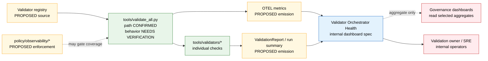

<!-- [KFM_META_BLOCK_V2]
doc_id: kfm://doc/dashboards-observability-validator-orchestrator-health
title: Validator Orchestrator Health — system-health dashboard specification
type: standard
version: v0.2
status: draft
owners: OWNER_TBD  # NEEDS VERIFICATION: observability steward + validation owner + docs steward
created: 2026-05-26
updated: 2026-06-12
policy_label: internal
related:
  - kfm://doc/dashboards-observability-readme
  - kfm://doc/dashboards-dashboard-catalog
  - kfm://doc/dashboards-operational-readme
  - kfm://doc/dashboards-governance-readme
  - kfm://doc/directory-rules
  - tools/validate_all.py
  - tools/validators/
  - policy/observability/validator-coverage/  # PROPOSED; NEEDS VERIFICATION
  - infra/observability/                    # PROPOSED; NEEDS VERIFICATION
  - docs/runbooks/observability/            # PROPOSED; NEEDS VERIFICATION
tags: [kfm, dashboards, observability, validators, orchestrator, ci, system-health, internal]
notes:
  - "v0.2 polish pass: strengthens the system-health boundary, separates path presence from behavior, adds signal semantics, sensitivity posture, implementation boundary, validation checklist, rollback/drift handling, and evidence ledger."
  - "tools/validate_all.py path is CONFIRMED present in the current repo snapshot inspected for this revision; its current contents are placeholder-level, so behavior, registry shape, telemetry emission, and exit-code semantics remain PROPOSED / NEEDS VERIFICATION."
  - "This is a dashboard specification, not the validator orchestrator, not telemetry plumbing, not policy, and not the running dashboard."
  - "Internal by default: publish no validator stderr, artifact names, sensitive dataset identifiers, per-sensitive-lane failure detail, or raw CI logs from this surface."
[/KFM_META_BLOCK_V2] -->

# Validator Orchestrator Health

<!-- [doc: kfm://doc/dashboards-observability-validator-orchestrator-health] -->
<a id="top"></a>

> Internal system-health dashboard specification for the validator orchestrator lane: run cadence, exit-code distribution, wallclock performance, registered-vs-run coverage, and safe redacted operational posture for `tools/validate_all.py` and its validator registry.

<p>
  
  
  
  
  
  
  
  
</p>

> [!IMPORTANT]
> **Specification only.** This file describes the health surface a maintainer should see. It does **not** implement `tools/validate_all.py`, define validator contracts, define policy, store telemetry, or certify that orchestration behavior is live.

> [!CAUTION]
> **Evidence boundary changed in v0.2.** The repo path `tools/validate_all.py` is present, but the inspected file is placeholder-level. Treat exit-code semantics, validator registry discovery, telemetry emission, dashboards, alerting, and policy-bundle enforcement as **PROPOSED / NEEDS VERIFICATION** until code, tests, logs, or workflow evidence prove them.

> [!WARNING]
> **Internal-only exposure.** Validator health can reveal where data quality, source freshness, or sensitive-domain validation is failing. This dashboard may show aggregated counts, rates, and durations; it MUST NOT expose raw validator stderr, artifact names from sensitive lanes, source-system secrets, exact sensitive dataset identifiers, or raw CI logs.

---

## Contents

1. [Status and authority](#1-status-and-authority)
2. [Scope](#2-scope)
3. [Repo fit](#3-repo-fit)
4. [Health model](#4-health-model)
5. [Signals](#5-signals)
6. [Panel contracts](#6-panel-contracts)
7. [Sensitive-content posture](#7-sensitive-content-posture)
8. [Public-exposure policy](#8-public-exposure-policy)
9. [Implementation pointer](#9-implementation-pointer)
10. [Ownership and review burden](#10-ownership-and-review-burden)
11. [Validation and acceptance](#11-validation-and-acceptance)
12. [Drift, rollback, and incident handling](#12-drift-rollback-and-incident-handling)
13. [Cross-links](#13-cross-links)
14. [Open questions](#14-open-questions)
15. [Evidence basis](#15-evidence-basis)

---

## 1. Status and authority

| Field | Value |
|:---|:---|
| **Document type** | Dashboard specification; internal system-health reference. |
| **Target path** | `docs/dashboards/observability/validator-orchestrator-health.md` |
| **Authority level** | PROPOSED spec. It guides implementation; it does not define validator semantics or policy. |
| **Current path evidence** | CONFIRMED in current repo inspection: `docs/dashboards/observability/validator-orchestrator-health.md` exists. |
| **Tool path evidence** | CONFIRMED path: `tools/validate_all.py` exists. Behavior remains NEEDS VERIFICATION. |
| **Running dashboard status** | UNKNOWN. No running dashboard, Grafana panel, route, CI job, or OTEL emission was verified in this session. |
| **Policy label** | `internal` — no public exposure by default. |
| **Owners** | OWNER_TBD — observability steward + validation owner + docs steward need assignment before review. |
| **Primary risk** | Treating a dashboard metric as proof, leaking validator output, or claiming orchestration behavior that the current placeholder file does not prove. |
| **Rollback target** | Revert to v0.1 or withdraw this spec if it contradicts implemented validator behavior or exposes sensitive detail. |

[↑ back to top](#top)

---

## 2. Scope

This dashboard answers four operational questions:

1. **Is the validator orchestrator running on the expected cadence?**
2. **Are orchestrator failures distinguishable from validator failures?**
3. **Are validator runtimes and coverage drifting?**
4. **Can maintainers inspect health without exposing sensitive validator output?**

### In scope

- Orchestrator run frequency and recent-run status.
- Exit-code distribution using the **PROPOSED** convention `0 = pass`, `1 = validation failure`, `2 = orchestrator/system error`.
- Overall and per-validator wallclock timing.
- Registered-vs-run validator coverage drift.
- CI-runner-level aggregation where available.
- Redacted, count-only system-health telemetry.

### Out of scope

| Out of scope | Belongs instead |
|:---|:---|
| Validator implementation code | `tools/validators/` and `tools/validate_all.py` |
| Machine-readable validator registry schema | `schemas/contracts/v1/...` or `control_plane/` after ADR-backed placement |
| Policy that decides whether coverage drift blocks release | `policy/` |
| CI workflow definitions | `.github/workflows/` |
| Running dashboard code, Grafana JSON, or panels-as-code | `infra/observability/`, external stack, or `apps/` after placement is decided |
| Raw validator stderr or logs | Live CI/observability systems with redaction, access control, and retention policy |
| Governance posture indicators | `docs/dashboards/governance/` |

[↑ back to top](#top)

---

## 3. Repo fit

```text
docs/
└── dashboards/                                  # PROPOSED lane pending OPEN-DASH-01
    └── observability/                           # system / telemetry substrate specs
        ├── README.md                            # lane contract
        ├── OPENTELEMETRY_STACK.md               # stack-level substrate spec
        ├── build-ci-health.md                   # sibling system-health spec
        ├── ingest-run-trace-coverage.md         # sibling trace-coverage spec
        └── validator-orchestrator-health.md     # this file

tools/
├── validate_all.py                              # orchestrator path CONFIRMED; behavior NEEDS VERIFICATION
└── validators/                                  # validator implementations / registry source PROPOSED

infra/
└── observability/                               # PROPOSED: collector, stores, alert rules, dashboards-as-code
```

### Responsibility split

| Responsibility | Home | This spec's posture |
|:---|:---|:---|
| Human-facing system-health explanation | `docs/dashboards/observability/` | This file. |
| Validator orchestration code | `tools/validate_all.py` | Referenced only; not defined here. |
| Individual validators | `tools/validators/` | Referenced; registry shape remains NEEDS VERIFICATION. |
| Telemetry configuration | `infra/observability/` or external stack | PROPOSED / NEEDS VERIFICATION. |
| Dashboard implementation | `apps/`, `infra/observability/`, or external Grafana | UNKNOWN until implementation evidence exists. |
| Enforceability proof | `tests/` and CI logs | NEEDS VERIFICATION. |
| Policy gates | `policy/` | PROPOSED; never encoded in this doc. |

[↑ back to top](#top)

---

## 4. Health model



> [!NOTE]
> The diagram is a **target health model**, not implementation proof. Every edge that depends on telemetry, registry shape, run summaries, policy checks, or dashboard panels remains **PROPOSED / NEEDS VERIFICATION**.

[↑ back to top](#top)

---

## 5. Signals

### 5.1 Signal contract

| Signal | What it carries | Healthy posture | Exposure | Status |
|:---|:---|:---|:---|:---|
| `validator.orchestrator.runs_per_day` | Count of orchestrator invocations per day. | At or above expected CI/manual cadence. | Internal aggregate. | PROPOSED |
| `validator.orchestrator.last_success_age_seconds` | Time since last exit-0 run. | Within expected cadence window. | Internal aggregate. | PROPOSED |
| `validator.orchestrator.exit_0_rate` | Share of runs exiting 0. | Tracking metric; not a doctrine proof. | Internal aggregate. | PROPOSED |
| `validator.orchestrator.exit_1_rate` | Share of runs where one or more validators failed. | Tracking metric; spikes investigated. | Internal aggregate. | PROPOSED |
| `validator.orchestrator.exit_2_rate` | Share of runs where the orchestrator itself failed. | Near zero; target threshold OWNER_TBD. | Internal aggregate. | PROPOSED |
| `validator.orchestrator.p95_wallclock_seconds` | p95 end-to-end runtime. | Under budget; initial budget OWNER_TBD. | Internal aggregate. | PROPOSED |
| `validator.per_validator.p95_wallclock_seconds` | p95 runtime per validator. | Under per-validator budgets. | Internal aggregate; no sensitive artifact labels. | PROPOSED |
| `validator.coverage.registered_count` | Validators registered for the run. | Stable or intentionally changed. | Internal aggregate. | PROPOSED |
| `validator.coverage.executed_count` | Validators executed by the orchestrator. | Equals registered count unless intentionally skipped. | Internal aggregate. | PROPOSED |
| `validator.coverage.registered_vs_run_delta` | Registered minus executed validators. | `0`. Non-zero is a coverage drift signal. | Internal aggregate. | PROPOSED |
| `validator.redaction.dropped_log_lines` | Count of log/stderr lines withheld from dashboard emission. | Visible and reviewable; content never displayed here. | Internal count only. | PROPOSED |

### 5.2 Exit-code semantics

| Exit code | Meaning | Operator interpretation | Status |
|:---:|:---|:---|:---|
| `0` | All validators completed and passed. | Healthy run for the checked scope. | PROPOSED |
| `1` | Orchestrator completed; one or more validators reported validation failure. | Data/schema/policy quality issue; inspect safe validation reports, not raw stderr. | PROPOSED |
| `2` | Orchestrator/system error. | Infrastructure, dependency, registry, permission, import, or tool failure; SRE / validation owner investigates. | PROPOSED |

> [!IMPORTANT]
> Exit codes are an **interface contract proposal** in this spec until `tools/validate_all.py`, tests, and CI logs confirm them. Do not write downstream policy or alerts that rely on these codes until verification closes **OPEN-DASH-OBS-VAL-03**.

[↑ back to top](#top)

---

## 6. Panel contracts

| Panel | Shows | Must not show | Drill-down target |
|:---|:---|:---|:---|
| **Run cadence** | Runs per day, last-run age, missed cadence windows. | Raw CI logs or commit secrets. | CI run summary or redacted run receipt. |
| **Exit-code distribution** | 0 / 1 / 2 rates over selected window. | Validator stderr, sensitive dataset names, exact restricted paths. | Aggregated run-summary list. |
| **Wallclock budget** | p50 / p95 / max runtime overall and per validator. | Full stack traces. | Safe validator timing summary. |
| **Coverage drift** | Registered vs executed count and delta. | Registry internals that expose sensitive lane names. | Redacted registry diff or validator manifest. |
| **System-error triage** | Exit-2 trend, top safe reason categories. | Raw exceptions with paths, tokens, source URLs, or sensitive artifact IDs. | SRE runbook / issue template. |
| **Redaction health** | Count of withheld log lines and redaction-rate trend. | Withheld content itself. | Redaction policy and audit receipt. |

[↑ back to top](#top)

---

## 7. Sensitive-content posture

| Control | Requirement | Status |
|:---|:---|:---|
| **Signal tier** | Aggregated counts and durations are treated as T0/T1 operational metadata when no sensitive artifact labels are included. | PROPOSED |
| **Dashboard label** | `internal`; not public. | CONFIRMED in this spec |
| **Raw output handling** | Dashboard MUST NOT read validator stderr, raw CI logs, stack traces, or unredacted artifact paths. | PROPOSED |
| **Sensitive lane leakage** | Do not display names of T2+ datasets, archaeology layers, rare-species layers, living-person datasets, DNA/genomic material, critical-infrastructure layers, or private-landowner slices. | PROPOSED |
| **Redaction point** | Redaction happens at emission or collector boundary before dashboard ingestion. | PROPOSED |
| **Retention** | Metrics retention window OWNER_TBD; raw logs follow CI/observability retention and access controls. | NEEDS VERIFICATION |
| **Access** | Validation owner, SRE/on-call, observability steward, docs steward for spec review. | PROPOSED |

> [!CAUTION]
> A validator failure can be a side channel. Even an aggregate spike can signal trouble in a sensitive lane. Keep this dashboard internal unless a separate policy review approves a public-safe aggregate.

[↑ back to top](#top)

---

## 8. Public-exposure policy

| Exposure question | Decision |
|:---|:---|
| Public dashboard? | **DENY by default.** |
| Public summary allowed? | PROPOSED: only coarse, delayed, non-domain-specific uptime/status wording after policy review. |
| Raw logs public? | **DENY.** |
| Per-validator names public? | **DENY by default** if names reveal sensitive lanes or unpublished capabilities. |
| Per-domain failure rates public? | **DENY by default**; may reveal quality, source, or sensitive-lane issues. |
| Internal audit trail? | Required: dashboard changes and redaction rules should be reviewable. |

[↑ back to top](#top)

---

## 9. Implementation pointer

| Component | Proposed / confirmed location | Status |
|:---|:---|:---|
| Orchestrator path | `tools/validate_all.py` | CONFIRMED path; placeholder-level behavior |
| Validator implementations | `tools/validators/` | NEEDS VERIFICATION for registry and coverage shape |
| Dashboard UI | `apps/admin/observability/validator-orchestrator/` | PROPOSED; NEEDS VERIFICATION |
| External dashboard | Grafana / OTEL-backed dashboard | PROPOSED; NEEDS VERIFICATION |
| Telemetry source | Orchestrator self-telemetry + CI runner telemetry | PROPOSED |
| Standard docs | `docs/standards/OPENTELEMETRY.md` | PROPOSED; NEEDS VERIFICATION |
| Coverage policy | `policy/observability/validator-coverage/` | PROPOSED; NEEDS VERIFICATION |
| Runbook | `docs/runbooks/observability/validator-orchestrator.md` | PROPOSED; NEEDS VERIFICATION |

### Minimum implementation contract (PROPOSED)

A future implementation should emit a redacted run summary shaped like this:

```json
{
  "run_id": "RUN_ID_TBD",
  "started_at": "2026-06-12T00:00:00Z",
  "finished_at": "2026-06-12T00:00:10Z",
  "exit_code": 0,
  "registered_validator_count": 0,
  "executed_validator_count": 0,
  "failed_validator_count": 0,
  "system_error_count": 0,
  "redacted_log_line_count": 0,
  "metrics_only": true,
  "sensitive_labels_emitted": false
}
```

> [!NOTE]
> This JSON block is illustrative and **PROPOSED**. Do not treat it as a schema. If accepted, its machine shape belongs under `schemas/contracts/v1/...`, not in this Markdown file.

[↑ back to top](#top)

---

## 10. Ownership and review burden

| Role | Responsibility | Status |
|:---|:---|:---|
| **Observability steward** | Owns telemetry naming, dashboard signal shape, redaction-at-emission posture. | OWNER_TBD |
| **Validation owner** | Owns `tools/validate_all.py`, validator registry, exit-code semantics, and run-summary emission. | OWNER_TBD |
| **Docs steward** | Maintains this spec, dashboard-lane links, and drift entries. | OWNER_TBD |
| **SRE / on-call** | Responds to exit-2/system-error spikes and telemetry outages. | OWNER_TBD |
| **Sensitivity reviewer** | Required only if emitted labels, logs, or panels could expose T2+ artifacts. | Conditional |

Review is required when:

- `tools/validate_all.py` changes exit-code semantics.
- The validator registry adds/removes validators or changes discovery rules.
- Redaction boundaries change.
- Dashboard implementation starts reading CI logs or traces directly.
- Any public or semi-public exposure is proposed.
- Policy bundles begin gating release on coverage or exit-code state.

[↑ back to top](#top)

---

## 11. Validation and acceptance

Before this spec is considered ready for review:

- [ ] Confirm `tools/validate_all.py` is no longer placeholder-only or keep behavior claims marked PROPOSED.
- [ ] Confirm or revise the exit-code contract (`0`, `1`, `2`) in code and tests.
- [ ] Confirm how validators are discovered: static list, registry file, package scan, CLI entry points, or workflow matrix.
- [ ] Confirm run-summary emission format and schema home.
- [ ] Confirm telemetry names and labels do not leak sensitive lanes.
- [ ] Confirm the dashboard implementation path or external-stack pointer.
- [ ] Confirm row exists in `docs/dashboards/DASHBOARD_CATALOG.md`.
- [ ] Confirm parent `docs/dashboards/observability/README.md` inventory includes this spec if observability README policy allows system-health specs beyond card-level stack specs.
- [ ] Add safe fixtures or tests for exit-code mapping.
- [ ] Add safe fixtures or tests for redaction of validator stderr and sensitive artifact names.
- [ ] Confirm no public route exposes this dashboard.

Definition of done for the future implementation:

| Gate | Done when |
|:---|:---|
| **Path gate** | Spec path and implementation path are both confirmed or marked UNKNOWN. |
| **Signal gate** | Every signal has a producing adapter, unit, label policy, and owner. |
| **Privacy gate** | Raw stderr and sensitive artifact names are blocked before dashboard ingestion. |
| **Exit-code gate** | Exit-code semantics are covered by tests and CI evidence. |
| **Coverage gate** | Registered-vs-run delta can be computed deterministically. |
| **Runbook gate** | Exit-2 and coverage-drift incidents have a runbook or issue template. |

[↑ back to top](#top)

---

## 12. Drift, rollback, and incident handling

### Drift conditions

Open a drift entry when:

- `tools/validate_all.py` implements different exit codes than this spec.
- The dashboard shows raw validator output or sensitive labels.
- The actual implementation lives somewhere other than the pointer in §9.
- An observability dashboard starts making governance claims instead of reporting system health.
- Policy begins enforcing coverage drift without corresponding tests and fixtures.

### Rollback

Rollback or withdraw this spec if it causes any of the following:

- A public surface exposes validator-health detail.
- A dashboard panel leaks sensitive artifact identifiers.
- Maintainers cite this dashboard as proof of validation instead of citing `ValidationReport`, tests, CI logs, or release evidence.
- This spec diverges from the implemented orchestrator and no drift entry exists.

Rollback target: restore v0.1 content, or mark this file `SUPERSEDED` with a forward link to the accepted implementation spec.

### Incident posture

| Incident | First response |
|:---|:---|
| Exit-2 spike | Treat as system-health incident; route to SRE / validation owner. |
| Exit-1 spike | Treat as validation-quality signal; inspect safe `ValidationReport` summaries. |
| Coverage delta non-zero | Check registry/discovery drift before trusting pass/fail rates. |
| Redaction count drops unexpectedly to zero | Verify redaction still runs; a zero count can mean no sensitive output or broken redaction telemetry. |
| Dashboard missing data | Check telemetry pipeline before assuming validator success. |

[↑ back to top](#top)

---

## 13. Cross-links

| Related surface | Relationship | Status |
|:---|:---|:---|
| `docs/dashboards/observability/README.md` | Parent lane contract for observability specs. | CONFIRMED path |
| `docs/dashboards/observability/build-ci-health.md` | Sibling CI/system-health spec. | CONFIRMED by search; content not inspected here |
| `docs/dashboards/observability/ingest-run-trace-coverage.md` | Sibling trace-coverage spec. | CONFIRMED by search; content not inspected here |
| `docs/dashboards/operational/README.md` | Operational dashboards consume validator/QC outputs but do not define the observability substrate. | CONFIRMED authored sibling |
| `docs/dashboards/governance/validation-and-conformance.md` | Governance may consume selected aggregates but must not redefine this system-health surface. | PROPOSED / NEEDS VERIFICATION |
| `docs/runbooks/observability/validator-orchestrator.md` | Future incident response path. | PROPOSED |
| `docs/registers/DRIFT_REGISTER.md` | Logs path, behavior, or implementation drift. | PROPOSED use; path authority needs verification |

[↑ back to top](#top)

---

## 14. Open questions

| ID | Question | Class | Close when |
|:---|:---|:---|:---|
| **OPEN-DASH-OBS-VAL-01** | What is the per-validator wallclock budget? | SLO / operations | Budget exists per validator or per validator class. |
| **OPEN-DASH-OBS-VAL-02** | Should exit-1 spikes page or remain pull-only? | Operations / governance | Alerting policy distinguishes validation failures from orchestrator failures. |
| **OPEN-DASH-OBS-VAL-03** | Are exit codes `0`, `1`, `2` implemented and tested? | Contract / implementation | Code, tests, and CI evidence confirm semantics. |
| **OPEN-DASH-OBS-VAL-04** | Where does the validator registry live? | Directory / contract | Registry path, schema, and owner are accepted. |
| **OPEN-DASH-OBS-VAL-05** | What run-summary object is emitted by the orchestrator? | Schema | Schema home and example fixture exist. |
| **OPEN-DASH-OBS-VAL-06** | Should this file remain in `observability/` or move to `operational/`? | Lane boundary | Parent dashboard README inventory accepts system-health specs here or an ADR relocates it. |
| **OPEN-DASH-OBS-VAL-07** | What redaction policy proves raw validator output is blocked? | Sensitivity / policy | Redaction tests and policy references exist. |
| **OPEN-DASH-OBS-VAL-08** | Is `apps/admin/observability/validator-orchestrator/` the right implementation path? | Directory / implementation | Mounted repo or ADR confirms implementation home. |

[↑ back to top](#top)

---

## 15. Evidence basis

<details>
<summary><strong>Source ledger</strong></summary>

| Source | Status | Supports | Limits |
|:---|:---|:---|:---|
| `docs/dashboards/observability/validator-orchestrator-health.md` current repo file | CONFIRMED | Existing v0.1 meta block, purpose, internal label, proposed signals, sensitive-output warning, open questions. | Does not prove implementation or telemetry. |
| `tools/validate_all.py` current repo file | CONFIRMED path | Confirms the path exists in this repo snapshot. | Current inspected contents are placeholder-level; does not prove behavior, exit codes, registry, or telemetry. |
| `docs/dashboards/observability/README.md` | CONFIRMED path | Parent observability lane scope: specs describe substrate; implementation status is NEEDS VERIFICATION. | It treats observability stack as PROPOSED and does not itself prove running telemetry. |
| `docs/dashboards/README.md` | CONFIRMED path | Dashboard lane separates specs/catalogs from running dashboards, telemetry data, evidence bundles, and release decisions. | Lane placement remains PROPOSED pending OPEN-DASH-01. |
| `docs/doctrine/directory-rules.md` | CONFIRMED path | Responsibility split: docs explain; tools validate; schemas shape; policy decides; apps implement; data/release carry lifecycle and publication objects. | Does not prove this dashboard implementation exists. |
| User-provided v0.1 text in this revision request | CONFIRMED user source | Revision baseline and desired content. | User-provided claims were rechecked where possible; behavior claims were downgraded where current repo evidence was weaker. |

</details>

> [!NOTE]
> **No-loss preservation.** v0.2 preserves the v0.1 dashboard purpose, internal label, T0/metrics-only intent, exit-code proposal, signal list, sensitive-output warning, ownership placeholders, and open questions. It adds explicit evidence boundaries because current repo evidence confirms path presence but not orchestrator behavior.

[↑ back to top](#top)

---

<sub>Validator Orchestrator Health · v0.2 draft · internal system-health spec. Behind the trust membrane. Dashboard signals report orchestrator health; validators, receipts, policy, tests, and CI evidence carry enforceability. A green dashboard is never a substitute for `ValidationReport`, release evidence, or review state.</sub>
