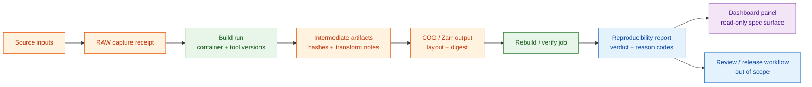

<!-- [KFM_META_BLOCK_V2]
doc_id: kfm://doc/<uuid-pending>
title: COG / Zarr Reproducibility Dashboard — specification
type: standard
version: v0.2
status: draft
owners: <pipeline-steward>  # PROPOSED placeholder; resolve before review
created: 2026-05-20
updated: 2026-06-12
policy_label: public
related:
  - docs/dashboards/README.md
  - docs/dashboards/operational/README.md
  - docs/dashboards/DASHBOARD_CATALOG.md
  - docs/dashboards/operational/GEOSPATIAL_QC_PANEL.md
  - docs/standards/COG.md
  - docs/standards/ZARR.md                    # PROPOSED — verify canonical profile path
  - docs/standards/GEOPARQUET.md
  - docs/doctrine/directory-rules.md
  - docs/doctrine/trust-membrane.md
  - docs/doctrine/lifecycle-law.md
tags: [kfm, dashboards, operational, cog, zarr, raster, datacube, reproducibility, receipts, hashes]
notes:
  - "Source card: KFM-P31-FEAT-0016 (COG/Zarr Reproducibility Dashboard) — UNCHANGED, active. Card lineage is preserved from v0.1."
  - "This is a SPEC for a dashboard, not the running dashboard. Implementations, telemetry, receipts, proofs, and release artifacts live outside docs/."
  - "v0.2 polish: strengthens the reproducibility-proof boundary, adds repo fit, signal flow, panel contracts, verification rules, anti-patterns, evidence basis, rollback/supersession, and expanded open-question tracking."
  - "Repository implementation status remains NEEDS VERIFICATION unless supported by current mounted-repo evidence, CI output, emitted receipts, or runtime dashboard artifacts."
[/KFM_META_BLOCK_V2] -->

<a id="top"></a>

# COG / Zarr Reproducibility Dashboard · `operational/COG_ZARR_REPRODUCIBILITY.md`

> Dashboard specification for the **COG / Zarr Reproducibility Dashboard** (`KFM-P31-FEAT-0016`). It reports whether raster and datacube artifacts can be rebuilt from recorded inputs with stable build identity, pinned tools, chained hashes, layout conformance, and a reproducibility verdict.


**Status:** draft · **Owners:** `<pipeline-steward>` (PROPOSED) · **Last reviewed:** 2026-06-12 · **Spec path:** `docs/dashboards/operational/COG_ZARR_REPRODUCIBILITY.md`

> [!IMPORTANT]
> **Reproducibility is proven by receipts and rebuild evidence, not by this dashboard.** This specification describes the surface that reports the verdict. The proof lives in the `RunReceipt`, build record, chained-hash manifest, validation output, and review/release records. A green panel does not replace those objects.

> [!CAUTION]
> **Reproducible does not mean publishable.** A byte-identical artifact may still be held or denied because of rights, sensitivity, source-role, validation, review, or release-state failures. Publication remains a governed state transition, not a file move.

---

## Quick jump

- [1. Purpose](#1-purpose)
- [2. Scope](#2-scope)
- [3. Repo fit](#3-repo-fit)
- [4. Operating boundaries](#4-operating-boundaries)
- [5. Signal flow](#5-signal-flow)
- [6. Metrics surfaced](#6-metrics-surfaced)
- [7. Panel contracts](#7-panel-contracts)
- [8. Inputs and evidence objects](#8-inputs-and-evidence-objects)
- [9. Files and implementation pointers](#9-files-and-implementation-pointers)
- [10. Ownership and review burden](#10-ownership-and-review-burden)
- [11. Acceptance checklist](#11-acceptance-checklist)
- [12. Anti-patterns](#12-anti-patterns)
- [13. Validation and drift handling](#13-validation-and-drift-handling)
- [14. Open questions](#14-open-questions)
- [15. Evidence basis](#15-evidence-basis)
- [16. Changelog](#16-changelog)

---

## 1. Purpose

The **COG / Zarr Reproducibility Dashboard** answers one operational question:

> **Can each raster or datacube artifact be rebuilt from recorded inputs and produce the expected reproducible result?**

The dashboard exists so the pipeline steward can see reproducibility posture before build drift silently reaches catalog or release review. Typical drift signals include:

- unpinned or changed build containers;
- GDAL, raster driver, compression, or `numcodecs` version changes;
- chunk, block, overview, or tiling-layout drift;
- hash-chain breakage between source inputs, intermediates, and final artifacts;
- rebuild output that differs from the recorded expected digest.

The dashboard is operational: it helps stewards find build drift quickly. It does **not** decide admission, catalog closure, publication, or rollback.

[↑ Back to top](#top)

---

## 2. Scope

### 2.1 In scope

This specification covers dashboard behavior for reproducibility posture of:

- Cloud Optimized GeoTIFF / COG-style raster outputs;
- Zarr-style datacube outputs;
- associated intermediate artifacts when they are part of the declared rebuild chain;
- build-environment identity and tool-version pinning;
- chained hashes across input, intermediate, and output stages;
- layout conformance for overview, block, chunk, compressor, and metadata expectations;
- reproducibility verdicts and their negative-state reason codes.

### 2.2 Out of scope

| Out of scope | Canonical home |
|---|---|
| Running dashboard code, panels, React/Grafana JSON, query logic | `apps/review-console/`, future dashboard app, or external observability tooling |
| Telemetry storage, traces, metrics, logs | external observability stack / runtime observability implementation |
| Receipt, proof, validation, and release artifacts | `data/receipts/`, `data/proofs/`, `data/catalog/`, `release/` |
| Schema definitions for build records, hash-chain manifests, or dashboard payloads | `schemas/contracts/v1/...` |
| Policy decisions that allow, restrict, deny, or abstain | `policy/` and `release/` |
| COG, Zarr, or datacube standards themselves | `docs/standards/` and schema/profile homes |

> [!NOTE]
> This file is a **specification**. It should be safe to render in public documentation because it contains no raw telemetry, secret build data, restricted artifact paths, or unreleased output.

[↑ Back to top](#top)

---

## 3. Repo fit

```text
docs/
└── dashboards/                                  # PROPOSED dashboard-spec lane
    ├── README.md                                # dashboard-lane orientation
    ├── DASHBOARD_CATALOG.md                     # dashboard index
    ├── operational/
    │   ├── README.md                            # operational dashboard lane
    │   ├── SLO_LIVE_FEEDS.md                    # live-feed SLO spec
    │   ├── REALTIME_FEED_FRESHNESS.md           # realtime feed freshness spec
    │   ├── COG_ZARR_REPRODUCIBILITY.md          # THIS FILE
    │   └── GEOSPATIAL_QC_PANEL.md               # quick geometry/CRS/topology QC spec
    └── observability/
        └── OPENTELEMETRY_STACK.md               # PROPOSED telemetry substrate spec
```

| Direction | Object | Relationship | Status |
|---|---|---|---|
| Upstream | `KFM-P31-FEAT-0016` | Source card for this dashboard spec. | LINEAGE / PROPOSED until card registry is verified in repo |
| Upstream | `docs/dashboards/operational/README.md` | Defines operational dashboard specs as card-driven, spec-only documents. | CONFIRMED current repo file |
| Upstream | `docs/standards/COG.md` | Expected COG layout/profile reference. | NEEDS VERIFICATION |
| Upstream | Zarr/datacube profile | Expected chunk/compressor/layout reference. | PROPOSED / NEEDS VERIFICATION |
| Peer | `GEOSPATIAL_QC_PANEL.md` | QC catches obvious geospatial structural defects; this file checks reproducibility of raster/datacube builds. | CONFIRMED peer path in current repo |
| Downstream | `apps/review-console/` or external dashboard surface | Candidate implementation location. | NEEDS VERIFICATION |
| Downstream | `docs/registers/DRIFT_REGISTER.md` | Records divergence between this spec and implementation evidence. | PROPOSED entry path |

[↑ Back to top](#top)

---

## 4. Operating boundaries

### 4.1 Dashboard truth boundary

The dashboard may report:

- `REPRODUCIBLE`, `NOT_REPRODUCIBLE`, `UNKNOWN`, or `NOT_RUN` verdicts;
- which evidence object supports the verdict;
- which input, intermediate, or output digest failed;
- which build-environment or layout field drifted;
- whether review or release state is still blocking publication.

The dashboard must not:

- assert reproducibility without a resolving receipt or rebuild evidence;
- treat visual green status as proof;
- read directly from RAW / WORK / QUARANTINE as the public path;
- expose restricted artifact paths, secrets, credentials, or unreleased raw logs;
- upgrade `NOT_REPRODUCIBLE` to publishable based on steward preference;
- conflate `reproducible` with `validated`, `cataloged`, or `published`.

### 4.2 Reproducibility target

**Default target:** byte-identical rebuild output with a matching final digest.

**Allowed exception:** profile-declared equivalence may be used only if the relevant standard/profile explicitly defines canonicalization or semantic-equivalence rules and the `RunReceipt` / build record records that exception. Until such a rule is verified, the stricter byte-identical target wins.

[↑ Back to top](#top)

---

## 5. Signal flow



> [!IMPORTANT]
> The dashboard is the last read-only surface in this flow. It does not create the verdict; it displays the verdict emitted by the verification job and linked evidence objects.

[↑ Back to top](#top)

---

## 6. Metrics surfaced

| # | Metric | Measures | Healthy posture (PROPOSED) | Negative state |
|---:|---|---|---|---|
| 1 | Build container identity | Exact container image digest and build environment identifier recorded for the artifact. | Pinned digest recorded and matches rebuild run. | `BUILD_ENV_UNPINNED` |
| 2 | Tool-version lock | GDAL, raster drivers, compression libraries, Zarr codecs, `numcodecs`, and relevant runtime versions. | Versions recorded, pinned, and unchanged from the expected profile. | `TOOL_VERSION_DRIFT` |
| 3 | Chained hashes | Input → intermediate → output digest chain integrity. | Chain verifies end to end with no missing links. | `HASH_CHAIN_BROKEN` |
| 4 | Layout conformance | COG overview/block/tiling layout and Zarr chunk/compressor/metadata layout. | Matches the referenced COG and Zarr/datacube profile. | `LAYOUT_NONCONFORMANT` |
| 5 | Rebuild verdict | Rebuild output digest equals expected digest, or a verified profile-defined equivalence is recorded. | `REPRODUCIBLE` with evidence links. | `NOT_REPRODUCIBLE` |
| 6 | Missing proof surface | Whether a dashboard row lacks a required receipt, rebuild report, or hash-chain manifest. | Zero missing required evidence objects. | `MISSING_RECEIPT` / `MISSING_EVIDENCE` |
| 7 | Release-block awareness | Whether a reproducible artifact is still blocked by policy, review, rights, sensitivity, or release state. | Blockers are visible and not hidden behind a green reproducibility badge. | `REVIEW_PENDING` / `DENIED_BY_POLICY` |

> [!TIP]
> The most important UX rule is to show **why** an artifact is not reproducible. A single red cell is less useful than a failed-chain view that identifies the exact missing digest, tool drift, layout drift, or rebuild mismatch.

[↑ Back to top](#top)

---

## 7. Panel contracts

### 7.1 Build environment panel

**Purpose:** Show whether the artifact can be rebuilt in the same environment.

Minimum fields:

- artifact ID;
- build run ID / `RunReceipt` reference;
- container image digest;
- base image digest if recorded;
- tool versions and runtime versions;
- rebuild job reference;
- status: `PINNED`, `DRIFTED`, `UNKNOWN`, or `MISSING`.

Failure posture:

- Missing container digest → `BUILD_ENV_UNPINNED`.
- Tool-version mismatch → `TOOL_VERSION_DRIFT`.
- Missing run receipt → `MISSING_RECEIPT`.

### 7.2 Hash-chain panel

**Purpose:** Surface integrity across the full build chain.

Minimum fields:

- source input digest(s);
- intermediate digest(s);
- final output digest;
- expected rebuild digest;
- chain verification status;
- first failing edge when verification fails.

Failure posture:

- Missing input or intermediate digest → `HASH_CHAIN_BROKEN` or `MISSING_EVIDENCE`.
- Final digest mismatch → `NOT_REPRODUCIBLE`.
- Digest algorithm unknown → `HASH_ALGORITHM_UNKNOWN` (PROPOSED; add to negative-state vocabulary before enforcement).

### 7.3 Layout conformance panel

**Purpose:** Verify layout properties that affect access, reproducibility, and downstream compatibility.

COG-side minimum fields (PROPOSED):

- overview levels present;
- internal tiling / block layout;
- compression type and parameters;
- nodata metadata posture;
- projection / geotransform hash when applicable;
- profile conformance status.

Zarr-side minimum fields (PROPOSED):

- chunk layout;
- compressor / codec identifier and version;
- dimension order;
- coordinate metadata posture;
- store metadata digest;
- profile conformance status.

Failure posture:

- Missing profile reference → `LAYOUT_PROFILE_UNKNOWN` (PROPOSED).
- Mismatched layout → `LAYOUT_NONCONFORMANT`.
- Missing layout metadata → `MISSING_EVIDENCE`.

### 7.4 Verdict board

**Purpose:** Give stewards a compact release-review triage surface without hiding evidence.

Verdict values:

| Verdict | Meaning | May proceed to release review? |
|---|---|---|
| `REPRODUCIBLE` | Rebuild verified against the declared target and evidence resolves. | Yes, if validation, policy, review, and catalog gates also pass. |
| `NOT_REPRODUCIBLE` | Rebuild failed or digest differs without approved equivalence. | No — remediate or open correction path. |
| `UNKNOWN` | Required evidence is missing, stale, or not inspected. | No — fail closed. |
| `NOT_RUN` | Reproducibility job has not run for this artifact/version. | No — run verification or document exception. |
| `WAIVED` | Exception approved by governance. | Only if waiver object, reviewer, expiry, and scope are visible. PROPOSED / NEEDS VERIFICATION. |

[↑ Back to top](#top)

---

## 8. Inputs and evidence objects

Mounted-repo paths and schema shapes remain **NEEDS VERIFICATION**.

| Input / evidence object | Use in dashboard | Canonical home (PROPOSED unless verified) |
|---|---|---|
| `RunReceipt` / build record | Container digest, tool versions, build inputs, run ID. | `data/receipts/` and schema under `schemas/contracts/v1/...` |
| Chained-hash manifest | Input → intermediate → output integrity chain. | `data/proofs/` or receipt/proof lane, pending schema decision |
| Artifact metadata | COG overview/block layout; Zarr chunk/layout/codec metadata. | `data/catalog/` artifact metadata or emitted manifest |
| Rebuild report | Rebuild job result, final digest, failed step, logs pointer. | `data/receipts/` / validator output |
| Standards/profile docs | Expected layout and conformance rules. | `docs/standards/COG.md`, `docs/standards/ZARR.md` (PROPOSED), related schemas |
| Review / policy state | Prevents reproducibility from being mistaken for publishability. | `policy/`, `release/`, `ReviewRecord` |

[↑ Back to top](#top)

---

## 9. Files and implementation pointers

| Path / surface | Role | Status |
|---|---|---|
| `docs/dashboards/operational/COG_ZARR_REPRODUCIBILITY.md` | This dashboard specification. | draft v0.2 |
| `docs/dashboards/operational/README.md` | Operational dashboard lane contract. | CONFIRMED current repo file |
| `docs/dashboards/DASHBOARD_CATALOG.md` | Dashboard catalog row should point here. | NEEDS VERIFICATION for current row |
| `docs/standards/COG.md` | Expected COG profile. | NEEDS VERIFICATION |
| `docs/standards/ZARR.md` | Expected Zarr/datacube profile. | PROPOSED path; NEEDS VERIFICATION |
| Running surface | `apps/review-console/` panel or external dashboard. | NEEDS VERIFICATION |
| Reproducibility checker | Validator or rebuild job that emits the verdict. | PROPOSED; exact tool path UNKNOWN |

[↑ Back to top](#top)

---

## 10. Ownership and review burden

| Responsibility | Owner | Status |
|---|---|---|
| Dashboard spec content | `<pipeline-steward>` | PROPOSED placeholder |
| Build-chain evidence model | Pipeline steward + evidence steward | PROPOSED |
| COG profile conformance | Pipeline steward + standards/docs steward | PROPOSED |
| Zarr/datacube profile conformance | Pipeline steward + standards/docs steward | PROPOSED |
| Dashboard implementation | Observability steward / review-console owner | NEEDS VERIFICATION |
| Public-surface risk review | Docs steward + release steward if surfaced publicly | PROPOSED |

Required review before v1:

- replace `<pipeline-steward>` with a confirmed owner or CODEOWNERS-backed role;
- confirm this spec is present in `DASHBOARD_CATALOG.md`;
- confirm the canonical Zarr/datacube profile path;
- confirm the running implementation pointer or mark `UNKNOWN` explicitly;
- confirm negative-state terms against the project vocabulary before enforcement.

[↑ Back to top](#top)

---

## 11. Acceptance checklist

The dashboard spec is ready for v1 review when:

- [ ] All required panels are present: build environment, hash chain, layout conformance, verdict board.
- [ ] The verdict is derived from resolving evidence objects, not asserted by dashboard code.
- [ ] Every artifact row links to a `RunReceipt` / build record or shows `MISSING_RECEIPT`.
- [ ] Every `NOT_REPRODUCIBLE` row identifies the first failing edge or reason code.
- [ ] COG layout checks link to the canonical COG profile.
- [ ] Zarr layout checks link to the canonical Zarr/datacube profile.
- [ ] The dashboard distinguishes `REPRODUCIBLE` from `VALIDATED`, `CATALOGED`, and `PUBLISHED`.
- [ ] The row is present in `docs/dashboards/DASHBOARD_CATALOG.md`.
- [ ] Owners are resolved; no placeholder owner remains.
- [ ] Link check passes.
- [ ] Sensitive or unreleased artifact paths are not exposed in public documentation.

[↑ Back to top](#top)

---

## 12. Anti-patterns

| Anti-pattern | Why it is unsafe | Correction |
|---|---|---|
| Dashboard-generated verdict | Lets UI become the source of truth. | Verdict must come from rebuild/verification receipt. |
| Green reproducibility equals release | Collapses operational health into publication authority. | Show release/policy/review blockers separately. |
| Unpinned tools accepted as reproducible | Makes rebuilds environment-dependent. | Require tool-version and container digest evidence. |
| Hash chain starts at output only | Hides input/intermediate drift. | Require source → intermediate → output chain where applicable. |
| Public docs expose raw artifact paths | Risks leaking unreleased or sensitive material. | Use `kfm://` references or released-safe identifiers. |
| Layout profile invented in this spec | Creates standards authority inside a dashboard doc. | Link to `docs/standards/` and schema/profile homes. |
| Waivers without expiry | Lets exceptions harden into silent policy. | Require waiver object, reviewer, scope, reason, and expiry. |

[↑ Back to top](#top)

---

## 13. Validation and drift handling

### 13.1 Validation checks

| Check | Expected result | Status |
|---|---|---|
| Link check | All related docs resolve, or unresolved links are marked `NEEDS VERIFICATION`. | NEEDS VERIFICATION |
| Catalog check | `DASHBOARD_CATALOG.md` includes this spec. | NEEDS VERIFICATION |
| Owner check | Placeholder owner resolved before v1. | PROPOSED |
| Negative-state check | Reason codes match the governed vocabulary before enforcement. | NEEDS VERIFICATION |
| Evidence-object check | Every dashboard verdict links to receipt/proof/validation evidence. | PROPOSED |
| Public-path check | No RAW / WORK / QUARANTINE or restricted storage URLs exposed in public docs. | PROPOSED |

### 13.2 Drift handling

Open a drift entry when:

- the running implementation has panels or verdicts not represented here;
- this spec names a receipt or reason code not recognized by schemas/validators;
- the COG or Zarr profile path changes;
- a dashboard starts enforcing policy instead of reporting operational posture;
- public output exposes raw/unreleased artifact paths.

Rollback this specification to v0.1 if v0.2 changes create link breakage, authority confusion, or conflict with an accepted dashboard-lane ADR.

[↑ Back to top](#top)

---

## 14. Open questions

- [ ] **CZR-OQ-01 — Running surface.** Confirm whether the implementation lives in `apps/review-console/`, an external dashboard surface, or another governed app. Until verified, implementation is `UNKNOWN / NEEDS VERIFICATION`.
- [ ] **CZR-OQ-02 — Zarr/datacube profile.** Confirm the canonical profile path and whether the repo uses `docs/standards/ZARR.md`, a datacube profile name, or another standards document.
- [ ] **CZR-OQ-03 — Source-card implementation status.** Confirm `KFM-P31-FEAT-0016` against mounted-repo evidence, card registry, PR history, or implementation artifacts.
- [ ] **CZR-OQ-04 — Verdict schema.** Decide whether reproducibility verdicts belong in an existing `ValidationReport`, a dedicated `ReproducibilityReport`, or a build-specific receipt schema.
- [ ] **CZR-OQ-05 — Equivalence exception.** Decide whether profile-declared equivalence is allowed for any raster/datacube output, and where waiver/equivalence rules live.
- [ ] **CZR-OQ-06 — Negative-state vocabulary.** Confirm or register `LAYOUT_PROFILE_UNKNOWN`, `HASH_ALGORITHM_UNKNOWN`, `NOT_RUN`, and `WAIVED` before using them in automated checks.

[↑ Back to top](#top)

---

## 15. Evidence basis

| Source | Status | Supports | Limits |
|---|---|---|---|
| Current `COG_ZARR_REPRODUCIBILITY.md` v0.1 | CONFIRMED current repo file | Source-card lineage, draft status, original metrics/panels, proof-boundary sentence. | Does not prove implementation exists. |
| `docs/dashboards/operational/README.md` | CONFIRMED current repo file | Operational dashboard specs are card-driven and spec-only; implementations live outside docs. | Does not verify this specific dashboard runs. |
| `docs/dashboards/README.md` | CONFIRMED current repo file | Dashboard lane describes specs/catalogs/ownership and excludes running dashboards, telemetry, evidence bundles, and release decisions. | Does not canonicalize lane placement by itself. |
| `docs/doctrine/directory-rules.md` | CONFIRMED current repo file | Responsibility-root split: docs explain; schemas define shape; policy decides; tools validate; apps run. | Does not decide whether this dashboard should exist. |
| User-provided v0.1 text in this turn | CONFIRMED user source material | Requested target content and source-card framing. | Does not prove repo implementation status. |

[↑ Back to top](#top)

---

## 16. Changelog

| Version | Date | Change |
|---|---|---|
| v0.2 | 2026-06-12 | Polished dashboard spec; strengthened reproducibility-proof boundary; added scope, repo fit, operating boundaries, signal flow, expanded metrics, panel contracts, inputs/evidence matrix, validation/drift handling, anti-patterns, evidence basis, and expanded open questions. |
| v0.1 | 2026-05-20 | Initial draft for `KFM-P31-FEAT-0016`; defined five metrics: build container identity, tool versions, chained hashes, layout conformance, and reproducibility verdict. |

---

**Related docs:** [operational/README.md](README.md) · [dashboards/README.md](../README.md) · [DASHBOARD_CATALOG.md](../DASHBOARD_CATALOG.md) · [GEOSPATIAL_QC_PANEL.md](GEOSPATIAL_QC_PANEL.md) · [standards/COG.md](../../standards/COG.md) · [standards/GEOPARQUET.md](../../standards/GEOPARQUET.md)

<sub>Last updated: 2026-06-12 · Edition: v0.2 draft · Owners: `<pipeline-steward>` (PROPOSED) · Evidence boundary: implementation remains NEEDS VERIFICATION.</sub>
