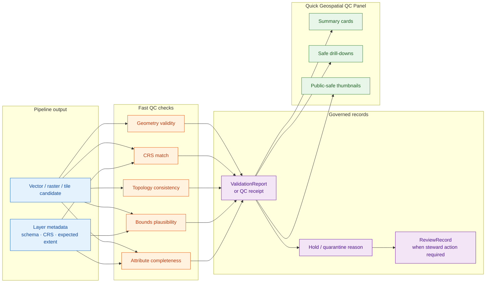

<!-- [KFM_META_BLOCK_V2]
doc_id: kfm://doc/<uuid-pending>
title: Quick Geospatial QC Panel — specification
type: standard
version: v0.2
status: draft
owners: <pipeline-steward>, <domain-steward>  # PROPOSED placeholders; resolve before review
created: 2026-05-20
updated: 2026-06-12
policy_label: public
related:
  - docs/dashboards/README.md
  - docs/dashboards/operational/README.md
  - docs/dashboards/DASHBOARD_CATALOG.md
  - docs/dashboards/operational/COG_ZARR_REPRODUCIBILITY.md
  - docs/standards/GEOPARQUET.md
  - docs/doctrine/directory-rules.md
  - docs/doctrine/trust-membrane.md
  - docs/doctrine/lifecycle-law.md
  - docs/registers/DRIFT_REGISTER.md
  - docs/registers/VERIFICATION_BACKLOG.md
tags: [kfm, dashboards, operational, geospatial, qc, geometry, crs, topology, validation]
notes:
  - "Source card: KFM-P31-FEAT-0017 (Quick Geospatial QC Panel) — UNCHANGED, active."
  - "Card self-check: UNKNOWN — repository implementation status remains unverified."
  - "This is a SPEC for a dashboard, not the running dashboard."
  - "v0.2 polish strengthens the quick-panel-vs-validator boundary, adds repo fit, signal flow, guardrails, validation checks, rollback/drift handling, and an evidence boundary."
  - "All runtime paths, owners, SLOs, checker names, and dashboard implementation claims remain PROPOSED / NEEDS VERIFICATION until verified against mounted-repo evidence."
[/KFM_META_BLOCK_V2] -->

<a id="top"></a>

# Quick Geospatial QC Panel · `operational/GEOSPATIAL_QC_PANEL.md`

> Fast, inspectable **operational dashboard specification** for first-pass geometry, CRS, topology, bounds, and attribute sanity checks on KFM geospatial outputs. This file specifies the panel; it does **not** implement the dashboard, replace validators, or certify data for publication.

<p>
  
  
  
  
  
  
  
  
</p>

**Status:** draft · **Owners:** `<pipeline-steward>`, `<domain-steward>` (PROPOSED) · **Last reviewed:** 2026-06-12 · **Spec path:** `docs/dashboards/operational/GEOSPATIAL_QC_PANEL.md`

> [!IMPORTANT]
> **Quick QC is not validation.** A green panel means the output passed fast, dashboard-visible sanity checks. It does **not** admit data, publish a layer, resolve evidence, clear rights, pass sensitivity policy, or replace the full `ValidationReport`. The panel exists to catch obvious geospatial defects early and route them to the right receipt, validator, steward, or quarantine path.

> [!CAUTION]
> **No sensitive geometry leakage.** Thumbnails, examples, drill-down rows, and sampled features shown by this panel MUST be public-safe or steward-only according to policy. Exact restricted locations, archaeology, rare species, private-landowner data, critical infrastructure, and living-person location data must fail closed, generalize, redact, or stay out of the panel.

---

## Contents

1. [Scope](#1-scope)
2. [Repo fit](#2-repo-fit)
3. [What this panel is — and is not](#3-what-this-panel-is--and-is-not)
4. [Signal flow](#4-signal-flow)
5. [Checks surfaced](#5-checks-surfaced-proposed)
6. [Panel contracts](#6-panel-contracts-proposed)
7. [Inputs and evidence](#7-inputs-and-evidence)
8. [Outputs and non-outputs](#8-outputs-and-non-outputs)
9. [Guardrails](#9-guardrails)
10. [Files and implementation pointers](#10-files-and-implementation-pointers)
11. [Ownership and review burden](#11-ownership-and-review-burden)
12. [Acceptance checklist](#12-acceptance-checklist)
13. [Validation and maintenance](#13-validation-and-maintenance)
14. [Drift, rollback, and supersession](#14-drift-rollback-and-supersession)
15. [Open questions](#15-open-questions)
16. [Evidence boundary](#16-evidence-boundary)
17. [Changelog](#17-changelog)
18. [Related docs](#18-related-docs)

---

## 1. Scope

The Quick Geospatial QC Panel answers one operational question:

> **Does this geospatial output look structurally sane enough to continue toward full validation, review, and catalog closure?**

It surfaces fast checks for geospatial outputs produced by pipelines, including:

- geometry validity;
- coordinate reference system (CRS) declaration and expected projection alignment;
- topology consistency;
- bounds and extent plausibility;
- required attribute completeness;
- optional sample thumbnails or count summaries where safe to display.

This panel is most useful during **WORK → PROCESSED** and **PROCESSED → CATALOG** preparation. It is an early warning surface for stewards, not a release authority.

[↑ Back to top](#top)

---

## 2. Repo fit

```text
docs/
└── dashboards/                                      # PROPOSED dashboard-spec lane
    ├── README.md                                   # lane orientation
    ├── DASHBOARD_CATALOG.md                        # spec index
    └── operational/                                # per-card operational dashboard specs
        ├── README.md                               # operational lane contract
        ├── COG_ZARR_REPRODUCIBILITY.md             # related artifact reproducibility spec
        └── GEOSPATIAL_QC_PANEL.md                  # this file
```

| Direction | Path / object | Relationship | Status |
|---|---|---|---|
| Upstream | `docs/dashboards/operational/README.md` | Defines the operational dashboard-spec lane: feed, artifact, and QC dashboards; specs only, not implementations. | CONFIRMED repo file; lane authority PROPOSED |
| Upstream | Atlas card `KFM-P31-FEAT-0017` | Source-card lineage for this panel. | LINEAGE / doctrine corpus; implementation UNKNOWN |
| Upstream | `docs/standards/GEOPARQUET.md` | Expected standard reference for vector artifact posture. | NEEDS VERIFICATION |
| Upstream | `schemas/contracts/v1/...` | Machine shape for QC receipts, validation reports, layer manifests, or dashboard payloads. | PROPOSED / NEEDS VERIFICATION |
| Upstream | `tools/validators/` | Deterministic checks that enforce geometry / CRS / topology validity. | PROPOSED / NEEDS VERIFICATION |
| Downstream | `apps/review-console/` | Likely UI implementation surface for steward review. | PROPOSED / NEEDS VERIFICATION |
| Downstream | `data/receipts/`, `data/proofs/`, `release/` | Receipt/proof/release artifacts this panel may link to; this spec never stores them. | PROPOSED / NEEDS VERIFICATION |
| Governance | `docs/registers/DRIFT_REGISTER.md` | Logs any divergence between this spec, the dashboard catalog, and actual implementation. | PROPOSED entry target |

[↑ Back to top](#top)

---

## 3. What this panel is — and is not

| This panel is… | This panel is not… |
|---|---|
| A fast operational visibility surface for obvious geospatial defects. | The authoritative validator. |
| A way to route defects to `ValidationReport`, `ReviewRecord`, or quarantine work. | A release gate or publication approval. |
| A dashboard spec for implementers and stewards. | Running React/Grafana code, dashboard JSON, telemetry data, or generated reports. |
| A public-safe or steward-scoped view depending on policy. | A license to show exact restricted geometry, sensitive locations, or private data. |
| A companion to reproducibility and catalog closure work. | A substitute for EvidenceBundle, policy decision, review state, release manifest, or rollback card. |

> [!TIP]
> Use this panel to answer: *what broke, where, and which steward should inspect it next?* Do not use it to answer: *is this released, true, rights-cleared, or publishable?*

[↑ Back to top](#top)

---

## 4. Signal flow



> [!NOTE]
> The diagram is a **PROPOSED specification flow**. It does not prove that a validator, receipt schema, dashboard implementation, or runtime telemetry pipeline currently exists.

[↑ Back to top](#top)

---

## 5. Checks surfaced (PROPOSED)

| # | Check | Measures | Healthy posture | Negative state | Must link to |
|---:|---|---|---|---|---|
| 1 | Geometry validity | Percent and count of features with valid geometry under the chosen geometry rules. | 100% valid unless the source contract explicitly allows exceptions. | `GEOMETRY_INVALID` | `ValidationReport` or QC receipt |
| 2 | CRS correctness | Declared CRS is present and matches the expected CRS / projection policy for the artifact. | Declared CRS matches expected CRS. | `CRS_MISMATCH` | Layer metadata + schema / standard reference |
| 3 | Topology consistency | Self-intersections, gaps, slivers, overlaps, multipart anomalies, or domain-specific topology failures where not permitted. | No disallowed topology defects. | `TOPOLOGY_ERROR` | Validator result + domain rule reference |
| 4 | Bounds plausibility | Output extent falls within expected spatial bounds for the source, domain, county, state, or release envelope. | Within expected extent, with explicit tolerance. | `BOUNDS_OUT_OF_RANGE` | Expected-extent source |
| 5 | Attribute completeness | Required fields, IDs, timestamps, source refs, policy labels, and provenance handles are populated. | Required fields non-null and semantically usable. | `ATTRIBUTE_MISSING` | Schema / contract / catalog profile |
| 6 | Feature-count anomaly | Feature count or null-geometry count deviates sharply from the prior accepted run. | Stable or explained by a steward note / source update. | `COUNT_ANOMALY` | Prior-run receipt / lineage record |
| 7 | Public-safe preview status | Whether the panel can safely show sampled geometry, thumbnails, or drill-down rows. | Public-safe preview or steward-only access decision recorded. | `PREVIEW_REDACTED` / `PREVIEW_DENIED` | Policy decision / sensitivity review |

> [!IMPORTANT]
> The negative-state names above are **PROPOSED vocabulary bindings** until reconciled with the canonical negative-state register. If the implemented vocabulary differs, keep the canonical register and update this spec.

[↑ Back to top](#top)

---

## 6. Panel contracts (PROPOSED)

| Panel | Shows | Required behavior | Failure posture |
|---|---|---|---|
| **QC summary** | Overall pass/warn/fail counts by check and artifact. | Shows the latest checked run and links to its receipt. | Missing receipt displays `MISSING_QC_RECEIPT`, not a blank green state. |
| **Geometry validity** | Valid/invalid feature counts, invalid geometry types, sample IDs. | Drill-down must link to safe feature identifiers, not raw restricted geometry. | Invalid geometries route to validation or quarantine review. |
| **CRS** | Declared CRS, expected CRS, mismatch reason, transform hint if known. | Shows source of expected CRS and whether transformation was performed. | Mismatch blocks catalog-eligible status until resolved or explicitly waived. |
| **Topology** | Error counts by topology class. | Domain-specific topology rules must be named or marked `UNKNOWN`. | Unknown topology rule shows `NEEDS_RULE`, not pass. |
| **Bounds** | Bounding box / centroid sanity and optional safe thumbnail. | Expected extent source must be named; thumbnails must obey sensitivity policy. | Out-of-range bounds route to steward review. |
| **Attributes** | Required-field completeness, missing provenance fields, null IDs. | Required fields must point to schema / contract source. | Missing authority fields block release-eligible posture. |
| **Preview safety** | Whether geometry samples can be rendered in the panel. | Uses policy result and sensitivity tags before rendering. | Deny or redact exact geometry when sensitivity is unresolved. |

[↑ Back to top](#top)

---

## 7. Inputs and evidence

Mounted-repo paths and exact schemas remain **NEEDS VERIFICATION**.

| Input | Purpose | Expected owner | Status |
|---|---|---|---|
| Geospatial outputs | Vector / raster / tile candidates being checked. | Pipeline steward | PROPOSED |
| `ValidationReport` or QC receipt | Records geometry, CRS, topology, bounds, and attribute outcomes. | Pipeline steward | PROPOSED |
| Layer schema / contract | Defines required attributes and allowed geometry types. | Domain steward / contract owner | PROPOSED |
| Expected-extent metadata | Defines acceptable bounds for a source, domain, county, state, or release envelope. | Domain steward | PROPOSED |
| Source descriptor | Supplies source role, rights, sensitivity, cadence, and source constraints. | Source steward | PROPOSED |
| Policy decision | Determines whether thumbnails, samples, or drill-downs are public-safe. | Policy / sensitivity steward | PROPOSED |
| Prior accepted run | Supports feature-count anomaly checks and regression detection. | Pipeline steward | PROPOSED |

[↑ Back to top](#top)

---

## 8. Outputs and non-outputs

### Outputs this spec allows

- Dashboard panels, summaries, and public-safe / steward-safe drill-downs.
- Links to receipts, validation reports, steward review records, and drift entries.
- Proposed negative-state display rules for geospatial QC failures.
- A fast review surface for deciding whether to continue, hold, or quarantine a candidate.

### Outputs this spec forbids

- Raw geospatial data copies.
- Sensitive geometry previews without policy clearance.
- Generated `ValidationReport` contents authored by the dashboard itself.
- Release manifests, rollback cards, evidence bundles, proofs, or policy decisions.
- Any claim that QC success equals publication readiness.

[↑ Back to top](#top)

---

## 9. Guardrails

### 9.1 Lifecycle guardrails

The panel MUST preserve the KFM lifecycle boundary:

```text
RAW -> WORK / QUARANTINE -> PROCESSED -> CATALOG / TRIPLET -> PUBLISHED
```

Operational QC may inspect candidates in `WORK`, `QUARANTINE`, or `PROCESSED` depending on steward authorization, but public-facing views MUST NOT expose internal lifecycle data directly.

### 9.2 Sensitive geometry guardrails

The panel MUST fail closed for:

- precise rare-species locations;
- archaeology, burial, sacred, or culturally sensitive sites;
- private landowner-sensitive geometry;
- living-person location data;
- critical infrastructure details;
- security-relevant or public-safety-sensitive geometry.

Safe alternatives include generalized bounding boxes, coarse grid cells, count-only summaries, redacted thumbnails, steward-only access, or a `PREVIEW_DENIED` state.

### 9.3 Validator anti-collapse guardrail

The panel MUST point to validators; it MUST NOT become a validator by convention. If dashboard code starts computing trust-bearing outcomes, move that logic to `tools/validators/`, add tests, and have the panel read the emitted receipt.

[↑ Back to top](#top)

---

## 10. Files and implementation pointers

| Path / surface | Role | Status |
|---|---|---|
| `docs/dashboards/operational/GEOSPATIAL_QC_PANEL.md` | This dashboard specification. | CONFIRMED repo path; content updated in this draft |
| `docs/dashboards/operational/README.md` | Operational dashboard lane contract. | CONFIRMED repo file |
| `docs/dashboards/DASHBOARD_CATALOG.md` | Catalog row should point to this spec. | NEEDS VERIFICATION |
| `docs/standards/GEOPARQUET.md` | Likely vector artifact standard reference. | NEEDS VERIFICATION |
| `apps/review-console/` | Proposed running surface for QC panel. | PROPOSED / NEEDS VERIFICATION |
| `tools/validators/` | Proposed home for deterministic geospatial validators. | PROPOSED / NEEDS VERIFICATION |
| `schemas/contracts/v1/...` | Proposed home for QC receipt / validation report schemas. | PROPOSED / NEEDS VERIFICATION |

[↑ Back to top](#top)

---

## 11. Ownership and review burden

| Concern | Owner / reviewer | Status |
|---|---|---|
| QC check plumbing | Pipeline steward | PROPOSED placeholder |
| Expected extent and domain-specific geometry rules | Domain steward | PROPOSED placeholder |
| Sensitive preview / redaction / suppression | Sensitivity reviewer | PROPOSED; required when applicable |
| Dashboard implementation | Review-console or observability steward | PROPOSED / NEEDS VERIFICATION |
| Documentation integrity | Docs steward | PROPOSED |
| Validator logic | Validator owner / pipeline steward | PROPOSED |

Review SHOULD include the docs steward, pipeline steward, relevant domain steward, and sensitivity reviewer when geometry can expose sensitive places or people.

[↑ Back to top](#top)

---

## 12. Acceptance checklist

- [ ] All required checks are represented: geometry, CRS, topology, bounds, attributes.
- [ ] The quick-panel-vs-validator boundary is visible in the UI copy.
- [ ] Every panel links to a receipt, validator output, or explicit `NEEDS VERIFICATION` placeholder.
- [ ] Sensitive geometry preview behavior is fail-closed and policy-backed.
- [ ] Owners are resolved; no anonymous spec at v1.
- [ ] This spec has a row in `docs/dashboards/DASHBOARD_CATALOG.md`.
- [ ] Negative-state vocabulary is reconciled with the canonical register.
- [ ] Link check passes from `docs/dashboards/operational/`.
- [ ] Any implementation pointer names an actual verified surface or remains `NEEDS VERIFICATION`.

[↑ Back to top](#top)

---

## 13. Validation and maintenance

| Check | Why it matters | Status |
|---|---|---|
| Link check | Prevents stale references to sibling specs, standards, and dashboard catalog entries. | NEEDS VERIFICATION |
| Dashboard catalog row | Keeps the per-card spec discoverable. | NEEDS VERIFICATION |
| Negative-state vocabulary check | Prevents dashboard-specific error names from drifting into parallel authority. | PROPOSED |
| Validator receipt presence check | Prevents the panel from showing green without a record. | PROPOSED |
| Sensitive-preview policy check | Prevents geometry leakage through thumbnails, labels, drill-down rows, and examples. | PROPOSED |
| Drift-register sweep | Captures divergence between spec, implementation, and validator behavior. | PROPOSED |

Maintenance cadence: review when any geospatial validator changes, a domain expected extent changes, a layer schema changes, a new sensitive lane is added, or the running review-console implementation is confirmed.

[↑ Back to top](#top)

---

## 14. Drift, rollback, and supersession

Rollback or supersession is required if this spec:

- implies the panel can publish or admit data;
- duplicates validator logic instead of reading emitted receipts;
- exposes sensitive geometry or sample records in an unsafe way;
- creates a parallel negative-state vocabulary;
- points to unverified implementation as if it exists;
- conflicts with `docs/dashboards/operational/README.md`, Directory Rules, or accepted ADRs.

Rollback target: restore the prior `v0.1` draft and retain this v0.2 work as a superseded proposal until the conflict is resolved.

[↑ Back to top](#top)

---

## 15. Open questions

- [ ] **GQC-OQ-01 — Running surface.** Confirm whether the panel renders in `apps/review-console/`, an external observability surface, or another governed UI.
- [ ] **GQC-OQ-02 — Expected extent source.** Confirm the canonical home for per-domain expected extents and CRS expectations.
- [ ] **GQC-OQ-03 — Implementation status.** Confirm `KFM-P31-FEAT-0017` implementation status against mounted-repo evidence.
- [ ] **GQC-OQ-04 — Negative-state vocabulary.** Reconcile `GEOMETRY_INVALID`, `CRS_MISMATCH`, `TOPOLOGY_ERROR`, `BOUNDS_OUT_OF_RANGE`, `ATTRIBUTE_MISSING`, `COUNT_ANOMALY`, `PREVIEW_REDACTED`, and `PREVIEW_DENIED` against the canonical negative-state register.
- [ ] **GQC-OQ-05 — Preview safety policy.** Decide whether preview safety belongs in the QC panel spec, a separate UI policy, or a reusable dashboard component contract.
- [ ] **GQC-OQ-06 — Raster scope.** Decide whether this panel covers rasters only for bounds / CRS thumbnails, or whether raster QC belongs exclusively with `COG_ZARR_REPRODUCIBILITY.md`.

[↑ Back to top](#top)

---

## 16. Evidence boundary

| Evidence | Status | Supports | Does not prove |
|---|---|---|---|
| Current `GEOSPATIAL_QC_PANEL.md` draft | CONFIRMED repo file | Existing path, v0.1 meta block, source-card lineage, initial checks and panels. | Runtime implementation, schema presence, validator behavior. |
| `docs/dashboards/operational/README.md` | CONFIRMED repo file | Operational dashboard specs are specifications only; running implementations and telemetry live elsewhere. | That all listed dashboard specs are implemented. |
| `docs/doctrine/directory-rules.md` | CONFIRMED repo file | Responsibility-root split: docs explain; schemas, policy, tools, apps, data, and release objects live elsewhere. | That every referenced subpath currently exists. |
| User-provided v0.1 content | CONFIRMED input | Source text and desired polish target. | Current repo behavior beyond the file text. |

[↑ Back to top](#top)

---

## 17. Changelog

| Version | Date | Change |
|---|---|---|
| v0.2 | 2026-06-12 | Polished specification; strengthened quick-QC-vs-validator boundary; added repo fit, signal flow, panel contracts, inputs/outputs, sensitive-geometry guardrails, validation/maintenance checks, drift/rollback, evidence boundary, and expanded open questions. |
| v0.1 | 2026-05-20 | Initial draft from Atlas card `KFM-P31-FEAT-0017`. |

[↑ Back to top](#top)

---

## 18. Related docs

- [`operational/README.md`](README.md) — operational dashboard-spec lane.
- [`dashboards/README.md`](../README.md) — dashboard documentation lane.
- [`DASHBOARD_CATALOG.md`](../DASHBOARD_CATALOG.md) — dashboard spec index.
- [`operational/COG_ZARR_REPRODUCIBILITY.md`](COG_ZARR_REPRODUCIBILITY.md) — related raster / datacube reproducibility dashboard.
- [`standards/GEOPARQUET.md`](../../standards/GEOPARQUET.md) — GeoParquet standard reference (**NEEDS VERIFICATION**).
- [`doctrine/directory-rules.md`](../../doctrine/directory-rules.md) — placement and responsibility-root doctrine.
- [`registers/DRIFT_REGISTER.md`](../../registers/DRIFT_REGISTER.md) — drift entries for spec / implementation divergence.
- [`registers/VERIFICATION_BACKLOG.md`](../../registers/VERIFICATION_BACKLOG.md) — unresolved implementation and path verification.

---

<sub>Last updated: 2026-06-12 · Version: v0.2 · Status: draft · Owners: `<pipeline-steward>`, `<domain-steward>` (PROPOSED) · Implementation: NEEDS VERIFICATION · [Back to top](#top)</sub>
