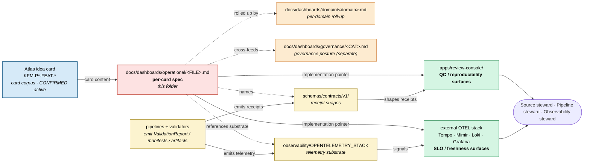

<!-- [KFM_META_BLOCK_V2]
doc_id: kfm://doc/dashboards-operational-readme
title: Operational Dashboard Specifications (PROPOSED lane; feed / artifact / QC dashboards)
type: standard
version: v1
status: draft
owners: OWNER_TBD  # NEEDS VERIFICATION: docs steward + source steward + pipeline steward + observability steward
created: 2026-05-26
updated: 2026-05-26
policy_label: public
related:
  - kfm://doc/dashboards-readme                              # CONFIRMED authored sibling: docs/dashboards/README.md
  - kfm://doc/dashboards-indicator-catalog                   # CONFIRMED authored sibling: docs/dashboards/INDICATOR_CATALOG.md
  - kfm://doc/dashboards-dashboard-catalog                   # CONFIRMED authored sibling: docs/dashboards/DASHBOARD_CATALOG.md
  - kfm://doc/dashboards-governance-readme                   # CONFIRMED authored sibling: docs/dashboards/governance/README.md
  - kfm://doc/dashboards-observability-readme                # PROPOSED authored sibling: docs/dashboards/observability/README.md
  - kfm://doc/directory-rules                                # CONFIRMED: docs/doctrine/directory-rules.md
  - kfm://adr/dashboards-lane-existence                      # PROPOSED candidate: OPEN-DASH-01
tags: [kfm, dashboards, operational, feeds, artifacts, qc, slo, readme]
notes:
  - PROPOSED lane (`docs/dashboards/`). Lane existence is ADR-class per OPEN-DASH-01.
  - Operational dashboards are **card-driven** (one spec per Atlas idea card), not category-driven.
  - Operational dashboards watch the pipeline's day-to-day health — feeds, artifacts, and QC. They are distinct from governance posture dashboards.
[/KFM_META_BLOCK_V2] -->

# Operational Dashboard Specifications

<!-- [doc: kfm://doc/dashboards-operational-readme] -->
<a id="top"></a>

> Per-card **operational dashboard specifications** — feed health, artifact reproducibility, and QC panels. **This folder specifies; it does not implement.** Implementations live in `apps/` and external observability stacks; the cards each spec mirrors live in the Atlas idea-cards corpus.

<p>
  
  
  
  
  
  
  
</p>

> [!IMPORTANT]
> **Truth posture.** The four operational spec files in this folder mirror **CONFIRMED active** Atlas idea cards, but the dashboards themselves are **PROPOSED designs**. The lane `docs/dashboards/` is PROPOSED per OPEN-DASH-01. Implementation status is **NEEDS VERIFICATION** — no running surface is confirmed against mounted-repo evidence yet.

> [!CAUTION]
> **Feed / artifact / QC, not governance.** Operational dashboards report pipeline health (is the feed fresh, is the artifact reproducible, did the QC checks pass). Governance posture (cite-or-abstain compliance, sensitive-lane fail-closed rate, supersession lineage gaps) lives in `docs/dashboards/governance/`. A spec here that drifts into governance indicators is parallel authority.

> [!NOTE]
> **Anti-collapse rule.** Operational dashboards report posture; the validators and SLO checkers enforce it. A green dashboard does not substitute for the underlying `ValidationReport`, manifest, or QC artifact.

---

## Contents

1. [Scope](#1-scope)
2. [Repo fit](#2-repo-fit)
3. [Accepted inputs](#3-accepted-inputs)
4. [Exclusions](#4-exclusions)
5. [Per-card inventory](#5-per-card-inventory)
6. [Specification template](#6-specification-template)
7. [Integration with cards, governance, and observability](#7-integration-with-cards-governance-and-observability)
8. [Indicator-to-implementation flow](#8-indicator-to-implementation-flow)
9. [Verification checklist](#9-verification-checklist)
10. [Maintenance task list](#10-maintenance-task-list)
11. [Open questions & ADR cross-reference](#11-open-questions--adr-cross-reference)
12. [Evidence basis & citations](#12-evidence-basis--citations)

---

## 1. Scope

This folder hosts **per-card operational dashboard specification files** — one file per Atlas idea card describing an operational dashboard:

- which **operational signals** the dashboard surfaces (freshness, schema validation, SLO, reproducibility verdict, QC pass/fail);
- the **panels** that render each signal and the **negative state** vocabulary they emit;
- the **receipts, manifests, and artifacts** the dashboard reads;
- who **owns** the dashboard (typically source steward, pipeline steward, or observability steward);
- where the **implementation** lives (`apps/`, external OTEL stack, or `UNKNOWN`).

The specifications are **read-only references** for implementers. The receipts and artifacts the dashboards measure live in their normal homes (`data/`, `release/manifests/`, `data/receipts/`). The dashboards themselves render in `apps/review-console/` or in external observability stacks (Tempo, Mimir, Loki, Grafana).

> [!TIP]
> If you're looking for governance posture (cite-or-abstain, fail-closed rate, rollback coverage), go to `docs/dashboards/governance/`. If you're looking for **how a specific domain instances operational signals** (e.g., transit-feed SLO roll-up under roads-rail-trade), go to the relevant `docs/dashboards/domain/<domain>.md`. If you're looking for the actual running dashboard, follow the implementation pointer in the per-card spec.

[↑ back to top](#top)

---

## 2. Repo fit

```text
docs/
└── dashboards/                                  # PROPOSED lane (Directory Rules §6.1 does not list this)
    ├── README.md                                # PROPOSED parent README
    ├── INDICATOR_CATALOG.md                     # PROPOSED — mirror of Atlas v1.1 §24.11
    ├── DASHBOARD_CATALOG.md                     # PROPOSED — index of all dashboard specs
    ├── governance/                              # per-category governance-health specs
    ├── operational/                             # THIS FOLDER — feed / artifact / QC dashboards
    │   ├── README.md                            # THIS FILE
    │   ├── SLO_LIVE_FEEDS.md                    # ✅ KFM-P11-FEAT-0002
    │   ├── REALTIME_FEED_FRESHNESS.md           # ✅ KFM-P31-FEAT-0015
    │   ├── COG_ZARR_REPRODUCIBILITY.md          # ✅ KFM-P31-FEAT-0016
    │   └── GEOSPATIAL_QC_PANEL.md               # ✅ KFM-P31-FEAT-0017
    ├── domain/                                  # per-domain dashboard specs
    └── observability/                           # CI / pipeline observability (OTEL stack)
```

**Upstream authorities.**

| Upstream | Relationship |
|:---|:---|
| Atlas idea-cards corpus (`KFM-P11-FEAT-0002`, `KFM-P31-FEAT-0015/16/17`) | **Card source** — each spec in this folder mirrors a single active card. A spec without a card is parallel authority. |
| Atlas v1.1 §24.2 — Receipt Catalog | Shapes the receipts (`ValidationReport`, `ReleaseManifest`, build/QC artifacts) the dashboards read. |
| `connectors/`, `data/registry/`, `data/receipts/` | Source descriptors and emitted receipts that operational dashboards read. |
| `docs/dashboards/observability/OPENTELEMETRY_STACK.md` | Telemetry substrate — several operational dashboards (`SLO_LIVE_FEEDS`, `REALTIME_FEED_FRESHNESS`) consume signals from the OTEL stack. |
| `docs/doctrine/directory-rules.md` | Places `docs/` lanes; this lane is not yet placed. See §11 OPEN-DASH-01. |

**Downstream consumers.**

| Downstream | Relationship |
|:---|:---|
| `apps/review-console/`, future `apps/dashboards/` | **Implementations** for QC and reproducibility surfaces. |
| External OTEL stack (Tempo + Mimir + Loki + Grafana) | **Implementations** for SLO and freshness surfaces. |
| `docs/dashboards/domain/<domain>.md` | Per-domain specs may **roll up** operational posture (e.g., roads-rail-trade rolls up transit SLOs). Specs here remain authoritative. |
| `docs/dashboards/governance/EVIDENCE_INTEGRITY.md` | Quarantine and stale-source signals visible here also feed the governance Evidence Integrity dashboard. |
| `docs/registers/DRIFT_REGISTER.md` | Logs spec ↔ implementation divergence. |

[↑ back to top](#top)

---

## 3. Accepted inputs

Files that belong in this folder:

- **One `<CARD_NAME>.md` per active operational Atlas idea card.** File name uses `UPPERCASE_WITH_UNDERSCORES.md` per Directory Rules §6.1.a.
- **This README** (`README.md`).
- Optional `<CARD>/figures/` sub-folder for separately-versioned diagrams (PROPOSED).

Each per-card spec MUST:

- name the **source card** (`KFM-P*-FEAT-*` or `KFM-P*-PROG-*`) and its lifecycle status (`UNCHANGED`, `EXPANDED`, etc.);
- declare the **operational signals** the dashboard surfaces;
- name the **receipt / artifact source** for each signal;
- name the **owning steward(s)** (per Atlas §24.7);
- point to its **implementation home** (`apps/...`, external stack, or `UNKNOWN`);
- define an **acceptance** checklist for "correct enough to publish."

[↑ back to top](#top)

---

## 4. Exclusions

| ❌ Do not put here | ✅ Belongs in |
|:---|:---|
| Dashboard implementations (React, Grafana JSON, dashboards-as-code) | `apps/<dashboard-app>/`, external OTEL stack |
| Telemetry plumbing or signal-emission code | `runtime/observability/`, OTEL collector config in `infra/observability/` |
| Schema definitions for receipts / reports | `schemas/contracts/v1/<family>/` |
| Policy bundles | `policy/<scope>/` |
| **Governance-posture indicators** (cite-or-abstain, fail-closed, rollback coverage) | `docs/dashboards/governance/<CATEGORY>.md` |
| **Per-domain instances** of operational signals | `docs/dashboards/domain/<domain>.md` |
| Observability-stack architecture (OTEL/Tempo/Mimir/Loki) | `docs/dashboards/observability/OPENTELEMETRY_STACK.md` |
| Validator / SLO-checker code | `tools/validators/`, `tests/...` |
| New backlog items | `docs/backlog/` |
| ADRs about dashboard architecture | `docs/adr/` |
| Operational dashboards' real-time data | Live telemetry stores; **never** mirrored as files here |
| Specs for cards that are not in the Atlas idea-cards corpus | Propose the card first, then author the spec |

> [!WARNING]
> **Card-source watch.** A spec here without a named, active source card is parallel authority. If a card retires, the spec should be marked SUPERSEDED or RETIRED with a forward link — not deleted silently.

[↑ back to top](#top)

---

## 5. Per-card inventory

### 5.1 Authored (✅) status

| Source card | Card lifecycle | File | Status | Documents |
|:---|:---:|:---|:---:|:---|
| [`KFM-P11-FEAT-0002`] | EXPANDED, active | [`SLO_LIVE_FEEDS.md`](SLO_LIVE_FEEDS.md) | ✅ | Standards-first SLOs for live transit and other high-cadence feeds: freshness, schema validation, latency, deduplication, non-material suppression, agency license terms. |
| [`KFM-P31-FEAT-0015`] | UNCHANGED, active | [`REALTIME_FEED_FRESHNESS.md`](REALTIME_FEED_FRESHNESS.md) | ✅ | Realtime feed health: schema validation, SLO freshness, canonical identity, partition output, promotion/hold state. |
| [`KFM-P31-FEAT-0016`] | UNCHANGED, active | [`COG_ZARR_REPRODUCIBILITY.md`](COG_ZARR_REPRODUCIBILITY.md) | ✅ | Raster/datacube artifacts: build container, GDAL/numcodecs versions, chained hashes, overview/block layout, reproducibility verdict. |
| [`KFM-P31-FEAT-0017`] | UNCHANGED, active | [`GEOSPATIAL_QC_PANEL.md`](GEOSPATIAL_QC_PANEL.md) | ✅ | Quick geospatial QC panel — fast inspectable surface for geometry / CRS / topology checks. |

### 5.2 Status legend

| Symbol | Meaning |
|:---:|:---|
| ✅ | Authored in this folder. |
| ⏳ | Proposed; not yet authored. |
| 🛠️ | In progress. |
| 🚫 | Withdrawn (not currently used). |
| 🔄 | Superseded by a later spec. |

> [!NOTE]
> **Growth path.** New operational cards (`KFM-P*-FEAT-*`) land here as they're authored — see §3 accepted inputs. Card-to-spec cardinality is **one-to-one**: a single spec MAY NOT mirror multiple cards.

[↑ back to top](#top)

---

## 6. Specification template

Each per-card spec file SHOULD follow this skeleton. This template matches the shape used by the four existing files in §5.1.

```markdown
<!-- KFM_META_BLOCK_V2 with type: standard, related: cross-references including the source card, INDICATOR_CATALOG.md, DASHBOARD_CATALOG.md, observability/OPENTELEMETRY_STACK.md if applicable -->

# <Dashboard Title> Dashboard · `operational/<FILE>.md`

> One-line scope statement naming the source card.

[badges: authority=PROPOSED, status=draft, category=operational, source=KFM-P*-FEAT-*, policy=public]

> [!IMPORTANT]
> Card self-check: <UNKNOWN | VERIFIED>. Mounted-repo implementation status: <NEEDS VERIFICATION | CONFIRMED>.

## 1. Description
What operational question this dashboard answers, in one paragraph.

## 2. Signals surfaced (PROPOSED)
Table: every signal, what it measures, healthy posture, negative state.

| # | Signal | Measures | Healthy posture (PROPOSED) | Negative state |
|---|---|---|---|---|
| 1 | <name> | <what it counts/computes> | <target> | `<NEGATIVE_STATE>` |
| … | …      | …                          | …          | …               |

## 3. Panels (PROPOSED)
One panel per signal (or per healthy-posture cut).

## 4. Inputs — receipts, manifests, artifacts read
CONFIRMED receipt types from Atlas v1.1 §24.2; mounted-repo paths NEEDS VERIFICATION.

## 5. Files
Spec path + running surface (PROPOSED `apps/<path>/`, external OTEL stack, or `UNKNOWN`).

## 6. Ownership and review burden
Owning stewards (PROPOSED, against Atlas §24.7) + review burden.

## 7. Acceptance
- [ ] All signals present.
- [ ] Every receipt/artifact type in §4 resolves to an Atlas v1.1 §24.2 entry or is honestly marked NEEDS VERIFICATION.
- [ ] Owners named (no anonymous spec at v1).
- [ ] Link check passes; spec has a row in DASHBOARD_CATALOG.md §3.
- [ ] Negative states use the Unified Doctrine §19 vocabulary.

## 8. Open questions
Local `<CARD>-OQ-NN` items if any.
```

> [!TIP]
> Keep specs **bounded**. A per-card spec should fit in a single Markdown file with the signals table as the centerpiece. Per-domain roll-ups belong in `docs/dashboards/domain/<domain>.md`, not here.

[↑ back to top](#top)

---

## 7. Integration with cards, governance, and observability

Each per-card spec is a **four-way bridge**:

| Direction | What it consumes | What it produces |
|:---|:---|:---|
| **Up to the Atlas idea card** | Card description, lifecycle status, owning intent. | A statement of the dashboard the card asks for, panel-by-panel. |
| **Sideways to `governance/`** | Nothing — operational signals are distinct from governance indicators. | Cross-references where operational signals also feed governance indicators (e.g., quarantine flow → §24.11.1). |
| **Sideways to `observability/OPENTELEMETRY_STACK.md`** | The telemetry substrate that emits the signals. | A statement of which OTEL signals (traces / metrics / logs) the dashboard reads. |
| **Down to `apps/`, OTEL stack** | Nothing — the spec does not consume implementations. | The implementation pointer (§5 of the template). |

### 7.1 Conflict resolution

| Conflict | Winner |
|:---|:---|
| Per-card spec vs source Atlas card | **Card wins.** If the card has drifted, propose a card update first; then update the spec. |
| Per-card spec vs governance indicator definition | **Governance wins.** If the operational signal is also a governance indicator, the governance definition is canonical; reference, do not redefine. |
| Per-card spec vs `apps/` actual implementation | **The implementation is the operational truth**, but the divergence is a **drift signal** — log it. Specs should never silently match implementations that violate the source card. |
| Per-card spec vs OTEL-stack signal shape | **OTEL stack wins.** If the spec names a signal that does not exist in the stack, the spec is the defect. |

> [!IMPORTANT]
> Specs **describe**; cards **propose**; pipelines **enforce**; implementations **render**.

[↑ back to top](#top)

---

## 8. Indicator-to-implementation flow



*Cards (blue) authorize specs (red). Specs point to implementations (green) and reference the machinery (yellow). Per-domain roll-ups and governance cross-references (orange) read posture from the operational specs; they do not redefine the operational signals.*

[↑ back to top](#top)

---

## 9. Verification checklist

Apply before merging a new per-card spec or treating this folder as canonical.

- [ ] Confirm target path `docs/dashboards/operational/<FILE>.md` resolves under an accepted lane (OPEN-DASH-01).
- [ ] Confirm the source card exists in the Atlas idea-cards corpus and is active (not RETIRED / SUPERSEDED).
- [ ] Confirm card-to-spec cardinality is one-to-one.
- [ ] Confirm the spec's implementation pointer resolves to an `apps/` path, an external stack handle, or is honestly marked `UNKNOWN`.
- [ ] Confirm the spec's receipt / artifact references resolve to Atlas v1.1 §24.2 entries or are marked `NEEDS VERIFICATION`.
- [ ] Confirm no spec **claims governance authority** (cite-or-abstain, fail-closed rate, etc.) without cross-referencing `docs/dashboards/governance/`.
- [ ] Confirm negative-state vocabulary matches Unified Doctrine §19.
- [ ] Confirm owners named or carry `OWNER_TBD` + NEEDS VERIFICATION note.
- [ ] Confirm row exists in `DASHBOARD_CATALOG.md` §3 (Operational dashboards).

[↑ back to top](#top)

---

## 10. Maintenance task list

- [ ] **Inventory sync.** §5.1 status column reflects actual files in this folder.
- [ ] **Card sync.** When a source card is updated, RETIRED, or SUPERSEDED, the corresponding spec is reviewed.
- [ ] **OTEL-stack sync.** When the telemetry substrate (`observability/OPENTELEMETRY_STACK.md`) changes signal shape, every spec that consumes those signals is reviewed.
- [ ] **Governance cross-feed watch.** If an operational signal becomes a governance indicator, the cross-reference is added (no redefinition).
- [ ] **Implementation drift watch.** When an `apps/<dashboard>/` or external-stack dashboard changes, the spec's implementation pointer is verified.
- [ ] **No governance authority creep.** Periodic check: no operational spec defines governance indicators.
- [ ] **Parallel-authority watch.** This folder does not grow non-spec content.
- [ ] **Owner roster updated.** Each spec's `owners:` reflects current Atlas §24.7 reconciliation.

[↑ back to top](#top)

---

## 11. Open questions & ADR cross-reference

| # | Question | Class | Cross-reference |
|:---|:---|:---|:---|
| **OPEN-DASH-01** | Should `docs/dashboards/` exist as a lane? | ADR-class | Directory Rules §2.4(5); §6.1. |
| **OPEN-DASH-O-01** | Where do operational-dashboard **implementations** live? `apps/review-console/`, external OTEL stack, a new `apps/dashboards/`, or split per-card? | Directory class | Parallels OPEN-DASH-03 (per-domain) and OPEN-DASH-G-01 (governance). |
| **OPEN-DASH-O-02** | Should SLO targets in `SLO_LIVE_FEEDS.md` be pinned per-agency or per-standard (GTFS-RT vs. agency contract)? | Contract class | Relates to `KFM-P11-FEAT-0002` card text. |
| **OPEN-DASH-O-03** | **Per-domain roll-ups** (e.g., roads-rail-trade rolls up `SLO_LIVE_FEEDS`) — does the operational spec name the rolling-up domains, or is the relationship discovered from the domain spec only? | Scoping class | Parallels per-domain ↔ per-category linkage. |
| **OPEN-DASH-O-04** | Reproducibility-verdict shape in `COG_ZARR_REPRODUCIBILITY.md` — is it a single verdict per artifact, or per (artifact, environment) pair? | Contract class | Relates to `schemas/contracts/v1/release/`. |
| **OPEN-DASH-O-05** | **QC panel scope** — does `GEOSPATIAL_QC_PANEL.md` cover all domains or only the geometric subset (excluding e.g., genealogical / tabular QC)? | Scoping class | Cross-domain implication. |
| **OPEN-DASH-O-06** | When a source card is RETIRED, does the spec move to a `retired/` sub-folder or stay in place with a status badge? | Lifecycle class | Parallels Directory Rules §17. |

[↑ back to top](#top)

---

## 12. Evidence basis & citations

<details>
<summary><strong>Source ledger</strong></summary>

| Source | Status | Supports | Limits |
|:---|:---|:---|:---|
| Atlas idea-cards corpus — `KFM-P11-FEAT-0002`, `KFM-P31-FEAT-0015/16/17` | CONFIRMED (corpus) | §5.1 inventory; card-to-spec mapping. | Card lifecycle states are PROPOSED; mounted-repo implementation NEEDS VERIFICATION. |
| Atlas v1.1 §24.2 — Receipt Catalog | CONFIRMED (manuscript) | §3 receipt-source requirements; §6 template §4. | Receipt-shape paths NEEDS VERIFICATION at mounted-repo. |
| Atlas v1.1 §24.7 — Reviewer Role and SoD Matrix | CONFIRMED (manuscript) | §3 owning-steward requirement; §6 template §6. | Role-to-named-individual mapping NEEDS VERIFICATION. |
| `docs/dashboards/README.md` (parent) | CONFIRMED (this folder) | §2 repo fit; §5.1 file enumeration. | Parent README is PROPOSED. |
| `docs/dashboards/DASHBOARD_CATALOG.md` §3 | CONFIRMED (this folder) | §5.1 inventory rows; §9 verification checklist (catalog row required). | Catalog is PROPOSED. |
| `docs/dashboards/governance/README.md` | CONFIRMED authored sibling | §4 exclusions (governance posture lives there); §7 cross-feed pattern. | Same parallel-authority resolution model. |
| `docs/dashboards/observability/OPENTELEMETRY_STACK.md` | CONFIRMED authored sibling | §2 telemetry substrate; §7 OTEL cross-reference. | Stack spec is PROPOSED. |
| `docs/doctrine/directory-rules.md` §6.1, §2.4(5) | CONFIRMED (prior-session authored) | §2 repo fit; §4 exclusions. | `docs/dashboards/` does not appear in §6.1; OPEN-DASH-01. |

</details>

> [!NOTE]
> **Anti-collapse rule (reaffirmed).** An operational dashboard is one carrier of pipeline health; the health itself rests on validators, manifests, QC artifacts, and the telemetry stack that the spec **points to**. Replacing those artifacts with the spec — or replacing the spec with the rendered dashboard — collapses the layering this entire folder exists to preserve.

[↑ back to top](#top)

---

<sub>Per-card operational dashboard specifications. PROPOSED lane (`docs/dashboards/`) pending OPEN-DASH-01 ADR. **Specifications only — implementations live in `apps/` and external OTEL stacks; source cards live in the Atlas idea-cards corpus; governance posture lives in `docs/dashboards/governance/`; per-domain roll-ups live in `docs/dashboards/domain/`.** The source card wins on what the dashboard is for; the OTEL stack wins on signal shape; the validators win on enforcement.</sub>
