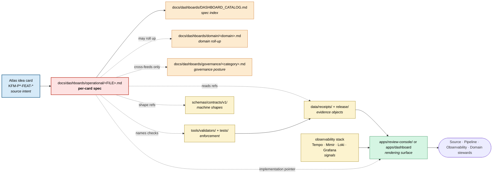

<!-- [KFM_META_BLOCK_V2]
doc_id: kfm://doc/dashboards-operational-readme
title: Operational Dashboard Specifications — feed, artifact, and QC dashboard specs
type: standard
version: v2
status: draft
owners: OWNER_TBD  # NEEDS VERIFICATION: docs steward + source steward + pipeline steward + observability steward
created: 2026-05-26
updated: 2026-06-12
policy_label: public
related:
  - kfm://doc/dashboards-readme                              # CONFIRMED authored sibling: docs/dashboards/README.md
  - kfm://doc/dashboards-indicator-catalog                   # CONFIRMED authored sibling: docs/dashboards/INDICATOR_CATALOG.md
  - kfm://doc/dashboards-dashboard-catalog                   # CONFIRMED authored sibling: docs/dashboards/DASHBOARD_CATALOG.md
  - kfm://doc/dashboards-governance-readme                   # CONFIRMED authored sibling: docs/dashboards/governance/README.md
  - kfm://doc/dashboards-observability-readme                # PROPOSED authored sibling: docs/dashboards/observability/README.md
  - kfm://doc/directory-rules                                # CONFIRMED: docs/doctrine/directory-rules.md
  - kfm://adr/dashboards-lane-existence                      # PROPOSED candidate: OPEN-DASH-01
tags: [kfm, dashboards, operational, feeds, artifacts, qc, slo, readme]
notes:
  - "v2 polish pass: preserves v1 card-driven operating model, sharpens specification-only boundaries, adds accepted-input / exclusion clarity, expands verification and rollback checks, and normalizes evidence-boundary language."
  - "PROPOSED lane (`docs/dashboards/`). Lane existence remains ADR-class per OPEN-DASH-01."
  - "Operational dashboards are card-driven: one spec per active Atlas idea card. They report pipeline health; they do not enforce, publish, or certify trust."
  - "Implementation status remains NEEDS VERIFICATION unless an app path, telemetry stack, validator, workflow, receipt, or emitted dashboard artifact is verified in the repo/runtime."
[/KFM_META_BLOCK_V2] -->

# Operational Dashboard Specifications

<!-- [doc: kfm://doc/dashboards-operational-readme] -->
<a id="top"></a>

> Per-card **operational dashboard specifications** for feed health, artifact reproducibility, and fast geospatial QC. This folder specifies what should be visible and reviewable; it does **not** implement dashboards, emit telemetry, run validators, or decide release state.

<p>
  
  
  
  
  
  
  
  
  
</p>

**Status:** draft · **Edition:** v2 · **Owners:** `OWNER_TBD` · **Last reviewed:** 2026-06-12 · **Truth posture:** card lineage CONFIRMED in doctrine corpus, implementation NEEDS VERIFICATION

---

> [!IMPORTANT]
> **Specification-only lane.** Files here describe operational dashboard intent, signals, panels, evidence objects, owners, and implementation pointers. They do not replace `ValidationReport`, source descriptors, manifests, telemetry, receipts, proofs, release decisions, or the running dashboard implementation.

> [!CAUTION]
> **Operational health is not governance posture.** This lane answers questions such as: *Is the feed fresh? Did the artifact rebuild? Did the QC panel flag geometry trouble?* Governance-health indicators such as cite-or-abstain compliance, sensitive-lane fail-closed rate, rollback coverage, and supersession gaps belong in `docs/dashboards/governance/` and the indicator catalog. A spec here that redefines governance indicators creates parallel authority.

> [!NOTE]
> **Anti-collapse rule.** Operational dashboards report posture; validators, SLO checkers, manifests, and receipts carry enforcement evidence. A green dashboard is a helpful signal, not a publication gate, proof, or EvidenceBundle.

---

## Contents

1. [Scope](#1-scope)
2. [Repo fit](#2-repo-fit)
3. [Accepted inputs](#3-accepted-inputs)
4. [Exclusions](#4-exclusions)
5. [Per-card inventory](#5-per-card-inventory)
6. [Specification template](#6-specification-template)
7. [Integration model](#7-integration-model)
8. [Signal-to-implementation flow](#8-signal-to-implementation-flow)
9. [Verification checklist](#9-verification-checklist)
10. [Maintenance task list](#10-maintenance-task-list)
11. [Open questions and ADR cross-reference](#11-open-questions-and-adr-cross-reference)
12. [Rollback and supersession](#12-rollback-and-supersession)
13. [Evidence basis](#13-evidence-basis)

---

## 1. Scope

`docs/dashboards/operational/` hosts **per-card operational dashboard specification files**. Each file mirrors one active Atlas idea card and turns it into a reviewable dashboard spec.

Operational specs document:

- **Signals** — freshness, schema validation, SLO status, reproducibility verdict, QC pass/fail, layout conformance, partition health, and related negative states.
- **Panels** — what the steward sees and what drill-outs should expose.
- **Evidence objects** — receipts, manifests, artifacts, validation reports, source descriptors, or telemetry handles that make each signal inspectable.
- **Ownership** — which steward role owns the dashboard and which roles review changes.
- **Implementation pointer** — where the running dashboard is expected to live, or `UNKNOWN` when unverified.
- **Open questions** — local dashboard questions that must be resolved before treating the spec as stable.

These files are **read-only references for implementers and reviewers**. The data they describe lives in the appropriate KFM responsibility roots: `data/`, `release/`, `schemas/`, `tools/validators/`, `apps/`, and external observability stacks.

> [!TIP]
> Use this folder when you are asking, *What operational panel should exist for this active card?* Use `docs/dashboards/governance/` for trust-posture indicators. Use `docs/dashboards/domain/` for per-domain roll-ups. Use `apps/` or the external observability stack for the running implementation.

[↑ back to top](#top)

---

## 2. Repo fit

```text
docs/
└── dashboards/                                  # PROPOSED lane; OPEN-DASH-01 decides long-term placement
    ├── README.md                                # parent orientation
    ├── INDICATOR_CATALOG.md                     # mirror of Atlas v1.1 Ch. 24.11
    ├── DASHBOARD_CATALOG.md                     # dashboard-spec index
    ├── governance/                              # governance-health dashboard specs
    ├── operational/                             # THIS FOLDER — feed / artifact / QC dashboard specs
    │   ├── README.md                            # this file
    │   ├── SLO_LIVE_FEEDS.md                    # KFM-P11-FEAT-0002
    │   ├── REALTIME_FEED_FRESHNESS.md           # KFM-P31-FEAT-0015
    │   ├── COG_ZARR_REPRODUCIBILITY.md          # KFM-P31-FEAT-0016
    │   └── GEOSPATIAL_QC_PANEL.md               # KFM-P31-FEAT-0017
    ├── domain/                                  # per-domain dashboard specs / roll-ups
    └── observability/                           # telemetry-substrate specifications
```

### 2.1 Upstream authorities

| Upstream | Relationship | Status |
|:---|:---|:---|
| Atlas idea-card corpus: `KFM-P11-FEAT-0002`, `KFM-P31-FEAT-0015`, `KFM-P31-FEAT-0016`, `KFM-P31-FEAT-0017` | Source card for each operational spec. A spec without a source card is parallel authority. | CONFIRMED doctrine corpus; implementation NEEDS VERIFICATION |
| Atlas v1.1 receipt / review / release doctrine | Names the receipt and artifact families that specs should point to. | CONFIRMED doctrine; repo field shapes NEEDS VERIFICATION |
| `docs/dashboards/README.md` | Parent lane contract: specs and catalogs only, not implementations or telemetry stores. | CONFIRMED authored sibling; lane still PROPOSED |
| `docs/dashboards/DASHBOARD_CATALOG.md` | Index row for each dashboard spec. | PROPOSED / NEEDS VERIFICATION |
| `docs/dashboards/observability/OPENTELEMETRY_STACK.md` | Telemetry substrate referenced by feed and freshness dashboards. | PROPOSED / NEEDS VERIFICATION |
| `docs/doctrine/directory-rules.md` | Placement doctrine. `docs/` is the human explanation root; lane existence remains OPEN-DASH-01. | CONFIRMED doctrine |

### 2.2 Downstream consumers

| Downstream | Relationship | Status |
|:---|:---|:---|
| `apps/review-console/` | Likely implementation surface for QC and reproducibility panels. | NEEDS VERIFICATION |
| External OTEL stack: Tempo · Mimir · Loki · Grafana | Likely implementation surface for SLO and freshness panels. | PROPOSED / NEEDS VERIFICATION |
| `tools/validators/` and `tests/` | Deterministic enforcement and proof checks that dashboards must not replace. | NEEDS VERIFICATION |
| `docs/dashboards/domain/<domain>.md` | Per-domain dashboard specs may roll up operational posture. | PROPOSED |
| `docs/dashboards/governance/` | Governance-health specs may reference operational signals without redefining them. | PROPOSED |
| `docs/registers/DRIFT_REGISTER.md` | Logs spec ↔ implementation drift and lane-placement conflicts. | PROPOSED entry; canonical register home per doctrine |

[↑ back to top](#top)

---

## 3. Accepted inputs

Files that belong in this folder:

- `README.md` — this folder contract.
- One `UPPERCASE_WITH_UNDERSCORES.md` file per active operational Atlas idea card.
- Optional `figures/` subfolders only when diagrams are separately versioned and referenced by the spec.
- Maintenance notes that directly update this folder's spec inventory, verification posture, or open questions.

Each per-card spec MUST:

1. Name the source card and lifecycle posture.
2. Declare that it is a **specification**, not the running dashboard.
3. List the operational signals and negative states it surfaces.
4. Identify the receipts, manifests, artifacts, telemetry handles, validators, or source descriptors that make the signal inspectable.
5. Name owning steward roles or use `OWNER_TBD` with a specific verification note.
6. Point to a running implementation home or mark it `UNKNOWN` / `NEEDS VERIFICATION`.
7. Include acceptance checks and local open questions.
8. Include an evidence boundary when any repo/runtime behavior is unverified.

[↑ back to top](#top)

---

## 4. Exclusions

| Do **not** put here | Proper home | Reason |
|:---|:---|:---|
| Running dashboard code, React components, Grafana JSON, queries, dashboards-as-code | `apps/<dashboard-app>/`, external observability repo / stack | Specs do not implement. |
| Telemetry plumbing, collectors, exporters, signal-emission code | `runtime/observability/`, `infra/observability/`, implementation repos | Docs must not become operational machinery. |
| Schema definitions for receipts, reports, or dashboard payloads | `schemas/contracts/v1/<family>/` | Schema home is separate from narrative docs. |
| Policy bundles or access-control logic | `policy/<scope>/` | Policy decides allow / deny / restrict / abstain. |
| Validator or SLO-checker code | `tools/validators/`, `tests/` | Enforcement belongs in deterministic tooling. |
| Generated metric snapshots, logs, traces, or time series | Live telemetry stores; never committed here | Avoid stale telemetry and sensitive leakage. |
| Receipts, proofs, evidence bundles, release manifests | `data/receipts/`, `data/proofs/`, `release/` | Evidence objects are not docs. |
| Governance-posture indicator definitions | `docs/dashboards/governance/`, `INDICATOR_CATALOG.md` | Prevents operational/governance authority collapse. |
| Per-domain roll-up dashboards | `docs/dashboards/domain/<domain>.md` | This folder stays card-driven, not domain-driven. |
| ADRs about dashboard architecture | `docs/adr/` | ADRs live in the ADR lane. |
| Specs for cards not in the Atlas idea-card corpus | Propose or admit the card first | A spec without a card is parallel authority. |

> [!WARNING]
> **Card-source watch.** A spec here without a named active source card should not merge. If a source card is retired, superseded, or contradicted, update the spec status and open a drift / supersession entry rather than silently deleting or repurposing the file.

[↑ back to top](#top)

---

## 5. Per-card inventory

### 5.1 Authored operational specs

| Source card | Card lifecycle | Spec file | Status | Documents |
|:---|:---:|:---|:---:|:---|
| `KFM-P11-FEAT-0002` | EXPANDED, active | [`SLO_LIVE_FEEDS.md`](SLO_LIVE_FEEDS.md) | ✅ draft | Standards-first SLOs for live transit and other high-cadence feeds: freshness, schema validation, latency, deduplication, non-material suppression, and agency terms. |
| `KFM-P31-FEAT-0015` | UNCHANGED, active | [`REALTIME_FEED_FRESHNESS.md`](REALTIME_FEED_FRESHNESS.md) | ✅ draft | Realtime feed health: schema validation, SLO freshness, canonical identity, partition output, and promotion / hold state. |
| `KFM-P31-FEAT-0016` | UNCHANGED, active | [`COG_ZARR_REPRODUCIBILITY.md`](COG_ZARR_REPRODUCIBILITY.md) | ✅ draft | Raster / datacube artifacts: build container, GDAL / numcodecs versions, chained hashes, overview / block layout, and reproducibility verdict. |
| `KFM-P31-FEAT-0017` | UNCHANGED, active | [`GEOSPATIAL_QC_PANEL.md`](GEOSPATIAL_QC_PANEL.md) | ✅ draft | Quick geospatial QC panel: fast inspectable surface for geometry, CRS, topology, bounds, and attribute checks. |

### 5.2 Status legend

| Symbol | Meaning |
|:---:|:---|
| ✅ | Authored in this folder. |
| ⏳ | Proposed but not yet authored. |
| 🛠️ | In progress. |
| 🔄 | Superseded by a later spec. |
| 🚫 | Withdrawn or retired; keep a forward link if already referenced. |

> [!NOTE]
> **Card-to-spec cardinality:** one active operational source card maps to one operational dashboard spec. A spec may point to domain roll-ups or governance cross-feeds, but it should not absorb multiple cards or redefine the card corpus.

[↑ back to top](#top)

---

## 6. Specification template

Each per-card spec SHOULD follow this shape unless a local ADR or parent README updates the convention.

```markdown
<!-- [KFM_META_BLOCK_V2]
doc_id: kfm://doc/<uuid-pending-or-stable-id>
title: <Dashboard Title> — specification
type: standard
version: v0.1
status: draft
owners: OWNER_TBD  # NEEDS VERIFICATION: <expected steward roles>
created: YYYY-MM-DD
updated: YYYY-MM-DD
policy_label: public
related:
  - docs/dashboards/README.md
  - docs/dashboards/operational/README.md
  - docs/dashboards/DASHBOARD_CATALOG.md
  - <source-card-or-kfm-id>
tags: [kfm, dashboards, operational]
notes:
  - "Source card: <KFM-P*-FEAT-*> (<title>) — <lifecycle>, active."
  - "This is a SPEC for a dashboard, not the running dashboard."
  - "Implementation status is NEEDS VERIFICATION unless repo/runtime evidence confirms it."
[/KFM_META_BLOCK_V2] -->

# <Dashboard Title> · `operational/<FILE>.md`

> One-line scope statement naming the source card and what the dashboard reports.


> [!IMPORTANT]
> State the boundary: dashboard signal ≠ validation proof ≠ release decision.

## 1. Description

What operational question this dashboard answers.

## 2. Signals surfaced (PROPOSED)

| # | Signal | Measures | Healthy posture (PROPOSED) | Negative state |
|---|---|---|---|---|
| 1 | <name> | <what it counts/computes> | <target> | `<NEGATIVE_STATE>` |

## 3. Panels (PROPOSED)

One panel per signal or one panel per review posture.

## 4. Inputs — receipts, manifests, artifacts read

List receipt / artifact families and mark mounted-repo paths NEEDS VERIFICATION unless verified.

## 5. Files

Spec path + running surface (`apps/...`, external OTEL stack, or `UNKNOWN`).

## 6. Ownership and review burden

Owning steward roles + review burden.

## 7. Acceptance

- [ ] All signals present.
- [ ] Receipt / artifact references resolve or are marked NEEDS VERIFICATION.
- [ ] Owner placeholders are resolved or explicitly carried.
- [ ] Link check passes.
- [ ] Row exists in `DASHBOARD_CATALOG.md`.
- [ ] Negative states are reviewed against the current vocabulary.

## 8. Open questions

Local `<CARD>-OQ-NN` items.
```

[↑ back to top](#top)

---

## 7. Integration model

Operational specs are a four-way bridge between cards, evidence objects, telemetry, and running surfaces.

| Direction | Consumes | Produces | Guardrail |
|:---|:---|:---|:---|
| Up to source card | Card description, lifecycle posture, owning intent | Dashboard spec scoped to one card | Card wins when the spec drifts. |
| Sideways to governance specs | Only cross-referenceable posture signals | Links, not redefinitions | Governance definitions win. |
| Sideways to observability | OTEL signal names and telemetry substrate | Signal expectations / dashboard panels | OTEL shape wins on implemented signal names. |
| Down to implementation | No direct runtime dependency | Implementation pointer and acceptance checklist | Implementation drift is logged, not silently normalized. |
| Down to validators / receipts | Receipt, manifest, artifact names | Inspectable evidence-object expectations | Validator / receipt wins on enforcement. |

> [!IMPORTANT]
> Specs **describe**; cards **propose**; validators and pipelines **enforce**; observability **emits**; apps and dashboard tools **render**.

[↑ back to top](#top)

---

## 8. Signal-to-implementation flow



[↑ back to top](#top)

---

## 9. Verification checklist

Apply before merging a new per-card spec or treating this folder as canonical.

- [ ] Confirm target path `docs/dashboards/operational/<FILE>.md` is accepted under OPEN-DASH-01 or marked PROPOSED.
- [ ] Confirm the source card exists in the Atlas idea-card corpus and is active.
- [ ] Confirm card-to-spec cardinality is one-to-one.
- [ ] Confirm the spec's implementation pointer resolves to an `apps/` path, external stack handle, or is honestly marked `UNKNOWN`.
- [ ] Confirm receipt / artifact references resolve to accepted object families or are marked `NEEDS VERIFICATION`.
- [ ] Confirm no spec claims governance authority without cross-reference to `docs/dashboards/governance/`.
- [ ] Confirm no spec claims a dashboard result is proof, admission, release, or publication.
- [ ] Confirm negative-state vocabulary is current, consistent, and tested where enforcement exists.
- [ ] Confirm owner placeholders are resolved or deliberately carried as `OWNER_TBD`.
- [ ] Confirm the corresponding row exists in `DASHBOARD_CATALOG.md`.
- [ ] Confirm links to standards, observability docs, and sibling specs resolve.

[↑ back to top](#top)

---

## 10. Maintenance task list

- [ ] **Inventory sync:** §5.1 matches files present under this folder.
- [ ] **Catalog sync:** every file in §5.1 appears in `DASHBOARD_CATALOG.md`.
- [ ] **Card sync:** when a source card is updated, retired, or superseded, review the matching spec.
- [ ] **OTEL-stack sync:** when the telemetry substrate changes signal shape, review specs that consume those signals.
- [ ] **Evidence-object sync:** when receipt, manifest, or validation object names change, update affected specs and schemas links.
- [ ] **Governance cross-feed watch:** if an operational signal becomes a governance indicator, add a cross-reference without redefining it.
- [ ] **Implementation drift watch:** when an app dashboard or external stack changes, verify each spec's implementation pointer.
- [ ] **No authority creep:** check that operational specs remain read-only specifications.
- [ ] **Owner roster sync:** replace `OWNER_TBD` as stewardship matures.

[↑ back to top](#top)

---

## 11. Open questions and ADR cross-reference

| ID | Question | Class | Cross-reference |
|:---|:---|:---|:---|
| **OPEN-DASH-01** | Should `docs/dashboards/` exist as a stable documentation lane, or should this material merge into `docs/reports/`, `docs/runbooks/`, or `control_plane/`? | ADR-class | Directory Rules parallel-home rule. |
| **OPEN-DASH-O-01** | Where do operational dashboard implementations live: `apps/review-console/`, external OTEL stack, new `apps/dashboards/`, or split per-card? | Directory / implementation class | Applies to every spec in this folder. |
| **OPEN-DASH-O-02** | Should feed SLO targets be pinned per agency, per standard, or per source descriptor? | Contract / source class | `SLO_LIVE_FEEDS.md`, `REALTIME_FEED_FRESHNESS.md`. |
| **OPEN-DASH-O-03** | Are per-domain roll-ups declared inside operational specs, or discovered only from domain dashboard specs? | Scoping class | `docs/dashboards/domain/`. |
| **OPEN-DASH-O-04** | Is the COG / Zarr reproducibility verdict single-artifact only, or keyed by `(artifact, environment)`? | Contract class | `COG_ZARR_REPRODUCIBILITY.md`, receipt schemas. |
| **OPEN-DASH-O-05** | Does the quick geospatial QC panel cover all geospatial domains, or only geometric layer outputs? | Scoping class | `GEOSPATIAL_QC_PANEL.md`, domain dashboards. |
| **OPEN-DASH-O-06** | When a source card retires, should the matching spec stay in place with `SUPERSEDED`, or move under a `retired/` folder? | Lifecycle class | Directory Rules migration discipline. |
| **OPEN-DASH-O-07** | Should operational-dashboard signal names be machine-registered in `control_plane/`? | Register class | Avoid parallel vocabularies between docs and telemetry. |

[↑ back to top](#top)

---

## 12. Rollback and supersession

A change to this folder should be reverted or superseded when it:

- creates a spec without a valid source card;
- moves enforcement, policy, schema, telemetry, receipts, or runtime logic into `docs/`;
- claims implementation status without repo/runtime evidence;
- treats a dashboard panel as proof, release approval, or EvidenceBundle;
- contradicts the parent dashboard README, Directory Rules, or an accepted ADR;
- breaks the one-card-to-one-spec convention without a recorded decision;
- exposes sensitive operational detail that belongs behind restricted access or in generalized form.

**Rollback target:** prior committed version of this README plus matching `DASHBOARD_CATALOG.md` row state. If the change introduced a path or authority conflict, open or update a `DRIFT_REGISTER.md` entry and link the superseding commit / ADR.

[↑ back to top](#top)

---

## 13. Evidence basis

<details>
<summary><strong>Source ledger</strong></summary>

| Source | Status | Supports | Limits |
|:---|:---|:---|:---|
| `docs/dashboards/operational/README.md` v1 | CONFIRMED uploaded / repo-current baseline | Existing scope, inventory, accepted inputs, exclusions, diagram posture, open questions. | Does not prove running dashboards exist. |
| `docs/dashboards/README.md` | CONFIRMED authored sibling | Parent lane boundary: dashboard specs and catalogs only; not running dashboards or telemetry stores. | Lane placement remains PROPOSED. |
| `docs/doctrine/directory-rules.md` | CONFIRMED doctrine | Responsibility-root split: docs explain; schemas, policy, data, tools, apps, release retain their own authority. | Does not decide whether this folder should exist; OPEN-DASH-01 remains. |
| Operational spec files in this folder | LINEAGE / PROPOSED | Inventory of four active operational spec drafts. | Implementation status of each remains NEEDS VERIFICATION. |
| Atlas idea-card corpus | CONFIRMED doctrine corpus | Card IDs and card-driven design posture. | Current runtime implementation not proven. |

</details>

> [!NOTE]
> Current implementation depth remains **NEEDS VERIFICATION** for dashboards, telemetry wiring, validators, workflows, emitted receipts, running app routes, and CI enforcement. This README is safe to commit as a documentation contract, not as proof of implementation.

[↑ back to top](#top)

---

<sub>Per-card operational dashboard specifications. PROPOSED lane (`docs/dashboards/`) pending OPEN-DASH-01. Specifications only — implementations live in `apps/` and external observability stacks; source cards live in the Atlas idea-card corpus; governance posture lives in `docs/dashboards/governance/`; per-domain roll-ups live in `docs/dashboards/domain/`. The source card wins on dashboard purpose; validators and receipts win on enforcement; observability wins on implemented signal shape; apps render.</sub>
