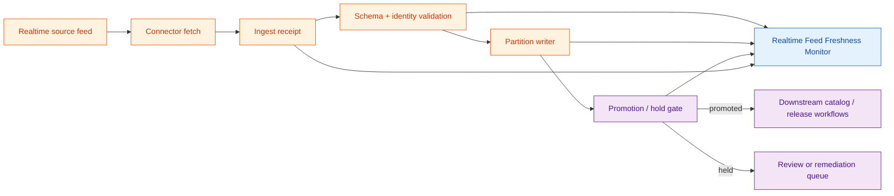

<!-- [KFM_META_BLOCK_V2]
doc_id: kfm://doc/<uuid-pending>
title: Realtime Feed Freshness Monitor — specification
type: standard
version: v0.2
status: draft
owners: <source-steward>, <pipeline-steward>, <observability-steward>  # PROPOSED placeholders; resolve before review
created: 2026-05-20
updated: 2026-06-12
policy_label: public
related:
  - docs/dashboards/README.md
  - docs/dashboards/operational/README.md
  - docs/dashboards/DASHBOARD_CATALOG.md
  - docs/dashboards/operational/SLO_LIVE_FEEDS.md
  - docs/dashboards/observability/OPENTELEMETRY_STACK.md
  - docs/standards/SMART_SYNC.md
  - docs/standards/TELEMETRY_MINIMUMS.md
  - docs/doctrine/directory-rules.md
  - docs/doctrine/trust-membrane.md
  - docs/doctrine/lifecycle-law.md
  - docs/registers/DRIFT_REGISTER.md
  - docs/registers/VERIFICATION_BACKLOG.md
tags: [kfm, dashboards, operational, realtime, freshness, feeds, promotion, partitions, smart-sync]
notes:
  - "Source card: KFM-P31-FEAT-0015 (Realtime Feed Freshness Monitor) — UNCHANGED, active per current draft lineage."
  - "This is a dashboard specification, not the running dashboard, telemetry store, validator, policy bundle, release gate, or public API."
  - "v0.2 polish: strengthens fresh-vs-promoted boundary, adds repo fit, signal flow, panel contracts, freshness calculation rules, promotion/hold semantics, validation, drift handling, and evidence boundary."
  - "Runtime implementation, source-card status, concrete SLO thresholds, telemetry metric names, schema paths, and owners remain NEEDS VERIFICATION against mounted-repo evidence."
[/KFM_META_BLOCK_V2] -->

<a id="top"></a>

# Realtime Feed Freshness Monitor · `operational/REALTIME_FEED_FRESHNESS.md`

> Specification for the **Realtime Feed Freshness Monitor** — an operational dashboard that shows whether each realtime feed is recent, schema-valid, identity-resolved, partition-complete, and **promoted or held**. Freshness is an operational signal; it is never a substitute for evidence, policy, review, catalog closure, or publication.

<p>
  
  
  
  
  
  
  
</p>

**Status:** draft  
**Owners:** `<source-steward>`, `<pipeline-steward>`, `<observability-steward>` — PROPOSED placeholders  
**Last reviewed:** 2026-06-12  
**Target path:** `docs/dashboards/operational/REALTIME_FEED_FRESHNESS.md`

> [!IMPORTANT]
> **Fresh does not mean promoted.** A feed can be recently fetched and schema-valid while still being held at a policy, identity, partition, review, or promotion gate. This dashboard MUST display freshness and promotion state as separate signals so operational health is never mistaken for admission into a PUBLISHED surface.

> [!CAUTION]
> **Specification only.** This file describes a dashboard. It does not implement telemetry collection, validator logic, promotion decisions, release decisions, public API behavior, or dashboard panels. Running code belongs in `apps/`, telemetry configuration belongs in the observability stack, validation belongs in `tools/validators/` and `tests/`, schemas belong under `schemas/contracts/v1/...`, and release decisions belong under `release/`.

---

## Contents

1. [Scope](#1-scope)
2. [Repo fit](#2-repo-fit)
3. [What this dashboard answers](#3-what-this-dashboard-answers)
4. [Signal flow](#4-signal-flow)
5. [Metrics surfaced](#5-metrics-surfaced)
6. [Panel contract](#6-panel-contract)
7. [Inputs and evidence sources](#7-inputs-and-evidence-sources)
8. [Freshness and hold semantics](#8-freshness-and-hold-semantics)
9. [Files and implementation pointers](#9-files-and-implementation-pointers)
10. [Ownership and review burden](#10-ownership-and-review-burden)
11. [Validation and acceptance](#11-validation-and-acceptance)
12. [Anti-patterns](#12-anti-patterns)
13. [Open questions](#13-open-questions)
14. [Evidence basis and verification boundary](#14-evidence-basis-and-verification-boundary)
15. [Changelog](#15-changelog)

---

## 1. Scope

The **Realtime Feed Freshness Monitor** is a per-feed operational dashboard for high-cadence external feeds. It answers whether the latest ingest window is:

- recent enough for the feed's declared cadence or freshness budget;
- schema-valid enough to remain operationally healthy;
- resolved to stable canonical identities;
- written to the expected partition layout;
- promoted, held, or waiting on review;
- safe to hand downstream to catalog and release workflows **only after** the normal gates agree.

This dashboard complements [`SLO_LIVE_FEEDS.md`](SLO_LIVE_FEEDS.md):

| Spec | Primary question | Boundary |
|---|---|---|
| `SLO_LIVE_FEEDS.md` | Are high-cadence feeds meeting standards-first SLO targets? | Service-level posture across live feeds. |
| `REALTIME_FEED_FRESHNESS.md` | Is each feed's latest ingest window fresh, valid, partitioned, and promoted or held? | Per-feed pipeline state through the promotion gate. |

The overlap is intentional but must stay explicit. `SLO_LIVE_FEEDS.md` is the roll-up SLO view; this monitor is the feed-by-feed operational state board.

[↑ Back to top](#top)

---

## 2. Repo fit

```text
docs/
└── dashboards/                                  # PROPOSED lane
    ├── README.md                                # dashboard-lane orientation
    ├── DASHBOARD_CATALOG.md                     # dashboard inventory
    ├── operational/
    │   ├── README.md                            # operational dashboard spec lane
    │   ├── SLO_LIVE_FEEDS.md                    # related feed-SLO spec
    │   └── REALTIME_FEED_FRESHNESS.md           # this file
    └── observability/
        └── OPENTELEMETRY_STACK.md               # telemetry substrate spec (PROPOSED)
```

| Relationship | Path or object | Role | Status |
|---|---|---|---|
| Parent lane | `docs/dashboards/operational/README.md` | Defines the operational-dashboard spec lane and its card-driven inventory. | CONFIRMED file presence; lane placement remains PROPOSED. |
| Sibling spec | `docs/dashboards/operational/SLO_LIVE_FEEDS.md` | Roll-up SLO dashboard for live feeds. | CONFIRMED draft lineage; runtime NEEDS VERIFICATION. |
| Catalog pointer | `docs/dashboards/DASHBOARD_CATALOG.md` | Should list this spec and its implementation pointer. | NEEDS VERIFICATION. |
| Telemetry substrate | `docs/dashboards/observability/OPENTELEMETRY_STACK.md` | Describes OTEL / dashboard plumbing if adopted. | PROPOSED / NEEDS VERIFICATION. |
| Source descriptors | `data/registry/sources/...` | Feed cadence, source role, terms, and activation state. | NEEDS VERIFICATION. |
| Receipts | `data/receipts/...` | Ingest, validation, partition, and promotion records read by the dashboard. | NEEDS VERIFICATION. |
| Validators | `tools/validators/...`, `tests/...` | Enforce schema, identity, partition, and promotion checks. | NEEDS VERIFICATION. |
| Running UI | `apps/review-console/`, future dashboard app, or external OTEL surface | Renders the actual dashboard. | UNKNOWN until verified. |

> [!NOTE]
> The document lives under `docs/` because it explains an operational dashboard to humans. It must not become a schema home, policy home, telemetry-data store, dashboard implementation, receipt store, release manifest, or public API contract.

[↑ Back to top](#top)

---

## 3. What this dashboard answers

The dashboard's lead question is:

> **For each realtime feed, is the latest data recent, schema-valid, identity-resolved, partition-complete, and either promoted or held with a reason?**

It should make these distinctions visible at a glance:

| Confusable state | Correct interpretation |
|---|---|
| Fresh but held | The latest ingest is recent, but downstream promotion is blocked. Investigate hold reason. |
| Valid but stale | The last successful payload passed validation, but the feed is outside its freshness budget. |
| Fresh but identity-unresolved | New data arrived, but records cannot safely join downstream object families. |
| Partition-complete but not promoted | Storage layout is complete, but review, policy, or release readiness is not satisfied. |
| Promoted but source stale | A prior promoted window exists, but the current feed health has degraded. |

[↑ Back to top](#top)

---

## 4. Signal flow



The monitor reads emitted receipts and telemetry. It does **not** bypass the promotion gate and does **not** promote data on its own.

[↑ Back to top](#top)

---

## 5. Metrics surfaced

| # | Metric | Measures | Healthy posture | Negative state |
|---:|---|---|---|---|
| 1 | **Schema validation** | Share of realtime messages or entity records passing the expected feed schema. | Near 100%; sustained failures are investigated. | `SCHEMA_INVALID` |
| 2 | **SLO freshness** | Age of the latest successful message or ingest window compared with the feed's declared freshness budget. | Within the configured per-feed budget. | `SOURCE_STALE` |
| 3 | **Canonical identity** | Share of records resolving to stable canonical identifiers. | 100% for records required to participate in downstream joins. | `IDENTITY_UNRESOLVED` |
| 4 | **Partition output** | Whether the ingest writes the expected partition layout for the current window. | Expected partitions exist, are complete, and are digestable. | `PARTITION_INCOMPLETE` |
| 5 | **Promotion / hold state** | Whether the latest window is promoted, held, quarantined, or pending review. | Held states always carry a reason and owner. | `REVIEW_PENDING`, `PROMOTION_HELD`, `DENIED_BY_POLICY` |
| 6 | **Last-good fallback age** | Age of the last promoted or last-known-good window when the live window is held. | Visible and bounded by a configured fallback policy. | `LAST_GOOD_STALE` |
| 7 | **Descriptor alignment** | Whether dashboard thresholds match the feed's `SourceDescriptor` cadence and activation state. | Dashboard thresholds trace to descriptor fields, not hand-tuned panel constants. | `DESCRIPTOR_MISMATCH` |

> [!IMPORTANT]
> Thresholds in this table are intentionally **not** hard-coded. Per-feed cadence, budget, and valid fallback behavior SHOULD come from source descriptors or an approved SLO configuration, then be surfaced by the dashboard. If those inputs are missing, the dashboard should show `NEEDS VERIFICATION` rather than invent thresholds.

[↑ Back to top](#top)

---

## 6. Panel contract

| Panel | Must show | Drill-out target | Failure posture |
|---|---|---|---|
| **Feed status board** | One row per feed: latest timestamp, age, SLO status, promotion state, hold reason. | Feed descriptor + latest ingest receipt. | Feed without descriptor shows `UNKNOWN_DESCRIPTOR`. |
| **Schema validation** | Pass-rate trend; current failing entities/messages; error-family counts. | `ValidationReport`. | Validation report missing shows `MISSING_VALIDATION`. |
| **Freshness timeline** | Age over time, SLO line, last-success marker, last-good fallback marker. | Ingest receipts + telemetry. | Missing last-success shows `SOURCE_STALE` or `NO_SUCCESSFUL_INGEST`. |
| **Identity resolution** | Resolved vs unresolved counts and sample unresolved categories. | Identity-resolution report or validation report. | Unresolved IDs block downstream promotion when identity is required. |
| **Partition map** | Expected vs observed partitions by window; completeness and digest status. | Partition manifest. | Missing partition manifest shows `PARTITION_INCOMPLETE`. |
| **Promotion board** | `promoted`, `held`, `pending-review`, `quarantined`, `denied`, with reason and owner. | Promotion / hold record. | Any held state without reason is a dashboard defect. |
| **Descriptor alignment** | Cadence, SLO, license / terms posture, activation state. | Source descriptor. | Mismatch between panel threshold and descriptor is `DESCRIPTOR_MISMATCH`. |

> [!TIP]
> A good first implementation can be a read-only table plus drill-out links. Fancy graphs are optional. The required behavior is that stale, invalid, unresolved, incomplete, held, or descriptor-mismatched states are visible and traceable.

[↑ Back to top](#top)

---

## 7. Inputs and evidence sources

Mounted-repo paths and concrete schema names remain **NEEDS VERIFICATION**.

| Input | Required fields or signal | Supports | Status |
|---|---|---|---|
| Connector run telemetry | Fetch start/end, ingest time, status code, payload size, message/entity count. | Freshness and latency context. | NEEDS VERIFICATION. |
| `ValidationReport` | Schema outcome, identity-resolution outcome, error families, evaluated timestamp. | Schema validation and identity panels. | NEEDS VERIFICATION. |
| Source descriptor | Source role, cadence, SLO budget, activation state, license/terms, steward. | Descriptor alignment and threshold source. | NEEDS VERIFICATION. |
| Partition manifest | Expected partitions, observed partitions, row/entity counts, digest(s). | Partition map. | NEEDS VERIFICATION. |
| Promotion / hold record | Window ID, state, reason code, reviewer or owning steward, timestamp. | Promotion board. | NEEDS VERIFICATION. |
| OpenTelemetry metrics | Feed-level counters, gauges, latency histograms. | Optional runtime rendering and alerting. | PROPOSED / NEEDS VERIFICATION. |
| Dashboard catalog row | Spec path, source card, owner, runtime pointer, status. | Navigation and coverage. | NEEDS VERIFICATION. |

### 7.1 Minimal record fields expected by the dashboard

```yaml
# Illustrative only — not a schema.
feed_id: SOURCE_ID_TBD
source_descriptor_ref: kfm://source-descriptor/SOURCE_ID_TBD
ingest_window: WINDOW_ID_TBD
latest_message_time: "YYYY-MM-DDTHH:MM:SSZ"
latest_successful_ingest_time: "YYYY-MM-DDTHH:MM:SSZ"
freshness_budget_seconds: 0  # sourced from descriptor or SLO config
schema_validation:
  status: pass|warn|fail|unknown
  validation_report_ref: kfm://validation/REPORT_ID_TBD
identity_resolution:
  status: pass|warn|fail|unknown
  unresolved_count: 0
partition_output:
  status: complete|incomplete|unknown
  manifest_ref: kfm://partition-manifest/MANIFEST_ID_TBD
promotion:
  state: promoted|held|pending_review|quarantined|denied|unknown
  reason_code: REASON_CODE_TBD
  record_ref: kfm://promotion/PROMOTION_RECORD_TBD
```

[↑ Back to top](#top)

---

## 8. Freshness and hold semantics

### 8.1 Freshness calculation

A freshness check SHOULD compare a feed-specific timestamp against the configured budget:

```text
freshness_age = now_utc - latest_successful_message_or_ingest_time
freshness_ok  = freshness_age <= freshness_budget
```

The timestamp source MUST be explicit. Different feed families may use different authoritative timestamps:

| Timestamp source | Use when | Risk if confused |
|---|---|---|
| Source message timestamp | The feed's message timestamp is reliable and present. | Clock skew can make fresh data look stale or stale data look fresh. |
| Ingest receipt timestamp | The source lacks reliable message time but KFM fetch timing is trustworthy. | Ingest may be fresh even when source data is semantically stale. |
| Window close timestamp | Feed is processed in discrete ingest windows. | A delayed source window may appear healthy if only close time is inspected. |

> [!WARNING]
> Freshness calculations MUST NOT silently switch timestamp source. A timestamp-source change is material dashboard drift and should be recorded in the dashboard catalog or drift register.

### 8.2 Promotion and hold states

| State | Meaning | Dashboard requirement |
|---|---|---|
| `promoted` | Latest window passed the operational gate and is eligible for downstream processing. | Show promotion timestamp and record ref. |
| `held` | Latest window is blocked by validation, identity, partition, rights, policy, review, or operator decision. | Show reason code and owning steward. |
| `pending_review` | A reviewer or steward decision is required. | Show queue age and reviewer role placeholder if owner unresolved. |
| `quarantined` | The window is unsafe or unresolved and must not progress. | Show quarantine reason and remediation path. |
| `denied` | Policy or reviewer decision blocks use. | Show denial reason; do not provide bypass links. |
| `unknown` | The dashboard cannot resolve current promotion state. | Treat as degraded; show `NEEDS VERIFICATION`. |

[↑ Back to top](#top)

---

## 9. Files and implementation pointers

| Path / target | Role | Status |
|---|---|---|
| `docs/dashboards/operational/REALTIME_FEED_FRESHNESS.md` | This dashboard specification. | CONFIRMED path in current repo evidence; content updated here as draft v0.2. |
| `docs/dashboards/operational/SLO_LIVE_FEEDS.md` | Related feed-SLO specification. | CONFIRMED path; runtime implementation NEEDS VERIFICATION. |
| `docs/dashboards/DASHBOARD_CATALOG.md` | Must list this dashboard and its runtime pointer before v1. | NEEDS VERIFICATION. |
| `docs/dashboards/observability/OPENTELEMETRY_STACK.md` | Telemetry substrate if OTEL-backed rendering is adopted. | NEEDS VERIFICATION. |
| Running surface | `apps/review-console/`, future dashboard app, or external OTEL/Grafana view. | UNKNOWN. |
| `spec_hash` | JCS + SHA-256 digest of the accepted spec payload, once tooling exists. | PROPOSED. |

[↑ Back to top](#top)

---

## 10. Ownership and review burden

| Role | Responsibility | Status |
|---|---|---|
| Source steward | Owns source descriptors, cadence, activation state, and source-specific freshness expectations. | PROPOSED placeholder. |
| Pipeline steward | Owns partition output, promotion/hold records, and remediation of pipeline defects. | PROPOSED placeholder. |
| Observability steward | Owns telemetry naming, panel wiring, and dashboard availability. | PROPOSED placeholder. |
| Docs steward | Reviews documentation quality, links, truth labels, and drift notes. | PROPOSED. |
| Policy / sensitivity reviewer | Required only if the feed can carry sensitive or restricted content. | Conditional. |

Reviewer burden before v1:

- confirm named owners and CODEOWNERS coverage;
- confirm this spec appears in `DASHBOARD_CATALOG.md`;
- confirm source-card status and whether the dashboard has an implementation;
- confirm that freshness thresholds trace to source descriptors or approved SLO config;
- confirm no public or normal UI path bypasses governed interfaces.

[↑ Back to top](#top)

---

## 11. Validation and acceptance

### 11.1 Spec validation

- [ ] KFM meta block is present and synchronized with the H1.
- [ ] `DASHBOARD_CATALOG.md` row exists and links to this file.
- [ ] All related links resolve from `docs/dashboards/operational/`.
- [ ] Owners are concrete, or placeholders are explicitly marked `PROPOSED` / `NEEDS VERIFICATION`.
- [ ] Metrics map to emitted receipts, reports, manifests, or telemetry signals.
- [ ] Negative states use approved project vocabulary or are marked `PROPOSED`.
- [ ] The dashboard cannot be read as an enforcement mechanism or release gate.

### 11.2 Runtime acceptance

Runtime acceptance is **NEEDS VERIFICATION** until an implementation exists and emits inspectable evidence.

- [ ] Dashboard renders one row per configured realtime feed.
- [ ] Each row links to source descriptor, latest ingest receipt, validation report, partition manifest, and promotion/hold record where available.
- [ ] Freshness status and promotion state are visually distinct.
- [ ] Missing promotion state degrades to `unknown` / `NEEDS VERIFICATION`, not green.
- [ ] Held windows show reason code and owning steward.
- [ ] Stale or failed feeds do not automatically withdraw prior releases without release-authority action.
- [ ] Sensitive or restricted feed details are redacted, generalized, or withheld according to policy.

[↑ Back to top](#top)

---

## 12. Anti-patterns

| Anti-pattern | Symptom | Correction |
|---|---|---|
| **Freshness becomes promotion** | Panel shows green when the feed is fresh, even though promotion is held. | Separate freshness and promotion columns. Make held state impossible to miss. |
| **Panel constants drift from descriptors** | Dashboard threshold differs from `SourceDescriptor` cadence. | Source thresholds from descriptor or approved SLO config; flag mismatch. |
| **Missing records shown as healthy** | No validation report or partition manifest, but panel still shows pass. | Missing evidence is degraded / unknown, never green. |
| **Last-good data hidden** | Current feed is stale, but UI silently serves an older window. | Show last-good age and fallback posture. |
| **Runtime implementation in docs** | Grafana JSON, React components, or telemetry queries are stored in this Markdown file. | Move implementation to `apps/`, `infra/`, runtime config, or external dashboard tooling. |
| **Sensitive feed leakage** | Panel exposes exact restricted locations or operationally sensitive metadata. | Apply policy, redaction, generalization, or denial before display. |
| **Dashboard as source of truth** | Downstream code reads dashboard state instead of receipts and promotion records. | Downstream systems read governed records; dashboard remains a read-only surface. |

[↑ Back to top](#top)

---

## 13. Open questions

- [ ] **RFF-OQ-01 — Running surface.** Confirm whether the dashboard renders in `apps/review-console/`, a future dashboard app, an external OTEL/Grafana surface, or a generated report.
- [ ] **RFF-OQ-02 — Scope overlap with SLO dashboard.** Keep the split: `SLO_LIVE_FEEDS.md` as roll-up SLO posture and this file as per-feed pipeline state, or merge both into one operational feed dashboard.
- [ ] **RFF-OQ-03 — Source-card status.** Confirm `KFM-P31-FEAT-0015` status against the current Atlas / idea-card ledger.
- [ ] **RFF-OQ-04 — Metric names.** Confirm canonical telemetry metric names and label cardinality limits.
- [ ] **RFF-OQ-05 — Receipt schema refs.** Confirm schema paths for `ValidationReport`, partition manifest, and promotion / hold records.
- [ ] **RFF-OQ-06 — Descriptor threshold source.** Confirm which descriptor fields define cadence, freshness budget, fallback tolerance, and terms posture.
- [ ] **RFF-OQ-07 — Negative-state vocabulary.** Confirm whether `LAST_GOOD_STALE`, `UNKNOWN_DESCRIPTOR`, `MISSING_VALIDATION`, and `DESCRIPTOR_MISMATCH` already exist or require proposal through the negative-state register.

[↑ Back to top](#top)

---

## 14. Evidence basis and verification boundary

| Evidence | Status | Supports | Does not prove |
|---|---|---|---|
| Current `docs/dashboards/operational/REALTIME_FEED_FRESHNESS.md` repo file | CONFIRMED | Existing v0.1 draft, source-card lineage, stated metrics, panel list, inputs, and open questions. | Running dashboard implementation, telemetry names, CI, schema shape, or ownership. |
| `docs/dashboards/operational/README.md` | CONFIRMED | Operational folder posture: per-card dashboard specs, not implementations; operational dashboards report pipeline health. | That every listed dashboard is implemented. |
| `docs/doctrine/directory-rules.md` | CONFIRMED doctrine | Responsibility-root split: docs explain; schemas define shape; policy decides; tools validate; apps implement; data/release carry lifecycle artifacts. | Concrete presence of every referenced schema, validator, receipt, or app. |
| Source-card lineage `KFM-P31-FEAT-0015` | LINEAGE / NEEDS VERIFICATION | Why this spec exists and what it is intended to mirror. | Current card status or implementation maturity without current ledger evidence. |

> [!NOTE]
> Current runtime depth remains **UNKNOWN**. This spec is repo-useful and path-grounded, but it does not claim that a running dashboard, OTEL metric set, validator package, or promotion-record schema already exists.

[↑ Back to top](#top)

---

## 15. Changelog

| Version | Date | Change |
|---|---|---|
| v0.2 | 2026-06-12 | Presentation and governance polish. Added repo fit, signal flow, explicit freshness / promotion split, expanded metrics, panel contract, input ledger, freshness semantics, runtime acceptance, anti-patterns, evidence boundary, and expanded open questions. |
| v0.1 | 2026-05-20 | Initial dashboard specification draft for `KFM-P31-FEAT-0015`. |

---

**Related docs:** [`operational/README.md`](README.md) · [`dashboards/README.md`](../README.md) · [`DASHBOARD_CATALOG.md`](../DASHBOARD_CATALOG.md) · [`SLO_LIVE_FEEDS.md`](SLO_LIVE_FEEDS.md) · [`observability/OPENTELEMETRY_STACK.md`](../observability/OPENTELEMETRY_STACK.md) · [`SMART_SYNC.md`](../../standards/SMART_SYNC.md)

<sub>Last updated: 2026-06-12 · Edition: v0.2 draft · Owners: `<source-steward>`, `<pipeline-steward>`, `<observability-steward>` PROPOSED · Runtime: NEEDS VERIFICATION · [Back to top](#top)</sub>
