<!-- [KFM_META_BLOCK_V2]
doc_id: kfm://doc/<uuid-pending>
title: Live-Feeds SLO Dashboard — specification
type: standard
version: v0.2
status: draft
owners: <source-steward>, <observability-steward>  # PROPOSED placeholders; resolve before review
created: 2026-05-20
updated: 2026-06-12
policy_label: public
related:
  - docs/dashboards/README.md
  - docs/dashboards/operational/README.md
  - docs/dashboards/DASHBOARD_CATALOG.md
  - docs/dashboards/INDICATOR_CATALOG.md
  - docs/dashboards/observability/OPENTELEMETRY_STACK.md
  - docs/standards/TELEMETRY_MINIMUMS.md
  - docs/standards/connector-rate-limits.md
  - docs/doctrine/directory-rules.md
  - docs/doctrine/trust-membrane.md
  - docs/doctrine/lifecycle-law.md
tags: [kfm, dashboards, operational, slo, live-feeds, gtfs-rt, freshness, observability]
notes:
  - "Source card: KFM-P11-FEAT-0002 (Standards-first SLO dashboard for live feeds) — EXPANDED, active in the operational dashboard README inventory."
  - "This is a SPEC for a dashboard, not the running dashboard, telemetry store, validator, policy, or source-admission authority."
  - "SLO health is operational posture only. A green feed does not imply source admission, catalog closure, release eligibility, or publication approval."
  - "v0.2 polish: adds repo fit, explicit trust-boundary language, richer metric and panel definitions, signal-flow diagram, validation checklist, review burden, drift handling, and rollback notes."
  - "Implementation status remains NEEDS VERIFICATION until the running surface, telemetry queries, validators, and source descriptors are confirmed against mounted-repo evidence."
[/KFM_META_BLOCK_V2] -->

<a id="top"></a>

# Live-Feeds SLO Dashboard · `operational/SLO_LIVE_FEEDS.md`

> Dashboard specification for **standards-first SLOs on live, high-cadence feeds**. This spec describes what the dashboard should report for feed freshness, schema validity, fetch latency, deduplication, non-material suppression, and license / rate-limit posture — without treating operational health as source authority or publication approval.

<p>
  
  
  
  
  
  
  
</p>

**Status:** draft · **Owners:** `<source-steward>`, `<observability-steward>` (PROPOSED) · **Last reviewed:** 2026-06-12

> [!IMPORTANT]
> **SLOs are operational targets, not trust claims.** A feed can be fresh, low-latency, and schema-valid while still being **not admitted**, **rights-limited**, **policy-denied**, **quarantined**, or **unpublished**. This dashboard reports feed health; it does not replace `SourceDescriptor`, `ValidationReport`, `PolicyDecision`, `EvidenceBundle`, `CatalogRecord`, `ReleaseManifest`, or steward review.

> [!CAUTION]
> **No public-path shortcut.** Dashboard panels MUST read released / allowed telemetry summaries and governed receipts. They MUST NOT expose RAW payloads, source API credentials, private agency tokens, restricted geometry, unpublished candidate records, or sensitive operational internals.

---

## Contents

1. [Scope](#1-scope)
2. [Repo fit](#2-repo-fit)
3. [Dashboard question](#3-dashboard-question)
4. [Metrics surfaced](#4-metrics-surfaced)
5. [Panels](#5-panels)
6. [Inputs and signal sources](#6-inputs-and-signal-sources)
7. [Signal flow](#7-signal-flow)
8. [SLO calculation rules](#8-slo-calculation-rules)
9. [Files and implementation homes](#9-files-and-implementation-homes)
10. [Ownership and review burden](#10-ownership-and-review-burden)
11. [Validation and acceptance](#11-validation-and-acceptance)
12. [Failure and drift handling](#12-failure-and-drift-handling)
13. [Open questions](#13-open-questions)
14. [Evidence boundary](#14-evidence-boundary)
15. [Changelog](#15-changelog)

---

## 1. Scope

This dashboard specification covers **live / high-cadence external feeds** where operational health depends on time-sensitive ingestion and standards conformance.

Typical feed classes include:

- GTFS-Realtime or similar transit feeds;
- public safety or infrastructure status feeds when KFM policy allows operational reporting;
- agency event feeds with frequent refresh cadence;
- other source-family feeds whose `SourceDescriptor` declares a freshness cadence, latency budget, schema profile, and license / rate-limit terms.

This spec answers one operational question:

> Are live feeds being fetched, validated, deduplicated, and monitored according to their declared standards and source terms?

It does **not** answer:

- whether the source is authoritative;
- whether the source is admissible;
- whether data from the source may be published;
- whether a specific claim is evidence-supported;
- whether a live feed should appear in a public map;
- whether the feed is legally safe to redistribute.

Those answers belong to source admission, policy, evidence, catalog closure, and release workflows.

[↑ back to top](#top)

---

## 2. Repo fit

`SLO_LIVE_FEEDS.md` is a **per-card operational dashboard spec** under the proposed `docs/dashboards/operational/` lane. It documents a dashboard; it does not implement one.

```text
docs/
└── dashboards/
    ├── README.md
    ├── DASHBOARD_CATALOG.md
    ├── INDICATOR_CATALOG.md
    ├── operational/
    │   ├── README.md
    │   └── SLO_LIVE_FEEDS.md        # this file
    └── observability/
        └── OPENTELEMETRY_STACK.md   # telemetry substrate reference (NEEDS VERIFICATION)
```

| Neighbor | Relationship | Status |
|---|---|---|
| [`README.md`](../README.md) | Parent dashboard-lane orientation. | PROPOSED lane; implementation depth NEEDS VERIFICATION |
| [`operational/README.md`](README.md) | Operational dashboard inventory and per-card rules. | Draft sibling; current inventory lists this file |
| [`DASHBOARD_CATALOG.md`](../DASHBOARD_CATALOG.md) | Dashboard index row should point here. | NEEDS VERIFICATION |
| [`INDICATOR_CATALOG.md`](../INDICATOR_CATALOG.md) | Governance health indicators; this spec may provide operational signal inputs but does not replace governance indicators. | Draft mirror |
| [`observability/OPENTELEMETRY_STACK.md`](../observability/OPENTELEMETRY_STACK.md) | Telemetry substrate for freshness / latency / error-rate panels. | NEEDS VERIFICATION |
| [`../../standards/TELEMETRY_MINIMUMS.md`](../../standards/TELEMETRY_MINIMUMS.md) | Minimum telemetry fields and naming rules. | NEEDS VERIFICATION |
| [`../../standards/connector-rate-limits.md`](../../standards/connector-rate-limits.md) | Source-friendly fetch cadence and rate-limit posture. | NEEDS VERIFICATION |

> [!NOTE]
> If `docs/dashboards/` remains a proposed lane, this file remains a proposed-path spec. Do not treat the path as canonical until the dashboard lane placement question is resolved in Directory Rules / ADR review.

[↑ back to top](#top)

---

## 3. Dashboard question

The dashboard should make it obvious whether each live feed is:

1. **fresh enough** for its declared cadence;
2. **schema-valid** against the selected feed standard and KFM intake contract;
3. **fast enough** to meet the configured fetch-to-ingest latency budget;
4. **stable enough** that deduplication / suppression rates look explainable;
5. **source-friendly** with respect to license, attribution, rate limits, and agency terms;
6. **safe enough to continue ingesting** without masking policy, rights, or review failures.

> [!WARNING]
> **A green SLO row is not source admission.** Feed health can support an activation or release decision, but it cannot issue one.

[↑ back to top](#top)

---

## 4. Metrics surfaced

The metrics below are **PROPOSED** dashboard signals for `KFM-P11-FEAT-0002`. Each feed row should carry a source-family ID, source descriptor ref, feed standard/profile ref, and current activation state where available.

| # | Metric | Measures | Healthy posture (PROPOSED) | Negative state |
|---:|---|---|---|---|
| 1 | **Feed freshness** | Age of the most recent successfully ingested message against declared cadence. | Within the feed's descriptor-declared cadence and tolerance. | `SOURCE_STALE` |
| 2 | **Schema validation rate** | Share of fetched messages passing feed-standard validation and KFM intake-contract validation. | Near 100%; any sustained failure is visible and triaged. | `SCHEMA_INVALID` |
| 3 | **Fetch-to-ingest latency** | Time from scheduled fetch to accepted ingest receipt. | Within per-feed latency budget. | `LATENCY_BUDGET_EXCEEDED` |
| 4 | **Fetch success rate** | Share of attempted fetches that return expected status, content type, and parseable payload. | Stable; transient misses are classified by reason. | `FETCH_FAILED` |
| 5 | **Deduplication rate** | Share of messages dropped because the content identity was already seen. | Stable within expected range; spikes investigated. | `DEDUP_ANOMALY` |
| 6 | **Non-material suppression** | Share of updates suppressed because no meaningful downstream change occurred. | Visible; high rates reviewed for threshold quality. | Informational unless threshold abuse is detected |
| 7 | **License / rate-limit posture** | Whether ingest respects declared license, attribution, rate, and redistribution terms. | 100% compliant before any public use. | `LICENSE_VIOLATION` |
| 8 | **Activation-state mismatch** | Operationally healthy feed whose source activation is `needs-review`, `deny`, `restricted`, or unknown. | Mismatch is visible; no public path is implied. | `ACTIVATION_MISMATCH` |
| 9 | **Quarantine rate** | Share of fetched / normalized records routed to QUARANTINE and why. | Visible, explainable, and not silently bypassed. | `QUARANTINE_SPIKE` |

> [!TIP]
> Keep operational and governance signals distinct. This dashboard may show `Quarantine rate` and `Activation-state mismatch` because they protect interpretation of live-feed health. It should not become the governance dashboard for cite-or-abstain, rollback coverage, or sensitive-lane fail-closed rates.

[↑ back to top](#top)

---

## 5. Panels

| Panel | Purpose | Primary rows / charts | Drill-down target |
|---|---|---|---|
| **Feed status overview** | One row per live feed with status, freshness, validation, latency, activation state, and source-family steward. | Feed table + status chips. | SourceDescriptor and latest receipts. |
| **Freshness SLO** | Show feed age against cadence and tolerance. | Age timeline, cadence bands, stale events. | Fetch / ingest receipt sequence. |
| **Schema validation** | Separate source-standard validation from KFM intake-contract validation. | Pass-rate trend, top schema errors, failure examples by code. | `ValidationReport`. |
| **Latency budget** | Show p50 / p95 fetch-to-ingest latency and budget breaches. | Latency histogram + breach count. | Telemetry trace / run receipt. |
| **Dedup & suppression** | Explain message suppression, duplicates, and material-change thresholds. | Duplicate-rate and suppression-rate trend. | Content-hash / materiality receipt. |
| **License and rate limits** | Keep source terms visible next to operational health. | Per-agency compliance status, rate-limit usage, attribution state. | SourceDescriptor rights / license fields. |
| **Quarantine and failures** | Show why feeds are not flowing to processed / catalog-eligible states. | Reason-code distribution. | Quarantine ledger and failed validation reports. |
| **Implementation health** | Show whether the dashboard itself has complete inputs. | Missing telemetry, missing descriptor, missing owner, stale spec. | Dashboard catalog and verification backlog. |

[↑ back to top](#top)

---

## 6. Inputs and signal sources

Mounted-repo paths and exact field names remain **NEEDS VERIFICATION**.

| Input | Expected role | Examples of fields / signals | Status |
|---|---|---|---|
| `SourceDescriptor` | Declares feed identity, owner, cadence, source role, rights, license terms, and rate posture. | `source_id`, `source_role`, `cadence`, `license`, `attribution`, `rate_limit`, `activation_ref`. | NEEDS VERIFICATION |
| Connector run telemetry | Supplies fetch timing, status, latency, and payload-size signals. | scheduled time, fetch start/end, HTTP status, content type, bytes, retry count. | NEEDS VERIFICATION |
| `ValidationReport` | Records standard-schema and KFM-contract validation outcomes. | pass/fail, schema ID, error codes, sampled failures. | NEEDS VERIFICATION |
| Ingest / run receipts | Prove what was fetched, when, by which connector, and with what checksum or content identity. | `RunReceipt`, `IngestReceipt`, content hash, ETag, Last-Modified. | NEEDS VERIFICATION |
| Dedup / materiality receipts | Explain why a message was dropped or suppressed. | content identity, prior identity ref, material-change decision. | PROPOSED |
| Quarantine ledger | Explains failures without silently dropping records. | reason code, feed ID, timestamp, owner, remediation state. | NEEDS VERIFICATION |
| OpenTelemetry metrics / traces | Powers latency, error, and dashboard health panels. | p50, p95, error rate, trace spans, collector health. | NEEDS VERIFICATION |
| Dashboard catalog row | Makes this spec discoverable and reviewable. | dashboard ID, source card, owner, spec path, implementation pointer. | NEEDS VERIFICATION |

[↑ back to top](#top)

---

## 7. Signal flow

```mermaid
flowchart LR
  subgraph Source["External live feed"]
    FEED["Feed endpoint<br/>standard + license terms"]
  end

  subgraph Intake["KFM intake boundary"]
    DESC["SourceDescriptor<br/>cadence · role · rights · rate terms"]
    CONN["Connector / watcher<br/>fetch attempt"]
    RAW["RAW capture receipt<br/>checksum · fetch metadata"]
  end

  subgraph Validate["Validation and routing"]
    STDVAL["Feed-standard validation"]
    KFMVAL["KFM contract validation"]
    DEDUP["Dedup / materiality check"]
    QUAR["QUARANTINE<br/>reason-coded failures"]
    OK["Operationally healthy signal"]
  end

  subgraph Dashboard["This dashboard spec"]
    PANEL["SLO panels<br/>freshness · schema · latency · dedup · license"]
  end

  subgraph Governed["Governed decisions outside this dashboard"]
    POLICY["PolicyDecision"]
    CATALOG["Catalog closure"]
    RELEASE["Release authority"]
  end

  FEED --> CONN
  DESC --> CONN
  CONN --> RAW
  RAW --> STDVAL --> KFMVAL --> DEDUP
  STDVAL -- fail --> QUAR
  KFMVAL -- fail --> QUAR
  DEDUP -- duplicate / non-material --> OK
  DEDUP -- accepted --> OK
  QUAR --> PANEL
  OK --> PANEL
  PANEL -. "reports posture only" .-> POLICY
  POLICY --> CATALOG --> RELEASE

  classDef external fill:#eef2ff,stroke:#4f46e5,color:#1e1b4b
  classDef internal fill:#fff7ed,stroke:#f97316,color:#7c2d12
  classDef dash fill:#ecfeff,stroke:#0891b2,color:#164e63
  classDef govern fill:#ecfdf5,stroke:#059669,color:#064e3b
  class FEED external
  class DESC,CONN,RAW,STDVAL,KFMVAL,DEDUP,QUAR,OK internal
  class PANEL dash
  class POLICY,CATALOG,RELEASE govern
```



The dashboard reads posture signals and receipts. It does **not** advance lifecycle state.

[↑ back to top](#top)

---

## 8. SLO calculation rules

These are dashboard calculation rules, not policy rules.

| Rule | Requirement | Rationale |
|---|---|---|
| Cadence comes from source metadata | A feed's freshness target MUST come from a source descriptor, source-family standard, or explicit steward override. | Prevents ad-hoc thresholds. |
| Standard validation is separate from KFM validation | The dashboard SHOULD show both source-standard validation and KFM intake-contract validation. | A payload can be valid to the external standard but still fail KFM policy / shape requirements. |
| License posture is never inferred from uptime | License / terms compliance MUST come from source registry / descriptor review. | Prevents operational health from becoming rights clearance. |
| Stale is reason-coded | Staleness SHOULD record whether the cause is source outage, connector failure, rate-limit hold, validation failure, quarantine, or unknown. | Makes remediation possible. |
| Non-material suppression is visible | Suppressed updates SHOULD be counted even when not defects. | Prevents silent loss of event volume. |
| Error budgets are per feed | Error budget values MUST NOT be global unless a source-family steward accepts that rule. | Feed cadences and source obligations differ. |
| Green dashboard does not publish | Any "healthy" summary MUST include the operational-only disclaimer or link to it. | Preserves KFM trust membrane. |

[↑ back to top](#top)

---

## 9. Files and implementation homes

| Path / surface | Role | Status |
|---|---|---|
| `docs/dashboards/operational/SLO_LIVE_FEEDS.md` | This dashboard specification. | draft |
| [`README.md`](README.md) | Operational dashboard lane README; inventory should list this file. | CONFIRMED in current repo read; content remains draft |
| [`../DASHBOARD_CATALOG.md`](../DASHBOARD_CATALOG.md) | Dashboard catalog row should list this spec, source card, owner, and implementation pointer. | NEEDS VERIFICATION |
| [`../observability/OPENTELEMETRY_STACK.md`](../observability/OPENTELEMETRY_STACK.md) | Proposed telemetry substrate for live-feed freshness / latency. | NEEDS VERIFICATION |
| Running dashboard surface | Likely external OTEL / Grafana or `apps/review-console/`; do not claim until confirmed. | UNKNOWN |
| Dashboard-as-code file | If adopted, belongs outside `docs/` under the selected app / observability root. | PROPOSED |
| Validator / SLO checker | Belongs under `tools/validators/` or repo-native test root. | PROPOSED |
| `spec_hash` | Canonical hash for this spec once document hashing is wired. | PROPOSED — pending JCS + SHA-256 |

[↑ back to top](#top)

---

## 10. Ownership and review burden

| Responsibility | Proposed owner | Review burden |
|---|---|---|
| Feed identity, cadence, source role, and activation-state semantics | `<source-steward>` | Source steward + docs steward |
| Telemetry signal design and query correctness | `<observability-steward>` | Observability steward + pipeline steward |
| Schema validation signal semantics | Domain / contract steward for the feed class | Domain steward + source steward |
| License / rate-limit posture | Source steward + rights reviewer where applicable | Source steward + rights reviewer |
| Dashboard spec text and links | Docs steward | Docs steward + owning stewards |
| Running surface implementation | UNKNOWN | NEEDS VERIFICATION |

> [!NOTE]
> Owners are placeholders until resolved against the dashboard lane's CODEOWNERS / steward registry. No anonymous spec should reach v1.

[↑ back to top](#top)

---

## 11. Validation and acceptance

A v1-ready dashboard spec MUST satisfy:

- [ ] Source card `KFM-P11-FEAT-0002` is still active or this spec is marked SUPERSEDED / RETIRED.
- [ ] `DASHBOARD_CATALOG.md` includes a row for this spec.
- [ ] `operational/README.md` inventory links to this spec.
- [ ] Every metric has a named receipt / telemetry source or is explicitly marked `UNKNOWN`.
- [ ] Every negative state uses the accepted KFM negative-state vocabulary or is proposed in the verification backlog.
- [ ] Per-feed SLO thresholds are descriptor-driven, not hard-coded in prose.
- [ ] License / attribution / rate-limit posture is represented as a separate signal, not inferred from uptime.
- [ ] The running dashboard surface is identified or left `UNKNOWN` with a verification task.
- [ ] Link check passes from `docs/dashboards/operational/`.
- [ ] Owner placeholders are resolved or explicitly deferred before review.
- [ ] No panel exposes RAW payloads, credentials, restricted-source content, or unpublished candidate data.

[↑ back to top](#top)

---

## 12. Failure and drift handling

| Situation | Response |
|---|---|
| Source card retires or is superseded | Mark this spec `SUPERSEDED`, add the replacement link, and update `operational/README.md` + `DASHBOARD_CATALOG.md`. |
| Running dashboard differs from this spec | Open a drift entry and decide whether to update the spec, update the implementation, or split the dashboard. |
| Feed standard changes | Update descriptor / profile references first, then revise dashboard metrics and validation expectations. |
| License or agency terms change | Fail closed for public use until source steward / rights reviewer records the new posture. |
| Telemetry signal missing | Show dashboard input-health warning; do not silently report green. |
| Metric becomes policy-significant | Move rule logic to `policy/` or validators; keep this doc as reporting spec only. |

Rollback target for this doc: revert to v0.1 content and re-open the v0.2 improvements as a patch plan if any change weakens source integrity, hides uncertainty, or creates parallel authority.

[↑ back to top](#top)

---

## 13. Open questions

- [ ] **SLF-OQ-01 — Running surface.** Confirm whether the dashboard renders in an OTEL / Grafana stack, `apps/review-console/`, a future dashboard app, or another governed surface.
- [ ] **SLF-OQ-02 — Feed budgets.** Define where per-feed cadence, latency budget, and error budget live: source descriptor, source-family profile, connector config, or policy register.
- [ ] **SLF-OQ-03 — Implementation status.** Confirm `KFM-P11-FEAT-0002` implementation status against repo files, workflow outputs, telemetry dashboards, and test evidence.
- [ ] **SLF-OQ-04 — Negative-state vocabulary.** Confirm whether `FETCH_FAILED`, `DEDUP_ANOMALY`, `ACTIVATION_MISMATCH`, and `QUARANTINE_SPIKE` already exist or must be proposed.
- [ ] **SLF-OQ-05 — Standards pins.** Confirm which live-feed standards and versions are accepted for this dashboard family.
- [ ] **SLF-OQ-06 — License / rate-limit inputs.** Confirm the canonical source for agency license terms, attribution requirements, and rate limits.
- [ ] **SLF-OQ-07 — Dashboard catalog row.** Confirm the exact `DASHBOARD_CATALOG.md` row and owner mapping.

[↑ back to top](#top)

---

## 14. Evidence boundary

| Evidence | Status | Supports | Does not prove |
|---|---|---|---|
| Existing `docs/dashboards/operational/SLO_LIVE_FEEDS.md` v0.1 | CONFIRMED current repo file | Baseline text, source-card reference, existing metrics, owner placeholders, implementation-unknown posture. | Running dashboard implementation, telemetry queries, source descriptors, validators, or CI. |
| `docs/dashboards/operational/README.md` | CONFIRMED current repo file | Operational dashboard lane scope: specs-only, per-card inventory, anti-collapse rule, and this file's inventory row. | That all listed dashboards are running or that the proposed lane has accepted ADR status. |
| `docs/dashboards/README.md` | CONFIRMED current repo file | Dashboard lane role as human-facing specifications and indicator catalogs, not running dashboards. | Runtime implementation or live dashboard state. |
| `docs/doctrine/directory-rules.md` | CONFIRMED current repo doctrine | Responsibility-root split: docs explain; schemas, policy, data, tools, apps, and release duties belong elsewhere. | That this lane has final accepted placement without ADR / drift resolution. |

[↑ back to top](#top)

---

## 15. Changelog

| Version | Date | Change |
|---|---|---|
| v0.2 | 2026-06-12 | Polished spec; added repo fit, expanded metric table, panel definitions, signal-flow diagram, SLO calculation rules, validation checklist, drift handling, evidence boundary, and stricter operational-health-not-trust posture. |
| v0.1 | 2026-05-20 | Initial draft for `KFM-P11-FEAT-0002` live-feeds SLO dashboard spec. |

---

**Related docs:** [operational/README.md](README.md) · [dashboards/README.md](../README.md) · [DASHBOARD_CATALOG.md](../DASHBOARD_CATALOG.md) · [INDICATOR_CATALOG.md](../INDICATOR_CATALOG.md) · [observability/OPENTELEMETRY_STACK.md](../observability/OPENTELEMETRY_STACK.md) · [TELEMETRY_MINIMUMS.md](../../standards/TELEMETRY_MINIMUMS.md) · [connector-rate-limits.md](../../standards/connector-rate-limits.md)

<sub>Last updated: 2026-06-12 · Edition: v0.2 draft · Owners: `<source-steward>`, `<observability-steward>` (PROPOSED) · Evidence posture: current repo spec confirmed; runtime implementation NEEDS VERIFICATION · [Back to top](#top)</sub>
