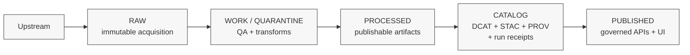

<!-- [KFM_META_BLOCK_V2]
doc_id: kfm://doc/6f7d8e9b-2c7c-4f6a-9d9d-6f6a6b2c1f4a
title: Contributing — Data Artifacts and Data Docs
type: standard
version: v1
status: draft
owners: kfm://owners/data-stewards
created: 2026-03-01
updated: 2026-03-01
policy_label: public
related:
  - ../../CONTRIBUTING.md
  - ../../docs/README.md
  - ../../data/README.md
tags: [kfm, contributing, data, governance, promotion-contract]
notes:
  - This guide is additive and scoped to data-facing contributions (registry/spec/catalog/receipts/docs).
  - Uses KFM normative language: MUST/SHOULD/MAY.
[/KFM_META_BLOCK_V2] -->

# Contributing to KFM Data Artifacts & Data Documentation
**Purpose:** ship data changes that remain **auditable, reversible, policy-safe, and evidence-resolvable** across the KFM truth path.

 <!-- TODO: switch to review/published -->


> **Rule of thumb:** If a change could affect what users see, download, cite, or infer — treat it as a governed change and include evidence + policy inputs.

---

## Quick navigation
- [Where this guide fits](#where-this-guide-fits)
- [What belongs in `docs/data/`](#what-belongs-in-docsdata)
- [Contribution types](#contribution-types)
- [Truth path and the Promotion Contract](#truth-path-and-the-promotion-contract)
- [Pull request workflow](#pull-request-workflow)
- [Licensing & sensitivity](#licensing--sensitivity)
- [Local checks](#local-checks)
- [Templates](#templates)

---

## Where this guide fits

This file is **scoped to** contributions that touch:
- dataset onboarding docs and “how it works” writeups
- dataset registry/spec metadata
- catalog artifacts (DCAT/STAC/PROV) and link integrity
- QA thresholds documentation
- run receipts / audit-friendly provenance docs

If your change is **code** (API/UI/pipelines/policy), follow the repo-level contribution guide first:
- `../../CONTRIBUTING.md` (if present)
- and any module-local CONTRIBUTING/README files.

---

## What belongs in `docs/data/`

### Acceptable inputs
You **MAY** add or modify:
- onboarding docs for a specific dataset/source (what it is, how to ingest it safely, known pitfalls)
- definitions and glossaries used by dataset specs (cadence, extents, policy labels)
- “how to validate” notes and QA threshold rationale
- catalog profiles guidance (what we require for DCAT/STAC/PROV and why)
- examples and templates (small, non-sensitive, non-proprietary)

### Exclusions
You **MUST NOT** commit:
- large raw datasets or bulk exports (even if “public”)  
- secrets (API keys, tokens), credentials, private URLs, internal-only endpoints
- personal data, protected attributes, or anything requiring restricted handling
- precise coordinates for vulnerable/private/culturally restricted sites (use generalized geometry + policy label)

> **Default-deny posture:** If you are unsure whether something is sensitive, treat it as restricted and escalate to review rather than guessing.

### Directory tree (minimum)
```text
docs/data/
  CONTRIBUTING.md          <-- you are here
  ...                      <-- dataset onboarding docs / templates / glossaries
```

_Back to top:_ [Quick navigation](#quick-navigation)

---

## Contribution types

| Change type | Typical files touched | MUST include | Reviewers |
|---|---|---|---|
| Dataset onboarding doc | `docs/data/**` | purpose, upstream source, license, sensitivity notes, validation steps | Data Steward + Policy |
| Registry/spec metadata update | `data/**` (paths vary) | identity/versioning, license snapshot, policy label, QA thresholds | Data Steward |
| Catalog fix (DCAT/STAC/PROV links) | `data/**` or `catalog/**` | link integrity, cross-links, validation evidence | Data Steward + Platform |
| QA rule/threshold change | spec + validator config | rationale + before/after evidence | Data Steward + Domain SME |
| Receipt/provenance doc improvements | `docs/data/**` | keep schema/contract alignment, don’t leak sensitive info | Platform + Policy |

> **Note:** file locations are repo-dependent. Don’t guess. Use `git grep`, `find`, or module READMEs to locate the correct place.

---

## Truth path and the Promotion Contract

KFM changes are evaluated against the **truth path** and its **fail-closed gates**.

### Truth path (conceptual)



### Promotion Contract checklist (minimum gates)

If your PR results in **any** new/updated publishable artifact, it **MUST** satisfy the minimum gates below. Use this list as your PR description checklist.

| Gate | What it means | What you MUST provide (minimum) |
|---|---|---|
| **A — Identity & versioning** | Deterministic dataset + version identity | dataset identifiers + stable spec hash + artifact digests |
| **B — Licensing & rights** | “Online” ≠ “allowed” | license/rights metadata + snapshot of upstream terms (or explicit “metadata-only reference”) |
| **C — Sensitivity & redaction plan** | Default-deny when unclear | policy label + explicit obligations (generalize geometry, remove fields, etc.) |
| **D — Catalog triplet validation** | Catalog is a contract surface | DCAT/STAC/PROV validate and cross-link (no guessing) |
| **E — QA & thresholds** | Quality is explicit | dataset-specific QA checks + thresholds documented (or quarantined) |
| **F — Run receipt & audit record** | Reproducibility and review | run receipt capturing inputs/tools/hashes/policy decisions |
| **G — Release/promotion manifest** | Promotion is a recorded event | promotion record references the digests it publishes |

> **Fail-closed:** If you cannot meet a gate, the correct action is to **stop promotion** (stay in WORK/QUARANTINE) and ship only the preparatory docs/spec changes.

_Back to top:_ [Quick navigation](#quick-navigation)

---

## Pull request workflow

### 1) Keep it small and reversible
- Prefer **one dataset / one concern per PR**.
- Avoid mixing “policy changes” with “artifact updates” unless required.
- Every PR should be easy to roll back without breaking catalog integrity.

### 2) PR description MUST include
- **What changed** (1–3 bullets)
- **Why now** (motivation and user impact)
- **Evidence** (what artifacts/receipts demonstrate correctness)
- **Policy impact** (policy label changes? new obligations?)
- **Risk + rollback plan**

Suggested PR checklist:

- [ ] I did not add raw/bulk data blobs.
- [ ] I captured licensing/rights clearly (and terms snapshot if applicable).
- [ ] I set/updated the policy label and documented any obligations.
- [ ] Catalog links resolve (DCAT ↔ STAC ↔ PROV/receipts).
- [ ] QA thresholds are documented (or quarantine rationale is documented).
- [ ] Any governed operation changes include audit-safe notes.

### 3) Review expectations
- Data Steward review is required for anything touching dataset identity, metadata, QA, or catalogs.
- Policy review is required if sensitivity label/obligations change.

---

## Licensing & sensitivity

### Licensing rules
- You **MUST** record license/rights metadata for every dataset distribution.
- If reuse rights are unclear, you **MUST** choose **metadata-only reference** rather than mirroring or exposing the asset.
- Exports/downloads **SHOULD** include attribution and license text automatically (where implemented).

### Sensitivity rules (default posture)
- If a dataset is sensitive-location or restricted, **default deny** unless explicitly allowed.
- If a public representation is allowed, prefer producing a separate **generalized** dataset version (public-safe geometry/fields).
- Never leak restricted existence through “helpful” error messages or docs.

> **Redaction/generalization is a first-class transform:** document it and ensure it is captured in provenance/receipts.

---

## Local checks

Because toolchains vary by repo/module, **don’t guess commands**. Instead:

1. Look for project runners:
   - `package.json` scripts (Node/TS)
   - `Makefile`
   - `scripts/` and `tools/` directories
2. Run the “validation” and “linkcheck” equivalents used in CI.

Typical checks you SHOULD be able to run locally (names vary):
- schema validation for registry/spec files
- DCAT/STAC/PROV validation
- link checker (broken internal links should fail)
- policy fixture tests (OPA/Rego/conftest, if present)

If you can’t run checks locally:
- include in the PR description what you *could* verify
- and what you expect CI to validate.

---

## Templates

<details>
<summary><strong>Dataset onboarding doc skeleton</strong></summary>

```markdown
# <Dataset name>

## What it is
- Publisher:
- Coverage:
- Update cadence:
- Primary use-cases:

## Source of truth
- Upstream endpoint(s):
- Terms snapshot location:
- Known instability (rate limits, schema drift, etc.):

## Policy and sensitivity
- policy_label:
- obligations (if any):
- redaction/generalization approach:

## Artifacts and formats
- RAW:
- WORK/QUARANTINE:
- PROCESSED:
- CATALOG (DCAT/STAC/PROV):
- PUBLISHED surfaces (APIs/UI):

## QA checks
- Checks:
- Thresholds:
- Common failure modes:

## Repro steps
- How to run ingestion:
- How to validate outputs:
- How to inspect run receipts:
```

</details>

<details>
<summary><strong>Run receipt (illustrative fields)</strong></summary>

```json
{
  "run_id": "uuid-or-deterministic-id",
  "started_at": "2026-03-01T00:00:00Z",
  "actor": { "principal": "…", "role": "…" },
  "inputs": [{ "ref": "upstream://…", "digest": "sha256:…" }],
  "outputs": [{ "ref": "object://…", "digest": "sha256:…", "media_type": "…" }],
  "tooling": { "git_sha": "…", "container_digest": "sha256:…" },
  "policy": {
    "decision": "allow|deny",
    "policy_label": "public|restricted|…",
    "obligations": ["generalize_geometry:1000m", "drop_fields:[…]"],
    "reason_codes": ["…"]
  },
  "qa": { "status": "pass|fail|quarantine", "reports": ["…"] }
}
```

> This is illustrative. Use the repo’s actual schema if present.

</details>

---

## Questions / help
- If you’re unsure about licensing or sensitivity: **stop** and request steward/policy review.
- If catalogs don’t validate: treat it as a **hard stop** for promotion, and keep the change in WORK/QUARANTINE.

_Back to top:_ [Quick navigation](#quick-navigation)
