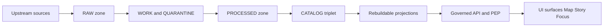

<!-- [KFM_META_BLOCK_V2]
doc_id: kfm://doc/1c4f8d2e-0c7f-4ae2-b4a4-3af0e9a2d1e6
title: Data Lifecycle
type: standard
version: v1
status: draft
owners: ["@kfm-stewards", "@data-platform"]
created: 2026-03-04
updated: 2026-03-04
policy_label: public
related: [
  "docs/governance/ROOT_GOVERNANCE_CHARTER.md",
  "docs/data/DATA_LIFECYCLE.md",
  "data/"
]
tags: ["kfm", "data-lifecycle", "truth-path", "promotion-contract", "provenance"]
notes: ["Defines lifecycle zones and promotion gates for the KFM truth path. This is a governed contract surface."]
[/KFM_META_BLOCK_V2] -->

# Data Lifecycle
One-line purpose: Define the **KFM truth path** (zones + gates) so datasets move from upstream → runtime **only** through enforceable, testable promotion rules.

---

## Impact
**Status:** draft (intended governed contract)  
**Owners:** `@kfm-stewards`, `@data-platform`  
**Applies to:** `data/` zones, catalog triplet outputs, promotion to runtime surfaces  
**Non-negotiables:** fail-closed, default-deny, immutable RAW, governed PUBLISHED

Badges (placeholders):
- 
- 
- 

Quick nav: [Scope](#scope) · [Truth path](#truth-path-overview) · [Zones](#data-lifecycle-zones) · [Promotion Contract](#promotion-contract) · [Directory layout](#recommended-directory-layout) · [DoD](#dataset-integration-definition-of-done)

---

## Evidence discipline legend
This document uses explicit claim labels:

- **CONFIRMED** — required posture described in KFM reference docs; treat as invariant.
- **PROPOSED** — recommended “house standard” that is compatible with invariants; adjust if repo differs.
- **UNKNOWN** — must be verified before being treated as truth; smallest verification steps are listed.

---

## Scope

- **CONFIRMED:** The KFM lifecycle is not a metaphor; it is **storage zones + validation gates** forming an auditable truth path.
- **CONFIRMED:** Promotion to runtime is blocked unless minimum gates are met (Promotion Contract).
- **PROPOSED:** This doc is the canonical explanation of the lifecycle for contributors; system enforcement MUST live in CI + policy tests (not only in prose).

---

## Where this fits in the repo

- **CONFIRMED:** `docs/` contains architecture and governance documentation; `data/` contains registry entries and zone artifacts.
- **CONFIRMED:** Runtime clients (UI, external) must not access stores directly; all access crosses a governed API and policy boundary (“trust membrane”).
- **PROPOSED:** Pair this doc with:
  - `policy/` (OPA/Rego policy + fixtures)
  - `contracts/` (schemas for receipt/catalog profiles)
  - `tools/` (validators + link checkers)
  - `data/registry/` (dataset onboarding specs)

---

## Inputs

Acceptable inputs to the lifecycle (things that belong in this process):

- **CONFIRMED:** Upstream source payloads (files, API responses, scrape snapshots) acquired via connectors/snapshots.
- **CONFIRMED:** Dataset onboarding specs/transform specs that can be deterministically hashed (spec hash).
- **CONFIRMED:** License/terms snapshots and rights metadata for each dataset version.
- **PROPOSED:** Attestations/SBOMs for pipelines and artifacts (strongly recommended for production posture).

---

## Exclusions

- **CONFIRMED:** Direct UI access to object storage / DBs (bypasses policy boundary) is not allowed.
- **PROPOSED:** Ad-hoc “one-off” datasets that lack manifests, digests, and catalogs must stay out of PUBLISHED surfaces (keep in sandbox/local only).
- **PROPOSED:** “Fixing” RAW by editing bytes is disallowed; supersede with a new acquisition/version instead.

---

## Truth path overview

### Truth path


### Trust membrane
- **CONFIRMED:** Clients (including the UI) never access storage directly; reads/writes must be policy-evaluated at the PEP and resolved via evidence/catalog surfaces.
- **PROPOSED:** Encode this as tests (network policies + static analysis + integration tests), not just conventions.

---

## Data lifecycle zones

### Zone definitions

> **Rule of thumb:** zones are *where* data lives; gates decide *whether* it can move forward.

| Zone | Intent | Mutability | Promotion allowed? | Required artifacts (minimum) |
|---|---|---:|---:|---|
| **RAW** | **CONFIRMED:** Immutable acquisition copy of upstream payloads + checksums; append-only. | Immutable | Yes (only by superseding) | acquisition manifest; raw artifacts; checksums; minimal metadata incl. license/terms snapshot |
| **WORK** | **CONFIRMED:** Intermediate transforms + QA; artifacts may be rewritten during iteration. | Mutable | Yes | normalized representations; QA reports; candidate redactions/generalizations |
| **QUARANTINE** | **CONFIRMED:** Isolation zone for failed validation, unclear licensing, sensitivity concerns, or upstream instability. | Mutable | **No** | failure reports; steward review notes; remediation plan |
| **PROCESSED** | **CONFIRMED:** Publishable artifacts in KFM-approved formats with stable IDs + checksums. | Immutable per version | Yes | processed artifacts; checksums; derived metadata (extents/ranges/counts) |
| **CATALOG triplet** | **CONFIRMED:** Cross-linked metadata + lineage surface: DCAT + STAC + PROV. | Immutable per version | Yes | DCAT dataset record; STAC collection/items/assets; PROV bundle; run receipts |
| **PUBLISHED** | **CONFIRMED:** Governed runtime surfaces served via API/UI with policy enforced. | Mutable by release events only | N/A | only promoted dataset versions; policy label assignment; resolvable EvidenceRefs |

---

## CATALOG triplet responsibilities

- **CONFIRMED:** **DCAT** is dataset-level metadata (license, publisher, distributions, themes).
- **CONFIRMED:** **STAC** is asset-level metadata for spatiotemporal artifacts (collections, items, assets).
- **CONFIRMED:** **PROV** is lineage for how artifacts were created (activities, agents, entities).
- **PROPOSED:** Treat the triplet as the primary interoperability surface; “citations” should resolve through these surfaces, not by pasting URLs.

---

## Promotion Contract

### What “promotion” means
- **CONFIRMED:** Promotion is the governed act of moving from Raw/Work into Processed + Catalog/Lineage, and therefore into runtime surfaces.

### Promotion Contract v1 — minimum gates

> **Rule:** Promotion to PUBLISHED MUST be blocked unless all minimum gates pass (fail-closed).

| Gate | Required (minimum) | Practical interpretation |
|---|---|---|
| **A — Identity and versioning** | **CONFIRMED:** dataset_id + dataset_version_id; deterministic spec_hash; content digests | version is immutable and reproducible; no “mystery updates” |
| **B — Licensing and rights** | **CONFIRMED:** license/rights fields + snapshot of upstream terms | if unclear → QUARANTINE |
| **C — Sensitivity and redaction plan** | **CONFIRMED:** policy_label + obligations (generalize geometry, remove fields, etc.) | restricted stays restricted; public derivatives must be provable |
| **D — Catalog triplet validation** | **CONFIRMED:** DCAT/STAC/PROV validate + cross-link; EvidenceRefs resolve without guessing | discovery + citations are deterministic |
| **E — QA and thresholds** | **CONFIRMED:** dataset-specific checks + thresholds documented in spec; QA report exists | quarantine if thresholds not met |
| **F — Run receipt and audit record** | **CONFIRMED:** run receipt enumerating inputs/outputs with checksums, tools/hashes, policy decisions; append-only audit record | reproducibility + accountability |
| **G — Release manifest** | **CONFIRMED intent:** promotion recorded as a release manifest referencing artifacts + digests | promotion is a recorded event, not a silent file move |

---

## Canonical vs rebuildable stores

- **CONFIRMED:** Canonical stores include the object store artifacts (RAW/WORK/PROCESSED), catalogs (DCAT/STAC/PROV), and an append-only audit ledger.
- **CONFIRMED:** Rebuildable projections include PostGIS/search/graph/tiles derived from processed artifacts and metadata.
- **PROPOSED:** Treat rebuildable projections as caches: safe to drop and rebuild from canonical truth.

---

## Deterministic identity and hashing

- **CONFIRMED:** Stable dataset and version IDs should be based on deterministic hashing of canonicalized specs (e.g., canonical JSON hashing).
- **PROPOSED (house standard):**
  - `dataset_id` is human-stable (controlled vocabulary / naming convention).
  - `dataset_version_id` is derived from `{dataset_id, spec_hash, upstream_version or fetch window}`.
  - Every artifact is digest-addressed (e.g., SHA-256) and referenced by digest in catalogs/receipts.

---

## Recommended directory layout

> **PROPOSED:** These are “house paths.” If your repo uses different paths, the **semantics** (zones + required artifacts) must still be met.

```text
data/
  registry/
    sources/                 # dataset onboarding specs (inputs, license, cadence, policy_label)
  raw/
    <dataset_id>/<dataset_version_id>/
      manifest.json
      artifacts/
      checksums.txt
      license_snapshot.txt
  work/
    <dataset_id>/<dataset_version_id>/
      normalized/
      qa/
      redaction_candidates/
    quarantine/
      <dataset_id>/<dataset_version_id>/
        failure_reports/
        steward_notes/
  processed/
    <dataset_id>/<dataset_version_id>/
      artifacts/
      checksums.txt
      derived_metadata.json
  catalog/
    dcat/<dataset_id>/<dataset_version_id>.jsonld
    stac/<dataset_id>/collection.json
    stac/<dataset_id>/<dataset_version_id>/items/
    prov/<dataset_id>/<dataset_version_id>/prov.bundle.jsonld
    receipts/<dataset_id>/<dataset_version_id>/run_receipt.json
  published/
    releases/
      <release_id>/manifest.json
```

---

## Dataset integration definition of done

A dataset integration is **DONE** only when:

- [ ] **Gate A** passes: dataset_id + dataset_version_id exist; spec_hash computed; artifact digests computed.
- [ ] **Gate B** passes: license/rights are explicit; upstream terms snapshot captured.
- [ ] **Gate C** passes: policy_label assigned; redaction/generalization plan exists if needed.
- [ ] **Gate D** passes: DCAT/STAC/PROV validate and cross-link; EvidenceRefs resolve.
- [ ] **Gate E** passes: QA checks exist and thresholds are met; QA report stored.
- [ ] **Gate F** passes: run receipt present; inputs/outputs enumerated with checksums; audit record appended.
- [ ] **Gate G** passes: release manifest recorded; references match artifact digests.

---

## FAQ

### What if the upstream license is unclear?
- **CONFIRMED posture:** Keep it in **QUARANTINE** (fail-closed) until rights are explicit.

### Can we edit RAW to fix an error?
- **CONFIRMED posture:** No. RAW is append-only; supersede with a new acquisition/version.

### Where do databases fit (PostGIS, graph, search)?
- **CONFIRMED:** They are rebuildable projections derived from canonical artifacts and catalogs.

---

## Appendix: run receipt skeleton (pseudocode)

> **PROPOSED:** Exact schema lives in `contracts/` (once formalized). This shows the minimum intent.

```json
{
  "type": "kfm.run_receipt.v1",
  "dataset_id": "example_dataset",
  "dataset_version_id": "dv_...",
  "spec_hash": "sha256:...",
  "inputs": [
    {"path": "data/raw/.../artifact.ext", "digest": "sha256:..."}
  ],
  "outputs": [
    {"path": "data/processed/.../artifact.parquet", "digest": "sha256:..."}
  ],
  "catalogs": {
    "dcat": "data/catalog/dcat/...jsonld",
    "stac": "data/catalog/stac/...collection.json",
    "prov": "data/catalog/prov/...prov.bundle.jsonld"
  },
  "policy": {
    "policy_label": "public",
    "decisions": []
  },
  "environment": {
    "runner": "ci-orchestrator",
    "git_sha": "deadbeef",
    "container_image_digest": "sha256:..."
  },
  "timestamps": {
    "started_at": "2026-03-04T00:00:00Z",
    "ended_at": "2026-03-04T00:05:00Z"
  }
}
```

---

## Back to top
[Back to top](#data-lifecycle)
