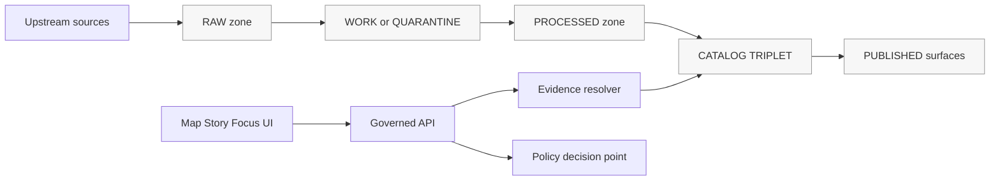

<!-- [KFM_META_BLOCK_V2]
doc_id: kfm://doc/3c1c7b8f-0d9e-4f8e-bf0c-3b86cc949d6f
title: KFM Data Glossary
type: standard
version: v1
status: draft
owners: TBD
created: 2026-03-01
updated: 2026-03-01
policy_label: public
related:
  - TODO: kfm://doc/<id>  # KFM Ultimate Blueprint / Governance Guide(s)
  - TODO: kfm://doc/<id>  # Tooling the KFM pipeline / Delivery Plan
tags: [kfm, glossary, data, governance, provenance, policy]
notes:
  - This glossary defines shared vocabulary for KFM datasets, catalogs, receipts, policy gates, and UI trust surfaces.
  - Terms carry a status label: CONFIRMED / PROPOSED / UNKNOWN.
[/KFM_META_BLOCK_V2] -->

# KFM Data Glossary
Shared vocabulary for **data → pipelines → catalogs/provenance → governed APIs → Map/Story/Focus UI**.

> **Rule of thumb:** If two contributors use the same word to mean different things, KFM’s “truth path” breaks quietly. This file exists to prevent that.

---

## Quick navigation
- [Scope](#scope)
- [Status vocabulary](#status-vocabulary)
- [Truth path diagram](#truth-path-diagram)
- [Core terms](#core-terms)
  - [Governance and trust](#governance-and-trust)
  - [Data lifecycle and promotion](#data-lifecycle-and-promotion)
  - [Catalogs and provenance](#catalogs-and-provenance)
  - [Identity, hashing, and immutability](#identity-hashing-and-immutability)
  - [Policy, access control, and redaction](#policy-access-control-and-redaction)
  - [Evidence and citations](#evidence-and-citations)
  - [UI trust surfaces and narratives](#ui-trust-surfaces-and-narratives)
  - [Time](#time)
  - [Formats and “practical tech terms”](#formats-and-practical-tech-terms)
- [Abbreviations](#abbreviations)
- [Change process](#change-process)

---

## Scope
**What this file is for**
- Definitions used in **schemas**, **tests**, **pipeline receipts**, **catalog profiles**, **policy rules**, and **UI trust surfaces**.

**What this file is not for**
- General CS terms (put those elsewhere).
- Detailed implementation choices (those belong in ADRs / design docs).

---

## Status vocabulary
Each term carries a status tag:

- **CONFIRMED** — Required posture/contract/invariant (should be enforceable in tests/gates).
- **PROPOSED** — Recommended pattern or default; replaceable if governance approves.
- **UNKNOWN** — We know we need a term, but the repo/policies/specs haven’t settled it yet.

---

## Truth path diagram

> NOTE: The **trust membrane** requires UI/clients to go through governed interfaces (API + evidence resolver + policy), never directly to storage/indexes.

---

# Core terms

## Governance and trust

- **Trust membrane** *(CONFIRMED)*: The governance/security boundary enforcing that:
  - clients and frontend do **not** access databases/object storage directly,
  - core backend logic does **not** bypass repository interfaces,
  - access flows through governed APIs that apply policy decisions, redactions, and logging consistently.  
  If broken, policy enforcement and provenance integrity are not trustworthy.

- **Truth path** *(CONFIRMED)*: The auditable lifecycle from **Upstream → RAW → WORK/QUARANTINE → PROCESSED → CATALOG/TRIPLET → PUBLISHED**, enforced by validation and promotion gates.

- **Canonical vs rebuildable stores** *(CONFIRMED concept)*:
  - **Canonical**: object storage + catalogs + provenance (source of truth).
  - **Rebuildable projections**: databases, search indexes, tiles, and derived indexes (recomputed from promoted artifacts).

- **Fail-closed** *(CONFIRMED posture)*: When rights/policy/citations/evidence cannot be verified, the system blocks promotion/publishing or abstains/reduces scope.

---

## Data lifecycle and promotion

- **Upstream** *(CONFIRMED)*: The external source(s) being acquired (APIs, files, sensors, imagery). Upstream is *not* controlled by KFM.

- **RAW zone** *(CONFIRMED)*: Immutable acquisition copy of upstream payloads plus checksums; append-only.  
  Typical contents: downloaded files, API snapshots, fetch logs, upstream license/terms snapshot, acquisition manifest.

- **WORK zone** *(CONFIRMED)*: Intermediate transforms and QA where failures are isolated; artifacts may be rewritten.  
  Typical contents: normalization outputs, reprojections, tiling jobs, QA reports, redaction/generalization candidates.

- **QUARANTINE** *(CONFIRMED)*: A subset of WORK used for items that failed validation or have unclear licensing/sensitivity/instability. Quarantined items are **not promoted**.

- **PROCESSED zone** *(CONFIRMED)*: Publishable artifacts in standardized formats with stable IDs and checksums.  
  Typical contents: GeoParquet / PMTiles / COG (or other approved formats), derived layers, final QA results.

- **CATALOG/TRIPLET zone** *(CONFIRMED)*: Cross-linked **DCAT + STAC + PROV** describing metadata, assets, and lineage, plus run receipts / link maps.

- **PUBLISHED** *(CONFIRMED)*: Governed runtime surfaces served via the **PEP/API** and UI; policy enforced. Only promoted dataset versions appear here.

- **Promotion** *(CONFIRMED)*: The act of moving a dataset version from Raw/Work into **Processed + Catalog/Lineage**, and therefore into runtime surfaces.

- **Promotion Contract** *(CONFIRMED)*: The minimum required gates that must pass before promotion/publishing. Gates are framed to be automated in CI and reviewed for steward sign-off.

- **Promotion manifest** *(CONFIRMED artifact)*: A release record describing a dataset version promotion (IDs, spec hash, artifact digests, catalog digests, QA status, policy decision, approvals, timestamps). Supports reproducibility and rollback.

---

## Catalogs and provenance

- **Catalog triplet** *(CONFIRMED)*: KFM’s interoperability + evidence surface:
  - **DCAT**: dataset-level metadata (license, publisher, distributions, themes, coverage).
  - **STAC**: asset-level metadata for spatiotemporal artifacts (collections, items, assets).
  - **PROV**: lineage describing how artifacts were created (activities, agents, entities).

- **DCAT** *(CONFIRMED usage)*: Data Catalog Vocabulary used to describe datasets and distributions (what it is, who published it, license, distributions).

- **STAC** *(CONFIRMED usage)*: SpatioTemporal Asset Catalog describing geospatial assets with spatiotemporal extents (collections, items, assets).

- **PROV / PROV-O** *(CONFIRMED usage)*: W3C provenance model for lineage (entities, activities, agents; used/generated relationships).

- **Profile** *(PROPOSED structure, CONFIRMED need)*: A constrained subset of a standard (e.g., “KFM DCAT profile”) that defines required fields so validation is strict and predictable.

---

## Identity, hashing, and immutability

- **Dataset** *(CONFIRMED)*: A logical dataset identity (e.g., “USGS NWIS (Kansas)”).

- **DatasetVersion** *(CONFIRMED)*: An immutable version of a dataset corresponding to a specific promoted output set. A dataset can have many versions over time.

- **Artifact** *(CONFIRMED)*: A concrete file/object produced by a run and referenced by DCAT/STAC/PROV (GeoParquet, PMTiles, COG, JSONL, PDF, etc.).

- **Digest / checksum** *(CONFIRMED concept)*: A cryptographic hash recorded for artifacts (commonly `sha256`). Used for integrity, caching, and reproducibility.

- **Content-addressed artifact** *(PROPOSED convention, aligned to sources)*: An artifact referenced by digest (not just by path), enabling verification and deduplication.

- **Deterministic identity** *(CONFIRMED)*: Dataset and version identities should be stable and reproducible from canonical inputs.

- **spec_hash** *(CONFIRMED concept; PROPOSED mechanism)*: A deterministic hash computed from a canonicalized spec/config to prevent “hash drift” and support caching/signature verification.

- **JSON canonicalization (RFC 8785 JCS)** *(PROPOSED mechanism; referenced standard)*: Recommended approach for stable hashing of JSON-like specs.

---

## Policy, access control, and redaction

- **Policy label** *(CONFIRMED)*: Primary classification input for policy evaluation (e.g., public/restricted). Policy evaluation returns allow/deny plus obligations and reason codes.

- **Obligation** *(CONFIRMED concept)*: A required transformation or constraint returned by policy (e.g., “generalize geometry”, “remove attributes”, “redact fields”), recorded and explainable.

- **Redaction** *(CONFIRMED concept)*: Removing or masking sensitive fields/content as required by policy/rights.

- **Generalization** *(CONFIRMED concept)*: Reducing precision (e.g., coarse geometry / aggregated counts) to reduce sensitivity risk; should be recorded in lineage/PROV.

- **Policy Decision Point (PDP)** *(CONFIRMED pattern)*: The component that evaluates policy (e.g., OPA).

- **Policy Enforcement Point (PEP)** *(CONFIRMED pattern)*: The components that enforce the policy decision:
  - CI gates (schema/policy tests),
  - runtime API checks before serving data,
  - evidence resolver checks before resolving/rendering bundles.

- **Policy-safe errors** *(CONFIRMED requirement)*: Error behavior must not leak restricted dataset existence or sensitive metadata (e.g., avoid inference via 403 vs 404 patterns).

---

## Evidence and citations

- **Evidence-first UX** *(CONFIRMED concept)*: Every layer/story claim/answer should be openable into an evidence view showing dataset version, license, policy label + redactions, provenance chain, and artifact checksums.

- **EvidenceRef** *(CONFIRMED)*: A stable reference to evidence using explicit schemes the resolver can resolve in bounded calls, such as:
  - `dcat://...` (dataset/distribution metadata)
  - `stac://...` (collection/item/asset metadata)
  - `prov://...` (run lineage)
  - `doc://...` (governed docs/story citations)
  - `graph://...` (entity relations; if enabled)

- **Evidence resolver** *(CONFIRMED concept)*: Service/component that accepts EvidenceRef(s), applies policy, and returns an EvidenceBundle; must fail closed if unresolvable/unauthorized.

- **EvidenceBundle** *(CONFIRMED)*: The resolved evidence view returned by the resolver (human + machine fields + policy decision results). Bundles are immutable by digest for caching and reproducibility.

- **Citation verification (hard gate)** *(CONFIRMED posture)*: Story publishing and Focus Mode must verify each citation resolves and is policy-allowed; otherwise abstain or narrow scope.

---

## UI trust surfaces and narratives

- **Evidence drawer** *(CONFIRMED concept; required fields defined)*: The primary trust surface in the UI (not “just details”). Minimum required fields include:
  - evidence bundle ID + digest
  - DatasetVersion ID + dataset name
  - license + rights holder (with attribution)
  - freshness and validation status
  - provenance chain (run receipt link)
  - artifact links (only if policy allows)
  - redactions applied + human explanation

- **Story Node** *(CONFIRMED concept)*: Versioned narrative content bound to map state, with resolvable citations (citations should open the evidence drawer).

- **Focus Mode** *(CONFIRMED)*: A governed workflow (not a general chatbot): policy pre-check → admissible evidence retrieval → evidence bundle creation → answer synthesis → citation verification → audit run receipt. If citations cannot be verified or policy denies, it must abstain or reduce scope.

---

## Time

- **Event time** *(PROPOSED model; recommended)*: When the underlying event/phenomenon occurred (e.g., storm date, sensor observation time).

- **Transaction time** *(PROPOSED model; recommended)*: When KFM acquired/published the record.

- **Valid time** *(PROPOSED model; recommended)*: When a statement is considered true (useful for boundary changes / administrative history).

- **Freshness** *(CONFIRMED UX need)*: User-facing notion of “how recently the data was updated,” usually derived from run timestamps and version history (must be evidence-backed).

---

## Formats and “practical tech terms”

- **GeoParquet** *(CONFIRMED term)*: Geospatial encoding for Apache Parquet; efficient analytics format.

- **PMTiles** *(CONFIRMED term)*: Single-file vector tile container optimized for static hosting/CDNs.

- **COG** *(CONFIRMED term)*: Cloud-Optimized GeoTIFF (tiled + overviews for efficient HTTP range reads).

- **JSON-LD** *(CONFIRMED usage)*: Common encoding used for DCAT/PROV bundles (Linked Data JSON).

- **OPA / Rego** *(CONFIRMED term)*: Policy-as-code used for CI gates (e.g., Conftest) and runtime checks.

- **OpenLineage** *(PROPOSED integration term)*: Standard event model for lineage/observability (jobs, runs, datasets).

- **Cosign / Sigstore** *(PROPOSED integration term)*: Tooling for signing/verifying artifacts, images, attestations.

- **SLSA** *(PROPOSED integration term)*: Supply-chain levels for software artifacts; provenance models/levels.

- **SBOM** *(PROPOSED integration term)*: Software bill of materials (SPDX/CycloneDX).

- **H3** *(PROPOSED integration term)*: Hexagonal hierarchical indexing system useful for tiling/diffing.

- **SensorThings** *(PROPOSED integration term)*: OGC standard for sensor observation time-series APIs.

- **lakeFS** *(PROPOSED integration term)*: Git-like branching for object storage; enables preview branches and rollback.

---

## Abbreviations
- **DCAT** — Data Catalog Vocabulary
- **STAC** — SpatioTemporal Asset Catalog
- **PROV** — Provenance (W3C PROV-O model)
- **PDP** — Policy Decision Point
- **PEP** — Policy Enforcement Point
- **COG** — Cloud-Optimized GeoTIFF
- **SBOM** — Software Bill of Materials
- **SLSA** — Supply-chain Levels for Software Artifacts

---

## Change process
1. Add new terms only if they are used by (or about to be used by) schemas/tests/pipelines/catalogs/policy/UI.
2. Every new term MUST include:
   - definition
   - status (CONFIRMED / PROPOSED / UNKNOWN)
   - at least one “See also” pointer (to avoid orphan terms)
3. Avoid “synonym drift”: if a new term overlaps an existing one, prefer tightening the existing definition.
4. If a term affects governance/safety/rights, it must align with policy labels + obligations and fail-closed posture.

---

<a href="#kfm-data-glossary">Back to top</a>
