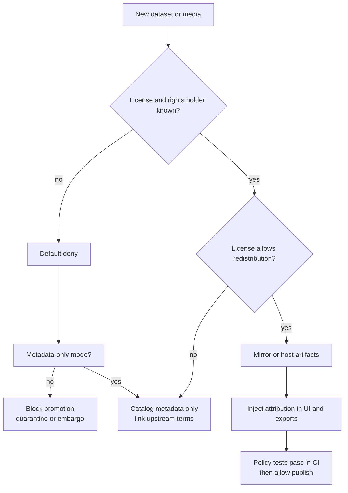

<!-- [KFM_META_BLOCK_V2]
doc_id: kfm://doc/4c71ae90-742e-44b3-b5a5-6169f8c6e0ff
title: Licensing and Attribution
type: standard
version: v1
status: draft
owners: KFM Data Stewards
created: 2026-03-04
updated: 2026-03-04
policy_label: public
related: []
tags: [kfm, data, licensing, attribution, governance]
notes: ["Default-deny for unclear rights; machine-readable SPDX; metadata-only mode supported."]
[/KFM_META_BLOCK_V2] -->

# Licensing and Attribution
One place to define **how KFM records, verifies, and enforces** dataset rights, licenses, and attribution across `RAW → WORK → PROCESSED → PUBLISHED`.

> **Not legal advice.** This is an operational standard for KFM governance and CI gates.

---

## Impact
**Status:** draft (fail-closed rules are still valid)  
**Owners:** KFM Data Stewards (DATA-STEWARDSHIP)  
**Applies to:** any dataset, layer, media asset, document excerpt, or derived product surfaced in UI, Story Nodes, exports, or Focus Mode  
**Default posture:** **default-deny** if rights are unclear

**Quick links**
- [Definitions](#definitions)
- [Non-negotiable rules](#non-negotiable-rules)
- [Where rights metadata must live](#where-rights-metadata-must-live)
- [Attribution text format](#attribution-text-format)
- [Promotion checklist](#promotion-checklist)

---

## Scope
This document covers:
- how to **classify** licensing/rights for *data* and *media* used by KFM,
- how to **encode** licensing/attribution into catalog artifacts (DCAT/STAC/PROV) and evidence bundles,
- how to **enforce** licensing via CI and runtime policy checks,
- how to handle **unknown/ambiguous** rights (fail-closed).

### Exclusions
- **Code** licensing for the software repository (use root `LICENSE`, SPDX headers, SBOMs).
- Contract interpretation for unusual licenses (requires governance/legal review).

---

## Where this fits
KFM treats licensing/rights as a first-class policy input, not optional metadata:

- **[CONFIRMED]** Promotion gates require license and rights-holder metadata for each distribution; unclear rights block promotion.  
- **[CONFIRMED]** “Metadata-only reference” is allowed when mirroring is not permitted.  
- **[CONFIRMED]** Export functions must automatically include attribution and license text.  
- **[CONFIRMED]** Story publishing must block if rights are unclear for included media.

---

## Definitions
Use these words consistently in KFM artifacts:

- **License (SPDX)**: the machine-readable license identifier or expression governing reuse (e.g., `CC-BY-4.0`, `ODbL-1.0`, `CC0-1.0`).
- **Rights holder**: the person/organization holding copyright or database rights (or the authority asserting public domain).
- **Attribution**: the human-readable credit statement required by the license or by KFM policy.
- **Obligations**: required actions triggered by policy (e.g., “show attribution”, “share-alike”, “no-derivative export”, “metadata-only”).
- **Metadata-only mode**: KFM catalogs the item and links to upstream, but does not mirror or redistribute the underlying asset.

### Conformance markers
This standard uses three tags on normative statements:

- **[CONFIRMED]**: grounded in KFM governance documents and required for promotion/runtime behavior.
- **[PROPOSED]**: recommended convention that should become CONFIRMED once adopted via governance/ADR.
- **[UNKNOWN]**: intentionally unspecified; requires a specific verification step before it can be treated as CONFIRMED.

### Unknowns that must be resolved (smallest verification steps)
- **[UNKNOWN]** KFM’s **SPDX allowlist/denylist** for publication (e.g., which licenses are considered publishable by default).  
  Smallest step: add `policy/rights/allowed_spdx.json` (or equivalent) + a Conftest/OPA rule referencing it.
- **[UNKNOWN]** Where **terms snapshots** are stored in the repo/object store (path convention + retention period).  
  Smallest step: document `evidence/terms/` storage contract and add one example snapshot to a PR.
- **[UNKNOWN]** Who the **rights escalation authority** is (data steward vs legal reviewer vs working group) for edge cases.  
  Smallest step: add a CODEOWNERS rule for `docs/data/LICENSING_AND_ATTRIBUTION.md` and a short “Rights Review” workflow doc.

## Non-negotiable rules

### Rule 1 — Online ≠ reusable
- **[CONFIRMED]** “Online availability does not equal permission to reuse.”  
- **[CONFIRMED]** If rights are unclear: **default-deny** for mirroring/redistribution; prefer metadata-only.

### Rule 2 — Every distribution must have rights metadata
- **[CONFIRMED]** Every **published distribution / asset** must declare:
  - license (prefer SPDX),
  - rights holder,
  - attribution text (or a pointer to it),
  - any share-alike / non-commercial / other restrictions.

### Rule 3 — The UI must surface license + attribution
- **[CONFIRMED]** Evidence resolution must return (at minimum) `dataset_version_id` and `license` in evidence cards so UI can display it.
- **[CONFIRMED]** Evidence drawers and story publish flows must show licensing and block unresolved rights.

### Rule 4 — CI and runtime policy must match
- **[CONFIRMED]** CI policy tests (OPA/Rego/Conftest) and runtime policy checks must share the same semantics (or the same fixtures and outcomes), otherwise CI guarantees are meaningless.

---

## Where rights metadata must live
Rights data must be present in **at least two** places: (1) *source registry* and (2) *published catalogs*.

### 1) Source registry entry
- **[CONFIRMED]** Every upstream source must include `license/rights` and `sensitivity` in the source registry.
- **[PROPOSED]** Registry file location convention:
  - `data/registry/sources/<source_id>.yaml` (one file per source)

**Minimum registry fields (example)**
```yaml
source_id: noaa_ncei_storm_events
authority: NOAA NCEI
access_method: bulk_csv
cadence: monthly
license_rights:
  rights_spdx: CC0-1.0          # or public-domain marker if applicable
  rights_holder: NOAA
  terms_url: https://example.gov/terms
  terms_snapshot_ref: evidence/terms/noaa_ncei_storm_events_2026-03-04.pdf
sensitivity:
  policy_label: public
notes:
  - "verify terms snapshot each major version"
```

### 2) DCAT dataset record
- **[CONFIRMED]** KFM DCAT profile requires `dct:license` (or `dct:rights`) and distributions.

**Minimum expectations (operational)**
- **[CONFIRMED]** Dataset-level: `dct:license` (or `dct:rights`) must be present.
- **[PROPOSED]** Each `dcat:distribution` includes:
  - media type,
  - access URL (or download URL),
  - checksum/digest,
  - license (if different from dataset-level),
  - attribution pointer.

### 3) STAC collections/items
- **[CONFIRMED]** STAC collection must include `license`.
- **[PROPOSED]** STAC item assets should carry:
  - `roles`,
  - `type` (media type),
  - `checksum` / digest fields (if your STAC profile allows),
  - `kfm:attribution_ref` (or equivalent) pointing at attribution text.

### 4) PROV bundle
- **[PROPOSED]** Record rights decisions as policy inputs/outputs:
  - `kfm:rights_decision` (allow/deny/metadata-only),
  - `kfm:obligations[]` (attribution required, share-alike propagation, etc.),
  - pointer to terms snapshot used for the decision.

### 5) Evidence bundles returned by the resolver
- **[CONFIRMED]** Evidence cards should include `license` alongside `dataset_version_id` and artifact digests.
- **[PROPOSED]** Evidence policy output should include `obligations[]` so UI/export can apply attribution automatically.

---

## SPDX and machine-readable licenses

### Required format
- **[PROPOSED]** Prefer SPDX identifiers (e.g., `CC-BY-4.0`) for:
  - dataset metadata,
  - STAC `license`,
  - SBOMs and package manifests,
  - policy receipts / run manifests.

### CI gate (recommended)
- **[PROPOSED]** Add a fast “SPDX guard” that scans:
  - `package.json`, `pyproject.toml`,
  - STAC/DCAT JSON/YAML,
  - other catalog-like files,
and fails if license strings are not SPDX IDs (URLs allowed for DCAT).

---

## Attribution text format
Attribution must be **copy/paste safe** for (a) UI overlays, (b) exported files, and (c) printed reports.

### Required attribution fields
- **[PROPOSED]** Every attribution statement should include:
  - source/authority name,
  - dataset title,
  - canonical source URL,
  - access date (UTC),
  - license (SPDX),
  - modification note (if KFM transformed it).

### Recommended templates

**Short (UI/map layer)**
```text
© <Rights holder> — <Source name>. License: <SPDX-ID>. Accessed <YYYY-MM-DD>.
```

**Long (exports/report footers)**
```text
Source: <Source name> (<source_url>, accessed <YYYY-MM-DD>).
Dataset: <dataset_title> (version <dataset_version_id>).
License: <SPDX-ID>. Rights holder: <rights_holder>.
Modifications: <none|generalized|reprojected|filtered|derived>.
Attribution required by license and KFM policy.
```

---

## Special license cases

### OpenStreetMap / ODbL
- **[CONFIRMED]** OSM-derived products require ODbL attribution and license propagation checks.
- **[PROPOSED]** Enforce in CI:
  - STAC/Collection `license: ODbL-1.0`,
  - providers include “OpenStreetMap contributors”,
  - embed an attribution string in metadata (and in PMTiles headers if used),
  - deny merge if attribution/license is missing.

### Non-commercial / no-derivatives licenses
- **[PROPOSED]** Treat NC/ND licenses as **restricted for redistribution** unless governance approves a compliant publication mode (often metadata-only).

### Unknown license / unclear rights
- **[CONFIRMED]** Fail closed:
  - block promotion,
  - set `policy_label: quarantine` or `embargoed` (per controlled vocab),
  - allow metadata-only only after steward review confirms it doesn’t violate terms.

---

## Promotion checklist
Use this checklist for dataset PRs and release gates.

### Required (must be CONFIRMED before promotion)
- **[CONFIRMED]** Source registry entry includes license/rights and sensitivity.
- **[CONFIRMED]** DCAT record contains `dct:license` (or `dct:rights`) and distributions.
- **[CONFIRMED]** STAC collection contains `license`.
- **[CONFIRMED]** Evidence resolver can surface `license` in evidence cards for UI.
- **[CONFIRMED]** Story publish gate blocks when rights are unclear for any included media.
- **[CONFIRMED]** Exports include attribution and license text automatically.

### Recommended (should be CONFIRMED for “governed publish”)
- **[PROPOSED]** Terms snapshot captured (PDF/HTML) and stored as immutable evidence.
- **[PROPOSED]** SPDX strings validated in CI (SPDX guard).
- **[PROPOSED]** Policy fixtures exist for allow/deny cases of the dataset.
- **[PROPOSED]** PROV bundle records the rights decision and obligations.

---

## Decision flow


---

## Appendix
<details>
<summary>Suggested controlled fields (starter)</summary>

These are **PROPOSED** starter fields to standardize across catalogs, receipts, and evidence bundles:

- `rights_spdx`: SPDX ID or SPDX expression
- `rights_status`: `clear | unclear | disputed | unknown`
- `rights_mode`: `mirror_ok | metadata_only | blocked`
- `obligations[]`:
  - `show_attribution`
  - `share_alike`
  - `no_commercial_use`
  - `no_derivative_exports`
  - `include_license_text`
  - `terms_snapshot_required`

</details>
