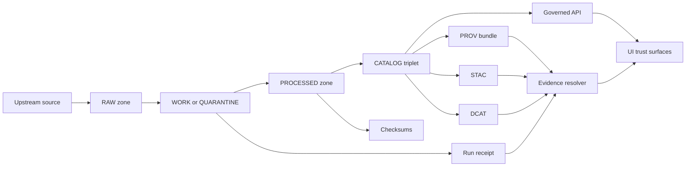

<!-- [KFM_META_BLOCK_V2]
doc_id: kfm://doc/7b9c2a8f-0c53-4b0c-9f8e-0f0b2d8c8c2a
title: Provenance and Receipts
type: standard
version: v1
status: draft
owners: TBD
created: 2026-03-04
updated: 2026-03-04
policy_label: public
related: [docs/data/]
tags: [kfm, provenance, prov, receipts, audit, promotion]
notes: ["Defines receipt artifacts and verification rules used by Promotion Contract gates and Evidence resolution."]
[/KFM_META_BLOCK_V2] -->

# Provenance and Receipts
Standards for generating, storing, validating, and serving **run receipts** and related **audit artifacts** across the KFM truth path.

> **IMPACT**
> - **Status:** draft
> - **Owners:** TBD (data stewardship + platform)
> - **Last updated:** 2026-03-04
> - **Badges (TODO wire to CI):**  
>     
>     
>   

**Quick nav:**  
- [Scope](#scope)  
- [Where it fits](#where-it-fits)  
- [Inputs](#acceptable-inputs)  
- [Exclusions](#exclusions)  
- [Status labels](#status-labels-confirmed-proposed-unknown)  
- [Truth path and gates](#truth-path-and-promotion-gates)  
- [Receipt artifact types](#receipt-artifact-types)  
- [Minimum required fields](#minimum-required-fields)  
- [Validation and fail-closed rules](#validation-and-fail-closed-rules)  
- [Examples](#examples)  
- [Definition of Done](#definition-of-done)  
- [Unknowns to verify](#unknowns-to-verify)  

---

## Scope

- **[CONFIRMED]** This doc defines the **minimum “receipt layer”** required to make provenance auditable and promotion gate-checkable across KFM’s lifecycle zones (RAW → WORK/QUARANTINE → PROCESSED → CATALOG/TRIPLET → PUBLISHED).  
- **[CONFIRMED]** It focuses on **run receipts + checksums + references** to catalogs (DCAT/STAC/PROV), policy decisions, and approvals, so that evidence can be resolved deterministically (no “guessing”).  
- **[PROPOSED]** It also standardizes two optional helper artifacts: `run_record.json` and `run_manifest.json`, to reduce ambiguity and make CI checks simpler.

---

## Where it fits

- **[CONFIRMED]** KFM’s “truth path” includes **CATALOG/TRIPLET (DCAT+STAC+PROV + run receipts)** and then feeds governed APIs and UI trust surfaces.  
- **[CONFIRMED]** Promotion to **PUBLISHED** must be blocked unless the minimum gates are met, including **run receipt + audit record** requirements.  
- **[CONFIRMED]** Receipts are part of the **Evidence-first UX** expectation: user-facing surfaces should be able to open a layer/claim into dataset version, license, policy label, provenance chain (run receipt/activity), and checksums.

---

## Acceptable inputs

- **[CONFIRMED]** JSON (and JSON-LD where applicable) for:
  - Run receipts
  - Promotion manifests / release indexes (if used)
  - Policy decisions
  - Provenance bundles (W3C PROV)
  - Catalog entries (DCAT, STAC)
- **[CONFIRMED]** Text checksum manifests (e.g., `checksums.txt` using `sha256` lines).
- **[PROPOSED]** JSON Schemas (version-pinned) for the above artifacts, stored alongside tooling.

---

## Exclusions

- **[CONFIRMED]** Do **not** store secrets (tokens, keys, credentials) in receipts or audit artifacts.
- **[CONFIRMED]** Do **not** store unrestricted access instructions (private endpoints, direct object-store URLs) in receipts that might become public.
- **[PROPOSED]** If a receipt must reference sensitive endpoints/locations:
  - store a **policy-safe redacted receipt** for public surfaces, and
  - keep the full receipt **restricted** under governed access control.
- **[CONFIRMED]** Raw source payloads and large binaries belong in data zones (RAW/PROCESSED), not in this doc directory.

---

## Status labels: CONFIRMED / PROPOSED / UNKNOWN

Use these labels on every meaningful claim:

- **[CONFIRMED]** Supported directly by KFM blueprint / architecture documents.
- **[PROPOSED]** Recommended pattern aligned with KFM intent, but not guaranteed implemented.
- **[UNKNOWN]** Not verifiable from current repo evidence; includes minimal steps to confirm.

---

## Truth path and Promotion Gates

### Lifecycle zones

**[CONFIRMED]** KFM’s lifecycle is a set of storage zones + gates that form an auditable truth path.

| Zone | Meaning | Typical contents (examples) | Promotion allowed? |
|---|---|---|---|
| RAW | Immutable acquisition (append-only) | Upstream payload snapshots + checksums + license/terms snapshot | Yes → WORK |
| WORK / QUARANTINE | Intermediate transforms + QA | Normalization outputs, QA reports, redaction candidates | Only if passes QA |
| PROCESSED | Publishable artifacts | GeoParquet / COG / PMTiles / normalized corpora + checksums | Yes → CATALOG |
| CATALOG / TRIPLET | Evidence surface | DCAT + STAC + PROV cross-linked (+ run receipts) | Yes → PUBLISHED |
| PUBLISHED | Governed runtime surfaces | API outputs, tiles endpoints, story pages, Focus answers (each with receipts) | N/A |

> Back to top: [Quick nav](#provenance-and-receipts)

### Promotion gates

**[CONFIRMED]** Promotion is **fail-closed**: moving a dataset version into runtime surfaces must be blocked unless required artifacts exist and validate.

| Gate | What must be present | Receipt relevance |
|---|---|---|
| Identity & versioning | dataset_version_id + deterministic `spec_hash` + content digests | Receipts must reference these |
| Licensing & rights | SPDX + upstream terms snapshot | Receipts should link to license snapshot |
| Sensitivity classification | `policy_label` + obligations | Receipts must reference decision/obligations |
| Catalog triplet validation | DCAT/STAC/PROV validate + cross-links resolve | Receipts must point to catalogs by digest |
| QA thresholds | Dataset-specific QA reports and thresholds | Receipt includes validation summary |
| Run receipt & audit record | Run receipt capturing inputs, tooling, hashes, policy decisions; append-only audit record | **This doc** defines it |
| Release manifest | Release/promotion manifest referencing artifacts + digests | Receipts must be indexable |

---

## Receipt artifact types

### 1) `spec.json` and `spec_hash`

- **[CONFIRMED]** Deterministic identity/hashing is recommended via **canonical JSON hashing (RFC 8785 JCS) → SHA-256** to prevent drift and support verification/caching.
- **[PROPOSED]** Store:
  - `spec/spec.json` (the exact transform spec used),
  - `spec/spec_hash.txt` containing `sha256:<digest>` (or `jcs:sha256:<digest>`).

### 2) `checksums.txt`

- **[CONFIRMED]** Every artifact that matters for promotion MUST have a checksum recorded and re-verifiable.
- **[PROPOSED]** Format:
  - one line per file
  - `sha256  <hex>  <relative/path>`

### 3) `run_receipt.json`

- **[CONFIRMED]** A run receipt captures:
  - run identity
  - actor/agent
  - operation
  - dataset version
  - inputs/outputs with digests
  - environment capture (container digest, git commit, params digest)
  - validation summary
  - policy decision reference
  - created_at

This is the minimal receipt that should be resolvable and auditable.

### 4) Optional helpers: `run_record.json` and `run_manifest.json`

- **[PROPOSED]** `run_record.json` (“who/when/where/outcome”) and `run_manifest.json` (“what files were produced, sizes, media types, logical roles”) are useful in CI and promotion checks.
- **[CONFIRMED]** KFM gate checklists commonly expect **run_record + run_manifest + spec_hash** patterns as a “5-minute gate” before promotion.

### 5) `policy_decision.json` (or policy decision reference)

- **[CONFIRMED]** Policy evaluation returns **allow/deny** plus **obligations** and reason codes; decisions need stable IDs for auditing and UX.
- **[PROPOSED]** Store the decision object itself (restricted if needed), and always store a policy-safe reference in receipts.

### 6) Promotion / release manifests

- **[CONFIRMED]** A promotion manifest template exists that records dataset_version_id, spec_hash, released_at, artifacts (path/digest/media_type), catalog digests, QA status, policy label + decision ref, approvals.

### 7) Evidence Bundle (resolver output)

- **[CONFIRMED]** The evidence resolver resolves an EvidenceRef → **EvidenceBundle** that includes:
  - dataset_version_id
  - policy decision summary
  - license
  - provenance run_id
  - artifacts with digests and media types
  - audit_ref

Receipts should make evidence resolution deterministic (bundle can be built without guessing).

---

## Minimum required fields

### Run receipt v1 — minimum shape (normative)

- **[CONFIRMED]** Required keys (minimum) for `run_receipt.json`:

| Field | Type | Notes |
|---|---|---|
| `run_id` | string | Prefer stable URI (e.g., `kfm://run/...`) |
| `actor` | object | `principal`, `role` |
| `operation` | string | `ingest`, `transform`, `publish`, etc |
| `dataset_version_id` | string | Immutable dataset version identifier |
| `inputs[]` | array | each: `{uri,digest}` |
| `outputs[]` | array | each: `{uri,digest}` |
| `environment` | object | `container_digest`, `git_commit`, `params_digest` |
| `validation` | object | at least `status`; optionally `report_digest` |
| `policy` | object | `decision_id` and/or embedded safe summary |
| `created_at` | string | ISO-8601 UTC recommended |

### Promotion checklist alignment

- **[CONFIRMED]** Before promotion, a “fast gate” typically checks:
  - checksums match,
  - catalogs exist and validate,
  - provenance attached (PROV),
  - license is declared (SPDX),
  - sensitivity classification present,
  - run receipt present,
  - CI attestation available,
  - CODEOWNERS review completed.

---

## Validation and fail-closed rules

### Core rule

- **[CONFIRMED]** If receipt/citation/provenance verification fails, the system must **fail closed** (block promotion and/or abstain at runtime surfaces).

### CI checks (minimum)

- **[CONFIRMED]** The gate should be automatable in CI and reviewable by stewards.  
- **[PROPOSED]** Minimum mechanical checks:

1. Recompute `spec_hash` from `spec.json` (RFC 8785 JCS) and compare.
2. Validate `run_receipt.json` against a pinned JSON Schema.
3. Verify `checksums.txt` against every referenced artifact (recompute sha256).
4. Validate catalogs (DCAT/STAC/PROV) and ensure cross-links resolve.
5. Verify policy label presence and that obligations are either applied or promotion is blocked.
6. If signatures/attestations are enabled: verify the attestation(s) and record verified result.

### Receipts must not leak sensitive data

- **[PROPOSED]** Add a policy gate denying receipts that include:
  - precise coordinates for restricted datasets,
  - private endpoints,
  - PII fields,
  - secrets.

---

## Reference diagram



> Back to top: [Quick nav](#provenance-and-receipts)

---

## Examples

### Example: `run_receipt.json` (minimal, policy-safe)

```json
{
  "schema": "kfm://schema/run-receipt-v1",
  "run_id": "kfm://run/2026-03-04T18:00:00Z.example",
  "actor": { "principal": "svc:pipeline", "role": "pipeline" },
  "operation": "ingest+publish",
  "dataset_version_id": "kfm://dataset_version/example_dataset/2026-03-04T18:00:00Z",
  "inputs": [
    { "uri": "raw/example/source.csv", "digest": "sha256:111111..." }
  ],
  "outputs": [
    { "uri": "processed/example/events.parquet", "digest": "sha256:222222..." }
  ],
  "environment": {
    "container_digest": "sha256:img...",
    "git_commit": "deadbeef",
    "params_digest": "sha256:333333..."
  },
  "validation": { "status": "pass", "report_digest": "sha256:777777..." },
  "policy": {
    "decision_id": "kfm://policy_decision/xyz",
    "policy_label": "public",
    "obligations_applied": []
  },
  "created_at": "2026-03-04T18:05:00Z"
}
```

### Example: `promotion_manifest.json` (digest-addressed pointers)

```json
{
  "kfm_promotion_manifest_version": "v1",
  "dataset_slug": "example_dataset",
  "dataset_version_id": "2026-03.example1234",
  "spec_hash": "sha256:abcd1234",
  "released_at": "2026-03-04T18:10:00Z",
  "artifacts": [
    {
      "path": "processed/example/events.parquet",
      "digest": "sha256:222222...",
      "media_type": "application/x-parquet"
    }
  ],
  "catalogs": [
    { "path": "catalog/dcat.jsonld", "digest": "sha256:444444..." },
    { "path": "catalog/stac/collection.json", "digest": "sha256:555555..." },
    { "path": "catalog/prov/bundle.json", "digest": "sha256:666666..." }
  ],
  "qa": { "status": "pass", "report_digest": "sha256:777777..." },
  "policy": { "policy_label": "public", "decision_id": "kfm://policy_decision/xyz" },
  "approvals": [
    { "role": "steward", "principal": "user:example", "approved_at": "2026-03-04T18:09:30Z" }
  ]
}
```

---

## Definition of Done

A dataset version is eligible for promotion (or for serving in governed surfaces) when:

- [CONFIRMED] `spec_hash` exists and matches a recomputation via canonical JSON hashing.
- [CONFIRMED] All promoted artifacts have recorded digests and digests verify.
- [CONFIRMED] DCAT/STAC/PROV exist, validate, and cross-link correctly.
- [CONFIRMED] A run receipt exists and references inputs/outputs/environment/policy decision.
- [CONFIRMED] Sensitivity classification (`policy_label`) is present and obligations are handled.
- [CONFIRMED] CI/policy gates pass; missing artifacts cause **fail-closed** behavior.
- [PROPOSED] If attestations are enabled: signatures/attestations verify and are recorded.

---

## Unknowns to verify

- **[UNKNOWN]** Exact repository locations for receipts, manifests, and evidence bundles.  
  **Smallest verification step:** inspect current repo tree for `data/audit/`, `provenance/receipts/`, and `releases/` conventions; update this doc’s “proposed layout” accordingly.

- **[UNKNOWN]** Official schema URIs/namespacing for run receipt schemas (e.g., `kfm://schema/run-receipt-v1`).  
  **Smallest verification step:** confirm schema registry path and versioning policy; pin schema IDs here.

- **[UNKNOWN]** Whether cosign/Sigstore attestation is required for all datasets or only “high assurance” ones.  
  **Smallest verification step:** define a policy tier matrix (public vs restricted vs sensitive) and map required attestations per tier.

---

<details>
<summary>Appendix: PROPOSED reference layout (illustrative)</summary>

> **[PROPOSED]** This layout is consistent with promotion-gate examples but must be aligned to the actual repo paths.

```text
data/
  raw/<dataset_id>/<acq_id>/
    artifacts/...
    checksums.txt
    acquisition_manifest.json
    license_snapshot.txt
  work/<dataset_id>/<run_id>/
    spec/spec.json
    spec/spec_hash.txt
    run_record.json
    run_manifest.json
    checksums.txt
    qa/...
  processed/<dataset_id>/<dataset_version_id>/
    assets/...
    checksums.txt
    README.md (MetaBlock v2)
  catalog/<dataset_id>/<dataset_version_id>/
    dcat.jsonld
    stac/collection.json
    stac/items/...
    prov/bundle.json

releases/<dataset_id>/<dataset_version_id>/
  promotion_manifest.json
  evidence/ (optional)
  audit/ (only on fail-closed)
```

</details>
