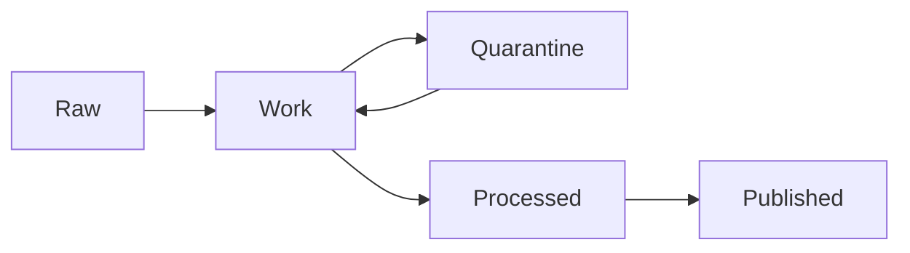

<!-- [KFM_META_BLOCK_V2]
doc_id: kfm://doc/8c0d7f7d-9cda-4a9a-9f40-6dd77b7f2e6b
title: docs/data
type: standard
version: v1
status: draft
owners: kfm-core (TODO: set real owners)
created: 2026-02-24
updated: 2026-02-24
policy_label: public
related:
  - kfm://doc/TODO
tags: [kfm, data, governance, catalog, provenance]
notes:
  - Directory-level contract for governed dataset documentation (not for storing production datasets).
[/KFM_META_BLOCK_V2] -->

# docs/data
Governed **dataset documentation** for the KFM system: metadata, schemas, QA results, provenance, and publication receipts (not bulk data).


---

## Quick navigation
- [What this folder is](#what-this-folder-is)
- [Directory contract](#directory-contract)
- [Recommended layout](#recommended-layout)
- [Data zones and promotion model](#data-zones-and-promotion-model)
- [Dataset documentation package](#dataset-documentation-package)
- [Promotion gates](#promotion-gates)
- [Templates](#templates)
- [Safety and sensitivity rules](#safety-and-sensitivity-rules)
- [Definition of done](#definition-of-done)
- [References](#references)

---

## What this folder is
This directory holds **documentation and governance artifacts about data** used by the Kansas-Matrix/KFM system.

It is designed so every user-facing claim can be traced to:
- **What the dataset is** (identity + purpose)
- **Where it came from** (sources + lineage)
- **What it looks like** (schema + examples)
- **Whether it is trustworthy** (QA checks + results)
- **Whether it is permitted** (license + sensitivity + policy decisions)
- **How it got published** (promotion receipts + checksums + run metadata)

> NOTE  
> If you need to store actual datasets, store them in the project’s governed storage zones (Raw/Work/Processed/Published). This folder stores **docs + small, safe samples only**.

[Back to top](#docsdata)

---

## Directory contract

### ✅ Acceptable inputs
- Dataset manifests (YAML/JSON) describing: id, license, sensitivity, extents, owners, provenance
- Schemas: JSON Schema, Arrow/Parquet schema JSON, SQL DDL, CSV dictionaries, etc.
- QA configs + QA reports (machine-readable) and human summaries
- Checksums and integrity records for published artifacts
- Publication receipts / run logs / audit records (sanitized, no secrets)
- Small, **non-sensitive**, representative samples (if policy allows): tiny CSV/GeoJSON snippets, synthetic data, screenshots

### ❌ Exclusions
- Bulk / production data exports (Parquet/CSV dumps, rasters, etc.)
- Secrets (API keys, tokens, connection strings, private URLs)
- Unredacted PII/PHI or other restricted personal data
- Exact coordinates for vulnerable/private/culturally restricted sites (see [Safety and sensitivity rules](#safety-and-sensitivity-rules))
- “Mystery data” without license/sensitivity/ownership metadata

[Back to top](#docsdata)

---

## Recommended layout
This README does **not** assume your current tree matches this layout. Treat this as a *target contract* and adjust to your repo realities.

```text
docs/data/
  README.md                        # You are here

  datasets/                        # One folder per dataset_id (recommended)
    <dataset_id>/
      manifest.yaml                # Required: identity, license, sensitivity, extents, owners
      schema/                      # Required: schema artifacts
        schema.json                # e.g., JSON Schema / Arrow schema / DDL
        dictionary.md              # optional: human-friendly data dictionary
      qa/                          # Required before promotion beyond Work
        checks.yaml                # validation rules + thresholds
        reports/
          2026-02-24.json          # machine-readable QA report
          2026-02-24.md            # human-readable QA summary (optional)
      provenance/                  # Required: lineage + sources
        sources.yaml               # where/how acquired; checksums; retrieval timestamps
        lineage.mmd                # mermaid or other graph format
      receipts/                    # Required for Published
        publish_2026-02-24.json    # audit record + checksums + policy decisions

  registries/
    datasets.csv                   # optional: master dataset registry (index)
    licenses.md                    # optional: license policy notes
    sensitivity.md                 # optional: classification policy notes

  samples/
    README.md                      # rules for samples
    <dataset_id>/
      sample.csv                   # tiny, policy-compliant sample
```

[Back to top](#docsdata)

---

## Data zones and promotion model
The KFM data lifecycle is modeled as:



**Intent:**
- **Raw**: acquired as-is; minimal transformation; highest provenance fidelity.
- **Work**: exploratory + cleaning; validation work happens here.
- **Quarantine**: fails checks, unclear license, unclear sensitivity, or policy-review required.
- **Processed**: validated + standardized outputs ready for repeatable use.
- **Published**: governed outputs accessible through governed APIs and used in UI/Story claims.

[Back to top](#docsdata)

---

## Dataset documentation package
Every dataset should have a **documentation package** that is complete enough to support:
- repeatable processing,
- governance review,
- publication/promotion,
- traceable story/UI claims.

### Minimum recommended files per dataset
| Artifact | Required for | Purpose |
|---|---:|---|
| `manifest.yaml` | Raw → Work | identity, ownership, license, sensitivity, extents |
| `schema/*` | Work → Processed | formal schema + dictionary |
| `qa/checks.yaml` + `qa/reports/*` | Work → Processed | thresholds + proof of validation |
| `provenance/sources.yaml` + lineage graph | Any promotion | traceability + reproducibility |
| `receipts/publish_*.json` | Processed → Published | audit record + checksums + policy decisions |

[Back to top](#docsdata)

---

## Promotion gates
Promotion gates are intended to be **fail-closed**: if required evidence is missing, promotion stops.

### Gate: Raw → Work
- [ ] Dataset identity established (dataset_id + name + purpose)
- [ ] Source recorded (where it came from, when, how)
- [ ] License recorded (or moved to Quarantine with reason)
- [ ] Sensitivity classification recorded (or moved to Quarantine with reason)
- [ ] Checksums recorded for acquired artifacts (where applicable)

### Gate: Work → Processed
- [ ] Schema finalized (machine-readable + dictionary where needed)
- [ ] QA checks defined (rules + thresholds)
- [ ] QA reports recorded (pass/fail + metrics + exceptions)
- [ ] Provenance graph updated (inputs → transforms → outputs)
- [ ] Known limitations documented (biases, gaps, known issues)

### Gate: Processed → Published
- [ ] Publication receipts present (audit record)
- [ ] Checksums for published artifacts present
- [ ] License + sensitivity confirmed for publication scope
- [ ] Access model confirmed (public/restricted) and any redactions applied
- [ ] “User-facing claim” linkage present (where this dataset is used)

[Back to top](#docsdata)

---

## Templates

### Template: `manifest.yaml`
```yaml
# docs/data/datasets/<dataset_id>/manifest.yaml

dataset_id: kfm://dataset/TODO
name: "TODO human readable name"
description: >
  TODO: one-paragraph description of what the dataset is and why it exists.

owners:
  - name: "TODO owner/team"
    contact: "TODO email or handle"
    role: "data_owner"   # e.g., data_owner, steward, producer

license:
  spdx: "TODO"           # prefer SPDX id
  url: null              # optional
  notes: "TODO any constraints / attribution requirements"

sensitivity:
  classification: "public"  # public|restricted|confidential (project policy)
  handling: >
    TODO: redaction rules, aggregation requirements, access constraints.

provenance:
  sources:
    - name: "TODO source system / provider"
      acquired_at: "2026-02-24T00:00:00Z"
      method: "TODO api|download|scrape|manual|partner_delivery"
      uri: "TODO (avoid secrets)"
      checksum_sha256: "TODO"
      license_confirmed: false

spatial:
  has_geometry: false
  crs: null
  extent:
    # IMPORTANT: if sensitive, use coarse geography and never exact coords.
    bbox: null

temporal:
  start: null
  end: null
  update_cadence: "TODO"

schema:
  primary: "./schema/schema.json"
  format: "TODO csv|parquet|geojson|sql|other"

qa:
  checks: "./qa/checks.yaml"
  latest_report: null

promotion:
  current_zone: "work"
  last_promoted_at: null
```

### Template: `qa/checks.yaml`
```yaml
# docs/data/datasets/<dataset_id>/qa/checks.yaml

version: 1
checks:
  - id: row_count_nonzero
    description: "Dataset must contain at least 1 row."
    severity: error
    rule: "row_count > 0"

  - id: null_rate_key_fields
    description: "Key fields must not exceed null threshold."
    severity: error
    fields:
      - "TODO_field_a"
      - "TODO_field_b"
    threshold: 0.01
```

### Template: `receipts/publish_YYYY-MM-DD.json`
```json
{
  "receipt_id": "kfm://receipt/TODO",
  "dataset_id": "kfm://dataset/TODO",
  "published_at": "2026-02-24T00:00:00Z",
  "published_by": "TODO",
  "inputs": [
    { "uri": "TODO", "sha256": "TODO" }
  ],
  "outputs": [
    { "uri": "TODO", "sha256": "TODO" }
  ],
  "tooling": {
    "pipeline": "TODO",
    "version": "TODO",
    "runtime": "TODO"
  },
  "policy": {
    "license": "TODO",
    "sensitivity": "public",
    "decisions": [
      "TODO policy decisions, redactions, aggregation, coordinate coarsening"
    ]
  },
  "qa": {
    "report_ref": "../qa/reports/2026-02-24.json",
    "result": "pass"
  },
  "notes": "TODO"
}
```

[Back to top](#docsdata)

---

## Safety and sensitivity rules
When in doubt: **default-deny** and route through governance review.

- Do not publish exact locations for vulnerable/private/culturally restricted sites.
  - Use aggregation, rounding, bounding regions, or tile-based generalization.
- Do not include secrets in manifests or receipts.
- If license or consent is unclear, place the dataset in **Quarantine** and document why.
- Any dataset with personal data requires explicit handling rules and a redacted sample policy.

[Back to top](#docsdata)

---

## Definition of done
A dataset doc package is “Done” when:

- [ ] `manifest.yaml` is complete (license + sensitivity not unknown)
- [ ] Schema is present and matches the processed output
- [ ] QA checks + latest report are present and reproducible
- [ ] Provenance is sufficient to re-run the pipeline
- [ ] If published: publish receipt + checksums exist
- [ ] No restricted data is exposed in documentation or samples

[Back to top](#docsdata)

---

## References
- Project reference library: **KFM Project Library Index** (PDF) — use it to locate deeper readings for GIS/cartography, data science, DevOps, etc. (Add a repo-relative link if/when you vend it in-repo.)
