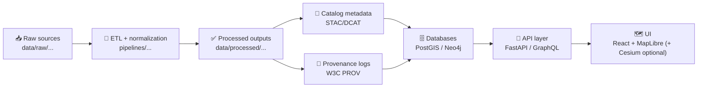

# 📚 `docs/data/` — Data Documentation Hub (Runbooks + Contracts)


Welcome to **KFM’s data documentation layer** 🧭  
This folder is the “runbook shelf” that explains **what’s in `data/`, where it came from, how it was processed, and how it’s safe to use**.

> [!IMPORTANT]
> In KFM, *data is not “upload-and-forget”*. Every dataset must be traceable and reviewed before it reaches databases, APIs, or UI.

---

## ✨ What belongs in `docs/data/`

This directory contains **human-readable** documentation for every data domain and dataset family:

- 📦 **Domain runbooks**: `docs/data/<domain>/README.md`
- 🧾 **Source notes**: where raw files came from, licenses, citations, download steps
- 🧪 **ETL notes**: how pipelines transform raw → processed (including assumptions)
- 🧱 **Schema + contracts**: required fields, geometry rules, time semantics, CRS expectations
- ✅ **QA expectations**: validations, sanity checks, known issues, and edge cases
- 🧰 **Operational playbooks**: how to refresh data, backfill years, or rebuild derived layers

> [!TIP]
> If you add a new domain under `data/raw/<domain>/...`, you should add a matching runbook folder under `docs/data/<domain>/`.

---

## 🧬 The “Truth Path” (how data becomes usable)

KFM treats data like a **pipeline–catalog–database–API–UI** system.  
This means raw files become trustworthy, explorable knowledge only after they pass through standardized stages.



> [!WARNING]
> **No skipping steps.** Anything that bypasses metadata or provenance is treated as a broken contribution.

---

## 🗂️ Where this fits in the repo

### 🔎 Data lives in `data/` (repo root)
You’ll usually work across these folders:

```text
📦 Kansas-Frontier-Matrix/
├─ 📁 data/
│  ├─ 📁 raw/           # immutable source snapshots (exact downloads/scans)
│  ├─ 📁 work/          # optional intermediate artifacts (scratch / staging)
│  ├─ 📁 processed/     # cleaned + standardized outputs (ready for KFM)
│  ├─ 📁 catalog/       # dataset discovery metadata (STAC / DCAT)
│  └─ 📁 provenance/    # lineage logs (W3C PROV-style)
└─ 📁 docs/
   └─ 📁 data/          # ✅ YOU ARE HERE: runbooks + contracts for each domain
```

> [!NOTE]
> Some modules may split catalog storage into dedicated subfolders (e.g., `data/stac/...`, `data/catalog/dcat/...`).  
> The key idea is the same: **catalog + provenance are mandatory “boundary artifacts.”**

---

## 🧩 Data types KFM expects (and recommended formats)

KFM commonly ingests **geospatial + historical** sources. Expect a mix of:

### 🗺️ Vector data (points / lines / polygons)
- Preferred: **GeoJSON** for lightweight sharing & review diffs
- Better for bigger datasets: **GeoPackage (`.gpkg`)** or **FlatGeobuf (`.fgb`)**
- Always include: geometry type, CRS, and core identifiers

### 🛰️ Raster data (grids / imagery)
- Preferred: **Cloud-Optimized GeoTIFF (COG)** for scalable map rendering
- Alternative: GeoTIFF + sidecar metadata when needed

### ⏱️ Time series + tabular
- Preferred: **Parquet** for analytical workflows
- Acceptable: CSV for smaller sources (especially if it’s “as-downloaded” raw)

### 🧠 Derived “evidence artifacts”
Outputs from OCR, models, simulations, or AI-assisted extraction are treated as **first-class datasets**:
- They must live in `data/processed/...`
- They must have catalog + provenance like everything else

---

## 🧾 Metadata requirements (catalog = discoverability)

Before a dataset is considered “published,” it needs **catalog records** describing:

- Title, summary, owner/maintainer
- Spatial extent (bbox/geometry)
- Temporal extent (date range + semantics)
- License + attribution (always)
- Links to raw sources and processing scripts
- Update cadence (if applicable)
- Sensitivity classification (if applicable)

Typical catalog patterns:
- **STAC** for geospatial discovery (items/collections)
- **DCAT** for dataset-level catalog publishing / portal alignment

> [!IMPORTANT]
> If a dataset can’t be discovered via catalog metadata, it effectively “doesn’t exist” in KFM.

---

## 🔗 Provenance requirements (lineage = trust)

Every processed dataset should have an accompanying provenance document that answers:

- **What** raw sources were used? (filenames, checksums, URLs if public)
- **How** was it produced? (pipeline script + parameters + timestamps)
- **Who/what** produced it? (agents: pipeline + operator)
- **Which outputs** were generated? (paths in `data/processed/...`)
- **What changed** vs prior versions? (if an update)

### Minimal PROV mental model
- **Entities** = inputs/outputs (raw file(s), processed file(s))
- **Activity** = pipeline execution (run + timestamp)
- **Agent** = script + person (or CI job) that produced it

> [!WARNING]
> No provenance file = **red flag**. It means the dataset cannot be audited.

---

## 🧰 Contribution workflow (adding or updating data)

Here’s the standard sequence when adding a new dataset or updating an existing one:

1. 📥 **Add raw source snapshot** under `data/raw/<domain>/...`
2. 🧪 **Run or write a pipeline** under `pipelines/<domain>/...`
3. ✅ **Write processed outputs** to `data/processed/<domain>/...`
4. 🧾 **Generate/update catalog metadata** (STAC/DCAT)
5. 🔗 **Generate/update provenance logs** (PROV)
6. 🧹 **Validate + sanity check** (geometry validity, ranges, date parsing, etc.)
7. ✅ **Commit + PR** (CI should fail if metadata/provenance is missing)

> [!TIP]
> Use small PRs. Data PRs review best when diffs are readable and the runbook is complete.

---

## 🧱 Domain runbook template (`docs/data/<domain>/README.md`)

Create a runbook per domain using a consistent outline:

```markdown
# 🧭 <Domain Name>

## Overview
- What this domain represents
- Why it exists in KFM

## Source Inventory
| Source | Type | License | Where stored (raw) | Notes |
|---|---:|---|---|---|

## Processing Pipeline
- Entry script(s)
- Key transformations (units, joins, CRS handling)
- Output dataset IDs

## Outputs (Processed)
| Dataset ID | Path | Format | Geometry | Time range |
|---|---|---:|---:|---:|

## Metadata & Provenance
- STAC/DCAT locations
- PROV location + required fields

## QA / Validation
- Checks performed
- Known failure modes

## Update Strategy
- How updates happen (append, backfill, rebuild)
- Versioning expectations

## Maintainers
- Who to contact
```

---

## ❓ FAQ (common “gotchas”)

**Q: Can I load raw data directly into PostGIS/Neo4j?**  
A: No. Raw is immutable evidence. Only processed + documented datasets are eligible.

**Q: Where should intermediate files go?**  
A: Use `data/work/<domain>/...` for scratch artifacts you don’t want treated as final datasets.

**Q: Do I really need both catalog and provenance?**  
A: Yes. Catalog = discovery; provenance = trust.

---

## 🔗 Suggested “next docs” to link from here

- `docs/architecture/system_overview.md` (end-to-end design)
- `docs/governance/` (licenses, sensitivity tiers, review rules)
- `pipelines/README.md` (how to run ETL)
- `data/README.md` (if present: canonical data layout at repo root)

---

## 📌 House rules (short version)

- 🧾 **No license → no merge**
- 🔗 **No provenance → no trust**
- 🧭 **No catalog → no discovery**
- ✅ **No validation → no confidence**
- 🧱 **No runbook → no maintainability**

---

🧠 If you’re unsure where something belongs:  
**Put evidence in `data/raw/`, publish in `data/processed/`, document it in `docs/data/`, and let CI enforce the rest.**